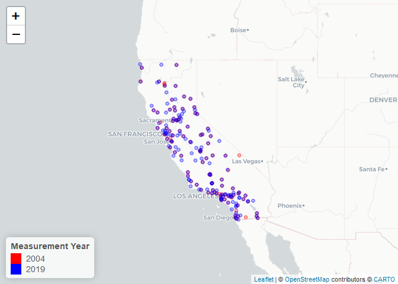
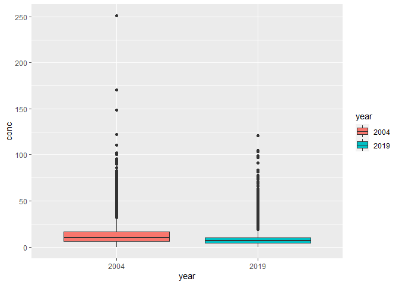
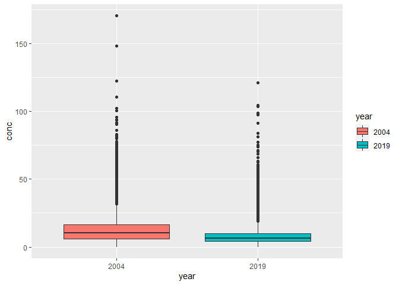
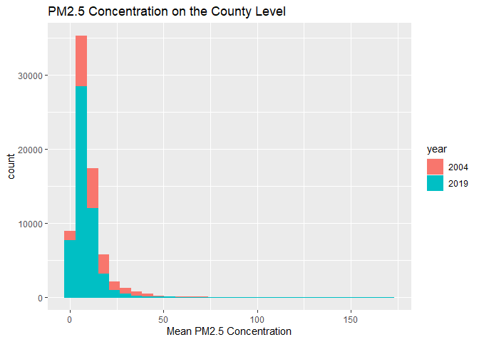

Homework_1
================
CB
2022-09-24

## R Markdown Homework 1

# Load required libraries

``` r
library(data.table)
library(lubridate)
```

    ## 
    ## Attaching package: 'lubridate'

    ## The following objects are masked from 'package:data.table':
    ## 
    ##     hour, isoweek, mday, minute, month, quarter, second, wday, week,
    ##     yday, year

    ## The following objects are masked from 'package:base':
    ## 
    ##     date, intersect, setdiff, union

``` r
library(dplyr)
```

    ## 
    ## Attaching package: 'dplyr'

    ## The following objects are masked from 'package:data.table':
    ## 
    ##     between, first, last

    ## The following objects are masked from 'package:stats':
    ## 
    ##     filter, lag

    ## The following objects are masked from 'package:base':
    ## 
    ##     intersect, setdiff, setequal, union

``` r
library(tidyverse)
```

    ## ── Attaching packages
    ## ───────────────────────────────────────
    ## tidyverse 1.3.2 ──

    ## ✔ ggplot2 3.3.6     ✔ purrr   0.3.4
    ## ✔ tibble  3.1.8     ✔ stringr 1.4.1
    ## ✔ tidyr   1.2.0     ✔ forcats 0.5.2
    ## ✔ readr   2.1.2     
    ## ── Conflicts ────────────────────────────────────────── tidyverse_conflicts() ──
    ## ✖ lubridate::as.difftime() masks base::as.difftime()
    ## ✖ dplyr::between()         masks data.table::between()
    ## ✖ lubridate::date()        masks base::date()
    ## ✖ dplyr::filter()          masks stats::filter()
    ## ✖ dplyr::first()           masks data.table::first()
    ## ✖ lubridate::hour()        masks data.table::hour()
    ## ✖ lubridate::intersect()   masks base::intersect()
    ## ✖ lubridate::isoweek()     masks data.table::isoweek()
    ## ✖ dplyr::lag()             masks stats::lag()
    ## ✖ dplyr::last()            masks data.table::last()
    ## ✖ lubridate::mday()        masks data.table::mday()
    ## ✖ lubridate::minute()      masks data.table::minute()
    ## ✖ lubridate::month()       masks data.table::month()
    ## ✖ lubridate::quarter()     masks data.table::quarter()
    ## ✖ lubridate::second()      masks data.table::second()
    ## ✖ lubridate::setdiff()     masks base::setdiff()
    ## ✖ purrr::transpose()       masks data.table::transpose()
    ## ✖ lubridate::union()       masks base::union()
    ## ✖ lubridate::wday()        masks data.table::wday()
    ## ✖ lubridate::week()        masks data.table::week()
    ## ✖ lubridate::yday()        masks data.table::yday()
    ## ✖ lubridate::year()        masks data.table::year()

``` r
library(leaflet)
library(readr)
library(stringr)
```

## Step 1

# Load the datasets into R using data.table

``` r
pm2004 <- data.table::fread("C:\\Users\\clair\\Desktop\\PM566\\PM566-HW1\\ad_viz_plotval_data.csv") 
  
pm2019 <- data.table::fread("C:\\Users\\clair\\Desktop\\PM566\\PM566-HW1\\ad_viz_plotval_data2019.csv") 
```

# Check the dimensions of the 2004 data

``` r
dim(pm2004)
```

    ## [1] 19233    20

# Check the dimensions of the 2019 data

``` r
dim(pm2019)
```

    ## [1] 53156    20

# Check the headers and footers

``` r
head(pm2004)
```

    ##        Date Source  Site ID POC Daily Mean PM2.5 Concentration    UNITS
    ## 1: 1/1/2004    AQS 60010007   1                            8.9 ug/m3 LC
    ## 2: 1/2/2004    AQS 60010007   1                           12.2 ug/m3 LC
    ## 3: 1/3/2004    AQS 60010007   1                           16.5 ug/m3 LC
    ## 4: 1/4/2004    AQS 60010007   1                           18.1 ug/m3 LC
    ## 5: 1/5/2004    AQS 60010007   1                           11.5 ug/m3 LC
    ## 6: 1/6/2004    AQS 60010007   1                           32.5 ug/m3 LC
    ##    DAILY_AQI_VALUE Site Name DAILY_OBS_COUNT PERCENT_COMPLETE
    ## 1:              37 Livermore               1              100
    ## 2:              51 Livermore               1              100
    ## 3:              60 Livermore               1              100
    ## 4:              64 Livermore               1              100
    ## 5:              48 Livermore               1              100
    ## 6:              94 Livermore               1              100
    ##    AQS_PARAMETER_CODE                     AQS_PARAMETER_DESC CBSA_CODE
    ## 1:              88101               PM2.5 - Local Conditions     41860
    ## 2:              88502 Acceptable PM2.5 AQI & Speciation Mass     41860
    ## 3:              88502 Acceptable PM2.5 AQI & Speciation Mass     41860
    ## 4:              88101               PM2.5 - Local Conditions     41860
    ## 5:              88502 Acceptable PM2.5 AQI & Speciation Mass     41860
    ## 6:              88502 Acceptable PM2.5 AQI & Speciation Mass     41860
    ##                            CBSA_NAME STATE_CODE      STATE COUNTY_CODE  COUNTY
    ## 1: San Francisco-Oakland-Hayward, CA          6 California           1 Alameda
    ## 2: San Francisco-Oakland-Hayward, CA          6 California           1 Alameda
    ## 3: San Francisco-Oakland-Hayward, CA          6 California           1 Alameda
    ## 4: San Francisco-Oakland-Hayward, CA          6 California           1 Alameda
    ## 5: San Francisco-Oakland-Hayward, CA          6 California           1 Alameda
    ## 6: San Francisco-Oakland-Hayward, CA          6 California           1 Alameda
    ##    SITE_LATITUDE SITE_LONGITUDE
    ## 1:      37.68753      -121.7842
    ## 2:      37.68753      -121.7842
    ## 3:      37.68753      -121.7842
    ## 4:      37.68753      -121.7842
    ## 5:      37.68753      -121.7842
    ## 6:      37.68753      -121.7842

``` r
tail(pm2004)
```

    ##          Date Source  Site ID POC Daily Mean PM2.5 Concentration    UNITS
    ## 1: 12/14/2004    AQS 61131003   1                             11 ug/m3 LC
    ## 2: 12/17/2004    AQS 61131003   1                             16 ug/m3 LC
    ## 3: 12/20/2004    AQS 61131003   1                             17 ug/m3 LC
    ## 4: 12/23/2004    AQS 61131003   1                              9 ug/m3 LC
    ## 5: 12/26/2004    AQS 61131003   1                             24 ug/m3 LC
    ## 6: 12/29/2004    AQS 61131003   1                              9 ug/m3 LC
    ##    DAILY_AQI_VALUE            Site Name DAILY_OBS_COUNT PERCENT_COMPLETE
    ## 1:              46 Woodland-Gibson Road               1              100
    ## 2:              59 Woodland-Gibson Road               1              100
    ## 3:              61 Woodland-Gibson Road               1              100
    ## 4:              38 Woodland-Gibson Road               1              100
    ## 5:              76 Woodland-Gibson Road               1              100
    ## 6:              38 Woodland-Gibson Road               1              100
    ##    AQS_PARAMETER_CODE       AQS_PARAMETER_DESC CBSA_CODE
    ## 1:              88101 PM2.5 - Local Conditions     40900
    ## 2:              88101 PM2.5 - Local Conditions     40900
    ## 3:              88101 PM2.5 - Local Conditions     40900
    ## 4:              88101 PM2.5 - Local Conditions     40900
    ## 5:              88101 PM2.5 - Local Conditions     40900
    ## 6:              88101 PM2.5 - Local Conditions     40900
    ##                                  CBSA_NAME STATE_CODE      STATE COUNTY_CODE
    ## 1: Sacramento--Roseville--Arden-Arcade, CA          6 California         113
    ## 2: Sacramento--Roseville--Arden-Arcade, CA          6 California         113
    ## 3: Sacramento--Roseville--Arden-Arcade, CA          6 California         113
    ## 4: Sacramento--Roseville--Arden-Arcade, CA          6 California         113
    ## 5: Sacramento--Roseville--Arden-Arcade, CA          6 California         113
    ## 6: Sacramento--Roseville--Arden-Arcade, CA          6 California         113
    ##    COUNTY SITE_LATITUDE SITE_LONGITUDE
    ## 1:   Yolo      38.66121      -121.7327
    ## 2:   Yolo      38.66121      -121.7327
    ## 3:   Yolo      38.66121      -121.7327
    ## 4:   Yolo      38.66121      -121.7327
    ## 5:   Yolo      38.66121      -121.7327
    ## 6:   Yolo      38.66121      -121.7327

``` r
head(pm2019)
```

    ##        Date Source  Site ID POC Daily Mean PM2.5 Concentration    UNITS
    ## 1: 1/1/2019    AQS 60010007   3                            5.7 ug/m3 LC
    ## 2: 1/2/2019    AQS 60010007   3                           11.9 ug/m3 LC
    ## 3: 1/3/2019    AQS 60010007   3                           20.1 ug/m3 LC
    ## 4: 1/4/2019    AQS 60010007   3                           28.8 ug/m3 LC
    ## 5: 1/5/2019    AQS 60010007   3                           11.2 ug/m3 LC
    ## 6: 1/6/2019    AQS 60010007   3                            2.7 ug/m3 LC
    ##    DAILY_AQI_VALUE Site Name DAILY_OBS_COUNT PERCENT_COMPLETE
    ## 1:              24 Livermore               1              100
    ## 2:              50 Livermore               1              100
    ## 3:              68 Livermore               1              100
    ## 4:              86 Livermore               1              100
    ## 5:              47 Livermore               1              100
    ## 6:              11 Livermore               1              100
    ##    AQS_PARAMETER_CODE       AQS_PARAMETER_DESC CBSA_CODE
    ## 1:              88101 PM2.5 - Local Conditions     41860
    ## 2:              88101 PM2.5 - Local Conditions     41860
    ## 3:              88101 PM2.5 - Local Conditions     41860
    ## 4:              88101 PM2.5 - Local Conditions     41860
    ## 5:              88101 PM2.5 - Local Conditions     41860
    ## 6:              88101 PM2.5 - Local Conditions     41860
    ##                            CBSA_NAME STATE_CODE      STATE COUNTY_CODE  COUNTY
    ## 1: San Francisco-Oakland-Hayward, CA          6 California           1 Alameda
    ## 2: San Francisco-Oakland-Hayward, CA          6 California           1 Alameda
    ## 3: San Francisco-Oakland-Hayward, CA          6 California           1 Alameda
    ## 4: San Francisco-Oakland-Hayward, CA          6 California           1 Alameda
    ## 5: San Francisco-Oakland-Hayward, CA          6 California           1 Alameda
    ## 6: San Francisco-Oakland-Hayward, CA          6 California           1 Alameda
    ##    SITE_LATITUDE SITE_LONGITUDE
    ## 1:      37.68753      -121.7842
    ## 2:      37.68753      -121.7842
    ## 3:      37.68753      -121.7842
    ## 4:      37.68753      -121.7842
    ## 5:      37.68753      -121.7842
    ## 6:      37.68753      -121.7842

``` r
tail(pm2019)
```

    ##          Date Source  Site ID POC Daily Mean PM2.5 Concentration    UNITS
    ## 1: 11/11/2019    AQS 61131003   1                           13.5 ug/m3 LC
    ## 2: 11/17/2019    AQS 61131003   1                           18.1 ug/m3 LC
    ## 3: 11/29/2019    AQS 61131003   1                           12.5 ug/m3 LC
    ## 4: 12/17/2019    AQS 61131003   1                           23.8 ug/m3 LC
    ## 5: 12/23/2019    AQS 61131003   1                            1.0 ug/m3 LC
    ## 6: 12/29/2019    AQS 61131003   1                            9.1 ug/m3 LC
    ##    DAILY_AQI_VALUE            Site Name DAILY_OBS_COUNT PERCENT_COMPLETE
    ## 1:              54 Woodland-Gibson Road               1              100
    ## 2:              64 Woodland-Gibson Road               1              100
    ## 3:              52 Woodland-Gibson Road               1              100
    ## 4:              76 Woodland-Gibson Road               1              100
    ## 5:               4 Woodland-Gibson Road               1              100
    ## 6:              38 Woodland-Gibson Road               1              100
    ##    AQS_PARAMETER_CODE       AQS_PARAMETER_DESC CBSA_CODE
    ## 1:              88101 PM2.5 - Local Conditions     40900
    ## 2:              88101 PM2.5 - Local Conditions     40900
    ## 3:              88101 PM2.5 - Local Conditions     40900
    ## 4:              88101 PM2.5 - Local Conditions     40900
    ## 5:              88101 PM2.5 - Local Conditions     40900
    ## 6:              88101 PM2.5 - Local Conditions     40900
    ##                                  CBSA_NAME STATE_CODE      STATE COUNTY_CODE
    ## 1: Sacramento--Roseville--Arden-Arcade, CA          6 California         113
    ## 2: Sacramento--Roseville--Arden-Arcade, CA          6 California         113
    ## 3: Sacramento--Roseville--Arden-Arcade, CA          6 California         113
    ## 4: Sacramento--Roseville--Arden-Arcade, CA          6 California         113
    ## 5: Sacramento--Roseville--Arden-Arcade, CA          6 California         113
    ## 6: Sacramento--Roseville--Arden-Arcade, CA          6 California         113
    ##    COUNTY SITE_LATITUDE SITE_LONGITUDE
    ## 1:   Yolo      38.66121      -121.7327
    ## 2:   Yolo      38.66121      -121.7327
    ## 3:   Yolo      38.66121      -121.7327
    ## 4:   Yolo      38.66121      -121.7327
    ## 5:   Yolo      38.66121      -121.7327
    ## 6:   Yolo      38.66121      -121.7327

# Check the variable names and variable types for 2004 data

``` r
str(pm2004)
```

    ## Classes 'data.table' and 'data.frame':   19233 obs. of  20 variables:
    ##  $ Date                          : chr  "1/1/2004" "1/2/2004" "1/3/2004" "1/4/2004" ...
    ##  $ Source                        : chr  "AQS" "AQS" "AQS" "AQS" ...
    ##  $ Site ID                       : int  60010007 60010007 60010007 60010007 60010007 60010007 60010007 60010007 60010007 60010007 ...
    ##  $ POC                           : int  1 1 1 1 1 1 1 1 1 1 ...
    ##  $ Daily Mean PM2.5 Concentration: num  8.9 12.2 16.5 18.1 11.5 32.5 14 29.9 21 15.7 ...
    ##  $ UNITS                         : chr  "ug/m3 LC" "ug/m3 LC" "ug/m3 LC" "ug/m3 LC" ...
    ##  $ DAILY_AQI_VALUE               : int  37 51 60 64 48 94 55 88 70 59 ...
    ##  $ Site Name                     : chr  "Livermore" "Livermore" "Livermore" "Livermore" ...
    ##  $ DAILY_OBS_COUNT               : int  1 1 1 1 1 1 1 1 1 1 ...
    ##  $ PERCENT_COMPLETE              : int  100 100 100 100 100 100 100 100 100 100 ...
    ##  $ AQS_PARAMETER_CODE            : int  88101 88502 88502 88101 88502 88502 88101 88502 88502 88101 ...
    ##  $ AQS_PARAMETER_DESC            : chr  "PM2.5 - Local Conditions" "Acceptable PM2.5 AQI & Speciation Mass" "Acceptable PM2.5 AQI & Speciation Mass" "PM2.5 - Local Conditions" ...
    ##  $ CBSA_CODE                     : int  41860 41860 41860 41860 41860 41860 41860 41860 41860 41860 ...
    ##  $ CBSA_NAME                     : chr  "San Francisco-Oakland-Hayward, CA" "San Francisco-Oakland-Hayward, CA" "San Francisco-Oakland-Hayward, CA" "San Francisco-Oakland-Hayward, CA" ...
    ##  $ STATE_CODE                    : int  6 6 6 6 6 6 6 6 6 6 ...
    ##  $ STATE                         : chr  "California" "California" "California" "California" ...
    ##  $ COUNTY_CODE                   : int  1 1 1 1 1 1 1 1 1 1 ...
    ##  $ COUNTY                        : chr  "Alameda" "Alameda" "Alameda" "Alameda" ...
    ##  $ SITE_LATITUDE                 : num  37.7 37.7 37.7 37.7 37.7 ...
    ##  $ SITE_LONGITUDE                : num  -122 -122 -122 -122 -122 ...
    ##  - attr(*, ".internal.selfref")=<externalptr>

# Check the variable names and variable types for 2019 data

``` r
str(pm2019)
```

    ## Classes 'data.table' and 'data.frame':   53156 obs. of  20 variables:
    ##  $ Date                          : chr  "1/1/2019" "1/2/2019" "1/3/2019" "1/4/2019" ...
    ##  $ Source                        : chr  "AQS" "AQS" "AQS" "AQS" ...
    ##  $ Site ID                       : int  60010007 60010007 60010007 60010007 60010007 60010007 60010007 60010007 60010007 60010007 ...
    ##  $ POC                           : int  3 3 3 3 3 3 3 3 3 3 ...
    ##  $ Daily Mean PM2.5 Concentration: num  5.7 11.9 20.1 28.8 11.2 2.7 2.8 7 3.1 7.1 ...
    ##  $ UNITS                         : chr  "ug/m3 LC" "ug/m3 LC" "ug/m3 LC" "ug/m3 LC" ...
    ##  $ DAILY_AQI_VALUE               : int  24 50 68 86 47 11 12 29 13 30 ...
    ##  $ Site Name                     : chr  "Livermore" "Livermore" "Livermore" "Livermore" ...
    ##  $ DAILY_OBS_COUNT               : int  1 1 1 1 1 1 1 1 1 1 ...
    ##  $ PERCENT_COMPLETE              : int  100 100 100 100 100 100 100 100 100 100 ...
    ##  $ AQS_PARAMETER_CODE            : int  88101 88101 88101 88101 88101 88101 88101 88101 88101 88101 ...
    ##  $ AQS_PARAMETER_DESC            : chr  "PM2.5 - Local Conditions" "PM2.5 - Local Conditions" "PM2.5 - Local Conditions" "PM2.5 - Local Conditions" ...
    ##  $ CBSA_CODE                     : int  41860 41860 41860 41860 41860 41860 41860 41860 41860 41860 ...
    ##  $ CBSA_NAME                     : chr  "San Francisco-Oakland-Hayward, CA" "San Francisco-Oakland-Hayward, CA" "San Francisco-Oakland-Hayward, CA" "San Francisco-Oakland-Hayward, CA" ...
    ##  $ STATE_CODE                    : int  6 6 6 6 6 6 6 6 6 6 ...
    ##  $ STATE                         : chr  "California" "California" "California" "California" ...
    ##  $ COUNTY_CODE                   : int  1 1 1 1 1 1 1 1 1 1 ...
    ##  $ COUNTY                        : chr  "Alameda" "Alameda" "Alameda" "Alameda" ...
    ##  $ SITE_LATITUDE                 : num  37.7 37.7 37.7 37.7 37.7 ...
    ##  $ SITE_LONGITUDE                : num  -122 -122 -122 -122 -122 ...
    ##  - attr(*, ".internal.selfref")=<externalptr>

\#*There are the same number of variables (20) and variable names in the
two datasets. The 2019 dataset has a lot more observations however than
2004*

# Are there any missing values for our variable of interest?

``` r
mean(is.na(pm2004$`Daily Mean PM2.5 Concentration`))
```

    ## [1] 0

``` r
mean(is.na(pm2019$`Daily Mean PM2.5 Concentration`))
```

    ## [1] 0

\#*There do not appear to be missing values for our variable of interest
in either year.*

## Step 2

# Combine the two years of data into one data frame

``` r
pm <- rbind(pm2004, pm2019)
dim(pm)
```

    ## [1] 72389    20

\#*This number of rows 72389 looks correct, 19233 + 53156 = 72389*

## Create a new variable for year.

# First, subset the last four characters from the Date variable for our year variable using the stringr package. Then check the head and tail of our dataset to be sure both 2004 and 2019 data are represented correctly.

``` r
pm<- mutate(pm, year=str_sub(pm$Date,-4, -1))
head(pm)
```

    ##        Date Source  Site ID POC Daily Mean PM2.5 Concentration    UNITS
    ## 1: 1/1/2004    AQS 60010007   1                            8.9 ug/m3 LC
    ## 2: 1/2/2004    AQS 60010007   1                           12.2 ug/m3 LC
    ## 3: 1/3/2004    AQS 60010007   1                           16.5 ug/m3 LC
    ## 4: 1/4/2004    AQS 60010007   1                           18.1 ug/m3 LC
    ## 5: 1/5/2004    AQS 60010007   1                           11.5 ug/m3 LC
    ## 6: 1/6/2004    AQS 60010007   1                           32.5 ug/m3 LC
    ##    DAILY_AQI_VALUE Site Name DAILY_OBS_COUNT PERCENT_COMPLETE
    ## 1:              37 Livermore               1              100
    ## 2:              51 Livermore               1              100
    ## 3:              60 Livermore               1              100
    ## 4:              64 Livermore               1              100
    ## 5:              48 Livermore               1              100
    ## 6:              94 Livermore               1              100
    ##    AQS_PARAMETER_CODE                     AQS_PARAMETER_DESC CBSA_CODE
    ## 1:              88101               PM2.5 - Local Conditions     41860
    ## 2:              88502 Acceptable PM2.5 AQI & Speciation Mass     41860
    ## 3:              88502 Acceptable PM2.5 AQI & Speciation Mass     41860
    ## 4:              88101               PM2.5 - Local Conditions     41860
    ## 5:              88502 Acceptable PM2.5 AQI & Speciation Mass     41860
    ## 6:              88502 Acceptable PM2.5 AQI & Speciation Mass     41860
    ##                            CBSA_NAME STATE_CODE      STATE COUNTY_CODE  COUNTY
    ## 1: San Francisco-Oakland-Hayward, CA          6 California           1 Alameda
    ## 2: San Francisco-Oakland-Hayward, CA          6 California           1 Alameda
    ## 3: San Francisco-Oakland-Hayward, CA          6 California           1 Alameda
    ## 4: San Francisco-Oakland-Hayward, CA          6 California           1 Alameda
    ## 5: San Francisco-Oakland-Hayward, CA          6 California           1 Alameda
    ## 6: San Francisco-Oakland-Hayward, CA          6 California           1 Alameda
    ##    SITE_LATITUDE SITE_LONGITUDE year
    ## 1:      37.68753      -121.7842 2004
    ## 2:      37.68753      -121.7842 2004
    ## 3:      37.68753      -121.7842 2004
    ## 4:      37.68753      -121.7842 2004
    ## 5:      37.68753      -121.7842 2004
    ## 6:      37.68753      -121.7842 2004

``` r
tail(pm)
```

    ##          Date Source  Site ID POC Daily Mean PM2.5 Concentration    UNITS
    ## 1: 11/11/2019    AQS 61131003   1                           13.5 ug/m3 LC
    ## 2: 11/17/2019    AQS 61131003   1                           18.1 ug/m3 LC
    ## 3: 11/29/2019    AQS 61131003   1                           12.5 ug/m3 LC
    ## 4: 12/17/2019    AQS 61131003   1                           23.8 ug/m3 LC
    ## 5: 12/23/2019    AQS 61131003   1                            1.0 ug/m3 LC
    ## 6: 12/29/2019    AQS 61131003   1                            9.1 ug/m3 LC
    ##    DAILY_AQI_VALUE            Site Name DAILY_OBS_COUNT PERCENT_COMPLETE
    ## 1:              54 Woodland-Gibson Road               1              100
    ## 2:              64 Woodland-Gibson Road               1              100
    ## 3:              52 Woodland-Gibson Road               1              100
    ## 4:              76 Woodland-Gibson Road               1              100
    ## 5:               4 Woodland-Gibson Road               1              100
    ## 6:              38 Woodland-Gibson Road               1              100
    ##    AQS_PARAMETER_CODE       AQS_PARAMETER_DESC CBSA_CODE
    ## 1:              88101 PM2.5 - Local Conditions     40900
    ## 2:              88101 PM2.5 - Local Conditions     40900
    ## 3:              88101 PM2.5 - Local Conditions     40900
    ## 4:              88101 PM2.5 - Local Conditions     40900
    ## 5:              88101 PM2.5 - Local Conditions     40900
    ## 6:              88101 PM2.5 - Local Conditions     40900
    ##                                  CBSA_NAME STATE_CODE      STATE COUNTY_CODE
    ## 1: Sacramento--Roseville--Arden-Arcade, CA          6 California         113
    ## 2: Sacramento--Roseville--Arden-Arcade, CA          6 California         113
    ## 3: Sacramento--Roseville--Arden-Arcade, CA          6 California         113
    ## 4: Sacramento--Roseville--Arden-Arcade, CA          6 California         113
    ## 5: Sacramento--Roseville--Arden-Arcade, CA          6 California         113
    ## 6: Sacramento--Roseville--Arden-Arcade, CA          6 California         113
    ##    COUNTY SITE_LATITUDE SITE_LONGITUDE year
    ## 1:   Yolo      38.66121      -121.7327 2019
    ## 2:   Yolo      38.66121      -121.7327 2019
    ## 3:   Yolo      38.66121      -121.7327 2019
    ## 4:   Yolo      38.66121      -121.7327 2019
    ## 5:   Yolo      38.66121      -121.7327 2019
    ## 6:   Yolo      38.66121      -121.7327 2019

\#*Year variable matches the Date variable. Now there are 21 columns in
my dataset*

# Rename the PM2.5 concentration variable to something easier to workwith, will use “conc”

``` r
pm<- rename(pm, 'conc' = 'Daily Mean PM2.5 Concentration')
head(pm)
```

    ##        Date Source  Site ID POC conc    UNITS DAILY_AQI_VALUE Site Name
    ## 1: 1/1/2004    AQS 60010007   1  8.9 ug/m3 LC              37 Livermore
    ## 2: 1/2/2004    AQS 60010007   1 12.2 ug/m3 LC              51 Livermore
    ## 3: 1/3/2004    AQS 60010007   1 16.5 ug/m3 LC              60 Livermore
    ## 4: 1/4/2004    AQS 60010007   1 18.1 ug/m3 LC              64 Livermore
    ## 5: 1/5/2004    AQS 60010007   1 11.5 ug/m3 LC              48 Livermore
    ## 6: 1/6/2004    AQS 60010007   1 32.5 ug/m3 LC              94 Livermore
    ##    DAILY_OBS_COUNT PERCENT_COMPLETE AQS_PARAMETER_CODE
    ## 1:               1              100              88101
    ## 2:               1              100              88502
    ## 3:               1              100              88502
    ## 4:               1              100              88101
    ## 5:               1              100              88502
    ## 6:               1              100              88502
    ##                        AQS_PARAMETER_DESC CBSA_CODE
    ## 1:               PM2.5 - Local Conditions     41860
    ## 2: Acceptable PM2.5 AQI & Speciation Mass     41860
    ## 3: Acceptable PM2.5 AQI & Speciation Mass     41860
    ## 4:               PM2.5 - Local Conditions     41860
    ## 5: Acceptable PM2.5 AQI & Speciation Mass     41860
    ## 6: Acceptable PM2.5 AQI & Speciation Mass     41860
    ##                            CBSA_NAME STATE_CODE      STATE COUNTY_CODE  COUNTY
    ## 1: San Francisco-Oakland-Hayward, CA          6 California           1 Alameda
    ## 2: San Francisco-Oakland-Hayward, CA          6 California           1 Alameda
    ## 3: San Francisco-Oakland-Hayward, CA          6 California           1 Alameda
    ## 4: San Francisco-Oakland-Hayward, CA          6 California           1 Alameda
    ## 5: San Francisco-Oakland-Hayward, CA          6 California           1 Alameda
    ## 6: San Francisco-Oakland-Hayward, CA          6 California           1 Alameda
    ##    SITE_LATITUDE SITE_LONGITUDE year
    ## 1:      37.68753      -121.7842 2004
    ## 2:      37.68753      -121.7842 2004
    ## 3:      37.68753      -121.7842 2004
    ## 4:      37.68753      -121.7842 2004
    ## 5:      37.68753      -121.7842 2004
    ## 6:      37.68753      -121.7842 2004

## Step 3 - Create a map in leaflet showing locations of the sites

# Get the unique latitudes and longitudes

``` r
pm_locations <- (unique(pm[,c("SITE_LATITUDE","SITE_LONGITUDE", "year")]))  
dim(pm_locations)
```

    ## [1] 266   3

# Generate color palette

``` r
pal1 <- colorFactor(c('red','blue'), domain=pm_locations$year)
```

# Create map

``` r
leaflet(pm_locations) %>% 
  addProviderTiles('CartoDB.Positron') %>% 
  addCircles(lat = ~SITE_LATITUDE, lng = ~SITE_LONGITUDE, color = ~ pal1(year), opacity = 0.5, fillOpacity = 0.25, radius = 2500) %>%

  addLegend('bottomleft', pal=pal1, values=pm_locations$year,
          title='Measurement Year', opacity=1)
```

<!-- -->

\#*The dark purple dots are where a site was measured in both years 2004
and 2019. It looks like there are a lot of new sites in the 2019 data
set. These new sites appear well spread out between north and south and
populous/less populous areas of the state. There are just a few sites
from 2004 (maybe around 8 red dots) that were not included in the 2019
dataset.*

## Step 4 Check for missing or implausible values of PM2.5

``` r
mean(is.na(pm$conc))
```

    ## [1] 0

\#*No missing values for PM2.5*

# Examine proportions and look for implausible values

``` r
summary(pm$conc)
```

    ##    Min. 1st Qu.  Median    Mean 3rd Qu.    Max. 
    ##  -2.200   4.400   7.200   9.172  11.300 251.000

\#*There are appears to be some negative values in the data which there
shouldn’t be. Zero should be lowest value.*

# Examine implausible values more closely - Do these relate to the pairing of the two years at the site level? First, create a new dataset called “explore” with only the implausible values, ie the negative values

``` r
explore <-subset(pm, pm$conc<0)
dim(explore)
```

    ## [1] 283  21

\#*There are 283 observations that are negative PM2.5 values. Lets see
how many of these are from 2004 vs 2019 and then examine by site.*

``` r
explore %>% count(year)
```

    ##    year   n
    ## 1: 2004   1
    ## 2: 2019 282

\#*Nearly all of the implausible values are from 2019, only one is from
2004*

# Examine implausible values by site

``` r
explore <- rename(explore, Site_ID='Site ID')
explore %>% count(Site_ID)
```

    ##      Site_ID   n
    ##  1: 60010011   1
    ##  2: 60010012   1
    ##  3: 60070008   2
    ##  4: 60072002   2
    ##  5: 60130002   2
    ##  6: 60190500   4
    ##  7: 60192008   2
    ##  8: 60192009   1
    ##  9: 60199000   1
    ## 10: 60290018   5
    ## 11: 60292009   4
    ## 12: 60379033   3
    ## 13: 60450006   4
    ## 14: 60452002   2
    ## 15: 60530002   1
    ## 16: 60531003   5
    ## 17: 60610003   1
    ## 18: 60610004   2
    ## 19: 60611004 153
    ## 20: 60650009   3
    ## 21: 60651016   1
    ## 22: 60658001   1
    ## 23: 60659001  30
    ## 24: 60670006   1
    ## 25: 60670012   2
    ## 26: 60675003   2
    ## 27: 60711004   2
    ## 28: 60731008   2
    ## 29: 60772010   1
    ## 30: 60792007   9
    ## 31: 60798002   2
    ## 32: 60811001   1
    ## 33: 60831008   2
    ## 34: 60832004  12
    ## 35: 60832011   2
    ## 36: 61030007   4
    ## 37: 61050002   2
    ## 38: 61110007   1
    ## 39: 61110009   5
    ## 40: 61112002   1
    ## 41: 61113001   1
    ##      Site_ID   n

``` r
#Look at observations from the two sites with the most implausible values 
explore %>% filter_all(any_vars(. %in% c(60611004, 60659001)))
```

    ##            Date Source  Site_ID POC conc    UNITS DAILY_AQI_VALUE
    ##   1:   3/1/2019    AQS 60611004   3 -1.9 ug/m3 LC               0
    ##   2:   3/2/2019    AQS 60611004   3 -2.0 ug/m3 LC               0
    ##   3:   3/3/2019    AQS 60611004   3 -1.9 ug/m3 LC               0
    ##   4:   3/4/2019    AQS 60611004   3 -1.9 ug/m3 LC               0
    ##   5:   3/5/2019    AQS 60611004   3 -2.0 ug/m3 LC               0
    ##  ---                                                             
    ## 179:  12/8/2019    AQS 60659001   3 -0.8 ug/m3 LC               0
    ## 180: 12/16/2019    AQS 60659001   3 -0.4 ug/m3 LC               0
    ## 181: 12/17/2019    AQS 60659001   3 -1.6 ug/m3 LC               0
    ## 182: 12/26/2019    AQS 60659001   3 -0.4 ug/m3 LC               0
    ## 183: 12/31/2019    AQS 60659001   3 -1.1 ug/m3 LC               0
    ##                     Site Name DAILY_OBS_COUNT PERCENT_COMPLETE
    ##   1: Tahoe City-Fairway Drive               1              100
    ##   2: Tahoe City-Fairway Drive               1              100
    ##   3: Tahoe City-Fairway Drive               1              100
    ##   4: Tahoe City-Fairway Drive               1              100
    ##   5: Tahoe City-Fairway Drive               1              100
    ##  ---                                                          
    ## 179:            Lake Elsinore               1              100
    ## 180:            Lake Elsinore               1              100
    ## 181:            Lake Elsinore               1              100
    ## 182:            Lake Elsinore               1              100
    ## 183:            Lake Elsinore               1              100
    ##      AQS_PARAMETER_CODE                     AQS_PARAMETER_DESC CBSA_CODE
    ##   1:              88502 Acceptable PM2.5 AQI & Speciation Mass     40900
    ##   2:              88502 Acceptable PM2.5 AQI & Speciation Mass     40900
    ##   3:              88502 Acceptable PM2.5 AQI & Speciation Mass     40900
    ##   4:              88502 Acceptable PM2.5 AQI & Speciation Mass     40900
    ##   5:              88502 Acceptable PM2.5 AQI & Speciation Mass     40900
    ##  ---                                                                    
    ## 179:              88502 Acceptable PM2.5 AQI & Speciation Mass     40140
    ## 180:              88502 Acceptable PM2.5 AQI & Speciation Mass     40140
    ## 181:              88502 Acceptable PM2.5 AQI & Speciation Mass     40140
    ## 182:              88502 Acceptable PM2.5 AQI & Speciation Mass     40140
    ## 183:              88502 Acceptable PM2.5 AQI & Speciation Mass     40140
    ##                                    CBSA_NAME STATE_CODE      STATE COUNTY_CODE
    ##   1: Sacramento--Roseville--Arden-Arcade, CA          6 California          61
    ##   2: Sacramento--Roseville--Arden-Arcade, CA          6 California          61
    ##   3: Sacramento--Roseville--Arden-Arcade, CA          6 California          61
    ##   4: Sacramento--Roseville--Arden-Arcade, CA          6 California          61
    ##   5: Sacramento--Roseville--Arden-Arcade, CA          6 California          61
    ##  ---                                                                          
    ## 179:    Riverside-San Bernardino-Ontario, CA          6 California          65
    ## 180:    Riverside-San Bernardino-Ontario, CA          6 California          65
    ## 181:    Riverside-San Bernardino-Ontario, CA          6 California          65
    ## 182:    Riverside-San Bernardino-Ontario, CA          6 California          65
    ## 183:    Riverside-San Bernardino-Ontario, CA          6 California          65
    ##         COUNTY SITE_LATITUDE SITE_LONGITUDE year
    ##   1:    Placer      39.16602      -120.1488 2019
    ##   2:    Placer      39.16602      -120.1488 2019
    ##   3:    Placer      39.16602      -120.1488 2019
    ##   4:    Placer      39.16602      -120.1488 2019
    ##   5:    Placer      39.16602      -120.1488 2019
    ##  ---                                            
    ## 179: Riverside      33.67649      -117.3310 2019
    ## 180: Riverside      33.67649      -117.3310 2019
    ## 181: Riverside      33.67649      -117.3310 2019
    ## 182: Riverside      33.67649      -117.3310 2019
    ## 183: Riverside      33.67649      -117.3310 2019

\#*There are 41 unique sites with implausible values spread among them.
Site 60611004 however has by far the most implausible values in the
dataset at 153.This is in Tahoe City. Lake Elisnore is the site with the
second most at 30 implausible observations. In total 183/283 (65%)
implausible observations are from one of these two sites.*

## Step 5 Examine the primary question using plots

# Make the negative values into NA so they are not included in our calculation

``` r
pm[pm$conc< 0] <- NA
summary(pm$conc)
```

    ##    Min. 1st Qu.  Median    Mean 3rd Qu.    Max.    NA's 
    ##   0.000   4.400   7.300   9.211  11.300 251.000     283

# Create a boxplot of PM2.5 concentration comparing 2004 to 2019

``` r
pm [!is.na(year)]%>% 
  ggplot()+
  geom_boxplot(mapping=aes(x=year, y=conc, fill=year))
```

<!-- -->

\#*The outlier 250 value is making the Y axis too big and so its harder
to see the pattern between 2004 and 2019. Will remove this one outlier
from the dataset*

``` r
pm[pm$conc>250] <- NA
summary(pm$conc)
```

    ##    Min. 1st Qu.  Median    Mean 3rd Qu.    Max.    NA's 
    ##   0.000   4.400   7.300   9.208  11.300 170.400     284

\#Now rerun the boxplot graph ♣

``` r
pm [!is.na(year)]%>% 
  ggplot()+
  geom_boxplot(mapping=aes(x=year, y=conc, fill=year))
```

<!-- --> \#*Looks
better, easier to tell that overall trend for PM2.5 is down between the
two years*

# Summary statistics for 2004, remove negative values first

``` r
pm2004[pm2004$`Daily Mean PM2.5 Concentration`< 0] <- NA
summary(pm2004$`Daily Mean PM2.5 Concentration`)
```

    ##    Min. 1st Qu.  Median    Mean 3rd Qu.    Max.    NA's 
    ##    0.00    6.00   10.10   13.13   16.30  251.00       1

# Summary statistics for 2019, remove negative values first

``` r
pm2019[pm2019$`Daily Mean PM2.5 Concentration`< 0] <- NA
summary(pm2019$`Daily Mean PM2.5 Concentration`)
```

    ##    Min. 1st Qu.  Median    Mean 3rd Qu.    Max.    NA's 
    ##   0.000   4.000   6.500   7.787  10.000 120.900     282

\#*We can see that the mean for 2004 for PM2.5 was 13.13, and this was
down in 2019 to 7.787, so PM2.5 concentration statewide is decreasing.
This is an approximately 40% decrease over the 15 year period.*

# Examine change on the county level using a histogram plot

``` r
# Find averages for PM2.5 concentration by county
#conc variable isnt found, no idea why
```

\#Create PLOT

``` r
ggplot(pm) + 
  geom_histogram(mapping = aes(x = conc, color=year, fill=year, bin=1, binwidth=100))+
  labs(title="PM2.5 Concentration on the County Level", x="Mean PM2.5 Concentration")
```

    ## Warning: Ignoring unknown aesthetics: bin, binwidth

    ## `stat_bin()` using `bins = 30`. Pick better value with `binwidth`.

    ## Warning: Removed 284 rows containing non-finite values (stat_bin).

<!-- -->

\#*We can see that between the two years, the concentrations in 2019
have more lower values (less than 7.5 mean approximately) compared to
2004* \#I wanted the count to have the counties grouped, however this is
just observation count, not grouped by county unfortunately.

\#Look at Site level, Los Angeles

``` r
#pm <- as.Date('Date', format = "%m/%d/%Y")  
#month <- format(pm, "%m") 


#pmsub <- filter(pm, Site_ID == 60370002) 

#My variables aren't working. I've spent over 20 hours on this HW, the syntax of R is very challenging for me even if I understand exactly what I want to do and how everything is grouped/piped. I tried; stopping for now.
```
