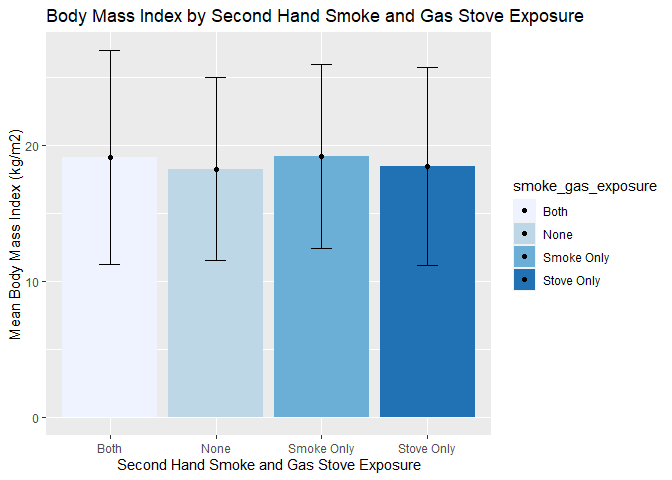

Homework 2
================
CB
2022-10-04

## R Markdown

\#Load required libraries

``` r
library(data.table)
library(lubridate)
```

    ## 
    ## Attaching package: 'lubridate'

    ## The following objects are masked from 'package:data.table':
    ## 
    ##     hour, isoweek, mday, minute, month, quarter, second, wday, week,
    ##     yday, year

    ## The following objects are masked from 'package:base':
    ## 
    ##     date, intersect, setdiff, union

``` r
library(dplyr)
```

    ## 
    ## Attaching package: 'dplyr'

    ## The following objects are masked from 'package:data.table':
    ## 
    ##     between, first, last

    ## The following objects are masked from 'package:stats':
    ## 
    ##     filter, lag

    ## The following objects are masked from 'package:base':
    ## 
    ##     intersect, setdiff, setequal, union

``` r
library(tidyverse)
```

    ## ── Attaching packages
    ## ───────────────────────────────────────
    ## tidyverse 1.3.2 ──

    ## ✔ ggplot2 3.3.6     ✔ purrr   0.3.4
    ## ✔ tibble  3.1.8     ✔ stringr 1.4.1
    ## ✔ tidyr   1.2.0     ✔ forcats 0.5.2
    ## ✔ readr   2.1.2     
    ## ── Conflicts ────────────────────────────────────────── tidyverse_conflicts() ──
    ## ✖ lubridate::as.difftime() masks base::as.difftime()
    ## ✖ dplyr::between()         masks data.table::between()
    ## ✖ lubridate::date()        masks base::date()
    ## ✖ dplyr::filter()          masks stats::filter()
    ## ✖ dplyr::first()           masks data.table::first()
    ## ✖ lubridate::hour()        masks data.table::hour()
    ## ✖ lubridate::intersect()   masks base::intersect()
    ## ✖ lubridate::isoweek()     masks data.table::isoweek()
    ## ✖ dplyr::lag()             masks stats::lag()
    ## ✖ dplyr::last()            masks data.table::last()
    ## ✖ lubridate::mday()        masks data.table::mday()
    ## ✖ lubridate::minute()      masks data.table::minute()
    ## ✖ lubridate::month()       masks data.table::month()
    ## ✖ lubridate::quarter()     masks data.table::quarter()
    ## ✖ lubridate::second()      masks data.table::second()
    ## ✖ lubridate::setdiff()     masks base::setdiff()
    ## ✖ purrr::transpose()       masks data.table::transpose()
    ## ✖ lubridate::union()       masks base::union()
    ## ✖ lubridate::wday()        masks data.table::wday()
    ## ✖ lubridate::week()        masks data.table::week()
    ## ✖ lubridate::yday()        masks data.table::yday()
    ## ✖ lubridate::year()        masks data.table::year()

``` r
library(dtplyr)
library(knitr)
library(leaflet)
library(ggplot2)
```

\#Load in data from github

``` r
download.file("https://raw.githubusercontent.com/USCbiostats/data-science-data/master/01_chs/chs_individual.csv", "individual.gz", method="libcurl", timeout = 60)
individual <- data.table::fread("individual.gz")
download.file("https://raw.githubusercontent.com/USCbiostats/data-science-data/master/01_chs/chs_regional.csv", "regional.gz", method="libcurl", timeout = 60)
regional <- data.table::fread("regional.gz")
```

``` r
dim(individual)
```

    ## [1] 1200   23

``` r
head(individual)
```

    ##    sid  townname male race hispanic    agepft height weight      bmi asthma
    ## 1:   1 Lancaster    1    W        0 10.154689    123     54 16.22411      0
    ## 2:   2 Lancaster    1    W        0 10.461328    145     77 16.64685      0
    ## 3:   6 Lancaster    0    B        0 10.097194    145    143 30.91558      0
    ## 4:   7 Lancaster    0    O        0 10.746064    156     72 13.44809      0
    ## 5:   8 Lancaster    0    W        1  9.782341    132     61 15.91326      0
    ## 6:  10 Lancaster    1    O        1        NA     NA     NA       NA      0
    ##    active_asthma father_asthma mother_asthma wheeze hayfever allergy
    ## 1:             0             0             0      0        0       0
    ## 2:             0             0             0      1        0       0
    ## 3:             0             0             0      0        1       0
    ## 4:             0            NA             0      1        0       0
    ## 5:             0             1             0      1        1       1
    ## 6:             1             1             0      0        0       0
    ##    educ_parent smoke pets gasstove      fev      fvc     mmef
    ## 1:           3     0    1        1 1650.254 1800.005 2537.777
    ## 2:           5     0    1        0 2273.129 2721.111 2365.745
    ## 3:           2     0    0        1 2011.653 2257.244 1818.973
    ## 4:           2     1    1        1 1643.092 2060.526 1462.500
    ## 5:           3     0    1        0 1651.974 1996.382 1606.579
    ## 6:           1     0    1        1       NA       NA       NA

``` r
head(regional)
```

    ##         townname pm25_mass pm25_so4 pm25_no3 pm25_nh4 pm25_oc pm25_ec pm25_om
    ## 1:        Alpine      8.74     1.73     1.59     0.88    2.54    0.48    3.04
    ## 2: Lake Elsinore     12.35     1.90     2.98     1.36    3.64    0.62    4.36
    ## 3:  Lake Gregory      7.66     1.07     2.07     0.91    2.46    0.40    2.96
    ## 4:     Lancaster      8.50     0.91     1.87     0.78    4.43    0.55    5.32
    ## 5:        Lompoc      5.96     1.08     0.73     0.41    1.45    0.13    1.74
    ## 6:    Long Beach     19.12     3.23     6.22     2.57    5.21    1.36    6.25
    ##    pm10_oc pm10_ec pm10_tc formic acetic  hcl hno3 o3_max o3106 o3_24   no2
    ## 1:    3.25    0.49    3.75   1.03   2.49 0.41 1.98  65.82 55.05 41.23 12.18
    ## 2:    4.66    0.63    5.29   1.18   3.56 0.46 2.63  66.70 54.42 32.23 17.03
    ## 3:    3.16    0.41    3.57   0.66   2.36 0.28 2.28  84.44 67.01 57.76  7.62
    ## 4:    5.68    0.56    8.61   0.88   2.88 0.22 1.80  54.81 43.88 32.86 15.77
    ## 5:    1.86    0.14    1.99   0.34   0.75 0.33 0.43  43.85 37.74 28.37  4.60
    ## 6:    6.68    1.39    8.07   1.57   2.94 0.73 2.67  39.44 28.22 18.22 33.11
    ##     pm10 no_24hr pm2_5_fr iacid oacid total_acids       lon      lat
    ## 1: 24.73    2.48    10.28  2.39  3.52        5.50 -116.7664 32.83505
    ## 2: 34.25    7.07    14.53  3.09  4.74        7.37 -117.3273 33.66808
    ## 3: 20.05      NA     9.01  2.56  3.02        5.30 -117.2752 34.24290
    ## 4: 25.04   12.68       NA  2.02  3.76        5.56 -118.1542 34.68678
    ## 5: 18.40    2.05       NA  0.76  1.09        1.52 -120.4579 34.63915
    ## 6: 38.41   36.76    22.23  3.40  4.51        7.18 -118.1937 33.77005

``` r
#Trim down this dataset so it just has the info we are going to use (PM2.5 data and location for the leaflet)
regional_trim <- regional[, c("townname", "pm25_mass", "lon", "lat")]
regional_trim
```

    ##          townname pm25_mass       lon      lat
    ##  1:        Alpine      8.74 -116.7664 32.83505
    ##  2: Lake Elsinore     12.35 -117.3273 33.66808
    ##  3:  Lake Gregory      7.66 -117.2752 34.24290
    ##  4:     Lancaster      8.50 -118.1542 34.68678
    ##  5:        Lompoc      5.96 -120.4579 34.63915
    ##  6:    Long Beach     19.12 -118.1937 33.77005
    ##  7:     Mira Loma     29.97 -117.5159 33.98454
    ##  8:     Riverside     22.39 -117.3755 33.98060
    ##  9:     San Dimas     20.52 -117.8067 34.10668
    ## 10:    Atascadero      7.48 -120.6707 35.48942
    ## 11:   Santa Maria      7.19 -120.4357 34.95303
    ## 12:        Upland     22.46 -117.6484 34.09751

\#How many unique townnames are there?

``` r
unique(individual$townname)
```

    ##  [1] "Lancaster"     "San Dimas"     "Atascadero"    "Riverside"    
    ##  [5] "Mira Loma"     "Alpine"        "Lake Elsinore" "Lake Gregory" 
    ##  [9] "Long Beach"    "Santa Maria"   "Upland"        "Lompoc"

``` r
unique(regional_trim$townname)
```

    ##  [1] "Alpine"        "Lake Elsinore" "Lake Gregory"  "Lancaster"    
    ##  [5] "Lompoc"        "Long Beach"    "Mira Loma"     "Riverside"    
    ##  [9] "San Dimas"     "Atascadero"    "Santa Maria"   "Upland"

\#Check variables for merging. There are 12 unique townnames. This
matches with the 12 rows from the regional dataset. \#Merge data

``` r
hw2data <-merge(individual, regional_trim, by="townname" )
dim(hw2data)
```

    ## [1] 1200   26

\#\_This looks correct, there are 1200 rows and now the three additional
columns added in the regional (trimmed) dataset

``` r
head(hw2data)
```

    ##    townname sid male race hispanic    agepft height weight      bmi asthma
    ## 1:   Alpine 835    0    W        0 10.099932    143     69 15.33749      0
    ## 2:   Alpine 838    0    O        1  9.486653    133     62 15.93183      0
    ## 3:   Alpine 839    0    M        1 10.053388    142     86 19.38649      0
    ## 4:   Alpine 840    0    W        0  9.965777    146     78 16.63283      0
    ## 5:   Alpine 841    1    W        1 10.548939    150     78 15.75758      0
    ## 6:   Alpine 842    1    M        1  9.489391    139     65 15.29189      0
    ##    active_asthma father_asthma mother_asthma wheeze hayfever allergy
    ## 1:             0             0             0      0        0       1
    ## 2:             0             0             0      0        0       0
    ## 3:             0             0             1      1        1       1
    ## 4:             0             0             0      0        0       0
    ## 5:             0             0             0      0        0       0
    ## 6:             0             0             0      1        0       0
    ##    educ_parent smoke pets gasstove      fev      fvc     mmef pm25_mass
    ## 1:           3     0    1        0 2529.276 2826.316 3406.579      8.74
    ## 2:           4    NA    1        0 1737.793 1963.545 2133.110      8.74
    ## 3:           3     1    1        0 2121.711 2326.974 2835.197      8.74
    ## 4:          NA    NA    0       NA 2466.791 2638.221 3466.464      8.74
    ## 5:           5     0    1        0 2251.505 2594.649 2445.151      8.74
    ## 6:           1     1    1        0 2188.716 2423.934 2524.599      8.74
    ##          lon      lat
    ## 1: -116.7664 32.83505
    ## 2: -116.7664 32.83505
    ## 3: -116.7664 32.83505
    ## 4: -116.7664 32.83505
    ## 5: -116.7664 32.83505
    ## 6: -116.7664 32.83505

``` r
tail(hw2data)
```

    ##    townname  sid male race hispanic    agepft height weight      bmi asthma
    ## 1:   Upland 1866    0    O        1  9.806982    139     60 14.11559      0
    ## 2:   Upland 1867    0    M        1  9.618070    140     71 16.46568      0
    ## 3:   Upland 2031    1    W        0  9.798768    135     83 20.70084      0
    ## 4:   Upland 2032    1    W        0  9.549624    137     59 14.28855      0
    ## 5:   Upland 2033    0    M        0 10.121834    130     67 18.02044      0
    ## 6:   Upland 2053    0    W        0        NA     NA     NA       NA      0
    ##    active_asthma father_asthma mother_asthma wheeze hayfever allergy
    ## 1:             0            NA             0      0       NA      NA
    ## 2:             0             1             0      0        0       0
    ## 3:             0             0             0      1        0       1
    ## 4:             0             0             1      1        1       1
    ## 5:             1             0             0      1        1       0
    ## 6:             0             0             0      0        0       0
    ##    educ_parent smoke pets gasstove      fev      fvc     mmef pm25_mass
    ## 1:           3     0    1        0 1691.275 1928.859 1890.604     22.46
    ## 2:           3     0    1        0 1733.338 1993.040 2072.643     22.46
    ## 3:           3     0    1        1 2034.177 2505.535 1814.075     22.46
    ## 4:           3     0    1        1 2077.703 2275.338 2706.081     22.46
    ## 5:           3     0    1        1 1929.866 2122.148 2558.054     22.46
    ## 6:           3     0    1        0       NA       NA       NA     22.46
    ##          lon      lat
    ## 1: -117.6484 34.09751
    ## 2: -117.6484 34.09751
    ## 3: -117.6484 34.09751
    ## 4: -117.6484 34.09751
    ## 5: -117.6484 34.09751
    ## 6: -117.6484 34.09751

\#Which variables have missing values?

``` r
colSums(is.na(hw2data))
```

    ##      townname           sid          male          race      hispanic 
    ##             0             0             0             0             0 
    ##        agepft        height        weight           bmi        asthma 
    ##            89            89            89            89            31 
    ## active_asthma father_asthma mother_asthma        wheeze      hayfever 
    ##             0           106            56            71           118 
    ##       allergy   educ_parent         smoke          pets      gasstove 
    ##            63            64            40             0            33 
    ##           fev           fvc          mmef     pm25_mass           lon 
    ##            95            97           106             0             0 
    ##           lat 
    ##             0

## Data Wrangling Step 1

\#For missing values, impute data using the average within the variables
“male” and “hispanic.” For variables with 0/1 values will impute with
the median.

``` r
#Impute variables with missing values grouped by sex/hispanic
hw2data[, bmi_imp := fcoalesce(bmi, mean(bmi, na.rm = T)),
    by = .(male, hispanic)]
hw2data[, fev_imp := (fcoalesce(fev, mean(fev, na.rm = T))),
    by = .(male, hispanic)]

#Create another smoke, asthma, and gasstove variable that is numeric so it can be imputed
hw2data [ , smoke_num := (as.numeric(smoke, na.rm=F))]
hw2data [ , gasstove_num := (as.numeric(gasstove, na.rm=F))]
hw2data [ , asthma_num := (as.numeric(asthma, na.rm=F))]

#Now try imputation again
hw2data[, smoke_imp := (fcoalesce(smoke_num, median(smoke_num, na.rm = T))),
    by = .(male, hispanic)]
hw2data[, gasstove_imp := (fcoalesce(gasstove_num, median(gasstove_num, na.rm = T))),
    by = .(male, hispanic)]
hw2data[, asthma_imp := (fcoalesce(asthma_num, median(asthma_num, na.rm = T))),
    by = .(male, hispanic)]
```

``` r
head(hw2data)
```

    ##    townname sid male race hispanic    agepft height weight      bmi asthma
    ## 1:   Alpine 835    0    W        0 10.099932    143     69 15.33749      0
    ## 2:   Alpine 838    0    O        1  9.486653    133     62 15.93183      0
    ## 3:   Alpine 839    0    M        1 10.053388    142     86 19.38649      0
    ## 4:   Alpine 840    0    W        0  9.965777    146     78 16.63283      0
    ## 5:   Alpine 841    1    W        1 10.548939    150     78 15.75758      0
    ## 6:   Alpine 842    1    M        1  9.489391    139     65 15.29189      0
    ##    active_asthma father_asthma mother_asthma wheeze hayfever allergy
    ## 1:             0             0             0      0        0       1
    ## 2:             0             0             0      0        0       0
    ## 3:             0             0             1      1        1       1
    ## 4:             0             0             0      0        0       0
    ## 5:             0             0             0      0        0       0
    ## 6:             0             0             0      1        0       0
    ##    educ_parent smoke pets gasstove      fev      fvc     mmef pm25_mass
    ## 1:           3     0    1        0 2529.276 2826.316 3406.579      8.74
    ## 2:           4    NA    1        0 1737.793 1963.545 2133.110      8.74
    ## 3:           3     1    1        0 2121.711 2326.974 2835.197      8.74
    ## 4:          NA    NA    0       NA 2466.791 2638.221 3466.464      8.74
    ## 5:           5     0    1        0 2251.505 2594.649 2445.151      8.74
    ## 6:           1     1    1        0 2188.716 2423.934 2524.599      8.74
    ##          lon      lat  bmi_imp  fev_imp smoke_num gasstove_num asthma_num
    ## 1: -116.7664 32.83505 15.33749 2529.276         0            0          0
    ## 2: -116.7664 32.83505 15.93183 1737.793        NA            0          0
    ## 3: -116.7664 32.83505 19.38649 2121.711         1            0          0
    ## 4: -116.7664 32.83505 16.63283 2466.791        NA           NA          0
    ## 5: -116.7664 32.83505 15.75758 2251.505         0            0          0
    ## 6: -116.7664 32.83505 15.29189 2188.716         1            0          0
    ##    smoke_imp gasstove_imp asthma_imp
    ## 1:         0            0          0
    ## 2:         0            0          0
    ## 3:         1            0          0
    ## 4:         0            1          0
    ## 5:         0            0          0
    ## 6:         1            0          0

# This worked. Now my dataset has the imputed variables in place.

## Step 2

\#Create a new categorical variable named “obesity_level” using the BMI
measurement (underweight BMI\<14; normal BMI 14-22; overweight BMI
22-24; obese BMI\>24). To make sure the variable is rightly coded,
create a summary table that contains the minimum BMI, maximum BMI, and
the total number of observations per category.

``` r
hw2data[, obesity_level := fifelse(bmi_imp < 14, "Underweight", 
                fifelse(bmi_imp >= 14 & bmi_imp <22, "Normal",
                fifelse(bmi_imp >=22 & bmi_imp <24, "Overweight", "Obese")))]
#Make sure categories look ok
table(hw2data$obesity_level)
```

    ## 
    ##      Normal       Obese  Overweight Underweight 
    ##         975         103          87          35

# These look appropriate

# Make table with max, min , and total number observations per category

``` r
hw2data %>% 
  group_by(obesity_level) %>% 
          summarise(n(),
          Min_BMI = min(bmi_imp),
          Max_BMI = max(bmi_imp)) %>% 
              arrange(Max_BMI)
```

    ## Source: local data table [4 x 4]
    ## Call:   `_DT1`[, .(`n()` = .N, Min_BMI = min(bmi_imp), Max_BMI = max(bmi_imp)), 
    ##     keyby = .(obesity_level)][order(Max_BMI)]
    ## 
    ##   obesity_level `n()` Min_BMI Max_BMI
    ##   <chr>         <int>   <dbl>   <dbl>
    ## 1 Underweight      35    11.3    14.0
    ## 2 Normal          975    14.0    22.0
    ## 3 Overweight       87    22.0    24.0
    ## 4 Obese           103    24.0    41.3
    ## 
    ## # Use as.data.table()/as.data.frame()/as_tibble() to access results

## Step 3

# Create another categorical variable named “smoke_gas_exposure” that summarizes “Second Hand Smoke” and “Gas Stove.” The variable should have four categories in total.

``` r
hw2data[, smoke_gas_exposure := fifelse(smoke_imp ==0 & gasstove_imp ==0, "None", 
                fifelse(smoke_imp ==1 & gasstove_imp ==0, "Smoke Only",
                fifelse(smoke_imp ==0 & gasstove_imp ==1, "Stove Only", "Both")))]
table(hw2data$smoke_gas_exposure)
```

    ## 
    ##       Both       None Smoke Only Stove Only 
    ##        154        219         36        791

## Step 4 Create Summary tables

# Create four summary tables showing the average (or proportion, if binary) and sd of “Forced expiratory volume in 1 second (ml)” and asthma indicator by town, sex, obesity level, and “smoke_gas_exposure.”

``` r
#Table 1
Table_Town = hw2data %>% 
  group_by(townname) %>% 
          summarise(sum(asthma_imp==1)/n()*100,
          mean_fev  = mean(fev_imp),
          SD_fev = sd(fev_imp))
Table_Town <- as.data.frame(Table_Town)
colnames(Table_Town) <- c("Town Name", "Asthma Present (%)", "Mean FEV1", "Std Dev FEV1")
knitr::kable(Table_Town, align=c("l", "c", "c","c"), digits =2, caption = "Table 1. Forced expiratory volume in 1 second (mL) (FEV1) by Town")
```

| Town Name     | Asthma Present (%) | Mean FEV1 | Std Dev FEV1 |
|:--------------|:------------------:|:---------:|:------------:|
| Alpine        |         11         |  2087.10  |    291.18    |
| Atascadero    |         25         |  2075.90  |    324.09    |
| Lake Elsinore |         12         |  2038.85  |    303.70    |
| Lake Gregory  |         15         |  2084.70  |    319.96    |
| Lancaster     |         16         |  2003.04  |    317.13    |
| Lompoc        |         11         |  2034.35  |    351.05    |
| Long Beach    |         13         |  1985.86  |    319.46    |
| Mira Loma     |         15         |  1985.20  |    324.96    |
| Riverside     |         11         |  1989.88  |    277.51    |
| San Dimas     |         17         |  2026.79  |    318.78    |
| Santa Maria   |         13         |  2025.75  |    312.17    |
| Upland        |         12         |  2024.27  |    343.16    |

Table 1. Forced expiratory volume in 1 second (mL) (FEV1) by Town

``` r
#Table 2
#Make a labeled version of male and female so its easy to work with
sex <- as.factor(hw2data$male)
hw2data[, sex := fifelse(male ==0 , "Female", "Male")]
Table_Sex = hw2data %>% 
  group_by(sex) %>% 
          summarise(sum(asthma_imp==1)/n()*100,
          mean_fev  = mean(fev_imp),
          SD_fev = sd(fev_imp))
Table_Sex <- as.data.frame(Table_Sex)
colnames(Table_Sex) <- c("Sex", "Asthma Present (%)", "Mean FEV1", "Std Dev FEV1")
knitr::kable(Table_Sex, align=c("l", "c", "c","c"), digits =2, caption = "Table 2. Forced expiratory volume in 1 second (mL) (FEV1) by Sex")
```

| Sex    | Asthma Present (%) | Mean FEV1 | Std Dev FEV1 |
|:-------|:------------------:|:---------:|:------------:|
| Female |       11.80        |  1958.91  |    311.92    |
| Male   |       16.78        |  2103.79  |    307.51    |

Table 2. Forced expiratory volume in 1 second (mL) (FEV1) by Sex

``` r
#Table 3
Table_Obesity = hw2data %>% 
  group_by(obesity_level) %>% 
          summarise(sum(asthma_imp==1)/n()*100,
          mean_fev  = mean(fev_imp),
          SD_fev = sd(fev_imp))
Table_Obesity <- as.data.frame(Table_Obesity)
colnames(Table_Obesity) <- c("Obesity Level", "Asthma Present (%)", "Mean FEV1", "Std Dev FEV1")
knitr::kable(Table_Obesity, align=c("l", "c", "c","c"), digits =2, caption = "Table 3. Forced expiratory volume in 1 second (mL) (FEV1) by Obesity Level")
```

| Obesity Level | Asthma Present (%) | Mean FEV1 | Std Dev FEV1 |
|:--------------|:------------------:|:---------:|:------------:|
| Normal        |       13.64        |  1999.79  |    295.20    |
| Obese         |       20.39        |  2266.15  |    325.47    |
| Overweight    |       16.09        |  2224.32  |    317.43    |
| Underweight   |        8.57        |  1698.33  |    303.40    |

Table 3. Forced expiratory volume in 1 second (mL) (FEV1) by Obesity
Level

``` r
#Table 4
Table_Smoke_Gas_Exp = hw2data %>% 
  group_by(smoke_gas_exposure) %>% 
          summarise(sum(asthma_imp==1)/n()*100,
          mean_fev  = mean(fev_imp),
          SD_fev = sd(fev_imp))
Table_Smoke_Gas_Exp <- as.data.frame(Table_Smoke_Gas_Exp)
colnames(Table_Smoke_Gas_Exp) <- c("Smoke Gas Exposure", "Asthma Present (%)", "Mean FEV1", "Std Dev FEV1")
knitr::kable(Table_Smoke_Gas_Exp, align=c("l", "c", "c","c"), digits =2, caption = "Table 4. Forced expiratory volume in 1 second (mL) (FEV1) by Second Hand Smoke and Gas Stove Exposure")
```

| Smoke Gas Exposure | Asthma Present (%) | Mean FEV1 | Std Dev FEV1 |
|:-------------------|:------------------:|:---------:|:------------:|
| Both               |       12.34        |  2024.78  |    300.63    |
| None               |       14.16        |  2056.69  |    328.78    |
| Smoke Only         |       16.67        |  2055.71  |    295.65    |
| Stove Only         |       14.54        |  2022.67  |    319.34    |

Table 4. Forced expiratory volume in 1 second (mL) (FEV1) by Second Hand
Smoke and Gas Stove Exposure

## Data Visualization

## Step 1 FEV by BMI grouped by townname

``` r
hw2data%>% 
  ggplot(mapping = aes(x = bmi_imp, y = fev_imp)) + 
  geom_point(mapping = aes(color = townname)) + 
  scale_color_brewer(palette="Paired")+
  geom_smooth(method = lm, mapping = aes(linetype = townname)) +
  facet_wrap(~ townname, nrow = 3) +
  labs(title="Forced Expiratory Volume by Body Mass Index", x="Body Mass Index (kg/m2)", y= "Forced Expiratory Volume in 1 second (mL)") 
```

    ## `geom_smooth()` using formula 'y ~ x'

<!-- -->

## Step 2 Make stacked histograms

``` r
hw2data %>%
  ggplot(mapping =aes(x=fev_imp, fill = obesity_level, color = obesity_level)) +   
  geom_histogram(bin = 100, binwidth = 75, color="black")+
  labs(title="Forced Expiratory Volume by Body Mass Index", x="Forced Expiratory Volume in 1 second (mL)", y= "Observations")+
scale_fill_brewer(palette = "Set2")
```

    ## Warning: Ignoring unknown parameters: bin

<!-- -->

``` r
hw2data %>%
  ggplot(mapping =aes(x=fev_imp, fill = smoke_gas_exposure, color = smoke_gas_exposure)) +   
  geom_histogram(bin = 100, binwidth = 75, color="black" )+
  labs(title="Forced Expiratory Volume by Second Hand Smoke & Gas Stove Exposure", x="Forced Expiratory Volume in 1 second (mL)", y= "Number of Observations")+
scale_fill_brewer(palette = "Set1")
```

    ## Warning: Ignoring unknown parameters: bin

<!-- --> \## Step
3 Make bar chart of BMI by smoke/gas exposure

``` r
hw2data%>%
  ggplot(mapping = aes(x = smoke_gas_exposure, y = bmi_imp, fill = smoke_gas_exposure)) + 
    stat_summary(fun.y =  mean, geom = "bar") +
    stat_summary(fun.data = mean_sdl, geom = "errorbar", width = 0.2) +
  stat_summary(fun.data = mean_sdl, geom = "point")+
labs(title="Body Mass Index by Second Hand Smoke and Gas Stove Exposure", x="Second Hand Smoke and Gas Stove Exposure", y= "Mean Body Mass Index (kg/m2)")+
scale_fill_brewer(palette = "Blues")
```

    ## Warning: `fun.y` is deprecated. Use `fun` instead.

<!-- -->

``` r
hw2data %>% 
  ggplot(mapping = aes(x = bmi_imp, y = fev_imp)) + 
  geom_point(color="blue") + 
  geom_smooth(method = lm, color="red")+
labs(title="Forced Expiratory Volume by Body Mass Index", x="Body Mass Index(kg/m2)", y= "Forced Expiratory Volume in 1 second (mL)")
```

    ## `geom_smooth()` using formula 'y ~ x'

<!-- -->

``` r
hw2data %>% 
  ggplot(mapping = aes(x = smoke_gas_exposure, y = fev_imp, fill=smoke_gas_exposure)) + 
  geom_boxplot(color="black") +
labs(title="Forced Expiratory Volume by Second Hand Smoke and Gas Stove Exposure", x="Second Hand Smoke and Gas Stove Exposure", y= "Forced Expiratory Volume in 1 second (mL)")+
  scale_fill_brewer(palette = "Pastel1")
```

<!-- -->

## Create leaflet plot

``` r
# Generating a color palette
pal1 <- colorNumeric(c('darkgreen','goldenrod','brown'), domain=hw2data$pm25_mass)
pal1
```

    ## function (x) 
    ## {
    ##     if (length(x) == 0 || all(is.na(x))) {
    ##         return(pf(x))
    ##     }
    ##     if (is.null(rng)) 
    ##         rng <- range(x, na.rm = TRUE)
    ##     rescaled <- scales::rescale(x, from = rng)
    ##     if (any(rescaled < 0 | rescaled > 1, na.rm = TRUE)) 
    ##         warning("Some values were outside the color scale and will be treated as NA")
    ##     if (reverse) {
    ##         rescaled <- 1 - rescaled
    ##     }
    ##     pf(rescaled)
    ## }
    ## <bytecode: 0x0000027a77f431a0>
    ## <environment: 0x0000027a77f51b40>
    ## attr(,"colorType")
    ## [1] "numeric"
    ## attr(,"colorArgs")
    ## attr(,"colorArgs")$na.color
    ## [1] "#808080"

``` r
prettymap <- leaflet(hw2data) %>% 
  addProviderTiles('CartoDB.Positron') %>% 
  addCircles(
    lat = ~lat, lng=~lon,
    label = ~paste0(pm25_mass), color = ~ pal1(pm25_mass),
    opacity = 1, fillOpacity = 1, radius = 500
    ) %>%
  # And legend
  addLegend('bottomleft', pal=pal1, values=hw2data$pm25_mass,
          title='PM 2.5 Concentration by City', opacity=1)

prettymap
```

<!-- -->
