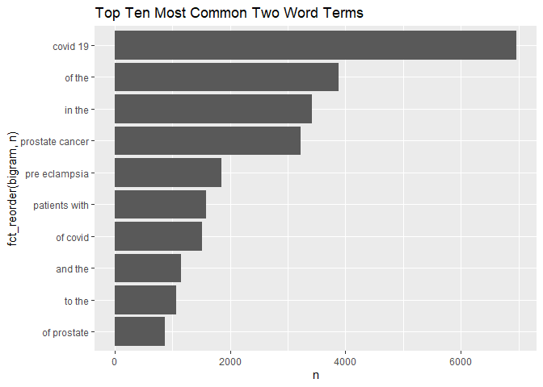
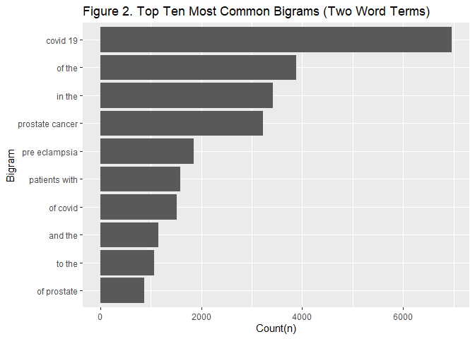

Homework 3
================
CB
2022-11-03

## R Markdown

### Load required libraries

``` r
library(data.table)
library(dplyr)
```

    ## 
    ## Attaching package: 'dplyr'

    ## The following objects are masked from 'package:data.table':
    ## 
    ##     between, first, last

    ## The following objects are masked from 'package:stats':
    ## 
    ##     filter, lag

    ## The following objects are masked from 'package:base':
    ## 
    ##     intersect, setdiff, setequal, union

``` r
library(tidyverse)
```

    ## ── Attaching packages
    ## ───────────────────────────────────────
    ## tidyverse 1.3.2 ──

    ## ✔ ggplot2 3.3.6     ✔ purrr   0.3.4
    ## ✔ tibble  3.1.8     ✔ stringr 1.4.1
    ## ✔ tidyr   1.2.0     ✔ forcats 0.5.2
    ## ✔ readr   2.1.2     
    ## ── Conflicts ────────────────────────────────────────── tidyverse_conflicts() ──
    ## ✖ dplyr::between()   masks data.table::between()
    ## ✖ dplyr::filter()    masks stats::filter()
    ## ✖ dplyr::first()     masks data.table::first()
    ## ✖ dplyr::lag()       masks stats::lag()
    ## ✖ dplyr::last()      masks data.table::last()
    ## ✖ purrr::transpose() masks data.table::transpose()

``` r
library(dtplyr)
library(knitr)
library(ggplot2)
library(rvest)
```

    ## 
    ## Attaching package: 'rvest'
    ## 
    ## The following object is masked from 'package:readr':
    ## 
    ##     guess_encoding

``` r
library(httr)
library(xml2)
library(stringr)
```

## Part 1: APIs

``` r
# Downloading the website
website <- xml2::read_html("https://pubmed.ncbi.nlm.nih.gov/?term=sars-cov-2+trial+vaccine")

# Finding the counts

counts <- xml2::xml_find_first(website, "/html/body/main/div[9]/div[2]/div[2]/div[1]/div[1]")

counts <- as.character(counts)
counts
```

    ## [1] "<div class=\"results-amount\">\n  \n    <span class=\"value\">4,006</span>\n    results\n  \n</div>"

``` r
# Extracting the data using regex
stringr::str_extract(counts, "[0-9,]+")
```

    ## [1] "4,006"

### *There are 4,006 results from this search*

### Create database

``` r
query_ids <- GET(
  url   = "https://eutils.ncbi.nlm.nih.gov/entrez/eutils/esearch.fcgi",
  query = list(
    db      = "pubmed",
    term    = "sars-cov-2 trial vaccine",
    retmax  = 250
  ), 
)
```

``` r
# Extracting, make character
ids <- httr::content(query_ids)
ids <- as.character(ids)
```

``` r
ids <- stringr::str_extract_all(ids, "<Id>[[:digit:]]+</Id>")[[1]]
# Remove all the leading and trailing <Id> </Id>. 
ids <- stringr::str_remove_all(ids, "</?Id>")
head(ids)
```

    ## [1] "36322837" "36320825" "36314847" "36307830" "36305195" "36301821"

``` r
publications <- GET(
  url   = "https://eutils.ncbi.nlm.nih.gov/entrez/eutils/efetch.fcgi",
  query = list(
    db  = "pubmed",
    id  = paste(ids,collapse = ","),
  retmax = 250,
  rettype = "abstract"
    )
)
# Extracting the content of the response of GET
publications <- httr::content(publications)

publications_txt <- as.character(publications)
```

### Create a dataset containing Pubmed ID number,Title of the paper,Name of the journal where it was published,Publication date, and Abstract of the paper (if any).

``` r
pub_char_list <- xml2::xml_children(publications)
pub_char_list <- sapply(pub_char_list, as.character)
```

``` r
titles <- str_extract(pub_char_list, "<ArticleTitle>[[:print:][:space:]]+</ArticleTitle>")
titles[[1]]
```

    ## [1] "<ArticleTitle>Covid-19 Vaccine Protection among Children and Adolescents in Qatar.</ArticleTitle>"

``` r
titles <- str_remove_all(titles, "</?[[:alnum:]- =\"]+>")
titles[[1]]
```

    ## [1] "Covid-19 Vaccine Protection among Children and Adolescents in Qatar."

``` r
journalname <- str_extract(pub_char_list, "<Title>[[:print:][:space:]]+</Title>")
journalname[[1]]
```

    ## [1] "<Title>The New England journal of medicine</Title>"

``` r
journalname <- str_remove_all(journalname, "</?[[:alnum:]- =\"]+>")
journalname[[1]]
```

    ## [1] "The New England journal of medicine"

``` r
abstracts <- str_extract(pub_char_list, "<Abstract>[[:print:][:space:]]+</Abstract>")
abstracts[[1]]
```

    ## [1] "<Abstract>\n        <AbstractText Label=\"BACKGROUND\" NlmCategory=\"BACKGROUND\">The BNT162b2 vaccine against coronavirus disease 2019 (Covid-19) has been authorized for use in children 5 to 11 years of age and adolescents 12 to 17 years of age but in different antigen doses.</AbstractText>\n        <AbstractText Label=\"METHODS\" NlmCategory=\"METHODS\">We assessed the real-world effectiveness of the BNT162b2 vaccine against infection with severe acute respiratory syndrome coronavirus 2 (SARS-CoV-2) among children and adolescents in Qatar. To compare the incidence of SARS-CoV-2 infection in the national cohort of vaccinated participants with the incidence in the national cohort of unvaccinated participants, we conducted three matched, retrospective, target-trial, cohort studies - one assessing data obtained from children 5 to 11 years of age after the B.1.1.529 (omicron) variant became prevalent and two assessing data from adolescents 12 to 17 years of age before the emergence of the omicron variant (pre-omicron study) and after the omicron variant became prevalent. Associations were estimated with the use of Cox proportional-hazards regression models.</AbstractText>\n        <AbstractText Label=\"RESULTS\" NlmCategory=\"RESULTS\">Among children, the overall effectiveness of the 10-μg primary vaccine series against infection with the omicron variant was 25.7% (95% confidence interval [CI], 10.0 to 38.6). Effectiveness was highest (49.6%; 95% CI, 28.5 to 64.5) right after receipt of the second dose but waned rapidly thereafter and was negligible after 3 months. Effectiveness was 46.3% (95% CI, 21.5 to 63.3) among children 5 to 7 years of age and 16.6% (95% CI, -4.2 to 33.2) among those 8 to 11 years of age. Among adolescents, the overall effectiveness of the 30-μg primary vaccine series against infection with the omicron variant was 30.6% (95% CI, 26.9 to 34.1), but many adolescents had been vaccinated months earlier. Effectiveness waned over time since receipt of the second dose. Effectiveness was 35.6% (95% CI, 31.2 to 39.6) among adolescents 12 to 14 years of age and 20.9% (95% CI, 13.8 to 27.4) among those 15 to 17 years of age. In the pre-omicron study, the overall effectiveness of the 30-μg primary vaccine series against SARS-CoV-2 infection among adolescents was 87.6% (95% CI, 84.0 to 90.4) and waned relatively slowly after receipt of the second dose.</AbstractText>\n        <AbstractText Label=\"CONCLUSIONS\" NlmCategory=\"CONCLUSIONS\">Vaccination in children was associated with modest, rapidly waning protection against omicron infection. Vaccination in adolescents was associated with stronger, more durable protection, perhaps because of the larger antigen dose. (Funded by Weill Cornell Medicine-Qatar and others.).</AbstractText>\n        <CopyrightInformation>Copyright © 2022 Massachusetts Medical Society.</CopyrightInformation>\n      </Abstract>"

``` r
abstracts <- str_remove_all(abstracts, "</?[[:alnum:]- =\"]+>") 
abstracts[[1]]
```

    ## [1] "\n        The BNT162b2 vaccine against coronavirus disease 2019 (Covid-19) has been authorized for use in children 5 to 11 years of age and adolescents 12 to 17 years of age but in different antigen doses.\n        We assessed the real-world effectiveness of the BNT162b2 vaccine against infection with severe acute respiratory syndrome coronavirus 2 (SARS-CoV-2) among children and adolescents in Qatar. To compare the incidence of SARS-CoV-2 infection in the national cohort of vaccinated participants with the incidence in the national cohort of unvaccinated participants, we conducted three matched, retrospective, target-trial, cohort studies - one assessing data obtained from children 5 to 11 years of age after the B.1.1.529 (omicron) variant became prevalent and two assessing data from adolescents 12 to 17 years of age before the emergence of the omicron variant (pre-omicron study) and after the omicron variant became prevalent. Associations were estimated with the use of Cox proportional-hazards regression models.\n        Among children, the overall effectiveness of the 10-μg primary vaccine series against infection with the omicron variant was 25.7% (95% confidence interval [CI], 10.0 to 38.6). Effectiveness was highest (49.6%; 95% CI, 28.5 to 64.5) right after receipt of the second dose but waned rapidly thereafter and was negligible after 3 months. Effectiveness was 46.3% (95% CI, 21.5 to 63.3) among children 5 to 7 years of age and 16.6% (95% CI, -4.2 to 33.2) among those 8 to 11 years of age. Among adolescents, the overall effectiveness of the 30-μg primary vaccine series against infection with the omicron variant was 30.6% (95% CI, 26.9 to 34.1), but many adolescents had been vaccinated months earlier. Effectiveness waned over time since receipt of the second dose. Effectiveness was 35.6% (95% CI, 31.2 to 39.6) among adolescents 12 to 14 years of age and 20.9% (95% CI, 13.8 to 27.4) among those 15 to 17 years of age. In the pre-omicron study, the overall effectiveness of the 30-μg primary vaccine series against SARS-CoV-2 infection among adolescents was 87.6% (95% CI, 84.0 to 90.4) and waned relatively slowly after receipt of the second dose.\n        Vaccination in children was associated with modest, rapidly waning protection against omicron infection. Vaccination in adolescents was associated with stronger, more durable protection, perhaps because of the larger antigen dose. (Funded by Weill Cornell Medicine-Qatar and others.).\n        Copyright © 2022 Massachusetts Medical Society.\n      "

``` r
abstracts <- str_replace_all(abstracts, "[[:space:]]+"," ")
abstracts[[1]]
```

    ## [1] " The BNT162b2 vaccine against coronavirus disease 2019 (Covid-19) has been authorized for use in children 5 to 11 years of age and adolescents 12 to 17 years of age but in different antigen doses. We assessed the real-world effectiveness of the BNT162b2 vaccine against infection with severe acute respiratory syndrome coronavirus 2 (SARS-CoV-2) among children and adolescents in Qatar. To compare the incidence of SARS-CoV-2 infection in the national cohort of vaccinated participants with the incidence in the national cohort of unvaccinated participants, we conducted three matched, retrospective, target-trial, cohort studies - one assessing data obtained from children 5 to 11 years of age after the B.1.1.529 (omicron) variant became prevalent and two assessing data from adolescents 12 to 17 years of age before the emergence of the omicron variant (pre-omicron study) and after the omicron variant became prevalent. Associations were estimated with the use of Cox proportional-hazards regression models. Among children, the overall effectiveness of the 10-μg primary vaccine series against infection with the omicron variant was 25.7% (95% confidence interval [CI], 10.0 to 38.6). Effectiveness was highest (49.6%; 95% CI, 28.5 to 64.5) right after receipt of the second dose but waned rapidly thereafter and was negligible after 3 months. Effectiveness was 46.3% (95% CI, 21.5 to 63.3) among children 5 to 7 years of age and 16.6% (95% CI, -4.2 to 33.2) among those 8 to 11 years of age. Among adolescents, the overall effectiveness of the 30-μg primary vaccine series against infection with the omicron variant was 30.6% (95% CI, 26.9 to 34.1), but many adolescents had been vaccinated months earlier. Effectiveness waned over time since receipt of the second dose. Effectiveness was 35.6% (95% CI, 31.2 to 39.6) among adolescents 12 to 14 years of age and 20.9% (95% CI, 13.8 to 27.4) among those 15 to 17 years of age. In the pre-omicron study, the overall effectiveness of the 30-μg primary vaccine series against SARS-CoV-2 infection among adolescents was 87.6% (95% CI, 84.0 to 90.4) and waned relatively slowly after receipt of the second dose. Vaccination in children was associated with modest, rapidly waning protection against omicron infection. Vaccination in adolescents was associated with stronger, more durable protection, perhaps because of the larger antigen dose. (Funded by Weill Cornell Medicine-Qatar and others.). Copyright © 2022 Massachusetts Medical Society. "

``` r
#trim string to first 150 characters
abstractshort<-substring(abstracts, 1, 150)
```

``` r
pubyear <- str_extract(pub_char_list, "<Year>[0-9]{4}</Year>")
pubyear[[1]]
```

    ## [1] "<Year>2022</Year>"

``` r
pubyear <- str_remove_all(pubyear, "</?[[:alnum:]- =\"]+>")
pubyear[[1]]
```

    ## [1] "2022"

``` r
pubmonth <- str_extract(pub_char_list, "<Month>[a-zA-Z]{3}</Month>")
pubmonth[[1]]
```

    ## [1] "<Month>Nov</Month>"

``` r
pubmonth <- str_remove_all(pubmonth, "</?[[:alnum:]- =\"]+>")
pubmonth[[1]]
```

    ## [1] "Nov"

``` r
pubday <- str_extract(pub_char_list, "<Day>[0-9]{1,2}</Day>")
pubday[[1]]
```

    ## [1] "<Day>02</Day>"

``` r
pubday <- str_remove_all(pubday, "</?[[:alnum:]- =\"]+>")
pubday[[1]]
```

    ## [1] "02"

### Make a dataset containing all the elements

``` r
#Create publication date variable
pubdate <- paste(pubmonth, pubday, pubyear, sep="-")
pubdate[[1]]
```

    ## [1] "Nov-02-2022"

``` r
#Create dataframe with all elements

database1 <- data.frame(
  PubMedId = ids,
  Title    = titles,
  Abstract = abstracts,
  Journal =journalname,
  Publication_Date=pubdate
  
)
```

### Make a table showing results (first five displayed)

``` r
#Show first five results in a table, will use shortened abstract created above so its not such a big table 
database2 <- data.frame(
  PubMedId = ids,
  Title    = titles,
  Abstract = abstractshort,
  Journal =journalname,
  Publication_Date=pubdate
  
)

knitr::kable(database2[1:5,], caption = "Covid-19 Vaccine Trials Papers: First 5 results", valign = "top")
```

| PubMedId | Title                                                                                                                                                                                                                 | Abstract                                                                                                                                              | Journal                                      | Publication_Date |
|:---------|:----------------------------------------------------------------------------------------------------------------------------------------------------------------------------------------------------------------------|:------------------------------------------------------------------------------------------------------------------------------------------------------|:---------------------------------------------|:-----------------|
| 36322837 | Covid-19 Vaccine Protection among Children and Adolescents in Qatar.                                                                                                                                                  | The BNT162b2 vaccine against coronavirus disease 2019 (Covid-19) has been authorized for use in children 5 to 11 years of age and adolescents 12 to 1 | The New England journal of medicine          | Nov-02-2022      |
| 36320825 | Withholding methotrexate after vaccination with ChAdOx1 nCov19 in patients with rheumatoid or psoriatic arthritis in India (MIVAC I and II): results of two, parallel, assessor-masked, randomised controlled trials. | There is a necessity for an optimal COVID-19 vaccination strategy for vulnerable population groups, including people with autoimmune inflammatory art | The Lancet. Rheumatology                     | Nov-02-2022      |
| 36314847 | An online community peer support intervention to promote COVID-19 vaccine information among essential workers: a randomized trial.                                                                                    | Vaccine hesitancy is still rampant in the United States, including health care personnel. Vaccination of frontline essential workers (e.g. health car | Annals of medicine                           | Dec-02-2022      |
| 36307830 | Improving pediatric COVID-19 vaccine uptake using an mHealth tool (MoVeUp): study protocol for a randomized, controlled trial.                                                                                        | Coronavirus disease 2019 (COVID-19) vaccines demonstrate excellent effectiveness against infection, severe disease, and death. However, pediatric COV | Trials                                       | Oct-01-2022      |
| 36305195 | Deep learning in drug discovery: a futuristic modality to materialize the large datasets for cheminformatics.                                                                                                         | Artificial intelligence (AI) development imitates the workings of the human brain to comprehend modern problems. The traditional approaches such as h | Journal of biomolecular structure & dynamics | Oct-02-2022      |

Covid-19 Vaccine Trials Papers: First 5 results

# Part 2: Text mining

``` r
#Obtain dataset, save to computer then load in (unable to load directly from website without issues)

library(tidytext)
pubmedabs <- read.csv("C:\\Users\\clair\\Desktop\\PM566\\pubmed.csv")
str(pubmedabs)
```

    ## 'data.frame':    3241 obs. of  2 variables:
    ##  $ abstract: chr  "Background and aims: Many patients with coronavirus disease 2019 (COVID-19) have underlying cardiovascular (CV)"| __truncated__ "Introduction: Contradictory data have been reported on the incidence of stroke in patients with COVID-19 and th"| __truncated__ "This article aims at collecting all information needed for dentists regarding the COVID-19 pandemic throughout "| __truncated__ "OBJECTIVE. The objective of our study was to determine the misdiagnosis rate of radiologists for coronavirus di"| __truncated__ ...
    ##  $ term    : chr  "covid" "covid" "covid" "covid" ...

``` r
library(forcats)
```

``` r
#Check number of terms in the dataset to confirm all five appear
search_term <- 
    pubmedabs %>%
    count(term)

search_term %>%
    arrange(desc(n)) %>%
knitr::kable()
```

| term            |   n |
|:----------------|----:|
| covid           | 981 |
| prostate cancer | 787 |
| preeclampsia    | 780 |
| cystic fibrosis | 376 |
| meningitis      | 317 |

## Section 1

### Step 1 - Tokenize the abstracts and count the number of each token

``` r
top20all <-pubmedabs %>%
  unnest_tokens(word, abstract) %>%
  count(word, sort = TRUE) 


top20all<- top20all[1:20,]

top20all %>%
    arrange(desc(n)) %>%
knitr::kable(caption = "Table 1. Top 20 Words from All Abstracts", align=c("l", "c"))
```

| word     |   n   |
|:---------|:-----:|
| the      | 28126 |
| of       | 24760 |
| and      | 19993 |
| in       | 14653 |
| to       | 10920 |
| a        | 8245  |
| with     | 8038  |
| covid    | 7275  |
| 19       | 7080  |
| is       | 5649  |
| for      | 5492  |
| patients | 4674  |
| cancer   | 3999  |
| prostate | 3832  |
| was      | 3315  |
| that     | 3226  |
| were     | 3226  |
| as       | 3159  |
| this     | 3158  |
| are      | 2833  |

Table 1. Top 20 Words from All Abstracts

### *Table 1 shows the most common words amongst all the abstrcts in the dataset. The most common words are stop words like “the” and “of.” But on the top list is “COVID” and “19” as well as “cancer” and “prostate” so articles about COVID-19 are likely most common amongst the abstracts, followed by prostate cancer articles.*

### Step 2 - Tokenize the abstracts and count the number of each token after removing stop words

``` r
#Look at top tokens with Stop Words removed
top20nostop <-pubmedabs %>%
  unnest_tokens(word, abstract) %>%
  anti_join(stop_words, by = c("word")) %>%
  count(word, sort = TRUE)


top20nostop<- top20nostop[1:20,]

top20nostop %>%
    arrange(desc(n)) %>%
knitr::kable(caption = "Table 2. Top 20 Words from All Abstracts, Stop Words Removed", align=c("l", "c"))
```

| word         |  n   |
|:-------------|:----:|
| covid        | 7275 |
| 19           | 7080 |
| patients     | 4674 |
| cancer       | 3999 |
| prostate     | 3832 |
| disease      | 2574 |
| pre          | 2165 |
| eclampsia    | 2005 |
| preeclampsia | 1863 |
| treatment    | 1841 |
| clinical     | 1682 |
| risk         | 1588 |
| women        | 1327 |
| study        | 1299 |
| results      | 1281 |
| severe       | 1063 |
| diagnosis    | 1015 |
| pregnancy    | 1011 |
| data         | 945  |
| health       | 922  |

Table 2. Top 20 Words from All Abstracts, Stop Words Removed

### *Table 2 shows the most common words among all the abstracts with stop words REMOVED. This DOES change what tokens appear as the most frequent, and now the results are more illuminating.Now the most common words are “COVID” and “19” with “cancer” and “prostate” coming next. Then “eclampsia” and “preeclampsia” with related words like “pregnancy” appear in the list now too, thus articles about pre-eclampsia are probably third most numerous after COVID and prostate cancer.*

``` r
pubmedabs %>%
  unnest_tokens(word, abstract) %>%
  anti_join(stop_words, by = c("word")) %>%
  count(word, sort = TRUE) %>% 
  top_n(20, n) %>%
  ggplot(aes(n, fct_reorder(word, n))) +
  geom_col()+
    labs(title="Figure 1. Top 20 Most Common Words for all abstracts, no Stop Words")
```

<!-- --> \### *Figure 1
gives a visual of the data from Table 2, showing the top 20 words in the
abstracts with NO stop words. We can see how dramatic the difference is
between COVID-19 related words versus words from other abstracts. There
are twice as many COVID related words than prostate cancer, and around
three times more than preeclampsia.*

### Step 3 - Examine Top 5 words BY search term after removing stop words

``` r
top5byterm <- 
    pubmedabs %>%
    group_by(term) %>% 
  unnest_tokens(word, abstract) %>%
  count(word, sort = TRUE) %>% 
  anti_join(stop_words, by = c("word")) 

top5byterm %>%
    top_n(5,n) %>% 
    arrange(desc(term)) %>%
knitr::kable(caption = "Table 3. Top 5 Words by Search Term with Stop Words Removed", align=c("l", "c","c"))
```

| term            |     word     |  n   |
|:----------------|:------------:|:----:|
| prostate cancer |    cancer    | 3840 |
| prostate cancer |   prostate   | 3832 |
| prostate cancer |   patients   | 934  |
| prostate cancer |  treatment   | 926  |
| prostate cancer |   disease    | 652  |
| preeclampsia    |     pre      | 2038 |
| preeclampsia    |  eclampsia   | 2005 |
| preeclampsia    | preeclampsia | 1863 |
| preeclampsia    |    women     | 1196 |
| preeclampsia    |  pregnancy   | 969  |
| meningitis      |   patients   | 446  |
| meningitis      |  meningitis  | 429  |
| meningitis      |  meningeal   | 219  |
| meningitis      |     csf      | 206  |
| meningitis      |   clinical   | 187  |
| cystic fibrosis |   fibrosis   | 867  |
| cystic fibrosis |    cystic    | 862  |
| cystic fibrosis |      cf      | 625  |
| cystic fibrosis |   patients   | 586  |
| cystic fibrosis |   disease    | 400  |
| covid           |    covid     | 7275 |
| covid           |      19      | 7035 |
| covid           |   patients   | 2293 |
| covid           |   disease    | 943  |
| covid           |   pandemic   | 800  |

Table 3. Top 5 Words by Search Term with Stop Words Removed

### *Table 3 shows the top 5 words from abstracts each of the five search terms. We can see that the top terms are very different depending on the original search term. We get more words that are more specific to that particular topic.*

## Section 2 - Tokenize the abstracts into bigrams. Find the 10 most common bigrams and visualize them with ggplot2.

``` r
pubmedabs %>%
  unnest_ngrams(bigram, abstract, n=2) %>%
  count(bigram, sort = TRUE) %>%
  top_n(10, n) %>%
  ggplot(aes(n, fct_reorder(bigram, n))) +
  geom_col()+
  labs(title="Figure 2. Top Ten Most Common Bigrams (Two Word Terms)")
```

<!-- -->

### *Figure 2 shows the top ten most common bigrams (two word terms) in the abstracts. Covid-19 remains by far the most common abstract subject, followed by prostate cancer and then pre-eclampsia.*

### Section 3 - Calculate the TF-IDF value for each word-search term combination. What are the 5 tokens from each search term with the highest TF-IDF value? How are the results different from the answers you got in Question 1?

``` r
term_table <-pubmedabs %>%
  group_by(term) %>% 
  unnest_tokens(word, abstract) %>%
  count(word, sort = TRUE) %>%
    bind_tf_idf(word, term, n)


term_table %>%
    top_n(5,tf_idf) %>% 
    arrange(desc(term)) %>%
knitr::kable(digits =4, align=c("l", "c", "c", "c","c","c"), caption = "Table 4. Top 5 TF-IDFs by Search Term")
```

| term            |      word       |  n   |   tf   |  idf   | tf_idf |
|:----------------|:---------------:|:----:|:------:|:------:|:------:|
| prostate cancer |    prostate     | 3832 | 0.0312 | 1.6094 | 0.0502 |
| prostate cancer |    androgen     | 305  | 0.0025 | 1.6094 | 0.0040 |
| prostate cancer |       psa       | 282  | 0.0023 | 1.6094 | 0.0037 |
| prostate cancer |  prostatectomy  | 215  | 0.0017 | 1.6094 | 0.0028 |
| prostate cancer |   castration    | 148  | 0.0012 | 1.6094 | 0.0019 |
| preeclampsia    |    eclampsia    | 2005 | 0.0143 | 1.6094 | 0.0230 |
| preeclampsia    |  preeclampsia   | 1863 | 0.0133 | 1.6094 | 0.0214 |
| preeclampsia    |    pregnancy    | 969  | 0.0069 | 0.5108 | 0.0035 |
| preeclampsia    |    maternal     | 797  | 0.0057 | 0.5108 | 0.0029 |
| preeclampsia    |   gestational   | 191  | 0.0014 | 1.6094 | 0.0022 |
| meningitis      |   meningitis    | 429  | 0.0092 | 1.6094 | 0.0148 |
| meningitis      |    meningeal    | 219  | 0.0047 | 1.6094 | 0.0076 |
| meningitis      |       csf       | 206  | 0.0044 | 0.9163 | 0.0040 |
| meningitis      | pachymeningitis | 149  | 0.0032 | 1.6094 | 0.0051 |
| meningitis      |    meninges     | 106  | 0.0023 | 1.6094 | 0.0037 |
| cystic fibrosis |    fibrosis     | 867  | 0.0176 | 0.5108 | 0.0090 |
| cystic fibrosis |     cystic      | 862  | 0.0175 | 0.5108 | 0.0090 |
| cystic fibrosis |       cf        | 625  | 0.0127 | 0.9163 | 0.0117 |
| cystic fibrosis |      cftr       |  86  | 0.0018 | 1.6094 | 0.0028 |
| cystic fibrosis |      sweat      |  83  | 0.0017 | 1.6094 | 0.0027 |
| covid           |      covid      | 7275 | 0.0371 | 1.6094 | 0.0597 |
| covid           |    pandemic     | 800  | 0.0041 | 1.6094 | 0.0066 |
| covid           |   coronavirus   | 647  | 0.0033 | 1.6094 | 0.0053 |
| covid           |      sars       | 372  | 0.0019 | 1.6094 | 0.0031 |
| covid           |       cov       | 334  | 0.0017 | 1.6094 | 0.0027 |

Table 4. Top 5 TF-IDFs by Search Term

### Table 4 shows the highest TF-IDF values for each of the five search terms. The TF-IDF value shows the most relevant terms for each of the abstract searches. It also corrects for the fact there are many more articles about COVID than than are for the other subjects so its possible to see which tokens are most important in each search.”

### *Comparing the information in this table to the top tokens from Question 1, this table shows much more interesting information because it speaks to what the articles are actually about for that search term. For instance, for cystic fibrosis abstracts “CFTR” comes up which is the gene that is abnormal in this condition. “Sweat” also comes up which is a clinical test for cystic fibrosis, thus many of the abstracts are probably focusing on genetic and clinical diagnostic tests for the condition. Prostate cancer is also really interesting because prostatectomy and castration now show up which are treatments to resect/cure the cancer so most likely there are a lot of abstracts about prostate cancer treatments in this dataset.*
