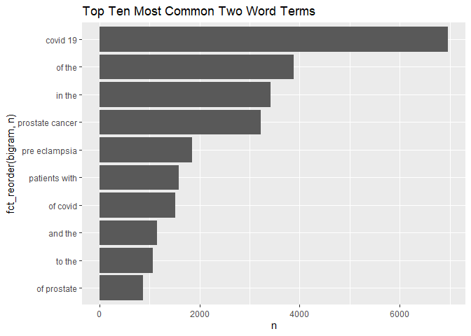

Homework 3
================
CB
2022-11-02

## R Markdown

### Load required libraries

``` r
library(data.table)
library(dplyr)
```

    ## 
    ## Attaching package: 'dplyr'

    ## The following objects are masked from 'package:data.table':
    ## 
    ##     between, first, last

    ## The following objects are masked from 'package:stats':
    ## 
    ##     filter, lag

    ## The following objects are masked from 'package:base':
    ## 
    ##     intersect, setdiff, setequal, union

``` r
library(tidyverse)
```

    ## ── Attaching packages
    ## ───────────────────────────────────────
    ## tidyverse 1.3.2 ──

    ## ✔ ggplot2 3.3.6     ✔ purrr   0.3.4
    ## ✔ tibble  3.1.8     ✔ stringr 1.4.1
    ## ✔ tidyr   1.2.0     ✔ forcats 0.5.2
    ## ✔ readr   2.1.2     
    ## ── Conflicts ────────────────────────────────────────── tidyverse_conflicts() ──
    ## ✖ dplyr::between()   masks data.table::between()
    ## ✖ dplyr::filter()    masks stats::filter()
    ## ✖ dplyr::first()     masks data.table::first()
    ## ✖ dplyr::lag()       masks stats::lag()
    ## ✖ dplyr::last()      masks data.table::last()
    ## ✖ purrr::transpose() masks data.table::transpose()

``` r
library(dtplyr)
library(knitr)
library(ggplot2)
library(rvest)
```

    ## 
    ## Attaching package: 'rvest'
    ## 
    ## The following object is masked from 'package:readr':
    ## 
    ##     guess_encoding

``` r
library(httr)
library(xml2)
library(stringr)
```

## Part 1: APIs

``` r
# Downloading the website
website <- xml2::read_html("https://pubmed.ncbi.nlm.nih.gov/?term=sars-cov-2%20trial%20vaccine")

# Finding the counts

counts <- xml2::xml_find_first(website, "/html/body/main/div[9]/div[2]/div[2]/div[1]/div[1]")

counts <- as.character(counts)
counts
```

    ## [1] "<div class=\"results-amount\">\n  \n    <span class=\"value\">4,002</span>\n    results\n  \n</div>"

``` r
# Extracting the data using regex
stringr::str_extract(counts, "[0-9,]+")
```

    ## [1] "4,002"

### *There are 3,997 results from this search*

### Create database

``` r
query_ids <- GET(
  url   = "https://eutils.ncbi.nlm.nih.gov/entrez/eutils/esearch.fcgi",
  query = list(
    db      = "pubmed",
    term    = "sars-cov-2 trial vaccine",
    retmax  = 250
  ), 
)
```

``` r
# Extracting, make character
ids <- httr::content(query_ids)
ids <- as.character(ids)
```

``` r
ids <- stringr::str_extract_all(ids, "<Id>[[:digit:]]+</Id>")[[1]]
# Remove all the leading and trailing <Id> </Id>. 
ids <- stringr::str_remove_all(ids, "</?Id>")
head(ids)
```

    ## [1] "36307830" "36305195" "36301821" "36299427" "36298743" "36298641"

``` r
publications <- GET(
  url   = "https://eutils.ncbi.nlm.nih.gov/entrez/eutils/efetch.fcgi",
  query = list(
    db  = "pubmed",
    id  = paste(ids,collapse = ","),
  retmax = 250,
  rettype = "abstract"
    )
)
# Extracting the content of the response of GET
publications <- httr::content(publications)

publications_txt <- as.character(publications)
```

### Create a dataset containing Pubmed ID number,Title of the paper,Name of the journal where it was published,Publication date, and Abstract of the paper (if any).

``` r
pub_char_list <- xml2::xml_children(publications)
pub_char_list <- sapply(pub_char_list, as.character)
```

``` r
titles <- str_extract(pub_char_list, "<ArticleTitle>[[:print:][:space:]]+</ArticleTitle>")
titles[[1]]
```

    ## [1] "<ArticleTitle>Improving pediatric COVID-19 vaccine uptake using an mHealth tool (MoVeUp): study protocol for a randomized, controlled trial.</ArticleTitle>"

``` r
titles <- str_remove_all(titles, "</?[[:alnum:]- =\"]+>")
titles[[1]]
```

    ## [1] "Improving pediatric COVID-19 vaccine uptake using an mHealth tool (MoVeUp): study protocol for a randomized, controlled trial."

``` r
journalname <- str_extract(pub_char_list, "<Title>[[:print:][:space:]]+</Title>")
journalname[[1]]
```

    ## [1] "<Title>Trials</Title>"

``` r
journalname <- str_remove_all(journalname, "</?[[:alnum:]- =\"]+>")
journalname[[1]]
```

    ## [1] "Trials"

``` r
abstracts <- str_extract(pub_char_list, "<Abstract>[[:print:][:space:]]+</Abstract>")
abstracts[[1]]
```

    ## [1] "<Abstract>\n        <AbstractText Label=\"BACKGROUND\" NlmCategory=\"BACKGROUND\">Coronavirus disease 2019 (COVID-19) vaccines demonstrate excellent effectiveness against infection, severe disease, and death. However, pediatric COVID-19 vaccination rates lag among individuals from rural and other medically underserved communities. The research objective of the current protocol is to determine the effectiveness of a vaccine communication mobile health (mHealth) application (app) on parental decisions to vaccinate their children against COVID-19.</AbstractText>\n        <AbstractText Label=\"METHODS\" NlmCategory=\"METHODS\">Custodial parents/caregivers with ≥ 1 child eligible for COVID-19 vaccination who have not yet received the vaccine will be randomized to download one of two mHealth apps. The intervention app will address logistical and motivational barriers to pediatric COVID-19 vaccination. Participants will receive eight weekly push notifications followed by two monthly push notifications (cues to action) regarding vaccinating their child. Through branching logic, users will access customized content based on their locality, degree of rurality-urbanicity, primary language (English/Spanish), race/ethnicity, and child's age to address COVID-19 vaccine knowledge and confidence gaps. The control app will provide push notifications and information on general pediatric health and infection prevention and mitigation strategies based on recommendations from the American Academy of Pediatrics (AAP) and the Centers for Disease Control and Prevention (CDC). The primary outcome is the proportion of children who complete COVID-19 vaccination series. Secondary outcomes include the proportion of children who receive ≥ 1 dose of COVID-19 vaccine and changes in parent/caregiver scores from baseline to immediately post-intervention on the modified WHO SAGE Vaccine Hesitancy Scale adapted for the COVID-19 vaccine.</AbstractText>\n        <AbstractText Label=\"DISCUSSION\" NlmCategory=\"CONCLUSIONS\">The COVID-19 pandemic inflicts disproportionate harm on individuals from underserved communities, including those in rural settings. Maximizing vaccine uptake in these communities will decrease infection rates, severe illness, and death. Given that most US families from these communities use smart phones, mHealth interventions hold the promise of broad uptake. Bundling multiple mHealth vaccine uptake interventions into a single app may maximize the impact of deploying such a tool to increase COVID-19 vaccination. The new knowledge to be gained from this study will directly inform future efforts to increase COVID-19 vaccination rates across diverse settings and provide an evidentiary base for app-based vaccine communication tools that can be adapted to future vaccine-deployment efforts.</AbstractText>\n        <AbstractText Label=\"CLINICAL TRIALS REGISTRATION\" NlmCategory=\"BACKGROUND\">ClinicalTrials.gov NCT05386355 . Registered on May 23, 2022.</AbstractText>\n        <CopyrightInformation>© 2022. The Author(s).</CopyrightInformation>\n      </Abstract>"

``` r
abstracts <- str_remove_all(abstracts, "</?[[:alnum:]- =\"]+>") 
abstracts[[1]]
```

    ## [1] "\n        Coronavirus disease 2019 (COVID-19) vaccines demonstrate excellent effectiveness against infection, severe disease, and death. However, pediatric COVID-19 vaccination rates lag among individuals from rural and other medically underserved communities. The research objective of the current protocol is to determine the effectiveness of a vaccine communication mobile health (mHealth) application (app) on parental decisions to vaccinate their children against COVID-19.\n        Custodial parents/caregivers with ≥ 1 child eligible for COVID-19 vaccination who have not yet received the vaccine will be randomized to download one of two mHealth apps. The intervention app will address logistical and motivational barriers to pediatric COVID-19 vaccination. Participants will receive eight weekly push notifications followed by two monthly push notifications (cues to action) regarding vaccinating their child. Through branching logic, users will access customized content based on their locality, degree of rurality-urbanicity, primary language (English/Spanish), race/ethnicity, and child's age to address COVID-19 vaccine knowledge and confidence gaps. The control app will provide push notifications and information on general pediatric health and infection prevention and mitigation strategies based on recommendations from the American Academy of Pediatrics (AAP) and the Centers for Disease Control and Prevention (CDC). The primary outcome is the proportion of children who complete COVID-19 vaccination series. Secondary outcomes include the proportion of children who receive ≥ 1 dose of COVID-19 vaccine and changes in parent/caregiver scores from baseline to immediately post-intervention on the modified WHO SAGE Vaccine Hesitancy Scale adapted for the COVID-19 vaccine.\n        The COVID-19 pandemic inflicts disproportionate harm on individuals from underserved communities, including those in rural settings. Maximizing vaccine uptake in these communities will decrease infection rates, severe illness, and death. Given that most US families from these communities use smart phones, mHealth interventions hold the promise of broad uptake. Bundling multiple mHealth vaccine uptake interventions into a single app may maximize the impact of deploying such a tool to increase COVID-19 vaccination. The new knowledge to be gained from this study will directly inform future efforts to increase COVID-19 vaccination rates across diverse settings and provide an evidentiary base for app-based vaccine communication tools that can be adapted to future vaccine-deployment efforts.\n        ClinicalTrials.gov NCT05386355 . Registered on May 23, 2022.\n        © 2022. The Author(s).\n      "

``` r
abstracts <- str_replace_all(abstracts, "[[:space:]]+"," ")
abstracts[[1]]
```

    ## [1] " Coronavirus disease 2019 (COVID-19) vaccines demonstrate excellent effectiveness against infection, severe disease, and death. However, pediatric COVID-19 vaccination rates lag among individuals from rural and other medically underserved communities. The research objective of the current protocol is to determine the effectiveness of a vaccine communication mobile health (mHealth) application (app) on parental decisions to vaccinate their children against COVID-19. Custodial parents/caregivers with ≥ 1 child eligible for COVID-19 vaccination who have not yet received the vaccine will be randomized to download one of two mHealth apps. The intervention app will address logistical and motivational barriers to pediatric COVID-19 vaccination. Participants will receive eight weekly push notifications followed by two monthly push notifications (cues to action) regarding vaccinating their child. Through branching logic, users will access customized content based on their locality, degree of rurality-urbanicity, primary language (English/Spanish), race/ethnicity, and child's age to address COVID-19 vaccine knowledge and confidence gaps. The control app will provide push notifications and information on general pediatric health and infection prevention and mitigation strategies based on recommendations from the American Academy of Pediatrics (AAP) and the Centers for Disease Control and Prevention (CDC). The primary outcome is the proportion of children who complete COVID-19 vaccination series. Secondary outcomes include the proportion of children who receive ≥ 1 dose of COVID-19 vaccine and changes in parent/caregiver scores from baseline to immediately post-intervention on the modified WHO SAGE Vaccine Hesitancy Scale adapted for the COVID-19 vaccine. The COVID-19 pandemic inflicts disproportionate harm on individuals from underserved communities, including those in rural settings. Maximizing vaccine uptake in these communities will decrease infection rates, severe illness, and death. Given that most US families from these communities use smart phones, mHealth interventions hold the promise of broad uptake. Bundling multiple mHealth vaccine uptake interventions into a single app may maximize the impact of deploying such a tool to increase COVID-19 vaccination. The new knowledge to be gained from this study will directly inform future efforts to increase COVID-19 vaccination rates across diverse settings and provide an evidentiary base for app-based vaccine communication tools that can be adapted to future vaccine-deployment efforts. ClinicalTrials.gov NCT05386355 . Registered on May 23, 2022. © 2022. The Author(s). "

``` r
pubyear <- str_extract(pub_char_list, "<Year>[0-9]{4}</Year>")
pubyear[[1]]
```

    ## [1] "<Year>2022</Year>"

``` r
pubyear <- str_remove_all(pubyear, "</?[[:alnum:]- =\"]+>")
pubyear[[1]]
```

    ## [1] "2022"

``` r
pubmonth <- str_extract(pub_char_list, "<Month>[a-zA-Z]{3}</Month>")
pubmonth[[1]]
```

    ## [1] "<Month>Oct</Month>"

``` r
pubmonth <- str_remove_all(pubmonth, "</?[[:alnum:]- =\"]+>")
pubmonth[[1]]
```

    ## [1] "Oct"

``` r
pubday <- str_extract(pub_char_list, "<Day>[0-9]{1,2}</Day>")
pubday[[1]]
```

    ## [1] "<Day>01</Day>"

``` r
pubday <- str_remove_all(pubday, "</?[[:alnum:]- =\"]+>")
pubday[[1]]
```

    ## [1] "01"

### Make a table with the dataset information

``` r
#Create publication date variable
pubdate <- paste(pubmonth, pubday, pubyear, sep="-")
pubdate[[1]]
```

    ## [1] "Oct-01-2022"

``` r
#Create table with all elements
database <- data.frame(
  PubMedId = ids,
  Title    = titles,
  Abstract = abstracts,
  Journal =journalname,
  Publication_Date=pubdate
  
)
knitr::kable(database[1:10,], caption = "Covid-19 Vaccine Trials Papers")
```

| PubMedId | Title                                                                                                                                                                                                                     | Abstract                                                                                                                                                                                                                                                                                                                                                                                                                                                                                                                                                                                                                                                                                                                                                                                                                                                                                                                                                                                                                                                                                                                                                                                                                                                                                                                                                                                                                                                                                                                                                                                                                                                                                                                                                                                                                                                                                                                                                                                                                                                                                                                                                                                                                                                                                                                                                                                                                                                                                                                                                                                                                                                                                                                                                                                                                                                                                                                                                                                                                                                                                                                                                                             | Journal                                           | Publication_Date |
|:---------|:--------------------------------------------------------------------------------------------------------------------------------------------------------------------------------------------------------------------------|:-------------------------------------------------------------------------------------------------------------------------------------------------------------------------------------------------------------------------------------------------------------------------------------------------------------------------------------------------------------------------------------------------------------------------------------------------------------------------------------------------------------------------------------------------------------------------------------------------------------------------------------------------------------------------------------------------------------------------------------------------------------------------------------------------------------------------------------------------------------------------------------------------------------------------------------------------------------------------------------------------------------------------------------------------------------------------------------------------------------------------------------------------------------------------------------------------------------------------------------------------------------------------------------------------------------------------------------------------------------------------------------------------------------------------------------------------------------------------------------------------------------------------------------------------------------------------------------------------------------------------------------------------------------------------------------------------------------------------------------------------------------------------------------------------------------------------------------------------------------------------------------------------------------------------------------------------------------------------------------------------------------------------------------------------------------------------------------------------------------------------------------------------------------------------------------------------------------------------------------------------------------------------------------------------------------------------------------------------------------------------------------------------------------------------------------------------------------------------------------------------------------------------------------------------------------------------------------------------------------------------------------------------------------------------------------------------------------------------------------------------------------------------------------------------------------------------------------------------------------------------------------------------------------------------------------------------------------------------------------------------------------------------------------------------------------------------------------------------------------------------------------------------------------------------------------|:--------------------------------------------------|:-----------------|
| 36307830 | Improving pediatric COVID-19 vaccine uptake using an mHealth tool (MoVeUp): study protocol for a randomized, controlled trial.                                                                                            | Coronavirus disease 2019 (COVID-19) vaccines demonstrate excellent effectiveness against infection, severe disease, and death. However, pediatric COVID-19 vaccination rates lag among individuals from rural and other medically underserved communities. The research objective of the current protocol is to determine the effectiveness of a vaccine communication mobile health (mHealth) application (app) on parental decisions to vaccinate their children against COVID-19. Custodial parents/caregivers with ≥ 1 child eligible for COVID-19 vaccination who have not yet received the vaccine will be randomized to download one of two mHealth apps. The intervention app will address logistical and motivational barriers to pediatric COVID-19 vaccination. Participants will receive eight weekly push notifications followed by two monthly push notifications (cues to action) regarding vaccinating their child. Through branching logic, users will access customized content based on their locality, degree of rurality-urbanicity, primary language (English/Spanish), race/ethnicity, and child’s age to address COVID-19 vaccine knowledge and confidence gaps. The control app will provide push notifications and information on general pediatric health and infection prevention and mitigation strategies based on recommendations from the American Academy of Pediatrics (AAP) and the Centers for Disease Control and Prevention (CDC). The primary outcome is the proportion of children who complete COVID-19 vaccination series. Secondary outcomes include the proportion of children who receive ≥ 1 dose of COVID-19 vaccine and changes in parent/caregiver scores from baseline to immediately post-intervention on the modified WHO SAGE Vaccine Hesitancy Scale adapted for the COVID-19 vaccine. The COVID-19 pandemic inflicts disproportionate harm on individuals from underserved communities, including those in rural settings. Maximizing vaccine uptake in these communities will decrease infection rates, severe illness, and death. Given that most US families from these communities use smart phones, mHealth interventions hold the promise of broad uptake. Bundling multiple mHealth vaccine uptake interventions into a single app may maximize the impact of deploying such a tool to increase COVID-19 vaccination. The new knowledge to be gained from this study will directly inform future efforts to increase COVID-19 vaccination rates across diverse settings and provide an evidentiary base for app-based vaccine communication tools that can be adapted to future vaccine-deployment efforts. ClinicalTrials.gov NCT05386355 . Registered on May 23, 2022. © 2022. The Author(s).                                                                                                                                                                                                                                                                                                                                                                                                                        | Trials                                            | Oct-01-2022      |
| 36305195 | Deep learning in drug discovery: a futuristic modality to materialize the large datasets for cheminformatics.                                                                                                             | Artificial intelligence (AI) development imitates the workings of the human brain to comprehend modern problems. The traditional approaches such as high throughput screening (HTS) and combinatorial chemistry are lengthy and expensive to the pharmaceutical industry as they can only handle a smaller dataset. Deep learning (DL) is a sophisticated AI method that uses a thorough comprehension of particular systems. The pharmaceutical industry is now adopting DL techniques to enhance the research and development process. Multi-oriented algorithms play a crucial role in the processing of QSAR analysis, de novo drug design, ADME evaluation, physicochemical analysis, preclinical development, followed by clinical trial data precision. In this study, we investigated the performance of several algorithms, including deep neural networks (DNN), convolutional neural networks (CNN) and multi-task learning (MTL), with the aim of generating high-quality, interpretable big and diverse databases for drug design and development. Studies have demonstrated that CNN, recurrent neural network and deep belief network are compatible, accurate and effective for the molecular description of pharmacodynamic properties. In Covid-19, existing pharmacological compounds has also been repurposed using DL models. In the absence of the Covid-19 vaccine, remdesivir and oseltamivir have been widely employed to treat severe SARS-CoV-2 infections. In conclusion, the results indicate the potential benefits of employing the DL strategies in the drug discovery process.Communicated by Ramaswamy H. Sarma.                                                                                                                                                                                                                                                                                                                                                                                                                                                                                                                                                                                                                                                                                                                                                                                                                                                                                                                                                                                                                                                                                                                                                                                                                                                                                                                                                                                                                                                                                                                                   | Journal of biomolecular structure & dynamics      | Oct-30-2022      |
| 36301821 | Immunogenicity and reactogenicity of SARS-CoV-2 vaccines in people living with HIV in the Netherlands: A nationwide prospective cohort study.                                                                             | Vaccines can be less immunogenic in people living with HIV (PLWH), but for SARS-CoV-2 vaccinations this is unknown. In this study we set out to investigate, for the vaccines currently approved in the Netherlands, the immunogenicity and reactogenicity of SARS-CoV-2 vaccinations in PLWH. We conducted a prospective cohort study to examine the immunogenicity of BNT162b2, mRNA-1273, ChAdOx1-S, and Ad26.COV2.S vaccines in adult PLWH without prior COVID-19, and compared to HIV-negative controls. The primary endpoint was the anti-spike SARS-CoV-2 IgG response after mRNA vaccination. Secondary endpoints included the serological response after vector vaccination, anti-SARS-CoV-2 T-cell response, and reactogenicity. Between 14 February and 7 September 2021, 1,154 PLWH (median age 53 \[IQR 44-60\] years, 85.5% male) and 440 controls (median age 43 \[IQR 33-53\] years, 28.6% male) were included in the final analysis. Of the PLWH, 884 received BNT162b2, 100 received mRNA-1273, 150 received ChAdOx1-S, and 20 received Ad26.COV2.S. In the group of PLWH, 99% were on antiretroviral therapy, 97.7% were virally suppressed, and the median CD4+ T-cell count was 710 cells/μL (IQR 520-913). Of the controls, 247 received mRNA-1273, 94 received BNT162b2, 26 received ChAdOx1-S, and 73 received Ad26.COV2.S. After mRNA vaccination, geometric mean antibody concentration was 1,418 BAU/mL in PLWH (95% CI 1322-1523), and after adjustment for age, sex, and vaccine type, HIV status remained associated with a decreased response (0.607, 95% CI 0.508-0.725, p \< 0.001). All controls receiving an mRNA vaccine had an adequate response, defined as \>300 BAU/mL, whilst in PLWH this response rate was 93.6%. In PLWH vaccinated with mRNA-based vaccines, higher antibody responses were predicted by CD4+ T-cell count 250-500 cells/μL (2.845, 95% CI 1.876-4.314, p \< 0.001) or \>500 cells/μL (2.936, 95% CI 1.961-4.394, p \< 0.001), whilst a viral load \> 50 copies/mL was associated with a reduced response (0.454, 95% CI 0.286-0.720, p = 0.001). Increased IFN-γ, CD4+ T-cell, and CD8+ T-cell responses were observed after stimulation with SARS-CoV-2 spike peptides in ELISpot and activation-induced marker assays, comparable to controls. Reactogenicity was generally mild, without vaccine-related serious adverse events. Due to the control of vaccine provision by the Dutch National Institute for Public Health and the Environment, there were some differences between vaccine groups in the age, sex, and CD4+ T-cell counts of recipients. After vaccination with BNT162b2 or mRNA-1273, anti-spike SARS-CoV-2 antibody levels were reduced in PLWH compared to HIV-negative controls. To reach and maintain the same serological responses as HIV-negative controls, additional vaccinations are probably required. The trial was registered in the Netherlands Trial Register (NL9214). <https://www.trialregister.nl/trial/9214>.                                                                                                                                                                 | PLoS medicine                                     | Oct-31-2022      |
| 36299427 | Fluvoxamine for Outpatient Treatment of COVID-19: A Decentralized, Placebo-controlled, Randomized, Platform Clinical Trial.                                                                                               | The effectiveness of fluvoxamine to shorten symptom duration or prevent hospitalization among outpatients in the US with mild to moderate symptomatic coronavirus disease 2019 (COVID-19) is unclear. ACTIV-6 is an ongoing, decentralized, double-blind, randomized, placebo-controlled platform trial testing repurposed medications in outpatients with mild to moderate COVID-19. A total of 1288 non-hospitalized adults aged ≥30 years with confirmed COVID-19 experiencing ≥2 symptoms of acute infection for ≤7 days prior to randomization were randomized to receive fluvoxamine 50 mg or placebo twice daily for 10 days. The primary outcome was time to sustained recovery, defined as the third of 3 consecutive days without symptoms. Secondary outcomes included composites of hospitalization or death with or without urgent or emergency care visit by day 28. Of 1331 participants randomized (mean \[SD\] age, 48.5 \[12.8\] years; 57% women; 67% reported receiving at least 2 doses of a SARS-CoV-2 vaccine), 1288 completed the trial (n=614 placebo, n=674 fluvoxamine). Median time to recovery was 13 days (IQR 12-13) in the placebo group and 12 days (IQR 11-14) in the fluvoxamine group (hazard ratio \[HR\] 0.96, 95% credible interval \[CrI\] 0.86-1.07; posterior probability for benefit \[HR\>1\]=0.22). Twenty-six participants (3.9%) in the fluvoxamine group were hospitalized or had urgent or emergency care visits compared with 23 (3.8%) in the placebo group (HR 1.1, 95% CrI 0.6-1.8; posterior probability for benefit \[HR\<1\]=0.340). One participant in the fluvoxamine group and 2 in the placebo group were hospitalized; no deaths occurred. Adverse events were uncommon in both groups. Treatment with fluvoxamine 50 mg twice daily for 10 days did not improve time to recovery, compared with placebo, among outpatients with mild to moderate COVID-19. These findings do not support the use of fluvoxamine at this dose and duration in patients with mild to moderate COVID-19.                                                                                                                                                                                                                                                                                                                                                                                                                                                                                                                                                                                                                                                                                                                                                                                                                                                                                                                                                                                                                                                                                                                                  | medRxiv : the preprint server for health sciences | Oct-27-2022      |
| 36298743 | Immunogenicity, Safety, and Anti-Viral Efficacy of a Subunit SARS-CoV-2 Vaccine Candidate in Captive Black-Footed Ferrets (Mustela nigripes) and Their Susceptibility to Viral Challenge.                                 | A preliminary vaccination trial against the emergent pathogen, SARS-CoV-2, was completed in captive black-footed ferrets (Mustela nigripes; BFF) to assess safety, immunogenicity, and anti-viral efficacy. Vaccination and boosting of 15 BFF with purified SARS-CoV-2 S1 subunit protein produced a nearly 150-fold increase in mean antibody titers compared to pre-vaccination titers. Serum antibody responses were highest in young animals, but in all vaccinees, antibody response declined rapidly. Anti-viral activity from vaccinated and unvaccinated BFF was determined in vitro, as well as in vivo with a passive serum transfer study in mice. Transgenic mice that received BFF serum transfers and were subsequently challenged with SARS-CoV-2 had lung viral loads that negatively correlated (p &lt; 0.05) with the BFF serum titer received. Lastly, an experimental challenge study in a small group of BFF was completed to test susceptibility to SARS-CoV-2. Despite viral replication and shedding in the upper respiratory tract for up to 7 days post-challenge, no clinical disease was observed in either vaccinated or naive animals. The lack of morbidity or mortality observed indicates SARS-CoV-2 is unlikely to affect wild BFF populations, but infected captive animals pose a potential risk, albeit low, for humans and other animals.                                                                                                                                                                                                                                                                                                                                                                                                                                                                                                                                                                                                                                                                                                                                                                                                                                                                                                                                                                                                                                                                                                                                                                                                                                                                                                                                                                                                                                                                                                                                                                                                                                                                                                                                                                                                     | Viruses                                           | Oct-31-2022      |
| 36298641 | COVID-19 Vaccines against Omicron Variant: Real-World Data on Effectiveness.                                                                                                                                              | The efficacy of vaccines against coronavirus disease 2019 (COVID-19) has now been well established in phase III clinical trials. However, clinical studies based on real-world data remain critical to assess vaccines effectiveness (VE), especially in specific populations and against variants of concern (VOC). This review presents the principles and methods of VE studies and the main available results on VE of COVID-19 vaccines at the time of Omicron circulation. References for this narrative review were identified through searches of PubMed database up to 13 September 2022. The results of phase III clinical trials have been globally confirmed by VE in real-life studies, including in the elderly. Emergence of VOC Omicron emphasized the importance of booster doses to maintain a high level of protection against severe forms. There are still numerous challenges regarding booster(s) and duration of immunity, particularly in specific subpopulations, and regarding the need for adapted vaccines.                                                                                                                                                                                                                                                                                                                                                                                                                                                                                                                                                                                                                                                                                                                                                                                                                                                                                                                                                                                                                                                                                                                                                                                                                                                                                                                                                                                                                                                                                                                                                                                                                                                                                                                                                                                                                                                                                                                                                                                                                                                                                                                                             | Viruses                                           | Sep-31-2022      |
| 36287714 | A Novel RBD-Protein/Peptide Vaccine Elicits Broadly Neutralizing Antibodies and Protects Mice and Macaques against SARS-CoV-2.                                                                                            | The development of safe and effective vaccines to respond to COVID-19 pandemic/endemic remains a priority. We developed a novel subunit protein-peptide COVID-19 vaccine candidate (UB-612) composed of: (i) receptor binding domain of SARS-CoV-2 spike protein fused to a modified single-chain human IgG1 Fc; (ii) five synthetic peptides incorporating conserved helper and cytotoxic T lymphocyte (Th/CTL) epitopes derived from SARS-CoV-2 structural proteins (three from S2 subunit, one from membrane and one from nucleocapsid), and one universal Th peptide; (iii) aluminum phosphate as adjuvant. The immunogenicity and protective immunity induced by UB-612 vaccine were evaluated in four animal models: Sprague-Dawley rats, AAV-hACE2 transduced BALB/c mice, rhesus and cynomolgus macaques. UB-612 vaccine induced high levels of neutralizing antibody and T-cell responses, in all animals. The immune sera from vaccinated animals neutralized the SARS-CoV-2 original wild-type strains and multiple variants of concern, including Delta and Omicron. The vaccination significantly reduced viral loads, lung pathology scores, and disease progression after intranasal and intratracheal challenge with SARS-CoV-2 in mice, rhesus and cynomolgus macaques. UB-612 has been tested in primary regimens in Phase 1 and Phase 2 clinical studies and is currently being evaluated in a global pivotal Phase 3 clinical study as a single dose heterologous booster.Trial registration: ClinicalTrials.gov identifier: NCT05293665..                                                                                                                                                                                                                                                                                                                                                                                                                                                                                                                                                                                                                                                                                                                                                                                                                                                                                                                                                                                                                                                                                                                                                                                                                                                                                                                                                                                                                                                                                                                                                                                                                       | Emerging microbes & infections                    | Oct-27-2022      |
| 36278465 | State-of-the-art tools to elucidate the therapeutic potential of TAT-peptide (TP) conjugated repurposing drug against SARS-CoV-2 spike glycoproteins.                                                                     | In late 2019, a highly infectious and pathogenic coronavirus was recognized as Severe Acute Respiratory Coronavirus 2 (SARS-CoV-2) which causes acute respiratory disease, threatening human health and public safety. A total of 448,327,303 documented cases and 6,028,576 deaths have been reported as of March 8th 2022. The COVID-19 vaccines currently undergoing clinical trials or already in use should provide at least some protection against SARS-CoV-2; however, the emergence of new variations as a result of mutations may lessen the effectiveness of the currently available vaccines. Since the efficacy of available drugs and vaccines against COVID-19 is notably lower, there is an urgent need to develop a potential drug to treat this deadly disease. The SARS-CoV-2 spike (SCoV-SG) is the foremost drug target among coronaviruses. ObjectiveL: The major objectives of the current study are to conduct a molecular docking study investigation of TAT-peptide47-57(GRKKRRQRRRP)-conjugated remodified therapeutics such as ritonavir (RTV), lopinavir (LPV), favipiravir (FPV), remdesivir (RMV), hydroxychloroquine (HCQ), molnupiravir (MNV) and nirmatrelvir (NMV) with (SCoV-SG) structure. Molecular docking analysis was performed to study the interaction of repurposed drugs and drugs conjugated with the TAT-peptide with target SARS-CoV-2 spike glycoprotein (PDB ID: 6VYB) using AutoDock. Further docking investigation was completed with PatchDock and was visualized by discovery the studio visualizer 2020. TAT-peptides are well-characterized immune enhancers that are used in intracellular drug delivery. The results of molecular docking analysis showed higher efficiency and significantly enhanced and improved interactions between TP-conjugated repurposed drugs and the target sites of the SCoV-SG structure. The study concluded that TP-conjugated repurposed drugs may be effective in preventing COVID-19, and therefore, in vitro, in vivo, and clinical trial studies are required in detail. Copyright© Bentham Science Publishers; For any queries, please email at <epub@benthamscience.net>.                                                                                                                                                                                                                                                                                                                                                                                                                                                                                                                                                                                                                                                                                                                                                                                                                                                                                                                                                                                                            | Current pharmaceutical design                     | Oct-24-2022      |
| 36276877 | Trends and factors associated with change in COVID-19 vaccination intent among residents and staff in six Seattle homeless shelters, March 2020 to August 2021.                                                           | Achieving high COVID-19 vaccination coverage in homeless shelters is critical in preventing morbidity, mortality, and outbreaks, however, vaccination coverage remains lower among people experiencing homelessness (PEH) than the general population. We conducted a cross-sectional study to retrospectively describe attitudes and identify factors associated with change in COVID-19 vaccination intent among shelter residents and staff during March 2020 - August 2021. To identify factors associated with change in COVID-19 vaccine intent becoming more positive overall compared to other attitudes, we utilized a Poisson model to calculate Risk Ratios with robust standard errors, adjusting for confounding by shelter site and demographic variables determined a priori. From July 12 - August 2, 2021, 97 residents and 20 staff participated in surveys across six shelters in Seattle King County, Washington. Intent to be vaccinated against COVID-19 increased from 45.3 % (n = 53) when recalling attitudes in March 2020 to 74.4 % (n = 87) as of August 2021, and was similar among residents and staff. Many participants (43.6 %, n = 51) indicated feeling increasingly accepting about receiving a COVID-19 vaccine since March 2020, while 13.7 % (n = 16) changed back and forth, 10.3 % (n = 12) became more hesitant, and 32.5 % (n = 38) had no change in intent. In the model examining the relationship between becoming more positive about receiving a COVID-19 vaccine compared to all other attitudes (n = 116), we found a 57.2 % increase in vaccine acceptability (RR 1.57; 95 % CI: 1.01, 2.45) among those who reported worsening mental health since the start of the pandemic. Findings highlight opportunities to improve communication with residents and staff about COVID-19 vaccination and support a need for continued dialogue and a person-centered approach to understanding the sociocultural complexities and dynamism of vaccine attitudes at shelters.Clinical Trial Registry Number: NCT04141917. © 2022 The Author(s).                                                                                                                                                                                                                                                                                                                                                                                                                                                                                                                                                                                                                                                                                                                                                                                                                                                                                                                                                                                                                                                                                            | Vaccine: X                                        | Dec-01-2022      |
| 36273491 | Durability of ChAdOx1 nCoV-19 (AZD1222) vaccine and hybrid humoral immunity against variants including omicron BA.1 and BA.4 6 months after vaccination (COV005): a post-hoc analysis of a randomised, phase 1b-2a trial. | COVID-19 vaccine rollout is lagging in Africa, where there has been a high rate of SARS-CoV-2 infection. We aimed to evaluate the effect of SARS-CoV-2 infection before vaccination with the ChAdOx-nCoV19 (AZD1222) vaccine on antibody responses through to 180 days. We did an unmasked post-hoc immunogenicity analysis after the first and second doses of AZD1222 in a randomised, placebo-controlled, phase 1b-2a study done in seven locations in South Africa. AZD1222 recipients who were HIV-uninfected, were stratified into baseline seropositive or seronegative groups using the serum anti-nucleocapsid (anti-N) immunoglobulin G (IgG) electroluminescence immunoassay to establish SARS-CoV-2 infection before the first dose of AZD1222. Binding IgG to spike (anti-S) and receptor binding domain (anti-RBD) were measured before the first dose (day 0), second dose (day 28), day 42, and day 180. Neutralising antibody (NAb) against SARS-CoV-2 variants D614G, beta, delta, gamma, and A.VOI.V2, and omicron BA1 and BA.4 variants, were measured by pseudovirus assay (day 28, day 42, and day 180). This trial is registered with ClinicalTrials.gov, NCT04444674, and the Pan African Clinicals Trials Registry, PACTR202006922165132. Of 185 individuals who were randomly assigned to AZD1222, we included 91 individuals who were baseline seropositive and 58 who were baseline seronegative, in the final analysis. In the seropositive group, there was little change of anti-S IgG (and anti-RBD IgG) or neutralising antibody (NAb) titres at day 42 compared with at day 28. Anti-S (and anti-RBD) IgG geometric mean concentrations (GMCs) were higher throughout in the seropositive compared with the seronegative group, including at day 180 (GMCs 517·8 \[95% CI 411·3-651·9\] vs 82·1 \[55·2-122·3\] BAU/mL). Also D614G NAb geometric mean titres (GMTs) were higher in the seropositive group than the seronegative group, as was the percentage with titres of at least 185 (80% putative risk reduction threshold \[PRRT\] against wild-type-alpha COVID-19), including at day 180 (92·0% \[74·0-99·0\] vs 18·2% \[2·3-51·8). Similar findings were observed for beta, A.VOI.V2, and gamma. For delta, BA.1, and BA.4, NAb GMTs and the proportion with titres above the PRRT were substantially higher in the seropositive compared with seronegative group at day 28 and day 42, but no longer differed between the groups by day 180. A single dose of AZD1222 in the general African population, where COVID-19 vaccine coverage is low and SARS-CoV-2 seropositivity is 90%, could enhance the magnitude and quality of antibody responses to SARS-CoV-2. The Bill & Melinda Gates Foundation, the South African Medical Research Council, the UK Research and Innovation, the UK National Institute for Health Research, and the South African Medical Research Council. For the Zulu translation of the abstract see Supplementary Materials section. Copyright © 2022 The Author(s). Published by Elsevier Ltd. This is an Open Access article under the CC BY 4.0 license. Published by Elsevier Ltd.. All rights reserved. | The Lancet. Infectious diseases                   | Oct-28-2022      |

Covid-19 Vaccine Trials Papers

## Part 2: Text mining

``` r
#Obtain dataset, save to computer then load in (unable to load directly from website without issues)

library(tidytext)
pubmedabs <- read.csv("C:\\Users\\clair\\Desktop\\PM566\\pubmed.csv")
str(pubmedabs)
```

    ## 'data.frame':    3241 obs. of  2 variables:
    ##  $ abstract: chr  "Background and aims: Many patients with coronavirus disease 2019 (COVID-19) have underlying cardiovascular (CV)"| __truncated__ "Introduction: Contradictory data have been reported on the incidence of stroke in patients with COVID-19 and th"| __truncated__ "This article aims at collecting all information needed for dentists regarding the COVID-19 pandemic throughout "| __truncated__ "OBJECTIVE. The objective of our study was to determine the misdiagnosis rate of radiologists for coronavirus di"| __truncated__ ...
    ##  $ term    : chr  "covid" "covid" "covid" "covid" ...

``` r
library(forcats)
```

### Step 1: Tokenize the abstracts and count the number of each token

``` r
#Count number of tokens
pubmedabs %>%
  unnest_tokens(word, abstract) %>%
  count(word, sort = TRUE) %>% 
  top_n(10, n)
```

    ##     word     n
    ## 1    the 28126
    ## 2     of 24760
    ## 3    and 19993
    ## 4     in 14653
    ## 5     to 10920
    ## 6      a  8245
    ## 7   with  8038
    ## 8  covid  7275
    ## 9     19  7080
    ## 10    is  5649

``` r
#Look at top tokens 
pubmedabs %>%
  unnest_tokens(word, abstract) %>%
  #anti_join(stop_words, by = c("word")) %>%
  count(word, sort = TRUE)  %>%
  top_n(20, n) %>%
  ggplot(aes(n, fct_reorder(word, n))) +
  geom_col()
```

<!-- --> \### *Figure
showing the top 20 words in the abstracts. “COVID” and “19” are at the
top of the list, thus likely articles about COVID are the most common
abstracts. “Cancer” and “prostate” are also on the list and most likely
the second most common articles after COVID.*

``` r
#Remove stop words
pubmedabs %>%
  unnest_tokens(word, abstract) %>%
  count(word, sort = TRUE) %>%
  anti_join(stop_words, by = c("word")) %>%
  top_n(20, n) %>%
  ggplot(aes(n, fct_reorder(word, n))) +
  geom_col()
```

<!-- --> \### *Figure
showing the top 20 words AFTER removing stop words. This DOES change
what tokens appear as the most frequent, and now the results are more
illuminating. COVID is at the top so most likely these are the most
numerous articles. Then prostate cancer second. Pre-eclampsia is now on
the list so that may be the third most common article subject. The terms
“women” and “pregnancy” are probably high becuase these are article
about pre-eclampsia which is a pregnancy disorder.*

``` r
#Top 5 words table 

top5 <- 
    pubmedabs %>%
  unnest_tokens(word, abstract) %>%
  count(word, sort = TRUE) %>% 
  anti_join(stop_words, by = c("word")) 

top5<- top5[1:5,]

top5 %>%
    arrange(desc(n)) %>%
knitr::kable(caption = "Table - Top 5 Words", align=c("l", "c"))
```

| word     |  n   |
|:---------|:----:|
| covid    | 7275 |
| 19       | 7080 |
| patients | 4674 |
| cancer   | 3999 |
| prostate | 3832 |

Table - Top 5 Words

### Examine Top 5 words BY search term after removing stop words

``` r
top5byterm <- 
    pubmedabs %>%
    group_by(term) %>% 
  unnest_tokens(word, abstract) %>%
  count(word, sort = TRUE) %>% 
  anti_join(stop_words, by = c("word")) 

top5byterm %>%
    top_n(5,n) %>% 
    arrange(desc(term)) %>%
knitr::kable(caption = "Table - Top 5 Words by Search Term", align=c("l", "c","c"))
```

| term            |     word     |  n   |
|:----------------|:------------:|:----:|
| prostate cancer |    cancer    | 3840 |
| prostate cancer |   prostate   | 3832 |
| prostate cancer |   patients   | 934  |
| prostate cancer |  treatment   | 926  |
| prostate cancer |   disease    | 652  |
| preeclampsia    |     pre      | 2038 |
| preeclampsia    |  eclampsia   | 2005 |
| preeclampsia    | preeclampsia | 1863 |
| preeclampsia    |    women     | 1196 |
| preeclampsia    |  pregnancy   | 969  |
| meningitis      |   patients   | 446  |
| meningitis      |  meningitis  | 429  |
| meningitis      |  meningeal   | 219  |
| meningitis      |     csf      | 206  |
| meningitis      |   clinical   | 187  |
| cystic fibrosis |   fibrosis   | 867  |
| cystic fibrosis |    cystic    | 862  |
| cystic fibrosis |      cf      | 625  |
| cystic fibrosis |   patients   | 586  |
| cystic fibrosis |   disease    | 400  |
| covid           |    covid     | 7275 |
| covid           |      19      | 7035 |
| covid           |   patients   | 2293 |
| covid           |   disease    | 943  |
| covid           |   pandemic   | 800  |

Table - Top 5 Words by Search Term

### *Table showing the top 5 terms from each search term abstract. We can see that the top terms are very different depending on the original search term. We get more words that are more specific to that particular topic.*

## Step 2: Tokenize the abstracts into bigrams. Find the 10 most common bigrams and visualize them with ggplot2.

``` r
pubmedabs %>%
  unnest_ngrams(bigram, abstract, n=2) %>%
  count(bigram, sort = TRUE) %>%
  top_n(10, n) %>%
  ggplot(aes(n, fct_reorder(bigram, n))) +
  geom_col()+
  labs(title="Top Ten Most Common Two Word Terms")
```

<!-- -->

### \_ Figure showing the top ten most common two word terms (“bigrams”) in the abstracts. Covid-19 is likely the most common abstract subject, followed by prostate cancer and pre-eclampsia.\_

### Step 3: Calculate the TF-IDF value for each word-search term combination. (here you want the search term to be the “document”) What are the 5 tokens from each search term with the highest TF-IDF value? How are the results different from the answers you got in question 1?

``` r
#Check number of terms in the dataset to confirm 
search_term <- 
    pubmedabs %>%
    count(term)

search_term %>%
    arrange(desc(n)) %>%
knitr::kable()
```

| term            |   n |
|:----------------|----:|
| covid           | 981 |
| prostate cancer | 787 |
| preeclampsia    | 780 |
| cystic fibrosis | 376 |
| meningitis      | 317 |

``` r
term_table <-pubmedabs %>%
  group_by(term) %>% 
  unnest_tokens(word, abstract) %>%
  count(word, sort = TRUE) %>%
    bind_tf_idf(word, term, n)


term_table %>%
    top_n(5,tf_idf) %>% 
    arrange(desc(term)) %>%
knitr::kable(digits =4, align=c("l", "c", "c", "c","c","c"), caption = "Table - Top 5 TF-IDFs by Search Term")
```

| term            |      word       |  n   |   tf   |  idf   | tf_idf |
|:----------------|:---------------:|:----:|:------:|:------:|:------:|
| prostate cancer |    prostate     | 3832 | 0.0312 | 1.6094 | 0.0502 |
| prostate cancer |    androgen     | 305  | 0.0025 | 1.6094 | 0.0040 |
| prostate cancer |       psa       | 282  | 0.0023 | 1.6094 | 0.0037 |
| prostate cancer |  prostatectomy  | 215  | 0.0017 | 1.6094 | 0.0028 |
| prostate cancer |   castration    | 148  | 0.0012 | 1.6094 | 0.0019 |
| preeclampsia    |    eclampsia    | 2005 | 0.0143 | 1.6094 | 0.0230 |
| preeclampsia    |  preeclampsia   | 1863 | 0.0133 | 1.6094 | 0.0214 |
| preeclampsia    |    pregnancy    | 969  | 0.0069 | 0.5108 | 0.0035 |
| preeclampsia    |    maternal     | 797  | 0.0057 | 0.5108 | 0.0029 |
| preeclampsia    |   gestational   | 191  | 0.0014 | 1.6094 | 0.0022 |
| meningitis      |   meningitis    | 429  | 0.0092 | 1.6094 | 0.0148 |
| meningitis      |    meningeal    | 219  | 0.0047 | 1.6094 | 0.0076 |
| meningitis      |       csf       | 206  | 0.0044 | 0.9163 | 0.0040 |
| meningitis      | pachymeningitis | 149  | 0.0032 | 1.6094 | 0.0051 |
| meningitis      |    meninges     | 106  | 0.0023 | 1.6094 | 0.0037 |
| cystic fibrosis |    fibrosis     | 867  | 0.0176 | 0.5108 | 0.0090 |
| cystic fibrosis |     cystic      | 862  | 0.0175 | 0.5108 | 0.0090 |
| cystic fibrosis |       cf        | 625  | 0.0127 | 0.9163 | 0.0117 |
| cystic fibrosis |      cftr       |  86  | 0.0018 | 1.6094 | 0.0028 |
| cystic fibrosis |      sweat      |  83  | 0.0017 | 1.6094 | 0.0027 |
| covid           |      covid      | 7275 | 0.0371 | 1.6094 | 0.0597 |
| covid           |    pandemic     | 800  | 0.0041 | 1.6094 | 0.0066 |
| covid           |   coronavirus   | 647  | 0.0033 | 1.6094 | 0.0053 |
| covid           |      sars       | 372  | 0.0019 | 1.6094 | 0.0031 |
| covid           |       cov       | 334  | 0.0017 | 1.6094 | 0.0027 |

Table - Top 5 TF-IDFs by Search Term

### Table showing the highest TD-IDF values for each of the five search terms.

### \_Comparing the information in this table to the top tokens from Question 1,
