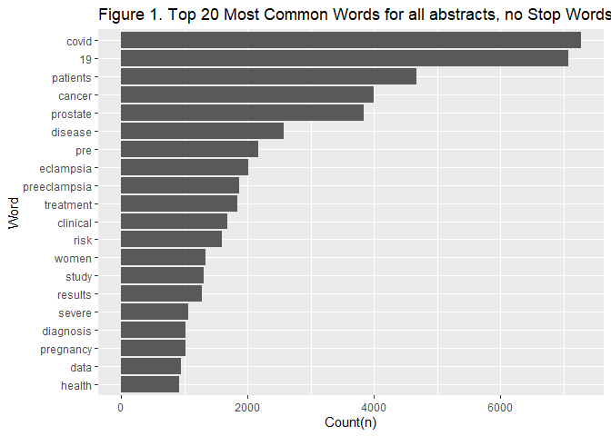

Homework 3
================
CB
2022-11-02

## R Markdown

### Load required libraries

``` r
library(data.table)
library(dplyr)
```

    ## 
    ## Attaching package: 'dplyr'

    ## The following objects are masked from 'package:data.table':
    ## 
    ##     between, first, last

    ## The following objects are masked from 'package:stats':
    ## 
    ##     filter, lag

    ## The following objects are masked from 'package:base':
    ## 
    ##     intersect, setdiff, setequal, union

``` r
library(tidyverse)
```

    ## ── Attaching packages
    ## ───────────────────────────────────────
    ## tidyverse 1.3.2 ──

    ## ✔ ggplot2 3.3.6     ✔ purrr   0.3.4
    ## ✔ tibble  3.1.8     ✔ stringr 1.4.1
    ## ✔ tidyr   1.2.0     ✔ forcats 0.5.2
    ## ✔ readr   2.1.2     
    ## ── Conflicts ────────────────────────────────────────── tidyverse_conflicts() ──
    ## ✖ dplyr::between()   masks data.table::between()
    ## ✖ dplyr::filter()    masks stats::filter()
    ## ✖ dplyr::first()     masks data.table::first()
    ## ✖ dplyr::lag()       masks stats::lag()
    ## ✖ dplyr::last()      masks data.table::last()
    ## ✖ purrr::transpose() masks data.table::transpose()

``` r
library(dtplyr)
library(knitr)
library(ggplot2)
library(rvest)
```

    ## 
    ## Attaching package: 'rvest'
    ## 
    ## The following object is masked from 'package:readr':
    ## 
    ##     guess_encoding

``` r
library(httr)
library(xml2)
library(stringr)
```

## Part 1: APIs

``` r
# Downloading the website
website <- xml2::read_html("https://pubmed.ncbi.nlm.nih.gov/?term=sars-cov-2%20trial%20vaccine")

# Finding the counts

counts <- xml2::xml_find_first(website, "/html/body/main/div[9]/div[2]/div[2]/div[1]/div[1]")

counts <- as.character(counts)
counts
```

    ## [1] "<div class=\"results-amount\">\n  \n    <span class=\"value\">4,002</span>\n    results\n  \n</div>"

``` r
# Extracting the data using regex
stringr::str_extract(counts, "[0-9,]+")
```

    ## [1] "4,002"

### *There are 3,997 results from this search*

### Create database

``` r
query_ids <- GET(
  url   = "https://eutils.ncbi.nlm.nih.gov/entrez/eutils/esearch.fcgi",
  query = list(
    db      = "pubmed",
    term    = "sars-cov-2 trial vaccine",
    retmax  = 250
  ), 
)
```

``` r
# Extracting, make character
ids <- httr::content(query_ids)
ids <- as.character(ids)
```

``` r
ids <- stringr::str_extract_all(ids, "<Id>[[:digit:]]+</Id>")[[1]]
# Remove all the leading and trailing <Id> </Id>. 
ids <- stringr::str_remove_all(ids, "</?Id>")
head(ids)
```

    ## [1] "36307830" "36305195" "36301821" "36299427" "36298743" "36298641"

``` r
publications <- GET(
  url   = "https://eutils.ncbi.nlm.nih.gov/entrez/eutils/efetch.fcgi",
  query = list(
    db  = "pubmed",
    id  = paste(ids,collapse = ","),
  retmax = 250,
  rettype = "abstract"
    )
)
# Extracting the content of the response of GET
publications <- httr::content(publications)

publications_txt <- as.character(publications)
```

### Create a dataset containing Pubmed ID number,Title of the paper,Name of the journal where it was published,Publication date, and Abstract of the paper (if any).

``` r
pub_char_list <- xml2::xml_children(publications)
pub_char_list <- sapply(pub_char_list, as.character)
```

``` r
titles <- str_extract(pub_char_list, "<ArticleTitle>[[:print:][:space:]]+</ArticleTitle>")
titles[[1]]
```

    ## [1] "<ArticleTitle>Improving pediatric COVID-19 vaccine uptake using an mHealth tool (MoVeUp): study protocol for a randomized, controlled trial.</ArticleTitle>"

``` r
titles <- str_remove_all(titles, "</?[[:alnum:]- =\"]+>")
titles[[1]]
```

    ## [1] "Improving pediatric COVID-19 vaccine uptake using an mHealth tool (MoVeUp): study protocol for a randomized, controlled trial."

``` r
journalname <- str_extract(pub_char_list, "<Title>[[:print:][:space:]]+</Title>")
journalname[[1]]
```

    ## [1] "<Title>Trials</Title>"

``` r
journalname <- str_remove_all(journalname, "</?[[:alnum:]- =\"]+>")
journalname[[1]]
```

    ## [1] "Trials"

``` r
abstracts <- str_extract(pub_char_list, "<Abstract>[[:print:][:space:]]+</Abstract>")
abstracts[[1]]
```

    ## [1] "<Abstract>\n        <AbstractText Label=\"BACKGROUND\" NlmCategory=\"BACKGROUND\">Coronavirus disease 2019 (COVID-19) vaccines demonstrate excellent effectiveness against infection, severe disease, and death. However, pediatric COVID-19 vaccination rates lag among individuals from rural and other medically underserved communities. The research objective of the current protocol is to determine the effectiveness of a vaccine communication mobile health (mHealth) application (app) on parental decisions to vaccinate their children against COVID-19.</AbstractText>\n        <AbstractText Label=\"METHODS\" NlmCategory=\"METHODS\">Custodial parents/caregivers with ≥ 1 child eligible for COVID-19 vaccination who have not yet received the vaccine will be randomized to download one of two mHealth apps. The intervention app will address logistical and motivational barriers to pediatric COVID-19 vaccination. Participants will receive eight weekly push notifications followed by two monthly push notifications (cues to action) regarding vaccinating their child. Through branching logic, users will access customized content based on their locality, degree of rurality-urbanicity, primary language (English/Spanish), race/ethnicity, and child's age to address COVID-19 vaccine knowledge and confidence gaps. The control app will provide push notifications and information on general pediatric health and infection prevention and mitigation strategies based on recommendations from the American Academy of Pediatrics (AAP) and the Centers for Disease Control and Prevention (CDC). The primary outcome is the proportion of children who complete COVID-19 vaccination series. Secondary outcomes include the proportion of children who receive ≥ 1 dose of COVID-19 vaccine and changes in parent/caregiver scores from baseline to immediately post-intervention on the modified WHO SAGE Vaccine Hesitancy Scale adapted for the COVID-19 vaccine.</AbstractText>\n        <AbstractText Label=\"DISCUSSION\" NlmCategory=\"CONCLUSIONS\">The COVID-19 pandemic inflicts disproportionate harm on individuals from underserved communities, including those in rural settings. Maximizing vaccine uptake in these communities will decrease infection rates, severe illness, and death. Given that most US families from these communities use smart phones, mHealth interventions hold the promise of broad uptake. Bundling multiple mHealth vaccine uptake interventions into a single app may maximize the impact of deploying such a tool to increase COVID-19 vaccination. The new knowledge to be gained from this study will directly inform future efforts to increase COVID-19 vaccination rates across diverse settings and provide an evidentiary base for app-based vaccine communication tools that can be adapted to future vaccine-deployment efforts.</AbstractText>\n        <AbstractText Label=\"CLINICAL TRIALS REGISTRATION\" NlmCategory=\"BACKGROUND\">ClinicalTrials.gov NCT05386355 . Registered on May 23, 2022.</AbstractText>\n        <CopyrightInformation>© 2022. The Author(s).</CopyrightInformation>\n      </Abstract>"

``` r
abstracts <- str_remove_all(abstracts, "</?[[:alnum:]- =\"]+>") 
abstracts[[1]]
```

    ## [1] "\n        Coronavirus disease 2019 (COVID-19) vaccines demonstrate excellent effectiveness against infection, severe disease, and death. However, pediatric COVID-19 vaccination rates lag among individuals from rural and other medically underserved communities. The research objective of the current protocol is to determine the effectiveness of a vaccine communication mobile health (mHealth) application (app) on parental decisions to vaccinate their children against COVID-19.\n        Custodial parents/caregivers with ≥ 1 child eligible for COVID-19 vaccination who have not yet received the vaccine will be randomized to download one of two mHealth apps. The intervention app will address logistical and motivational barriers to pediatric COVID-19 vaccination. Participants will receive eight weekly push notifications followed by two monthly push notifications (cues to action) regarding vaccinating their child. Through branching logic, users will access customized content based on their locality, degree of rurality-urbanicity, primary language (English/Spanish), race/ethnicity, and child's age to address COVID-19 vaccine knowledge and confidence gaps. The control app will provide push notifications and information on general pediatric health and infection prevention and mitigation strategies based on recommendations from the American Academy of Pediatrics (AAP) and the Centers for Disease Control and Prevention (CDC). The primary outcome is the proportion of children who complete COVID-19 vaccination series. Secondary outcomes include the proportion of children who receive ≥ 1 dose of COVID-19 vaccine and changes in parent/caregiver scores from baseline to immediately post-intervention on the modified WHO SAGE Vaccine Hesitancy Scale adapted for the COVID-19 vaccine.\n        The COVID-19 pandemic inflicts disproportionate harm on individuals from underserved communities, including those in rural settings. Maximizing vaccine uptake in these communities will decrease infection rates, severe illness, and death. Given that most US families from these communities use smart phones, mHealth interventions hold the promise of broad uptake. Bundling multiple mHealth vaccine uptake interventions into a single app may maximize the impact of deploying such a tool to increase COVID-19 vaccination. The new knowledge to be gained from this study will directly inform future efforts to increase COVID-19 vaccination rates across diverse settings and provide an evidentiary base for app-based vaccine communication tools that can be adapted to future vaccine-deployment efforts.\n        ClinicalTrials.gov NCT05386355 . Registered on May 23, 2022.\n        © 2022. The Author(s).\n      "

``` r
abstracts <- str_replace_all(abstracts, "[[:space:]]+"," ")
abstracts[[1]]
```

    ## [1] " Coronavirus disease 2019 (COVID-19) vaccines demonstrate excellent effectiveness against infection, severe disease, and death. However, pediatric COVID-19 vaccination rates lag among individuals from rural and other medically underserved communities. The research objective of the current protocol is to determine the effectiveness of a vaccine communication mobile health (mHealth) application (app) on parental decisions to vaccinate their children against COVID-19. Custodial parents/caregivers with ≥ 1 child eligible for COVID-19 vaccination who have not yet received the vaccine will be randomized to download one of two mHealth apps. The intervention app will address logistical and motivational barriers to pediatric COVID-19 vaccination. Participants will receive eight weekly push notifications followed by two monthly push notifications (cues to action) regarding vaccinating their child. Through branching logic, users will access customized content based on their locality, degree of rurality-urbanicity, primary language (English/Spanish), race/ethnicity, and child's age to address COVID-19 vaccine knowledge and confidence gaps. The control app will provide push notifications and information on general pediatric health and infection prevention and mitigation strategies based on recommendations from the American Academy of Pediatrics (AAP) and the Centers for Disease Control and Prevention (CDC). The primary outcome is the proportion of children who complete COVID-19 vaccination series. Secondary outcomes include the proportion of children who receive ≥ 1 dose of COVID-19 vaccine and changes in parent/caregiver scores from baseline to immediately post-intervention on the modified WHO SAGE Vaccine Hesitancy Scale adapted for the COVID-19 vaccine. The COVID-19 pandemic inflicts disproportionate harm on individuals from underserved communities, including those in rural settings. Maximizing vaccine uptake in these communities will decrease infection rates, severe illness, and death. Given that most US families from these communities use smart phones, mHealth interventions hold the promise of broad uptake. Bundling multiple mHealth vaccine uptake interventions into a single app may maximize the impact of deploying such a tool to increase COVID-19 vaccination. The new knowledge to be gained from this study will directly inform future efforts to increase COVID-19 vaccination rates across diverse settings and provide an evidentiary base for app-based vaccine communication tools that can be adapted to future vaccine-deployment efforts. ClinicalTrials.gov NCT05386355 . Registered on May 23, 2022. © 2022. The Author(s). "

``` r
pubyear <- str_extract(pub_char_list, "<Year>[0-9]{4}</Year>")
pubyear[[1]]
```

    ## [1] "<Year>2022</Year>"

``` r
pubyear <- str_remove_all(pubyear, "</?[[:alnum:]- =\"]+>")
pubyear[[1]]
```

    ## [1] "2022"

``` r
pubmonth <- str_extract(pub_char_list, "<Month>[a-zA-Z]{3}</Month>")
pubmonth[[1]]
```

    ## [1] "<Month>Oct</Month>"

``` r
pubmonth <- str_remove_all(pubmonth, "</?[[:alnum:]- =\"]+>")
pubmonth[[1]]
```

    ## [1] "Oct"

``` r
pubday <- str_extract(pub_char_list, "<Day>[0-9]{1,2}</Day>")
pubday[[1]]
```

    ## [1] "<Day>01</Day>"

``` r
pubday <- str_remove_all(pubday, "</?[[:alnum:]- =\"]+>")
pubday[[1]]
```

    ## [1] "01"

### Make a table with the dataset information

``` r
#Create publication date variable
pubdate <- paste(pubmonth, pubday, pubyear, sep="-")
pubdate[[1]]
```

    ## [1] "Oct-01-2022"

``` r
#Create table with all elements
database <- data.frame(
  PubMedId = ids,
  Title    = titles,
  Abstract = abstracts,
  Journal =journalname,
  Publication_Date=pubdate
  
)
knitr::kable(database[1:10,], caption = "Covid-19 Vaccine Trials Papers")
```

| PubMedId | Title                                                                                                                                                                                                                     | Abstract                                                                                                                                                                                                                                                                                                                                                                                                                                                                                                                                                                                                                                                                                                                                                                                                                                                                                                                                                                                                                                                                                                                                                                                                                                                                                                                                                                                                                                                                                                                                                                                                                                                                                                                                                                                                                                                                                                                                                                                                                                                                                                                                                                                                                                                                                                                                                                                                                                                                                                                                                                                                                                                                                                                                                                                                                                                                                                                                                                                                                                                                                                                                                                             | Journal                                           | Publication_Date |
|:---------|:--------------------------------------------------------------------------------------------------------------------------------------------------------------------------------------------------------------------------|:-------------------------------------------------------------------------------------------------------------------------------------------------------------------------------------------------------------------------------------------------------------------------------------------------------------------------------------------------------------------------------------------------------------------------------------------------------------------------------------------------------------------------------------------------------------------------------------------------------------------------------------------------------------------------------------------------------------------------------------------------------------------------------------------------------------------------------------------------------------------------------------------------------------------------------------------------------------------------------------------------------------------------------------------------------------------------------------------------------------------------------------------------------------------------------------------------------------------------------------------------------------------------------------------------------------------------------------------------------------------------------------------------------------------------------------------------------------------------------------------------------------------------------------------------------------------------------------------------------------------------------------------------------------------------------------------------------------------------------------------------------------------------------------------------------------------------------------------------------------------------------------------------------------------------------------------------------------------------------------------------------------------------------------------------------------------------------------------------------------------------------------------------------------------------------------------------------------------------------------------------------------------------------------------------------------------------------------------------------------------------------------------------------------------------------------------------------------------------------------------------------------------------------------------------------------------------------------------------------------------------------------------------------------------------------------------------------------------------------------------------------------------------------------------------------------------------------------------------------------------------------------------------------------------------------------------------------------------------------------------------------------------------------------------------------------------------------------------------------------------------------------------------------------------------------------|:--------------------------------------------------|:-----------------|
| 36307830 | Improving pediatric COVID-19 vaccine uptake using an mHealth tool (MoVeUp): study protocol for a randomized, controlled trial.                                                                                            | Coronavirus disease 2019 (COVID-19) vaccines demonstrate excellent effectiveness against infection, severe disease, and death. However, pediatric COVID-19 vaccination rates lag among individuals from rural and other medically underserved communities. The research objective of the current protocol is to determine the effectiveness of a vaccine communication mobile health (mHealth) application (app) on parental decisions to vaccinate their children against COVID-19. Custodial parents/caregivers with ≥ 1 child eligible for COVID-19 vaccination who have not yet received the vaccine will be randomized to download one of two mHealth apps. The intervention app will address logistical and motivational barriers to pediatric COVID-19 vaccination. Participants will receive eight weekly push notifications followed by two monthly push notifications (cues to action) regarding vaccinating their child. Through branching logic, users will access customized content based on their locality, degree of rurality-urbanicity, primary language (English/Spanish), race/ethnicity, and child’s age to address COVID-19 vaccine knowledge and confidence gaps. The control app will provide push notifications and information on general pediatric health and infection prevention and mitigation strategies based on recommendations from the American Academy of Pediatrics (AAP) and the Centers for Disease Control and Prevention (CDC). The primary outcome is the proportion of children who complete COVID-19 vaccination series. Secondary outcomes include the proportion of children who receive ≥ 1 dose of COVID-19 vaccine and changes in parent/caregiver scores from baseline to immediately post-intervention on the modified WHO SAGE Vaccine Hesitancy Scale adapted for the COVID-19 vaccine. The COVID-19 pandemic inflicts disproportionate harm on individuals from underserved communities, including those in rural settings. Maximizing vaccine uptake in these communities will decrease infection rates, severe illness, and death. Given that most US families from these communities use smart phones, mHealth interventions hold the promise of broad uptake. Bundling multiple mHealth vaccine uptake interventions into a single app may maximize the impact of deploying such a tool to increase COVID-19 vaccination. The new knowledge to be gained from this study will directly inform future efforts to increase COVID-19 vaccination rates across diverse settings and provide an evidentiary base for app-based vaccine communication tools that can be adapted to future vaccine-deployment efforts. ClinicalTrials.gov NCT05386355 . Registered on May 23, 2022. © 2022. The Author(s).                                                                                                                                                                                                                                                                                                                                                                                                                        | Trials                                            | Oct-01-2022      |
| 36305195 | Deep learning in drug discovery: a futuristic modality to materialize the large datasets for cheminformatics.                                                                                                             | Artificial intelligence (AI) development imitates the workings of the human brain to comprehend modern problems. The traditional approaches such as high throughput screening (HTS) and combinatorial chemistry are lengthy and expensive to the pharmaceutical industry as they can only handle a smaller dataset. Deep learning (DL) is a sophisticated AI method that uses a thorough comprehension of particular systems. The pharmaceutical industry is now adopting DL techniques to enhance the research and development process. Multi-oriented algorithms play a crucial role in the processing of QSAR analysis, de novo drug design, ADME evaluation, physicochemical analysis, preclinical development, followed by clinical trial data precision. In this study, we investigated the performance of several algorithms, including deep neural networks (DNN), convolutional neural networks (CNN) and multi-task learning (MTL), with the aim of generating high-quality, interpretable big and diverse databases for drug design and development. Studies have demonstrated that CNN, recurrent neural network and deep belief network are compatible, accurate and effective for the molecular description of pharmacodynamic properties. In Covid-19, existing pharmacological compounds has also been repurposed using DL models. In the absence of the Covid-19 vaccine, remdesivir and oseltamivir have been widely employed to treat severe SARS-CoV-2 infections. In conclusion, the results indicate the potential benefits of employing the DL strategies in the drug discovery process.Communicated by Ramaswamy H. Sarma.                                                                                                                                                                                                                                                                                                                                                                                                                                                                                                                                                                                                                                                                                                                                                                                                                                                                                                                                                                                                                                                                                                                                                                                                                                                                                                                                                                                                                                                                                                                                   | Journal of biomolecular structure & dynamics      | Oct-30-2022      |
| 36301821 | Immunogenicity and reactogenicity of SARS-CoV-2 vaccines in people living with HIV in the Netherlands: A nationwide prospective cohort study.                                                                             | Vaccines can be less immunogenic in people living with HIV (PLWH), but for SARS-CoV-2 vaccinations this is unknown. In this study we set out to investigate, for the vaccines currently approved in the Netherlands, the immunogenicity and reactogenicity of SARS-CoV-2 vaccinations in PLWH. We conducted a prospective cohort study to examine the immunogenicity of BNT162b2, mRNA-1273, ChAdOx1-S, and Ad26.COV2.S vaccines in adult PLWH without prior COVID-19, and compared to HIV-negative controls. The primary endpoint was the anti-spike SARS-CoV-2 IgG response after mRNA vaccination. Secondary endpoints included the serological response after vector vaccination, anti-SARS-CoV-2 T-cell response, and reactogenicity. Between 14 February and 7 September 2021, 1,154 PLWH (median age 53 \[IQR 44-60\] years, 85.5% male) and 440 controls (median age 43 \[IQR 33-53\] years, 28.6% male) were included in the final analysis. Of the PLWH, 884 received BNT162b2, 100 received mRNA-1273, 150 received ChAdOx1-S, and 20 received Ad26.COV2.S. In the group of PLWH, 99% were on antiretroviral therapy, 97.7% were virally suppressed, and the median CD4+ T-cell count was 710 cells/μL (IQR 520-913). Of the controls, 247 received mRNA-1273, 94 received BNT162b2, 26 received ChAdOx1-S, and 73 received Ad26.COV2.S. After mRNA vaccination, geometric mean antibody concentration was 1,418 BAU/mL in PLWH (95% CI 1322-1523), and after adjustment for age, sex, and vaccine type, HIV status remained associated with a decreased response (0.607, 95% CI 0.508-0.725, p \< 0.001). All controls receiving an mRNA vaccine had an adequate response, defined as \>300 BAU/mL, whilst in PLWH this response rate was 93.6%. In PLWH vaccinated with mRNA-based vaccines, higher antibody responses were predicted by CD4+ T-cell count 250-500 cells/μL (2.845, 95% CI 1.876-4.314, p \< 0.001) or \>500 cells/μL (2.936, 95% CI 1.961-4.394, p \< 0.001), whilst a viral load \> 50 copies/mL was associated with a reduced response (0.454, 95% CI 0.286-0.720, p = 0.001). Increased IFN-γ, CD4+ T-cell, and CD8+ T-cell responses were observed after stimulation with SARS-CoV-2 spike peptides in ELISpot and activation-induced marker assays, comparable to controls. Reactogenicity was generally mild, without vaccine-related serious adverse events. Due to the control of vaccine provision by the Dutch National Institute for Public Health and the Environment, there were some differences between vaccine groups in the age, sex, and CD4+ T-cell counts of recipients. After vaccination with BNT162b2 or mRNA-1273, anti-spike SARS-CoV-2 antibody levels were reduced in PLWH compared to HIV-negative controls. To reach and maintain the same serological responses as HIV-negative controls, additional vaccinations are probably required. The trial was registered in the Netherlands Trial Register (NL9214). <https://www.trialregister.nl/trial/9214>.                                                                                                                                                                 | PLoS medicine                                     | Oct-31-2022      |
| 36299427 | Fluvoxamine for Outpatient Treatment of COVID-19: A Decentralized, Placebo-controlled, Randomized, Platform Clinical Trial.                                                                                               | The effectiveness of fluvoxamine to shorten symptom duration or prevent hospitalization among outpatients in the US with mild to moderate symptomatic coronavirus disease 2019 (COVID-19) is unclear. ACTIV-6 is an ongoing, decentralized, double-blind, randomized, placebo-controlled platform trial testing repurposed medications in outpatients with mild to moderate COVID-19. A total of 1288 non-hospitalized adults aged ≥30 years with confirmed COVID-19 experiencing ≥2 symptoms of acute infection for ≤7 days prior to randomization were randomized to receive fluvoxamine 50 mg or placebo twice daily for 10 days. The primary outcome was time to sustained recovery, defined as the third of 3 consecutive days without symptoms. Secondary outcomes included composites of hospitalization or death with or without urgent or emergency care visit by day 28. Of 1331 participants randomized (mean \[SD\] age, 48.5 \[12.8\] years; 57% women; 67% reported receiving at least 2 doses of a SARS-CoV-2 vaccine), 1288 completed the trial (n=614 placebo, n=674 fluvoxamine). Median time to recovery was 13 days (IQR 12-13) in the placebo group and 12 days (IQR 11-14) in the fluvoxamine group (hazard ratio \[HR\] 0.96, 95% credible interval \[CrI\] 0.86-1.07; posterior probability for benefit \[HR\>1\]=0.22). Twenty-six participants (3.9%) in the fluvoxamine group were hospitalized or had urgent or emergency care visits compared with 23 (3.8%) in the placebo group (HR 1.1, 95% CrI 0.6-1.8; posterior probability for benefit \[HR\<1\]=0.340). One participant in the fluvoxamine group and 2 in the placebo group were hospitalized; no deaths occurred. Adverse events were uncommon in both groups. Treatment with fluvoxamine 50 mg twice daily for 10 days did not improve time to recovery, compared with placebo, among outpatients with mild to moderate COVID-19. These findings do not support the use of fluvoxamine at this dose and duration in patients with mild to moderate COVID-19.                                                                                                                                                                                                                                                                                                                                                                                                                                                                                                                                                                                                                                                                                                                                                                                                                                                                                                                                                                                                                                                                                                                                  | medRxiv : the preprint server for health sciences | Oct-27-2022      |
| 36298743 | Immunogenicity, Safety, and Anti-Viral Efficacy of a Subunit SARS-CoV-2 Vaccine Candidate in Captive Black-Footed Ferrets (Mustela nigripes) and Their Susceptibility to Viral Challenge.                                 | A preliminary vaccination trial against the emergent pathogen, SARS-CoV-2, was completed in captive black-footed ferrets (Mustela nigripes; BFF) to assess safety, immunogenicity, and anti-viral efficacy. Vaccination and boosting of 15 BFF with purified SARS-CoV-2 S1 subunit protein produced a nearly 150-fold increase in mean antibody titers compared to pre-vaccination titers. Serum antibody responses were highest in young animals, but in all vaccinees, antibody response declined rapidly. Anti-viral activity from vaccinated and unvaccinated BFF was determined in vitro, as well as in vivo with a passive serum transfer study in mice. Transgenic mice that received BFF serum transfers and were subsequently challenged with SARS-CoV-2 had lung viral loads that negatively correlated (p &lt; 0.05) with the BFF serum titer received. Lastly, an experimental challenge study in a small group of BFF was completed to test susceptibility to SARS-CoV-2. Despite viral replication and shedding in the upper respiratory tract for up to 7 days post-challenge, no clinical disease was observed in either vaccinated or naive animals. The lack of morbidity or mortality observed indicates SARS-CoV-2 is unlikely to affect wild BFF populations, but infected captive animals pose a potential risk, albeit low, for humans and other animals.                                                                                                                                                                                                                                                                                                                                                                                                                                                                                                                                                                                                                                                                                                                                                                                                                                                                                                                                                                                                                                                                                                                                                                                                                                                                                                                                                                                                                                                                                                                                                                                                                                                                                                                                                                                                     | Viruses                                           | Oct-31-2022      |
| 36298641 | COVID-19 Vaccines against Omicron Variant: Real-World Data on Effectiveness.                                                                                                                                              | The efficacy of vaccines against coronavirus disease 2019 (COVID-19) has now been well established in phase III clinical trials. However, clinical studies based on real-world data remain critical to assess vaccines effectiveness (VE), especially in specific populations and against variants of concern (VOC). This review presents the principles and methods of VE studies and the main available results on VE of COVID-19 vaccines at the time of Omicron circulation. References for this narrative review were identified through searches of PubMed database up to 13 September 2022. The results of phase III clinical trials have been globally confirmed by VE in real-life studies, including in the elderly. Emergence of VOC Omicron emphasized the importance of booster doses to maintain a high level of protection against severe forms. There are still numerous challenges regarding booster(s) and duration of immunity, particularly in specific subpopulations, and regarding the need for adapted vaccines.                                                                                                                                                                                                                                                                                                                                                                                                                                                                                                                                                                                                                                                                                                                                                                                                                                                                                                                                                                                                                                                                                                                                                                                                                                                                                                                                                                                                                                                                                                                                                                                                                                                                                                                                                                                                                                                                                                                                                                                                                                                                                                                                             | Viruses                                           | Sep-31-2022      |
| 36287714 | A Novel RBD-Protein/Peptide Vaccine Elicits Broadly Neutralizing Antibodies and Protects Mice and Macaques against SARS-CoV-2.                                                                                            | The development of safe and effective vaccines to respond to COVID-19 pandemic/endemic remains a priority. We developed a novel subunit protein-peptide COVID-19 vaccine candidate (UB-612) composed of: (i) receptor binding domain of SARS-CoV-2 spike protein fused to a modified single-chain human IgG1 Fc; (ii) five synthetic peptides incorporating conserved helper and cytotoxic T lymphocyte (Th/CTL) epitopes derived from SARS-CoV-2 structural proteins (three from S2 subunit, one from membrane and one from nucleocapsid), and one universal Th peptide; (iii) aluminum phosphate as adjuvant. The immunogenicity and protective immunity induced by UB-612 vaccine were evaluated in four animal models: Sprague-Dawley rats, AAV-hACE2 transduced BALB/c mice, rhesus and cynomolgus macaques. UB-612 vaccine induced high levels of neutralizing antibody and T-cell responses, in all animals. The immune sera from vaccinated animals neutralized the SARS-CoV-2 original wild-type strains and multiple variants of concern, including Delta and Omicron. The vaccination significantly reduced viral loads, lung pathology scores, and disease progression after intranasal and intratracheal challenge with SARS-CoV-2 in mice, rhesus and cynomolgus macaques. UB-612 has been tested in primary regimens in Phase 1 and Phase 2 clinical studies and is currently being evaluated in a global pivotal Phase 3 clinical study as a single dose heterologous booster.Trial registration: ClinicalTrials.gov identifier: NCT05293665..                                                                                                                                                                                                                                                                                                                                                                                                                                                                                                                                                                                                                                                                                                                                                                                                                                                                                                                                                                                                                                                                                                                                                                                                                                                                                                                                                                                                                                                                                                                                                                                                                       | Emerging microbes & infections                    | Oct-27-2022      |
| 36278465 | State-of-the-art tools to elucidate the therapeutic potential of TAT-peptide (TP) conjugated repurposing drug against SARS-CoV-2 spike glycoproteins.                                                                     | In late 2019, a highly infectious and pathogenic coronavirus was recognized as Severe Acute Respiratory Coronavirus 2 (SARS-CoV-2) which causes acute respiratory disease, threatening human health and public safety. A total of 448,327,303 documented cases and 6,028,576 deaths have been reported as of March 8th 2022. The COVID-19 vaccines currently undergoing clinical trials or already in use should provide at least some protection against SARS-CoV-2; however, the emergence of new variations as a result of mutations may lessen the effectiveness of the currently available vaccines. Since the efficacy of available drugs and vaccines against COVID-19 is notably lower, there is an urgent need to develop a potential drug to treat this deadly disease. The SARS-CoV-2 spike (SCoV-SG) is the foremost drug target among coronaviruses. ObjectiveL: The major objectives of the current study are to conduct a molecular docking study investigation of TAT-peptide47-57(GRKKRRQRRRP)-conjugated remodified therapeutics such as ritonavir (RTV), lopinavir (LPV), favipiravir (FPV), remdesivir (RMV), hydroxychloroquine (HCQ), molnupiravir (MNV) and nirmatrelvir (NMV) with (SCoV-SG) structure. Molecular docking analysis was performed to study the interaction of repurposed drugs and drugs conjugated with the TAT-peptide with target SARS-CoV-2 spike glycoprotein (PDB ID: 6VYB) using AutoDock. Further docking investigation was completed with PatchDock and was visualized by discovery the studio visualizer 2020. TAT-peptides are well-characterized immune enhancers that are used in intracellular drug delivery. The results of molecular docking analysis showed higher efficiency and significantly enhanced and improved interactions between TP-conjugated repurposed drugs and the target sites of the SCoV-SG structure. The study concluded that TP-conjugated repurposed drugs may be effective in preventing COVID-19, and therefore, in vitro, in vivo, and clinical trial studies are required in detail. Copyright© Bentham Science Publishers; For any queries, please email at <epub@benthamscience.net>.                                                                                                                                                                                                                                                                                                                                                                                                                                                                                                                                                                                                                                                                                                                                                                                                                                                                                                                                                                                                            | Current pharmaceutical design                     | Oct-24-2022      |
| 36276877 | Trends and factors associated with change in COVID-19 vaccination intent among residents and staff in six Seattle homeless shelters, March 2020 to August 2021.                                                           | Achieving high COVID-19 vaccination coverage in homeless shelters is critical in preventing morbidity, mortality, and outbreaks, however, vaccination coverage remains lower among people experiencing homelessness (PEH) than the general population. We conducted a cross-sectional study to retrospectively describe attitudes and identify factors associated with change in COVID-19 vaccination intent among shelter residents and staff during March 2020 - August 2021. To identify factors associated with change in COVID-19 vaccine intent becoming more positive overall compared to other attitudes, we utilized a Poisson model to calculate Risk Ratios with robust standard errors, adjusting for confounding by shelter site and demographic variables determined a priori. From July 12 - August 2, 2021, 97 residents and 20 staff participated in surveys across six shelters in Seattle King County, Washington. Intent to be vaccinated against COVID-19 increased from 45.3 % (n = 53) when recalling attitudes in March 2020 to 74.4 % (n = 87) as of August 2021, and was similar among residents and staff. Many participants (43.6 %, n = 51) indicated feeling increasingly accepting about receiving a COVID-19 vaccine since March 2020, while 13.7 % (n = 16) changed back and forth, 10.3 % (n = 12) became more hesitant, and 32.5 % (n = 38) had no change in intent. In the model examining the relationship between becoming more positive about receiving a COVID-19 vaccine compared to all other attitudes (n = 116), we found a 57.2 % increase in vaccine acceptability (RR 1.57; 95 % CI: 1.01, 2.45) among those who reported worsening mental health since the start of the pandemic. Findings highlight opportunities to improve communication with residents and staff about COVID-19 vaccination and support a need for continued dialogue and a person-centered approach to understanding the sociocultural complexities and dynamism of vaccine attitudes at shelters.Clinical Trial Registry Number: NCT04141917. © 2022 The Author(s).                                                                                                                                                                                                                                                                                                                                                                                                                                                                                                                                                                                                                                                                                                                                                                                                                                                                                                                                                                                                                                                                                            | Vaccine: X                                        | Dec-01-2022      |
| 36273491 | Durability of ChAdOx1 nCoV-19 (AZD1222) vaccine and hybrid humoral immunity against variants including omicron BA.1 and BA.4 6 months after vaccination (COV005): a post-hoc analysis of a randomised, phase 1b-2a trial. | COVID-19 vaccine rollout is lagging in Africa, where there has been a high rate of SARS-CoV-2 infection. We aimed to evaluate the effect of SARS-CoV-2 infection before vaccination with the ChAdOx-nCoV19 (AZD1222) vaccine on antibody responses through to 180 days. We did an unmasked post-hoc immunogenicity analysis after the first and second doses of AZD1222 in a randomised, placebo-controlled, phase 1b-2a study done in seven locations in South Africa. AZD1222 recipients who were HIV-uninfected, were stratified into baseline seropositive or seronegative groups using the serum anti-nucleocapsid (anti-N) immunoglobulin G (IgG) electroluminescence immunoassay to establish SARS-CoV-2 infection before the first dose of AZD1222. Binding IgG to spike (anti-S) and receptor binding domain (anti-RBD) were measured before the first dose (day 0), second dose (day 28), day 42, and day 180. Neutralising antibody (NAb) against SARS-CoV-2 variants D614G, beta, delta, gamma, and A.VOI.V2, and omicron BA1 and BA.4 variants, were measured by pseudovirus assay (day 28, day 42, and day 180). This trial is registered with ClinicalTrials.gov, NCT04444674, and the Pan African Clinicals Trials Registry, PACTR202006922165132. Of 185 individuals who were randomly assigned to AZD1222, we included 91 individuals who were baseline seropositive and 58 who were baseline seronegative, in the final analysis. In the seropositive group, there was little change of anti-S IgG (and anti-RBD IgG) or neutralising antibody (NAb) titres at day 42 compared with at day 28. Anti-S (and anti-RBD) IgG geometric mean concentrations (GMCs) were higher throughout in the seropositive compared with the seronegative group, including at day 180 (GMCs 517·8 \[95% CI 411·3-651·9\] vs 82·1 \[55·2-122·3\] BAU/mL). Also D614G NAb geometric mean titres (GMTs) were higher in the seropositive group than the seronegative group, as was the percentage with titres of at least 185 (80% putative risk reduction threshold \[PRRT\] against wild-type-alpha COVID-19), including at day 180 (92·0% \[74·0-99·0\] vs 18·2% \[2·3-51·8). Similar findings were observed for beta, A.VOI.V2, and gamma. For delta, BA.1, and BA.4, NAb GMTs and the proportion with titres above the PRRT were substantially higher in the seropositive compared with seronegative group at day 28 and day 42, but no longer differed between the groups by day 180. A single dose of AZD1222 in the general African population, where COVID-19 vaccine coverage is low and SARS-CoV-2 seropositivity is 90%, could enhance the magnitude and quality of antibody responses to SARS-CoV-2. The Bill & Melinda Gates Foundation, the South African Medical Research Council, the UK Research and Innovation, the UK National Institute for Health Research, and the South African Medical Research Council. For the Zulu translation of the abstract see Supplementary Materials section. Copyright © 2022 The Author(s). Published by Elsevier Ltd. This is an Open Access article under the CC BY 4.0 license. Published by Elsevier Ltd.. All rights reserved. | The Lancet. Infectious diseases                   | Oct-28-2022      |

Covid-19 Vaccine Trials Papers

## Part 2: Text mining

``` r
#Obtain dataset, save to computer then load in (unable to load directly from website without issues)

library(tidytext)
pubmedabs <- read.csv("C:\\Users\\clair\\Desktop\\PM566\\pubmed.csv")
str(pubmedabs)
```

    ## 'data.frame':    3241 obs. of  2 variables:
    ##  $ abstract: chr  "Background and aims: Many patients with coronavirus disease 2019 (COVID-19) have underlying cardiovascular (CV)"| __truncated__ "Introduction: Contradictory data have been reported on the incidence of stroke in patients with COVID-19 and th"| __truncated__ "This article aims at collecting all information needed for dentists regarding the COVID-19 pandemic throughout "| __truncated__ "OBJECTIVE. The objective of our study was to determine the misdiagnosis rate of radiologists for coronavirus di"| __truncated__ ...
    ##  $ term    : chr  "covid" "covid" "covid" "covid" ...

``` r
library(forcats)
```

### Step 1: Tokenize the abstracts and count the number of each token

``` r
#Count number of tokens
pubmedabs %>%
  unnest_tokens(word, abstract) %>%
  count(word, sort = TRUE)
```

    ##                               word     n
    ## 1                              the 28126
    ## 2                               of 24760
    ## 3                              and 19993
    ## 4                               in 14653
    ## 5                               to 10920
    ## 6                                a  8245
    ## 7                             with  8038
    ## 8                            covid  7275
    ## 9                               19  7080
    ## 10                              is  5649
    ## 11                             for  5492
    ## 12                        patients  4674
    ## 13                          cancer  3999
    ## 14                        prostate  3832
    ## 15                             was  3315
    ## 16                            that  3226
    ## 17                            were  3226
    ## 18                              as  3159
    ## 19                            this  3158
    ## 20                             are  2833
    ## 21                              on  2780
    ## 22                              be  2653
    ## 23                         disease  2574
    ## 24                              or  2360
    ## 25                              by  2296
    ## 26                             pre  2165
    ## 27                            from  2062
    ## 28                              we  2032
    ## 29                       eclampsia  2005
    ## 30                            have  1923
    ## 31                              an  1887
    ## 32                    preeclampsia  1863
    ## 33                       treatment  1841
    ## 34                             has  1687
    ## 35                        clinical  1682
    ## 36                              at  1600
    ## 37                            risk  1588
    ## 38                            been  1351
    ## 39                           women  1327
    ## 40                             may  1326
    ## 41                           study  1299
    ## 42                         results  1281
    ## 43                           cases  1224
    ## 44                           these  1203
    ## 45                             not  1173
    ## 46                         between  1121
    ## 47                          severe  1063
    ## 48                              it  1038
    ## 49                       diagnosis  1015
    ## 50                       pregnancy  1011
    ## 51                           which   970
    ## 52                      associated   968
    ## 53                            data   945
    ## 54                           there   940
    ## 55                          health   922
    ## 56                            more   918
    ## 57                         studies   912
    ## 58                         therapy   892
    ## 59                        fibrosis   885
    ## 60                          during   873
    ## 61                               2   872
    ## 62                           early   867
    ## 63                          cystic   865
    ## 64                            most   854
    ## 65                             can   841
    ## 66                             who   841
    ## 67                          review   831
    ## 68                            high   829
    ## 69                             had   827
    ## 70                               p   825
    ## 71                            also   820
    ## 72                        maternal   816
    ## 73                            than   816
    ## 74                      management   810
    ## 75                        pandemic   800
    ## 76                             all   799
    ## 77                             but   788
    ## 78                       mortality   784
    ## 79                         methods   779
    ## 80                           other   755
    ## 81                           their   749
    ## 82                         factors   711
    ## 83                           group   710
    ## 84                            care   704
    ## 85                              no   704
    ## 86                       increased   698
    ## 87                       infection   693
    ## 88                           after   691
    ## 89                        symptoms   670
    ## 90                             our   668
    ## 91                           years   666
    ## 92                         patient   664
    ## 93                        specific   657
    ## 94                             new   654
    ## 95                         related   652
    ## 96                     coronavirus   647
    ## 97                             men   637
    ## 98                            such   637
    ## 99                              cf   627
    ## 100                            its   619
    ## 101                           case   617
    ## 102                    significant   617
    ## 103                              1   614
    ## 104                            age   613
    ## 105                           used   603
    ## 106                           will   601
    ## 107                         should   600
    ## 108                            one   598
    ## 109                       analysis   597
    ## 110                           well   592
    ## 111                        however   581
    ## 112                          blood   572
    ## 113                       compared   572
    ## 114                          among   561
    ## 115                          based   549
    ## 116                   hypertension   547
    ## 117                            use   546
    ## 118                       evidence   536
    ## 119                      including   536
    ## 120                      screening   535
    ## 121                          using   533
    ## 122                         higher   530
    ## 123                            two   525
    ## 124                           both   524
    ## 125                       research   519
    ## 126                           role   519
    ## 127                       findings   518
    ## 128                          first   512
    ## 129                        current   506
    ## 130                          those   504
    ## 131                         levels   501
    ## 132                       reported   499
    ## 133                      potential   489
    ## 134                    respiratory   489
    ## 135                        control   486
    ## 136                  significantly   479
    ## 137                           only   478
    ## 138                        present   478
    ## 139                            low   473
    ## 140                          onset   471
    ## 141                     population   465
    ## 142                           2020   461
    ## 143                           time   461
    ## 144                          about   455
    ## 145                      important   455
    ## 146                           2019   454
    ## 147                       positive   453
    ## 148                         number   451
    ## 149                          found   447
    ## 150                    development   446
    ## 151                            non   446
    ## 152                       syndrome   445
    ## 153                         recent   439
    ## 154                           life   436
    ## 155                         common   434
    ## 156                      incidence   434
    ## 157                         normal   432
    ## 158                          cells   431
    ## 159                     meningitis   429
    ## 160                    conclusions   425
    ## 161                           into   423
    ## 162                          cause   418
    ## 163                       hospital   407
    ## 164                       survival   407
    ## 165                        imaging   405
    ## 166                           many   401
    ## 167                             95   399
    ## 168                      different   399
    ## 169                          acute   397
    ## 170                           some   393
    ## 171                     conclusion   386
    ## 172                          weeks   385
    ## 173                       outcomes   384
    ## 174                           rate   376
    ## 175                  complications   375
    ## 176                        chronic   374
    ## 177                     background   373
    ## 178                      diagnosed   373
    ## 179                          level   373
    ## 180                             ci   372
    ## 181                           sars   372
    ## 182                          novel   371
    ## 183                    therapeutic   369
    ## 184                        medical   367
    ## 185                         groups   366
    ## 186                          could   362
    ## 187                        without   361
    ## 188                              3   358
    ## 189                       although   356
    ## 190                            due   355
    ## 191                           gene   355
    ## 192                           when   355
    ## 193                       pregnant   353
    ## 194                       delivery   352
    ## 195                           over   351
    ## 196                     literature   347
    ## 197                          serum   347
    ## 198                        further   346
    ## 199                         system   343
    ## 200                      available   342
    ## 201                     identified   342
    ## 202                      objective   342
    ## 203                      confirmed   338
    ## 204                         showed   338
    ## 205                           test   335
    ## 206                            cov   334
    ## 207                    information   334
    ## 208                      morbidity   334
    ## 209                        several   334
    ## 210                             10   330
    ## 211                          being   328
    ## 212                        effects   326
    ## 213                       increase   326
    ## 214                          three   325
    ## 215                         trials   325
    ## 216                         period   320
    ## 217                      countries   319
    ## 218                          fetal   317
    ## 219                           year   317
    ## 220                        outcome   314
    ## 221                           they   314
    ## 222                      detection   313
    ## 223                          total   312
    ## 224                          while   312
    ## 225                        history   311
    ## 226                      placental   311
    ## 227                       included   309
    ## 228                       features   308
    ## 229                          stage   308
    ## 230                       androgen   305
    ## 231                       pressure   304
    ## 232                         report   304
    ## 233                       response   304
    ## 234                             up   303
    ## 235                       diseases   302
    ## 236                         before   301
    ## 237                     diagnostic   301
    ## 238                          death   300
    ## 239                       possible   300
    ## 240                        changes   299
    ## 241                    pregnancies   298
    ## 242                      developed   296
    ## 243                         future   296
    ## 244                      effective   295
    ## 245                         impact   295
    ## 246                        genetic   294
    ## 247                        provide   294
    ## 248                        article   293
    ## 249                   inflammatory   293
    ## 250                           need   293
    ## 251                  understanding   292
    ## 252                      performed   289
    ## 253                        testing   289
    ## 254                    association   288
    ## 255                             ct   288
    ## 256                    progression   288
    ## 257                     expression   287
    ## 258                              5   284
    ## 259                          world   283
    ## 260                           cell   282
    ## 261                           mean   282
    ## 262                            psa   282
    ## 263                     prevention   280
    ## 264                       advanced   279
    ## 265                           lung   278
    ## 266                      knowledge   277
    ## 267                           term   276
    ## 268                        remains   273
    ## 269                       function   272
    ## 270                       outbreak   269
    ## 271                             pe   269
    ## 272                        through   267
    ## 273                      therapies   266
    ## 274                             if   265
    ## 275                     strategies   265
    ## 276                         effect   263
    ## 277                     considered   262
    ## 278                         deaths   262
    ## 279                    dysfunction   262
    ## 280                          model   262
    ## 281                          tumor   262
    ## 282                     mechanisms   261
    ## 283                              6   260
    ## 284                      presented   259
    ## 285                      pulmonary   259
    ## 286                         immune   258
    ## 287                         likely   258
    ## 288                          lower   258
    ## 289                         spread   257
    ## 290                              n   255
    ## 291                       children   254
    ## 292                         factor   254
    ## 293                         caused   251
    ## 294                        various   251
    ## 295                         growth   250
    ## 296                           long   250
    ## 297                          major   250
    ## 298                       negative   250
    ## 299                       diabetes   249
    ## 300                        whether   249
    ## 301                        suggest   248
    ## 302                           mild   247
    ## 303                   pathogenesis   245
    ## 304                           less   244
    ## 305                         people   244
    ## 306                       observed   243
    ## 307                       identify   240
    ## 308                       disorder   239
    ## 309                       multiple   239
    ## 310                              4   238
    ## 311                     prevalence   238
    ## 312                       severity   238
    ## 313                        surgery   237
    ## 314                       measures   236
    ## 315                   respectively   236
    ## 316                             20   235
    ## 317                         public   234
    ## 318                        improve   232
    ## 319                            aim   229
    ## 320                      disorders   229
    ## 321                        purpose   229
    ## 322                    proteinuria   228
    ## 323                      molecular   227
    ## 324                      currently   226
    ## 325                     treatments   226
    ## 326                          virus   225
    ## 327                          human   224
    ## 328                        leading   224
    ## 329                      pneumonia   224
    ## 330                         status   224
    ## 331                        because   223
    ## 332                        develop   222
    ## 333                            how   222
    ## 334                        primary   222
    ## 335                        quality   221
    ## 336                         better   220
    ## 337                          rates   220
    ## 338                      meningeal   219
    ## 339                     biomarkers   218
    ## 340                     guidelines   218
    ## 341                        treated   218
    ## 342                     metastatic   217
    ## 343                     increasing   216
    ## 344                      radiation   216
    ## 345                          still   216
    ## 346                          tests   216
    ## 347                  prostatectomy   215
    ## 348                        include   214
    ## 349                         within   213
    ## 350                 manifestations   212
    ## 351                        general   211
    ## 352                        protein   211
    ## 353                        similar   211
    ## 354                      determine   210
    ## 355                     especially   210
    ## 356                         global   210
    ## 357                        radical   210
    ## 358                         result   209
    ## 359                       reviewed   209
    ## 360                          since   209
    ## 361                         agents   208
    ## 362                            csf   207
    ## 363                      prognosis   207
    ## 364                         social   207
    ## 365                          value   207
    ## 366                       revealed   206
    ## 367                    differences   205
    ## 368                          known   205
    ## 369                characteristics   204
    ## 370                       improved   204
    ## 371                          march   204
    ## 372                         second   204
    ## 373                      therefore   204
    ## 374                      gestation   203
    ## 375                          liver   203
    ## 376                       approach   202
    ## 377                     assessment   201
    ## 378                         tissue   201
    ## 379                      localized   200
    ## 380                        markers   200
    ## 381                           days   199
    ## 382                            any   198
    ## 383                            out   198
    ## 384                      regarding   198
    ## 385                          would   198
    ## 386                       addition   197
    ## 387                        against   197
    ## 388                           each   197
    ## 389                     infections   197
    ## 390                       vascular   196
    ## 391                       controls   195
    ## 392                            old   195
    ## 393                 cardiovascular   194
    ## 394                           main   194
    ## 395                             vs   194
    ## 396                        antigen   193
    ## 397                         biopsy   193
    ## 398                          drugs   192
    ## 399                          genes   191
    ## 400                    gestational   191
    ## 401                    endothelial   190
    ## 402                        despite   189
    ## 403                         method   189
    ## 404                      published   189
    ## 405                          ratio   189
    ## 406                        limited   188
    ## 407                             30   187
    ## 408                            mri   187
    ## 409                     underlying   187
    ## 410                          viral   186
    ## 411                         causes   185
    ## 412                      condition   185
    ## 413                    involvement   185
    ## 414                          signs   185
    ## 415                            now   183
    ## 416                             15   182
    ## 417                         stress   182
    ## 418                          china   181
    ## 419                      discussed   181
    ## 420                          might   181
    ## 421                      worldwide   181
    ## 422                         active   179
    ## 423                         course   179
    ## 424                           even   179
    ## 425                     predictive   179
    ## 426                       affected   178
    ## 427                          large   178
    ## 428                         states   178
    ## 429                      suspected   178
    ## 430                           very   178
    ## 431                         needed   177
    ## 432                       practice   177
    ## 433                   relationship   177
    ## 434                        overall   176
    ## 435                           made   175
    ## 436                           thus   175
    ## 437                    examination   174
    ## 438                       systemic   174
    ## 439                      following   173
    ## 440                     healthcare   173
    ## 441                     laboratory   173
    ## 442                              8   172
    ## 443                         plasma   172
    ## 444                           dose   171
    ## 445                       abnormal   170
    ## 446                          fluid   170
    ## 447                       involved   170
    ## 448                           late   170
    ## 449                        initial   169
    ## 450                          shown   169
    ## 451                   demonstrated   168
    ## 452                    established   168
    ## 453                   inflammation   168
    ## 454                      conducted   167
    ## 455                         models   167
    ## 456                       placenta   167
    ## 457                          0.001   166
    ## 458                         reduce   166
    ## 459                   hypertensive   165
    ## 460                           like   165
    ## 461                     developing   164
    ## 462                        discuss   164
    ## 463                         adults   163
    ## 464                     approaches   163
    ## 465                           drug   163
    ## 466                    individuals   163
    ## 467                     regression   162
    ## 468                         family   161
    ## 469                   transmission   161
    ## 470                             11   160
    ## 471                     clinically   160
    ## 472                     conditions   160
    ## 473                      described   160
    ## 474                        greater   160
    ## 475                      resistant   160
    ## 476                         search   160
    ## 477                          brain   159
    ## 478                pathophysiology   159
    ## 479                        prevent   159
    ## 480                          under   159
    ## 481                              7   158
    ## 482                       advances   158
    ## 483                            did   158
    ## 484                     experience   158
    ## 485                        healthy   158
    ## 486                          often   158
    ## 487                          chest   157
    ## 488                       recently   157
    ## 489                    appropriate   156
    ## 490                      decreased   156
    ## 491                   particularly   156
    ## 492                   radiotherapy   156
    ## 493                        support   156
    ## 494                       surgical   156
    ## 495                              d   155
    ## 496                       presence   155
    ## 497                   surveillance   155
    ## 498                       activity   154
    ## 499                         follow   154
    ## 500                           four   154
    ## 501                           help   154
    ## 502                          index   154
    ## 503                        failure   153
    ## 504                           them   153
    ## 505                       elevated   152
    ## 506                       national   152
    ## 507                         weight   152
    ## 508                  characterized   151
    ## 509                       previous   151
    ## 510                          state   151
    ## 511                           type   151
    ## 512                         assess   150
    ## 513                              c   150
    ## 514                    combination   150
    ## 515                          local   149
    ## 516                pachymeningitis   149
    ## 517                      perinatal   149
    ## 518                             so   149
    ## 519                         volume   149
    ## 520                     castration   148
    ## 521                     evaluation   148
    ## 522                           must   148
    ## 523                     prognostic   148
    ## 524                       analyzed   147
    ## 525                      eclamptic   147
    ## 526                         months   147
    ## 527                       obtained   147
    ## 528                       receptor   147
    ## 529                           five   146
    ## 530                        reduced   146
    ## 531                         united   146
    ## 532                       criteria   145
    ## 533                   participants   145
    ## 534                   presentation   145
    ## 535                          older   144
    ## 536                     prediction   144
    ## 537                       proposed   144
    ## 538                        systems   144
    ## 539                             50   143
    ## 540                       describe   143
    ## 541                     resistance   143
    ## 542                            key   142
    ## 543                         median   142
    ## 544                    sensitivity   142
    ## 545                       standard   142
    ## 546                           work   142
    ## 547                         either   141
    ## 548                    enhancement   141
    ## 549                       existing   141
    ## 550                           poor   141
    ## 551                         useful   141
    ## 552                          areas   140
    ## 553                     difference   140
    ## 554                   neurological   140
    ## 555                       relevant   140
    ## 556                             12   139
    ## 557                      bacterial   139
    ## 558                         become   139
    ## 559                      evaluated   139
    ## 560                        reports   139
    ## 561                         cohort   138
    ## 562                       evaluate   138
    ## 563                         highly   138
    ## 564                            per   138
    ## 565                        predict   138
    ## 566                          small   138
    ## 567                    correlation   137
    ## 568                       infected   137
    ## 569                         injury   137
    ## 570                        options   137
    ## 571                        studied   137
    ## 572                      according   136
    ## 573                       articles   136
    ## 574                           last   136
    ## 575                        rapidly   136
    ## 576                             14   135
    ## 577                        induced   135
    ## 578                            pcr   135
    ## 579                             24   134
    ## 580                           aims   134
    ## 581                       emerging   134
    ## 582                       followed   134
    ## 583                       required   134
    ## 584                           same   134
    ## 585                    investigate   133
    ## 586                          paper   133
    ## 587                      trimester   133
    ## 588                             25   131
    ## 589                        adverse   131
    ## 590                        cancers   131
    ## 591                  interventions   131
    ## 592                          order   131
    ## 593                         design   130
    ## 594                      community   129
    ## 595                            few   129
    ## 596                        unknown   129
    ## 597                           anti   128
    ## 598                              b   128
    ## 599                          organ   128
    ## 600                recommendations   128
    ## 601                         tested   128
    ## 602                             18   127
    ## 603                      essential   127
    ## 604                             il   127
    ## 605                        lesions   127
    ## 606                          range   127
    ## 607                         survey   127
    ## 608                         across   126
    ## 609                        benefit   126
    ## 610                          given   126
    ## 611                     infectious   126
    ## 612                           lead   126
    ## 613                       contrast   125
    ## 614                        illness   125
    ## 615                           part   125
    ## 616                           show   125
    ## 617                       critical   124
    ## 618                         having   124
    ## 619                          renal   124
    ## 620                      suggested   124
    ## 621                       suggests   124
    ## 622                          basis   123
    ## 623                      collected   123
    ## 624                     parameters   123
    ## 625                     aggressive   122
    ## 626                          aimed   122
    ## 627                              t   122
    ## 628                           acid   121
    ## 629                         damage   121
    ## 630                epidemiological   121
    ## 631                       etiology   121
    ## 632                           free   121
    ## 633                   intervention   121
    ## 634                          risks   121
    ## 635                     ultrasound   121
    ## 636                       assessed   120
    ## 637                        central   120
    ## 638                        defined   120
    ## 639                      emergency   120
    ## 640                     importance   120
    ## 641                             us   120
    ## 642                        cranial   119
    ## 643                            end   119
    ## 644                           here   119
    ## 645                             mr   119
    ## 646                        setting   119
    ## 647                          daily   118
    ## 648                         mother   118
    ## 649                         spinal   118
    ## 650                         stages   118
    ## 651                         target   118
    ## 652                            dna   117
    ## 653                       examined   117
    ## 654                        hormone   117
    ## 655                   introduction   117
    ## 656                        process   117
    ## 657                     recurrence   117
    ## 658                          april   116
    ## 659                           body   116
    ## 660                     challenges   116
    ## 661                           flow   116
    ## 662                              l   116
    ## 663                           male   116
    ## 664                      promising   116
    ## 665                       provides   116
    ## 666                        samples   116
    ## 667                         values   116
    ## 668                       american   115
    ## 669                          birth   115
    ## 670                            day   115
    ## 671                          focus   115
    ## 672                       frequent   115
    ## 673                       moderate   115
    ## 674                    potentially   115
    ## 675                         series   115
    ## 676                             13   114
    ## 677                        complex   114
    ## 678                       detected   114
    ## 679                        examine   114
    ## 680                              i   114
    ## 681                    prospective   114
    ## 682                         single   114
    ## 683                             16   113
    ## 684                        cardiac   113
    ## 685                           post   113
    ## 686                       progress   113
    ## 687                           seen   113
    ## 688                            six   113
    ## 689                          adult   112
    ## 690                       combined   112
    ## 691                       decrease   112
    ## 692                     objectives   112
    ## 693                              9   111
    ## 694                         around   111
    ## 695                   implications   111
    ## 696                       medicine   111
    ## 697                     techniques   111
    ## 698                    independent   110
    ## 699                         issues   110
    ## 700                       majority   110
    ## 701                             ml   110
    ## 702                       reaction   110
    ## 703                      recurrent   110
    ## 704                            yet   110
    ## 705                        aspects   109
    ## 706                           form   109
    ## 707                          grade   109
    ## 708                    nutritional   109
    ## 709                       physical   109
    ## 710                     presenting   109
    ## 711                      secondary   109
    ## 712                          treat   109
    ## 713                          trial   109
    ## 714                         tumors   109
    ## 715                        anxiety   108
    ## 716                    biochemical   108
    ## 717                     monitoring   108
    ## 718                       pathways   108
    ## 719                           rare   108
    ## 720                           0.05   107
    ## 721                           area   107
    ## 722                       efficacy   107
    ## 723                          least   107
    ## 724                     particular   107
    ## 725                    populations   107
    ## 726                  psychological   107
    ## 727                      responses   107
    ## 728                     scientific   107
    ## 729                          score   107
    ## 730                           fear   106
    ## 731                       meninges   106
    ## 732                    specificity   106
    ## 733                             34   105
    ## 734                          fetus   105
    ## 735                         images   105
    ## 736                           past   105
    ## 737                   pathological   105
    ## 738                             40   104
    ## 739                  abnormalities   104
    ## 740                       commonly   104
    ## 741                           dura   104
    ## 742                       enhanced   104
    ## 743                       epidemic   104
    ## 744                   hypertrophic   104
    ## 745                          later   104
    ## 746                      resulting   104
    ## 747                          where   104
    ## 748                     activation   103
    ## 749                         artery   103
    ## 750                       interval   103
    ## 751                           much   103
    ## 752                        nursing   103
    ## 753                     preventive   103
    ## 754                          third   103
    ## 755                        authors   102
    ## 756                           date   102
    ## 757                       exposure   102
    ## 758                      frequency   102
    ## 759                        gleason   102
    ## 760                 identification   102
    ## 761                       magnetic   102
    ## 762                          phase   102
    ## 763                       provided   102
    ## 764                        serious   102
    ## 765                        uterine   102
    ## 766                   asymptomatic   101
    ## 767                        calcium   101
    ## 768                             do   101
    ## 769                       neonatal   101
    ## 770                       platelet   101
    ## 771                      questions   101
    ## 772                       selected   101
    ## 773                      challenge   100
    ## 774                 concentrations   100
    ## 775                    improvement   100
    ## 776                           play   100
    ## 777                     previously   100
    ## 778                          rapid   100
    ## 779                      resonance   100
    ## 780                  retrospective   100
    ## 781                           then   100
    ## 782                       distress    99
    ## 783                      influence    99
    ## 784                         mental    99
    ## 785                          occur    99
    ## 786                          staff    99
    ## 787                        vaccine    99
    ## 788                         change    98
    ## 789                           lack    98
    ## 790                        ongoing    98
    ## 791                     physicians    98
    ## 792                    recommended    98
    ## 793                       analyses    97
    ## 794                  approximately    97
    ## 795                      attention    97
    ## 796                        doppler    97
    ## 797                       patterns    97
    ## 798                       subjects    97
    ## 799                      underwent    97
    ## 800                  cerebrospinal    96
    ## 801                     contribute    96
    ## 802                          fever    96
    ## 803                              h    96
    ## 804                          india    96
    ## 805                   investigated    96
    ## 806                         remain    96
    ## 807                     biological    95
    ## 808                   chemotherapy    95
    ## 809                           cost    95
    ## 810                      difficult    95
    ## 811                       hormonal    95
    ## 812                         making    95
    ## 813                      metabolic    95
    ## 814                       occurred    95
    ## 815                           tool    95
    ## 816                        whereas    95
    ## 817                       arterial    94
    ## 818                           died    94
    ## 819                            led    94
    ## 820                      necessary    94
    ## 821                          until    94
    ## 822                         affect    93
    ## 823                          alone    93
    ## 824                      increases    93
    ## 825                       indicate    93
    ## 826                     individual    93
    ## 827                      oxidative    93
    ## 828                       presents    93
    ## 829                          prior    93
    ## 830                       relative    93
    ## 831                     subsequent    93
    ## 832                              0    92
    ## 833                     additional    92
    ## 834                      admission    92
    ## 835                       december    92
    ## 836                              g    92
    ## 837                       headache    92
    ## 838                      intensive    92
    ## 839                       problems    92
    ## 840                         pubmed    92
    ## 841                       received    92
    ## 842                           week    92
    ## 843                             21    91
    ## 844                    alterations    91
    ## 845                  concentration    91
    ## 846                     department    91
    ## 847                  international    91
    ## 848                       measured    91
    ## 849                        optimal    91
    ## 850                        pattern    91
    ## 851                        smoking    91
    ## 852                          terms    91
    ## 853                     clinicians    90
    ## 854                     determined    90
    ## 855                  investigation    90
    ## 856                           odds    90
    ## 857                     randomized    90
    ## 858                        routine    90
    ## 859                       targeted    90
    ## 860                      variables    90
    ## 861                        vitamin    90
    ## 862                          along    89
    ## 863                         center    89
    ## 864                           good    89
    ## 865                        highest    89
    ## 866                      indicated    89
    ## 867                      materials    89
    ## 868                      mechanism    89
    ## 869                          wuhan    89
    ## 870                         appear    88
    ## 871                          basic    88
    ## 872                  comprehensive    88
    ## 873                        country    88
    ## 874                       decision    88
    ## 875                         events    88
    ## 876                     idiopathic    88
    ## 877                      pathology    88
    ## 878                     proportion    88
    ## 879                      reporting    88
    ## 880                           self    88
    ## 881                            100    87
    ## 882                             17    87
    ## 883                           does    87
    ## 884                          focal    87
    ## 885                         occurs    87
    ## 886                         oxygen    87
    ## 887                           pain    87
    ## 888                     pancreatic    87
    ## 889                   preeclamptic    87
    ## 890                        staging    87
    ## 891                     systematic    87
    ## 892                        targets    87
    ## 893                         unique    87
    ## 894                       adjusted    86
    ## 895                           cftr    86
    ## 896                 classification    86
    ## 897                         direct    86
    ## 898                       exercise    86
    ## 899                     hypothesis    86
    ## 900                         marker    86
    ## 901                           mass    86
    ## 902                       moreover    86
    ## 903                     postpartum    86
    ## 904                         stroke    86
    ## 905                          white    86
    ## 906                             28    85
    ## 907                             ar    85
    ## 908                       benefits    85
    ## 909                         burden    85
    ## 910                     correlated    85
    ## 911                          field    85
    ## 912                      hospitals    85
    ## 913                      mutations    85
    ## 914                          needs    85
    ## 915                     relatively    85
    ## 916                         sample    85
    ## 917                         sexual    85
    ## 918                          types    85
    ## 919                        usually    85
    ## 920                           what    85
    ## 921                          cross    84
    ## 922                          edema    84
    ## 923                           make    84
    ## 924                             mg    84
    ## 925                        reviews    84
    ## 926                         safety    84
    ## 927                          short    84
    ## 928                        symptom    84
    ## 929                     tomography    84
    ## 930                     understand    84
    ## 931                   complication    83
    ## 932                        finally    83
    ## 933                    furthermore    83
    ## 934                           meta    83
    ## 935                     protective    83
    ## 936                       proteins    83
    ## 937                          sweat    83
    ## 938                             90    82
    ## 939                 administration    82
    ## 940                         almost    82
    ## 941                        context    82
    ## 942                       economic    82
    ## 943                      magnesium    82
    ## 944                         online    82
    ## 945                    responsible    82
    ## 946                       strategy    82
    ## 947                        summary    82
    ## 948                        urinary    82
    ## 949                       admitted    81
    ## 950                        applied    81
    ## 951                        aspirin    81
    ## 952                           best    81
    ## 953                            far    81
    ## 954                        focused    81
    ## 955                      isolation    81
    ## 956                       overview    81
    ## 957                            pca    81
    ## 958                          point    81
    ## 959                        affects    80
    ## 960                     confidence    80
    ## 961                      education    80
    ## 962                       families    80
    ## 963                     functional    80
    ## 964                        growing    80
    ## 965                           loss    80
    ## 966                         mainly    80
    ## 967                     modalities    80
    ## 968                        preterm    80
    ## 969                      resources    80
    ## 970                   consequences    79
    ## 971                     controlled    79
    ## 972                        january    79
    ## 973                       mutation    79
    ## 974                        regions    79
    ## 975                             rt    79
    ## 976                      targeting    79
    ## 977                        average    78
    ## 978                  comorbidities    78
    ## 979                       cytokine    78
    ## 980                      prostatic    78
    ## 981                      reduction    78
    ## 982                      sensitive    78
    ## 983                        towards    78
    ## 984                             22    77
    ## 985                             65    77
    ## 986                      affecting    77
    ## 987                     angiogenic    77
    ## 988                      bilateral    77
    ## 989                        carried    77
    ## 990                       computed    77
    ## 991                     discussion    77
    ## 992                     frequently    77
    ## 993                          nerve    77
    ## 994                              r    77
    ## 995                       recovery    77
    ## 996                         region    77
    ## 997                       treating    77
    ## 998                        workers    77
    ## 999                        anosmia    76
    ## 1000                     completed    76
    ## 1001                    expectancy    76
    ## 1002                      expected    76
    ## 1003                  hospitalized    76
    ## 1004                    occurrence    76
    ## 1005                       require    76
    ## 1006                   restriction    76
    ## 1007                         urine    76
    ## 1008                         woman    76
    ## 1009                         count    75
    ## 1010                     delivered    75
    ## 1011                       explore    75
    ## 1012                         media    75
    ## 1013                    metastasis    75
    ## 1014                      numerous    75
    ## 1015                     providing    75
    ## 1016                         taken    75
    ## 1017                         times    75
    ## 1018                      accuracy    74
    ## 1019                       african    74
    ## 1020                         chain    74
    ## 1021                        crisis    74
    ## 1022                        female    74
    ## 1023                         leads    74
    ## 1024                       problem    74
    ## 1025                      services    74
    ## 1026                susceptibility    74
    ## 1027                           via    74
    ## 1028                            23    73
    ## 1029                            31    73
    ## 1030                       appears    73
    ## 1031                        detect    73
    ## 1032                        little    73
    ## 1033                    procedures    73
    ## 1034                         right    73
    ## 1035                         tools    73
    ## 1036                       ability    72
    ## 1037                       absence    72
    ## 1038                        airway    72
    ## 1039                   deprivation    72
    ## 1040                       elderly    72
    ## 1041                        extent    72
    ## 1042                         great    72
    ## 1043                       infants    72
    ## 1044                       locally    72
    ## 1045                         mater    72
    ## 1046                       nervous    72
    ## 1047                      probably    72
    ## 1048                     residents    72
    ## 1049                     selection    72
    ## 1050                           e.g    71
    ## 1051                       earlier    71
    ## 1052                         forms    71
    ## 1053                          home    71
    ## 1054                      logistic    71
    ## 1055                  organization    71
    ## 1056                      resulted    71
    ## 1057                 statistically    71
    ## 1058                          whom    71
    ## 1059                            26    70
    ## 1060                         allow    70
    ## 1061                         black    70
    ## 1062                      concerns    70
    ## 1063                       contact    70
    ## 1064                          done    70
    ## 1065                    inhibitors    70
    ## 1066                      lockdown    70
    ## 1067                            ng    70
    ## 1068                    peripheral    70
    ## 1069                     predicted    70
    ## 1070                     processes    70
    ## 1071                   progressive    70
    ## 1072                      requires    70
    ## 1073                       special    70
    ## 1074                           way    70
    ## 1075                          wide    70
    ## 1076                    widespread    70
    ## 1077                      cellular    69
    ## 1078                      chloride    69
    ## 1079                   demographic    69
    ## 1080                  experimental    69
    ## 1081                      external    69
    ## 1082                  measurements    69
    ## 1083                        points    69
    ## 1084                            rr    69
    ## 1085                    thickening    69
    ## 1086                    university    69
    ## 1087                      accurate    68
    ## 1088                          aged    68
    ## 1089                      biopsies    68
    ## 1090                   circulating    68
    ## 1091                   complicated    68
    ## 1092                     expressed    68
    ## 1093                     extensive    68
    ## 1094                           hiv    68
    ## 1095                      interest    68
    ## 1096                       natural    68
    ## 1097                    percentage    68
    ## 1098                             s    68
    ## 1099                         seven    68
    ## 1100                         tract    68
    ## 1101                        trends    68
    ## 1102                       unclear    68
    ## 1103                            32    67
    ## 1104                       altered    67
    ## 1105                          bone    67
    ## 1106                   circulation    67
    ## 1107                        decade    67
    ## 1108                        degree    67
    ## 1109                       efforts    67
    ## 1110                  epidemiology    67
    ## 1111                      february    67
    ## 1112                     highlight    67
    ## 1113                      includes    67
    ## 1114                      invasion    67
    ## 1115                       medline    67
    ## 1116                  normotensive    67
    ## 1117                       obesity    67
    ## 1118                     primarily    67
    ## 1119                          unit    67
    ## 1120                             x    67
    ## 1121                         young    67
    ## 1122                       centers    66
    ## 1123                         clear    66
    ## 1124                    comparison    66
    ## 1125                      duration    66
    ## 1126                     estimated    66
    ## 1127                   identifying    66
    ## 1128                      invasive    66
    ## 1129                         lipid    66
    ## 1130                       pathway    66
    ## 1131                         scale    66
    ## 1132                    concerning    65
    ## 1133                     dependent    65
    ## 1134                  distribution    65
    ## 1135                 heterogeneity    65
    ## 1136                            ii    65
    ## 1137                        kidney    65
    ## 1138                   limitations    65
    ## 1139                   performance    65
    ## 1140                          real    65
    ## 1141                          skin    65
    ## 1142                  specifically    65
    ## 1143                    suggesting    65
    ## 1144                            60    64
    ## 1145                       address    64
    ## 1146                         alpha    64
    ## 1147                        breast    64
    ## 1148                          cure    64
    ## 1149                     diastolic    64
    ## 1150                  differential    64
    ## 1151                         every    64
    ## 1152                     generally    64
    ## 1153                       insulin    64
    ## 1154                     intensity    64
    ## 1155                          left    64
    ## 1156                    malignancy    64
    ## 1157                       mothers    64
    ## 1158                        organs    64
    ## 1159                    polymerase    64
    ## 1160                     practices    64
    ## 1161                     signaling    64
    ## 1162                     technique    64
    ## 1163                          able    63
    ## 1164                       already    63
    ## 1165                     biomarker    63
    ## 1166                       certain    63
    ## 1167                 effectiveness    63
    ## 1168                          host    63
    ## 1169                       impacts    63
    ## 1170                         issue    63
    ## 1171                leptomeningeal    63
    ## 1172                   possibility    63
    ## 1173                     providers    63
    ## 1174                   statistical    63
    ## 1175                      strongly    63
    ## 1176                   substantial    63
    ## 1177                            37    62
    ## 1178                    calculated    62
    ## 1179                           cns    62
    ## 1180                   coagulation    62
    ## 1181                       compare    62
    ## 1182                       concern    62
    ## 1183                         eight    62
    ## 1184                      european    62
    ## 1185                    government    62
    ## 1186                          half    62
    ## 1187                      mellitus    62
    ## 1188                        origin    62
    ## 1189                        others    62
    ## 1190                         seems    62
    ## 1191                          side    62
    ## 1192                       younger    62
    ## 1193                      capacity    61
    ## 1194                      cerebral    61
    ## 1195                    consistent    61
    ## 1196                       digital    61
    ## 1197                          face    61
    ## 1198                         guide    61
    ## 1199                investigations    61
    ## 1200                        living    61
    ## 1201                         males    61
    ## 1202                        nurses    61
    ## 1203                    production    61
    ## 1204                    summarizes    61
    ## 1205                            uk    61
    ## 1206                       variety    61
    ## 1207                      database    60
    ## 1208                        defect    60
    ## 1209                    definitive    60
    ## 1210                      designed    60
    ## 1211                       diffuse    60
    ## 1212                      learning    60
    ## 1213                        linked    60
    ## 1214                        longer    60
    ## 1215                           man    60
    ## 1216                       managed    60
    ## 1217                       matched    60
    ## 1218                      personal    60
    ## 1219                 questionnaire    60
    ## 1220                       records    60
    ## 1221                  significance    60
    ## 1222                   trophoblast    60
    ## 1223                        versus    60
    ## 1224                        choice    59
    ## 1225                     discusses    59
    ## 1226                          hand    59
    ## 1227                         hellp    59
    ## 1228                     involving    59
    ## 1229                     perfusion    59
    ## 1230                           qol    59
    ## 1231                       science    59
    ## 1232                            sd    59
    ## 1233                      searched    59
    ## 1234                       section    59
    ## 1235                       sources    59
    ## 1236                   threatening    59
    ## 1237                       tissues    59
    ## 1238                            29    58
    ## 1239                  additionally    58
    ## 1240                      adjuvant    58
    ## 1241                      approved    58
    ## 1242                         child    58
    ## 1243                     decisions    58
    ## 1244                       density    58
    ## 1245                 environmental    58
    ## 1246                         heart    58
    ## 1247                         multi    58
    ## 1248                    neurologic    58
    ## 1249                    preventing    58
    ## 1250                        proven    58
    ## 1251                    recognized    58
    ## 1252                     sectional    58
    ## 1253                         shows    58
    ## 1254                       society    58
    ## 1255                       typical    58
    ## 1256                            75    57
    ## 1257                         above    57
    ## 1258                     comparing    57
    ## 1259                      consider    57
    ## 1260                     continues    57
    ## 1261                          crpc    57
    ## 1262                          fact    57
    ## 1263                      genotype    57
    ## 1264                 manifestation    57
    ## 1265                      mediated    57
    ## 1266                     protocols    57
    ## 1267                          scan    57
    ## 1268                     summarize    57
    ## 1269                     suspicion    57
    ## 1270                            36    56
    ## 1271                       account    56
    ## 1272                   angiotensin    56
    ## 1273                      behavior    56
    ## 1274                    components    56
    ## 1275                      continue    56
    ## 1276                    critically    56
    ## 1277                       emerged    56
    ## 1278                   experienced    56
    ## 1279                 heterogeneous    56
    ## 1280                         italy    56
    ## 1281                        nature    56
    ## 1282                    pathologic    56
    ## 1283                        policy    56
    ## 1284                    successful    56
    ## 1285                        tumour    56
    ## 1286                       western    56
    ## 1287                      adequate    55
    ## 1288                   alternative    55
    ## 1289                     apoptosis    55
    ## 1290                      complete    55
    ## 1291                     consensus    55
    ## 1292                         cough    55
    ## 1293                   demonstrate    55
    ## 1294                       dietary    55
    ## 1295                    distancing    55
    ## 1296                 insufficiency    55
    ## 1297                   multisystem    55
    ## 1298                     patient's    55
    ## 1299                          plgf    55
    ## 1300                      relation    55
    ## 1301                   symptomatic    55
    ## 1302                        timely    55
    ## 1303                          0.01    54
    ## 1304                            48    54
    ## 1305                            80    54
    ## 1306                  associations    54
    ## 1307                      atypical    54
    ## 1308                     discovery    54
    ## 1309                         dural    54
    ## 1310                       explain    54
    ## 1311              gastrointestinal    54
    ## 1312                         hours    54
    ## 1313                           i.e    54
    ## 1314                     influenza    54
    ## 1315                          june    54
    ## 1316                   medications    54
    ## 1317                  multivariate    54
    ## 1318                  placentation    54
    ## 1319                        rectal    54
    ## 1320                           sex    54
    ## 1321                        strong    54
    ## 1322                    technology    54
    ## 1323                        access    53
    ## 1324                       causing    53
    ## 1325                      diagnose    53
    ## 1326                     expectant    53
    ## 1327                    highlights    53
    ## 1328                   observation    53
    ## 1329                     occurring    53
    ## 1330                    predicting    53
    ## 1331                      remained    53
    ## 1332                    undergoing    53
    ## 1333                       working    53
    ## 1334                            27    52
    ## 1335                            70    52
    ## 1336                      appeared    52
    ## 1337                          beam    52
    ## 1338                       changed    52
    ## 1339                         close    52
    ## 1340                       crucial    52
    ## 1341                     diagnoses    52
    ## 1342                        energy    52
    ## 1343                        enzyme    52
    ## 1344                       finding    52
    ## 1345                          goal    52
    ## 1346                       hepatic    52
    ## 1347                           her    52
    ## 1348               hospitalization    52
    ## 1349                 immunotherapy    52
    ## 1350                        lesion    52
    ## 1351                   measurement    52
    ## 1352                       million    52
    ## 1353                         newly    52
    ## 1354                         noted    52
    ## 1355                          oral    52
    ## 1356                      recorded    52
    ## 1357                     regulator    52
    ## 1358                   researchers    52
    ## 1359                        scores    52
    ## 1360                   temperature    52
    ## 1361                      together    52
    ## 1362                         units    52
    ## 1363                          upon    52
    ## 1364                      weighted    52
    ## 1365                        widely    52
    ## 1366                       another    51
    ## 1367                     antenatal    51
    ## 1368                   application    51
    ## 1369                     awareness    51
    ## 1370                characteristic    51
    ## 1371                     databases    51
    ## 1372                    deficiency    51
    ## 1373                     endocrine    51
    ## 1374                      genetics    51
    ## 1375                           iii    51
    ## 1376                 immunological    51
    ## 1377                        lethal    51
    ## 1378                     obstetric    51
    ## 1379                     olfactory    51
    ## 1380                     perceived    51
    ## 1381                            33    50
    ## 1382                      analysed    50
    ## 1383              antihypertensive    50
    ## 1384                      baseline    50
    ## 1385                       chinese    50
    ## 1386                  considerable    50
    ## 1387                   environment    50
    ## 1388                        google    50
    ## 1389                implementation    50
    ## 1390                    metastases    50
    ## 1391                        mirnas    50
    ## 1392                           nlr    50
    ## 1393                      reducing    50
    ## 1394                     represent    50
    ## 1395               retrospectively    50
    ## 1396                     situation    50
    ## 1397                            45    49
    ## 1398                    definition    49
    ## 1399                       delayed    49
    ## 1400             histopathological    49
    ## 1401                      impaired    49
    ## 1402                     improving    49
    ## 1403                  increasingly    49
    ## 1404                     malignant    49
    ## 1405                          next    49
    ## 1406                       numbers    49
    ## 1407                         offer    49
    ## 1408                       profile    49
    ## 1409                       propose    49
    ## 1410                  radiological    49
    ## 1411                     receiving    49
    ## 1412                rehabilitation    49
    ## 1413                    represents    49
    ## 1414                         south    49
    ## 1415                      spectrum    49
    ## 1416                   susceptible    49
    ## 1417                        though    49
    ## 1418                        urgent    49
    ## 1419                         worse    49
    ## 1420                         asian    48
    ## 1421                 brachytherapy    48
    ## 1422                          cord    48
    ## 1423                       derived    48
    ## 1424                      directed    48
    ## 1425                        expert    48
    ## 1426                  improvements    48
    ## 1427             multidisciplinary    48
    ## 1428                         place    48
    ## 1429                      policies    48
    ## 1430                    protection    48
    ## 1431                          race    48
    ## 1432                        raised    48
    ## 1433                        rather    48
    ## 1434                     requiring    48
    ## 1435                       surface    48
    ## 1436                        taking    48
    ## 1437                           ten    48
    ## 1438                        toward    48
    ## 1439                 transmembrane    48
    ## 1440               transplantation    48
    ## 1441                   transrectal    48
    ## 1442                           usa    48
    ## 1443                      vaccines    48
    ## 1444                        venous    48
    ## 1445                      achieved    47
    ## 1446                       biology    47
    ## 1447                          city    47
    ## 1448                    complement    47
    ## 1449                      declared    47
    ## 1450                             e    47
    ## 1451                     headaches    47
    ## 1452                       hundred    47
    ## 1453                      immunity    47
    ## 1454                   implemented    47
    ## 1455                        infant    47
    ## 1456                       measure    47
    ## 1457                 observational    47
    ## 1458                       reasons    47
    ## 1459                     recessive    47
    ## 1460                     reference    47
    ## 1461                   respondents    47
    ## 1462                           set    47
    ## 1463                      settings    47
    ## 1464                           she    47
    ## 1465                       thought    47
    ## 1466                        threat    47
    ## 1467                           bmi    46
    ## 1468                            co    46
    ## 1469                       concept    46
    ## 1470                      confined    46
    ## 1471                      curative    46
    ## 1472                       decades    46
    ## 1473                     describes    46
    ## 1474                    documented    46
    ## 1475                      emphasis    46
    ## 1476                      explored    46
    ## 1477                       focuses    46
    ## 1478                          full    46
    ## 1479                       genomic    46
    ## 1480                           his    46
    ## 1481                       hypoxia    46
    ## 1482                        intake    46
    ## 1483                  interactions    46
    ## 1484                       largely    46
    ## 1485                       program    46
    ## 1486                  prophylactic    46
    ## 1487                  psychosocial    46
    ## 1488                    throughout    46
    ## 1489                     transport    46
    ## 1490                        twenty    46
    ## 1491                            35    45
    ## 1492                       analyze    45
    ## 1493                    autoimmune    45
    ## 1494                    classified    45
    ## 1495                      counties    45
    ## 1496                           crp    45
    ## 1497                         curve    45
    ## 1498                         delay    45
    ## 1499                     emotional    45
    ## 1500                        linear    45
    ## 1501                      material    45
    ## 1502                         means    45
    ## 1503                      modality    45
    ## 1504                 polymorphisms    45
    ## 1505                 postoperative    45
    ## 1506                     prevalent    45
    ## 1507                       reverse    45
    ## 1508                          rise    45
    ## 1509                          safe    45
    ## 1510                       soluble    45
    ## 1511                     specimens    45
    ## 1512                          stem    45
    ## 1513                  subsequently    45
    ## 1514               supplementation    45
    ## 1515                  tuberculosis    45
    ## 1516                   ventilation    45
    ## 1517                         whose    45
    ## 1518                            38    44
    ## 1519                            39    44
    ## 1520                  administered    44
    ## 1521                  angiogenesis    44
    ## 1522                       divided    44
    ## 1523                     establish    44
    ## 1524                    facilities    44
    ## 1525                   intravenous    44
    ## 1526                        manage    44
    ## 1527                          mmhg    44
    ## 1528                       newborn    44
    ## 1529                       percent    44
    ## 1530                     phenotype    44
    ## 1531                      planning    44
    ## 1532                 professionals    44
    ## 1533                  publications    44
    ## 1534                    quarantine    44
    ## 1535                     remaining    44
    ## 1536                         space    44
    ## 1537                      training    44
    ## 1538                 transcription    44
    ## 1539                    transplant    44
    ## 1540                    understood    44
    ## 1541                         whole    44
    ## 1542                        action    43
    ## 1543                     addressed    43
    ## 1544                          base    43
    ## 1545                        cannot    43
    ## 1546                          diet    43
    ## 1547                      directly    43
    ## 1548                         fatal    43
    ## 1549                         fully    43
    ## 1550                      guidance    43
    ## 1551                    implicated    43
    ## 1552                    indicators    43
    ## 1553                       insight    43
    ## 1554                   interaction    43
    ## 1555                  intracranial    43
    ## 1556                          line    43
    ## 1557                      managing    43
    ## 1558                         month    43
    ## 1559            pathophysiological    43
    ## 1560                    predictors    43
    ## 1561                      regional    43
    ## 1562                    regulation    43
    ## 1563                        0.0001    42
    ## 1564                     assessing    42
    ## 1565                     behaviors    42
    ## 1566                       binding    42
    ## 1567                   consecutive    42
    ## 1568                   considering    42
    ## 1569                      detailed    42
    ## 1570                  developments    42
    ## 1571                        differ    42
    ## 1572                    epithelial    42
    ## 1573                    evaluating    42
    ## 1574                     functions    42
    ## 1575                         hence    42
    ## 1576                           ill    42
    ## 1577                   indications    42
    ## 1578                     initially    42
    ## 1579                        middle    42
    ## 1580                       network    42
    ## 1581                  nevertheless    42
    ## 1582                        option    42
    ## 1583                     pediatric    42
    ## 1584                      programs    42
    ## 1585                      referred    42
    ## 1586                      registry    42
    ## 1587                  reproductive    42
    ## 1588                       started    42
    ## 1589                       steroid    42
    ## 1590                   tuberculous    42
    ## 1591                     variation    42
    ## 1592                          view    42
    ## 1593                    vulnerable    42
    ## 1594                      ablation    41
    ## 1595                           bcg    41
    ## 1596                          born    41
    ## 1597                     candidate    41
    ## 1598                        clinic    41
    ## 1599                      conclude    41
    ## 1600                       confirm    41
    ## 1601                   consequence    41
    ## 1602                  conservative    41
    ## 1603                     cytokines    41
    ## 1604                      estimate    41
    ## 1605                         exist    41
    ## 1606                    generation    41
    ## 1607                            he    41
    ## 1608                            hr    41
    ## 1609                        larger    41
    ## 1610                     lifestyle    41
    ## 1611                  observations    41
    ## 1612                      oncology    41
    ## 1613                    pathogenic    41
    ## 1614                 presentations    41
    ## 1615                       respect    41
    ## 1616                         smell    41
    ## 1617                          true    41
    ## 1618                           aid    40
    ## 1619                        animal    40
    ## 1620                   antibiotics    40
    ## 1621                   conductance    40
    ## 1622                     continued    40
    ## 1623                   controlling    40
    ## 1624                    depression    40
    ## 1625                          dogs    40
    ## 1626                    endothelin    40
    ## 1627                       enzymes    40
    ## 1628                     extracted    40
    ## 1629                      fatality    40
    ## 1630                       females    40
    ## 1631                       grading    40
    ## 1632                        income    40
    ## 1633                        indian    40
    ## 1634                  insufficient    40
    ## 1635                            kg    40
    ## 1636                         light    40
    ## 1637                            mm    40
    ## 1638                          nine    40
    ## 1639                          none    40
    ## 1640                           off    40
    ## 1641                        poorly    40
    ## 1642                      prenatal    40
    ## 1643                      province    40
    ## 1644                        racial    40
    ## 1645                      reactive    40
    ## 1646                       regular    40
    ## 1647                      supports    40
    ## 1648                          take    40
    ## 1649                         taste    40
    ## 1650                   traditional    40
    ## 1651                         trend    40
    ## 1652                      valuable    40
    ## 1653                         agent    39
    ## 1654                     australia    39
    ## 1655                         aware    39
    ## 1656                        benign    39
    ## 1657                   challenging    39
    ## 1658                         costs    39
    ## 1659                   departments    39
    ## 1660                   distinguish    39
    ## 1661                        ensure    39
    ## 1662                          fold    39
    ## 1663                        genome    39
    ## 1664                    hereditary    39
    ## 1665                     immediate    39
    ## 1666                  intermediate    39
    ## 1667                         japan    39
    ## 1668                       members    39
    ## 1669                      possibly    39
    ## 1670                    refractory    39
    ## 1671                        remote    39
    ## 1672                            rp    39
    ## 1673                         rural    39
    ## 1674                      screened    39
    ## 1675                       service    39
    ## 1676                       spatial    39
    ## 1677                     typically    39
    ## 1678                     uncertain    39
    ## 1679                uteroplacental    39
    ## 1680                      variable    39
    ## 1681                       autopsy    38
    ## 1682                         basal    38
    ## 1683                     cirrhosis    38
    ## 1684                       clearly    38
    ## 1685                   consumption    38
    ## 1686                 controversial    38
    ## 1687                  conventional    38
    ## 1688                           era    38
    ## 1689                   experiences    38
    ## 1690                       feature    38
    ## 1691                         gland    38
    ## 1692                interpretation    38
    ## 1693                     localised    38
    ## 1694                         lymph    38
    ## 1695                    metabolism    38
    ## 1696                   methylation    38
    ## 1697                       promise    38
    ## 1698                     recruited    38
    ## 1699                         roles    38
    ## 1700                         solid    38
    ## 1701                        spiral    38
    ## 1702                stratification    38
    ## 1703                      subdural    38
    ## 1704                       success    38
    ## 1705                    summarized    38
    ## 1706                    ultimately    38
    ## 1707                     validated    38
    ## 1708                    activities    37
    ## 1709                    aeruginosa    37
    ## 1710                            bp    37
    ## 1711                         brief    37
    ## 1712                      concepts    37
    ## 1713                       dataset    37
    ## 1714                     detecting    37
    ## 1715                          east    37
    ## 1716                        enable    37
    ## 1717                      enrolled    37
    ## 1718                        ethnic    37
    ## 1719                        excess    37
    ## 1720                     explained    37
    ## 1721                          find    37
    ## 1722                       glucose    37
    ## 1723                  histological    37
    ## 1724                    initiation    37
    ## 1725                  intrauterine    37
    ## 1726                      ischemia    37
    ## 1727                    mechanical    37
    ## 1728                        nearly    37
    ## 1729                      neonates    37
    ## 1730                           pet    37
    ## 1731                     prolonged    37
    ## 1732                   prophylaxis    37
    ## 1733                     relevance    37
    ## 1734                      reliable    37
    ## 1735                          size    37
    ## 1736                  subarachnoid    37
    ## 1737                     suffering    37
    ## 1738                     survivors    37
    ## 1739                      systolic    37
    ## 1740                           u.s    37
    ## 1741                         upper    37
    ## 1742                        amount    36
    ## 1743                      arteries    36
    ## 1744                    attributed    36
    ## 1745                    beneficial    36
    ## 1746                        beyond    36
    ## 1747                     carcinoma    36
    ## 1748                 consideration    36
    ## 1749                     deficient    36
    ## 1750                 epidemiologic    36
    ## 1751                         event    36
    ## 1752                      evolving    36
    ## 1753                      excluded    36
    ## 1754                    introduced    36
    ## 1755                      isolated    36
    ## 1756                   opportunity    36
    ## 1757                  polymorphism    36
    ## 1758                   probability    36
    ## 1759                      resource    36
    ## 1760                      severely    36
    ## 1761                        simple    36
    ## 1762                        source    36
    ## 1763                         storm    36
    ## 1764                            t2    36
    ## 1765                      tertiary    36
    ## 1766                         today    36
    ## 1767                       unusual    36
    ## 1768                            58    35
    ## 1769                            62    35
    ## 1770                        allele    35
    ## 1771                     antiviral    35
    ## 1772                         assay    35
    ## 1773                          baby    35
    ## 1774                      becoming    35
    ## 1775                       beliefs    35
    ## 1776                        centre    35
    ## 1777                    collection    35
    ## 1778                        corona    35
    ## 1779               corticosteroids    35
    ## 1780                      distinct    35
    ## 1781                       diverse    35
    ## 1782                   effectively    35
    ## 1783                        embase    35
    ## 1784                    indicating    35
    ## 1785                  institutions    35
    ## 1786                 intravascular    35
    ## 1787                          iran    35
    ## 1788                      ischemic    35
    ## 1789                        length    35
    ## 1790                         lives    35
    ## 1791                    lymphocyte    35
    ## 1792                        marked    35
    ## 1793                       meeting    35
    ## 1794                     micrornas    35
    ## 1795                    myocardial    35
    ## 1796                         north    35
    ## 1797                          once    35
    ## 1798                            pc    35
    ## 1799                            pd    35
    ## 1800                            pi    35
    ## 1801                     practical    35
    ## 1802                 proliferation    35
    ## 1803                   pseudomonas    35
    ## 1804                       ranging    35
    ## 1805                        ratios    35
    ## 1806                          seem    35
    ## 1807                          site    35
    ## 1808                         socio    35
    ## 1809                     spreading    35
    ## 1810                       subject    35
    ## 1811                    sufficient    35
    ## 1812                      thoracic    35
    ## 1813                        topics    35
    ## 1814                       vessels    35
    ## 1815                        visual    35
    ## 1816                          ways    35
    ## 1817                            52    34
    ## 1818                            53    34
    ## 1819                     androgens    34
    ## 1820                    antibodies    34
    ## 1821                  applications    34
    ## 1822                       aseptic    34
    ## 1823                        asthma    34
    ## 1824                       attempt    34
    ## 1825                     autosomal    34
    ## 1826                  availability    34
    ## 1827                      bacteria    34
    ## 1828                        called    34
    ## 1829                      cortical    34
    ## 1830                 deterioration    34
    ## 1831                            dl    34
    ## 1832                     elevation    34
    ## 1833                    facilitate    34
    ## 1834                      familial    34
    ## 1835                        herein    34
    ## 1836                          hope    34
    ## 1837                      informed    34
    ## 1838                      insights    34
    ## 1839                          mice    34
    ## 1840                          near    34
    ## 1841                     nutrition    34
    ## 1842                     pathogens    34
    ## 1843                          peak    34
    ## 1844                       periods    34
    ## 1845                           pro    34
    ## 1846                  quantitative    34
    ## 1847                   recognition    34
    ## 1848                        regard    34
    ## 1849                         scans    34
    ## 1850                         serve    34
    ## 1851                          step    34
    ## 1852                     synthesis    34
    ## 1853                         topic    34
    ## 1854                       undergo    34
    ## 1855                          uric    34
    ## 1856                          york    34
    ## 1857                            43    33
    ## 1858                            49    33
    ## 1859                      accepted    33
    ## 1860                     adulthood    33
    ## 1861                       believe    33
    ## 1862                      believed    33
    ## 1863                  contribution    33
    ## 1864                       correct    33
    ## 1865                 determination    33
    ## 1866                    epigenetic    33
    ## 1867                        except    33
    ## 1868                      exocrine    33
    ## 1869                        gender    33
    ## 1870                   generalized    33
    ## 1871                           icu    33
    ## 1872                        itself    33
    ## 1873                          link    33
    ## 1874                    neutrophil    33
    ## 1875                    obstetrics    33
    ## 1876                          open    33
    ## 1877                       partner    33
    ## 1878                         plays    33
    ## 1879                    positively    33
    ## 1880                     procedure    33
    ## 1881                       protect    33
    ## 1882                           ray    33
    ## 1883                    resolution    33
    ## 1884                      sequelae    33
    ## 1885                           sga    33
    ## 1886                  superimposed    33
    ## 1887                    thrombosis    33
    ## 1888                    transition    33
    ## 1889                       tumours    33
    ## 1890                      uncommon    33
    ## 1891                      aberrant    32
    ## 1892                           adt    32
    ## 1893                          ages    32
    ## 1894                        annual    32
    ## 1895                      antibody    32
    ## 1896                      apparent    32
    ## 1897                     attitudes    32
    ## 1898                       balance    32
    ## 1899                       barrier    32
    ## 1900                       careful    32
    ## 1901                    categories    32
    ## 1902                      cochrane    32
    ## 1903                     cognitive    32
    ## 1904                     concluded    32
    ## 1905                       contain    32
    ## 1906                     correlate    32
    ## 1907                        define    32
    ## 1908                           die    32
    ## 1909                     efficient    32
    ## 1910                        effort    32
    ## 1911                     excessive    32
    ## 1912                     favorable    32
    ## 1913                      ferritin    32
    ## 1914                      focusing    32
    ## 1915                         forty    32
    ## 1916                     fractures    32
    ## 1917                     imbalance    32
    ## 1918                     indicates    32
    ## 1919                  infiltration    32
    ## 1920                          iron    32
    ## 1921                        lumbar    32
    ## 1922                           own    32
    ## 1923                       perhaps    32
    ## 1924                   perspective    32
    ## 1925               pharmacological    32
    ## 1926                   preliminary    32
    ## 1927                      probable    32
    ## 1928                      produced    32
    ## 1929                   psychiatric    32
    ## 1930                        random    32
    ## 1931                          rats    32
    ## 1932                       receive    32
    ## 1933                     recovered    32
    ## 1934                       reflect    32
    ## 1935                       release    32
    ## 1936                       respond    32
    ## 1937                           rna    32
    ## 1938                            se    32
    ## 1939                    sequencing    32
    ## 1940                            t1    32
    ## 1941                     thickened    32
    ## 1942                      transfer    32
    ## 1943                 uncomplicated    32
    ## 1944                 unprecedented    32
    ## 1945                       utility    32
    ## 1946                       waiting    32
    ## 1947                            44    31
    ## 1948                            55    31
    ## 1949                            67    31
    ## 1950                      absolute    31
    ## 1951                     aetiology    31
    ## 1952                      antigens    31
    ## 1953                           aor    31
    ## 1954                       becomes    31
    ## 1955                carcinogenesis    31
    ## 1956                          cent    31
    ## 1957                      changing    31
    ## 1958                     component    31
    ## 1959                       content    31
    ## 1960                       decline    31
    ## 1961                differentiated    31
    ## 1962                     emergence    31
    ## 1963                       english    31
    ## 1964                        europe    31
    ## 1965                          fast    31
    ## 1966                          gain    31
    ## 1967                          give    31
    ## 1968                            hg    31
    ## 1969                   highlighted    31
    ## 1970                    impairment    31
    ## 1971                 independently    31
    ## 1972                         lungs    31
    ## 1973                      markedly    31
    ## 1974                      membrane    31
    ## 1975                        mostly    31
    ## 1976                        papers    31
    ## 1977                     predictor    31
    ## 1978                       produce    31
    ## 1979                      protocol    31
    ## 1980                      question    31
    ## 1981                       relapse    31
    ## 1982                          rest    31
    ## 1983                       scholar    31
    ## 1984                      seizures    31
    ## 1985                  standardized    31
    ## 1986                          stay    31
    ## 1987                          team    31
    ## 1988                  therapeutics    31
    ## 1989                      toxicity    31
    ## 1990                          twin    31
    ## 1991                   variability    31
    ## 1992                      variants    31
    ## 1993                         vitro    31
    ## 1994                         water    31
    ## 1995                           why    31
    ## 1996                          2005    30
    ## 1997                            42    30
    ## 1998                            64    30
    ## 1999                            71    30
    ## 2000                     abdominal    30
    ## 2001                        actual    30
    ## 2002                        africa    30
    ## 2003                  antiplatelet    30
    ## 2004                         avoid    30
    ## 2005                        babies    30
    ## 2006                       closely    30
    ## 2007                       cohorts    30
    ## 2008                       college    30
    ## 2009                    comparable    30
    ## 2010                  consequently    30
    ## 2011                  correlations    30
    ## 2012                          deep    30
    ## 2013                  disseminated    30
    ## 2014                     extremely    30
    ## 2015                    foundation    30
    ## 2016                    gadolinium    30
    ## 2017                      globally    30
    ## 2018                       greatly    30
    ## 2019                         homes    30
    ## 2020            hydroxychloroquine    30
    ## 2021                    inadequate    30
    ## 2022                     inclusion    30
    ## 2023                     inherited    30
    ## 2024                   institution    30
    ## 2025                      involves    30
    ## 2026                        kinase    30
    ## 2027                      maintain    30
    ## 2028                         makes    30
    ## 2029                  malnutrition    30
    ## 2030                     meningism    30
    ## 2031                      mobility    30
    ## 2032                 modifications    30
    ## 2033                     molecules    30
    ## 2034                       monitor    30
    ## 2035                          mrna    30
    ## 2036                    outpatient    30
    ## 2037                   perceptions    30
    ## 2038                     physician    30
    ## 2039                 physiological    30
    ## 2040                  preoperative    30
    ## 2041                      products    30
    ## 2042                     receptors    30
    ## 2043                        robust    30
    ## 2044                          sflt    30
    ## 2045                        signal    30
    ## 2046                           sub    30
    ## 2047                    suggestive    30
    ## 2048                  technologies    30
    ## 2049                        thirty    30
    ## 2050                        timing    30
    ## 2051                        trauma    30
    ## 2052                   vaccination    30
    ## 2053                        varied    30
    ## 2054                          vary    30
    ## 2055                            47    29
    ## 2056                            54    29
    ## 2057                            69    29
    ## 2058                            74    29
    ## 2059                   aggregation    29
    ## 2060                       albumin    29
    ## 2061                     americans    29
    ## 2062                       amongst    29
    ## 2063                       animals    29
    ## 2064                    candidates    29
    ## 2065                      carriers    29
    ## 2066                     caucasian    29
    ## 2067                    chromosome    29
    ## 2068                 corresponding    29
    ## 2069                   determining    29
    ## 2070                         dimer    29
    ## 2071                         entry    29
    ## 2072                     estimates    29
    ## 2073                         false    29
    ## 2074                     formation    29
    ## 2075                     generated    29
    ## 2076                       helpful    29
    ## 2077                      indolent    29
    ## 2078                    influenced    29
    ## 2079                        inform    29
    ## 2080                     institute    29
    ## 2081                        latest    29
    ## 2082                    medication    29
    ## 2083                          mers    29
    ## 2084                          mode    29
    ## 2085                           mpv    29
    ## 2086                   neoadjuvant    29
    ## 2087                    neoplastic    29
    ## 2088                          node    29
    ## 2089                       opinion    29
    ## 2090                     pandemics    29
    ## 2091                       parents    29
    ## 2092                    principles    29
    ## 2093                       promote    29
    ## 2094                   publication    29
    ## 2095                    randomised    29
    ## 2096                        reason    29
    ## 2097                    regulatory    29
    ## 2098                       showing    29
    ## 2099                         sites    29
    ## 2100                        sought    29
    ## 2101                       sulfate    29
    ## 2102                    supporting    29
    ## 2103                      surgeons    29
    ## 2104                         urban    29
    ## 2105                          ward    29
    ## 2106                           web    29
    ## 2107                            63    28
    ## 2108                            66    28
    ## 2109                            68    28
    ## 2110                   accompanied    28
    ## 2111                           ace    28
    ## 2112                       achieve    28
    ## 2113                           air    28
    ## 2114                    anesthesia    28
    ## 2115                          ards    28
    ## 2116                      attempts    28
    ## 2117                           auc    28
    ## 2118                        became    28
    ## 2119                     beginning    28
    ## 2120                         below    28
    ## 2121                     caesarean    28
    ## 2122                           cap    28
    ## 2123                 characterised    28
    ## 2124                 communication    28
    ## 2125                considerations    28
    ## 2126                   contributed    28
    ## 2127                        coping    28
    ## 2128                           cxr    28
    ## 2129                    discovered    28
    ## 2130                   disparities    28
    ## 2131                  disturbances    28
    ## 2132                     docetaxel    28
    ## 2133                       dyspnea    28
    ## 2134                      elective    28
    ## 2135                    electronic    28
    ## 2136                       enhance    28
    ## 2137                        entity    28
    ## 2138                           fat    28
    ## 2139                        ground    28
    ## 2140                        guided    28
    ## 2141                        humans    28
    ## 2142                     inhibitor    28
    ## 2143                       intense    28
    ## 2144                         intra    28
    ## 2145                       involve    28
    ## 2146                      keywords    28
    ## 2147                          know    28
    ## 2148                       lncrnas    28
    ## 2149                      location    28
    ## 2150                   lymphocytes    28
    ## 2151                       malaria    28
    ## 2152                           mmp    28
    ## 2153                      modified    28
    ## 2154                       nucleic    28
    ## 2155                      overcome    28
    ## 2156                      pancreas    28
    ## 2157              pathophysiologic    28
    ## 2158                          pca3    28
    ## 2159                    persistent    28
    ## 2160                  personalized    28
    ## 2161                     platelets    28
    ## 2162                 predominantly    28
    ## 2163                      profiles    28
    ## 2164                           put    28
    ## 2165                     recommend    28
    ## 2166                    registered    28
    ## 2167                       salvage    28
    ## 2168                         share    28
    ## 2169                         sleep    28
    ## 2170                     structure    28
    ## 2171                     subgroups    28
    ## 2172                  successfully    28
    ## 2173                        supply    28
    ## 2174                systematically    28
    ## 2175                    thrombotic    28
    ## 2176                        triage    28
    ## 2177                        visits    28
    ## 2178                            61    27
    ## 2179                            82    27
    ## 2180                            92    27
    ## 2181                    antibiotic    27
    ## 2182                    caregivers    27
    ## 2183                        caring    27
    ## 2184                       channel    27
    ## 2185                     clearance    27
    ## 2186                       clinics    27
    ## 2187                   contributes    27
    ## 2188                        county    27
    ## 2189                       created    27
    ## 2190                           cut    27
    ## 2191                   descriptive    27
    ## 2192                    discharged    27
    ## 2193                       doctors    27
    ## 2194                      endoglin    27
    ## 2195                   endothelium    27
    ## 2196                       evident    27
    ## 2197                       exposed    27
    ## 2198                        failed    27
    ## 2199                         final    27
    ## 2200                      greatest    27
    ## 2201                    hypotheses    27
    ## 2202                           ihp    27
    ## 2203                   immediately    27
    ## 2204                      improves    27
    ## 2205                     initiated    27
    ## 2206                    intestinal    27
    ## 2207                          just    27
    ## 2208                        latent    27
    ## 2209                        latter    27
    ## 2210                        leptin    27
    ## 2211                   maintenance    27
    ## 2212                 maladaptation    27
    ## 2213                       minimal    27
    ## 2214                        modern    27
    ## 2215                            ms    27
    ## 2216                multifactorial    27
    ## 2217                        oedema    27
    ## 2218                        output    27
    ## 2219                  pancreatitis    27
    ## 2220                    parenchyma    27
    ## 2221                       precise    27
    ## 2222                        proper    27
    ## 2223                    properties    27
    ## 2224                       reduces    27
    ## 2225                      regimens    27
    ## 2226                      resolved    27
    ## 2227                        sodium    27
    ## 2228                      subgroup    27
    ## 2229                 substantially    27
    ## 2230                      sulphate    27
    ## 2231              thrombocytopenia    27
    ## 2232                       trained    27
    ## 2233                       updated    27
    ## 2234                       viruses    27
    ## 2235                         wards    27
    ## 2236                          2002    26
    ## 2237                            51    26
    ## 2238                          ace2    26
    ## 2239                           act    26
    ## 2240                    addressing    26
    ## 2241                    adjustment    26
    ## 2242                       adopted    26
    ## 2243                            al    26
    ## 2244                     algorithm    26
    ## 2245                      biologic    26
    ## 2246                  characterize    26
    ## 2247                        cities    26
    ## 2248                   communities    26
    ## 2249                   comparisons    26
    ## 2250                    compliance    26
    ## 2251                     consisted    26
    ## 2252                corticosteroid    26
    ## 2253                    counseling    26
    ## 2254                      cultures    26
    ## 2255                     cutaneous    26
    ## 2256               differentiation    26
    ## 2257                         doses    26
    ## 2258                          down    26
    ## 2259                            ed    26
    ## 2260                      employed    26
    ## 2261                            et    26
    ## 2262                    eventually    26
    ## 2263                       experts    26
    ## 2264                     financial    26
    ## 2265                      fraction    26
    ## 2266                         glass    26
    ## 2267             immunosuppressive    26
    ## 2268                    inhibition    26
    ## 2269                    integrated    26
    ## 2270                          july    26
    ## 2271                    likelihood    26
    ## 2272                          live    26
    ## 2273                             m    26
    ## 2274                  malignancies    26
    ## 2275                    microarray    26
    ## 2276                        offers    26
    ## 2277                     operating    26
    ## 2278                 opportunities    26
    ## 2279                     outbreaks    26
    ## 2280                         oxide    26
    ## 2281                         panel    26
    ## 2282                          plan    26
    ## 2283                         power    26
    ## 2284                  predisposing    26
    ## 2285                        ranged    26
    ## 2286                        rarely    26
    ## 2287                      referral    26
    ## 2288                    regardless    26
    ## 2289                     regulated    26
    ## 2290                 relationships    26
    ## 2291                     responded    26
    ## 2292                        select    26
    ## 2293                 socioeconomic    26
    ## 2294                      starting    26
    ## 2295                         steps    26
    ## 2296                    structural    26
    ## 2297                      superior    26
    ## 2298                          swab    26
    ## 2299                     transient    26
    ## 2300                      utilized    26
    ## 2301                    variations    26
    ## 2302                          vivo    26
    ## 2303                          wave    26
    ## 2304                     worsening    26
    ## 2305                           001    25
    ## 2306                      acquired    25
    ## 2307                    admissions    25
    ## 2308                   antioxidant    25
    ## 2309                        assays    25
    ## 2310                        births    25
    ## 2311                         bowel    25
    ## 2312                      cervical    25
    ## 2313                     childhood    25
    ## 2314                   chloroquine    25
    ## 2315                     committee    25
    ## 2316                   comparative    25
    ## 2317                   contracting    25
    ## 2318                            de    25
    ## 2319                      deficits    25
    ## 2320                    deliveries    25
    ## 2321                     depending    25
    ## 2322                      diabetic    25
    ## 2323                     digestive    25
    ## 2324                      dramatic    25
    ## 2325                   encouraging    25
    ## 2326                         exact    25
    ## 2327                     expansion    25
    ## 2328                          gaps    25
    ## 2329                           hla    25
    ## 2330                         hubei    25
    ## 2331                          ihcp    25
    ## 2332                         image    25
    ## 2333                   interleukin    25
    ## 2334                      japanese    25
    ## 2335                 leptomeninges    25
    ## 2336                      lymphoma    25
    ## 2337                   methodology    25
    ## 2338                         mirna    25
    ## 2339                          neck    25
    ## 2340                      necrosis    25
    ## 2341                         newer    25
    ## 2342                            nm    25
    ## 2343                           nor    25
    ## 2344                        obtain    25
    ## 2345                         palsy    25
    ## 2346                    perception    25
    ## 2347                     posterior    25
    ## 2348                     profiling    25
    ## 2349                         prove    25
    ## 2350                     radiology    25
    ## 2351                        repair    25
    ## 2352                           roc    25
    ## 2353                      sequence    25
    ## 2354                          sign    25
    ## 2355                         sixty    25
    ## 2356                          slow    25
    ## 2357                       species    25
    ## 2358                   uncertainty    25
    ## 2359                         users    25
    ## 2360                       varying    25
    ## 2361                         visit    25
    ## 2362                             β    25
    ## 2363                          0.02    24
    ## 2364                           200    24
    ## 2365                          2004    24
    ## 2366                          2013    24
    ## 2367                            41    24
    ## 2368                            46    24
    ## 2369                            76    24
    ## 2370                   abiraterone    24
    ## 2371                   abnormality    24
    ## 2372                    advantages    24
    ## 2373                    algorithms    24
    ## 2374                        always    24
    ## 2375                     analyzing    24
    ## 2376                    appearance    24
    ## 2377                 appropriately    24
    ## 2378                        assist    24
    ## 2379                  attributable    24
    ## 2380                        author    24
    ## 2381                      blockade    24
    ## 2382                  coagulopathy    24
    ## 2383                  combinations    24
    ## 2384                          come    24
    ## 2385                   comorbidity    24
    ## 2386                     decreases    24
    ## 2387                  demographics    24
    ## 2388                  demonstrates    24
    ## 2389                  determinants    24
    ## 2390                    diagnosing    24
    ## 2391                  difficulties    24
    ## 2392                     discharge    24
    ## 2393                   discussions    24
    ## 2394                      elements    24
    ## 2395                    employment    24
    ## 2396                   encountered    24
    ## 2397                        entire    24
    ## 2398                      episodes    24
    ## 2399                         equal    24
    ## 2400                           etc    24
    ## 2401                     ethnicity    24
    ## 2402                          ever    24
    ## 2403                  examinations    24
    ## 2404                       example    24
    ## 2405                         fewer    24
    ## 2406                          food    24
    ## 2407                        glands    24
    ## 2408                     guideline    24
    ## 2409                      impacted    24
    ## 2410                       indices    24
    ## 2411                      internal    24
    ## 2412                    irritation    24
    ## 2413                            iv    24
    ## 2414                        labour    24
    ## 2415                         limit    24
    ## 2416                          load    24
    ## 2417                        manner    24
    ## 2418                           met    24
    ## 2419                      minimize    24
    ## 2420                         mixed    24
    ## 2421                      modeling    24
    ## 2422                 morphological    24
    ## 2423                   multiparous    24
    ## 2424                   obstruction    24
    ## 2425                            od    24
    ## 2426                       offered    24
    ## 2427                    palliative    24
    ## 2428                       perform    24
    ## 2429                       persons    24
    ## 2430                       placebo    24
    ## 2431                     pollution    24
    ## 2432                     rationale    24
    ## 2433                     reactions    24
    ## 2434                        reveal    24
    ## 2435                         saudi    24
    ## 2436                      searches    24
    ## 2437                        shared    24
    ## 2438                     singleton    24
    ## 2439                   spontaneous    24
    ## 2440                        sputum    24
    ## 2441                    structured    24
    ## 2442                        themes    24
    ## 2443                    themselves    24
    ## 2444                     threshold    24
    ## 2445                     umbilical    24
    ## 2446                     universal    24
    ## 2447                         valid    24
    ## 2448                    validation    24
    ## 2449                   ventricular    24
    ## 2450                      watchful    24
    ## 2451                          2010    23
    ## 2452                            72    23
    ## 2453                      adaptive    23
    ## 2454                     adherence    23
    ## 2455                     advantage    23
    ## 2456                antiangiogenic    23
    ## 2457                      barriers    23
    ## 2458                           bed    23
    ## 2459                          cfrd    23
    ## 2460                       clarify    23
    ## 2461                   conflicting    23
    ## 2462                    continuous    23
    ## 2463                  contributing    23
    ## 2464                       covered    23
    ## 2465                    creatinine    23
    ## 2466                      datasets    23
    ## 2467                        dental    23
    ## 2468                    designated    23
    ## 2469                  dramatically    23
    ## 2470                        easily    23
    ## 2471                     equipment    23
    ## 2472                     excretion    23
    ## 2473                         fatty    23
    ## 2474                         fight    23
    ## 2475                      fracture    23
    ## 2476                   fundamental    23
    ## 2477                   hemodynamic    23
    ## 2478                  incontinence    23
    ## 2479                    innovative    23
    ## 2480                 investigating    23
    ## 2481                           iqr    23
    ## 2482                       kingdom    23
    ## 2483                      language    23
    ## 2484                      limiting    23
    ## 2485                       located    23
    ## 2486                       massive    23
    ## 2487                      minority    23
    ## 2488                            mt    23
    ## 2489                        nitric    23
    ## 2490                   nulliparous    23
    ## 2491                     opacities    23
    ## 2492                     operative    23
    ## 2493                   orthopaedic    23
    ## 2494                         owing    23
    ## 2495                  perspectives    23
    ## 2496                     placentas    23
    ## 2497                     premature    23
    ## 2498                        proved    23
    ## 2499                       quickly    23
    ## 2500                       reached    23
    ## 2501                  restrictions    23
    ## 2502                       retinal    23
    ## 2503                     rheumatic    23
    ## 2504                    scientists    23
    ## 2505                        scopus    23
    ## 2506                     substance    23
    ## 2507                        sudden    23
    ## 2508                symptomatology    23
    ## 2509                      temporal    23
    ## 2510                  testosterone    23
    ## 2511                       thereby    23
    ## 2512               ultrasonography    23
    ## 2513                        update    23
    ## 2514                         words    23
    ## 2515                           1.5    22
    ## 2516                           1st    22
    ## 2517                            57    22
    ## 2518                aggressiveness    22
    ## 2519                   anaesthesia    22
    ## 2520                      attitude    22
    ## 2521                    australian    22
    ## 2522               cerebrovascular    22
    ## 2523                      cesarean    22
    ## 2524              characterization    22
    ## 2525                     combining    22
    ## 2526                    conference    22
    ## 2527                  consistently    22
    ## 2528                    contagious    22
    ## 2529                       deliver    22
    ## 2530                         depth    22
    ## 2531                differentially    22
    ## 2532                   dimensional    22
    ## 2533                           dre    22
    ## 2534                      eligible    22
    ## 2535                     enhancing    22
    ## 2536                    epithelium    22
    ## 2537                     examining    22
    ## 2538                      expanded    22
    ## 2539                         fifty    22
    ## 2540                     framework    22
    ## 2541                   frequencies    22
    ## 2542                         globe    22
    ## 2543                          held    22
    ## 2544                      humidity    22
    ## 2545                          igg4    22
    ## 2546                    indication    22
    ## 2547                individualized    22
    ## 2548                        induce    22
    ## 2549                     injection    22
    ## 2550                           ion    22
    ## 2551                         labor    22
    ## 2552                         lines    22
    ## 2553                     melatonin    22
    ## 2554                   meningismus    22
    ## 2555                     monitored    22
    ## 2556                 multivariable    22
    ## 2557                   neutrophils    22
    ## 2558                 obstetricians    22
    ## 2559                      official    22
    ## 2560                      original    22
    ## 2561                     otherwise    22
    ## 2562                          paid    22
    ## 2563                 physiotherapy    22
    ## 2564                           pin    22
    ## 2565                    pneumoniae    22
    ## 2566                    positivity    22
    ## 2567                           ppe    22
    ## 2568                          psma    22
    ## 2569                      released    22
    ## 2570                         renin    22
    ## 2571                      repeated    22
    ## 2572                     resection    22
    ## 2573                    restricted    22
    ## 2574                   retardation    22
    ## 2575                      scenario    22
    ## 2576                     secretion    22
    ## 2577                    secretions    22
    ## 2578                     similarly    22
    ## 2579                      slightly    22
    ## 2580                    sonography    22
    ## 2581                          soon    22
    ## 2582                         spine    22
    ## 2583                      steroids    22
    ## 2584                   stimulation    22
    ## 2585                      strength    22
    ## 2586                    substances    22
    ## 2587                          task    22
    ## 2588                        theory    22
    ## 2589                          till    22
    ## 2590                          turn    22
    ## 2591                        tweets    22
    ## 2592                 unfortunately    22
    ## 2593                           vte    22
    ## 2594                          2018    21
    ## 2595                            3d    21
    ## 2596                    accurately    21
    ## 2597                       aerosol    21
    ## 2598                      allowing    21
    ## 2599                          beta    21
    ## 2600                       briefly    21
    ## 2601                       carrier    21
    ## 2602                     causative    21
    ## 2603                         class    21
    ## 2604                     classical    21
    ## 2605                    commentary    21
    ## 2606                          core    21
    ## 2607                       culture    21
    ## 2608                           cvd    21
    ## 2609                     defective    21
    ## 2610                       deficit    21
    ## 2611                   definitions    21
    ## 2612                       degrees    21
    ## 2613                         delta    21
    ## 2614                   description    21
    ## 2615                      develops    21
    ## 2616                    directions    21
    ## 2617                   educational    21
    ## 2618                        eleven    21
    ## 2619                      embolism    21
    ## 2620                     evolution    21
    ## 2621                     exposures    21
    ## 2622                          f508    21
    ## 2623                      facility    21
    ## 2624                            fi    21
    ## 2625                     genotypes    21
    ## 2626                          gold    21
    ## 2627                   immunologic    21
    ## 2628                      indirect    21
    ## 2629                        innate    21
    ## 2630                    inpatients    21
    ## 2631                    intubation    21
    ## 2632                         mcrpc    21
    ## 2633                     migration    21
    ## 2634                         mucus    21
    ## 2635                nasopharyngeal    21
    ## 2636                          ncov    21
    ## 2637                         never    21
    ## 2638                   obstructive    21
    ## 2639                            os    21
    ## 2640                       outline    21
    ## 2641                      paradigm    21
    ## 2642                    performing    21
    ## 2643                 perioperative    21
    ## 2644                        phases    21
    ## 2645                    phenotypes    21
    ## 2646                        pooled    21
    ## 2647                         poses    21
    ## 2648                   preexisting    21
    ## 2649                        prompt    21
    ## 2650                   proteinuric    21
    ## 2651                         reach    21
    ## 2652                      sampling    21
    ## 2653                         shift    21
    ## 2654                  similarities    21
    ## 2655                        strain    21
    ## 2656                     supported    21
    ## 2657                    supportive    21
    ## 2658                        travel    21
    ## 2659                    tremendous    21
    ## 2660                   unnecessary    21
    ## 2661                      validity    21
    ## 2662                            vi    21
    ## 2663                       virtual    21
    ## 2664                        vision    21
    ## 2665                       zealand    21
    ## 2666                          2000    20
    ## 2667                          2012    20
    ## 2668                          2016    20
    ## 2669                            56    20
    ## 2670                            78    20
    ## 2671                            88    20
    ## 2672                            91    20
    ## 2673                        absent    20
    ## 2674                       actions    20
    ## 2675                       america    20
    ## 2676                      anterior    20
    ## 2677                     apoptotic    20
    ## 2678                 arachnoiditis    20
    ## 2679                        august    20
    ## 2680                bronchiectasis    20
    ## 2681                        canada    20
    ## 2682                     carefully    20
    ## 2683                       centres    20
    ## 2684                    completely    20
    ## 2685                   conjunction    20
    ## 2686                        counts    20
    ## 2687                    cumulative    20
    ## 2688                     cytotoxic    20
    ## 2689                 differentiate    20
    ## 2690                   disturbance    20
    ## 2691                         dying    20
    ## 2692                    efficiency    20
    ## 2693                     elucidate    20
    ## 2694                     epidemics    20
    ## 2695                      epidural    20
    ## 2696                    equivalent    20
    ## 2697                       evolved    20
    ## 2698                      examines    20
    ## 2699                     exhibited    20
    ## 2700                        exists    20
    ## 2701                        facing    20
    ## 2702                         force    20
    ## 2703                        fusion    20
    ## 2704                           gbs    20
    ## 2705                    histologic    20
    ## 2706           immunohistochemical    20
    ## 2707                   importantly    20
    ## 2708                      internet    20
    ## 2709                     intervals    20
    ## 2710                     inversely    20
    ## 2711                         korea    20
    ## 2712                       lacking    20
    ## 2713                           ldh    20
    ## 2714                   maintaining    20
    ## 2715                        matter    20
    ## 2716                       maximum    20
    ## 2717                   metabolites    20
    ## 2718                         mouse    20
    ## 2719               multiparametric    20
    ## 2720                        namely    20
    ## 2721                         nasal    20
    ## 2722                       nations    20
    ## 2723                            nk    20
    ## 2724                        norway    20
    ## 2725                       nuclear    20
    ## 2726                         optic    20
    ## 2727                 organizations    20
    ## 2728                        parity    20
    ## 2729                      partners    20
    ## 2730                    phenomenon    20
    ## 2731                     placentae    20
    ## 2732                   preclinical    20
    ## 2733                questionnaires    20
    ## 2734                      sections    20
    ## 2735                      separate    20
    ## 2736                         speed    20
    ## 2737                         start    20
    ## 2738                    stratified    20
    ## 2739                     stressors    20
    ## 2740                      suitable    20
    ## 2741                     surgeries    20
    ## 2742                   surrounding    20
    ## 2743                   termination    20
    ## 2744                      theories    20
    ## 2745                   tocilizumab    20
    ## 2746                     tolerance    20
    ## 2747                 trophoblastic    20
    ## 2748                         trust    20
    ## 2749                     untreated    20
    ## 2750                    urological    20
    ## 2751                    urologists    20
    ## 2752                             v    20
    ## 2753                    vasculitis    20
    ## 2754                       weather    20
    ## 2755                       worries    20
    ## 2756                           140    19
    ## 2757                            73    19
    ## 2758                            89    19
    ## 2759                            93    19
    ## 2760                            94    19
    ## 2761                     abruption    19
    ## 2762                      abstract    19
    ## 2763                     adjusting    19
    ## 2764                           ago    19
    ## 2765                       airways    19
    ## 2766                        allows    19
    ## 2767                    ambulatory    19
    ## 2768                 antimicrobial    19
    ## 2769                        aspect    19
    ## 2770                      assigned    19
    ## 2771                   authorities    19
    ## 2772                    behavioral    19
    ## 2773                         broad    19
    ## 2774                       century    19
    ## 2775                    cerebellar    19
    ## 2776                       climate    19
    ## 2777                        coding    19
    ## 2778                        combat    19
    ## 2779                     concerned    19
    ## 2780                   concomitant    19
    ## 2781                    conspiracy    19
    ## 2782                          deal    19
    ## 2783                      definite    19
    ## 2784                        demand    19
    ## 2785                       depends    19
    ## 2786                       details    19
    ## 2787                      dynamics    19
    ## 2788                 dysregulation    19
    ## 2789                    estimation    19
    ## 2790                     existence    19
    ## 2791                        facial    19
    ## 2792                       fetuses    19
    ## 2793                        foetal    19
    ## 2794                       follows    19
    ## 2795                        fourth    19
    ## 2796                   genetically    19
    ## 2797                 granulomatous    19
    ## 2798                        hazard    19
    ## 2799                          hcws    19
    ## 2800                          head    19
    ## 2801                    homozygous    19
    ## 2802                           hsp    19
    ## 2803                         ideal    19
    ## 2804                  implantation    19
    ## 2805                      infusion    19
    ## 2806                  laparoscopic    19
    ## 2807                          list    19
    ## 2808                   macrophages    19
    ## 2809                        market    19
    ## 2810                     measuring    19
    ## 2811                      meconium    19
    ## 2812                  methotrexate    19
    ## 2813              microalbuminuria    19
    ## 2814                    microbiome    19
    ## 2815                      ministry    19
    ## 2816                      mitigate    19
    ## 2817                 mitochondrial    19
    ## 2818                          mrsi    19
    ## 2819                           nhs    19
    ## 2820                     nutrients    19
    ## 2821                         obese    19
    ## 2822                       october    19
    ## 2823                       palsies    19
    ## 2824                        poorer    19
    ## 2825                        portal    19
    ## 2826                      position    19
    ## 2827                   prematurity    19
    ## 2828                  prolongation    19
    ## 2829                   proportions    19
    ## 2830                         pulse    19
    ## 2831                            re    19
    ## 2832                    reasonable    19
    ## 2833                       regimen    19
    ## 2834                    remarkable    19
    ## 2835                    resilience    19
    ## 2836                     retrieved    19
    ## 2837                       sharing    19
    ## 2838                         sinus    19
    ## 2839                     societies    19
    ## 2840                    statistics    19
    ## 2841                      suffered    19
    ## 2842                    suspicious    19
    ## 2843                            tb    19
    ## 2844                           tbm    19
    ## 2845                  telemedicine    19
    ## 2846                        throat    19
    ## 2847                transformation    19
    ## 2848                      unlikely    19
    ## 2849                         usual    19
    ## 2850                       volumes    19
    ## 2851                     warranted    19
    ## 2852                          wind    19
    ## 2853                          0.03    18
    ## 2854                           150    18
    ## 2855                          1988    18
    ## 2856                          1990    18
    ## 2857                           2.0    18
    ## 2858                          2006    18
    ## 2859                            59    18
    ## 2860                            79    18
    ## 2861                            83    18
    ## 2862                            96    18
    ## 2863                     activated    18
    ## 2864                     arachnoid    18
    ## 2865                    artificial    18
    ## 2866                          back    18
    ## 2867                       bladder    18
    ## 2868                    california    18
    ## 2869                        causal    18
    ## 2870                      chemical    18
    ## 2871                       classic    18
    ## 2872                     clinician    18
    ## 2873                       cluster    18
    ## 2874                      comorbid    18
    ## 2875                     comprised    18
    ## 2876                    decreasing    18
    ## 2877                        detail    18
    ## 2878                       distant    18
    ## 2879                            dm    18
    ## 2880                      document    18
    ## 2881                        double    18
    ## 2882                        driven    18
    ## 2883                     dysgeusia    18
    ## 2884                      effusion    18
    ## 2885                  exacerbation    18
    ## 2886                     expanding    18
    ## 2887                     extension    18
    ## 2888                    extraction    18
    ## 2889                        france    18
    ## 2890                      generate    18
    ## 2891                       germany    18
    ## 2892                           hcq    18
    ## 2893                           igg    18
    ## 2894                         ileus    18
    ## 2895                     interview    18
    ## 2896                         isshp    18
    ## 2897                           let    18
    ## 2898                         links    18
    ## 2899                        losses    18
    ## 2900                         masks    18
    ## 2901              microenvironment    18
    ## 2902                        milder    18
    ## 2903                      millions    18
    ## 2904                       minutes    18
    ## 2905                    moderately    18
    ## 2906                   multicenter    18
    ## 2907                      networks    18
    ## 2908                     operation    18
    ## 2909                    paediatric    18
    ## 2910                   percentages    18
    ## 2911                        person    18
    ## 2912                       picture    18
    ## 2913                  pneumothorax    18
    ## 2914                          pose    18
    ## 2915                   preparation    18
    ## 2916                      prepared    18
    ## 2917                  preventative    18
    ## 2918                       product    18
    ## 2919                 prospectively    18
    ## 2920                     provision    18
    ## 2921                      receiver    18
    ## 2922                     relatives    18
    ## 2923                   represented    18
    ## 2924                    rheumatoid    18
    ## 2925                       scoring    18
    ## 2926                        screen    18
    ## 2927                      selenium    18
    ## 2928                       seventy    18
    ## 2929                          shed    18
    ## 2930                         spite    18
    ## 2931                        stable    18
    ## 2932                           stb    18
    ## 2933                     stiffness    18
    ## 2934                         stool    18
    ## 2935                        subset    18
    ## 2936                        suffer    18
    ## 2937                       suicide    18
    ## 2938                        sweden    18
    ## 2939                     telephone    18
    ## 2940                   theoretical    18
    ## 2941                         twice    18
    ## 2942                    undertaken    18
    ## 2943                          vegf    18
    ## 2944                      velocity    18
    ## 2945                      vomiting    18
    ## 2946                         waste    18
    ## 2947                           0.3    17
    ## 2948                           0.5    17
    ## 2949                           1.2    17
    ## 2950                          1997    17
    ## 2951                          1999    17
    ## 2952                          2014    17
    ## 2953                          2015    17
    ## 2954                          20th    17
    ## 2955                            81    17
    ## 2956                    accelerate    17
    ## 2957                    acceptance    17
    ## 2958                      accounts    17
    ## 2959                      actively    17
    ## 2960                      adoption    17
    ## 2961                       advance    17
    ## 2962                     adversely    17
    ## 2963                            ai    17
    ## 2964                    anesthetic    17
    ## 2965                        arabia    17
    ## 2966                        arises    17
    ## 2967                         began    17
    ## 2968                       besides    17
    ## 2969                          bias    17
    ## 2970                      bleeding    17
    ## 2971                     bronchial    17
    ## 2972                    caucasians    17
    ## 2973                 collaboration    17
    ## 2974                    commercial    17
    ## 2975                   compression    17
    ## 2976                   compromised    17
    ## 2977                    concurrent    17
    ## 2978                  confirmation    17
    ## 2979                  considerably    17
    ## 2980                    consisting    17
    ## 2981                 consultations    17
    ## 2982                     contained    17
    ## 2983                    continuing    17
    ## 2984                 controversies    17
    ## 2985                   controversy    17
    ## 2986                        create    17
    ## 2987                            cv    17
    ## 2988                 decompression    17
    ## 2989                    delivering    17
    ## 2990                   devastating    17
    ## 2991                     diffusion    17
    ## 2992                      dominant    17
    ## 2993                      doubling    17
    ## 2994                       dynamic    17
    ## 2995                           ecg    17
    ## 2996                       economy    17
    ## 2997                    elucidated    17
    ## 2998                   emergencies    17
    ## 2999                      emergent    17
    ## 3000                    emphasizes    17
    ## 3001                      enormous    17
    ## 3002                       equally    17
    ## 3003                       exhibit    17
    ## 3004                  experiencing    17
    ## 3005                   experiments    17
    ## 3006                   extensively    17
    ## 3007                         faced    17
    ## 3008                       fatigue    17
    ## 3009                         fifth    17
    ## 3010                        gained    17
    ## 3011                           gap    17
    ## 3012                    geographic    17
    ## 3013                            gi    17
    ## 3014                            go    17
    ## 3015                           gsh    17
    ## 3016                    hemorrhage    17
    ## 3017                       heparin    17
    ## 3018                           hif    17
    ## 3019                  hypothesized    17
    ## 3020                   intrapartum    17
    ## 3021                   intrathecal    17
    ## 3022                     ischaemia    17
    ## 3023                       italian    17
    ## 3024                       largest    17
    ## 3025                  localization    17
    ## 3026                           lps    17
    ## 3027                       machine    17
    ## 3028                     maternity    17
    ## 3029                meteorological    17
    ## 3030                   microscopic    17
    ## 3031                           mid    17
    ## 3032                  modification    17
    ## 3033                    nationwide    17
    ## 3034                       neither    17
    ## 3035                        nerves    17
    ## 3036                   netherlands    17
    ## 3037                        neural    17
    ## 3038                  neuroimaging    17
    ## 3039                   noninvasive    17
    ## 3040                     norwegian    17
    ## 3041                    nosocomial    17
    ## 3042                          ones    17
    ## 3043                      outlines    17
    ## 3044                      paternal    17
    ## 3045                      pathogen    17
    ## 3046                       planned    17
    ## 3047                 possibilities    17
    ## 3048                            pr    17
    ## 3049                   precautions    17
    ## 3050                   predominant    17
    ## 3051                       project    17
    ## 3052                         proof    17
    ## 3053                         raise    17
    ## 3054                        raises    17
    ## 3055                      rational    17
    ## 3056                      relating    17
    ## 3057                    remodeling    17
    ## 3058                          rnas    17
    ## 3059                          rule    17
    ## 3060                        school    17
    ## 3061                        sector    17
    ## 3062                           see    17
    ## 3063                       seeking    17
    ## 3064                       seizure    17
    ## 3065                        sepsis    17
    ## 3066                        serial    17
    ## 3067                      shoulder    17
    ## 3068                      specimen    17
    ## 3069                        square    17
    ## 3070                        strict    17
    ## 3071                   subclinical    17
    ## 3072                   suggestions    17
    ## 3073                   supplements    17
    ## 3074                           tcz    17
    ## 3075                      teaching    17
    ## 3076                     thousands    17
    ## 3077               thromboembolism    17
    ## 3078                           too    17
    ## 3079                       twitter    17
    ## 3080                             u    17
    ## 3081                     undergone    17
    ## 3082                       updates    17
    ## 3083                        uptake    17
    ## 3084                   utilization    17
    ## 3085                        varies    17
    ## 3086                        vessel    17
    ## 3087                           vfi    17
    ## 3088                          viii    17
    ## 3089                         vital    17
    ## 3090                 vulnerability    17
    ## 3091                          zone    17
    ## 3092                         0.002    16
    ## 3093                            01    16
    ## 3094                           1.6    16
    ## 3095                           1.7    16
    ## 3096                           1.8    16
    ## 3097                           2.5    16
    ## 3098                          2017    16
    ## 3099                       abdomen    16
    ## 3100                   accordingly    16
    ## 3101                     accounted    16
    ## 3102                   acquisition    16
    ## 3103                         added    16
    ## 3104                         array    16
    ## 3105                           ast    16
    ## 3106                        aureus    16
    ## 3107                     behaviour    16
    ## 3108                        breath    16
    ## 3109                       brought    16
    ## 3110                      canadian    16
    ## 3111                      category    16
    ## 3112                           chi    16
    ## 3113                  colonization    16
    ## 3114                   confounders    16
    ## 3115                   confounding    16
    ## 3116                   containment    16
    ## 3117                  contemporary    16
    ## 3118                    converting    16
    ## 3119                 coronaviruses    16
    ## 3120                         cycle    16
    ## 3121                            d2    16
    ## 3122                        debate    16
    ## 3123                       denmark    16
    ## 3124                  dermatologic    16
    ## 3125                   diagnostics    16
    ## 3126                           dka    16
    ## 3127                     documents    16
    ## 3128                  dysfunctions    16
    ## 3129                          easy    16
    ## 3130                     employees    16
    ## 3131                  encephalitis    16
    ## 3132                        enough    16
    ## 3133                  enzalutamide    16
    ## 3134                      estrogen    16
    ## 3135                       ethical    16
    ## 3136                      extended    16
    ## 3137                             f    16
    ## 3138                      feasible    16
    ## 3139                   governments    16
    ## 3140                   homeostasis    16
    ## 3141                      hormones    16
    ## 3142               hospitalisation    16
    ## 3143                          hour    16
    ## 3144                            hp    16
    ## 3145                 hydrocephalus    16
    ## 3146                       hygiene    16
    ## 3147                           ild    16
    ## 3148                  incorporated    16
    ## 3149                     incurable    16
    ## 3150                        indeed    16
    ## 3151                  infiltrating    16
    ## 3152                 insignificant    16
    ## 3153                   instability    16
    ## 3154                 institutional    16
    ## 3155                     insurance    16
    ## 3156                       kidneys    16
    ## 3157                       learned    16
    ## 3158                       lessons    16
    ## 3159                       library    16
    ## 3160                      lifetime    16
    ## 3161                       linkage    16
    ## 3162                  longitudinal    16
    ## 3163                          look    16
    ## 3164                        lowest    16
    ## 3165                      manifest    16
    ## 3166                     mediators    16
    ## 3167           meningoencephalitis    16
    ## 3168                methodological    16
    ## 3169                      microrna    16
    ## 3170                           min    16
    ## 3171                         minor    16
    ## 3172                   morbidities    16
    ## 3173                      movement    16
    ## 3174                    negatively    16
    ## 3175                     neoplasia    16
    ## 3176                    nifedipine    16
    ## 3177                       obvious    16
    ## 3178               oligometastatic    16
    ## 3179                   oncological    16
    ## 3180                      optimize    16
    ## 3181                   outpatients    16
    ## 3182                       outside    16
    ## 3183                 overtreatment    16
    ## 3184                      pakistan    16
    ## 3185                         parts    16
    ## 3186                    peritoneal    16
    ## 3187                        placed    16
    ## 3188                       pleural    16
    ## 3189                          plwh    16
    ## 3190                 practitioners    16
    ## 3191                      preceded    16
    ## 3192                    prescribed    16
    ## 3193                    progressed    16
    ## 3194                         prone    16
    ## 3195                  radiologists    16
    ## 3196                          rank    16
    ## 3197                  registration    16
    ## 3198                    registries    16
    ## 3199                  requirements    16
    ## 3200                        safely    16
    ## 3201                    saturation    16
    ## 3202                         sense    16
    ## 3203                       shorter    16
    ## 3204                       smokers    16
    ## 3205                     sometimes    16
    ## 3206                staphylococcus    16
    ## 3207                      subacute    16
    ## 3208           syncytiotrophoblast    16
    ## 3209                      tailored    16
    ## 3210                          text    16
    ## 3211                       thyroid    16
    ## 3212                           tnf    16
    ## 3213                       tracing    16
    ## 3214               transcriptional    16
    ## 3215                   transferred    16
    ## 3216                 translational    16
    ## 3217                      ultimate    16
    ## 3218                      underway    16
    ## 3219                      urgently    16
    ## 3220                    usefulness    16
    ## 3221                   vasculature    16
    ## 3222                          vast    16
    ## 3223                          west    16
    ## 3224                        whites    16
    ## 3225                          zinc    16
    ## 3226                         0.005    15
    ## 3227                          0.04    15
    ## 3228                           0.1    15
    ## 3229                           0.8    15
    ## 3230                           1.3    15
    ## 3231                       100,000    15
    ## 3232                          1989    15
    ## 3233                          2008    15
    ## 3234                            84    15
    ## 3235                            85    15
    ## 3236                            86    15
    ## 3237                            98    15
    ## 3238                       abscess    15
    ## 3239                    acceptable    15
    ## 3240                       adapted    15
    ## 3241                   adolescents    15
    ## 3242                         aging    15
    ## 3243                       alleles    15
    ## 3244                         alter    15
    ## 3245                   angiography    15
    ## 3246                          asia    15
    ## 3247                       atrophy    15
    ## 3248                          beds    15
    ## 3249                        blacks    15
    ## 3250                       capable    15
    ## 3251                       chapter    15
    ## 3252                      circrnas    15
    ## 3253                   coefficient    15
    ## 3254                    complexity    15
    ## 3255                     compounds    15
    ## 3256                      computer    15
    ## 3257                    constitute    15
    ## 3258                      contacts    15
    ## 3259                    containing    15
    ## 3260                 contamination    15
    ## 3261                     correctly    15
    ## 3262                           cox    15
    ## 3263                        curves    15
    ## 3264                     daughters    15
    ## 3265                      deceased    15
    ## 3266                      dementia    15
    ## 3267                   dermatology    15
    ## 3268                    describing    15
    ## 3269                      dialysis    15
    ## 3270                      diarrhea    15
    ## 3271                    disability    15
    ## 3272                    disruption    15
    ## 3273                 dissemination    15
    ## 3274                   distributed    15
    ## 3275                         elbow    15
    ## 3276                           ems    15
    ## 3277                    estimating    15
    ## 3278                 exacerbations    15
    ## 3279                          exam    15
    ## 3280                      exchange    15
    ## 3281                       express    15
    ## 3282                           fda    15
    ## 3283                           fms    15
    ## 3284                       frontal    15
    ## 3285                  geographical    15
    ## 3286                         goals    15
    ## 3287                          harm    15
    ## 3288                           hcw    15
    ## 3289                        height    15
    ## 3290                    historical    15
    ## 3291                     histories    15
    ## 3292                           idd    15
    ## 3293                   illustrates    15
    ## 3294                     induction    15
    ## 3295                      industry    15
    ## 3296                    infarction    15
    ## 3297                   infertility    15
    ## 3298                     inpatient    15
    ## 3299                       instead    15
    ## 3300                        intent    15
    ## 3301                           job    15
    ## 3302               leptomeningitis    15
    ## 3303                        ligand    15
    ## 3304                        liquid    15
    ## 3305                          lobe    15
    ## 3306                     lopinavir    15
    ## 3307                          lost    15
    ## 3308                   lymphocytic    15
    ## 3309                           map    15
    ## 3310                       mapping    15
    ## 3311                        matrix    15
    ## 3312                          mmol    15
    ## 3313                        modify    15
    ## 3314                        muscle    15
    ## 3315                   myocarditis    15
    ## 3316                            na    15
    ## 3317                     nephrotic    15
    ## 3318                          news    15
    ## 3319                             o    15
    ## 3320                   obstetrical    15
    ## 3321                      opinions    15
    ## 3322                       partial    15
    ## 3323                      people's    15
    ## 3324                      platform    15
    ## 3325                          plus    15
    ## 3326                     political    15
    ## 3327                         posed    15
    ## 3328                        potent    15
    ## 3329                       poverty    15
    ## 3330                      powerful    15
    ## 3331                     precision    15
    ## 3332                  preparedness    15
    ## 3333                    processing    15
    ## 3334                      promoter    15
    ## 3335                     prospects    15
    ## 3336                        proton    15
    ## 3337                      puncture    15
    ## 3338                      putative    15
    ## 3339                   qualitative    15
    ## 3340                          rash    15
    ## 3341                    reactivity    15
    ## 3342                    recognised    15
    ## 3343                recommendation    15
    ## 3344                     reflected    15
    ## 3345                      regarded    15
    ## 3346                        repeat    15
    ## 3347                   replacement    15
    ## 3348                  representing    15
    ## 3349                responsibility    15
    ## 3350                       reveals    15
    ## 3351                        rising    15
    ## 3352                   sarcoidosis    15
    ## 3353                        scarce    15
    ## 3354                     sequences    15
    ## 3355                    signatures    15
    ## 3356                      software    15
    ## 3357                          sons    15
    ## 3358                          span    15
    ## 3359                           spe    15
    ## 3360                 spectroscopic    15
    ## 3361                     standards    15
    ## 3362                  sufficiently    15
    ## 3363                       survive    15
    ## 3364                     syndromes    15
    ## 3365                     tentorium    15
    ## 3366                      terminal    15
    ## 3367                      tyrosine    15
    ## 3368                       urology    15
    ## 3369                     vasospasm    15
    ## 3370                        viable    15
    ## 3371                           wbc    15
    ## 3372                      weakness    15
    ## 3373                         wnt5a    15
    ## 3374                         yield    15
    ## 3375                       yielded    15
    ## 3376                           0.6    14
    ## 3377                          0.92    14
    ## 3378                           1.0    14
    ## 3379                          1991    14
    ## 3380                          2007    14
    ## 3381                           300    14
    ## 3382                      academic    14
    ## 3383                          adma    14
    ## 3384                     agreement    14
    ## 3385                       allowed    14
    ## 3386                        answer    14
    ## 3387                    anticancer    14
    ## 3388                     arthritis    14
    ## 3389                     attempted    14
    ## 3390                     attending    14
    ## 3391                        behind    14
    ## 3392                   biophysical    14
    ## 3393                       carries    14
    ## 3394                      castrate    14
    ## 3395                   categorized    14
    ## 3396                    checkpoint    14
    ## 3397               chemoprevention    14
    ## 3398               chemopreventive    14
    ## 3399              chemotherapeutic    14
    ## 3400                       choices    14
    ## 3401                     clusterin    14
    ## 3402                    compatible    14
    ## 3403                 consolidation    14
    ## 3404                      constant    14
    ## 3405                 contributions    14
    ## 3406                          cov2    14
    ## 3407                         cured    14
    ## 3408                     dangerous    14
    ## 3409                     dedicated    14
    ## 3410                       defects    14
    ## 3411                        depend    14
    ## 3412                     direction    14
    ## 3413            disproportionately    14
    ## 3414                     diversity    14
    ## 3415                       drivers    14
    ## 3416                           dry    14
    ## 3417                            eg    14
    ## 3418                       element    14
    ## 3419                         elisa    14
    ## 3420                     emphasize    14
    ## 3421                    emphasized    14
    ## 3422                     empirical    14
    ## 3423                       endemic    14
    ## 3424                    etiologies    14
    ## 3425                   explanation    14
    ## 3426                       extreme    14
    ## 3427                         facts    14
    ## 3428                        foetus    14
    ## 3429                     frontline    14
    ## 3430                          gave    14
    ## 3431                    granulomas    14
    ## 3432                    gynecology    14
    ## 3433                         helps    14
    ## 3434                 hematological    14
    ## 3435                      hispanic    14
    ## 3436                   hydralazine    14
    ## 3437                      hyposmia    14
    ## 3438                           ibd    14
    ## 3439                     illnesses    14
    ## 3440                     implement    14
    ## 3441                    incomplete    14
    ## 3442                    incubation    14
    ## 3443                    indicative    14
    ## 3444                   inheritance    14
    ## 3445                  interstitial    14
    ## 3446                       inverse    14
    ## 3447                 investigators    14
    ## 3448                        issued    14
    ## 3449                          iugr    14
    ## 3450                         joint    14
    ## 3451                      journals    14
    ## 3452                            la    14
    ## 3453                     longevity    14
    ## 3454                        medium    14
    ## 3455                    meningioma    14
    ## 3456                           mhd    14
    ## 3457                       minimum    14
    ## 3458                   nephropathy    14
    ## 3459                         nodes    14
    ## 3460                   nonetheless    14
    ## 3461                   nonspecific    14
    ## 3462                      northern    14
    ## 3463                      november    14
    ## 3464                          novo    14
    ## 3465                  occasionally    14
    ## 3466                       overlap    14
    ## 3467                      parallel    14
    ## 3468                 participation    14
    ## 3469                        partum    14
    ## 3470                    percentile    14
    ## 3471                  peroxidation    14
    ## 3472                   physiologic    14
    ## 3473                    postulated    14
    ## 3474                      predicts    14
    ## 3475                      presumed    14
    ## 3476                     principal    14
    ## 3477                      profound    14
    ## 3478                    pronounced    14
    ## 3479                    proteomics    14
    ## 3480                          pwds    14
    ## 3481                  radionuclide    14
    ## 3482                    references    14
    ## 3483                       regards    14
    ## 3484                     regularly    14
    ## 3485                        relate    14
    ## 3486                      residual    14
    ## 3487                    responsive    14
    ## 3488                     routinely    14
    ## 3489                         ruled    14
    ## 3490                      scanning    14
    ## 3491                          sets    14
    ## 3492                    signalling    14
    ## 3493                    sipuleucel    14
    ## 3494                         skull    14
    ## 3495                       somatic    14
    ## 3496                        stigma    14
    ## 3497                      stratify    14
    ## 3498                 streptococcus    14
    ## 3499                    structures    14
    ## 3500                          t2wi    14
    ## 3501                     technical    14
    ## 3502                      tendency    14
    ## 3503                   territories    14
    ## 3504                       trigger    14
    ## 3505                      troponin    14
    ## 3506                            tt    14
    ## 3507                 tumorigenesis    14
    ## 3508                 uncertainties    14
    ## 3509                     unchanged    14
    ## 3510                      variance    14
    ## 3511              vasoconstriction    14
    ## 3512                          vein    14
    ## 3513                          weak    14
    ## 3514                        weekly    14
    ## 3515                         worry    14
    ## 3516                         0.003    13
    ## 3517                          0.58    13
    ## 3518                          0.61    13
    ## 3519                           101    13
    ## 3520                          1993    13
    ## 3521                          1998    13
    ## 3522                           2.3    13
    ## 3523                          2011    13
    ## 3524                           2nd    13
    ## 3525                           3.4    13
    ## 3526                           4.3    13
    ## 3527                            99    13
    ## 3528                            aa    13
    ## 3529                   aberrations    13
    ## 3530                          acei    13
    ## 3531                    adaptation    13
    ## 3532                adenocarcinoma    13
    ## 3533                    adequately    13
    ## 3534                      adhesion    13
    ## 3535                        albeit    13
    ## 3536                       amounts    13
    ## 3537             anesthesiologists    13
    ## 3538                     anomalies    13
    ## 3539               anticoagulation    13
    ## 3540                  antioxidants    13
    ## 3541              antiphospholipid    13
    ## 3542                      approval    13
    ## 3543                      arginine    13
    ## 3544                         arise    13
    ## 3545                           arm    13
    ## 3546                       assumed    13
    ## 3547                    attractive    13
    ## 3548                          axis    13
    ## 3549                           big    13
    ## 3550                   birthweight    13
    ## 3551                            c4    13
    ## 3552                   calculation    13
    ## 3553                     capillary    13
    ## 3554                        chosen    13
    ## 3555                 collaborative    13
    ## 3556                      consists    13
    ## 3557                 contradictory    13
    ## 3558                  convalescent    13
    ## 3559                    correlates    13
    ## 3560                     criterion    13
    ## 3561                  cryptococcal    13
    ## 3562                        cutoff    13
    ## 3563                      deferred    13
    ## 3564                  descriptions    13
    ## 3565                      differed    13
    ## 3566                       differs    13
    ## 3567                    difficulty    13
    ## 3568                discrimination    13
    ## 3569                distinguishing    13
    ## 3570                         drive    13
    ## 3571                       driving    13
    ## 3572                          ebrt    13
    ## 3573                   elucidation    13
    ## 3574                       elusive    13
    ## 3575                        emerge    13
    ## 3576                encephalopathy    13
    ## 3577                     endpoints    13
    ## 3578                   eosinophils    13
    ## 3579                     epicenter    13
    ## 3580                  establishing    13
    ## 3581                     etiologic    13
    ## 3582                     exclusion    13
    ## 3583                   expenditure    13
    ## 3584                  explanations    13
    ## 3585                           eye    13
    ## 3586                          fev1    13
    ## 3587                    fibrinogen    13
    ## 3588                       figures    13
    ## 3589                       florida    13
    ## 3590                         fossa    13
    ## 3591                        fungal    13
    ## 3592                            ga    13
    ## 3593                        giving    13
    ## 3594                       gradual    13
    ## 3595                     gradually    13
    ## 3596                      guillain    13
    ## 3597                        habits    13
    ## 3598                          hape    13
    ## 3599                       harmful    13
    ## 3600                            hd    13
    ## 3601                  hemodialysis    13
    ## 3602                   hyperplasia    13
    ## 3603                       hypoxic    13
    ## 3604                    identifies    13
    ## 3605                    immunology    13
    ## 3606                    imperative    13
    ## 3607                  implementing    13
    ## 3608                     indicator    13
    ## 3609                      inducing    13
    ## 3610                   influencing    13
    ## 3611                    influenzae    13
    ## 3612                      injuries    13
    ## 3613                   integration    13
    ## 3614                interventional    13
    ## 3615                 intracellular    13
    ## 3616               intraepithelial    13
    ## 3617                             k    13
    ## 3618                          knew    13
    ## 3619                     landscape    13
    ## 3620                      leukemia    13
    ## 3621                      lowering    13
    ## 3622                    maintained    13
    ## 3623                       margins    13
    ## 3624                      mediator    13
    ## 3625                          meet    13
    ## 3626                         men's    13
    ## 3627                         micro    13
    ## 3628                     microbial    13
    ## 3629                     monocytes    13
    ## 3630                       myalgia    13
    ## 3631                         named    13
    ## 3632                        needle    13
    ## 3633                     neopterin    13
    ## 3634                        nested    13
    ## 3635                         neuro    13
    ## 3636                    neurokinin    13
    ## 3637                   nonpregnant    13
    ## 3638                     occlusion    13
    ## 3639                      offering    13
    ## 3640                  optimization    13
    ## 3641                       orbital    13
    ## 3642                     organisms    13
    ## 3643                      outlined    13
    ## 3644                     parameter    13
    ## 3645                     partially    13
    ## 3646                  participated    13
    ## 3647                   pathologies    13
    ## 3648                        pelvic    13
    ## 3649                       peptide    13
    ## 3650                     permanent    13
    ## 3651                     pertinent    13
    ## 3652                pharmaceutical    13
    ## 3653                 pharmacologic    13
    ## 3654                       pivotal    13
    ## 3655                   pleocytosis    13
    ## 3656                    pneumonias    13
    ## 3657                    potentials    13
    ## 3658                     presently    13
    ## 3659                     pressures    13
    ## 3660                     principle    13
    ## 3661                   progressing    13
    ## 3662                      purulent    13
    ## 3663                         quite    13
    ## 3664                            r2    13
    ## 3665                      randomly    13
    ## 3666                      reaching    13
    ## 3667                     recognize    13
    ## 3668                           red    13
    ## 3669                      register    13
    ## 3670                           rns    13
    ## 3671                     sclerosis    13
    ## 3672                      seasonal    13
    ## 3673                   serological    13
    ## 3674                         sflt1    13
    ## 3675                         shock    13
    ## 3676                     sinusitis    13
    ## 3677                     solutions    13
    ## 3678                          sore    13
    ## 3679                  spectroscopy    13
    ## 3680                         sperm    13
    ## 3681                      staining    13
    ## 3682                       strains    13
    ## 3683                      striking    13
    ## 3684                   subcortical    13
    ## 3685                    subjective    13
    ## 3686                       subsets    13
    ## 3687                      subtypes    13
    ## 3688                       surveys    13
    ## 3689                     surviving    13
    ## 3690                     sustained    13
    ## 3691                         table    13
    ## 3692                       tension    13
    ## 3693                            tf    13
    ## 3694                           tfs    13
    ## 3695                           top    13
    ## 3696                   transmitted    13
    ## 3697                        uganda    13
    ## 3698                    unilateral    13
    ## 3699                    univariate    13
    ## 3700                         utero    13
    ## 3701                     utilizing    13
    ## 3702                       vectors    13
    ## 3703                       warning    13
    ## 3704                             α    13
    ## 3705                         0.000    12
    ## 3706                           160    12
    ## 3707                          1994    12
    ## 3708                            1h    12
    ## 3709                           2.6    12
    ## 3710                          2003    12
    ## 3711                          2009    12
    ## 3712                           5th    12
    ## 3713                            87    12
    ## 3714                           abo    12
    ## 3715                     abstracts    12
    ## 3716                    accessible    12
    ## 3717                     acquiring    12
    ## 3718                      actually    12
    ## 3719                   adaptations    12
    ## 3720                       advised    12
    ## 3721                         again    12
    ## 3722                        aiming    12
    ## 3723                      alarming    12
    ## 3724                     allograft    12
    ## 3725                    alteration    12
    ## 3726                       analyse    12
    ## 3727                   antagonists    12
    ## 3728                  antiandrogen    12
    ## 3729                 antiandrogens    12
    ## 3730                   anticipated    12
    ## 3731                  antithrombin    12
    ## 3732                         apart    12
    ## 3733                         apply    12
    ## 3734                         asked    12
    ## 3735                      assisted    12
    ## 3736                        atrial    12
    ## 3737                     autonomic    12
    ## 3738                    bangladesh    12
    ## 3739                    behaviours    12
    ## 3740                     biologics    12
    ## 3741                         block    12
    ## 3742                     cancerous    12
    ## 3743                 carcinomatous    12
    ## 3744                      carrying    12
    ## 3745                       cascade    12
    ## 3746                         chpca    12
    ## 3747                    classifier    12
    ## 3748                      classify    12
    ## 3749                        closed    12
    ## 3750                          coli    12
    ## 3751                       collect    12
    ## 3752                   complicates    12
    ## 3753                   composition    12
    ## 3754                      compound    12
    ## 3755                  computerized    12
    ## 3756                   confinement    12
    ## 3757                     connected    12
    ## 3758                     construct    12
    ## 3759                  continuously    12
    ## 3760                    conversely    12
    ## 3761                   convulsions    12
    ## 3762                       couples    12
    ## 3763                       dealing    12
    ## 3764                      defining    12
    ## 3765                   destruction    12
    ## 3766                    detectable    12
    ## 3767                    diminished    12
    ## 3768                      disaster    12
    ## 3769                    discussing    12
    ## 3770                     disrupted    12
    ## 3771                   distinction    12
    ## 3772                       eastern    12
    ## 3773                     echovirus    12
    ## 3774                     endoscopy    12
    ## 3775                       england    12
    ## 3776                      entities    12
    ## 3777                    escalation    12
    ## 3778                 establishment    12
    ## 3779                   etiological    12
    ## 3780                      exciting    12
    ## 3781                     exploring    12
    ## 3782                  facilitating    12
    ## 3783                          fall    12
    ## 3784                   feasibility    12
    ## 3785                         flair    12
    ## 3786                       forward    12
    ## 3787                            gd    12
    ## 3788                    generating    12
    ## 3789                        german    12
    ## 3790                          ggos    12
    ## 3791                         going    12
    ## 3792                          gram    12
    ## 3793                 gynecologists    12
    ## 3794                  haemodynamic    12
    ## 3795                      handling    12
    ## 3796                          hcas    12
    ## 3797                         hcqpa    12
    ## 3798                         heavy    12
    ## 3799                  heterozygous    12
    ## 3800                         hfabp    12
    ## 3801                histologically    12
    ## 3802                histopathology    12
    ## 3803                          hold    12
    ## 3804                         holds    12
    ## 3805                 hyperglycemia    12
    ## 3806                   hypotension    12
    ## 3807             immunocompromised    12
    ## 3808              immunomodulatory    12
    ## 3809             immunosuppression    12
    ## 3810             immunotherapeutic    12
    ## 3811                       implies    12
    ## 3812                   incorporate    12
    ## 3813                       indexes    12
    ## 3814                       induces    12
    ## 3815                         inter    12
    ## 3816                      interact    12
    ## 3817                   interesting    12
    ## 3818                 interestingly    12
    ## 3819                     interplay    12
    ## 3820                   interpreted    12
    ## 3821                     introduce    12
    ## 3822                         items    12
    ## 3823                          kits    12
    ## 3824                       lasting    12
    ## 3825                     leukocyte    12
    ## 3826                        listed    12
    ## 3827                         lobes    12
    ## 3828                           log    12
    ## 3829                     magnitude    12
    ## 3830                     mandatory    12
    ## 3831                  manipulation    12
    ## 3832                          mask    12
    ## 3833                     meanwhile    12
    ## 3834                     membranes    12
    ## 3835                        mexico    12
    ## 3836                     minimally    12
    ## 3837                        modest    12
    ## 3838                         mpmri    12
    ## 3839                    multifocal    12
    ## 3840                   myelography    12
    ## 3841                       neonate    12
    ## 3842                    neuropathy    12
    ## 3843                         nurse    12
    ## 3844                        ocular    12
    ## 3845                       origins    12
    ## 3846                 overdiagnosis    12
    ## 3847                 participating    12
    ## 3848                        partly    12
    ## 3849                  pathogenetic    12
    ## 3850                     personnel    12
    ## 3851                    physiology    12
    ## 3852                        places    12
    ## 3853                     platforms    12
    ## 3854                        played    12
    ## 3855                           ppv    12
    ## 3856                    predispose    12
    ## 3857                predisposition    12
    ## 3858                     preferred    12
    ## 3859                   problematic    12
    ## 3860                     producing    12
    ## 3861                  professional    12
    ## 3862                    progresses    12
    ## 3863                 progressively    12
    ## 3864                       prolong    12
    ## 3865                     promoting    12
    ## 3866                      proposes    12
    ## 3867                    protecting    12
    ## 3868                     proteomic    12
    ## 3869                      provider    12
    ## 3870                          ptsd    12
    ## 3871                      publicly    12
    ## 3872                  radiographic    12
    ## 3873                    recipients    12
    ## 3874                   recruitment    12
    ## 3875                    reflecting    12
    ## 3876                      regulate    12
    ## 3877                      reliably    12
    ## 3878                    remdesivir    12
    ## 3879                   repurposing    12
    ## 3880                    researches    12
    ## 3881                     residence    12
    ## 3882                       resolve    12
    ## 3883                       resting    12
    ## 3884                     ritonavir    12
    ## 3885                           ros    12
    ## 3886                          sari    12
    ## 3887                     selective    12
    ## 3888                           sem    12
    ## 3889                          sent    12
    ## 3890                     sentiment    12
    ## 3891                     september    12
    ## 3892                        serous    12
    ## 3893                        served    12
    ## 3894                    simulation    12
    ## 3895                       sinuses    12
    ## 3896                    situations    12
    ## 3897                        slight    12
    ## 3898                        solely    12
    ## 3899                   specialized    12
    ## 3900                          stbm    12
    ## 3901                      stepwise    12
    ## 3902                    stimulated    12
    ## 3903                          sumy    12
    ## 3904                          tend    12
    ## 3905            thromboprophylaxis    12
    ## 3906                          toll    12
    ## 3907                         toxic    12
    ## 3908                 traditionally    12
    ## 3909                            tz    12
    ## 3910                        unable    12
    ## 3911                        unlike    12
    ## 3912                       vaginal    12
    ## 3913                      validate    12
    ## 3914                       variant    12
    ## 3915                        viewed    12
    ## 3916                      vitamins    12
    ## 3917                       warrant    12
    ## 3918                       wearing    12
    ## 3919                          0.42    11
    ## 3920                           0.7    11
    ## 3921                          0.84    11
    ## 3922                          0.88    11
    ## 3923                          1.00    11
    ## 3924                           1.1    11
    ## 3925                           1.4    11
    ## 3926                          10th    11
    ## 3927                           111    11
    ## 3928                           118    11
    ## 3929                          1967    11
    ## 3930                          1973    11
    ## 3931                          1987    11
    ## 3932                          1992    11
    ## 3933                           2.2    11
    ## 3934                           210    11
    ## 3935                           250    11
    ## 3936                           3.3    11
    ## 3937                           4.4    11
    ## 3938                           5.5    11
    ## 3939                            77    11
    ## 3940                            97    11
    ## 3941                       acetate    11
    ## 3942                         acids    11
    ## 3943                          acog    11
    ## 3944                  advancements    11
    ## 3945                      amniotic    11
    ## 3946                           art    11
    ## 3947                    assumption    11
    ## 3948                      attended    11
    ## 3949                     autophagy    11
    ## 3950                       avoided    11
    ## 3951                      avoiding    11
    ## 3952                         begin    11
    ## 3953                         begun    11
    ## 3954                       british    11
    ## 3955                           c1q    11
    ## 3956                            ca    11
    ## 3957                       caution    11
    ## 3958                           cd4    11
    ## 3959                     choroidal    11
    ## 3960                 circumstances    11
    ## 3961                            cl    11
    ## 3962                      collagen    11
    ## 3963                         colon    11
    ## 3964                     commonest    11
    ## 3965                   compartment    11
    ## 3966                  complicating    11
    ## 3967                     confusion    11
    ## 3968                    connection    11
    ## 3969                conservatively    11
    ## 3970                      contrary    11
    ## 3971                   contributor    11
    ## 3972                   cooperation    11
    ## 3973                      coronary    11
    ## 3974                   counselling    11
    ## 3975                  counterparts    11
    ## 3976                      coverage    11
    ## 3977                          cvds    11
    ## 3978                        danish    11
    ## 3979                  deficiencies    11
    ## 3980                   deleterious    11
    ## 3981                      destined    11
    ## 3982                    detachment    11
    ## 3983               differentiating    11
    ## 3984                       dilemma    11
    ## 3985                   discoveries    11
    ## 3986                discriminative    11
    ## 3987                     displayed    11
    ## 3988                        domain    11
    ## 3989                        dosage    11
    ## 3990                           dwi    11
    ## 3991              echocardiography    11
    ## 3992                      eighteen    11
    ## 3993                    electrodes    11
    ## 3994                   electrolyte    11
    ## 3995                     encourage    11
    ## 3996                    endogenous    11
    ## 3997                      erectile    11
    ## 3998                           erg    11
    ## 3999                      erythema    11
    ## 4000                        ethics    11
    ## 4001                        evoked    11
    ## 4002                   exaggerated    11
    ## 4003                     excellent    11
    ## 4004                     excluding    11
    ## 4005                   exclusively    11
    ## 4006                     expertise    11
    ## 4007                        extend    11
    ## 4008                      familiar    11
    ## 4009                          felt    11
    ## 4010                           fgr    11
    ## 4011                        fibrin    11
    ## 4012                       fibrous    11
    ## 4013                        fields    11
    ## 4014                          foci    11
    ## 4015                        format    11
    ## 4016                      genomics    11
    ## 4017                           get    11
    ## 4018                       getting    11
    ## 4019                        graded    11
    ## 4020                          hard    11
    ## 4021                    heightened    11
    ## 4022                    hemoglobin    11
    ## 4023                     hemolysis    11
    ## 4024                    hemostatic    11
    ## 4025                 heterozygotes    11
    ## 4026                  highlighting    11
    ## 4027                           hip    11
    ## 4028                  hospitalised    11
    ## 4029                         hrqol    11
    ## 4030                   illustrated    11
    ## 4031                immunoglobulin    11
    ## 4032          immunohistochemistry    11
    ## 4033                immunoreactive    11
    ## 4034               immunotherapies    11
    ## 4035                     impedance    11
    ## 4036                      imported    11
    ## 4037                 incorporation    11
    ## 4038                  individually    11
    ## 4039                    infiltrate    11
    ## 4040                    influences    11
    ## 4041                       inhibit    11
    ## 4042                   integrating    11
    ## 4043                           ipg    11
    ## 4044                       iranian    11
    ## 4045                       isolate    11
    ## 4046                        lastly    11
    ## 4047                           law    11
    ## 4048                    limitation    11
    ## 4049                        limits    11
    ## 4050                        lipids    11
    ## 4051                          loci    11
    ## 4052                           lot    11
    ## 4053                            m2    11
    ## 4054                      mainstay    11
    ## 4055                   manifesting    11
    ## 4056                            mc    11
    ## 4057                   mesenchymal    11
    ## 4058            methylprednisolone    11
    ## 4059                    minimizing    11
    ## 4060                        missed    11
    ## 4061                          mmps    11
    ## 4062                     modelling    11
    ## 4063                         motor    11
    ## 4064                         mthfr    11
    ## 4065                            my    11
    ## 4066                 mycobacterium    11
    ## 4067                     narrative    11
    ## 4068                      newborns    11
    ## 4069                     nomograms    11
    ## 4070                 nonmetastatic    11
    ## 4071                 norvancomycin    11
    ## 4072                       notably    11
    ## 4073                   nulliparity    11
    ## 4074                     oncogenic    11
    ## 4075                       optimum    11
    ## 4076                     organized    11
    ## 4077                    overweight    11
    ## 4078                       oxidant    11
    ## 4079                pachymeningeal    11
    ## 4080                     paramount    11
    ## 4081                        patchy    11
    ## 4082                     pemphigus    11
    ## 4083                   penetration    11
    ## 4084                  permeability    11
    ## 4085                            pg    11
    ## 4086                   phosphatase    11
    ## 4087                     plausible    11
    ## 4088                  pneumococcal    11
    ## 4089                       popular    11
    ## 4090                       portion    11
    ## 4091                  postcontrast    11
    ## 4092                    preference    11
    ## 4093                       prepare    11
    ## 4094                      priority    11
    ## 4095                     prominent    11
    ## 4096                      properly    11
    ## 4097                  proportional    11
    ## 4098                       rassf1a    11
    ## 4099                      reflects    11
    ## 4100                    regulators    11
    ## 4101                     remission    11
    ## 4102                   reperfusion    11
    ## 4103                      republic    11
    ## 4104                          rich    11
    ## 4105                      rigorous    11
    ## 4106                          room    11
    ## 4107                         route    11
    ## 4108                    sequential    11
    ## 4109                           ses    11
    ## 4110                      shedding    11
    ## 4111                      shortage    11
    ## 4112                     shortness    11
    ## 4113                       signals    11
    ## 4114                    similarity    11
    ## 4115                simultaneously    11
    ## 4116              sociodemographic    11
    ## 4117                      somewhat    11
    ## 4118                        spaces    11
    ## 4119                       spanish    11
    ## 4120                   specialists    11
    ## 4121                     stimulate    11
    ## 4122                       strokes    11
    ## 4123                     strongest    11
    ## 4124                  supplemental    11
    ## 4125                   suppression    11
    ## 4126                         surge    11
    ## 4127                    surgically    11
    ## 4128                     surrogate    11
    ## 4129                       swedish    11
    ## 4130                         teams    11
    ## 4131                thromboembolic    11
    ## 4132                    throughput    11
    ## 4133                          took    11
    ## 4134                       tourism    11
    ## 4135                      tracking    11
    ## 4136                 transurethral    11
    ## 4137                     traumatic    11
    ## 4138                      triaging    11
    ## 4139                         trpm4    11
    ## 4140                     truncated    11
    ## 4141                          tube    11
    ## 4142                        twelve    11
    ## 4143                          urea    11
    ## 4144                      urologic    11
    ## 4145                           uta    11
    ## 4146                           vwf    11
    ## 4147                       website    11
    ## 4148                        whilst    11
    ## 4149                        worsen    11
    ## 4150                         0.006    10
    ## 4151                         0.007    10
    ## 4152                          0.76    10
    ## 4153                          0.85    10
    ## 4154                           0.9    10
    ## 4155                          1.01    10
    ## 4156                           110    10
    ## 4157                           112    10
    ## 4158                          1980    10
    ## 4159                          1996    10
    ## 4160                           2.4    10
    ## 4161                           2.9    10
    ## 4162                          2001    10
    ## 4163                          31st    10
    ## 4164                           5.3    10
    ## 4165                      abortion    10
    ## 4166                  accompanying    10
    ## 4167                   accumulated    10
    ## 4168                       activin    10
    ## 4169                      adjacent    10
    ## 4170                        advent    10
    ## 4171                        advice    10
    ## 4172                       ageusia    10
    ## 4173                         ahead    10
    ## 4174                          aids    10
    ## 4175                         alert    10
    ## 4176                    allocation    10
    ## 4177                           alt    10
    ## 4178                     anaerobic    10
    ## 4179                    anatomical    10
    ## 4180                      annually    10
    ## 4181                      applying    10
    ## 4182                           arb    10
    ## 4183                         argue    10
    ## 4184                       arising    10
    ## 4185                   arrhythmias    10
    ## 4186                   assessments    10
    ## 4187                        ataxia    10
    ## 4188                      balanced    10
    ## 4189                         barré    10
    ## 4190                            bc    10
    ## 4191                          bind    10
    ## 4192                        brazil    10
    ## 4193                       broader    10
    ## 4194                      business    10
    ## 4195                         carry    10
    ## 4196                        cavity    10
    ## 4197                        chance    10
    ## 4198                      channels    10
    ## 4199                         chart    10
    ## 4200                         check    10
    ## 4201                    children's    10
    ## 4202                       choroid    10
    ## 4203                   chromosomes    10
    ## 4204                           ckd    10
    ## 4205                       claimed    10
    ## 4206               classifications    10
    ## 4207                    clustering    10
    ## 4208                    collecting    10
    ## 4209                       combine    10
    ## 4210                        coming    10
    ## 4211                    compelling    10
    ## 4212                    conception    10
    ## 4213                       conduct    10
    ## 4214                    congenital    10
    ## 4215                    congestion    10
    ## 4216                   constructed    10
    ## 4217                      contains    10
    ## 4218                      convened    10
    ## 4219                     corrected    10
    ## 4220                       courses    10
    ## 4221                        covers    10
    ## 4222                        crises    10
    ## 4223                          crmp    10
    ## 4224                   cryotherapy    10
    ## 4225                       curable    10
    ## 4226                     curettage    10
    ## 4227                        debris    10
    ## 4228                   degradation    10
    ## 4229                        delays    10
    ## 4230                     depletion    10
    ## 4231                    depressive    10
    ## 4232                       designs    10
    ## 4233                 disadvantages    10
    ## 4234                  discriminate    10
    ## 4235                 distinguished    10
    ## 4236                     disturbed    10
    ## 4237                       domains    10
    ## 4238                        driver    10
    ## 4239                  dysregulated    10
    ## 4240                   efficiently    10
    ## 4241                     effusions    10
    ## 4242                   elimination    10
    ## 4243                     elsewhere    10
    ## 4244                           emv    10
    ## 4245                     enigmatic    10
    ## 4246                    enrichment    10
    ## 4247                       entered    10
    ## 4248                       episode    10
    ## 4249              etiopathogenesis    10
    ## 4250                        evolve    10
    ## 4251                      examples    10
    ## 4252                    exhaustion    10
    ## 4253                      explains    10
    ## 4254                   exploratory    10
    ## 4255                    expressing    10
    ## 4256                       extract    10
    ## 4257                  fibrinolysis    10
    ## 4258                   fibronectin    10
    ## 4259                       fifteen    10
    ## 4260                           fit    10
    ## 4261                        forced    10
    ## 4262                      forecast    10
    ## 4263                       foreign    10
    ## 4264                        former    10
    ## 4265                      fourteen    10
    ## 4266                          gait    10
    ## 4267                     gathering    10
    ## 4268                     glutamine    10
    ## 4269                   glutathione    10
    ## 4270                      glycemic    10
    ## 4271                            gs    10
    ## 4272                     gustatory    10
    ## 4273                   gynaecology    10
    ## 4274                   haemophilus    10
    ## 4275                      hallmark    10
    ## 4276                         harms    10
    ## 4277                        helped    10
    ## 4278                       helping    10
    ## 4279                   hemorrhagic    10
    ## 4280                 hepatobiliary    10
    ## 4281                        herpes    10
    ## 4282               histopathologic    10
    ## 4283                         https    10
    ## 4284                          huge    10
    ## 4285                      hundreds    10
    ## 4286                       hydrops    10
    ## 4287                            ie    10
    ## 4288               immunocompetent    10
    ## 4289                 inappropriate    10
    ## 4290                  independence    10
    ## 4291                    indirectly    10
    ## 4292                     infecting    10
    ## 4293                   infectivity    10
    ## 4294                      inherent    10
    ## 4295                   initiatives    10
    ## 4296                         input    10
    ## 4297                    insecurity    10
    ## 4298                      integral    10
    ## 4299                     integrity    10
    ## 4300                  intelligence    10
    ## 4301                       ireland    10
    ## 4302                   irradiation    10
    ## 4303                          item    10
    ## 4304                          kept    10
    ## 4305                        latino    10
    ## 4306                         layer    10
    ## 4307                    leukocytes    10
    ## 4308                         lived    10
    ## 4309                    loneliness    10
    ## 4310                   lymphopenia    10
    ## 4311                      malaysia    10
    ## 4312                    manifested    10
    ## 4313                          mbrn    10
    ## 4314                        member    10
    ## 4315                 meningococcal    10
    ## 4316                     mentioned    10
    ## 4317                    mitigation    10
    ## 4318                         modes    10
    ## 4319                    modulating    10
    ## 4320                    modulators    10
    ## 4321                      molecule    10
    ## 4322                   mononuclear    10
    ## 4323                   multicentre    10
    ## 4324               musculoskeletal    10
    ## 4325                       nigeria    10
    ## 4326                       nodular    10
    ## 4327                         one's    10
    ## 4328                          oope    10
    ## 4329                    ophthalmic    10
    ## 4330                  organisation    10
    ## 4331                  osteoporosis    10
    ## 4332                  overwhelming    10
    ## 4333                     paradigms    10
    ## 4334                          pbx3    10
    ## 4335                    penicillin    10
    ## 4336                    pertaining    10
    ## 4337                           pia    10
    ## 4338                         plans    10
    ## 4339                        ploidy    10
    ## 4340                           plr    10
    ## 4341                    postmortem    10
    ## 4342                     postponed    10
    ## 4343                     preceding    10
    ## 4344                     precursor    10
    ## 4345                   predictions    10
    ## 4346                   preferences    10
    ## 4347                   primigravid    10
    ## 4348                 primigravidas    10
    ## 4349                    priorities    10
    ## 4350                     proactive    10
    ## 4351                      promoted    10
    ## 4352                  prostacyclin    10
    ## 4353                     protected    10
    ## 4354                    puerperium    10
    ## 4355                   pulsatility    10
    ## 4356                      purposes    10
    ## 4357                    quantified    10
    ## 4358                     quercetin    10
    ## 4359                           rat    10
    ## 4360                       readily    10
    ## 4361                        rectum    10
    ## 4362                    regulating    10
    ## 4363                   reliability    10
    ## 4364                          rely    10
    ## 4365                      renalase    10
    ## 4366                  reproduction    10
    ## 4367                        return    10
    ## 4368                      returned    10
    ## 4369                            ri    10
    ## 4370                         roots    10
    ## 4371                       rupture    10
    ## 4372                        scales    10
    ## 4373                     searching    10
    ## 4374                     separated    10
    ## 4375                          sera    10
    ## 4376                        shares    10
    ## 4377                       sisters    10
    ## 4378                         sixth    10
    ## 4379                           smd    10
    ## 4380                         spain    10
    ## 4381                       sparing    10
    ## 4382                      splicing    10
    ## 4383                      sporadic    10
    ## 4384                           spp    10
    ## 4385                          srma    10
    ## 4386               standardization    10
    ## 4387                      steadily    10
    ## 4388                    stillbirth    10
    ## 4389                      stronger    10
    ## 4390                      students    10
    ## 4391                    suppressor    10
    ## 4392                       suspect    10
    ## 4393                        taiwan    10
    ## 4394                           tea    10
    ## 4395                          tear    10
    ## 4396                 technological    10
    ## 4397                     thickness    10
    ## 4398                   thromboxane    10
    ## 4399                      thrombus    10
    ## 4400                 transcriptase    10
    ## 4401                   transgender    10
    ## 4402                     triggered    10
    ## 4403                          trus    10
    ## 4404                     undertook    10
    ## 4405                     urticaria    10
    ## 4406                         usage    10
    ## 4407                        uterus    10
    ## 4408                      verified    10
    ## 4409                       version    10
    ## 4410                      waitlist    10
    ## 4411                     waveforms    10
    ## 4412                   willingness    10
    ## 4413                          0.06     9
    ## 4414                          0.10     9
    ## 4415                          0.18     9
    ## 4416                           0.2     9
    ## 4417                          0.29     9
    ## 4418                          0.45     9
    ## 4419                          0.75     9
    ## 4420                          0.77     9
    ## 4421                          0.93     9
    ## 4422                            03     9
    ## 4423                          1.02     9
    ## 4424                          1.04     9
    ## 4425                           102     9
    ## 4426                           109     9
    ## 4427                           130     9
    ## 4428                           133     9
    ## 4429                           155     9
    ## 4430                          16th     9
    ## 4431                           3.1     9
    ## 4432                           3.5     9
    ## 4433                           3.6     9
    ## 4434                           3.8     9
    ## 4435                           400     9
    ## 4436                            5α     9
    ## 4437                            ab     9
    ## 4438                   accelerated     9
    ## 4439                    accounting     9
    ## 4440                         adapt     9
    ## 4441                          adds     9
    ## 4442                         adopt     9
    ## 4443                     advancing     9
    ## 4444                       aerobic     9
    ## 4445                         aided     9
    ## 4446                       alcohol     9
    ## 4447                     alcoholic     9
    ## 4448                         alive     9
    ## 4449                     alongside     9
    ## 4450                      amenable     9
    ## 4451                  amphotericin     9
    ## 4452                           amr     9
    ## 4453                      anatomic     9
    ## 4454                       anatomy     9
    ## 4455                  appendicitis     9
    ## 4456                          bame     9
    ## 4457                        battle     9
    ## 4458                  biologically     9
    ## 4459                    biomedical     9
    ## 4460                      blockers     9
    ## 4461                      blocking     9
    ## 4462                     brainstem     9
    ## 4463                        brings     9
    ## 4464                       broadly     9
    ## 4465                          call     9
    ## 4466                         calls     9
    ## 4467                        career     9
    ## 4468                           cdc     9
    ## 4469                     cefpirome     9
    ## 4470                      choosing     9
    ## 4471                chromatography     9
    ## 4472                       cistern     9
    ## 4473                       classes     9
    ## 4474                       cloning     9
    ## 4475                        closer     9
    ## 4476                      clusters     9
    ## 4477                          code     9
    ## 4478                    colleagues     9
    ## 4479                     colonized     9
    ## 4480                      coloured     9
    ## 4481                     competing     9
    ## 4482                    complicate     9
    ## 4483                      comprise     9
    ## 4484                    conducting     9
    ## 4485                    confirming     9
    ## 4486                     conformal     9
    ## 4487                       consent     9
    ## 4488                    consequent     9
    ## 4489                   consistency     9
    ## 4490                  consultation     9
    ## 4491                     contagion     9
    ## 4492                    continuity     9
    ## 4493                   cornerstone     9
    ## 4494                         cover     9
    ## 4495                           crs     9
    ## 4496               cytotrophoblast     9
    ## 4497                      declined     9
    ## 4498                       defense     9
    ## 4499                      deferens     9
    ## 4500                    definitely     9
    ## 4501                      delaying     9
    ## 4502                 demonstrating     9
    ## 4503                 developmental     9
    ## 4504                      dipstick     9
    ## 4505              disproportionate     9
    ## 4506                      drainage     9
    ## 4507                            dw     9
    ## 4508                        eighty     9
    ## 4509                  elastography     9
    ## 4510                    elevations     9
    ## 4511                      emission     9
    ## 4512                        engage     9
    ## 4513                      entirely     9
    ## 4514                      epilepsy     9
    ## 4515                     equivocal     9
    ## 4516                   erythrocyte     9
    ## 4517                     evidences     9
    ## 4518                    exacerbate     9
    ## 4519                        expect     9
    ## 4520                    experiment     9
    ## 4521                      explores     9
    ## 4522                           exs     9
    ## 4523                 extracellular     9
    ## 4524                       fasting     9
    ## 4525                    fatalities     9
    ## 4526                       federal     9
    ## 4527                       feeding     9
    ## 4528                     fertility     9
    ## 4529                      fighting     9
    ## 4530                          fish     9
    ## 4531                       fitness     9
    ## 4532                         fixed     9
    ## 4533                        forces     9
    ## 4534                         frame     9
    ## 4535                       funding     9
    ## 4536                         gamma     9
    ## 4537                           gas     9
    ## 4538                          glce     9
    ## 4539                    glomerular     9
    ## 4540                 glycoproteins     9
    ## 4541                         gross     9
    ## 4542                       guiding     9
    ## 4543                 gynecological     9
    ## 4544                        harbor     9
    ## 4545                       hazards     9
    ## 4546                  hemodynamics     9
    ## 4547                   hemorrhages     9
    ## 4548                  homozygosity     9
    ## 4549              hospitalizations     9
    ## 4550                           hot     9
    ## 4551                            hs     9
    ## 4552                            ht     9
    ## 4553                   hypothesize     9
    ## 4554                  hypothetical     9
    ## 4555                    illustrate     9
    ## 4556                      incident     9
    ## 4557                    incidental     9
    ## 4558                      inflamed     9
    ## 4559                   informative     9
    ## 4560                  instructions     9
    ## 4561                     intention     9
    ## 4562                 interquartile     9
    ## 4563                 intracerebral     9
    ## 4564                        invade     9
    ## 4565                  irrespective     9
    ## 4566                     jefferies     9
    ## 4567                          keep     9
    ## 4568                       keeping     9
    ## 4569                         label     9
    ## 4570                       lateral     9
    ## 4571                          lhrh     9
    ## 4572                      likewise     9
    ## 4573                         lncap     9
    ## 4574                  localisation     9
    ## 4575                     locations     9
    ## 4576                          lxrα     9
    ## 4577                        masses     9
    ## 4578                   mechanistic     9
    ## 4579                        microg     9
    ## 4580                    microscopy     9
    ## 4581                         mimic     9
    ## 4582                    multiparas     9
    ## 4583                        nausea     9
    ## 4584                   necessarily     9
    ## 4585                      neoplasm     9
    ## 4586                        ninety     9
    ## 4587                           no2     9
    ## 4588                      nowadays     9
    ## 4589                      nutrient     9
    ## 4590                       observe     9
    ## 4591                  obstetrician     9
    ## 4592                  occupational     9
    ## 4593                    officially     9
    ## 4594                     oncologic     9
    ## 4595                   oncologists     9
    ## 4596                   orchiectomy     9
    ## 4597                       outlook     9
    ## 4598                   parenchymal     9
    ## 4599                        parous     9
    ## 4600                   participate     9
    ## 4601                     paternity     9
    ## 4602                          path     9
    ## 4603                       paucity     9
    ## 4604                           pcf     9
    ## 4605                       pearson     9
    ## 4606                          peer     9
    ## 4607                   personality     9
    ## 4608                    phosphorus     9
    ## 4609                 precautionary     9
    ## 4610                  prednisolone     9
    ## 4611                     preserved     9
    ## 4612                    presumably     9
    ## 4613                     prevented     9
    ## 4614                   primiparous     9
    ## 4615                primipaternity     9
    ## 4616                    profession     9
    ## 4617                 proliferative     9
    ## 4618                      protease     9
    ## 4619                            pz     9
    ## 4620                   radiography     9
    ## 4621                        ranges     9
    ## 4622                        redman     9
    ## 4623                           ree     9
    ## 4624                   remodelling     9
    ## 4625                       removed     9
    ## 4626                   replication     9
    ## 4627                     requested     9
    ## 4628                      reserved     9
    ## 4629                      resident     9
    ## 4630                       retreat     9
    ## 4631                     reviewing     9
    ## 4632                rhabdomyolysis     9
    ## 4633                          rnls     9
    ## 4634                     scenarios     9
    ## 4635                     scheduled     9
    ## 4636                          seek     9
    ## 4637                       seminal     9
    ## 4638                    separately     9
    ## 4639                         shape     9
    ## 4640                        simply     9
    ## 4641                       smaller     9
    ## 4642                      solution     9
    ## 4643                    specialist     9
    ## 4644                        srd5a1     9
    ## 4645                      staffing     9
    ## 4646                  stakeholders     9
    ## 4647                        stated     9
    ## 4648                     statement     9
    ## 4649                       statins     9
    ## 4650                       sterile     9
    ## 4651                          stop     9
    ## 4652                      studying     9
    ## 4653                     summarise     9
    ## 4654                   synergistic     9
    ## 4655                      synthase     9
    ## 4656                    telehealth     9
    ## 4657                     tentorial     9
    ## 4658                         thick     9
    ## 4659                        thorax     9
    ## 4660                      thorough     9
    ## 4661                          timp     9
    ## 4662                           tnm     9
    ## 4663                       tobacco     9
    ## 4664                      tracheal     9
    ## 4665                    trajectory     9
    ## 4666                   transformed     9
    ## 4667                   translation     9
    ## 4668                      triggers     9
    ## 4669                           tsh     9
    ## 4670                    unaffected     9
    ## 4671                    unanswered     9
    ## 4672                      uniquely     9
    ## 4673                      ureteral     9
    ## 4674                          uses     9
    ## 4675                           vas     9
    ## 4676                   vascularity     9
    ## 4677                   velocimetry     9
    ## 4678                       villous     9
    ## 4679                 visualization     9
    ## 4680                       whereby     9
    ## 4681                       women's     9
    ## 4682                             y     9
    ## 4683                           0.4     8
    ## 4684                          0.64     8
    ## 4685                          0.65     8
    ## 4686                          0.66     8
    ## 4687                          0.69     8
    ## 4688                          0.71     8
    ## 4689                          0.78     8
    ## 4690                          0.80     8
    ## 4691                          0.81     8
    ## 4692                          0.90     8
    ## 4693                            00     8
    ## 4694                          1.06     8
    ## 4695                          1.12     8
    ## 4696                          1.70     8
    ## 4697                           1.9     8
    ## 4698                          10.3     8
    ## 4699                           103     8
    ## 4700                           108     8
    ## 4701                          11th     8
    ## 4702                           121     8
    ## 4703                           125     8
    ## 4704                           161     8
    ## 4705                           174     8
    ## 4706                          1966     8
    ## 4707                            1β     8
    ## 4708                           2.1     8
    ## 4709                           238     8
    ## 4710                           3.0     8
    ## 4711                           3.7     8
    ## 4712                           3.9     8
    ## 4713                        30,000     8
    ## 4714                           4.0     8
    ## 4715                           4.5     8
    ## 4716                           4.8     8
    ## 4717                           4.9     8
    ## 4718                           6.5     8
    ## 4719                           8.5     8
    ## 4720                    absorption     8
    ## 4721                      abundant     8
    ## 4722                  accumulation     8
    ## 4723                     achieving     8
    ## 4724                        acting     8
    ## 4725                    activating     8
    ## 4726                           add     8
    ## 4727                          aedt     8
    ## 4728                  aetiological     8
    ## 4729                        afford     8
    ## 4730                           ahr     8
    ## 4731                       allelic     8
    ## 4732                     alleviate     8
    ## 4733                     allocated     8
    ## 4734                    analytical     8
    ## 4735                    antagonist     8
    ## 4736                    antepartum     8
    ## 4737                         apgar     8
    ## 4738                        apical     8
    ## 4739                    apparently     8
    ## 4740                        argues     8
    ## 4741                        arisen     8
    ## 4742                     ascertain     8
    ## 4743                      audience     8
    ## 4744                    autologous     8
    ## 4745                       avenues     8
    ## 4746                     avoidance     8
    ## 4747                     ayurvedic     8
    ## 4748                           bbb     8
    ## 4749                       biliary     8
    ## 4750                     blindness     8
    ## 4751                        bodies     8
    ## 4752              bronchopulmonary     8
    ## 4753                         built     8
    ## 4754                       burnout     8
    ## 4755                   cabazitaxel     8
    ## 4756                         canal     8
    ## 4757                      catheter     8
    ## 4758                            cc     8
    ## 4759                            ce     8
    ## 4760                          cfld     8
    ## 4761                  childbearing     8
    ## 4762                    childbirth     8
    ## 4763                   chromosomal     8
    ## 4764                         codes     8
    ## 4765                         comes     8
    ## 4766                    complaints     8
    ## 4767                    completion     8
    ## 4768                     complexes     8
    ## 4769                     composite     8
    ## 4770                     concealed     8
    ## 4771                    conclusive     8
    ## 4772                   constitutes     8
    ## 4773                     consuming     8
    ## 4774                  continuation     8
    ## 4775                 convolutional     8
    ## 4776                          cope     8
    ## 4777                       coupled     8
    ## 4778                    covariates     8
    ## 4779                      creatine     8
    ## 4780                      creation     8
    ## 4781                           cta     8
    ## 4782                      daylight     8
    ## 4783                            dc     8
    ## 4784                       debated     8
    ## 4785                      decipher     8
    ## 4786                    decisional     8
    ## 4787                       demands     8
    ## 4788                    deposition     8
    ## 4789                    dermatosis     8
    ## 4790                     desirable     8
    ## 4791                 deteriorating     8
    ## 4792                   detrimental     8
    ## 4793                       devices     8
    ## 4794                       dilated     8
    ## 4795                      discover     8
    ## 4796                   disruptions     8
    ## 4797                    dissection     8
    ## 4798                        doctor     8
    ## 4799                 documentation     8
    ## 4800                      domestic     8
    ## 4801                      donation     8
    ## 4802                         donor     8
    ## 4803                         drawn     8
    ## 4804                      droplets     8
    ## 4805                          dtpa     8
    ## 4806                    duraplasty     8
    ## 4807                           dvt     8
    ## 4808                  dyslipidemia     8
    ## 4809                      earliest     8
    ## 4810                          ease     8
    ## 4811                          echo     8
    ## 4812                     editorial     8
    ## 4813                  electrolytes     8
    ## 4814                     eliminate     8
    ## 4815                    encounters     8
    ## 4816                    encouraged     8
    ## 4817                  endovascular     8
    ## 4818                      endpoint     8
    ## 4819                      enriched     8
    ## 4820                      ensuring     8
    ## 4821                           ent     8
    ## 4822                    epigastric     8
    ## 4823                     eradicate     8
    ## 4824                  erythrocytes     8
    ## 4825                   essentially     8
    ## 4826                      eventual     8
    ## 4827                     exclusive     8
    ## 4828                        expand     8
    ## 4829                  expectations     8
    ## 4830                 exponentially     8
    ## 4831                         extra     8
    ## 4832                    eyeglasses     8
    ## 4833                            fa     8
    ## 4834                          fail     8
    ## 4835                       fashion     8
    ## 4836                         favor     8
    ## 4837                         fears     8
    ## 4838                          fell     8
    ## 4839                     fibrosing     8
    ## 4840                          firm     8
    ## 4841                       fissure     8
    ## 4842                        fluids     8
    ## 4843                      followup     8
    ## 4844                        formed     8
    ## 4845                        french     8
    ## 4846                   functioning     8
    ## 4847                       gaining     8
    ## 4848                       genesis     8
    ## 4849                    genotyping     8
    ## 4850                           ggo     8
    ## 4851                          girl     8
    ## 4852                  glycoprotein     8
    ## 4853                         golgi     8
    ## 4854                granulomatosis     8
    ## 4855                     hematomas     8
    ## 4856                     histology     8
    ## 4857                       histone     8
    ## 4858                  historically     8
    ## 4859                     household     8
    ## 4860                           hse     8
    ## 4861                  hyperintense     8
    ## 4862               hypermethylated     8
    ## 4863                  hyperpyrexia     8
    ## 4864              hypersensitivity     8
    ## 4865               immunoglobulins     8
    ## 4866                   importation     8
    ## 4867                    incidences     8
    ## 4868                  inconclusive     8
    ## 4869                 incorporating     8
    ## 4870                     indonesia     8
    ## 4871                    inevitable     8
    ## 4872                    inevitably     8
    ## 4873                      inferior     8
    ## 4874                   infiltrates     8
    ## 4875                    institutes     8
    ## 4876                   instruments     8
    ## 4877                     integrate     8
    ## 4878                      intended     8
    ## 4879                 intercellular     8
    ## 4880                interpregnancy     8
    ## 4881                     intrinsic     8
    ## 4882                      isolates     8
    ## 4883                       journal     8
    ## 4884                        kerala     8
    ## 4885                            ki     8
    ## 4886                        killer     8
    ## 4887                       killing     8
    ## 4888                        korean     8
    ## 4889                   laparoscopy     8
    ## 4890                       latency     8
    ## 4891                         latin     8
    ## 4892                        lesser     8
    ## 4893                        letter     8
    ## 4894                       lithium     8
    ## 4895                        london     8
    ## 4896                            lp     8
    ## 4897                         lumen     8
    ## 4898                           lvo     8
    ## 4899                      mainland     8
    ## 4900                        makers     8
    ## 4901                 malabsorption     8
    ## 4902                        manual     8
    ## 4903                    manuscript     8
    ## 4904                       maximal     8
    ## 4905                           mbl     8
    ## 4906                           mda     8
    ## 4907                     medicines     8
    ## 4908                  meningitidis     8
    ## 4909                      messages     8
    ## 4910            metalloproteinases     8
    ## 4911               metallothionein     8
    ## 4912                    meticulous     8
    ## 4913                       metrics     8
    ## 4914                  microbiology     8
    ## 4915                    micrograms     8
    ## 4916                 microvascular     8
    ## 4917                      migraine     8
    ## 4918                           mir     8
    ## 4919                misinformation     8
    ## 4920                          moba     8
    ## 4921                        mobile     8
    ## 4922                      modulate     8
    ## 4923                           moh     8
    ## 4924                        moment     8
    ## 4925                     monogenic     8
    ## 4926                        motion     8
    ## 4927                    multiorgan     8
    ## 4928                 multisystemic     8
    ## 4929                  neurosurgery     8
    ## 4930                          nmol     8
    ## 4931                       nodules     8
    ## 4932                         notch     8
    ## 4933                          note     8
    ## 4934                     observing     8
    ## 4935                     occipital     8
    ## 4936                        occult     8
    ## 4937                     offspring     8
    ## 4938                      oliguria     8
    ## 4939                      operated     8
    ## 4940                 opportunistic     8
    ## 4941                 organisations     8
    ## 4942                            pa     8
    ## 4943                         pairs     8
    ## 4944                       paradox     8
    ## 4945                    parametric     8
    ## 4946                    parturient     8
    ## 4947                 pediatricians     8
    ## 4948                        pernio     8
    ## 4949                  personalised     8
    ## 4950                            ph     8
    ## 4951                    phenotypic     8
    ## 4952                         pitx2     8
    ## 4953                         plate     8
    ## 4954                      plethora     8
    ## 4955                           poc     8
    ## 4956                      positron     8
    ## 4957                     postnatal     8
    ## 4958               postoperatively     8
    ## 4959                     potassium     8
    ## 4960                    prevailing     8
    ## 4961                   primiparity     8
    ## 4962                    prioritize     8
    ## 4963                  productivity     8
    ## 4964                  progesterone     8
    ## 4965               proinflammatory     8
    ## 4966                      promptly     8
    ## 4967                    radiologic     8
    ## 4968                           ras     8
    ## 4969                     realistic     8
    ## 4970                         refer     8
    ## 4971                   regressions     8
    ## 4972                     relapsing     8
    ## 4973                       relates     8
    ## 4974                        relief     8
    ## 4975                    repurposed     8
    ## 4976                    respective     8
    ## 4977                     reviewers     8
    ## 4978                       revised     8
    ## 4979                        rights     8
    ## 4980                        routes     8
    ## 4981                         rules     8
    ## 4982                          said     8
    ## 4983                        saliva     8
    ## 4984                          salt     8
    ## 4985                       sampled     8
    ## 4986                           san     8
    ## 4987                      schedule     8
    ## 4988                      sciences     8
    ## 4989                        scored     8
    ## 4990                      secreted     8
    ## 4991                   segregation     8
    ## 4992                     selecting     8
    ## 4993                    senescence     8
    ## 4994                        shaped     8
    ## 4995                      shunting     8
    ## 4996                     signature     8
    ## 4997                      skeletal     8
    ## 4998                 somatosensory     8
    ## 4999                      spearman     8
    ## 5000                   specialties     8
    ## 5001                       spreads     8
    ## 5002                 stabilization     8
    ## 5003                   stillbirths     8
    ## 5004                     student's     8
    ## 5005                    suboptimal     8
    ## 5006                    summarises     8
    ## 5007                   superficial     8
    ## 5008                    supplement     8
    ## 5009                   suppressors     8
    ## 5010                      surfaces     8
    ## 5011                         swabs     8
    ## 5012                   sympathetic     8
    ## 5013                        tended     8
    ## 5014                            th     8
    ## 5015                       threats     8
    ## 5016                      tinnitus     8
    ## 5017                       tmprss2     8
    ## 5018                         trade     8
    ## 5019                  transduction     8
    ## 5020                     transform     8
    ## 5021                   transplants     8
    ## 5022                         tried     8
    ## 5023                    trigeminal     8
    ## 5024                    tubercular     8
    ## 5025                        turned     8
    ## 5026                underestimated     8
    ## 5027                   unexplained     8
    ## 5028                       uniform     8
    ## 5029                   universally     8
    ## 5030                        unless     8
    ## 5031                 unpredictable     8
    ## 5032                  unrecognized     8
    ## 5033                     unrelated     8
    ## 5034                  upregulation     8
    ## 5035                     urologist     8
    ## 5036                vasodilatation     8
    ## 5037                            vc     8
    ## 5038                       weights     8
    ## 5039                     wellbeing     8
    ## 5040                            wg     8
    ## 5041                      wheezing     8
    ## 5042                             z     8
    ## 5043                         0.004     7
    ## 5044                         0.009     7
    ## 5045                          0.15     7
    ## 5046                          0.34     7
    ## 5047                          0.48     7
    ## 5048                          0.89     7
    ## 5049                          0.97     7
    ## 5050                          1.03     7
    ## 5051                          1.07     7
    ## 5052                           104     7
    ## 5053                          12.2     7
    ## 5054                           131     7
    ## 5055                           132     7
    ## 5056                           172     7
    ## 5057                          1974     7
    ## 5058                          1983     7
    ## 5059                         1990s     7
    ## 5060                          1995     7
    ## 5061                        1alpha     7
    ## 5062                           2.7     7
    ## 5063                           2.8     7
    ## 5064                           205     7
    ## 5065                          21st     7
    ## 5066                           3rd     7
    ## 5067                           4.1     7
    ## 5068                           5.1     7
    ## 5069                           5.8     7
    ## 5070                           6.4     7
    ## 5071                           6.9     7
    ## 5072                           7.1     7
    ## 5073                           7.3     7
    ## 5074                           7.6     7
    ## 5075                           9.9     7
    ## 5076                      ablative     7
    ## 5077                    absolutely     7
    ## 5078                  accelerating     7
    ## 5079                        accept     7
    ## 5080                 acceptability     7
    ## 5081                  accumulating     7
    ## 5082                       acquire     7
    ## 5083                     activator     7
    ## 5084                        acuity     7
    ## 5085                     additions     7
    ## 5086                     addresses     7
    ## 5087                    adenovirus     7
    ## 5088                          adhd     7
    ## 5089                   adiponectin     7
    ## 5090                         adjor     7
    ## 5091                    adolescent     7
    ## 5092                     afferents     7
    ## 5093                    affordable     7
    ## 5094                  aggressively     7
    ## 5095                      agonists     7
    ## 5096                      airports     7
    ## 5097                    allogeneic     7
    ## 5098                            am     7
    ## 5099                          amid     7
    ## 5100                         amino     7
    ## 5101                 amplification     7
    ## 5102                       anaemia     7
    ## 5103                          anca     7
    ## 5104                        anemia     7
    ## 5105                    aneuploidy     7
    ## 5106                      answered     7
    ## 5107                       answers     7
    ## 5108                           app     7
    ## 5109                    applicable     7
    ## 5110                       applies     7
    ## 5111                          arbs     7
    ## 5112                         arima     7
    ## 5113                        arrest     7
    ## 5114                      assesses     7
    ## 5115                    asymmetric     7
    ## 5116               atherosclerosis     7
    ## 5117                    attenuated     7
    ## 5118                   backgrounds     7
    ## 5119                         bases     7
    ## 5120                        belief     7
    ## 5121                     belonging     7
    ## 5122                            bf     7
    ## 5123                     bilirubin     7
    ## 5124                  biochemistry     7
    ## 5125                    biosensors     7
    ## 5126                        blocks     7
    ## 5127                           bpd     7
    ## 5128                           bph     7
    ## 5129                     breathing     7
    ## 5130                      brothers     7
    ## 5131                        buying     7
    ## 5132                           c19     7
    ## 5133                           c4d     7
    ## 5134                           ca2     7
    ## 5135                           cad     7
    ## 5136                          came     7
    ## 5137                    candidemia     7
    ## 5138                        capita     7
    ## 5139                       capital     7
    ## 5140                carcinomatosis     7
    ## 5141                cardiomyopathy     7
    ## 5142                           cd8     7
    ## 5143                       cepacia     7
    ## 5144                     certainly     7
    ## 5145                         cfdna     7
    ## 5146                        charts     7
    ## 5147                         chief     7
    ## 5148                   cholesterol     7
    ## 5149                   chronically     7
    ## 5150                     citations     7
    ## 5151                      citizens     7
    ## 5152                        claims     7
    ## 5153                   classically     7
    ## 5154                           cnn     7
    ## 5155                     coherence     7
    ## 5156                     commenced     7
    ## 5157                    commission     7
    ## 5158                  communicable     7
    ## 5159                  compartments     7
    ## 5160                      compiled     7
    ## 5161                    complained     7
    ## 5162                      composed     7
    ## 5163                    comprising     7
    ## 5164                    compromise     7
    ## 5165                  compromising     7
    ## 5166                     conferred     7
    ## 5167                      conflict     7
    ## 5168                 consecutively     7
    ## 5169                  constituents     7
    ## 5170                  construction     7
    ## 5171                     continent     7
    ## 5172                    convincing     7
    ## 5173                          copd     7
    ## 5174                    correction     7
    ## 5175                        cortex     7
    ## 5176               countermeasures     7
    ## 5177                       covid19     7
    ## 5178                      creating     7
    ## 5179                          curb     7
    ## 5180                        cyclic     7
    ## 5181                      cytology     7
    ## 5182                     cytometry     7
    ## 5183                      deciding     7
    ## 5184                      decidual     7
    ## 5185                      deletion     7
    ## 5186                  demonstrable     7
    ## 5187                 demonstration     7
    ## 5188                 demyelination     7
    ## 5189                         dense     7
    ## 5190                    dependence     7
    ## 5191                       desired     7
    ## 5192                        device     7
    ## 5193                      diameter     7
    ## 5194                     differing     7
    ## 5195                     disclosed     7
    ## 5196                discriminating     7
    ## 5197                        distal     7
    ## 5198                      distance     7
    ## 5199                       docking     7
    ## 5200                        donors     7
    ## 5201                        dosing     7
    ## 5202                       drastic     7
    ## 5203                   drastically     7
    ## 5204                          draw     7
    ## 5205                         ducts     7
    ## 5206                           eeg     7
    ## 5207                   efficacious     7
    ## 5208                          elvo     7
    ## 5209                   emphasizing     7
    ## 5210                       empyema     7
    ## 5211                           emt     7
    ## 5212                       enabled     7
    ## 5213                       enables     7
    ## 5214                      enabling     7
    ## 5215                     encompass     7
    ## 5216                         enter     7
    ## 5217                    eosinophil     7
    ## 5218                        escape     7
    ## 5219                     evidenced     7
    ## 5220                   exacerbated     7
    ## 5221                       exclude     7
    ## 5222                    exhaustive     7
    ## 5223                       existed     7
    ## 5224                       expense     7
    ## 5225                    explaining     7
    ## 5226                 extracapsular     7
    ## 5227                extraprostatic     7
    ## 5228                extrapulmonary     7
    ## 5229                     extremity     7
    ## 5230                   facilitated     7
    ## 5231                          falx     7
    ## 5232                        faster     7
    ## 5233                        father     7
    ## 5234                    favourable     7
    ## 5235                         fecal     7
    ## 5236                      feedback     7
    ## 5237                          feto     7
    ## 5238                       firstly     7
    ## 5239                      fisher's     7
    ## 5240                       fistula     7
    ## 5241                   flexibility     7
    ## 5242                      flexible     7
    ## 5243                           flu     7
    ## 5244                        folate     7
    ## 5245                    fractional     7
    ## 5246                         gains     7
    ## 5247                     generates     7
    ## 5248                     genotyped     7
    ## 5249                         gives     7
    ## 5250                glucocorticoid     7
    ## 5251                           gmp     7
    ## 5252                        grades     7
    ## 5253                          grow     7
    ## 5254                           gut     7
    ## 5255                 haemodialysis     7
    ## 5256                   haemoptysis     7
    ## 5257                   haemorrhage     7
    ## 5258                          halo     7
    ## 5259                           hcg     7
    ## 5260                           hcp     7
    ## 5261                           hdp     7
    ## 5262                    hemostasis     7
    ## 5263                          hifu     7
    ## 5264                         hoped     7
    ## 5265                     hopefully     7
    ## 5266                           hps     7
    ## 5267             hyperinflammatory     7
    ## 5268                hyperintensity     7
    ## 5269                          ichp     7
    ## 5270                          idea     7
    ## 5271                           igm     7
    ## 5272                        imaged     7
    ## 5273              immunodeficiency     7
    ## 5274                       imposed     7
    ## 5275                           imr     7
    ## 5276                  inconsistent     7
    ## 5277                   incremental     7
    ## 5278                   ineffective     7
    ## 5279                    inequality     7
    ## 5280                    infrequent     7
    ## 5281                    initiating     7
    ## 5282                      injected     7
    ## 5283                    injections     7
    ## 5284                         inner     7
    ## 5285                    inoculated     7
    ## 5286                    instrument     7
    ## 5287                   integrative     7
    ## 5288             interdisciplinary     7
    ## 5289                     interface     7
    ## 5290               internationally     7
    ## 5291                  interruption     7
    ## 5292                   interviewed     7
    ## 5293                    interviews     7
    ## 5294                  intervillous     7
    ## 5295                 intravenously     7
    ## 5296                    investment     7
    ## 5297                            iu     7
    ## 5298                             j     7
    ## 5299                       justify     7
    ## 5300                         kenya     7
    ## 5301                        killed     7
    ## 5302                          kind     7
    ## 5303                           lag     7
    ## 5304                  laminoplasty     7
    ## 5305                        lining     7
    ## 5306                     linolenic     7
    ## 5307                         lists     7
    ## 5308                            lm     7
    ## 5309                         locus     7
    ## 5310                      lombardy     7
    ## 5311                         lupus     7
    ## 5312                       malaise     7
    ## 5313                     manifests     7
    ## 5314                    maturation     7
    ## 5315                          mcas     7
    ## 5316                    meaningful     7
    ## 5317                    measurable     7
    ## 5318                       mediate     7
    ## 5319                     mediation     7
    ## 5320                     metformin     7
    ## 5321                    microbiota     7
    ## 5322                   miscarriage     7
    ## 5323                  misdiagnosis     7
    ## 5324                          miss     7
    ## 5325                          mist     7
    ## 5326                           mm3     7
    ## 5327                    modifiable     7
    ## 5328                     modifiers     7
    ## 5329                     modifying     7
    ## 5330                     modulated     7
    ## 5331                      monocyte     7
    ## 5332                    motivation     7
    ## 5333                           mrs     7
    ## 5334                           msh     7
    ## 5335                           mtr     7
    ## 5336                mucoviscidosis     7
    ## 5337                    multifetal     7
    ## 5338                        myriad     7
    ## 5339                        naming     7
    ## 5340                    nationally     7
    ## 5341                        native     7
    ## 5342                        ncrnas     7
    ## 5343                 necessitating     7
    ## 5344                   necrotizing     7
    ## 5345                     neoplasms     7
    ## 5346              neurosarcoidosis     7
    ## 5347                          ngep     7
    ## 5348                            nh     7
    ## 5349                      nigerian     7
    ## 5350                         night     7
    ## 5351                      nitrogen     7
    ## 5352                     noncoding     7
    ## 5353                      normally     7
    ## 5354                     northeast     7
    ## 5355                      openness     7
    ## 5356              ophthalmologists     7
    ## 5357                       opposed     7
    ## 5358                    optimizing     7
    ## 5359                    originally     7
    ## 5360                     originate     7
    ## 5361                    originated     7
    ## 5362                   originating     7
    ## 5363                    orthopedic     7
    ## 5364              otolaryngologist     7
    ## 5365                overexpression     7
    ## 5366                   oxygenation     7
    ## 5367                           p:c     7
    ## 5368                    palliation     7
    ## 5369                   papilledema     7
    ## 5370                          papp     7
    ## 5371                     parasitic     7
    ## 5372                      parietal     7
    ## 5373                        patent     7
    ## 5374                pathologically     7
    ## 5375                           pay     7
    ## 5376                         pcnsl     7
    ## 5377                        peaked     7
    ## 5378                        permit     7
    ## 5379                       persist     7
    ## 5380                  persistently     7
    ## 5381                           pgs     7
    ## 5382                   pharmacists     7
    ## 5383               pharmacotherapy     7
    ## 5384                      pharmacy     7
    ## 5385                     placement     7
    ## 5386                       plasmin     7
    ## 5387                       playing     7
    ## 5388                          plco     7
    ## 5389                        plexus     7
    ## 5390                       pointed     7
    ## 5391                  policymakers     7
    ## 5392                 posttraumatic     7
    ## 5393                    practicing     7
    ## 5394                  practitioner     7
    ## 5395                  predilection     7
    ## 5396                  preparations     7
    ## 5397                  pretreatment     7
    ## 5398                  primigravida     7
    ## 5399                 primigravidae     7
    ## 5400                      produces     7
    ## 5401                     programme     7
    ## 5402                      prorenin     7
    ## 5403                 prostaglandin     7
    ## 5404                     prostates     7
    ## 5405                     provinces     7
    ## 5406                     proximity     7
    ## 5407                           psd     7
    ## 5408                     psoriasis     7
    ## 5409                          pure     7
    ## 5410                          pwms     7
    ## 5411                      pyogenic     7
    ## 5412                           qtc     7
    ## 5413                   quarantined     7
    ## 5414                    questioned     7
    ## 5415                          rads     7
    ## 5416                       raising     7
    ## 5417                          rays     7
    ## 5418                          read     7
    ## 5419                        record     7
    ## 5420                        refine     7
    ## 5421                    remarkably     7
    ## 5422                       removal     7
    ## 5423                       replace     7
    ## 5424                  reproducible     7
    ## 5425                     reservoir     7
    ## 5426                     resolving     7
    ## 5427                    responders     7
    ## 5428                responsiveness     7
    ## 5429                       restore     7
    ## 5430                   retinopathy     7
    ## 5431                         rises     7
    ## 5432                     rituximab     7
    ## 5433                            rm     7
    ## 5434                  satisfactory     7
    ## 5435                     schedules     7
    ## 5436                   seasonality     7
    ## 5437                       sectors     7
    ## 5438                          semi     7
    ## 5439                          seng     7
    ## 5440                       sensing     7
    ## 5441                       sensory     7
    ## 5442                        septic     7
    ## 5443                     seriously     7
    ## 5444                        serves     7
    ## 5445                    shortening     7
    ## 5446                         shunt     7
    ## 5447                  simultaneous     7
    ## 5448                        slowly     7
    ## 5449                         slr11     7
    ## 5450                            sn     7
    ## 5451                           soy     7
    ## 5452                        sparse     7
    ## 5453                     specialty     7
    ## 5454                      spectral     7
    ## 5455                  spectrometry     7
    ## 5456                         spent     7
    ## 5457                        sponge     7
    ## 5458                 spontaneously     7
    ## 5459                         spots     7
    ## 5460                     stability     7
    ## 5461                        stains     7
    ## 5462                    statements     7
    ## 5463                     strategic     7
    ## 5464                     strengths     7
    ## 5465                  streptomycin     7
    ## 5466                      stressed     7
    ## 5467                     submitted     7
    ## 5468                  suboccipital     7
    ## 5469                       subpial     7
    ## 5470                         sulci     7
    ## 5471                        summer     7
    ## 5472                   suppressive     7
    ## 5473                      survived     7
    ## 5474                      swelling     7
    ## 5475                      syndemic     7
    ## 5476                           t1d     7
    ## 5477                            t3     7
    ## 5478                        tackle     7
    ## 5479                           tgf     7
    ## 5480                      thirteen     7
    ## 5481                      thousand     7
    ## 5482                 thrombophilia     7
    ## 5483                          tncc     7
    ## 5484                   tomographic     7
    ## 5485                        traits     7
    ## 5486                 transperineal     7
    ## 5487                          tree     7
    ## 5488                           try     7
    ## 5489                           tth     7
    ## 5490                         twins     7
    ## 5491                          ucas     7
    ## 5492                  uncontrolled     7
    ## 5493                      underlie     7
    ## 5494                  undetermined     7
    ## 5495                  unremarkable     7
    ## 5496                    unresolved     7
    ## 5497                    unselected     7
    ## 5498                   upregulated     7
    ## 5499                   vasodilator     7
    ## 5500                  vasodilators     7
    ## 5501                       vendors     7
    ## 5502                   ventilators     7
    ## 5503                         views     7
    ## 5504                      visfatin     7
    ## 5505                       visible     7
    ## 5506                     voluntary     7
    ## 5507                         wales     7
    ## 5508                          wall     7
    ## 5509                        wanted     7
    ## 5510                           war     7
    ## 5511                      websites     7
    ## 5512                            wi     7
    ## 5513                         wiley     7
    ## 5514                           wnt     7
    ## 5515                     workforce     7
    ## 5516                      workshop     7
    ## 5517                       written     7
    ## 5518                             ρ     7
    ## 5519                            µg     6
    ## 5520                         0.008     6
    ## 5521                         0.017     6
    ## 5522                         0.018     6
    ## 5523                          0.08     6
    ## 5524                          0.46     6
    ## 5525                          0.49     6
    ## 5526                          0.67     6
    ## 5527                          0.83     6
    ## 5528                          0.96     6
    ## 5529                          0.98     6
    ## 5530                            02     6
    ## 5531                          1.05     6
    ## 5532                          1.08     6
    ## 5533                          1.19     6
    ## 5534                          1.20     6
    ## 5535                          1.61     6
    ## 5536                          10.4     6
    ## 5537                           105     6
    ## 5538                          1082     6
    ## 5539                          12.5     6
    ## 5540                           120     6
    ## 5541                          12th     6
    ## 5542                           135     6
    ## 5543                           149     6
    ## 5544                          15.7     6
    ## 5545                           154     6
    ## 5546                           157     6
    ## 5547                           169     6
    ## 5548                          17.6     6
    ## 5549                           175     6
    ## 5550                          18.5     6
    ## 5551                          1964     6
    ## 5552                          1978     6
    ## 5553                          1979     6
    ## 5554                          1982     6
    ## 5555                          1986     6
    ## 5556                         19ass     6
    ## 5557                            1α     6
    ## 5558                          21.1     6
    ## 5559                           23r     6
    ## 5560                           276     6
    ## 5561                           4.2     6
    ## 5562                           4.6     6
    ## 5563                           424     6
    ## 5564                           5.0     6
    ## 5565                           5.4     6
    ## 5566                           5.7     6
    ## 5567                           500     6
    ## 5568                          53.3     6
    ## 5569                           7.2     6
    ## 5570                           7.9     6
    ## 5571                          76.5     6
    ## 5572                           7th     6
    ## 5573                           8.3     6
    ## 5574                           8.9     6
    ## 5575                           800     6
    ## 5576                          819t     6
    ## 5577                           9.5     6
    ## 5578                            a2     6
    ## 5579                    abnormally     6
    ## 5580                        abrupt     6
    ## 5581                      abruptio     6
    ## 5582                     abundance     6
    ## 5583                       academy     6
    ## 5584                      accessed     6
    ## 5585                          acts     6
    ## 5586                        adding     6
    ## 5587                      adherent     6
    ## 5588                       adjunct     6
    ## 5589                   advancement     6
    ## 5590                        advise     6
    ## 5591                     affective     6
    ## 5592                    affiliated     6
    ## 5593                     afflicted     6
    ## 5594                      agencies     6
    ## 5595                    aggravated     6
    ## 5596                       agonist     6
    ## 5597                        agreed     6
    ## 5598                  agricultural     6
    ## 5599                 alternatively     6
    ## 5600                      alveolar     6
    ## 5601                     analogous     6
    ## 5602                      analytic     6
    ## 5603                     anecdotal     6
    ## 5604                  angiographic     6
    ## 5605                     announced     6
    ## 5606                       anomaly     6
    ## 5607                     anonymous     6
    ## 5608                         anova     6
    ## 5609                     antigenic     6
    ## 5610               antituberculous     6
    ## 5611                         apnea     6
    ## 5612                          apoe     6
    ## 5613                     appearing     6
    ## 5614                  appreciation     6
    ## 5615                          apps     6
    ## 5616                  architecture     6
    ## 5617                       arrival     6
    ## 5618                    arterioles     6
    ## 5619                    aspiration     6
    ## 5620                    assistance     6
    ## 5621                   atmospheric     6
    ## 5622                       attacks     6
    ## 5623                       austria     6
    ## 5624                     automated     6
    ## 5625                     autopsies     6
    ## 5626                  azathioprine     6
    ## 5627                  azithromycin     6
    ## 5628                       bearing     6
    ## 5629                        bell's     6
    ## 5630                  bicalutamide     6
    ## 5631                        binary     6
    ## 5632                      binomial     6
    ## 5633                          blot     6
    ## 5634                           bni     6
    ## 5635                         board     6
    ## 5636                       booking     6
    ## 5637                        border     6
    ## 5638                    borderline     6
    ## 5639                       borders     6
    ## 5640                        bother     6
    ## 5641                           boy     6
    ## 5642                           bpc     6
    ## 5643                         break     6
    ## 5644                         bring     6
    ## 5645               bronchodilators     6
    ## 5646                       burdens     6
    ## 5647                  burkholderia     6
    ## 5648                           c3c     6
    ## 5649                     calculate     6
    ## 5650                   calculating     6
    ## 5651                     canonical     6
    ## 5652                    cefotaxime     6
    ## 5653                        census     6
    ## 5654                      centered     6
    ## 5655                          cgrp     6
    ## 5656                    challenged     6
    ## 5657                characterizing     6
    ## 5658                     checklist     6
    ## 5659                        chiari     6
    ## 5660                       child's     6
    ## 5661                      cisterns     6
    ## 5662                         cited     6
    ## 5663                         clean     6
    ## 5664                       clients     6
    ## 5665                            cm     6
    ## 5666                    collective     6
    ## 5667                       colloid     6
    ## 5668                     combating     6
    ## 5669                 comparatively     6
    ## 5670                        comply     6
    ## 5671                 computational     6
    ## 5672                  concentrated     6
    ## 5673                    conceptual     6
    ## 5674                        confer     6
    ## 5675                 consciousness     6
    ## 5676                  contaminated     6
    ## 5677                 contraceptive     6
    ## 5678                    contracted     6
    ## 5679                   contraction     6
    ## 5680                  contributors     6
    ## 5681                          copy     6
    ## 5682                         cores     6
    ## 5683                      coughing     6
    ## 5684                     covidsens     6
    ## 5685                         cptsd     6
    ## 5686                       creates     6
    ## 5687                         crude     6
    ## 5688                  cryoablation     6
    ## 5689                           css     6
    ## 5690                      cultured     6
    ## 5691                           cwm     6
    ## 5692                          cxrs     6
    ## 5693              cyclophosphamide     6
    ## 5694                         cysts     6
    ## 5695                         czech     6
    ## 5696                         dates     6
    ## 5697                   declaration     6
    ## 5698                     declining     6
    ## 5699                decompensation     6
    ## 5700                       defines     6
    ## 5701                   dehydration     6
    ## 5702                 dehydrogenase     6
    ## 5703                        demise     6
    ## 5704                 demyelinating     6
    ## 5705                     dendritic     6
    ## 5706                  derangements     6
    ## 5707                   derivatives     6
    ## 5708                    dermatitis     6
    ## 5709                     designing     6
    ## 5710                   determinant     6
    ## 5711                determinations     6
    ## 5712                    deviations     6
    ## 5713                       devoted     6
    ## 5714                   dichorionic     6
    ## 5715                    dilatation     6
    ## 5716                      diplopia     6
    ## 5717                 disappointing     6
    ## 5718                   discrepancy     6
    ## 5719                discriminatory     6
    ## 5720                   distinctive     6
    ## 5721                      district     6
    ## 5722                     dizziness     6
    ## 5723                         doing     6
    ## 5724                       dollars     6
    ## 5725                    downstream     6
    ## 5726                 dysfunctional     6
    ## 5727                      dyspnoea     6
    ## 5728                    ecological     6
    ## 5729                    economical     6
    ## 5730                     economics     6
    ## 5731                    electrical     6
    ## 5732             electrocardiogram     6
    ## 5733                      electron     6
    ## 5734                      emotions     6
    ## 5735                       empiric     6
    ## 5736                      emptying     6
    ## 5737                     encounter     6
    ## 5738                         ended     6
    ## 5739                    endoscopic     6
    ## 5740                    engagement     6
    ## 5741                        enigma     6
    ## 5742                    enrollment     6
    ## 5743                  environments     6
    ## 5744                     enzymatic     6
    ## 5745                       epstein     6
    ## 5746                     estrogens     6
    ## 5747                           ets     6
    ## 5748                      everyone     6
    ## 5749                            ex     6
    ## 5750                     exceeding     6
    ## 5751                         exert     6
    ## 5752                       exhaled     6
    ## 5753                     expansive     6
    ## 5754                    expiratory     6
    ## 5755                   exploration     6
    ## 5756                   exponential     6
    ## 5757                   facilitates     6
    ## 5758                     factsheet     6
    ## 5759                      failures     6
    ## 5760                          fair     6
    ## 5761                           fas     6
    ## 5762                       febrile     6
    ## 5763                        fibers     6
    ## 5764                        figure     6
    ## 5765                          flt1     6
    ## 5766                     fractions     6
    ## 5767                      fragment     6
    ## 5768                       frailty     6
    ## 5769                         fresh     6
    ## 5770                       gastric     6
    ## 5771                       genders     6
    ## 5772                           ggt     6
    ## 5773                     glandular     6
    ## 5774                       glasses     6
    ## 5775                         glial     6
    ## 5776               glucocorticoids     6
    ## 5777                 glycosylation     6
    ## 5778                          gpc5     6
    ## 5779                      grounded     6
    ## 5780                       grouped     6
    ## 5781                haematological     6
    ## 5782                        handle     6
    ## 5783                    haplotypes     6
    ## 5784                           hdi     6
    ## 5785                  heilongjiang     6
    ## 5786                   hematologic     6
    ## 5787                    hemoptysis     6
    ## 5788                          herd     6
    ## 5789                         hetil     6
    ## 5790                         hopes     6
    ## 5791                           hrg     6
    ## 5792                      husbands     6
    ## 5793                          hvga     6
    ## 5794                hydronephrosis     6
    ## 5795                         hyper     6
    ## 5796            hypercoagulability     6
    ## 5797              hypermethylation     6
    ## 5798                   hypointense     6
    ## 5799                           iad     6
    ## 5800                            ic     6
    ## 5801                            id     6
    ## 5802                  identifiable     6
    ## 5803                           ido     6
    ## 5804                           ifn     6
    ## 5805                          il10     6
    ## 5806                      imminent     6
    ## 5807                  immunization     6
    ## 5808                        immuno     6
    ## 5809                     implanted     6
    ## 5810                     impotence     6
    ## 5811                    impressive     6
    ## 5812                     inability     6
    ## 5813                  inactivation     6
    ## 5814                           inc     6
    ## 5815                     inception     6
    ## 5816                 indeterminate     6
    ## 5817                       indexed     6
    ## 5818                        infect     6
    ## 5819                     infective     6
    ## 5820                 inflammations     6
    ## 5821                     infodemic     6
    ## 5822                infrastructure     6
    ## 5823                      initiate     6
    ## 5824                      insomnia     6
    ## 5825                    instituted     6
    ## 5826                       insults     6
    ## 5827                        intact     6
    ## 5828                   interacting     6
    ## 5829                  intermittent     6
    ## 5830                     interpret     6
    ## 5831                     intervene     6
    ## 5832                   intolerance     6
    ## 5833                    invariably     6
    ## 5834                            ir     6
    ## 5835                  irreversible     6
    ## 5836                     ischaemic     6
    ## 5837                        israel     6
    ## 5838                      judgment     6
    ## 5839                        kaplan     6
    ## 5840                       knowing     6
    ## 5841                 knowledgeable     6
    ## 5842                            kt     6
    ## 5843                       lactate     6
    ## 5844                        lactic     6
    ## 5845                        larvae     6
    ## 5846                        latinx     6
    ## 5847                        layers     6
    ## 5848                         learn     6
    ## 5849                      leverage     6
    ## 5850                          lies     6
    ## 5851                      lifespan     6
    ## 5852                       ligands     6
    ## 5853                       linking     6
    ## 5854                   lipoprotein     6
    ## 5855                   literatures     6
    ## 5856                           lop     6
    ## 5857                           los     6
    ## 5858                            lr     6
    ## 5859                      lycopene     6
    ## 5860             lymphoplasmacytic     6
    ## 5861                  malperfusion     6
    ## 5862                          maps     6
    ## 5863                 massachusetts     6
    ## 5864                          mast     6
    ## 5865                  mathematical     6
    ## 5866                          mcmc     6
    ## 5867                          mdrt     6
    ## 5868                      meanings     6
    ## 5869                  meningococci     6
    ## 5870                        merely     6
    ## 5871                  metabolomics     6
    ## 5872                   metastasize     6
    ## 5873              microcirculation     6
    ## 5874                       migrant     6
    ## 5875                          mind     6
    ## 5876                    misleading     6
    ## 5877                           mnv     6
    ## 5878                      modifier     6
    ## 5879                    modulation     6
    ## 5880                      monikers     6
    ## 5881                 monochorionic     6
    ## 5882                        morbid     6
    ## 5883                   mortalities     6
    ## 5884                         mount     6
    ## 5885                        mucoid     6
    ## 5886                    multimodal     6
    ## 5887                 multimodality     6
    ## 5888                    multiparae     6
    ## 5889                        mutant     6
    ## 5890                    myasthenia     6
    ## 5891                        myopia     6
    ## 5892                nanotechnology     6
    ## 5893                        nation     6
    ## 5894                   natriuretic     6
    ## 5895                     naturally     6
    ## 5896                          ndds     6
    ## 5897                     necessity     6
    ## 5898                       needing     6
    ## 5899                     negatives     6
    ## 5900                     neisseria     6
    ## 5901                      neuritis     6
    ## 5902                      neuronal     6
    ## 5903                  neuropathies     6
    ## 5904                 neurosurgical     6
    ## 5905                 neurosyphilis     6
    ## 5906                           nnt     6
    ## 5907                nonproteinuric     6
    ## 5908                  nonsteroidal     6
    ## 5909                          nopp     6
    ## 5910                    normalized     6
    ## 5911                        notion     6
    ## 5912                           nyc     6
    ## 5913                        office     6
    ## 5914                       ontario     6
    ## 5915                       opacity     6
    ## 5916                 ophthalmology     6
    ## 5917                       optical     6
    ## 5918                    optimistic     6
    ## 5919                     optimized     6
    ## 5920                      organism     6
    ## 5921                           orv     6
    ## 5922                           osa     6
    ## 5923                       osmotic     6
    ## 5924                            ot     6
    ## 5925                otolaryngology     6
    ## 5926                    overcoming     6
    ## 5927                   overlapping     6
    ## 5928                          page     6
    ## 5929                      palpable     6
    ## 5930                           pap     6
    ## 5931                     paralysis     6
    ## 5932                      particle     6
    ## 5933                   parturients     6
    ## 5934                           pc3     6
    ## 5935                     pearson's     6
    ## 5936                    penetrance     6
    ## 5937                   pericardial     6
    ## 5938                  perivascular     6
    ## 5939                      persists     6
    ## 5940                           pex     6
    ## 5941                          pge2     6
    ## 5942                     phenomena     6
    ## 5943                         pilot     6
    ## 5944                   plasminogen     6
    ## 5945                    plasticity     6
    ## 5946                      politics     6
    ## 5947                    popularity     6
    ## 5948                         posts     6
    ## 5949                 posttreatment     6
    ## 5950                       potency     6
    ## 5951                  potentiators     6
    ## 5952                       powered     6
    ## 5953                     practiced     6
    ## 5954                       precede     6
    ## 5955                 precipitation     6
    ## 5956                    prednisone     6
    ## 5957                  prerequisite     6
    ## 5958                  preservation     6
    ## 5959                   preventable     6
    ## 5960                    primiparas     6
    ## 5961                prioritization     6
    ## 5962                   prioritized     6
    ## 5963                      prompted     6
    ## 5964                    propensity     6
    ## 5965                   prostatitis     6
    ## 5966                      proteome     6
    ## 5967                      purified     6
    ## 5968                             q     6
    ## 5969                quantification     6
    ## 5970                      quantity     6
    ## 5971                         quick     6
    ## 5972                       rabbits     6
    ## 5973                         races     6
    ## 5974                        rashes     6
    ## 5975                         rcas1     6
    ## 5976                    readmitted     6
    ## 5977                      recurred     6
    ## 5978                     reductase     6
    ## 5979                        refers     6
    ## 5980                        reflux     6
    ## 5981                rehabilitative     6
    ## 5982                     remainder     6
    ## 5983                     remitting     6
    ## 5984                    repeatedly     6
    ## 5985                   requirement     6
    ## 5986                      resemble     6
    ## 5987                     residency     6
    ## 5988                   residential     6
    ## 5989                        resnet     6
    ## 5990                    responding     6
    ## 5991                     retention     6
    ## 5992                     revealing     6
    ## 5993                      revision     6
    ## 5994               rheumatologists     6
    ## 5995                    rifampicin     6
    ## 5996                           rmg     6
    ## 5997                       romania     6
    ## 5998                    rs11646213     6
    ## 5999                           sac     6
    ## 6000                  satisfaction     6
    ## 6001                          save     6
    ## 6002                           sbl     6
    ## 6003                           scd     6
    ## 6004                        scheme     6
    ## 6005                       schemes     6
    ## 6006                         scope     6
    ## 6007                          sdoh     6
    ## 6008                        season     6
    ## 6009                      secondly     6
    ## 6010                     secretory     6
    ## 6011                         seeks     6
    ## 6012                      segments     6
    ## 6013                          seir     6
    ## 6014                   selectively     6
    ## 6015                        senior     6
    ## 6016                        ser447     6
    ## 6017                      sessions     6
    ## 6018                     seventeen     6
    ## 6019                     sexuality     6
    ## 6020                      sexually     6
    ## 6021                           sgf     6
    ## 6022                         shear     6
    ## 6023                       shifted     6
    ## 6024                          sick     6
    ## 6025                         sided     6
    ## 6026                       sixteen     6
    ## 6027                         sizes     6
    ## 6028                            sl     6
    ## 6029                           sle     6
    ## 6030                         slope     6
    ## 6031                       slowing     6
    ## 6032                   sonographic     6
    ## 6033                      speaking     6
    ## 6034                        sports     6
    ## 6035                          spss     6
    ## 6036                            st     6
    ## 6037                       stained     6
    ## 6038                      standing     6
    ## 6039                      stations     6
    ## 6040                       staying     6
    ## 6041                        steady     6
    ## 6042                         stone     6
    ## 6043                     stringent     6
    ## 6044                         style     6
    ## 6045                  subcutaneous     6
    ## 6046                     subjected     6
    ## 6047                     substrate     6
    ## 6048                    suggestion     6
    ## 6049                         sumac     6
    ## 6050                      suppress     6
    ## 6051                       sustain     6
    ## 6052                       sylvian     6
    ## 6053                         takes     6
    ## 6054                        tehran     6
    ## 6055                   terminology     6
    ## 6056                        thirds     6
    ## 6057                      thoughts     6
    ## 6058                        thrive     6
    ## 6059                       thrombi     6
    ## 6060                      thrombin     6
    ## 6061                           tma     6
    ## 6062                    toxicities     6
    ## 6063                         trace     6
    ## 6064                  transaminase     6
    ## 6065                    transcript     6
    ## 6066                   transcripts     6
    ## 6067                  transfusions     6
    ## 6068                       transit     6
    ## 6069                transportation     6
    ## 6070                        tremor     6
    ## 6071                        trying     6
    ## 6072                        turkey     6
    ## 6073                       twofold     6
    ## 6074                    unadjusted     6
    ## 6075                   unavailable     6
    ## 6076                     uncovered     6
    ## 6077                underdiagnosed     6
    ## 6078                 underpinnings     6
    ## 6079                    unexpected     6
    ## 6080                      untested     6
    ## 6081                      upcoming     6
    ## 6082                    vasoactive     6
    ## 6083               vasoconstrictor     6
    ## 6084                     ventricle     6
    ## 6085                     viability     6
    ## 6086                       vicious     6
    ## 6087                       vietnam     6
    ## 6088                     viewpoint     6
    ## 6089                           vii     6
    ## 6090                     virtually     6
    ## 6091                       visited     6
    ## 6092                 vitreoretinal     6
    ## 6093                           vkh     6
    ## 6094                             w     6
    ## 6095                      warrants     6
    ## 6096                     wegener's     6
    ## 6097                   westernized     6
    ## 6098                        window     6
    ## 6099                     witnessed     6
    ## 6100                         wives     6
    ## 6101                          wore     6
    ## 6102                        worked     6
    ## 6103                      workload     6
    ## 6104                            μg     6
    ## 6105                            µl     5
    ## 6106                         0.019     5
    ## 6107                         0.037     5
    ## 6108                          0.09     5
    ## 6109                          0.17     5
    ## 6110                          0.20     5
    ## 6111                          0.21     5
    ## 6112                          0.24     5
    ## 6113                          0.31     5
    ## 6114                          0.32     5
    ## 6115                          0.41     5
    ## 6116                          0.50     5
    ## 6117                          0.53     5
    ## 6118                          0.54     5
    ## 6119                          0.62     5
    ## 6120                          0.72     5
    ## 6121                          0.91     5
    ## 6122                          0.99     5
    ## 6123                           000     5
    ## 6124                            04     5
    ## 6125                            06     5
    ## 6126                          1.10     5
    ## 6127                          1.11     5
    ## 6128                          1.14     5
    ## 6129                          1.16     5
    ## 6130                          1.18     5
    ## 6131                          1.35     5
    ## 6132                          1.36     5
    ## 6133                          1.40     5
    ## 6134                          1.56     5
    ## 6135                          1.58     5
    ## 6136                           106     5
    ## 6137                           107     5
    ## 6138                          11.1     5
    ## 6139                          11.6     5
    ## 6140                           117     5
    ## 6141                          14.9     5
    ## 6142                           143     5
    ## 6143                          15th     5
    ## 6144                          16.7     5
    ## 6145                           173     5
    ## 6146                          17th     5
    ## 6147                           185     5
    ## 6148                           187     5
    ## 6149                           18f     5
    ## 6150                          19.7     5
    ## 6151                          1948     5
    ## 6152                          1971     5
    ## 6153                          1977     5
    ## 6154                          1985     5
    ## 6155                          2.03     5
    ## 6156                          20.1     5
    ## 6157                           203     5
    ## 6158                          21.2     5
    ## 6159                          21.6     5
    ## 6160                           223     5
    ## 6161                           230     5
    ## 6162                          29.4     5
    ## 6163                            2r     5
    ## 6164                           3.2     5
    ## 6165                          3000     5
    ## 6166                           329     5
    ## 6167                          37.5     5
    ## 6168                          45.5     5
    ## 6169                           592     5
    ## 6170                           6.0     5
    ## 6171                           6.8     5
    ## 6172                           600     5
    ## 6173                           677     5
    ## 6174                           7.0     5
    ## 6175                           7.4     5
    ## 6176                           7.5     5
    ## 6177                           7.8     5
    ## 6178                          87.5     5
    ## 6179                            a1     5
    ## 6180                      abducens     5
    ## 6181                     abilities     5
    ## 6182                    acanthosis     5
    ## 6183                    accordance     5
    ## 6184                  acknowledged     5
    ## 6185                      activate     5
    ## 6186                     actuarial     5
    ## 6187                            ad     5
    ## 6188                   adjustments     5
    ## 6189                      advocate     5
    ## 6190                      aerosols     5
    ## 6191                     affection     5
    ## 6192                      affinity     5
    ## 6193                        ageing     5
    ## 6194                        ageism     5
    ## 6195                        agency     5
    ## 6196                           ais     5
    ## 6197                       alanine     5
    ## 6198                   albuminuria     5
    ## 6199                   aldosterone     5
    ## 6200                          alfa     5
    ## 6201                      allergic     5
    ## 6202                        allied     5
    ## 6203                      altitude     5
    ## 6204              aminotransferase     5
    ## 6205                     analysing     5
    ## 6206                      analyzes     5
    ## 6207                 announcements     5
    ## 6208                 anticoagulant     5
    ## 6209                anticonvulsant     5
    ## 6210                     antitumor     5
    ## 6211                           apm     5
    ## 6212                apolipoprotein     5
    ## 6213                     arguments     5
    ## 6214                         armed     5
    ## 6215                      ascribed     5
    ## 6216                     aspartate     5
    ## 6217                     associate     5
    ## 6218                   associating     5
    ## 6219                   assumptions     5
    ## 6220                          at1r     5
    ## 6221                        attack     5
    ## 6222                    attributes     5
    ## 6223                         audit     5
    ## 6224                      author's     5
    ## 6225                     authority     5
    ## 6226                 authorization     5
    ## 6227                     automatic     5
    ## 6228                   azoospermia     5
    ## 6229                       bacilli     5
    ## 6230                          barr     5
    ## 6231                            bb     5
    ## 6232                           bcc     5
    ## 6233                       beijing     5
    ## 6234                        beings     5
    ## 6235                        belize     5
    ## 6236                           bia     5
    ## 6237                   bicarbonate     5
    ## 6238                       billion     5
    ## 6239                       biobank     5
    ## 6240                bioinformatics     5
    ## 6241                     bivariate     5
    ## 6242                            bm     5
    ## 6243                 bootstrapping     5
    ## 6244                          boys     5
    ## 6245                      branches     5
    ## 6246                 breakthroughs     5
    ## 6247                       bronchi     5
    ## 6248                         build     5
    ## 6249                        bypass     5
    ## 6250                      calories     5
    ## 6251                  calprotectin     5
    ## 6252                          camp     5
    ## 6253                      canceled     5
    ## 6254                        canine     5
    ## 6255                  capabilities     5
    ## 6256                        cardio     5
    ## 6257                    cardiology     5
    ## 6258               cardiometabolic     5
    ## 6259               cardiopulmonary     5
    ## 6260                     caribbean     5
    ## 6261                        casual     5
    ## 6262                    casualties     5
    ## 6263                  catastrophic     5
    ## 6264                     causality     5
    ## 6265                     causation     5
    ## 6266                      cautious     5
    ## 6267                       centile     5
    ## 6268                       chances     5
    ## 6269            characteristically     5
    ## 6270                       checked     5
    ## 6271                        choose     5
    ## 6272                       ciliary     5
    ## 6273                        cinahl     5
    ## 6274                    circulated     5
    ## 6275                       citrate     5
    ## 6276                     clarified     5
    ## 6277                   classifying     5
    ## 6278                        client     5
    ## 6279                      climatic     5
    ## 6280                       closure     5
    ## 6281                  coccidioidal     5
    ## 6282                   coexistence     5
    ## 6283                          cold     5
    ## 6284                  collectively     5
    ## 6285                       comfort     5
    ## 6286                  commercially     5
    ## 6287                 communicating     5
    ## 6288                     complaint     5
    ## 6289                 complementary     5
    ## 6290                  complexities     5
    ## 6291                    condensate     5
    ## 6292                    conduction     5
    ## 6293                  confirmatory     5
    ## 6294                     confusing     5
    ## 6295                      congress     5
    ## 6296                conjunctivitis     5
    ## 6297                   connecticut     5
    ## 6298                    constantly     5
    ## 6299                     contacted     5
    ## 6300                   contingency     5
    ## 6301                     continuum     5
    ## 6302                  contractions     5
    ## 6303                 convalescence     5
    ## 6304                   convenience     5
    ## 6305                     convexity     5
    ## 6306                  coordination     5
    ## 6307                        copies     5
    ## 6308                     copyright     5
    ## 6309                        costly     5
    ## 6310                       counter     5
    ## 6311                        couple     5
    ## 6312                      covering     5
    ## 6313                            cq     5
    ## 6314                           cra     5
    ## 6315                       crossed     5
    ## 6316                           csc     5
    ## 6317                          cscs     5
    ## 6318                      cultural     5
    ## 6319                 cysticercosis     5
    ## 6320                   cytoplasmic     5
    ## 6321                       damaged     5
    ## 6322                       damages     5
    ## 6323                      damaging     5
    ## 6324                            dd     5
    ## 6325                          dead     5
    ## 6326                        deadly     5
    ## 6327                         deals     5
    ## 6328                        decide     5
    ## 6329                 decompressive     5
    ## 6330                        deemed     5
    ## 6331                     delineate     5
    ## 6332                    delineated     5
    ## 6333                      delirium     5
    ## 6334               demographically     5
    ## 6335                      deployed     5
    ## 6336                  deregulation     5
    ## 6337                  deteriorated     5
    ## 6338                       devised     5
    ## 6339                         diets     5
    ## 6340                   differently     5
    ## 6341                     digestion     5
    ## 6342           dihydrotestosterone     5
    ## 6343                      dilation     5
    ## 6344                      director     5
    ## 6345                 disappearance     5
    ## 6346                   disappeared     5
    ## 6347                    disastrous     5
    ## 6348                   disciplines     5
    ## 6349                      discrete     5
    ## 6350                  dislocations     5
    ## 6351                     disparity     5
    ## 6352                       display     5
    ## 6353                 distributions     5
    ## 6354                     districts     5
    ## 6355                        doubts     5
    ## 6356                 downregulated     5
    ## 6357                           dr4     5
    ## 6358                          drop     5
    ## 6359                       dropped     5
    ## 6360                         du145     5
    ## 6361                           eau     5
    ## 6362                           ecq     5
    ## 6363                       edition     5
    ## 6364                      elicited     5
    ## 6365                   eligibility     5
    ## 6366                   elucidating     5
    ## 6367                      embedded     5
    ## 6368                       encodes     5
    ## 6369                 endotheliosis     5
    ## 6370                  endotracheal     5
    ## 6371                          ends     5
    ## 6372                       ensuing     5
    ## 6373                           eop     5
    ## 6374                           eph     5
    ## 6375               epidemiologists     5
    ## 6376                       epsilon     5
    ## 6377                      equation     5
    ## 6378                   equilibrium     5
    ## 6379                      equipped     5
    ## 6380                   eradication     5
    ## 6381                         error     5
    ## 6382                   escherichia     5
    ## 6383                     evaluates     5
    ## 6384                   evaluations     5
    ## 6385                      everyday     5
    ## 6386                    excellence     5
    ## 6387                   exceptional     5
    ## 6388                      exhibits     5
    ## 6389                     exogenous     5
    ## 6390                       expired     5
    ## 6391                   exportation     5
    ## 6392                   expressions     5
    ## 6393                   extremities     5
    ## 6394                       exudate     5
    ## 6395                       faculty     5
    ## 6396                         falls     5
    ## 6397                   familiarity     5
    ## 6398                       farmers     5
    ## 6399                        favour     5
    ## 6400                           fdg     5
    ## 6401                           feb     5
    ## 6402                       feeling     5
    ## 6403                 fetoplacental     5
    ## 6404                   fibroblasts     5
    ## 6405                         files     5
    ## 6406                        filled     5
    ## 6407                   finasteride     5
    ## 6408                          fine     5
    ## 6409                       fitting     5
    ## 6410                            fl     5
    ## 6411                  fluctuations     5
    ## 6412                   fluorescent     5
    ## 6413                   forecasting     5
    ## 6414                      forensic     5
    ## 6415                        forest     5
    ## 6416                       forming     5
    ## 6417                       formula     5
    ## 6418                         forum     5
    ## 6419                       fowleri     5
    ## 6420                        fundus     5
    ## 6421                         gases     5
    ## 6422                         gata2     5
    ## 6423                      gathered     5
    ## 6424                   generalised     5
    ## 6425                    generalist     5
    ## 6426                   generations     5
    ## 6427                 genitourinary     5
    ## 6428                     geriatric     5
    ## 6429                      germline     5
    ## 6430                    gestations     5
    ## 6431                            gm     5
    ## 6432                     governing     5
    ## 6433                     granuloma     5
    ## 6434                        gravid     5
    ## 6435                         grown     5
    ## 6436                   haemoglobin     5
    ## 6437                    haemolysis     5
    ## 6438                     hallmarks     5
    ## 6439                         hands     5
    ## 6440                         hdrbt     5
    ## 6441                      headings     5
    ## 6442                    hematocrit     5
    ## 6443                      hematoma     5
    ## 6444                     hepatitis     5
    ## 6445                      hepcidin     5
    ## 6446                  heterozygote     5
    ## 6447                      historic     5
    ## 6448                  homocysteine     5
    ## 6449                   homogeneous     5
    ## 6450                   homozygotes     5
    ## 6451                       hopkins     5
    ## 6452                    households     5
    ## 6453                           hub     5
    ## 6454                          hubs     5
    ## 6455                       hyaline     5
    ## 6456               hypercoagulable     5
    ## 6457             hyperinflammation     5
    ## 6458                 hyperuricemia     5
    ## 6459                    hypoechoic     5
    ## 6460                    iatrogenic     5
    ## 6461                           icd     5
    ## 6462                     identical     5
    ## 6463                       ignored     5
    ## 6464                          iihp     5
    ## 6465                           il6     5
    ## 6466                            im     5
    ## 6467                    imbalances     5
    ## 6468              immunosuppressed     5
    ## 6469                     impacting     5
    ## 6470                       implant     5
    ## 6471                   implicating     5
    ## 6472                   implication     5
    ## 6473                       indians     5
    ## 6474                     inducible     5
    ## 6475                  inequalities     5
    ## 6476                       infancy     5
    ## 6477                      infarcts     5
    ## 6478                        influx     5
    ## 6479                     informing     5
    ## 6480                    inhibitory     5
    ## 6481                       inquiry     5
    ## 6482                     insertion     5
    ## 6483                      instance     5
    ## 6484                     instances     5
    ## 6485                  insufflation     5
    ## 6486                   intensified     5
    ## 6487                    interested     5
    ## 6488                 interobserver     5
    ## 6489                  interrelated     5
    ## 6490                intracisternal     5
    ## 6491                   intractable     5
    ## 6492              intraventricular     5
    ## 6493                     inversion     5
    ## 6494                  investigates     5
    ## 6495                     investors     5
    ## 6496                           ipc     5
    ## 6497                        island     5
    ## 6498                      isoforms     5
    ## 6499                      jamaican     5
    ## 6500                          john     5
    ## 6501                         johns     5
    ## 6502                       journey     5
    ## 6503                    kallikrein     5
    ## 6504                            kd     5
    ## 6505                          kegg     5
    ## 6506                  ketoacidosis     5
    ## 6507                           kit     5
    ## 6508                           kpa     5
    ## 6509                            l3     5
    ## 6510                       labeled     5
    ## 6511                      labeling     5
    ## 6512                  laboratories     5
    ## 6513                        lacked     5
    ## 6514                          lady     5
    ## 6515                   laminectomy     5
    ## 6516                        lancet     5
    ## 6517                           ldl     5
    ## 6518                         leave     5
    ## 6519                       leisure     5
    ## 6520                          lend     5
    ## 6521                          lepr     5
    ## 6522                    leukopenia     5
    ## 6523                         limbs     5
    ## 6524            lipopolysaccharide     5
    ## 6525                        liquor     5
    ## 6526                          lmic     5
    ## 6527                          lmwh     5
    ## 6528                      locality     5
    ## 6529                      localize     5
    ## 6530                          lstm     5
    ## 6531               lymphadenopathy     5
    ## 6532                            m0     5
    ## 6533                            ma     5
    ## 6534                       manager     5
    ## 6535                   manuscripts     5
    ## 6536                        masked     5
    ## 6537                         match     5
    ## 6538                      maturity     5
    ## 6539                      maximize     5
    ## 6540                            md     5
    ## 6541                       meaning     5
    ## 6542                      meetings     5
    ## 6543                         meier     5
    ## 6544                meningothelial     5
    ## 6545                       message     5
    ## 6546                    methylated     5
    ## 6547                  metropolitan     5
    ## 6548                       mexican     5
    ## 6549                         mgso4     5
    ## 6550                        microm     5
    ## 6551                         midst     5
    ## 6552                       midwest     5
    ## 6553                      midwives     5
    ## 6554                        mildly     5
    ## 6555                     mimicking     5
    ## 6556                        mimics     5
    ## 6557                       mineral     5
    ## 6558                          mini     5
    ## 6559                      minimise     5
    ## 6560                    minorities     5
    ## 6561                    mitigating     5
    ## 6562                       model's     5
    ## 6563                      modestly     5
    ## 6564                          mole     5
    ## 6565                       monkeys     5
    ## 6566                    monoclonal     5
    ## 6567                          mood     5
    ## 6568                   morphologic     5
    ## 6569                         mrnas     5
    ## 6570                        mucous     5
    ## 6571                  multifaceted     5
    ## 6572                multimorbidity     5
    ## 6573                     multiplex     5
    ## 6574                       mutated     5
    ## 6575                           myc     5
    ## 6576                     nationals     5
    ## 6577                           ncc     5
    ## 6578                      necropsy     5
    ## 6579                      nesfatin     5
    ## 6580                          nets     5
    ## 6581            neurocysticercosis     5
    ## 6582             neuroradiological     5
    ## 6583                         nexus     5
    ## 6584                            nf     5
    ## 6585                          nice     5
    ## 6586                     nigricans     5
    ## 6587                      nineteen     5
    ## 6588                         niugr     5
    ## 6589                           nmr     5
    ## 6590                   nociceptive     5
    ## 6591                 nonresponsive     5
    ## 6592                         notes     5
    ## 6593                       noticed     5
    ## 6594               notwithstanding     5
    ## 6595                           npv     5
    ## 6596                    nucleotide     5
    ## 6597                       nucleus     5
    ## 6598                       obscure     5
    ## 6599                     obtaining     5
    ## 6600                    occupation     5
    ## 6601                           ogd     5
    ## 6602                        oldest     5
    ## 6603                         omics     5
    ## 6604                     oncogenes     5
    ## 6605                        opened     5
    ## 6606                       opening     5
    ## 6607                    operations     5
    ## 6608                      operator     5
    ## 6609                        orally     5
    ## 6610                        orders     5
    ## 6611                           ors     5
    ## 6612                  osteoblastic     5
    ## 6613                         overt     5
    ## 6614                       ozagrel     5
    ## 6615                            p1     5
    ## 6616                          pace     5
    ## 6617                paediatricians     5
    ## 6618                         panic     5
    ## 6619                           par     5
    ## 6620                      paraffin     5
    ## 6621                      paranoia     5
    ## 6622                    parenteral     5
    ## 6623                       paresis     5
    ## 6624                          parp     5
    ## 6625                     particles     5
    ## 6626                        passed     5
    ## 6627                       passive     5
    ## 6628                         pcscs     5
    ## 6629                  pediatrician     5
    ## 6630                        pelvis     5
    ## 6631                  pennsylvania     5
    ## 6632                   periodontal     5
    ## 6633                       permits     5
    ## 6634                     permitted     5
    ## 6635                    persisting     5
    ## 6636                         pheic     5
    ## 6637                        photon     5
    ## 6638               physiopathology     5
    ## 6639                          pial     5
    ## 6640                         piers     5
    ## 6641                           pih     5
    ## 6642                         plant     5
    ## 6643                    polyclonal     5
    ## 6644                          pool     5
    ## 6645                     positives     5
    ## 6646                         pr:hr     5
    ## 6647                   predisposed     5
    ## 6648                  prescription     5
    ## 6649                       pressor     5
    ## 6650                         prime     5
    ## 6651                primigravidity     5
    ## 6652                    primiparae     5
    ## 6653                  prioritizing     5
    ## 6654                     prodromal     5
    ## 6655                    profoundly     5
    ## 6656                     prognoses     5
    ## 6657                    programmes     5
    ## 6658                      projects     5
    ## 6659                     prolactin     5
    ## 6660                     promotion     5
    ## 6661                   propagation     5
    ## 6662                      prospect     5
    ## 6663                      prospero     5
    ## 6664                      protects     5
    ## 6665                    provincial     5
    ## 6666                      proximal     5
    ## 6667                       prudent     5
    ## 6668                        pseudo     5
    ## 6669                  psychometric     5
    ## 6670                 psychotherapy     5
    ## 6671                           pt2     5
    ## 6672                          pten     5
    ## 6673                       pursued     5
    ## 6674                       putting     5
    ## 6675                         pvuii     5
    ## 6676                          qaly     5
    ## 6677                      quantify     5
    ## 6678                    quantities     5
    ## 6679                          raas     5
    ## 6680                        rabbit     5
    ## 6681                        racism     5
    ## 6682                   radioactive     5
    ## 6683                    radiograph     5
    ## 6684                   radiographs     5
    ## 6685                   radiologist     5
    ## 6686                      radiomic     5
    ## 6687          radiopharmaceuticals     5
    ## 6688               radioresistance     5
    ## 6689                      raffaele     5
    ## 6690                        rassf1     5
    ## 6691                          rbp4     5
    ## 6692                          rdrp     5
    ## 6693                       reaches     5
    ## 6694                        reader     5
    ## 6695                   readmission     5
    ## 6696                      rebiopsy     5
    ## 6697                     referring     5
    ## 6698                       refined     5
    ## 6699                     regulates     5
    ## 6700                   regulations     5
    ## 6701                     rejection     5
    ## 6702                      releases     5
    ## 6703                     releasing     5
    ## 6704                        relies     5
    ## 6705                      replaced     5
    ## 6706                    repository     5
    ## 6707                   restoration     5
    ## 6708                     restoring     5
    ## 6709                     resultant     5
    ## 6710                        retail     5
    ## 6711                       returns     5
    ## 6712                      reversed     5
    ## 6713                    reversible     5
    ## 6714                    rhinorrhea     5
    ## 6715                      rigidity     5
    ## 6716                         risen     5
    ## 6717                           rot     5
    ## 6718                           rsv     5
    ## 6719                       rubella     5
    ## 6720                       running     5
    ## 6721                          sabr     5
    ## 6722                       salient     5
    ## 6723                        saline     5
    ## 6724                      salivary     5
    ## 6725                       sarcoid     5
    ## 6726                 schizophrenia     5
    ## 6727                      security     5
    ## 6728                      sediment     5
    ## 6729                        seemed     5
    ## 6730                          seer     5
    ## 6731                         semen     5
    ## 6732                    separating     5
    ## 6733                       sextant     5
    ## 6734                         sharp     5
    ## 6735                          ship     5
    ## 6736                       shunted     5
    ## 6737                        silico     5
    ## 6738                       simplex     5
    ## 6739                   simulations     5
    ## 6740                        sister     5
    ## 6741                        skills     5
    ## 6742                        slower     5
    ## 6743                      societal     5
    ## 6744                         spasm     5
    ## 6745                      speakers     5
    ## 6746                         spect     5
    ## 6747                     spiritual     5
    ## 6748                     sponsored     5
    ## 6749                           srs     5
    ## 6750                          ssao     5
    ## 6751                        staged     5
    ## 6752                  standardised     5
    ## 6753                   stimulating     5
    ## 6754                      stimulus     5
    ## 6755                    strengthen     5
    ## 6756                  strengthened     5
    ## 6757                 strengthening     5
    ## 6758                      stresses     5
    ## 6759                        stroma     5
    ## 6760                      struggle     5
    ## 6761                   substandard     5
    ## 6762                        subtle     5
    ## 6763                        sulcus     5
    ## 6764                     surpassed     5
    ## 6765                      surveyed     5
    ## 6766                    suspension     5
    ## 6767                       swiftly     5
    ## 6768                     switching     5
    ## 6769                   switzerland     5
    ## 6770                           swv     5
    ## 6771                   tachycardia     5
    ## 6772                        tailed     5
    ## 6773                           tap     5
    ## 6774                     teenagers     5
    ## 6775                          tele     5
    ## 6776                  temperatures     5
    ## 6777                          tent     5
    ## 6778                    terminated     5
    ## 6779                         texas     5
    ## 6780                         texts     5
    ## 6781                         tfbss     5
    ## 6782                         thcys     5
    ## 6783                         theme     5
    ## 6784                 theoretically     5
    ## 6785               therapeutically     5
    ## 6786                         think     5
    ## 6787                thiobarbituric     5
    ## 6788                          tlr4     5
    ## 6789                       toxemia     5
    ## 6790                       trading     5
    ## 6791                         trail     5
    ## 6792                         train     5
    ## 6793                  transforming     5
    ## 6794                   transfusion     5
    ## 6795                  transitional     5
    ## 6796                    translated     5
    ## 6797                 translocation     5
    ## 6798                          treg     5
    ## 6799                 triglycerides     5
    ## 6800                         truly     5
    ## 6801                  trypanosomes     5
    ## 6802                            ts     5
    ## 6803                           tt3     5
    ## 6804                       tunisia     5
    ## 6805                          turp     5
    ## 6806                   underserved     5
    ## 6807                understandings     5
    ## 6808              undifferentiated     5
    ## 6809                    uneventful     5
    ## 6810                   unfavorable     5
    ## 6811                  unfavourable     5
    ## 6812                         union     5
    ## 6813                      unpaired     5
    ## 6814                  unsuccessful     5
    ## 6815                    urticarial     5
    ## 6816                      utilised     5
    ## 6817                        utmost     5
    ## 6818                            v7     5
    ## 6819                     valuation     5
    ## 6820                       vasculo     5
    ## 6821              vasoconstrictors     5
    ## 6822                  vasodilation     5
    ## 6823                    vegetables     5
    ## 6824                   ventilatory     5
    ## 6825                  verification     5
    ## 6826                      vertical     5
    ## 6827                       vesicle     5
    ## 6828                      vesicles     5
    ## 6829                    vestibular     5
    ## 6830                       victims     5
    ## 6831                      vigilant     5
    ## 6832                     viscosity     5
    ## 6833                     visualize     5
    ## 6834               vulnerabilities     5
    ## 6835                          wake     5
    ## 6836                          want     5
    ## 6837                      warnings     5
    ## 6838                         wcahs     5
    ## 6839                       wearers     5
    ## 6840                          wish     5
    ## 6841                        worker     5
    ## 6842                        workup     5
    ## 6843                       worried     5
    ## 6844                      worsened     5
    ## 6845                       worsens     5
    ## 6846                          zero     5
    ## 6847                         zones     5
    ## 6848                            κb     5
    ## 6849                            μm     5
    ## 6850                            χ2     5
    ## 6851                        0.0002     4
    ## 6852                         0.012     4
    ## 6853                         0.014     4
    ## 6854                         0.015     4
    ## 6855                         0.047     4
    ## 6856                          0.07     4
    ## 6857                          0.11     4
    ## 6858                          0.12     4
    ## 6859                          0.14     4
    ## 6860                          0.22     4
    ## 6861                          0.23     4
    ## 6862                          0.28     4
    ## 6863                          0.36     4
    ## 6864                          0.37     4
    ## 6865                          0.55     4
    ## 6866                          0.57     4
    ## 6867                          0.73     4
    ## 6868                          0.87     4
    ## 6869                         0.978     4
    ## 6870                            05     4
    ## 6871                          1.09     4
    ## 6872                          1.17     4
    ## 6873                          1.23     4
    ## 6874                          1.27     4
    ## 6875                          1.33     4
    ## 6876                          1.48     4
    ## 6877                          1.60     4
    ## 6878                          1.91     4
    ## 6879                        10,000     4
    ## 6880                          10.5     4
    ## 6881                          10.8     4
    ## 6882                          10.9     4
    ## 6883                          11.8     4
    ## 6884                           113     4
    ## 6885                           114     4
    ## 6886                           115     4
    ## 6887                          12.3     4
    ## 6888                           122     4
    ## 6889                           124     4
    ## 6890                           126     4
    ## 6891                           127     4
    ## 6892                           128     4
    ## 6893                          13.0     4
    ## 6894                          13.4     4
    ## 6895                          13.5     4
    ## 6896                          13.8     4
    ## 6897                           138     4
    ## 6898                          14.3     4
    ## 6899                          14.5     4
    ## 6900                          14.8     4
    ## 6901                           141     4
    ## 6902                           145     4
    ## 6903                           147     4
    ## 6904                           148     4
    ## 6905                           152     4
    ## 6906                          16.4     4
    ## 6907                           170     4
    ## 6908                          18.4     4
    ## 6909                           182     4
    ## 6910                           189     4
    ## 6911                          1938     4
    ## 6912                         1950s     4
    ## 6913                          1957     4
    ## 6914                          1960     4
    ## 6915                          1970     4
    ## 6916                         1970s     4
    ## 6917                          1975     4
    ## 6918                          1976     4
    ## 6919                            1c     4
    ## 6920                          2.25     4
    ## 6921                          2.68     4
    ## 6922                          20.3     4
    ## 6923                          20.8     4
    ## 6924                          21.9     4
    ## 6925                          22.3     4
    ## 6926                          22.4     4
    ## 6927                           226     4
    ## 6928                          24.3     4
    ## 6929                          24.7     4
    ## 6930                           243     4
    ## 6931                           247     4
    ## 6932                           248     4
    ## 6933                          24th     4
    ## 6934                          26.5     4
    ## 6935                          27.5     4
    ## 6936                           291     4
    ## 6937                           299     4
    ## 6938                          30.6     4
    ## 6939                          30.8     4
    ## 6940                          30kg     4
    ## 6941                          30th     4
    ## 6942                           312     4
    ## 6943                           315     4
    ## 6944                          32.4     4
    ## 6945                           333     4
    ## 6946                          34.5     4
    ## 6947                           340     4
    ## 6948                          38.3     4
    ## 6949                          3849     4
    ## 6950                            3b     4
    ## 6951                        40,000     4
    ## 6952                          43.1     4
    ## 6953                           447     4
    ## 6954                          46.7     4
    ## 6955                           492     4
    ## 6956                           5.2     4
    ## 6957                           5.6     4
    ## 6958                          55.6     4
    ## 6959                           6.3     4
    ## 6960                           6.7     4
    ## 6961                          65.8     4
    ## 6962                           6th     4
    ## 6963                          71.4     4
    ## 6964                          76.8     4
    ## 6965                          76.9     4
    ## 6966                            7a     4
    ## 6967                           819     4
    ## 6968                          83.3     4
    ## 6969                            8p     4
    ## 6970                           9.1     4
    ## 6971                           9.4     4
    ## 6972                        a2756g     4
    ## 6973                         abuse     4
    ## 6974                            ac     4
    ## 6975                     accessing     4
    ## 6976                      accident     4
    ## 6977                    accidental     4
    ## 6978                   accommodate     4
    ## 6979                  accomplished     4
    ## 6980                   achievement     4
    ## 6981                  acquisitions     4
    ## 6982                     activates     4
    ## 6983                       acutely     4
    ## 6984                     adenylate     4
    ## 6985                     adiposity     4
    ## 6986                    administer     4
    ## 6987                 administrated     4
    ## 6988                           adr     4
    ## 6989                     advocated     4
    ## 6990                     advocates     4
    ## 6991                   aerosolized     4
    ## 6992                   afflictions     4
    ## 6993                        aiding     4
    ## 6994                          ajwa     4
    ## 6995                           ald     4
    ## 6996                       algeria     4
    ## 6997                   algorithmic     4
    ## 6998                         alike     4
    ## 6999                       allergy     4
    ## 7000                      allocate     4
    ## 7001                    allopathic     4
    ## 7002                    altogether     4
    ## 7003                     ambiguous     4
    ## 7004                         ameba     4
    ## 7005                    ameliorate     4
    ## 7006                           amh     4
    ## 7007                     amiloride     4
    ## 7008                   anaesthetic     4
    ## 7009                     analgesia     4
    ## 7010                       analogy     4
    ## 7011                      ancestry     4
    ## 7012                    androgenic     4
    ## 7013                       angeles     4
    ## 7014                angiotensinase     4
    ## 7015                         angle     4
    ## 7016                    antecedent     4
    ## 7017                anthropometric     4
    ## 7018                 anthropometry     4
    ## 7019                 antibacterial     4
    ## 7020                    anticipate     4
    ## 7021             antihypertensives     4
    ## 7022                    antivirals     4
    ## 7023                       anxious     4
    ## 7024                         aorta     4
    ## 7025                        aortic     4
    ## 7026                          apex     4
    ## 7027                   appreciated     4
    ## 7028                    approached     4
    ## 7029                          arab     4
    ## 7030                      argument     4
    ## 7031                           ari     4
    ## 7032                 armamentarium     4
    ## 7033                         arose     4
    ## 7034                  arrangements     4
    ## 7035                      arriving     4
    ## 7036                           ars     4
    ## 7037                    arteriolar     4
    ## 7038                           asa     4
    ## 7039                   ascertained     4
    ## 7040                           asd     4
    ## 7041                     asn291ser     4
    ## 7042                 aspergillosis     4
    ## 7043                   aspergillus     4
    ## 7044                     asthmatic     4
    ## 7045                        ataxic     4
    ## 7046                    attendance     4
    ## 7047                   attenuation     4
    ## 7048                      auditory     4
    ## 7049                       augment     4
    ## 7050                     augmented     4
    ## 7051                          auto     4
    ## 7052                         await     4
    ## 7053                         awake     4
    ## 7054                          away     4
    ## 7055                     aztreonam     4
    ## 7056                           bab     4
    ## 7057                           bcr     4
    ## 7058                         bcsfb     4
    ## 7059                       belgium     4
    ## 7060                        belong     4
    ## 7061                        biases     4
    ## 7062                  bibliometric     4
    ## 7063                 bidirectional     4
    ## 7064                       biggest     4
    ## 7065                          bile     4
    ## 7066                      biobanks     4
    ## 7067                     bioethics     4
    ## 7068                  biosynthesis     4
    ## 7069                  birthweights     4
    ## 7070                       blinded     4
    ## 7071                       blocker     4
    ## 7072                        body's     4
    ## 7073                          bold     4
    ## 7074                          bony     4
    ## 7075                          book     4
    ## 7076                      brachial     4
    ## 7077                     breakdown     4
    ## 7078                 breastfeeding     4
    ## 7079                breathlessness     4
    ## 7080                      bringing     4
    ## 7081              bronchopneumonia     4
    ## 7082                          bulb     4
    ## 7083                         bulky     4
    ## 7084                      burdened     4
    ## 7085                          burr     4
    ## 7086                           c5a     4
    ## 7087                   calcineurin     4
    ## 7088                      calmette     4
    ## 7089                     cancelled     4
    ## 7090                    capability     4
    ## 7091                          caps     4
    ## 7092                      captured     4
    ## 7093                        carbon     4
    ## 7094                    carcinomas     4
    ## 7095                      carlsbad     4
    ## 7096                         casts     4
    ## 7097                         cauda     4
    ## 7098                           cci     4
    ## 7099                           ccp     4
    ## 7100                   ceftaroline     4
    ## 7101                    cerebellum     4
    ## 7102                       cerebro     4
    ## 7103                  certificates     4
    ## 7104                     cessation     4
    ## 7105                           cff     4
    ## 7106                           cfr     4
    ## 7107                      chapters     4
    ## 7108                      checking     4
    ## 7109                    chemokines     4
    ## 7110             chemotherapeutics     4
    ## 7111                       chicago     4
    ## 7112                       china's     4
    ## 7113                   cholestasis     4
    ## 7114                       choline     4
    ## 7115              choriomeningitis     4
    ## 7116                     chorionic     4
    ## 7117                     cigarette     4
    ## 7118                        circle     4
    ## 7119                   circulatory     4
    ## 7120                         claim     4
    ## 7121                   classifiers     4
    ## 7122                      cleaning     4
    ## 7123                      clearing     4
    ## 7124                       clinico     4
    ## 7125                      clotting     4
    ## 7126                     clozapine     4
    ## 7127                           cm3     4
    ## 7128                           cmv     4
    ## 7129                          cnis     4
    ## 7130                     coagulant     4
    ## 7131                        coffee     4
    ## 7132                  cohabitation     4
    ## 7133                    coinfected     4
    ## 7134                   coinfection     4
    ## 7135                  colonisation     4
    ## 7136                         color     4
    ## 7137                        colour     4
    ## 7138                 combinatorial     4
    ## 7139                      combines     4
    ## 7140                     committed     4
    ## 7141                communications     4
    ## 7142                   comparators     4
    ## 7143                      compares     4
    ## 7144                  compensatory     4
    ## 7145               comprehensively     4
    ## 7146                     comprises     4
    ## 7147                    compulsive     4
    ## 7148                       compute     4
    ## 7149                     concludes     4
    ## 7150                   conditional     4
    ## 7151                      confirms     4
    ## 7152                    confronted     4
    ## 7153                    connective     4
    ## 7154                  connectivity     4
    ## 7155                     considers     4
    ## 7156                       consist     4
    ## 7157                   conspicuous     4
    ## 7158                  conspiracies     4
    ## 7159                 constellation     4
    ## 7160                constitutively     4
    ## 7161                   constraints     4
    ## 7162                    consultant     4
    ## 7163                      contents     4
    ## 7164                 contextualize     4
    ## 7165                 contraception     4
    ## 7166                      contract     4
    ## 7167               contraindicated     4
    ## 7168                      converge     4
    ## 7169                     converted     4
    ## 7170                        convey     4
    ## 7171                    convulsion     4
    ## 7172                   coordinated     4
    ## 7173                   correlating     4
    ## 7174                    correspond     4
    ## 7175               correspondingly     4
    ## 7176                   corresponds     4
    ## 7177                         corti     4
    ## 7178                      counting     4
    ## 7179                           cpd     4
    ## 7180                    craniotomy     4
    ## 7181                         crazy     4
    ## 7182                          crew     4
    ## 7183                         ctdna     4
    ## 7184                    customized     4
    ## 7185              cytotrophoblasts     4
    ## 7186                     debatable     4
    ## 7187                       decided     4
    ## 7188                       decidua     4
    ## 7189                      decisive     4
    ## 7190                        deeper     4
    ## 7191                 deformability     4
    ## 7192                  delimitation     4
    ## 7193                     deltaf508     4
    ## 7194                 demographical     4
    ## 7195                        dengue     4
    ## 7196                     densities     4
    ## 7197                   deportation     4
    ## 7198                     depressed     4
    ## 7199                     depriving     4
    ## 7200                   derangement     4
    ## 7201                dermatologists     4
    ## 7202                      deserves     4
    ## 7203                     deviation     4
    ## 7204                 dexamethasone     4
    ## 7205                      dilemmas     4
    ## 7206              dimethylarginine     4
    ## 7207                      diminish     4
    ## 7208                       directs     4
    ## 7209                  disabilities     4
    ## 7210                 disadvantaged     4
    ## 7211                     disasters     4
    ## 7212                          disc     4
    ## 7213                  discontinued     4
    ## 7214                    discordant     4
    ## 7215                     discourse     4
    ## 7216                   discovering     4
    ## 7217                 discrepancies     4
    ## 7218                      diseased     4
    ## 7219                     diuretics     4
    ## 7220                     diversion     4
    ## 7221                      dividing     4
    ## 7222                         dnase     4
    ## 7223                     dominated     4
    ## 7224                          door     4
    ## 7225                        dorsal     4
    ## 7226                         doubt     4
    ## 7227                           dpi     4
    ## 7228                            dr     4
    ## 7229                        ductal     4
    ## 7230                         dutch     4
    ## 7231                    dysarthria     4
    ## 7232                           ear     4
    ## 7233                        easier     4
    ## 7234                            ec     4
    ## 7235                          ecgs     4
    ## 7236                          edge     4
    ## 7237                       educate     4
    ## 7238                      educated     4
    ## 7239                      effector     4
    ## 7240                    elasticity     4
    ## 7241                        elicit     4
    ## 7242                    eliminated     4
    ## 7243                   eliminating     4
    ## 7244                            en     4
    ## 7245             encephalomyelitis     4
    ## 7246                      encoding     4
    ## 7247                   endangering     4
    ## 7248                        ending     4
    ## 7249                  endogenously     4
    ## 7250                   endoplasmic     4
    ## 7251                   endoscopies     4
    ## 7252                   enforcement     4
    ## 7253                       engaged     4
    ## 7254                    engineered     4
    ## 7255                   engineering     4
    ## 7256                       engines     4
    ## 7257                         enjoy     4
    ## 7258                      enlarged     4
    ## 7259                          enos     4
    ## 7260                       enteral     4
    ## 7261                      entering     4
    ## 7262                         eopet     4
    ## 7263                  eosinophilic     4
    ## 7264                          epds     4
    ## 7265                   epigenetics     4
    ## 7266                   epilepticus     4
    ## 7267                     epithelia     4
    ## 7268                        errors     4
    ## 7269                     eruptions     4
    ## 7270                     escalated     4
    ## 7271                          esr1     4
    ## 7272                       evolves     4
    ## 7273                        exceed     4
    ## 7274                      exceeded     4
    ## 7275                     executive     4
    ## 7276                        exerts     4
    ## 7277                    exhibiting     4
    ## 7278                   existential     4
    ## 7279                 expectoration     4
    ## 7280                        expose     4
    ## 7281                      extracts     4
    ## 7282                 extraordinary     4
    ## 7283                      extremes     4
    ## 7284                         facet     4
    ## 7285                        facets     4
    ## 7286                         fails     4
    ## 7287                     falsified     4
    ## 7288                          farm     4
    ## 7289                       favored     4
    ## 7290                           fdp     4
    ## 7291                           fev     4
    ## 7292                         filed     4
    ## 7293                          film     4
    ## 7294                         firms     4
    ## 7295                       flatten     4
    ## 7296                     flowmetry     4
    ## 7297                  fluorescence     4
    ## 7298                     flutamide     4
    ## 7299                      focussed     4
    ## 7300                      formalin     4
    ## 7301                      formally     4
    ## 7302                      formerly     4
    ## 7303                     formulate     4
    ## 7304                   forthcoming     4
    ## 7305                         frail     4
    ## 7306                    frameworks     4
    ## 7307                        frozen     4
    ## 7308                         fruit     4
    ## 7309                     fulfilled     4
    ## 7310                    fulfilling     4
    ## 7311                           g20     4
    ## 7312                           gad     4
    ## 7313           gastroenterologists     4
    ## 7314                           gdp     4
    ## 7315                geographically     4
    ## 7316                      gestosis     4
    ## 7317                     gleason's     4
    ## 7318                      glutamyl     4
    ## 7319                     goserelin     4
    ## 7320                      gradient     4
    ## 7321                         grand     4
    ## 7322                      granules     4
    ## 7323                     gravidity     4
    ## 7324                        gravis     4
    ## 7325                       gravity     4
    ## 7326                          gray     4
    ## 7327                        greece     4
    ## 7328                         green     4
    ## 7329                            gu     4
    ## 7330                        guérin     4
    ## 7331                        guinea     4
    ## 7332                 hallucinatory     4
    ## 7333                           han     4
    ## 7334                       handful     4
    ## 7335                     haplotype     4
    ## 7336                      happened     4
    ## 7337                         hardy     4
    ## 7338                           hbf     4
    ## 7339                            hc     4
    ## 7340                           hdl     4
    ## 7341                           hdr     4
    ## 7342                       hearing     4
    ## 7343                    hemisphere     4
    ## 7344                     hereafter     4
    ## 7345                        hereby     4
    ## 7346                   histiocytes     4
    ## 7347                 histiocytosis     4
    ## 7348                     histogram     4
    ## 7349                           hoc     4
    ## 7350                          hole     4
    ## 7351                  homelessness     4
    ## 7352                       hotspot     4
    ## 7353                          hrct     4
    ## 7354                          hrpc     4
    ## 7355                           hsv     4
    ## 7356                          http     4
    ## 7357                          hunt     4
    ## 7358                  hydatidiform     4
    ## 7359                 hydrochloride     4
    ## 7360          hypercholesterolemia     4
    ## 7361                hyperlipidemia     4
    ## 7362                 hypertrophica     4
    ## 7363                   hypertrophy     4
    ## 7364                hyperviscosity     4
    ## 7365                  hyponatremia     4
    ## 7366                 hypoperfusion     4
    ## 7367                  hypophysitis     4
    ## 7368                           i.v     4
    ## 7369                          iain     4
    ## 7370                           ibm     4
    ## 7371                         ideas     4
    ## 7372                      identity     4
    ## 7373                            ig     4
    ## 7374                           igf     4
    ## 7375                      immature     4
    ## 7376                   immunoassay     4
    ## 7377              immunoreactivity     4
    ## 7378            immunosuppressants     4
    ## 7379                     impending     4
    ## 7380                         imply     4
    ## 7381                      implying     4
    ## 7382                 inactivations     4
    ## 7383                  incidentally     4
    ## 7384             indistinguishable     4
    ## 7385                 inflexibility     4
    ## 7386                   influential     4
    ## 7387                       inhaled     4
    ## 7388                    inhibiting     4
    ## 7389                      inhibits     4
    ## 7390                    initiators     4
    ## 7391                    innovation     4
    ## 7392                   innovations     4
    ## 7393                   inoculation     4
    ## 7394                        inputs     4
    ## 7395                   insensitive     4
    ## 7396                  instrumental     4
    ## 7397                insufficiently     4
    ## 7398               intensification     4
    ## 7399                   intensities     4
    ## 7400                   intercourse     4
    ## 7401                    interferon     4
    ## 7402                       interim     4
    ## 7403                     internist     4
    ## 7404                   intraductal     4
    ## 7405              intraparenchymal     4
    ## 7406                intraprostatic     4
    ## 7407                  intratumoral     4
    ## 7408                    introduces     4
    ## 7409                   introducing     4
    ## 7410                     intubated     4
    ## 7411                      invading     4
    ## 7412                  invasiveness     4
    ## 7413               investigational     4
    ## 7414                           ipf     4
    ## 7415                            ix     4
    ## 7416                        jersey     4
    ## 7417                        jordan     4
    ## 7418                     judicious     4
    ## 7419                       justice     4
    ## 7420                     justified     4
    ## 7421                          kava     4
    ## 7422                          kdph     4
    ## 7423                          kids     4
    ## 7424                      kinetics     4
    ## 7425                    klebsiella     4
    ## 7426                           ksa     4
    ## 7427                     labetalol     4
    ## 7428                          lamp     4
    ## 7429                     languages     4
    ## 7430                         laser     4
    ## 7431                        lasted     4
    ## 7432                           leg     4
    ## 7433                         legal     4
    ## 7434                       lexicon     4
    ## 7435                     lidocaine     4
    ## 7436                          limb     4
    ## 7437                       lineage     4
    ## 7438                      literacy     4
    ## 7439                        livedo     4
    ## 7440                        lncrna     4
    ## 7441                           lod     4
    ## 7442                       looking     4
    ## 7443                         looks     4
    ## 7444                         lospe     4
    ## 7445                           lrs     4
    ## 7446                            lβ     4
    ## 7447                     machinery     4
    ## 7448                         macro     4
    ## 7449                 maculopapular     4
    ## 7450                      malarial     4
    ## 7451               malondialdehyde     4
    ## 7452                   maltophilia     4
    ## 7453                         man's     4
    ## 7454                      managers     4
    ## 7455                        mapped     4
    ## 7456                        margin     4
    ## 7457                       markets     4
    ## 7458                          maup     4
    ## 7459                           mcs     4
    ## 7460                         meant     4
    ## 7461                      meantime     4
    ## 7462                          meat     4
    ## 7463                      meconial     4
    ## 7464                     mediating     4
    ## 7465                      melanoma     4
    ## 7466                      memorial     4
    ## 7467                        memory     4
    ## 7468                  meningitides     4
    ## 7469                       mention     4
    ## 7470                           meq     4
    ## 7471                          mesh     4
    ## 7472                     messaging     4
    ## 7473                     messenger     4
    ## 7474                 microbiologic     4
    ## 7475                     microgram     4
    ## 7476                   micturition     4
    ## 7477                       midwife     4
    ## 7478                      migrants     4
    ## 7479                     minimized     4
    ## 7480                        mining     4
    ## 7481                  misdiagnosed     4
    ## 7482              misunderstanding     4
    ## 7483                     mitigated     4
    ## 7484                  mitochondria     4
    ## 7485                         mitoq     4
    ## 7486                       mitotic     4
    ## 7487                       mixture     4
    ## 7488                  mobilization     4
    ## 7489                     moderated     4
    ## 7490                     modulator     4
    ## 7491                   molecularly     4
    ## 7492                       monthly     4
    ## 7493                    morphology     4
    ## 7494                  morphometric     4
    ## 7495                      mounting     4
    ## 7496                     movements     4
    ## 7497                        moving     4
    ## 7498                           mpc     4
    ## 7499                          mpca     4
    ## 7500                          msir     4
    ## 7501                          mtor     4
    ## 7502                         mucin     4
    ## 7503                        mucosa     4
    ## 7504                     multidrug     4
    ## 7505                  multiplicity     4
    ## 7506                      multiply     4
    ## 7507                    myelopathy     4
    ## 7508               myeloperoxidase     4
    ## 7509                    mymensingh     4
    ## 7510                     mysteries     4
    ## 7511                         myths     4
    ## 7512                     naegleria     4
    ## 7513                         naive     4
    ## 7514                         naïve     4
    ## 7515                          name     4
    ## 7516                        narrow     4
    ## 7517                       nauplii     4
    ## 7518                          ndvi     4
    ## 7519                        nearby     4
    ## 7520                     neglected     4
    ## 7521                         nepal     4
    ## 7522                neuromeningeal     4
    ## 7523                 neuromuscular     4
    ## 7524             neuropathological     4
    ## 7525                  neuropeptide     4
    ## 7526            neuropsychological     4
    ## 7527                   neurotropic     4
    ## 7528                       neutron     4
    ## 7529                        nkx3.1     4
    ## 7530                      nomogram     4
    ## 7531                 nonaggressive     4
    ## 7532                  noncutaneous     4
    ## 7533                  nonenhancing     4
    ## 7534                  nonmalignant     4
    ## 7535                 nonparametric     4
    ## 7536                 noradrenaline     4
    ## 7537                          nord     4
    ## 7538                     nr_002794     4
    ## 7539                       nuanced     4
    ## 7540                        nuchal     4
    ## 7541                    nulliparas     4
    ## 7542                      obligate     4
    ## 7543                       obviate     4
    ## 7544                           ocd     4
    ## 7545                            oh     4
    ## 7546                       okinawa     4
    ## 7547                         omega     4
    ## 7548                      oncogene     4
    ## 7549                      ordinary     4
    ## 7550                       organic     4
    ## 7551                   orientation     4
    ## 7552                      oriented     4
    ## 7553                           otd     4
    ## 7554                        otitis     4
    ## 7555             otolaryngologists     4
    ## 7556                       outlier     4
    ## 7557                   overwhelmed     4
    ## 7558                          ovid     4
    ## 7559                        oxford     4
    ## 7560                      oxidants     4
    ## 7561                     oxidation     4
    ## 7562                           p53     4
    ## 7563                 pachymeninges     4
    ## 7564                           paf     4
    ## 7565                      palliate     4
    ## 7566                        panels     4
    ## 7567                     paranasal     4
    ## 7568                     parasites     4
    ## 7569                   paresthesia     4
    ## 7570                         parks     4
    ## 7571                    passengers     4
    ## 7572                       patents     4
    ## 7573                  pathobiology     4
    ## 7574                 pathogenicity     4
    ## 7575                  pathologists     4
    ## 7576                        paving     4
    ## 7577                         pbmcs     4
    ## 7578                           pds     4
    ## 7579                    pediatrics     4
    ## 7580                         peers     4
    ## 7581                       pending     4
    ## 7582                      peptides     4
    ## 7583                   percentiles     4
    ## 7584                  pericarditis     4
    ## 7585                     perifocal     4
    ## 7586                   periodicals     4
    ## 7587                     periphery     4
    ## 7588                 periprostatic     4
    ## 7589                      peroxide     4
    ## 7590                     peroxides     4
    ## 7591                     persisted     4
    ## 7592               pharmacokinetic     4
    ## 7593              pharmacokinetics     4
    ## 7594                    pharyngeal     4
    ## 7595                   philippines     4
    ## 7596                    philosophy     4
    ## 7597                           phq     4
    ## 7598                       physeal     4
    ## 7599              physiotherapists     4
    ## 7600                phytocompounds     4
    ## 7601                phytoestrogens     4
    ## 7602                       placing     4
    ## 7603                       plaques     4
    ## 7604                       players     4
    ## 7605                pneumocephalus     4
    ## 7606                   pneumonitis     4
    ## 7607             polymorphonuclear     4
    ## 7608                        postal     4
    ## 7609                 postdischarge     4
    ## 7610                         ppsmc     4
    ## 7611                     pragmatic     4
    ## 7612                        praxis     4
    ## 7613                      precedes     4
    ## 7614                  precipitated     4
    ## 7615                     precisely     4
    ## 7616                   preclampsia     4
    ## 7617                     precluded     4
    ## 7618                          pred     4
    ## 7619                   predisposes     4
    ## 7620                  predominated     4
    ## 7621                preferentially     4
    ## 7622                     pregravid     4
    ## 7623                   prehospital     4
    ## 7624                       premise     4
    ## 7625                preoperatively     4
    ## 7626                     preparing     4
    ## 7627                      preserve     4
    ## 7628                      pressing     4
    ## 7629                presymptomatic     4
    ## 7630                   principally     4
    ## 7631                        priori     4
    ## 7632                        prisma     4
    ## 7633                       privacy     4
    ## 7634                        probes     4
    ## 7635                    procedural     4
    ## 7636                       proceed     4
    ## 7637                      prolaris     4
    ## 7638                 proliferating     4
    ## 7639                      promotes     4
    ## 7640                      proposal     4
    ## 7641                prostaglandins     4
    ## 7642                   prothrombin     4
    ## 7643                          psad     4
    ## 7644             pseudomeningocele     4
    ## 7645                     psoriatic     4
    ## 7646                    psychology     4
    ## 7647                    publishing     4
    ## 7648                pulmonologists     4
    ## 7649                          puts     4
    ## 7650                          pwud     4
    ## 7651                   quantifying     4
    ## 7652                       quarter     4
    ## 7653                         query     4
    ## 7654                  questionable     4
    ## 7655                     quotients     4
    ## 7656                      radicals     4
    ## 7657                         radio     4
    ## 7658                     radiomics     4
    ## 7659                        radium     4
    ## 7660                          rale     4
    ## 7661                 ramifications     4
    ## 7662                          ramp     4
    ## 7663                         ranks     4
    ## 7664                    rationally     4
    ## 7665                        rcramp     4
    ## 7666                           rds     4
    ## 7667                       reading     4
    ## 7668                       reality     4
    ## 7669                      realized     4
    ## 7670                     recognise     4
    ## 7671                    recommends     4
    ## 7672                    recovering     4
    ## 7673                    recreation     4
    ## 7674                         recur     4
    ## 7675                   recurrences     4
    ## 7676                        recurs     4
    ## 7677                    redundancy     4
    ## 7678                     referrals     4
    ## 7679                    refinement     4
    ## 7680                    reflection     4
    ## 7681                    relative's     4
    ## 7682                        relied     4
    ## 7683                       relieve     4
    ## 7684                     religious     4
    ## 7685                      remember     4
    ## 7686                    resembling     4
    ## 7687                   restricting     4
    ## 7688                        retain     4
    ## 7689                     reticulum     4
    ## 7690                        retina     4
    ## 7691                    retropubic     4
    ## 7692                     reversing     4
    ## 7693                         risky     4
    ## 7694                          rose     4
    ## 7695                    rs11209026     4
    ## 7696                         safer     4
    ## 7697                       saharan     4
    ## 7698                         salty     4
    ## 7699                           sas     4
    ## 7700                     satisfied     4
    ## 7701                        saving     4
    ## 7702                       savings     4
    ## 7703                           saw     4
    ## 7704                         scalp     4
    ## 7705                    scavenging     4
    ## 7706                       seconds     4
    ## 7707                 sedimentation     4
    ## 7708                        seiqol     4
    ## 7709                 sensitivities     4
    ## 7710                      sentinel     4
    ## 7711                    separation     4
    ## 7712                      serially     4
    ## 7713                       seventh     4
    ## 7714                       shadows     4
    ## 7715                      shifting     4
    ## 7716                     shortened     4
    ## 7717                      siblings     4
    ## 7718                           sit     4
    ## 7719                    skeletally     4
    ## 7720                        smooth     4
    ## 7721                      socially     4
    ## 7722                          soft     4
    ## 7723                          sole     4
    ## 7724                        solved     4
    ## 7725                 sophisticated     4
    ## 7726                           sot     4
    ## 7727                         sound     4
    ## 7728                        spatio     4
    ## 7729                    spearman's     4
    ## 7730                 specificities     4
    ## 7731                     specified     4
    ## 7732                          spin     4
    ## 7733                        splice     4
    ## 7734                            ss     4
    ## 7735                    stabilized     4
    ## 7736                         stain     4
    ## 7737                         stand     4
    ## 7738                        starts     4
    ## 7739                     statewide     4
    ## 7740                     statistic     4
    ## 7741                         stock     4
    ## 7742                       stopped     4
    ## 7743                        stored     4
    ## 7744                        storms     4
    ## 7745                   stratifying     4
    ## 7746                 streptococcal     4
    ## 7747                      stressor     4
    ## 7748                       stromal     4
    ## 7749              strongyloidiasis     4
    ## 7750                    struggling     4
    ## 7751                subarachnoidal     4
    ## 7752                  subcontinent     4
    ## 7753                   subinterval     4
    ## 7754                subpopulations     4
    ## 7755                      suddenly     4
    ## 7756                        suited     4
    ## 7757                           sum     4
    ## 7758                   superfamily     4
    ## 7759                   superiority     4
    ## 7760                  supernatants     4
    ## 7761                    superoxide     4
    ## 7762                  supplemented     4
    ## 7763                   suppressing     4
    ## 7764                   suppurative     4
    ## 7765                        surges     4
    ## 7766                  surprisingly     4
    ## 7767                  survivorship     4
    ## 7768                   sustainable     4
    ## 7769                          svri     4
    ## 7770                       sweet's     4
    ## 7771                       swollen     4
    ## 7772               symptomatically     4
    ## 7773                     syncytial     4
    ## 7774                     synthetic     4
    ## 7775                        tables     4
    ## 7776                     tailoring     4
    ## 7777                          talk     4
    ## 7778                     tamponade     4
    ## 7779                        tandem     4
    ## 7780                       taxanes     4
    ## 7781                            tc     4
    ## 7782                           tcr     4
    ## 7783                   technically     4
    ## 7784                        termed     4
    ## 7785                            tg     4
    ## 7786                           th1     4
    ## 7787                 therapeutical     4
    ## 7788                    therapists     4
    ## 7789                        things     4
    ## 7790                      thinking     4
    ## 7791                    thoroughly     4
    ## 7792                     threefold     4
    ## 7793                  thrombectomy     4
    ## 7794                thrombophilias     4
    ## 7795                thrombospondin     4
    ## 7796                     thyroxine     4
    ## 7797                       tianjin     4
    ## 7798                          tiic     4
    ## 7799                        titers     4
    ## 7800                          tmas     4
    ## 7801                           tme     4
    ## 7802                         towns     4
    ## 7803                           tpe     4
    ## 7804                        tracts     4
    ## 7805                 transcriptome     4
    ## 7806               transepithelial     4
    ## 7807                   transferase     4
    ## 7808                   transferrin     4
    ## 7809                    transgenic     4
    ## 7810              transmissibility     4
    ## 7811                      transmit     4
    ## 7812                   transparent     4
    ## 7813               transsphenoidal     4
    ## 7814                 transthoracic     4
    ## 7815                    transverse     4
    ## 7816                     treatable     4
    ## 7817                         triad     4
    ## 7818                  trophoblasts     4
    ## 7819                     troponins     4
    ## 7820                       trusted     4
    ## 7821                  tuberculomas     4
    ## 7822                       tubular     4
    ## 7823                       tumoral     4
    ## 7824                      turnover     4
    ## 7825                     twentieth     4
    ## 7826                           ume     4
    ## 7827                       unaware     4
    ## 7828                       uncover     4
    ## 7829                     undefined     4
    ## 7830                     undergoes     4
    ## 7831                    underscore     4
    ## 7832                   underweight     4
    ## 7833                   undiagnosed     4
    ## 7834                   undoubtedly     4
    ## 7835                  universities     4
    ## 7836                         unmet     4
    ## 7837                      unproven     4
    ## 7838                    unreliable     4
    ## 7839                    unspecific     4
    ## 7840                 unsustainable     4
    ## 7841                     unusually     4
    ## 7842                      unwanted     4
    ## 7843                         urate     4
    ## 7844                          urge     4
    ## 7845                       urgency     4
    ## 7846                           url     4
    ## 7847                           urt     4
    ## 7848                          user     4
    ## 7849                           utr     4
    ## 7850                           van     4
    ## 7851               vascularisation     4
    ## 7852                    vasculitic     4
    ## 7853                  vasodilatory     4
    ## 7854                         veins     4
    ## 7855                    ventilator     4
    ## 7856                      veterans     4
    ## 7857                         video     4
    ## 7858                     virulence     4
    ## 7859                    visualized     4
    ## 7860                          vldl     4
    ## 7861                    vocational     4
    ## 7862                    volunteers     4
    ## 7863                      vulgaris     4
    ## 7864                       walking     4
    ## 7865                         walls     4
    ## 7866                       washing     4
    ## 7867                        weakly     4
    ## 7868                          wear     4
    ## 7869                      weinberg     4
    ## 7870                       wherein     4
    ## 7871                    withdrawal     4
    ## 7872                          word     4
    ## 7873                    workplaces     4
    ## 7874                         worst     4
    ## 7875                        worthy     4
    ## 7876                          xbai     4
    ## 7877                      xception     4
    ## 7878                    xenografts     4
    ## 7879                        year's     4
    ## 7880                        yields     4
    ## 7881                        zoster     4
    ## 7882                         0.013     3
    ## 7883                         0.021     3
    ## 7884                         0.025     3
    ## 7885                         0.031     3
    ## 7886                         0.032     3
    ## 7887                         0.040     3
    ## 7888                         0.044     3
    ## 7889                         0.046     3
    ## 7890                         0.048     3
    ## 7891                         0.055     3
    ## 7892                          0.16     3
    ## 7893                          0.19     3
    ## 7894                          0.25     3
    ## 7895                          0.26     3
    ## 7896                          0.35     3
    ## 7897                          0.56     3
    ## 7898                          0.68     3
    ## 7899                          0.74     3
    ## 7900                          0.82     3
    ## 7901                          0.86     3
    ## 7902                          0.94     3
    ## 7903                          0.95     3
    ## 7904                         0.963     3
    ## 7905                          0002     3
    ## 7906                          1,25     3
    ## 7907                          1.24     3
    ## 7908                          1.25     3
    ## 7909                          1.26     3
    ## 7910                          1.29     3
    ## 7911                          1.32     3
    ## 7912                          1.38     3
    ## 7913                          1.42     3
    ## 7914                          1.45     3
    ## 7915                          1.47     3
    ## 7916                          1.50     3
    ## 7917                          1.51     3
    ## 7918                          1.54     3
    ## 7919                          1.57     3
    ## 7920                          1.64     3
    ## 7921                          1.69     3
    ## 7922                          1.71     3
    ## 7923                          1.72     3
    ## 7924                          1.75     3
    ## 7925                          1.78     3
    ## 7926                          1.79     3
    ## 7927                          1.88     3
    ## 7928                          1.96     3
    ## 7929                          1.97     3
    ## 7930                          10.6     3
    ## 7931                          1000     3
    ## 7932                          1035     3
    ## 7933                         1082a     3
    ## 7934                         10kbc     3
    ## 7935                          11.9     3
    ## 7936                           116     3
    ## 7937                          12.8     3
    ## 7938                           123     3
    ## 7939                          13.2     3
    ## 7940                          13.6     3
    ## 7941                          13.7     3
    ## 7942                          13.9     3
    ## 7943                           134     3
    ## 7944                          14.1     3
    ## 7945                          14.4     3
    ## 7946                          14.6     3
    ## 7947                           142     3
    ## 7948                           144     3
    ## 7949                          1447     3
    ## 7950                           146     3
    ## 7951                          15.4     3
    ## 7952                          1611     3
    ## 7953                          1641     3
    ## 7954                           177     3
    ## 7955                         1790g     3
    ## 7956                           186     3
    ## 7957                          19.6     3
    ## 7958                           190     3
    ## 7959                           192     3
    ## 7960                           194     3
    ## 7961                          1941     3
    ## 7962                          1946     3
    ## 7963                          1959     3
    ## 7964                           197     3
    ## 7965                          1972     3
    ## 7966                           198     3
    ## 7967                           19s     3
    ## 7968                         2,500     3
    ## 7969                          2.10     3
    ## 7970                          2.18     3
    ## 7971                          2.39     3
    ## 7972                          2.40     3
    ## 7973                          2.80     3
    ## 7974                          2.93     3
    ## 7975                        20,000     3
    ## 7976                          20.7     3
    ## 7977                           204     3
    ## 7978                           208     3
    ## 7979                           212     3
    ## 7980                           213     3
    ## 7981                          22.2     3
    ## 7982                          22.7     3
    ## 7983                          22.8     3
    ## 7984                          22.9     3
    ## 7985                           222     3
    ## 7986                           224     3
    ## 7987                           225     3
    ## 7988                           235     3
    ## 7989                           239     3
    ## 7990                           240     3
    ## 7991                          25.8     3
    ## 7992                          2500     3
    ## 7993                          25th     3
    ## 7994                          26.1     3
    ## 7995                          26.6     3
    ## 7996                           263     3
    ## 7997                           264     3
    ## 7998                           265     3
    ## 7999                          27.2     3
    ## 8000                          27.3     3
    ## 8001                          27.7     3
    ## 8002                          27.8     3
    ## 8003                          27.9     3
    ## 8004                           270     3
    ## 8005                          28.5     3
    ## 8006                           280     3
    ## 8007                          29.1     3
    ## 8008                          29.5     3
    ## 8009                          29.9     3
    ## 8010                           290     3
    ## 8011                          3.27     3
    ## 8012                          3.31     3
    ## 8013                           303     3
    ## 8014                           304     3
    ## 8015                           30s     3
    ## 8016                          31.0     3
    ## 8017                          31.2     3
    ## 8018                           314     3
    ## 8019                          32.3     3
    ## 8020                          32.5     3
    ## 8021                           325     3
    ## 8022                          33.3     3
    ## 8023                           337     3
    ## 8024                          34.4     3
    ## 8025                          34.8     3
    ## 8026                          35.0     3
    ## 8027                          35.2     3
    ## 8028                          35.3     3
    ## 8029                          35.7     3
    ## 8030                          36.4     3
    ## 8031                           363     3
    ## 8032                           366     3
    ## 8033                           368     3
    ## 8034                          37.9     3
    ## 8035                          38.4     3
    ## 8036                          38.5     3
    ## 8037                         3954t     3
    ## 8038                            3l     3
    ## 8039                         4,000     3
    ## 8040                          4.17     3
    ## 8041                           4.7     3
    ## 8042                          4.75     3
    ## 8043                          40.5     3
    ## 8044                           402     3
    ## 8045                           420     3
    ## 8046                           470     3
    ## 8047                           5.9     3
    ## 8048                          51.4     3
    ## 8049                          56.7     3
    ## 8050                           570     3
    ## 8051                           575     3
    ## 8052                          59.8     3
    ## 8053                            5d     3
    ## 8054                           6.2     3
    ## 8055                          6.25     3
    ## 8056                          6.69     3
    ## 8057                           650     3
    ## 8058                          66.7     3
    ## 8059                           666     3
    ## 8060                           672     3
    ## 8061                           695     3
    ## 8062                          71.9     3
    ## 8063                          72.7     3
    ## 8064                          74.4     3
    ## 8065                          765g     3
    ## 8066                           768     3
    ## 8067                            7q     3
    ## 8068                           8.0     3
    ## 8069                           8.1     3
    ## 8070                           8.2     3
    ## 8071                           8.7     3
    ## 8072                          80.0     3
    ## 8073                          81.5     3
    ## 8074                         82.35     3
    ## 8075                          82.6     3
    ## 8076                          89.6     3
    ## 8077                           8th     3
    ## 8078                           9.0     3
    ## 8079                           9.3     3
    ## 8080                           9.8     3
    ## 8081                          9000     3
    ## 8082                          95.2     3
    ## 8083                          95.7     3
    ## 8084                          97.1     3
    ## 8085                             à     3
    ## 8086                           a1m     3
    ## 8087                      aberdeen     3
    ## 8088                       abortus     3
    ## 8089                    absorbable     3
    ## 8090                 accessibility     3
    ## 8091                     accessory     3
    ## 8092                    accredited     3
    ## 8093                 acetazolamide     3
    ## 8094                      achieves     3
    ## 8095                           aci     3
    ## 8096                      acidosis     3
    ## 8097                   acknowledge     3
    ## 8098                         acral     3
    ## 8099                      additive     3
    ## 8100               adenocarcinomas     3
    ## 8101                      adequacy     3
    ## 8102                       adhered     3
    ## 8103                        adjust     3
    ## 8104                 administering     3
    ## 8105                administrative     3
    ## 8106                   adolescence     3
    ## 8107                      adopting     3
    ## 8108                       adrenal     3
    ## 8109                      advising     3
    ## 8110                      advisory     3
    ## 8111                      advocacy     3
    ## 8112                    advocating     3
    ## 8113                           ae3     3
    ## 8114                aerosolization     3
    ## 8115                          afms     3
    ## 8116                           afp     3
    ## 8117                           afs     3
    ## 8118                    afterwards     3
    ## 8119                        ageist     3
    ## 8120                 agglutination     3
    ## 8121                    aggravates     3
    ## 8122                       aguesia     3
    ## 8123                          ahfs     3
    ## 8124                           ahs     3
    ## 8125                           alb     3
    ## 8126                   alcaligenes     3
    ## 8127                      alkaline     3
    ## 8128                     alkalosis     3
    ## 8129                     allergist     3
    ## 8130                     alternate     3
    ## 8131                  alternatives     3
    ## 8132                       ambient     3
    ## 8133                     anaerobes     3
    ## 8134                     analytics     3
    ## 8135                  anatomically     3
    ## 8136              anesthesiologist     3
    ## 8137                  anesthetized     3
    ## 8138               angiotensinogen     3
    ## 8139                         anion     3
    ## 8140                          anll     3
    ## 8141                           anp     3
    ## 8142                     answering     3
    ## 8143                    antedating     3
    ## 8144                anticoagulants     3
    ## 8145                 antiepileptic     3
    ## 8146                antiepileptics     3
    ## 8147                  antimalarial     3
    ## 8148               antimetabolites     3
    ## 8149                antineoplastic     3
    ## 8150                antineutrophil     3
    ## 8151                     antisense     3
    ## 8152                   antitumoral     3
    ## 8153                   apalutamide     3
    ## 8154                      aplastic     3
    ## 8155                     apparatus     3
    ## 8156                  appendectomy     3
    ## 8157                   appreciable     3
    ## 8158               appropriateness     3
    ## 8159                     approvals     3
    ## 8160                           aps     3
    ## 8161                           ara     3
    ## 8162                   arabinoside     3
    ## 8163                   arachidonic     3
    ## 8164                          arms     3
    ## 8165                           arr     3
    ## 8166                        arrays     3
    ## 8167                    arrhythmia     3
    ## 8168                       arrived     3
    ## 8169                     arteriole     3
    ## 8170                          arvs     3
    ## 8171                     ascending     3
    ## 8172                        asians     3
    ## 8173                         asipp     3
    ## 8174                          asot     3
    ## 8175                     asp299gly     3
    ## 8176                    associates     3
    ## 8177                       assumes     3
    ## 8178               atherosclerotic     3
    ## 8179                           atm     3
    ## 8180                    attachment     3
    ## 8181                    attempting     3
    ## 8182                     attendant     3
    ## 8183                    attendants     3
    ## 8184                     attentive     3
    ## 8185                     attenuate     3
    ## 8186                          aucs     3
    ## 8187                  augmentation     3
    ## 8188                      authored     3
    ## 8189                    authorship     3
    ## 8190                 automatically     3
    ## 8191                       awaited     3
    ## 8192                            az     3
    ## 8193                        baby's     3
    ## 8194                     bacillary     3
    ## 8195                      bacillus     3
    ## 8196                  bactericidal     3
    ## 8197               bacteriological     3
    ## 8198                        banded     3
    ## 8199                          bank     3
    ## 8200                          bans     3
    ## 8201                       basilar     3
    ## 8202                          bear     3
    ## 8203                       bedside     3
    ## 8204                        begins     3
    ## 8205                     believing     3
    ## 8206                     benefited     3
    ## 8207                bibliographies     3
    ## 8208                   bioactivity     3
    ## 8209                  bioavailable     3
    ## 8210                 bioelectrical     3
    ## 8211                  biomolecular     3
    ## 8212                  biomolecules     3
    ## 8213                     biopterin     3
    ## 8214                    birmingham     3
    ## 8215                         blame     3
    ## 8216                         blind     3
    ## 8217                   bloodstream     3
    ## 8218                          blue     3
    ## 8219                     blueprint     3
    ## 8220                           bmc     3
    ## 8221                         bolus     3
    ## 8222                     borrowing     3
    ## 8223                        bovine     3
    ## 8224                        bowery     3
    ## 8225                        brains     3
    ## 8226                     branching     3
    ## 8227                         brca2     3
    ## 8228                      breaking     3
    ## 8229                          brfs     3
    ## 8230                       britain     3
    ## 8231                 bronchiolitis     3
    ## 8232                    bronchitis     3
    ## 8233                   bronchogram     3
    ## 8234                      building     3
    ## 8235                          bulk     3
    ## 8236                      bulletin     3
    ## 8237                       bundles     3
    ## 8238                            c3     3
    ## 8239                         c677t     3
    ## 8240                      cadherin     3
    ## 8241                     calcified     3
    ## 8242                       caloric     3
    ## 8243                     campaigns     3
    ## 8244                      cancer's     3
    ## 8245                       candida     3
    ## 8246                  cannabinoids     3
    ## 8247                      capsular     3
    ## 8248                       capsule     3
    ## 8249                      capsules     3
    ## 8250                       capture     3
    ## 8251                  carcinogenic     3
    ## 8252              cardiotocography     3
    ## 8253                      carriage     3
    ## 8254                      cascades     3
    ## 8255                   categorised     3
    ## 8256                    categorize     3
    ## 8257               catheterization     3
    ## 8258                     catheters     3
    ## 8259                          cbec     3
    ## 8260                         cd133     3
    ## 8261                          cd25     3
    ## 8262                        celiac     3
    ## 8263                        cell's     3
    ## 8264                       centred     3
    ## 8265                     centuries     3
    ## 8266                 cephalosporin     3
    ## 8267                     cerebelli     3
    ## 8268                      cerebrum     3
    ## 8269                        cffdna     3
    ## 8270                        cfspid     3
    ## 8271                         cftrs     3
    ## 8272                        chains     3
    ## 8273                     character     3
    ## 8274                characterising     3
    ## 8275                 characterizes     3
    ## 8276                   chemistries     3
    ## 8277                chemotherapies     3
    ## 8278                     chilblain     3
    ## 8279                  chorionicity     3
    ## 8280                       circrna     3
    ## 8281                       circuit     3
    ## 8282                     cisternal     3
    ## 8283                          cite     3
    ## 8284                         civil     3
    ## 8285                            ck     3
    ## 8286                         claro     3
    ## 8287                       cleared     3
    ## 8288                           clf     3
    ## 8289            clinicaltrials.gov     3
    ## 8290             clinicopathologic     3
    ## 8291           clinicopathological     3
    ## 8292                        clonal     3
    ## 8293                       closest     3
    ## 8294                          clot     3
    ## 8295                         clues     3
    ## 8296                           cmc     3
    ## 8297                           cms     3
    ## 8298                          cnns     3
    ## 8299                           coa     3
    ## 8300                        codons     3
    ## 8301                      cofactor     3
    ## 8302                        coffey     3
    ## 8303                     cognizant     3
    ## 8304                      cohesive     3
    ## 8305                          coil     3
    ## 8306                   coincidence     3
    ## 8307                     coincides     3
    ## 8308                collaborations     3
    ## 8309                    collateral     3
    ## 8310                       colonic     3
    ## 8311                     colonised     3
    ## 8312                    colorectal     3
    ## 8313                  colorimetric     3
    ## 8314                    committees     3
    ## 8315                   communality     3
    ## 8316                   communicate     3
    ## 8317                  communicated     3
    ## 8318                     companies     3
    ## 8319                     companion     3
    ## 8320                   compensated     3
    ## 8321                    competence     3
    ## 8322                      compiles     3
    ## 8323                   complaining     3
    ## 8324                 comprehension     3
    ## 8325                     computing     3
    ## 8326                     conceived     3
    ## 8327                   concentrate     3
    ## 8328                  concentrates     3
    ## 8329                    concentric     3
    ## 8330                     conceptus     3
    ## 8331                       concise     3
    ## 8332                  conclusively     3
    ## 8333                 concomitantly     3
    ## 8334                   concordance     3
    ## 8335                    concordant     3
    ## 8336                  concurrently     3
    ## 8337                       condoms     3
    ## 8338                     confounds     3
    ## 8339                    congregate     3
    ## 8340                       connect     3
    ## 8341                      connexin     3
    ## 8342                 consequential     3
    ## 8343                consolidations     3
    ## 8344                    consortium     3
    ## 8345                constitutional     3
    ## 8346                contagiousness     3
    ## 8347                 contemplating     3
    ## 8348                      contexts     3
    ## 8349                    contextual     3
    ## 8350                    continents     3
    ## 8351                contraceptives     3
    ## 8352                    contrasted     3
    ## 8353                     contrasts     3
    ## 8354                  contributory     3
    ## 8355                    convenient     3
    ## 8356                  conversation     3
    ## 8357                       convert     3
    ## 8358                      coroners     3
    ## 8359                       coronet     3
    ## 8360                    correctors     3
    ## 8361                   correlative     3
    ## 8362                  corresponded     3
    ## 8363                      cortices     3
    ## 8364                corticotherapy     3
    ## 8365                        cotton     3
    ## 8366                    counteract     3
    ## 8367                      coupling     3
    ## 8368                         court     3
    ## 8369                         covdi     3
    ## 8370                      covidiag     3
    ## 8371                       covxnet     3
    ## 8372                          cox2     3
    ## 8373                          cpet     3
    ## 8374                           cpr     3
    ## 8375                   craniectomy     3
    ## 8376                      credible     3
    ## 8377                       croatia     3
    ## 8378                           crr     3
    ## 8379                   cryosurgery     3
    ## 8380                cryptococcosis     3
    ## 8381                           csi     3
    ## 8382                           ct1     3
    ## 8383                       cutting     3
    ## 8384                            cw     3
    ## 8385                   cysticercus     3
    ## 8386               cytomegalovirus     3
    ## 8387                    cytometric     3
    ## 8388                     cytoplasm     3
    ## 8389                      cytosine     3
    ## 8390                        danger     3
    ## 8391                      daughter     3
    ## 8392                      daunting     3
    ## 8393                        dcemri     3
    ## 8394                           ddr     3
    ## 8395                         dealt     3
    ## 8396                 decompensated     3
    ## 8397                        deepen     3
    ## 8398                       defence     3
    ## 8399                      defences     3
    ## 8400                      defenses     3
    ## 8401                  definitively     3
    ## 8402                           del     3
    ## 8403                      deltaplt     3
    ## 8404                     demanding     3
    ## 8405                        denied     3
    ## 8406                       densely     3
    ## 8407              deoxyribonucleic     3
    ## 8408                      depicted     3
    ## 8409                          depo     3
    ## 8410                     deposited     3
    ## 8411                      deposits     3
    ## 8412                      deranged     3
    ## 8413                   deregulated     3
    ## 8414                        derive     3
    ## 8415                       descent     3
    ## 8416                       deserve     3
    ## 8417                       destroy     3
    ## 8418                    determines     3
    ## 8419                           dew     3
    ## 8420                            df     3
    ## 8421                           dfs     3
    ## 8422                           dic     3
    ## 8423                   dichotomous     3
    ## 8424      dihydroxycholecalciferol     3
    ## 8425                     dimension     3
    ## 8426                       dioxide     3
    ## 8427                       diploid     3
    ## 8428                  dipyridamole     3
    ## 8429                     directors     3
    ## 8430                      disagree     3
    ## 8431                  disciplinary     3
    ## 8432                    discomfort     3
    ## 8433               discontinuation     3
    ## 8434                  discouraging     3
    ## 8435                  discriminant     3
    ## 8436                     disease's     3
    ## 8437                  disinfection     3
    ## 8438                      displays     3
    ## 8439                    disposable     3
    ## 8440                   disposition     3
    ## 8441                    disrupting     3
    ## 8442                   disseminate     3
    ## 8443                    distressed     3
    ## 8444                     divergent     3
    ## 8445                          dmhs     3
    ## 8446                           dmt     3
    ## 8447                          dmts     3
    ## 8448                       dorfman     3
    ## 8449                       dornase     3
    ## 8450                      doubtful     3
    ## 8451                    downloaded     3
    ## 8452                  downregulate     3
    ## 8453                         draws     3
    ## 8454                          drew     3
    ## 8455                      drinking     3
    ## 8456                           dtl     3
    ## 8457                      duodenal     3
    ## 8458                           dys     3
    ## 8459                     dysimmune     3
    ## 8460                     dysphagia     3
    ## 8461                       dysuria     3
    ## 8462                           ebp     3
    ## 8463                echocardiogram     3
    ## 8464             echocardiographic     3
    ## 8465                          ecmo     3
    ## 8466                  economically     3
    ## 8467                     economies     3
    ## 8468                        editor     3
    ## 8469                       editors     3
    ## 8470                        efflux     3
    ## 8471                           eit     3
    ## 8472                      ejection     3
    ## 8473                            el     3
    ## 8474                     elaborate     3
    ## 8475                    elaborates     3
    ## 8476           electrocardiography     3
    ## 8477               electrophoresis     3
    ## 8478                     elemental     3
    ## 8479                     eliciting     3
    ## 8480                  elucidations     3
    ## 8481                         email     3
    ## 8482                   encompasses     3
    ## 8483                  encompassing     3
    ## 8484                  encountering     3
    ## 8485               endocannabinoid     3
    ## 8486                  endocarditis     3
    ## 8487                      endorsed     3
    ## 8488                   enlargement     3
    ## 8489                         enos4     3
    ## 8490                     enrolment     3
    ## 8491                   enteroviral     3
    ## 8492                 enteroviruses     3
    ## 8493                         eortc     3
    ## 8494                  eosinophilia     3
    ## 8495                         eospe     3
    ## 8496                           ep4     3
    ## 8497                           epe     3
    ## 8498                       epichip     3
    ## 8499                     epidermal     3
    ## 8500              epitheliochorial     3
    ## 8501                   epithelioid     3
    ## 8502                            eq     3
    ## 8503                        equina     3
    ## 8504                         erap2     3
    ## 8505                 ergothioneine     3
    ## 8506                         erspc     3
    ## 8507                 erythematosus     3
    ## 8508                       escaper     3
    ## 8509                          esch     3
    ## 8510                           esr     3
    ## 8511                          esrd     3
    ## 8512                    essentials     3
    ## 8513                        esteem     3
    ## 8514                      ethiopia     3
    ## 8515                    ethnically     3
    ## 8516                           eum     3
    ## 8517                     evocative     3
    ## 8518                          ewpc     3
    ## 8519                   exacerbates     3
    ## 8520                       exactly     3
    ## 8521                       exceeds     3
    ## 8522                     exception     3
    ## 8523                       exerted     3
    ## 8524                     exhausted     3
    ## 8525                      existent     3
    ## 8526                          exon     3
    ## 8527                      expenses     3
    ## 8528                     expensive     3
    ## 8529                experimentally     3
    ## 8530                       explant     3
    ## 8531                      explicit     3
    ## 8532                     exploited     3
    ## 8533                     explosion     3
    ## 8534                       exposes     3
    ## 8535                         exppe     3
    ## 8536                     extending     3
    ## 8537                    extranodal     3
    ## 8538              extraparenchymal     3
    ## 8539                  extravillous     3
    ## 8540                     extrinsic     3
    ## 8541                      exudates     3
    ## 8542                          eyes     3
    ## 8543                     ezetimibe     3
    ## 8544                     factorial     3
    ## 8545                        fairly     3
    ## 8546                   familiarize     3
    ## 8547                       fathers     3
    ## 8548                   favipiravir     3
    ## 8549                       favours     3
    ## 8550                           fcv     3
    ## 8551                          fdrs     3
    ## 8552                        feared     3
    ## 8553                      featured     3
    ## 8554                           fed     3
    ## 8555                      feelings     3
    ## 8556                       fetalis     3
    ## 8557                  fetomaternal     3
    ## 8558                   fetoprotein     3
    ## 8559                           ffm     3
    ## 8560                       filling     3
    ## 8561                        filter     3
    ## 8562                    filtration     3
    ## 8563                       finnpec     3
    ## 8564                     fischer's     3
    ## 8565                       fishing     3
    ## 8566                          fits     3
    ## 8567                         flank     3
    ## 8568                    flattening     3
    ## 8569                    flavonoids     3
    ## 8570                       flushes     3
    ## 8571                           fmf     3
    ## 8572                     focussing     3
    ## 8573                         foeto     3
    ## 8574                         folds     3
    ## 8575                    forecasted     3
    ## 8576                     forefront     3
    ## 8577                      foremost     3
    ## 8578                        formal     3
    ## 8579                    formidable     3
    ## 8580                    formulated     3
    ## 8581                   fortunately     3
    ## 8582                        foster     3
    ## 8583                      fourfold     3
    ## 8584                 fractionation     3
    ## 8585                        framed     3
    ## 8586                       friends     3
    ## 8587                         front     3
    ## 8588                      fruitful     3
    ## 8589                    frustrated     3
    ## 8590                       fulfill     3
    ## 8591                   fulminating     3
    ## 8592                  functionally     3
    ## 8593                          fund     3
    ## 8594                 fundamentally     3
    ## 8595                   fundoscopic     3
    ## 8596                         fungi     3
    ## 8597                       fusions     3
    ## 8598                           fvc     3
    ## 8599                            g4     3
    ## 8600                           gal     3
    ## 8601                        gambia     3
    ## 8602                       garment     3
    ## 8603              gastroenterology     3
    ## 8604                        gbmsms     3
    ## 8605                           gct     3
    ## 8606                        geared     3
    ## 8607                           gel     3
    ## 8608                       gelatin     3
    ## 8609                       gelfoam     3
    ## 8610                       genital     3
    ## 8611                       genuine     3
    ## 8612                            gg     3
    ## 8613                         girls     3
    ## 8614                    github.com     3
    ## 8615                        gloves     3
    ## 8616                       glycans     3
    ## 8617                       gonadal     3
    ## 8618                           got     3
    ## 8619                          gown     3
    ## 8620                           gps     3
    ## 8621                            gr     3
    ## 8622                      graduate     3
    ## 8623                         grave     3
    ## 8624                      gravidas     3
    ## 8625                     greenness     3
    ## 8626                       grossly     3
    ## 8627                     groupings     3
    ## 8628                         gstp1     3
    ## 8629                           gts     3
    ## 8630                            gy     3
    ## 8631                         gyrus     3
    ## 8632                          h1n1     3
    ## 8633                 haemodynamics     3
    ## 8634                        halted     3
    ## 8635                       handled     3
    ## 8636                        hasten     3
    ## 8637                           hav     3
    ## 8638                       healing     3
    ## 8639                          heat     3
    ## 8640                       heavily     3
    ## 8641                    hematology     3
    ## 8642                     hematuria     3
    ## 8643                   hemicranial     3
    ## 8644                   hemiparesis     3
    ## 8645             hemoconcentration     3
    ## 8646                  hemodilution     3
    ## 8647                         henan     3
    ## 8648                  hepatomegaly     3
    ## 8649                        herbal     3
    ## 8650                         herbs     3
    ## 8651                      heredity     3
    ## 8652                   hereinafter     3
    ## 8653                     heritable     3
    ## 8654                    herniation     3
    ## 8655                  heterogenous     3
    ## 8656                  heterologous     3
    ## 8657                heterozygosity     3
    ## 8658                     heuristic     3
    ## 8659                        hidden     3
    ## 8660                  hierarchical     3
    ## 8661                        hinder     3
    ## 8662                          hint     3
    ## 8663                     histidine     3
    ## 8664                   histiocytic     3
    ## 8665                 histochemical     3
    ## 8666           histopathologically     3
    ## 8667                      hitherto     3
    ## 8668                        holden     3
    ## 8669                      holistic     3
    ## 8670                   homeostatic     3
    ## 8671                    homologous     3
    ## 8672                      horton's     3
    ## 8673                         hosts     3
    ## 8674                         house     3
    ## 8675                          hpec     3
    ## 8676                          hplc     3
    ## 8677                         hscrp     3
    ## 8678                       huggins     3
    ## 8679                       humoral     3
    ## 8680                       hurdles     3
    ## 8681                       husband     3
    ## 8682                         huvec     3
    ## 8683                 hybridization     3
    ## 8684        hydroxycholecalciferol     3
    ## 8685                    hyperdense     3
    ## 8686          hyperhomocysteinemia     3
    ## 8687               hypoalbuminemia     3
    ## 8688                   hypoglossal     3
    ## 8689                 hyponutrition     3
    ## 8690                  hypothalamic     3
    ## 8691                   hypovolemia     3
    ## 8692                     hypoxemic     3
    ## 8693                            i2     3
    ## 8694                          icam     3
    ## 8695                         ichd3     3
    ## 8696                           icp     3
    ## 8697                          igf1     3
    ## 8698                           iip     3
    ## 8699                  illustrative     3
    ## 8700                    imbalanced     3
    ## 8701                         imids     3
    ## 8702                       immense     3
    ## 8703                     immigrant     3
    ## 8704                    immigrants     3
    ## 8705                immobilization     3
    ## 8706            immunochemotherapy     3
    ## 8707               immunologically     3
    ## 8708                  immunologist     3
    ## 8709                 immunosorbent     3
    ## 8710                        impair     3
    ## 8711                    impossible     3
    ## 8712                    impression     3
    ## 8713                     imprinted     3
    ## 8714                    inaccurate     3
    ## 8715                     inclusive     3
    ## 8716               incompatibility     3
    ## 8717                  incompletely     3
    ## 8718                     increment     3
    ## 8719                     incubated     3
    ## 8720                 indispensable     3
    ## 8721                 individualize     3
    ## 8722                     indolence     3
    ## 8723                   inefficient     3
    ## 8724                   infiltrated     3
    ## 8725                      inflated     3
    ## 8726                   informatics     3
    ## 8727                       infused     3
    ## 8728                     ingenuity     3
    ## 8729                    inherently     3
    ## 8730                       inhibin     3
    ## 8731                     inhibited     3
    ## 8732                     initiates     3
    ## 8733                      inositol     3
    ## 8734                  insemination     3
    ## 8735                      inserted     3
    ## 8736                     insipidus     3
    ## 8737                    inspection     3
    ## 8738                   inspissated     3
    ## 8739                     instagram     3
    ## 8740                  insurability     3
    ## 8741                    integrates     3
    ## 8742                  intellectual     3
    ## 8743                   intentional     3
    ## 8744                    intentions     3
    ## 8745                   interactive     3
    ## 8746                     interacts     3
    ## 8747                  intercurrent     3
    ## 8748                     interfere     3
    ## 8749                  interlobular     3
    ## 8750                 intermediates     3
    ## 8751                    internists     3
    ## 8752                  interpreting     3
    ## 8753                   interrupted     3
    ## 8754                  intersecting     3
    ## 8755                    intestines     3
    ## 8756              intracisternally     3
    ## 8757             intraerythrocytic     3
    ## 8758               intrafractional     3
    ## 8759                   intralumbar     3
    ## 8760                intraoperative     3
    ## 8761                intraplacental     3
    ## 8762                    intravital     3
    ## 8763                    intriguing     3
    ## 8764                     intuitive     3
    ## 8765                       invited     3
    ## 8766                        ipcsk9     3
    ## 8767                   ipsilateral     3
    ## 8768                    irrelevant     3
    ## 8769                         islet     3
    ## 8770                           iso     3
    ## 8771                     isoenzyme     3
    ## 8772                   isoflavones     3
    ## 8773                     isolating     3
    ## 8774                   isoprostane     3
    ## 8775                       israeli     3
    ## 8776                          ivig     3
    ## 8777                          java     3
    ## 8778                          jobs     3
    ## 8779                        judged     3
    ## 8780                     judgement     3
    ## 8781                         juice     3
    ## 8782                      junction     3
    ## 8783                     junctions     3
    ## 8784                   justifiably     3
    ## 8785                           kap     3
    ## 8786                      kawasaki     3
    ## 8787                      kernig's     3
    ## 8788                         kills     3
    ## 8789                          king     3
    ## 8790                           kir     3
    ## 8791                            kj     3
    ## 8792                           kop     3
    ## 8793                         kyoto     3
    ## 8794                           lab     3
    ## 8795                         lacks     3
    ## 8796                          laid     3
    ## 8797                   lamotrigine     3
    ## 8798                       laryngo     3
    ## 8799                           lay     3
    ## 8800                           lbd     3
    ## 8801                            le     3
    ## 8802                       leaders     3
    ## 8803                          leak     3
    ## 8804                        learnt     3
    ## 8805                        leiden     3
    ## 8806                   lepromatous     3
    ## 8807                   leptomeninx     3
    ## 8808                     lethality     3
    ## 8809                     leucocyte     3
    ## 8810                      leukemic     3
    ## 8811                      licensed     3
    ## 8812                    lifestyles     3
    ## 8813                       lifting     3
    ## 8814                        likert     3
    ## 8815                      lineages     3
    ## 8816                       lipidic     3
    ## 8817                  lipoproteins     3
    ## 8818                     liquorice     3
    ## 8819                     lockdowns     3
    ## 8820                     logistics     3
    ## 8821                          lose     3
    ## 8822                         lotus     3
    ## 8823                           lss     3
    ## 8824                           ltd     3
    ## 8825                    luciferase     3
    ## 8826                   luteinizing     3
    ## 8827                     lys656asn     3
    ## 8828                            m1     3
    ## 8829                 magnetization     3
    ## 8830                        mailed     3
    ## 8831                     maintains     3
    ## 8832                   maladaptive     3
    ## 8833                 maladjustment     3
    ## 8834                  malformation     3
    ## 8835                  malnourished     3
    ## 8836                    manageable     3
    ## 8837                          mann     3
    ## 8838                          mapk     3
    ## 8839                      marginal     3
    ## 8840                  marginalized     3
    ## 8841                    marginally     3
    ## 8842                       marital     3
    ## 8843                      maritime     3
    ## 8844                          mark     3
    ## 8845                         marks     3
    ## 8846                    martinique     3
    ## 8847                       masking     3
    ## 8848                        master     3
    ## 8849                      matching     3
    ## 8850                         maybe     3
    ## 8851                         mcnpc     3
    ## 8852                  mechanically     3
    ## 8853                           med     3
    ## 8854                        medial     3
    ## 8855                     medically     3
    ## 8856                      medicare     3
    ## 8857                        medrol     3
    ## 8858                       medrxiv     3
    ## 8859                     melbourne     3
    ## 8860                     mendelian     3
    ## 8861                       meningo     3
    ## 8862               meningovascular     3
    ## 8863                        merits     3
    ## 8864                  metastasized     3
    ## 8865                    methyldopa     3
    ## 8866                 metronidazole     3
    ## 8867                          mgso     3
    ## 8868                           mhz     3
    ## 8869                   microarrays     3
    ## 8870               microbiological     3
    ## 8871                        microl     3
    ## 8872                       microns     3
    ## 8873                micronutrients     3
    ## 8874                microparticles     3
    ## 8875               microscopically     3
    ## 8876                   microtubule     3
    ## 8877                    midwestern     3
    ## 8878                     midwifery     3
    ## 8879                         milan     3
    ## 8880                         miles     3
    ## 8881                       miliary     3
    ## 8882                        milieu     3
    ## 8883                          milk     3
    ## 8884                    milliliter     3
    ## 8885                    minimising     3
    ## 8886                     minimizes     3
    ## 8887                        minute     3
    ## 8888                           mis     3
    ## 8889             misclassification     3
    ## 8890                       missing     3
    ## 8891                      mistakes     3
    ## 8892                       modeled     3
    ## 8893                    moderating     3
    ## 8894                    modulatory     3
    ## 8895                        module     3
    ## 8896                       mofetil     3
    ## 8897                           mog     3
    ## 8898                         molar     3
    ## 8899                        monkey     3
    ## 8900                 mononucleosis     3
    ## 8901                         moral     3
    ## 8902                        moscow     3
    ## 8903                      mother's     3
    ## 8904                     motivated     3
    ## 8905                          move     3
    ## 8906                         moved     3
    ## 8907                            mp     3
    ## 8908                           mpa     3
    ## 8909                          msns     3
    ## 8910                           msw     3
    ## 8911                           mtx     3
    ## 8912                          muac     3
    ## 8913                   mucociliary     3
    ## 8914                    mucolytics     3
    ## 8915                       mucosal     3
    ## 8916                        mulago     3
    ## 8917              multidimensional     3
    ## 8918                        mumbai     3
    ## 8919                municipalities     3
    ## 8920                        murine     3
    ## 8921                        mutual     3
    ## 8922                           mvd     3
    ## 8923                           mvm     3
    ## 8924                 mycophenolate     3
    ## 8925                    mycoplasma     3
    ## 8926                    mysterious     3
    ## 8927                           n20     3
    ## 8928                           n95     3
    ## 8929                         nafld     3
    ## 8930                          nash     3
    ## 8931                         natal     3
    ## 8932                   nationalism     3
    ## 8933                           nbs     3
    ## 8934                           nci     3
    ## 8935                         nciem     3
    ## 8936                         ncrna     3
    ## 8937                         ndash     3
    ## 8938                   necessitate     3
    ## 8939                  necessitated     3
    ## 8940                  necessitates     3
    ## 8941                    negativity     3
    ## 8942                    negligible     3
    ## 8943                nephrotoxicity     3
    ## 8944                           net     3
    ## 8945                    networking     3
    ## 8946                     neuraxial     3
    ## 8947                      neuraxis     3
    ## 8948                neuroendocrine     3
    ## 8949           neurointerventional     3
    ## 8950                neurologically     3
    ## 8951                   neurologist     3
    ## 8952                     neurology     3
    ## 8953                       neurons     3
    ## 8954                neuropathology     3
    ## 8955              neuropsychiatric     3
    ## 8956                neurosonograms     3
    ## 8957                  neutrophilic     3
    ## 8958                           ngs     3
    ## 8959                          nhps     3
    ## 8960                      nicotine     3
    ## 8961                          nids     3
    ## 8962                           nih     3
    ## 8963                         ninth     3
    ## 8964                           nlp     3
    ## 8965                        nodule     3
    ## 8966                   noncurative     3
    ## 8967                    nongenetic     3
    ## 8968                 noninfectious     3
    ## 8969                     nonlinear     3
    ## 8970                 nonneoplastic     3
    ## 8971                nonrespiratory     3
    ## 8972                nontuberculous     3
    ## 8973                      nonviral     3
    ## 8974                     normality     3
    ## 8975                 normalization     3
    ## 8976                       normals     3
    ## 8977                          nose     3
    ## 8978                       notable     3
    ## 8979                      notching     3
    ## 8980                    noticeable     3
    ## 8981                      notified     3
    ## 8982                            np     3
    ## 8983                   nucleotides     3
    ## 8984                     nullipara     3
    ## 8985                      numbness     3
    ## 8986                        object     3
    ## 8987                   objectively     3
    ## 8988                     occasions     3
    ## 8989                           oct     3
    ## 8990                         odd's     3
    ## 8991                     officials     3
    ## 8992                        ofthis     3
    ## 8993                           omt     3
    ## 8994                    oncotypedx     3
    ## 8995                           ons     3
    ## 8996                        onsets     3
    ## 8997                      ontology     3
    ## 8998                        oocyte     3
    ## 8999                   operational     3
    ## 9000                   operatively     3
    ## 9001               ophthalmoscopic     3
    ## 9002                        opioid     3
    ## 9003                       opioids     3
    ## 9004                      opposite     3
    ## 9005                      optimise     3
    ## 9006                       ordered     3
    ## 9007                    orthotopic     3
    ## 9008                       osseous     3
    ## 9009        otorhinolaryngological     3
    ## 9010                         outer     3
    ## 9011                      outreach     3
    ## 9012                   outstanding     3
    ## 9013                       ovarian     3
    ## 9014                      overdose     3
    ## 9015                 overestimated     3
    ## 9016                 overexpressed     3
    ## 9017                      overload     3
    ## 9018                    overlooked     3
    ## 9019                     overviews     3
    ## 9020                       package     3
    ## 9021                           pah     3
    ## 9022                          pair     3
    ## 9023                        paired     3
    ## 9024                    pakistan's     3
    ## 9025                     palpebral     3
    ## 9026                          para     3
    ## 9027                 paracancerous     3
    ## 9028                     paracrine     3
    ## 9029                   paradoxical     3
    ## 9030                 paradoxically     3
    ## 9031                    paramedics     3
    ## 9032                   paraparesis     3
    ## 9033                     passenger     3
    ## 9034                 pathognomonic     3
    ## 9035                pathomechanism     3
    ## 9036                        paying     3
    ## 9037                          pdrt     3
    ## 9038                           pdw     3
    ## 9039                           pec     3
    ## 9040                      peculiar     3
    ## 9041                   perforation     3
    ## 9042                         peril     3
    ## 9043                      perineal     3
    ## 9044                    perineural     3
    ## 9045                   peritonitis     3
    ## 9046                   permanently     3
    ## 9047                    peroxidase     3
    ## 9048                 perturbations     3
    ## 9049                    pesticides     3
    ## 9050                    phagocytes     3
    ## 9051                  pharmacology     3
    ## 9052           pharmacotherapeutic     3
    ## 9053              phenomenological     3
    ## 9054                         phone     3
    ## 9055                     phosphate     3
    ## 9056                  phototherapy     3
    ## 9057                    physically     3
    ## 9058                           pic     3
    ## 9059                           pig     3
    ## 9060                       pigment     3
    ## 9061                      pitfalls     3
    ## 9062                        plaque     3
    ## 9063                        player     3
    ## 9064                      plexuses     3
    ## 9065                            pm     3
    ## 9066                            pn     3
    ## 9067                   pneumococci     3
    ## 9068                        pocket     3
    ## 9069                         pocus     3
    ## 9070                         poems     3
    ## 9071                    polyamines     3
    ## 9072                     polygenic     3
    ## 9073                 polymicrobial     3
    ## 9074                   polymorphic     3
    ## 9075               polyunsaturated     3
    ## 9076                       pooling     3
    ## 9077                    positional     3
    ## 9078                   positioning     3
    ## 9079                     positions     3
    ## 9080                       possess     3
    ## 9081                        posted     3
    ## 9082                   postimplant     3
    ## 9083                  postprandial     3
    ## 9084                  postsurgical     3
    ## 9085                     postulate     3
    ## 9086                      postural     3
    ## 9087                    potentiate     3
    ## 9088                        pounds     3
    ## 9089                            pp     3
    ## 9090                          pp13     3
    ## 9091                           ppg     3
    ## 9092                   practically     3
    ## 9093                        prague     3
    ## 9094                   precipitate     3
    ## 9095                    precursors     3
    ## 9096                   predictable     3
    ## 9097               predispositions     3
    ## 9098                  predominance     3
    ## 9099                 preeclamptics     3
    ## 9100                        prefer     3
    ## 9101                    preferable     3
    ## 9102                  preferential     3
    ## 9103                  premalignant     3
    ## 9104                     prescribe     3
    ## 9105                   prescribing     3
    ## 9106                    preserving     3
    ## 9107                preventability     3
    ## 9108                      prevents     3
    ## 9109                      princess     3
    ## 9110                         print     3
    ## 9111                prioritisation     3
    ## 9112                       private     3
    ## 9113                         probe     3
    ## 9114                    proceeding     3
    ## 9115                   proceedings     3
    ## 9116                    productive     3
    ## 9117                     professor     3
    ## 9118                prognostically     3
    ## 9119               prognostication     3
    ## 9120                    programmed     3
    ## 9121                    projection     3
    ## 9122                   projections     3
    ## 9123                     promoters     3
    ## 9124                      property     3
    ## 9125              prophylactically     3
    ## 9126                   proposition     3
    ## 9127                          pros     3
    ## 9128               prostatectomies     3
    ## 9129                     proteases     3
    ## 9130                            ps     3
    ## 9131                   pseudotumor     3
    ## 9132                           psm     3
    ## 9133               psychologically     3
    ## 9134              psychometrically     3
    ## 9135                      psycinfo     3
    ## 9136                            pt     3
    ## 9137                           pt3     3
    ## 9138                           pt4     3
    ## 9139                   pulmonology     3
    ## 9140                      pulposus     3
    ## 9141                     punctures     3
    ## 9142                       purpura     3
    ## 9143                        pursue     3
    ## 9144                       pursuit     3
    ## 9145                           pvc     3
    ## 9146                           pwa     3
    ## 9147                           pwh     3
    ## 9148                       pyrexia     3
    ## 9149                           qrt     3
    ## 9150                           qtd     3
    ## 9151                    quadruplet     3
    ## 9152                quantitatively     3
    ## 9153                      quarters     3
    ## 9154                         quasi     3
    ## 9155                       queried     3
    ## 9156                       queries     3
    ## 9157                         quest     3
    ## 9158                   questioning     3
    ## 9159                     quiescent     3
    ## 9160                         r563q     3
    ## 9161                            ra     3
    ## 9162                      racemase     3
    ## 9163                     radicular     3
    ## 9164                 radiculopathy     3
    ## 9165                radiologically     3
    ## 9166                  radiosurgery     3
    ## 9167                  radiotracers     3
    ## 9168                      rainfall     3
    ## 9169                         rainy     3
    ## 9170                 randomization     3
    ## 9171                        rarity     3
    ## 9172                         rated     3
    ## 9173                       ratings     3
    ## 9174                  reactivation     3
    ## 9175                       readers     3
    ## 9176                     realities     3
    ## 9177                       realize     3
    ## 9178                rearrangements     3
    ## 9179                    reassigned     3
    ## 9180                        recall     3
    ## 9181                       receipt     3
    ## 9182                   recognizing     3
    ## 9183                       recover     3
    ## 9184                       recruit     3
    ## 9185                     recurring     3
    ## 9186                     redefined     3
    ## 9187                    reductions     3
    ## 9188                   refinements     3
    ## 9189                       refusal     3
    ## 9190                        refute     3
    ## 9191                       regimes     3
    ## 9192                    regionally     3
    ## 9193                 registrations     3
    ## 9194                     regressed     3
    ## 9195                     reinforce     3
    ## 9196                        reject     3
    ## 9197                     relations     3
    ## 9198                      relieved     3
    ## 9199                      removing     3
    ## 9200                      rendered     3
    ## 9201                       renders     3
    ## 9202                       renewal     3
    ## 9203                        reopen     3
    ## 9204                representative     3
    ## 9205            representativeness     3
    ## 9206               reproducibility     3
    ## 9207                    researcher     3
    ## 9208                   researching     3
    ## 9209                      resected     3
    ## 9210                         reset     3
    ## 9211                      residing     3
    ## 9212                      residues     3
    ## 9213                     resourced     3
    ## 9214                      responds     3
    ## 9215                     restaging     3
    ## 9216                      restored     3
    ## 9217                      restrain     3
    ## 9218                    resumption     3
    ## 9219                 resuscitation     3
    ## 9220                       retinol     3
    ## 9221                       revenue     3
    ## 9222                       revisit     3
    ## 9223                          rflp     3
    ## 9224                        rhesus     3
    ## 9225                     ribavirin     3
    ## 9226                        riyadh     3
    ## 9227                           rlt     3
    ## 9228                          road     3
    ## 9229                        robert     3
    ## 9230                       robokop     3
    ## 9231                         robot     3
    ## 9232                       robotic     3
    ## 9233                       rooming     3
    ## 9234                          root     3
    ## 9235                         rosai     3
    ## 9236                     rotations     3
    ## 9237                       roughly     3
    ## 9238                           rpp     3
    ## 9239                            rs     3
    ## 9240                    rs10889677     3
    ## 9241                        rumors     3
    ## 9242                           run     3
    ## 9243                     safeguard     3
    ## 9244                      sagittal     3
    ## 9245                        samoan     3
    ## 9246                    satisfying     3
    ## 9247                         saved     3
    ## 9248                       scanned     3
    ## 9249                         scant     3
    ## 9250                     scholarly     3
    ## 9251                     schooling     3
    ## 9252                           sct     3
    ## 9253                           sdc     3
    ## 9254                       secular     3
    ## 9255                      sedation     3
    ## 9256                     sedentary     3
    ## 9257                          seed     3
    ## 9258                     seemingly     3
    ## 9259                        septal     3
    ## 9260                   seriousness     3
    ## 9261                      serology     3
    ## 9262                       serving     3
    ## 9263                        shadow     3
    ## 9264                       shantou     3
    ## 9265                       shaping     3
    ## 9266                       sharply     3
    ## 9267                          shbg     3
    ## 9268                      shenzhen     3
    ## 9269                     shielding     3
    ## 9270                  shortcomings     3
    ## 9271                       shortly     3
    ## 9272                       sibling     3
    ## 9273                           sic     3
    ## 9274                        sickle     3
    ## 9275                         sides     3
    ## 9276                        silent     3
    ## 9277                       simpler     3
    ## 9278                    simplified     3
    ## 9279                      simplify     3
    ## 9280                     simulated     3
    ## 9281                     singapore     3
    ## 9282                    singletons     3
    ## 9283                         sirna     3
    ## 9284                          situ     3
    ## 9285                       skilled     3
    ## 9286                        slices     3
    ## 9287                         slsss     3
    ## 9288                           smi     3
    ## 9289                           smm     3
    ## 9290                           smr     3
    ## 9291                          soce     3
    ## 9292                     sociology     3
    ## 9293                    sofosbuvir     3
    ## 9294                        spared     3
    ## 9295                   specialised     3
    ## 9296                     speculate     3
    ## 9297                    speculated     3
    ## 9298                         spike     3
    ## 9299                         spmmt     3
    ## 9300                        spouse     3
    ## 9301                            sr     3
    ## 9302                 stabilisation     3
    ## 9303                   stabilizing     3
    ## 9304                    standpoint     3
    ## 9305                staphylococcal     3
    ## 9306                          star     3
    ## 9307                     statutory     3
    ## 9308                        stayed     3
    ## 9309                      stenosis     3
    ## 9310                       stepped     3
    ## 9311                  stereotactic     3
    ## 9312                   stewardship     3
    ## 9313                         stiff     3
    ## 9314                      stopping     3
    ## 9315                     storiform     3
    ## 9316                         story     3
    ## 9317                     stressful     3
    ## 9318                      strictly     3
    ## 9319                   subcapsular     3
    ## 9320                subcutaneously     3
    ## 9321                    subdivided     3
    ## 9322                 subphenotypes     3
    ## 9323                   substituted     3
    ## 9324                  substitution     3
    ## 9325                       subtype     3
    ## 9326                        subway     3
    ## 9327                     successes     3
    ## 9328                     succumbed     3
    ## 9329                   sufficiency     3
    ## 9330                      suicidal     3
    ## 9331                   suitability     3
    ## 9332                       suizhou     3
    ## 9333                     summaries     3
    ## 9334                    summarised     3
    ## 9335                   summarizing     3
    ## 9336                         super     3
    ## 9337               superinfections     3
    ## 9338                    supervised     3
    ## 9339                      supplies     3
    ## 9340                      supposed     3
    ## 9341                    suppressed     3
    ## 9342                       surgeon     3
    ## 9343                     surgifoam     3
    ## 9344                     surrounds     3
    ## 9345                     suspended     3
    ## 9346                           svo     3
    ## 9347                      swabbing     3
    ## 9348                      symbolic     3
    ## 9349                    symbolized     3
    ## 9350                  synchronized     3
    ## 9351               synergistically     3
    ## 9352                    synthesize     3
    ## 9353                   synthesized     3
    ## 9354                      syphilis     3
    ## 9355                           t1c     3
    ## 9356                     tabulated     3
    ## 9357                      tackling     3
    ## 9358                        tagged     3
    ## 9359                       takeout     3
    ## 9360                       tapered     3
    ## 9361                           tat     3
    ## 9362                        taxane     3
    ## 9363                      taxonomy     3
    ## 9364                            td     3
    ## 9365                      teamwork     3
    ## 9366                        teflon     3
    ## 9367                   temporarily     3
    ## 9368                     tenacious     3
    ## 9369                         tenth     3
    ## 9370                       tenured     3
    ## 9371                      terminus     3
    ## 9372                         tesla     3
    ## 9373                       texture     3
    ## 9374                          tfpi     3
    ## 9375                          th17     3
    ## 9376                        thanks     3
    ## 9377                  thematically     3
    ## 9378                    thereafter     3
    ## 9379                     thr399ile     3
    ## 9380                     threatens     3
    ## 9381                    thresholds     3
    ## 9382                   thrombocyte     3
    ## 9383                  thrombolysis     3
    ## 9384                thrombomodulin     3
    ## 9385                 thrombophilic     3
    ## 9386                         titer     3
    ## 9387                         title     3
    ## 9388                        titres     3
    ## 9389                           tlr     3
    ## 9390                     tolerated     3
    ## 9391                        tolosa     3
    ## 9392                          tone     3
    ## 9393                       topical     3
    ## 9394                       totally     3
    ## 9395                      tourists     3
    ## 9396                         toxin     3
    ## 9397                       tracers     3
    ## 9398                       traffic     3
    ## 9399                         trait     3
    ## 9400                 transaminases     3
    ## 9401                transcriptomes     3
    ## 9402                transcriptomic     3
    ## 9403                     transfers     3
    ## 9404                   transitions     3
    ## 9405                   translating     3
    ## 9406                 transmissible     3
    ## 9407                  transmitting     3
    ## 9408                  transparency     3
    ## 9409                   trastuzumab     3
    ## 9410              triiodothyronine     3
    ## 9411                    trimesters     3
    ## 9412                  trimethoprim     3
    ## 9413                  triphosphate     3
    ## 9414                        triple     3
    ## 9415                       triplet     3
    ## 9416                        tripod     3
    ## 9417                     trøndelag     3
    ## 9418                      tropical     3
    ## 9419                       tropism     3
    ## 9420                         truck     3
    ## 9421                         trunk     3
    ## 9422                   trypsinogen     3
    ## 9423                           ttp     3
    ## 9424                      tunisian     3
    ## 9425                       turning     3
    ## 9426                       tuscany     3
    ## 9427                      tutorial     3
    ## 9428                     tutorials     3
    ## 9429                           tvs     3
    ## 9430                          txb2     3
    ## 9431                    typologies     3
    ## 9432                         u.s.a     3
    ## 9433                    ubiquitous     3
    ## 9434                      ubiquity     3
    ## 9435                          uhms     3
    ## 9436                            ui     3
    ## 9437          ultrasonographically     3
    ## 9438                            un     3
    ## 9439                unavailability     3
    ## 9440                    uncommonly     3
    ## 9441                     undertake     3
    ## 9442                    undetected     3
    ## 9443                    unemployed     3
    ## 9444                  unemployment     3
    ## 9445                    unfamiliar     3
    ## 9446                           uni     3
    ## 9447                  unidentified     3
    ## 9448                   unimportant     3
    ## 9449                    unintended     3
    ## 9450                   univariable     3
    ## 9451                    unobserved     3
    ## 9452                  unresponsive     3
    ## 9453                      unsolved     3
    ## 9454                   untreatable     3
    ## 9455                     upgrading     3
    ## 9456                      upstream     3
    ## 9457                        upward     3
    ## 9458                       urethra     3
    ## 9459                     urination     3
    ## 9460                     utilities     3
    ## 9461                       utilize     3
    ## 9462                    vaccinated     3
    ## 9463                          vav3     3
    ## 9464                        vector     3
    ## 9465                    ventilated     3
    ## 9466                    ventricles     3
    ## 9467                        verify     3
    ## 9468                         versa     3
    ## 9469                       vertigo     3
    ## 9470                     vesicular     3
    ## 9471                          vice     3
    ## 9472                     vigilance     3
    ## 9473                      vigorous     3
    ## 9474                         villi     3
    ## 9475                    violations     3
    ## 9476                    visibility     3
    ## 9477                        voided     3
    ## 9478                      volatile     3
    ## 9479                    volumetric     3
    ## 9480                           von     3
    ## 9481                     warehouse     3
    ## 9482                        warmer     3
    ## 9483                       wasting     3
    ## 9484                       wavelet     3
    ## 9485                         waves     3
    ## 9486                         wayne     3
    ## 9487                        wealth     3
    ## 9488                     weighting     3
    ## 9489                       welfare     3
    ## 9490                          went     3
    ## 9491                           wet     3
    ## 9492                      whenever     3
    ## 9493                       whitney     3
    ## 9494                         who's     3
    ## 9495                         widen     3
    ## 9496                         wider     3
    ## 9497                      wilcoxon     3
    ## 9498                        wistar     3
    ## 9499                            wk     3
    ## 9500                           wmd     3
    ## 9501                       woman's     3
    ## 9502                          wool     3
    ## 9503                      workflow     3
    ## 9504                     workplace     3
    ## 9505                         works     3
    ## 9506                     workshops     3
    ## 9507                      worksite     3
    ## 9508                         worth     3
    ## 9509                    worthwhile     3
    ## 9510                           wtp     3
    ## 9511                          xcat     3
    ## 9512                     xenograft     3
    ## 9513                    xerostomia     3
    ## 9514                           yes     3
    ## 9515                      yielding     3
    ## 9516                           you     3
    ## 9517                         youth     3
    ## 9518                            yr     3
    ## 9519                           yrs     3
    ## 9520                          zeta     3
    ## 9521                      zhejiang     3
    ## 9522                      zoonotic     3
    ## 9523                            μl     3
    ## 9524                       0,00001     2
    ## 9525                         0,2,1     2
    ## 9526                           0.0     2
    ## 9527                       0.00001     2
    ## 9528                        0.0007     2
    ## 9529                         0.027     2
    ## 9530                         0.029     2
    ## 9531                         0.033     2
    ## 9532                         0.038     2
    ## 9533                         0.050     2
    ## 9534                         0.083     2
    ## 9535                         0.085     2
    ## 9536                         0.096     2
    ## 9537                         0.116     2
    ## 9538                          0.13     2
    ## 9539                         0.254     2
    ## 9540                          0.27     2
    ## 9541                         0.285     2
    ## 9542                          0.30     2
    ## 9543                         0.319     2
    ## 9544                          0.38     2
    ## 9545                          0.40     2
    ## 9546                          0.43     2
    ## 9547                          0.47     2
    ## 9548                         0.506     2
    ## 9549                          0.51     2
    ## 9550                          0.52     2
    ## 9551                          0.59     2
    ## 9552                          0.60     2
    ## 9553                         0.649     2
    ## 9554                          0.70     2
    ## 9555                         0.700     2
    ## 9556                         0.750     2
    ## 9557                          0.79     2
    ## 9558                         0.831     2
    ## 9559                         0.833     2
    ## 9560                         0.958     2
    ## 9561                         0.965     2
    ## 9562                         0.967     2
    ## 9563                         0.970     2
    ## 9564                         0.979     2
    ## 9565                         0.994     2
    ## 9566                          0001     2
    ## 9567                           003     2
    ## 9568                           004     2
    ## 9569                           005     2
    ## 9570                           013     2
    ## 9571                           014     2
    ## 9572                           019     2
    ## 9573                           022     2
    ## 9574                           027     2
    ## 9575                           032     2
    ## 9576                           036     2
    ## 9577                            08     2
    ## 9578                            09     2
    ## 9579                         1,000     2
    ## 9580                         1,145     2
    ## 9581                           1,2     2
    ## 9582                         1.046     2
    ## 9583                          1.13     2
    ## 9584                          1.21     2
    ## 9585                          1.22     2
    ## 9586                         1.264     2
    ## 9587                          1.28     2
    ## 9588                          1.31     2
    ## 9589                          1.34     2
    ## 9590                          1.37     2
    ## 9591                          1.39     2
    ## 9592                          1.44     2
    ## 9593                          1.49     2
    ## 9594                         1.526     2
    ## 9595                          1.55     2
    ## 9596                          1.59     2
    ## 9597                          1.62     2
    ## 9598                          1.65     2
    ## 9599                          1.73     2
    ## 9600                          1.74     2
    ## 9601                          1.76     2
    ## 9602                          1.77     2
    ## 9603                          1.80     2
    ## 9604                          1.81     2
    ## 9605                          1.82     2
    ## 9606                          1.83     2
    ## 9607                          1.84     2
    ## 9608                          1.85     2
    ## 9609                          1.87     2
    ## 9610                          1.89     2
    ## 9611                          1.90     2
    ## 9612                          1.92     2
    ## 9613                          1.93     2
    ## 9614                          1.94     2
    ## 9615                          1.95     2
    ## 9616                          1.98     2
    ## 9617                         10.08     2
    ## 9618                          10.1     2
    ## 9619                          10.7     2
    ## 9620                         100.0     2
    ## 9621                         10000     2
    ## 9622                         10509     2
    ## 9623                         106.7     2
    ## 9624                          1069     2
    ## 9625                           10q     2
    ## 9626                         11.00     2
    ## 9627                         11.26     2
    ## 9628                          11.4     2
    ## 9629                          11.5     2
    ## 9630                          1103     2
    ## 9631                          1136     2
    ## 9632                        114.45     2
    ## 9633                           119     2
    ## 9634                         1195g     2
    ## 9635                          12.1     2
    ## 9636                           129     2
    ## 9637                         13.59     2
    ## 9638                         13.75     2
    ## 9639                           136     2
    ## 9640                           137     2
    ## 9641                           139     2
    ## 9642                          1395     2
    ## 9643                           13q     2
    ## 9644                          14.0     2
    ## 9645                          14.7     2
    ## 9646                         143.7     2
    ## 9647                          1459     2
    ## 9648                        149.59     2
    ## 9649                        15,000     2
    ## 9650                          15.1     2
    ## 9651                          15.9     2
    ## 9652                       150,000     2
    ## 9653                          1500     2
    ## 9654                           151     2
    ## 9655                           153     2
    ## 9656                          1547     2
    ## 9657                           156     2
    ## 9658                          1586     2
    ## 9659                          16.2     2
    ## 9660                          16.6     2
    ## 9661                           162     2
    ## 9662                           163     2
    ## 9663                           164     2
    ## 9664                           166     2
    ## 9665                           167     2
    ## 9666                          17.7     2
    ## 9667                          17.8     2
    ## 9668                         17.92     2
    ## 9669                        174.35     2
    ## 9670                         1772c     2
    ## 9671                           178     2
    ## 9672                          18.1     2
    ## 9673                          18.2     2
    ## 9674                         18.47     2
    ## 9675                          18.7     2
    ## 9676                          18.9     2
    ## 9677                           180     2
    ## 9678                           183     2
    ## 9679                        1898.9     2
    ## 9680                          18th     2
    ## 9681                          19,4     2
    ## 9682                          19.0     2
    ## 9683                          19.2     2
    ## 9684                          19.5     2
    ## 9685                          19.8     2
    ## 9686                          19.9     2
    ## 9687                          1918     2
    ## 9688                         1930s     2
    ## 9689                          1950     2
    ## 9690                          1951     2
    ## 9691                          1952     2
    ## 9692                          1953     2
    ## 9693                          1955     2
    ## 9694                          1958     2
    ## 9695                         1960s     2
    ## 9696                          1968     2
    ## 9697                          1969     2
    ## 9698                          1984     2
    ## 9699                            1a     2
    ## 9700                            1b     2
    ## 9701                          1q24     2
    ## 9702                         2,000     2
    ## 9703                           2,3     2
    ## 9704                          2.04     2
    ## 9705                          2.12     2
    ## 9706                          2.13     2
    ## 9707                          2.20     2
    ## 9708                          2.24     2
    ## 9709                          2.32     2
    ## 9710                          2.35     2
    ## 9711                          2.36     2
    ## 9712                          2.37     2
    ## 9713                          2.38     2
    ## 9714                          2.43     2
    ## 9715                          2.47     2
    ## 9716                          2.52     2
    ## 9717                          2.53     2
    ## 9718                          2.54     2
    ## 9719                          2.58     2
    ## 9720                          2.70     2
    ## 9721                          2.82     2
    ## 9722                          2.83     2
    ## 9723                          2.95     2
    ## 9724                          2.97     2
    ## 9725                        20,349     2
    ## 9726                          20.0     2
    ## 9727                          20.5     2
    ## 9728                       200,000     2
    ## 9729                           202     2
    ## 9730                       2020;24     2
    ## 9731                           207     2
    ## 9732                           209     2
    ## 9733                          21.5     2
    ## 9734                          21.8     2
    ## 9735                         21.92     2
    ## 9736                           211     2
    ## 9737                           218     2
    ## 9738                          22.5     2
    ## 9739                           221     2
    ## 9740                           227     2
    ## 9741                          229e     2
    ## 9742                          23.2     2
    ## 9743                          23.3     2
    ## 9744                          23.4     2
    ## 9745                          23.7     2
    ## 9746                          23.8     2
    ## 9747                          23.9     2
    ## 9748                           234     2
    ## 9749                           236     2
    ## 9750                          24.6     2
    ## 9751                          24.9     2
    ## 9752                       240,000     2
    ## 9753                          2428     2
    ## 9754                           244     2
    ## 9755                           246     2
    ## 9756                          2465     2
    ## 9757                       248.010     2
    ## 9758                          25.0     2
    ## 9759                          25.2     2
    ## 9760                          25.3     2
    ## 9761                          25.4     2
    ## 9762                          25.5     2
    ## 9763                          25.6     2
    ## 9764                           255     2
    ## 9765                           257     2
    ## 9766                          26.9     2
    ## 9767                           269     2
    ## 9768                          27.6     2
    ## 9769                           275     2
    ## 9770                           279     2
    ## 9771                          27th     2
    ## 9772                        28,268     2
    ## 9773                          28.6     2
    ## 9774                          28.7     2
    ## 9775                          28.9     2
    ## 9776                          2800     2
    ## 9777                           281     2
    ## 9778                           285     2
    ## 9779                           286     2
    ## 9780                          28th     2
    ## 9781                        29,331     2
    ## 9782                          29.2     2
    ## 9783                          29.3     2
    ## 9784                          29.6     2
    ## 9785                          29.7     2
    ## 9786                           293     2
    ## 9787                            2d     2
    ## 9788                            2k     2
    ## 9789                          3.39     2
    ## 9790                          3.50     2
    ## 9791                          3.74     2
    ## 9792                          3.93     2
    ## 9793                          3.99     2
    ## 9794                        30,093     2
    ## 9795                        30,563     2
    ## 9796                          30.0     2
    ## 9797                          30.1     2
    ## 9798                          30.5     2
    ## 9799                       300,000     2
    ## 9800                           301     2
    ## 9801                           305     2
    ## 9802                           306     2
    ## 9803                          308a     2
    ## 9804                          31.1     2
    ## 9805                          31.4     2
    ## 9806                          31.5     2
    ## 9807                          31.7     2
    ## 9808                          31.9     2
    ## 9809                           310     2
    ## 9810                           318     2
    ## 9811                        32,000     2
    ## 9812                          32.1     2
    ## 9813                          32.6     2
    ## 9814                           320     2
    ## 9815                          3201     2
    ## 9816                           322     2
    ## 9817                          33.7     2
    ## 9818                           336     2
    ## 9819                           346     2
    ## 9820                           348     2
    ## 9821                        35,000     2
    ## 9822                          35.1     2
    ## 9823                          35.9     2
    ## 9824                           350     2
    ## 9825                           357     2
    ## 9826                          35th     2
    ## 9827                          36.0     2
    ## 9828                          36.3     2
    ## 9829                          36.8     2
    ## 9830                         36.90     2
    ## 9831                           360     2
    ## 9832                           364     2
    ## 9833                          37.8     2
    ## 9834                          38.2     2
    ## 9835                          38.7     2
    ## 9836                          39.5     2
    ## 9837                          39.7     2
    ## 9838                           393     2
    ## 9839                           395     2
    ## 9840                          4.05     2
    ## 9841                          4.22     2
    ## 9842                          4.72     2
    ## 9843                         4.795     2
    ## 9844                          4.94     2
    ## 9845                          40.0     2
    ## 9846                          40.1     2
    ## 9847                          40.4     2
    ## 9848                          40.7     2
    ## 9849                          40.9     2
    ## 9850                          41.5     2
    ## 9851                          41.6     2
    ## 9852                           414     2
    ## 9853                           419     2
    ## 9854                          42.2     2
    ## 9855                          42.4     2
    ## 9856                           425     2
    ## 9857                          43.0     2
    ## 9858                          43.2     2
    ## 9859                          43.9     2
    ## 9860                           433     2
    ## 9861                           435     2
    ## 9862                          44.5     2
    ## 9863                           440     2
    ## 9864                           443     2
    ## 9865                           450     2
    ## 9866                           453     2
    ## 9867                          46.9     2
    ## 9868                           463     2
    ## 9869                          48.2     2
    ## 9870                          48.3     2
    ## 9871                           495     2
    ## 9872                           498     2
    ## 9873                          5.25     2
    ## 9874                          5.41     2
    ## 9875                          5.57     2
    ## 9876                          5.75     2
    ## 9877                          5.85     2
    ## 9878                        50,000     2
    ## 9879                       500,000     2
    ## 9880                       505,992     2
    ## 9881                           508     2
    ## 9882                           514     2
    ## 9883                           516     2
    ## 9884                           517     2
    ## 9885                          52.2     2
    ## 9886                          52.4     2
    ## 9887                          52.8     2
    ## 9888                           521     2
    ## 9889                           525     2
    ## 9890                           526     2
    ## 9891                          53.4     2
    ## 9892                          53.8     2
    ## 9893                           538     2
    ## 9894                           539     2
    ## 9895                           545     2
    ## 9896                          55.4     2
    ## 9897                           558     2
    ## 9898                          56.2     2
    ## 9899                          56.5     2
    ## 9900                          56.6     2
    ## 9901                          56.9     2
    ## 9902                           561     2
    ## 9903                           569     2
    ## 9904                          57.1     2
    ## 9905                          57.6     2
    ## 9906                           573     2
    ## 9907                           576     2
    ## 9908                          59.2     2
    ## 9909                            5g     2
    ## 9910                           6.1     2
    ## 9911                           6.6     2
    ## 9912                        60,000     2
    ## 9913                          60.5     2
    ## 9914                          60.8     2
    ## 9915                          62.4     2
    ## 9916                           625     2
    ## 9917                          63.7     2
    ## 9918                           631     2
    ## 9919                          64.4     2
    ## 9920                          64.7     2
    ## 9921                           645     2
    ## 9922                           656     2
    ## 9923                           660     2
    ## 9924                           662     2
    ## 9925                          67.6     2
    ## 9926                          67.8     2
    ## 9927                          68.7     2
    ## 9928                          68.9     2
    ## 9929                           684     2
    ## 9930                          69.3     2
    ## 9931                          69.7     2
    ## 9932                          7.34     2
    ## 9933                          7.84     2
    ## 9934                          70.2     2
    ## 9935                          70.3     2
    ## 9936                          71.0     2
    ## 9937                          71.1     2
    ## 9938                          72.3     2
    ## 9939                         72.64     2
    ## 9940                          72.9     2
    ## 9941                          73.3     2
    ## 9942                          73.9     2
    ## 9943                          74.2     2
    ## 9944                          74.3     2
    ## 9945                          74.5     2
    ## 9946                          74.7     2
    ## 9947                          74.9     2
    ## 9948                           744     2
    ## 9949                           749     2
    ## 9950                          75.6     2
    ## 9951                          76.4     2
    ## 9952                          77.2     2
    ## 9953                          77.4     2
    ## 9954                          77.5     2
    ## 9955                            7b     2
    ## 9956                            7i     2
    ## 9957                            7t     2
    ## 9958                           8.6     2
    ## 9959                          8.72     2
    ## 9960                           8.8     2
    ## 9961                          80.5     2
    ## 9962                           803     2
    ## 9963                           814     2
    ## 9964                          82.4     2
    ## 9965                          82.7     2
    ## 9966                          83.4     2
    ## 9967                          83.5     2
    ## 9968                          84.6     2
    ## 9969                           848     2
    ## 9970                        85,139     2
    ## 9971                          85.7     2
    ## 9972                           855     2
    ## 9973                          87.1     2
    ## 9974                          87.9     2
    ## 9975                          88.3     2
    ## 9976                          88.7     2
    ## 9977                          88.9     2
    ## 9978                           895     2
    ## 9979                            8q     2
    ## 9980                         9,000     2
    ## 9981                           9.7     2
    ## 9982                         90.32     2
    ## 9983                          90.9     2
    ## 9984                          91.6     2
    ## 9985                         91.94     2
    ## 9986                           914     2
    ## 9987                          92.5     2
    ## 9988                         93.54     2
    ## 9989                          93.9     2
    ## 9990                          94.6     2
    ## 9991                          95.8     2
    ## 9992                          96.9     2
    ## 9993                         96.97     2
    ## 9994                         97.06     2
    ## 9995                          97.2     2
    ## 9996                           977     2
    ## 9997                          98.6     2
    ## 9998                          98.9     2
    ## 9999                         99.02     2
    ## 10000                         99.2     2
    ## 10001                         99.7     2
    ## 10002                         99.9     2
    ## 10003                        99.91     2
    ## 10004                          99m     2
    ## 10005                          9th     2
    ## 10006                          aao     2
    ## 10007                  abandonment     2
    ## 10008                   aberration     2
    ## 10009                          abl     2
    ## 10010                       abroad     2
    ## 10011                     abrogate     2
    ## 10012                     abruptly     2
    ## 10013                    abscesses     2
    ## 10014                   abstainers     2
    ## 10015                          acc     2
    ## 10016                  accelerates     2
    ## 10017                  accelerator     2
    ## 10018                 accommodates     2
    ## 10019                  accompanies     2
    ## 10020                   accomplish     2
    ## 10021                   accuracies     2
    ## 10022              acetylsalicylic     2
    ## 10023                   achievable     2
    ## 10024                       acidic     2
    ## 10025                        acini     2
    ## 10026                         aclf     2
    ## 10027                acquaintances     2
    ## 10028                          acs     2
    ## 10029                        acted     2
    ## 10030                   actionable     2
    ## 10031                   activators     2
    ## 10032                       actors     2
    ## 10033                        actt1     2
    ## 10034                       acvr2a     2
    ## 10035                          adc     2
    ## 10036                      addiqol     2
    ## 10037                    adenosine     2
    ## 10038                   adenoviral     2
    ## 10039                       adhere     2
    ## 10040                     adhesive     2
    ## 10041                   adipocytes     2
    ## 10042                    adipokine     2
    ## 10043                      adipose     2
    ## 10044                     adjuncts     2
    ## 10045                        admit     2
    ## 10046                    admitting     2
    ## 10047                          adp     2
    ## 10048                 adrenoceptor     2
    ## 10049                   adventitia     2
    ## 10050                          ae1     2
    ## 10051                   aetiologic     2
    ## 10052                  aetiologies     2
    ## 10053                          afd     2
    ## 10054                  affectation     2
    ## 10055                     afferent     2
    ## 10056                affordability     2
    ## 10057                   affordance     2
    ## 10058                      affords     2
    ## 10059                   affymetrix     2
    ## 10060                       afghan     2
    ## 10061                         afro     2
    ## 10062                           ag     2
    ## 10063                          aga     2
    ## 10064                   agalactiae     2
    ## 10065                    aggravate     2
    ## 10066                  aggravating     2
    ## 10067                    aggregate     2
    ## 10068                   aggregated     2
    ## 10069                   aggression     2
    ## 10070                 aggressivity     2
    ## 10071                        agile     2
    ## 10072              agranulocytosis     2
    ## 10073                        agree     2
    ## 10074                         aide     2
    ## 10075                          aii     2
    ## 10076                        aiims     2
    ## 10077                     airborne     2
    ## 10078                      airport     2
    ## 10079                         ajhp     2
    ## 10080                          aki     2
    ## 10081                          akt     2
    ## 10082                     albicans     2
    ## 10083                     algerian     2
    ## 10084                          ali     2
    ## 10085                      aligned     2
    ## 10086                  alleviating     2
    ## 10087                       alpha1     2
    ## 10088                       alpha2     2
    ## 10089                     altering     2
    ## 10090                  alzheimer's     2
    ## 10091                    ambulance     2
    ## 10092                   ambulation     2
    ## 10093                       amebic     2
    ## 10094                 amelioration     2
    ## 10095                          amg     2
    ## 10096                aminoarginine     2
    ## 10097            aminoglutethimide     2
    ## 10098               aminoguanidine     2
    ## 10099                          aml     2
    ## 10100                     amounted     2
    ## 10101                   ampicillin     2
    ## 10102                        ample     2
    ## 10103               amplifications     2
    ## 10104                    amplifier     2
    ## 10105                      amplify     2
    ## 10106                   amplitudes     2
    ## 10107                    amsterdam     2
    ## 10108                      amyloid     2
    ## 10109           anaesthesiologists     2
    ## 10110                anaesthetists     2
    ## 10111                     anakinra     2
    ## 10112                      analogs     2
    ## 10113                    aneuploid     2
    ## 10114                     angiitis     2
    ## 10115                    annotated     2
    ## 10116                     anorexia     2
    ## 10117                 anticipation     2
    ## 10118             antiinflammatory     2
    ## 10119                antimalarials     2
    ## 10120                antioxidative     2
    ## 10121            antiproliferative     2
    ## 10122               antithrombotic     2
    ## 10123               antitubercular     2
    ## 10124                         anus     2
    ## 10125                    anxieties     2
    ## 10126                          aod     2
    ## 10127                       aortas     2
    ## 10128                          apo     2
    ## 10129                        apoa1     2
    ## 10130                         apob     2
    ## 10131                  appearances     2
    ## 10132                applicability     2
    ## 10133                    appointed     2
    ## 10134                   appreciate     2
    ## 10135                 apprehension     2
    ## 10136                          apr     2
    ## 10137                          apt     2
    ## 10138                         aptt     2
    ## 10139                  arachnoidal     2
    ## 10140                  arbitrarily     2
    ## 10141                architectures     2
    ## 10142                    arg117his     2
    ## 10143                   arithmetic     2
    ## 10144                     aromatic     2
    ## 10145                     arranged     2
    ## 10146                      arrests     2
    ## 10147                       arrive     2
    ## 10148                    arteritis     2
    ## 10149                  arthropathy     2
    ## 10150                ascertainment     2
    ## 10151                   ascertains     2
    ## 10152                         asif     2
    ## 10153                          asl     2
    ## 10154                     aspermia     2
    ## 10155                     asphyxia     2
    ## 10156                        aspre     2
    ## 10157                     assemble     2
    ## 10158                        asshp     2
    ## 10159                   assignment     2
    ## 10160                         asst     2
    ## 10161                       assume     2
    ## 10162                     assuming     2
    ## 10163                    assurance     2
    ## 10164                     asthenia     2
    ## 10165                  atelectasis     2
    ## 10166                  atherogenic     2
    ## 10167                    atherosis     2
    ## 10168                      atresia     2
    ## 10169                     attacked     2
    ## 10170                     attained     2
    ## 10171                       attend     2
    ## 10172                    attracted     2
    ## 10173                   attracting     2
    ## 10174                    attribute     2
    ## 10175                   atypically     2
    ## 10176                  audiovisual     2
    ## 10177                       audits     2
    ## 10178                     augsburg     2
    ## 10179                         aura     2
    ## 10180                 australasian     2
    ## 10181                authenticated     2
    ## 10182               autoantibodies     2
    ## 10183                 autoantibody     2
    ## 10184                    autocrine     2
    ## 10185                     autonomy     2
    ## 10186                           av     2
    ## 10187                      averted     2
    ## 10188                      avitene     2
    ## 10189                     awaiting     2
    ## 10190                       awards     2
    ## 10191                        axial     2
    ## 10192                       axonal     2
    ## 10193                      bacille     2
    ## 10194                     backward     2
    ## 10195                   bacteremia     2
    ## 10196                  bacteremias     2
    ## 10197                bacteriologic     2
    ## 10198                          bag     2
    ## 10199                        bahir     2
    ## 10200                     bahraini     2
    ## 10201                    balancing     2
    ## 10202                         band     2
    ## 10203                  bangabandhu     2
    ## 10204                        barrè     2
    ## 10205                      bartter     2
    ## 10206                       basing     2
    ## 10207                    basophils     2
    ## 10208                          bat     2
    ## 10209                         bats     2
    ## 10210                        bayes     2
    ## 10211                          bcl     2
    ## 10212                        bears     2
    ## 10213                       behalf     2
    ## 10214                      behaves     2
    ## 10215                  behavioural     2
    ## 10216                     belonged     2
    ## 10217                      belongs     2
    ## 10218                         belt     2
    ## 10219                    benchmark     2
    ## 10220                   benchmarks     2
    ## 10221                        benha     2
    ## 10222                       beside     2
    ## 10223                        beta2     2
    ## 10224              betacoronavirus     2
    ## 10225                betamethasone     2
    ## 10226                     bethesda     2
    ## 10227                           bi     2
    ## 10228                 bicarbonates     2
    ## 10229                    bifrontal     2
    ## 10230                       bigger     2
    ## 10231                     biglycan     2
    ## 10232                      bimodal     2
    ## 10233                        binds     2
    ## 10234                          bio     2
    ## 10235              bioavailability     2
    ## 10236                   biobanking     2
    ## 10237                  bioelectric     2
    ## 10238                 bioimpedance     2
    ## 10239                   biologists     2
    ## 10240              bioluminescence     2
    ## 10241                     biopsied     2
    ## 10242                       biotin     2
    ## 10243                     biphasic     2
    ## 10244                     bisexual     2
    ## 10245                          bli     2
    ## 10246                       bloody     2
    ## 10247                        blows     2
    ## 10248                      blunted     2
    ## 10249                         bmhs     2
    ## 10250                        bones     2
    ## 10251                   bonferroni     2
    ## 10252                      boolean     2
    ## 10253                        boost     2
    ## 10254                      boosted     2
    ## 10255                        borne     2
    ## 10256                   bothersome     2
    ## 10257                      bounded     2
    ## 10258                          bpm     2
    ## 10259                       branch     2
    ## 10260                    brazilian     2
    ## 10261                        brca1     2
    ## 10262                      brescia     2
    ## 10263                       bridge     2
    ## 10264                     bridging     2
    ## 10265                        brine     2
    ## 10266                      broaden     2
    ## 10267                bronchectasia     2
    ## 10268                 bronchograms     2
    ## 10269            bronchopneumonias     2
    ## 10270                       brucei     2
    ## 10271                 brudzinski's     2
    ## 10272                      brugada     2
    ## 10273                           bs     2
    ## 10274                        bsmmu     2
    ## 10275                     buffered     2
    ## 10276                      bulging     2
    ## 10277                          bun     2
    ## 10278                         burn     2
    ## 10279                         busy     2
    ## 10280                           c1     2
    ## 10281                          c3a     2
    ## 10282                           c7     2
    ## 10283                          cab     2
    ## 10284                   calcitonin     2
    ## 10285                     calendar     2
    ## 10286                      calorie     2
    ## 10287                  cantonensis     2
    ## 10288                   capacities     2
    ## 10289                     captions     2
    ## 10290                    capturing     2
    ## 10291                          car     2
    ## 10292                 carbohydrate     2
    ## 10293                carbohydrates     2
    ## 10294                   carcinogen     2
    ## 10295                     cardinal     2
    ## 10296                cardiodynamic     2
    ## 10297                  cardiogenic     2
    ## 10298               cardiomyocytes     2
    ## 10299                        cared     2
    ## 10300                      careers     2
    ## 10301                    caregiver     2
    ## 10302                  caregiver's     2
    ## 10303                       carers     2
    ## 10304                       caries     2
    ## 10305                     carolina     2
    ## 10306                     carotene     2
    ## 10307                      carotid     2
    ## 10308                    caseating     2
    ## 10309                    cataclysm     2
    ## 10310                    catalyzed     2
    ## 10311                        catch     2
    ## 10312                     catching     2
    ## 10313                  categorical     2
    ## 10314               categorisation     2
    ## 10315                      catenin     2
    ## 10316                   causations     2
    ## 10317                      caveats     2
    ## 10318                          cbc     2
    ## 10319                           cd     2
    ## 10320                        cd127     2
    ## 10321                       ceased     2
    ## 10322                     cefepime     2
    ## 10323                  ceftriaxone     2
    ## 10324                     center's     2
    ## 10325                  centralized     2
    ## 10326                    centrally     2
    ## 10327                    certified     2
    ## 10328                 cervicalgies     2
    ## 10329                   cervicalis     2
    ## 10330                          cfu     2
    ## 10331                           cg     2
    ## 10332                          cgh     2
    ## 10333                          cgl     2
    ## 10334                    chaperone     2
    ## 10335                 characterise     2
    ## 10336                characterises     2
    ## 10337                       charge     2
    ## 10338                      charges     2
    ## 10339                      charity     2
    ## 10340                    charity's     2
    ## 10341                      charles     2
    ## 10342                      cheaper     2
    ## 10343                      checker     2
    ## 10344                     chemosis     2
    ## 10345                         chi2     2
    ## 10346                      chicken     2
    ## 10347                      chiefly     2
    ## 10348                   chilblains     2
    ## 10349                        chile     2
    ## 10350                         chip     2
    ## 10351                        chips     2
    ## 10352                    chlamydia     2
    ## 10353                  cholestatic     2
    ## 10354                   cholestrol     2
    ## 10355                        chose     2
    ## 10356                    chromatin     2
    ## 10357                  chronologic     2
    ## 10358                         ci95     2
    ## 10359                        cilia     2
    ## 10360                     ciliated     2
    ## 10361                     circular     2
    ## 10362               circumstantial     2
    ## 10363                   circumvent     2
    ## 10364                 circumvented     2
    ## 10365                          cis     2
    ## 10366                     cisterna     2
    ## 10367                     citation     2
    ## 10368                       citing     2
    ## 10369                      citizen     2
    ## 10370                citrullinated     2
    ## 10371                       civili     2
    ## 10372                      clarity     2
    ## 10373                        clasp     2
    ## 10374                      clearer     2
    ## 10375          clinicoradiological     2
    ## 10376                          cll     2
    ## 10377                    clonality     2
    ## 10378                       cloned     2
    ## 10379                       clonic     2
    ## 10380                  clopidogrel     2
    ## 10381                     clumping     2
    ## 10382                    clustered     2
    ## 10383                         cnki     2
    ## 10384                 coactivators     2
    ## 10385               coagulopathies     2
    ## 10386           coccidioidomycosis     2
    ## 10387                 coefficients     2
    ## 10388                  coevolution     2
    ## 10389                      col18a1     2
    ## 10390                       colder     2
    ## 10391                    collagens     2
    ## 10392                     collapse     2
    ## 10393                  collections     2
    ## 10394                    colombian     2
    ## 10395                     columbia     2
    ## 10396                       column     2
    ## 10397                combinational     2
    ## 10398                     commence     2
    ## 10399                 commencement     2
    ## 10400                     comments     2
    ## 10401                commissioning     2
    ## 10402                   commitment     2
    ## 10403                   comparably     2
    ## 10404                   compensate     2
    ## 10405                      compete     2
    ## 10406                    competent     2
    ## 10407                  competition     2
    ## 10408                  competitive     2
    ## 10409                  compilation     2
    ## 10410                 complemented     2
    ## 10411                   completing     2
    ## 10412                complimentary     2
    ## 10413                   compressed     2
    ## 10414                  concealment     2
    ## 10415                     conceive     2
    ## 10416                     concepti     2
    ## 10417                  conceptuses     2
    ## 10418                    concerted     2
    ## 10419                     concrete     2
    ## 10420                  concurrence     2
    ## 10421                   conferring     2
    ## 10422                    confident     2
    ## 10423                 confidential     2
    ## 10424                     confines     2
    ## 10425                     confound     2
    ## 10426                   confounder     2
    ## 10427                     confused     2
    ## 10428                   conjecture     2
    ## 10429                 conjunctival     2
    ## 10430                  connections     2
    ## 10431                    connexins     2
    ## 10432                         cons     2
    ## 10433                    consented     2
    ## 10434                   consenting     2
    ## 10435                    consortia     2
    ## 10436                  constituted     2
    ## 10437                 constituting     2
    ## 10438                 constitution     2
    ## 10439                 constitutive     2
    ## 10440                  constrained     2
    ## 10441                  constricted     2
    ## 10442                 constriction     2
    ## 10443                constrictions     2
    ## 10444                  consultants     2
    ## 10445                    consulted     2
    ## 10446                     consumed     2
    ## 10447                   contacting     2
    ## 10448                   containers     2
    ## 10449                 contemplated     2
    ## 10450                      contend     2
    ## 10451                  continually     2
    ## 10452                contractility     2
    ## 10453             contraindication     2
    ## 10454            contraindications     2
    ## 10455                contralateral     2
    ## 10456                  contrasting     2
    ## 10457                    contusion     2
    ## 10458                   contusions     2
    ## 10459               conventionally     2
    ## 10460                   converging     2
    ## 10461                  convolution     2
    ## 10462                   coordinate     2
    ## 10463                   copenhagen     2
    ## 10464                       copper     2
    ## 10465                          cor     2
    ## 10466                        corin     2
    ## 10467                      coronal     2
    ## 10468                coronaviridae     2
    ## 10469                    corporate     2
    ## 10470                   correcting     2
    ## 10471               correspondence     2
    ## 10472                  corroborate     2
    ## 10473                 corroborated     2
    ## 10474                      coulter     2
    ## 10475                      council     2
    ## 10476                      counsel     2
    ## 10477                      counted     2
    ## 10478                  countrywide     2
    ## 10479                    coverings     2
    ## 10480                      covid's     2
    ## 10481           covidkop.renci.org     2
    ## 10482                           cr     2
    ## 10483                          cr3     2
    ## 10484                    cranialis     2
    ## 10485               craniocervical     2
    ## 10486                 craniotomies     2
    ## 10487                     crescent     2
    ## 10488                          crh     2
    ## 10489                   cribriform     2
    ## 10490                         crit     2
    ## 10491                   criticized     2
    ## 10492                     critique     2
    ## 10493                   cronbach's     2
    ## 10494                      crowded     2
    ## 10495                        crpca     2
    ## 10496                      crudeor     2
    ## 10497                         cryo     2
    ## 10498                 cryptococcus     2
    ## 10499                          ct2     2
    ## 10500                         ctas     2
    ## 10501                          ctc     2
    ## 10502                          ctp     2
    ## 10503                          ctr     2
    ## 10504                          cts     2
    ## 10505                  culmination     2
    ## 10506                   culturally     2
    ## 10507                    culturing     2
    ## 10508                         cups     2
    ## 10509                       curbed     2
    ## 10510                        cures     2
    ## 10511                       curfew     2
    ## 10512                   curtailing     2
    ## 10513                  curvilinear     2
    ## 10514                   cushioning     2
    ## 10515                       custom     2
    ## 10516                          cva     2
    ## 10517                         cvst     2
    ## 10518               cyclooxygenase     2
    ## 10519                  cyproterone     2
    ## 10520                       cyprus     2
    ## 10521                         cyst     2
    ## 10522           cystoprostatectomy     2
    ## 10523                   cystoscopy     2
    ## 10524                  cytogenetic     2
    ## 10525                  cytological     2
    ## 10526                cytoreduction     2
    ## 10527                 cytotoxicity     2
    ## 10528                      d'amico     2
    ## 10529                          d.f     2
    ## 10530                           d3     2
    ## 10531                       dacron     2
    ## 10532                        dalys     2
    ## 10533                          dar     2
    ## 10534                          das     2
    ## 10535                       dawley     2
    ## 10536                          dce     2
    ## 10537                          dcg     2
    ## 10538                          dd3     2
    ## 10539                 deactivation     2
    ## 10540                       dearth     2
    ## 10541                      debates     2
    ## 10542                 debilitating     2
    ## 10543                  declination     2
    ## 10544                     declines     2
    ## 10545                      decorin     2
    ## 10546                        decoy     2
    ## 10547                   decrements     2
    ## 10548                    deferring     2
    ## 10549                 degenerative     2
    ## 10550                    deletions     2
    ## 10551                        delhi     2
    ## 10552                     deltachi     2
    ## 10553                     demanded     2
    ## 10554                  denominator     2
    ## 10555                    denosumab     2
    ## 10556                         denv     2
    ## 10557                 department's     2
    ## 10558                   dependency     2
    ## 10559                      deplete     2
    ## 10560                     depleted     2
    ## 10561                     deprived     2
    ## 10562                   derivation     2
    ## 10563               dermatological     2
    ## 10564                          des     2
    ## 10565                    descended     2
    ## 10566                descriptively     2
    ## 10567                         desi     2
    ## 10568                  destructive     2
    ## 10569                  detachments     2
    ## 10570                    detailing     2
    ## 10571                detectability     2
    ## 10572                      detects     2
    ## 10573                           dh     2
    ## 10574                        dhaka     2
    ## 10575                         dhea     2
    ## 10576                          dht     2
    ## 10577                           di     2
    ## 10578               diagnostically     2
    ## 10579                      diagram     2
    ## 10580                      diamond     2
    ## 10581                      diaries     2
    ## 10582                    diarrhoea     2
    ## 10583                    dichotomy     2
    ## 10584                       didn't     2
    ## 10585                     dietetic     2
    ## 10586           diethylenetriamine     2
    ## 10587                     diffused     2
    ## 10588                  diffusivity     2
    ## 10589                   digestible     2
    ## 10590                    digesting     2
    ## 10591               dimensionality     2
    ## 10592                   dimensions     2
    ## 10593                       dimers     2
    ## 10594                     dimethyl     2
    ## 10595                   diminishes     2
    ## 10596                  directional     2
    ## 10597                     disabled     2
    ## 10598                 disadvantage     2
    ## 10599                 disappearing     2
    ## 10600                   disconnect     2
    ## 10601                discontinuing     2
    ## 10602                   discopathy     2
    ## 10603                   disordered     2
    ## 10604                    disparate     2
    ## 10605                   displaying     2
    ## 10606            disproportionally     2
    ## 10607                      dispute     2
    ## 10608                    disregard     2
    ## 10609                disseminating     2
    ## 10610                disseminators     2
    ## 10611                      distill     2
    ## 10612                  distressing     2
    ## 10613                     diuretic     2
    ## 10614                  divergences     2
    ## 10615                    diverging     2
    ## 10616                       divide     2
    ## 10617                      divides     2
    ## 10618                     divorced     2
    ## 10619                        dlnms     2
    ## 10620                          dm1     2
    ## 10621                          dm2     2
    ## 10622                       dmards     2
    ## 10623                          dmq     2
    ## 10624                          dnn     2
    ## 10625                     doctor's     2
    ## 10626                          dog     2
    ## 10627                        dohmh     2
    ## 10628                     dominate     2
    ## 10629                   dominating     2
    ## 10630                         dont     2
    ## 10631                      doubled     2
    ## 10632                 downloadable     2
    ## 10633               downregulation     2
    ## 10634                  doxorubicin     2
    ## 10635                        draft     2
    ## 10636                    drawbacks     2
    ## 10637                        dream     2
    ## 10638                        drift     2
    ## 10639                       drives     2
    ## 10640                        droop     2
    ## 10641                      droplet     2
    ## 10642                       dublin     2
    ## 10643                         duct     2
    ## 10644                      durable     2
    ## 10645                       duties     2
    ## 10646               dydrogesterone     2
    ## 10647                  dysglycemia     2
    ## 10648                    dysphonia     2
    ## 10649                   dysraphism     2
    ## 10650                    dystrophy     2
    ## 10651                          e47     2
    ## 10652                           e8     2
    ## 10653                          ebm     2
    ## 10654                        ebola     2
    ## 10655                         ebps     2
    ## 10656                        ebsco     2
    ## 10657                    echogenic     2
    ## 10658                  eclampsia's     2
    ## 10659                   eclamptics     2
    ## 10660                     eclamsia     2
    ## 10661                       eczema     2
    ## 10662                         edss     2
    ## 10663                    educators     2
    ## 10664                    effection     2
    ## 10665                       egress     2
    ## 10666                        egypt     2
    ## 10667                          eid     2
    ## 10668                  elaboration     2
    ## 10669                    elastance     2
    ## 10670                        elder     2
    ## 10671                      elecsys     2
    ## 10672                 electrically     2
    ## 10673       electroencephalography     2
    ## 10674                      elevate     2
    ## 10675                    elevating     2
    ## 10676                     embodied     2
    ## 10677               embryotoxicity     2
    ## 10678                      emotion     2
    ## 10679                  emotionally     2
    ## 10680                    emphysema     2
    ## 10681                      employs     2
    ## 10682                         enac     2
    ## 10683                    enactment     2
    ## 10684                    encephali     2
    ## 10685                       encode     2
    ## 10686                      encoded     2
    ## 10687                 encyclopedia     2
    ## 10688                  endeavoring     2
    ## 10689                      endings     2
    ## 10690              endophthalmitis     2
    ## 10691                   endorectal     2
    ## 10692                   endotelium     2
    ## 10693                     engaging     2
    ## 10694                       engine     2
    ## 10695                     enhancer     2
    ## 10696                     enhances     2
    ## 10697                   enormously     2
    ## 10698                   enoxaparin     2
    ## 10699                    enquiries     2
    ## 10700                     ensemble     2
    ## 10701                      ensures     2
    ## 10702                      entails     2
    ## 10703                      enteric     2
    ## 10704                       entero     2
    ## 10705                  enterovirus     2
    ## 10706                   enterprise     2
    ## 10707                       enters     2
    ## 10708                   enthusiasm     2
    ## 10709                     entitled     2
    ## 10710                   entrapment     2
    ## 10711                   entrenched     2
    ## 10712                     envision     2
    ## 10713                        eosin     2
    ## 10714                  eosinopenia     2
    ## 10715                      epc2407     2
    ## 10716                          epi     2
    ## 10717                   epicenters     2
    ## 10718                  epidemicity     2
    ## 10719                    epileptic     2
    ## 10720                epiphenomenon     2
    ## 10721                    equations     2
    ## 10722                    equipoise     2
    ## 10723                    equitable     2
    ## 10724                       equity     2
    ## 10725                   eradicated     2
    ## 10726                         erbb     2
    ## 10727                       erbeta     2
    ## 10728                     erection     2
    ## 10729                        erode     2
    ## 10730                     eruption     2
    ## 10731                 erythematous     2
    ## 10732                          esc     2
    ## 10733                     escalate     2
    ## 10734                        essay     2
    ## 10735                          est     2
    ## 10736                    estradiol     2
    ## 10737                 estramustine     2
    ## 10738                         esus     2
    ## 10739                    ethically     2
    ## 10740                 ethnographic     2
    ## 10741               ethnographical     2
    ## 10742                        ethyl     2
    ## 10743                    europeans     2
    ## 10744                   euthanized     2
    ## 10745                    euthyroid     2
    ## 10746                       evenly     2
    ## 10747                    everybody     2
    ## 10748                          evs     2
    ## 10749                        exams     2
    ## 10750                exceptionally     2
    ## 10751                  excessively     2
    ## 10752                   excitation     2
    ## 10753                   excitement     2
    ## 10754                     exempted     2
    ## 10755                         exit     2
    ## 10756                exocrinopathy     2
    ## 10757                 expectancies     2
    ## 10758                  expectantly     2
    ## 10759                    expedited     2
    ## 10760                expeditiously     2
    ## 10761                expendability     2
    ## 10762                 expenditures     2
    ## 10763              experimentation     2
    ## 10764                  explanatory     2
    ## 10765                      exploit     2
    ## 10766                    explosive     2
    ## 10767                      extends     2
    ## 10768                 extracranial     2
    ## 10769                   extracting     2
    ## 10770                extrapolating     2
    ## 10771                extravasation     2
    ## 10772                extravascular     2
    ## 10773                    extubated     2
    ## 10774                   extubation     2
    ## 10775                    exuberant     2
    ## 10776                    exudative     2
    ## 10777                       eyelid     2
    ## 10778                         ezh2     2
    ## 10779                      f508del     2
    ## 10780                     facebook     2
    ## 10781                       faecal     2
    ## 10782                      failing     2
    ## 10783                       fallen     2
    ## 10784                       farmer     2
    ## 10785                  fascinating     2
    ## 10786                    favorably     2
    ## 10787                      fearful     2
    ## 10788                         feed     2
    ## 10789                        fef25     2
    ## 10790                      femoral     2
    ## 10791                        femur     2
    ## 10792                    fenestrae     2
    ## 10793                fertilization     2
    ## 10794                     fetocide     2
    ## 10795                       fewest     2
    ## 10796                         ffp3     2
    ## 10797                    fibrinoid     2
    ## 10798               fibrosclerosis     2
    ## 10799                     fibrosus     2
    ## 10800                     fibrotic     2
    ## 10801                     fidelity     2
    ## 10802                         fill     2
    ## 10803                     filtered     2
    ## 10804                    filtering     2
    ## 10805                    finalized     2
    ## 10806                    financing     2
    ## 10807                      finland     2
    ## 10808                      finnish     2
    ## 10809                         fio2     2
    ## 10810                       fiscal     2
    ## 10811                       fisher     2
    ## 10812                    fishermen     2
    ## 10813                          fix     2
    ## 10814                        flare     2
    ## 10815                        flash     2
    ## 10816                      flashes     2
    ## 10817                     florence     2
    ## 10818                        flows     2
    ## 10819                    fluctuate     2
    ## 10820                       fluoro     2
    ## 10821                          fn1     2
    ## 10822                    focalized     2
    ## 10823                     foetuses     2
    ## 10824                        folic     2
    ## 10825                    follicles     2
    ## 10826                    followers     2
    ## 10827                     fontanel     2
    ## 10828                      forcing     2
    ## 10829                    forecasts     2
    ## 10830                      forever     2
    ## 10831                    forgotten     2
    ## 10832                   formatting     2
    ## 10833                  formulation     2
    ## 10834                      fosamil     2
    ## 10835                   fosfomycin     2
    ## 10836                       fossil     2
    ## 10837                      founder     2
    ## 10838                    fragility     2
    ## 10839                      freedom     2
    ## 10840                       freely     2
    ## 10841                     friendly     2
    ## 10842               frontotemporal     2
    ## 10843                        frost     2
    ## 10844                       fruits     2
    ## 10845                frustratingly     2
    ## 10846                  frustration     2
    ## 10847                          ft3     2
    ## 10848                          ft4     2
    ## 10849                        fuels     2
    ## 10850                      fulfils     2
    ## 10851                    fulminant     2
    ## 10852                     fumarate     2
    ## 10853                    fumigatus     2
    ## 10854                functionality     2
    ## 10855                           fv     2
    ## 10856                gadopentetate     2
    ## 10857                     galectin     2
    ## 10858                         game     2
    ## 10859                      ganglia     2
    ## 10860                   ganglionic     2
    ## 10861                         ganz     2
    ## 10862                       gastro     2
    ## 10863             gastroesophageal     2
    ## 10864                  gastrostomy     2
    ## 10865                      gateway     2
    ## 10866                     gaussian     2
    ## 10867                          gay     2
    ## 10868                          gbm     2
    ## 10869                       gdemri     2
    ## 10870                  geneticists     2
    ## 10871                      genomes     2
    ## 10872                    genotypic     2
    ## 10873                   gentamicin     2
    ## 10874                    gentleman     2
    ## 10875                    geography     2
    ## 10876                    geometric     2
    ## 10877                      georgia     2
    ## 10878                          ger     2
    ## 10879                         gets     2
    ## 10880                          gfc     2
    ## 10881                        giant     2
    ## 10882                         gjic     2
    ## 10883                      glimpse     2
    ## 10884                          glm     2
    ## 10885                     globulin     2
    ## 10886           glycosaminoglycans     2
    ## 10887                    goldblatt     2
    ## 10888                 governmental     2
    ## 10889                      governs     2
    ## 10890                    gradation     2
    ## 10891                   graduation     2
    ## 10892                        graft     2
    ## 10893               granddaughters     2
    ## 10894                     granular     2
    ## 10895                 granulocytes     2
    ## 10896                 granulocytic     2
    ## 10897                  graphically     2
    ## 10898                      gravida     2
    ## 10899                     gravidae     2
    ## 10900                    grayscale     2
    ## 10901                        greek     2
    ## 10902                         grey     2
    ## 10903                         grid     2
    ## 10904                         grim     2
    ## 10905                    groceries     2
    ## 10906                      grocery     2
    ## 10907                     grouping     2
    ## 10908                        grows     2
    ## 10909                           gt     2
    ## 10910                    guangdong     2
    ## 10911                    guarantee     2
    ## 10912                   guaranteed     2
    ## 10913                      guthrie     2
    ## 10914                         gwas     2
    ## 10915                gynaecomastia     2
    ## 10916                  gynecologic     2
    ## 10917                 gynecologist     2
    ## 10918                        gypsy     2
    ## 10919                         gyri     2
    ## 10920                           h3     2
    ## 10921                        habit     2
    ## 10922                 haematologic     2
    ## 10923                   haematuria     2
    ## 10924                 haemorrhagic     2
    ## 10925                  haemostasis     2
    ## 10926                  haemostatic     2
    ## 10927                        halve     2
    ## 10928                       halves     2
    ## 10929                       hamper     2
    ## 10930                     hampered     2
    ## 10931                     hangzhou     2
    ## 10932                   harbouring     2
    ## 10933                       hardly     2
    ## 10934                     hardship     2
    ## 10935                       harlem     2
    ## 10936                  harmfulness     2
    ## 10937                     harmonic     2
    ## 10938                harmonization     2
    ## 10939                       harris     2
    ## 10940                        harsh     2
    ## 10941                       hashmi     2
    ## 10942                     hashtags     2
    ## 10943                         haul     2
    ## 10944                           hb     2
    ## 10945                          hba     2
    ## 10946                         hbdh     2
    ## 10947                         hbo2     2
    ## 10948                         hcps     2
    ## 10949                          hdu     2
    ## 10950                       healed     2
    ## 10951                    healthier     2
    ## 10952                      heather     2
    ## 10953                      heavier     2
    ## 10954                      hedging     2
    ## 10955                     heighten     2
    ## 10956                        helix     2
    ## 10957                       helper     2
    ## 10958                  hemispheric     2
    ## 10959                    hemolytic     2
    ## 10960              hemorheological     2
    ## 10961                     hemostat     2
    ## 10962                  hepatotoxic     2
    ## 10963                       herald     2
    ## 10964               heritabilities     2
    ## 10965                     herpetic     2
    ## 10966                          hhs     2
    ## 10967                          hhv     2
    ## 10968                         hind     2
    ## 10969                      hindawi     2
    ## 10970                       hinted     2
    ## 10971                        hints     2
    ## 10972                    histamine     2
    ## 10973                 histogenesis     2
    ## 10974                          hit     2
    ## 10975                         hku1     2
    ## 10976                          hme     2
    ## 10977                         hmic     2
    ## 10978                          hns     2
    ## 10979                    hodgkin's     2
    ## 10980                          hog     2
    ## 10981                      holding     2
    ## 10982                 holistically     2
    ## 10983                       holter     2
    ## 10984                     homeless     2
    ## 10985                   homogenous     2
    ## 10986                     homology     2
    ## 10987                         hong     2
    ## 10988               hormonotherapy     2
    ## 10989                        hotel     2
    ## 10990                     hotspots     2
    ## 10991                       hourly     2
    ## 10992                      housing     2
    ## 10993                          hpf     2
    ## 10994             hsa_circ_0001326     2
    ## 10995             hsa_circ_0001438     2
    ## 10996               hsa_circ_32340     2
    ## 10997                         hstn     2
    ## 10998                         hsv1     2
    ## 10999                         hsv2     2
    ## 11000                    hybritech     2
    ## 11001                    hyderabad     2
    ## 11002                    hydration     2
    ## 11003                  hydrostatic     2
    ## 11004                  hyperactive     2
    ## 11005                   hyperbaric     2
    ## 11006                 hypercaloric     2
    ## 11007             hypercoagulation     2
    ## 11008          hyperfibrinogenemia     2
    ## 11009       hypergammaglobulinemia     2
    ## 11010                hyperglycemic     2
    ## 11011             hyperinsulinemia     2
    ## 11012                 hyperkalemia     2
    ## 11013                hyperreflexia     2
    ## 11014                 hyperthermia     2
    ## 11015              hyperthyroidism     2
    ## 11016                   hypertonic     2
    ## 11017         hypertriglyceridemia     2
    ## 11018               hyperuricaemia     2
    ## 11019                 hypervolemia     2
    ## 11020                         hypo     2
    ## 11021                hypochloremia     2
    ## 11022             hypofractionated     2
    ## 11023            hypofractionation     2
    ## 11024                   hypogeusia     2
    ## 11025                  hypogonadal     2
    ## 11026                 hypogonadism     2
    ## 11027              hypomethylation     2
    ## 11028                 hyponatremic     2
    ## 11029                 hypothalamus     2
    ## 11030                 hypothesised     2
    ## 11031               hypothyroidism     2
    ## 11032                          i.c     2
    ## 11033                          i.t     2
    ## 11034                      iceland     2
    ## 11035                          ich     2
    ## 11036                          icr     2
    ## 11037                         idds     2
    ## 11038                      ideally     2
    ## 11039                     ideology     2
    ## 11040                       ifnar2     2
    ## 11041                    ignorance     2
    ## 11042                      illegal     2
    ## 11043                 illustrating     2
    ## 11044                     imagenet     2
    ## 11045                      imagine     2
    ## 11046                         imam     2
    ## 11047                      immitis     2
    ## 11048                 immunoassays     2
    ## 11049                  immunogenic     2
    ## 11050        immunohistochemically     2
    ## 11051             immunomodulating     2
    ## 11052             immunomodulation     2
    ## 11053            immunoradiometric     2
    ## 11054                immunostained     2
    ## 11055               immunostaining     2
    ## 11056            immunosuppressant     2
    ## 11057                    impactful     2
    ## 11058                  impairments     2
    ## 11059                      impairs     2
    ## 11060                       impede     2
    ## 11061                      impeded     2
    ## 11062                    imperfect     2
    ## 11063                     implants     2
    ## 11064                    implicate     2
    ## 11065                     imposing     2
    ## 11066                 impressively     2
    ## 11067                 inaccurately     2
    ## 11068                     inaction     2
    ## 11069                   inactivity     2
    ## 11070              inappropriately     2
    ## 11071                   incentives     2
    ## 11072                    incisures     2
    ## 11073                       incite     2
    ## 11074                      incites     2
    ## 11075                     inciting     2
    ## 11076                     inclined     2
    ## 11077                    incorrect     2
    ## 11078                   incredible     2
    ## 11079                   increments     2
    ## 11080                 incriminated     2
    ## 11081                    incumbent     2
    ## 11082                     incurred     2
    ## 11083                   indefinite     2
    ## 11084                 individual's     2
    ## 11085              individualizing     2
    ## 11086               industrialized     2
    ## 11087                   industries     2
    ## 11088                  inexpensive     2
    ## 11089                  infarctions     2
    ## 11090                        infer     2
    ## 11091                  infestation     2
    ## 11092                infiltrations     2
    ## 11093                    infirmary     2
    ## 11094                 inflammasome     2
    ## 11095                     informal     2
    ## 11096                 infrequently     2
    ## 11097                    ingestion     2
    ## 11098                     inoculum     2
    ## 11099                          inr     2
    ## 11100                insensitivity     2
    ## 11101                       inside     2
    ## 11102               insignificance     2
    ## 11103                  insonnation     2
    ## 11104                    inspected     2
    ## 11105                     inspired     2
    ## 11106                  institute's     2
    ## 11107                    instituto     2
    ## 11108              instrumentation     2
    ## 11109                       insult     2
    ## 11110                  intelligent     2
    ## 11111                    intensely     2
    ## 11112               interdependent     2
    ## 11113                 interference     2
    ## 11114                   intergroup     2
    ## 11115                 interlatency     2
    ## 11116                 interleukine     2
    ## 11117                interposition     2
    ## 11118                interpretable     2
    ## 11119           interrelationships     2
    ## 11120                    interrupt     2
    ## 11121                interruptions     2
    ## 11122              interventionist     2
    ## 11123               intervertebral     2
    ## 11124                  interviewer     2
    ## 11125                   intimately     2
    ## 11126                   intraclass     2
    ## 11127              intraperitoneal     2
    ## 11128            intraperitoneally     2
    ## 11129                  intraspinal     2
    ## 11130                intraspinally     2
    ## 11131                intraurethral     2
    ## 11132                    intricate     2
    ## 11133                intrinsically     2
    ## 11134                       intron     2
    ## 11135                  intuitively     2
    ## 11136                      invalid     2
    ## 11137                   invaluable     2
    ## 11138                    inventory     2
    ## 11139                     inverted     2
    ## 11140                investigative     2
    ## 11141                 investigator     2
    ## 11142                     invoking     2
    ## 11143                   involution     2
    ## 11144         iodophenylundecylate     2
    ## 11145                        ionic     2
    ## 11146                     ionizing     2
    ## 11147                iontophoresis     2
    ## 11148                 iophendylate     2
    ## 11149                   ipilimumab     2
    ## 11150                         ipsa     2
    ## 11151                        iraqi     2
    ## 11152                   irradiated     2
    ## 11153               irregularities     2
    ## 11154                irresponsible     2
    ## 11155                 irritability     2
    ## 11156                      islands     2
    ## 11157                   isoflavone     2
    ## 11158                      isoform     2
    ## 11159                   isothermal     2
    ## 11160                      issuing     2
    ## 11161                         it's     2
    ## 11162                      italy's     2
    ## 11163                         itch     2
    ## 11164                          itu     2
    ## 11165                         ivbf     2
    ## 11166                        j3.11     2
    ## 11167                        j774a     2
    ## 11168                         jag1     2
    ## 11169                        jammu     2
    ## 11170                          jan     2
    ## 11171                          jci     2
    ## 11172                   jeopardize     2
    ## 11173                       jewish     2
    ## 11174                         jews     2
    ## 11175                       joined     2
    ## 11176                      joining     2
    ## 11177                       joints     2
    ## 11178                         jpmc     2
    ## 11179                  judiciously     2
    ## 11180                   junctional     2
    ## 11181                jurisdictions     2
    ## 11182                justification     2
    ## 11183                           k1     2
    ## 11184               kallikreinuria     2
    ## 11185                      karachi     2
    ## 11186                      kashmir     2
    ## 11187                         keen     2
    ## 11188                        keeps     2
    ## 11189                     kentucky     2
    ## 11190                      keratin     2
    ## 11191                         keto     2
    ## 11192                 ketoconazole     2
    ## 11193                    ketogenic     2
    ## 11194                         khan     2
    ## 11195                        kinds     2
    ## 11196                        kinin     2
    ## 11197                         km19     2
    ## 11198                        knees     2
    ## 11199                    knockdown     2
    ## 11200                   knowledges     2
    ## 11201                         kong     2
    ## 11202                        kopkj     2
    ## 11203                     kromeriz     2
    ## 11204                        kuala     2
    ## 11205                        kucap     2
    ## 11206                  kwashiorkor     2
    ## 11207                          l.h     2
    ## 11208                     labelled     2
    ## 11209                         labs     2
    ## 11210                       lactam     2
    ## 11211                        lagos     2
    ## 11212                        lakes     2
    ## 11213                       lambda     2
    ## 11214                     landmark     2
    ## 11215                   langerhans     2
    ## 11216                       lankan     2
    ## 11217                         lapc     2
    ## 11218                       larval     2
    ## 11219                        latex     2
    ## 11220                     launched     2
    ## 11221                    launching     2
    ## 11222                          lcp     2
    ## 11223                       league     2
    ## 11224                      leaving     2
    ## 11225                       lectin     2
    ## 11226                     lectures     2
    ## 11227                   legibility     2
    ## 11228                  legislation     2
    ## 11229                      lengths     2
    ## 11230                         lens     2
    ## 11231                     lethally     2
    ## 11232                    leukaemia     2
    ## 11233                 leukocytosis     2
    ## 11234                   leuprolide     2
    ## 11235                          lga     2
    ## 11236                         lgus     2
    ## 11237                       libido     2
    ## 11238                    libraries     2
    ## 11239                          lie     2
    ## 11240                     lifelong     2
    ## 11241                       lifted     2
    ## 11242                        likes     2
    ## 11243                       lilacs     2
    ## 11244                         lims     2
    ## 11245                    linearity     2
    ## 11246                      lingers     2
    ## 11247             lipoperoxidation     2
    ## 11248                    liposomal     2
    ## 11249                    liposomes     2
    ## 11250                 liquor:serum     2
    ## 11251                     listeria     2
    ## 11252                  listeriosis     2
    ## 11253                      listing     2
    ## 11254                      literal     2
    ## 11255                     livedoid     2
    ## 11256                  livelihoods     2
    ## 11257                        lmics     2
    ## 11258                      loading     2
    ## 11259                     locating     2
    ## 11260                        log10     2
    ## 11261                   logistical     2
    ## 11262                      longest     2
    ## 11263                     longterm     2
    ## 11264                         loop     2
    ## 11265                        loose     2
    ## 11266                        lopet     2
    ## 11267                         love     2
    ## 11268                      lowered     2
    ## 11269                          lpe     2
    ## 11270                          lpl     2
    ## 11271                          lpv     2
    ## 11272                          ltl     2
    ## 11273                       lumpur     2
    ## 11274                          lym     2
    ## 11275              lymphadenectomy     2
    ## 11276                     lymphoid     2
    ## 11277                          mab     2
    ## 11278                          mac     2
    ## 11279                       macaca     2
    ## 11280                        macau     2
    ## 11281                macronutrient     2
    ## 11282                   macrophage     2
    ## 11283                macrovascular     2
    ## 11284                       madrid     2
    ## 11285                         maet     2
    ## 11286                        magna     2
    ## 11287                         mail     2
    ## 11288                    mainstays     2
    ## 11289                   mainstream     2
    ## 11290                malformations     2
    ## 11291                  malfunction     2
    ## 11292               malnourishment     2
    ## 11293                malpositioned     2
    ## 11294                    mammalian     2
    ## 11295                      mammals     2
    ## 11296                      manen's     2
    ## 11297                   manipulate     2
    ## 11298                      mankind     2
    ## 11299                    manliness     2
    ## 11300                      mannose     2
    ## 11301                     manpower     2
    ## 11302                manufacturing     2
    ## 11303                          mar     2
    ## 11304                     marketed     2
    ## 11305                       markov     2
    ## 11306                       marrow     2
    ## 11307                      materno     2
    ## 11308                         mato     2
    ## 11309                       mature     2
    ## 11310                    maxillary     2
    ## 11311                 maximization     2
    ## 11312                          mdt     2
    ## 11313                           me     2
    ## 11314                      measles     2
    ## 11315                      medcalf     2
    ## 11316                      medians     2
    ## 11317                  mediastinal     2
    ## 11318                     mediates     2
    ## 11319                    medicinal     2
    ## 11320                mediterranean     2
    ## 11321                        meets     2
    ## 11322                melanomatosis     2
    ## 11323                   membranous     2
    ## 11324        meningoencephalitides     2
    ## 11325                meningorectal     2
    ## 11326                   meningosis     2
    ## 11327                       merged     2
    ## 11328                 metabolizing     2
    ## 11329                  metastasise     2
    ## 11330                 methodologic     2
    ## 11331                methodologies     2
    ## 11332                   methylacyl     2
    ## 11333               methylarginine     2
    ## 11334                        metro     2
    ## 11335                 metrological     2
    ## 11336                           mi     2
    ## 11337                        miami     2
    ## 11338                          mib     2
    ## 11339                     michigan     2
    ## 11340                     microbes     2
    ## 11341             microcirculatory     2
    ## 11342                microglobulin     2
    ## 11343                     micromol     2
    ## 11344             microneurography     2
    ## 11345               microorganisms     2
    ## 11346                   microscope     2
    ## 11347                 microthrombi     2
    ## 11348                  microvessel     2
    ## 11349                     midbrain     2
    ## 11350                         mids     2
    ## 11351                   milestones     2
    ## 11352                       miller     2
    ## 11353                  miltefosine     2
    ## 11354                      mindful     2
    ## 11355                     mindspot     2
    ## 11356                   minireview     2
    ## 11357                       mirror     2
    ## 11358                 miscarriages     2
    ## 11359                miscellaneous     2
    ## 11360               misconceptions     2
    ## 11361                       misled     2
    ## 11362                     missense     2
    ## 11363                       mitral     2
    ## 11364                      mitroff     2
    ## 11365                       mixing     2
    ## 11366                           mo     2
    ## 11367                        moabs     2
    ## 11368                    mobilized     2
    ## 11369                      modeler     2
    ## 11370                   moderation     2
    ## 11371                   moderators     2
    ## 11372                     mollaret     2
    ## 11373                     monetary     2
    ## 11374                        money     2
    ## 11375                      moniker     2
    ## 11376                     monitors     2
    ## 11377                  monocentric     2
    ## 11378                monocytogenes     2
    ## 11379                   monographs     2
    ## 11380                    monolayer     2
    ## 11381                  monolingual     2
    ## 11382                  monotherapy     2
    ## 11383                  montpellier     2
    ## 11384                     montreal     2
    ## 11385                        morbi     2
    ## 11386               morbimortality     2
    ## 11387              morphologically     2
    ## 11388                     motivate     2
    ## 11389                      motives     2
    ## 11390                        mp6d9     2
    ## 11391                        msafp     2
    ## 11392                         msec     2
    ## 11393                         msr1     2
    ## 11394                          mtt     2
    ## 11395                    mucolytic     2
    ## 11396                        mujib     2
    ## 11397                multigravidas     2
    ## 11398                 multilobular     2
    ## 11399                  multinomial     2
    ## 11400               multinucleated     2
    ## 11401                  multiparity     2
    ## 11402                    multiples     2
    ## 11403                  multiplying     2
    ## 11404               multispecialty     2
    ## 11405                    multistep     2
    ## 11406                    municipal     2
    ## 11407                   mutational     2
    ## 11408                     mutually     2
    ## 11409                     myalgias     2
    ## 11410                 mycobacteria     2
    ## 11411                mycobacterial     2
    ## 11412                     myelitis     2
    ## 11413                      myeloid     2
    ## 11414                      myeloma     2
    ## 11415                     myositis     2
    ## 11416                           n1     2
    ## 11417                         n1m0     2
    ## 11418                         nacl     2
    ## 11419                        nadir     2
    ## 11420                        names     2
    ## 11421                        nanda     2
    ## 11422                 nanoparticle     2
    ## 11423                nanoparticles     2
    ## 11424                   narratives     2
    ## 11425                     narrowed     2
    ## 11426                      natally     2
    ## 11427                     nation's     2
    ## 11428                      natives     2
    ## 11429                         nc19     2
    ## 11430                         ncbi     2
    ## 11431                         ncdb     2
    ## 11432                          ncr     2
    ## 11433                      nearest     2
    ## 11434                    nebulized     2
    ## 11435                  necessities     2
    ## 11436                     necroses     2
    ## 11437                     necrotic     2
    ## 11438                     nematode     2
    ## 11439                   neoformans     2
    ## 11440               neonatologists     2
    ## 11441                    nephritis     2
    ## 11442              nephrolithiasis     2
    ## 11443                nephrologists     2
    ## 11444                       nernst     2
    ## 11445                   netilmicin     2
    ## 11446           neurodevelopmental     2
    ## 11447                 neurologists     2
    ## 11448           neuropsychologists     2
    ## 11449              neuroradiologic     2
    ## 11450               neuroradiology     2
    ## 11451                neurotoxicity     2
    ## 11452                neurovascular     2
    ## 11453                      neutral     2
    ## 11454                   neutralise     2
    ## 11455                 neutropaenia     2
    ## 11456                  neutropenia     2
    ## 11457                  neutropenic     2
    ## 11458                       newest     2
    ## 11459                         nfkb     2
    ## 11460                          nhl     2
    ## 11461                  nicardipine     2
    ## 11462                        niche     2
    ## 11463                    nigerians     2
    ## 11464                       nikkei     2
    ## 11465                   nineteenth     2
    ## 11466                  nitrosative     2
    ## 11467                        nkp30     2
    ## 11468                        nkp46     2
    ## 11469                         nl63     2
    ## 11470                    nocturnal     2
    ## 11471                   nodularity     2
    ## 11472                        noise     2
    ## 11473                 nomenclature     2
    ## 11474                 nonadherence     2
    ## 11475                   nonbarrier     2
    ## 11476                 noncancerous     2
    ## 11477                   noncurable     2
    ## 11478                  nonemergent     2
    ## 11479              nonhospitalized     2
    ## 11480                  noninflamed     2
    ## 11481                  nonpalpable     2
    ## 11482                  nonprostate     2
    ## 11483                  nonscreened     2
    ## 11484               nonsignificant     2
    ## 11485                     nonusers     2
    ## 11486                         norm     2
    ## 11487                 northeastern     2
    ## 11488                 notification     2
    ## 11489                         npcp     2
    ## 11490                        nsaid     2
    ## 11491                       nsaids     2
    ## 11492                          nsw     2
    ## 11493                     ntprobnp     2
    ## 11494                    nucleated     2
    ## 11495                 nucleocapsid     2
    ## 11496                    nucleolar     2
    ## 11497                         nude     2
    ## 11498                    numerical     2
    ## 11499                      nurse's     2
    ## 11500                   obligatory     2
    ## 11501                    observers     2
    ## 11502                     obstacle     2
    ## 11503                    obstacles     2
    ## 11504                    obturator     2
    ## 11505                    obviously     2
    ## 11506                         oc43     2
    ## 11507                   occlusions     2
    ## 11508                    occlusive     2
    ## 11509                       occupy     2
    ## 11510                    occurence     2
    ## 11511                  occurrences     2
    ## 11512                  ocrelizumab     2
    ## 11513                   oculomotor     2
    ## 11514                  oesophageal     2
    ## 11515                     oestriol     2
    ## 11516               ofpreeclampsia     2
    ## 11517                   oftentimes     2
    ## 11518                        ofthe     2
    ## 11519                         oils     2
    ## 11520                           ol     2
    ## 11521              oligohydramnios     2
    ## 11522               oligorecurrent     2
    ## 11523                           om     2
    ## 11524                      omitted     2
    ## 11525                       ommaya     2
    ## 11526                         onco     2
    ## 11527                  oncogenesis     2
    ## 11528                     oncomine     2
    ## 11529                      oncotic     2
    ## 11530                          ono     2
    ## 11531                         onto     2
    ## 11532                      onwards     2
    ## 11533                opacification     2
    ## 11534             ophthalmological     2
    ## 11535                     opposing     2
    ## 11536                     optimism     2
    ## 11537                        orbit     2
    ## 11538                      orderly     2
    ## 11539               organisational     2
    ## 11540               organizational     2
    ## 11541                     organize     2
    ## 11542                 orientations     2
    ## 11543                  oseltamivir     2
    ## 11544                       osijek     2
    ## 11545                   osmolality     2
    ## 11546                 osteoclastic     2
    ## 11547            otolaryngological     2
    ## 11548                      outdoor     2
    ## 11549                      outmost     2
    ## 11550                  outnumbered     2
    ## 11551                  outperforms     2
    ## 11552                       outset     2
    ## 11553                     outweigh     2
    ## 11554                  overarching     2
    ## 11555                 overcrowding     2
    ## 11556                overdiagnosed     2
    ## 11557                overestimates     2
    ## 11558                     overlaps     2
    ## 11559              overrepresented     2
    ## 11560                   overstaged     2
    ## 11561                 overtreating     2
    ## 11562                    overwhelm     2
    ## 11563               overwhelmingly     2
    ## 11564                      oxidase     2
    ## 11565                  oxidatively     2
    ## 11566                    oxiselect     2
    ## 11567                         p100     2
    ## 11568                          p50     2
    ## 11569                        paco2     2
    ## 11570                  paediatrics     2
    ## 11571                      painful     2
    ## 11572           pancreaticobiliary     2
    ## 11573                     pandemia     2
    ## 11574                 pansinusitis     2
    ## 11575                         pao2     2
    ## 11576                parainfluenza     2
    ## 11577                   paralleled     2
    ## 11578                    parallels     2
    ## 11579                     paranoid     2
    ## 11580              parasympathetic     2
    ## 11581               parenchymatous     2
    ## 11582                       parent     2
    ## 11583                      parieto     2
    ## 11584                  parkinson's     2
    ## 11585                   paroxysmal     2
    ## 11586                        parse     2
    ## 11587                 parsimonious     2
    ## 11588                  participant     2
    ## 11589                 participates     2
    ## 11590                          pas     2
    ## 11591                      passing     2
    ## 11592                pathobiologic     2
    ## 11593                  pathologist     2
    ## 11594                        paths     2
    ## 11595             patients.methods     2
    ## 11596                patofysiology     2
    ## 11597                         pave     2
    ## 11598                        payne     2
    ## 11599                          pbf     2
    ## 11600                        pcass     2
    ## 11601                          pcl     2
    ## 11602                         pco2     2
    ## 11603                          pdf     2
    ## 11604                          pdt     2
    ## 11605                        peaks     2
    ## 11606                      pediatr     2
    ## 11607                         peep     2
    ## 11608                  pelliculosa     2
    ## 11609                    penetrant     2
    ## 11610                   penetrated     2
    ## 11611                         penn     2
    ## 11612                  pentaacetic     2
    ## 11613                      peoples     2
    ## 11614                     perceive     2
    ## 11615                   perceiving     2
    ## 11616                 percutaneous     2
    ## 11617                 performances     2
    ## 11618                     perfused     2
    ## 11619                peribronchial     2
    ## 11620                  perinuclear     2
    ## 11621                     periodic     2
    ## 11622                   peripartum     2
    ## 11623                    permeable     2
    ## 11624                   permissive     2
    ## 11625                 peroxidative     2
    ## 11626                  persistence     2
    ## 11627                 perturbation     2
    ## 11628                     perturbs     2
    ## 11629                    petechial     2
    ## 11630                          pgf     2
    ## 11631                         pgf1     2
    ## 11632                          pgn     2
    ## 11633                 phagocytosed     2
    ## 11634                 phagocytosis     2
    ## 11635                       pharma     2
    ## 11636                   pharmacies     2
    ## 11637                       phased     2
    ## 11638                    phe508del     2
    ## 11639               phenotypically     2
    ## 11640                  phenotyping     2
    ## 11641                          phi     2
    ## 11642                    phlebitis     2
    ## 11643                      phoenix     2
    ## 11644            phosphodiesterase     2
    ## 11645                phosphoesters     2
    ## 11646               phosphoglycans     2
    ## 11647                phospholipids     2
    ## 11648         photoplethysmography     2
    ## 11649             photosensitizers     2
    ## 11650                      phrenic     2
    ## 11651                 phylogenetic     2
    ## 11652                    pictorial     2
    ## 11653                     pictures     2
    ## 11654                         pigs     2
    ## 11655                      pioneer     2
    ## 11656                     pipeline     2
    ## 11657                  placentally     2
    ## 11658                       plague     2
    ## 11659                       planar     2
    ## 11660                       plants     2
    ## 11661                   plasmodium     2
    ## 11662                      plastic     2
    ## 11663                       please     2
    ## 11664                      plenary     2
    ## 11665                        plots     2
    ## 11666                      plotted     2
    ## 11667                     plotting     2
    ## 11668                         plts     2
    ## 11669                     plugging     2
    ## 11670                        plugs     2
    ## 11671                         pm10     2
    ## 11672                        pm2.5     2
    ## 11673                pneumonectomy     2
    ## 11674                         pnon     2
    ## 11675                         pnt2     2
    ## 11676                          po2     2
    ## 11677                       poised     2
    ## 11678                   pollutants     2
    ## 11679                 polyangiitis     2
    ## 11680                 polyneuritis     2
    ## 11681               polyneuropathy     2
    ## 11682                    polyposis     2
    ## 11683                       polyps     2
    ## 11684                    populated     2
    ## 11685                     populous     2
    ## 11686                    portfolio     2
    ## 11687                     portugal     2
    ## 11688                   portuguese     2
    ## 11689                       posing     2
    ## 11690                   positioned     2
    ## 11691               postcraniotomy     2
    ## 11692                 postexposure     2
    ## 11693                postinjection     2
    ## 11694              postinoculation     2
    ## 11695                 postmaturity     2
    ## 11696                     postpone     2
    ## 11697                 postponement     2
    ## 11698               postprocedural     2
    ## 11699                     posttest     2
    ## 11700                  potentiated     2
    ## 11701                       powers     2
    ## 11702                          ppi     2
    ## 11703                   precaution     2
    ## 11704                     precious     2
    ## 11705                  precipitant     2
    ## 11706                  precipitins     2
    ## 11707                preconception     2
    ## 11708              preconceptional     2
    ## 11709                  precontrast     2
    ## 11710                    predating     2
    ## 11711                   predefined     2
    ## 11712                predetermined     2
    ## 11713                      prednis     2
    ## 11714                   pregenesys     2
    ## 11715                preliminarily     2
    ## 11716                preponderance     2
    ## 11717                    preprints     2
    ## 11718             preproendothelin     2
    ## 11719                         pres     2
    ## 11720                        press     2
    ## 11721                     priapism     2
    ## 11722                        price     2
    ## 11723                       prices     2
    ## 11724                    primaries     2
    ## 11725                       primer     2
    ## 11726                      primers     2
    ## 11727                      priming     2
    ## 11728                  prioritised     2
    ## 11729                  proactively     2
    ## 11730                     proforma     2
    ## 11731                   progenitor     2
    ## 11732                  progenitors     2
    ## 11733                prognosticate     2
    ## 11734               prognosticator     2
    ## 11735              prognosticators     2
    ## 11736                    projected     2
    ## 11737                      proline     2
    ## 11738                   prolonging     2
    ## 11739                    promizole     2
    ## 11740                  promotional     2
    ## 11741                    prompting     2
    ## 11742                      prompts     2
    ## 11743                    pronation     2
    ## 11744                   propagated     2
    ## 11745                    propelled     2
    ## 11746                    proposing     2
    ## 11747                    proptosis     2
    ## 11748                prostacyclins     2
    ## 11749                   prostatism     2
    ## 11750                      protean     2
    ## 11751                  proteinases     2
    ## 11752                proteoglycans     2
    ## 11753                      protons     2
    ## 11754                   protracted     2
    ## 11755                       prouts     2
    ## 11756                       proves     2
    ## 11757                      proving     2
    ## 11758                  provocative     2
    ## 11759         pseudovasculogenesis     2
    ## 11760                   psychiatry     2
    ## 11761                       psycho     2
    ## 11762                    psychosis     2
    ## 11763              psychotherapies     2
    ## 11764                    psychotic     2
    ## 11765                         pt3a     2
    ## 11766                       ptosis     2
    ## 11767                     pubertal     2
    ## 11768                     public's     2
    ## 11769                    publicity     2
    ## 11770                     publique     2
    ## 11771                       pueblo     2
    ## 11772                     pulmonol     2
    ## 11773                       pulsed     2
    ## 11774                    pupillary     2
    ## 11775                      puzzles     2
    ## 11776                     puzzling     2
    ## 11777              pyoinflammatory     2
    ## 11778                      pyramid     2
    ## 11779                         qc3c     2
    ## 11780                          qc4     2
    ## 11781                          qli     2
    ## 11782                          qom     2
    ## 11783                       qrtpcr     2
    ## 11784                     quadrant     2
    ## 11785                quadrigeminal     2
    ## 11786                    qualities     2
    ## 11787                 quantitation     2
    ## 11788                     quartile     2
    ## 11789                  quinazoline     2
    ## 11790                    radcliffe     2
    ## 11791                    radically     2
    ## 11792           radiculomyelopathy     2
    ## 11793                 radioisotope     2
    ## 11794                  radioligand     2
    ## 11795             radiomorphologic     2
    ## 11796                radionuclides     2
    ## 11797                         rage     2
    ## 11798                        rages     2
    ## 11799                  rajayakshma     2
    ## 11800                         raji     2
    ## 11801                    ramaswamy     2
    ## 11802                randomisation     2
    ## 11803                      ranking     2
    ## 11804                       rantes     2
    ## 11805                    rapamycin     2
    ## 11806                     rapidity     2
    ## 11807                  rarefaction     2
    ## 11808                         rarp     2
    ## 11809                          rb1     2
    ## 11810                         rbcs     2
    ## 11811                          rct     2
    ## 11812                         rcts     2
    ## 11813                           rd     2
    ## 11814                         rdts     2
    ## 11815                        react     2
    ## 11816                     reacting     2
    ## 11817                     readings     2
    ## 11818                  realization     2
    ## 11819                   reallocate     2
    ## 11820                       really     2
    ## 11821                   reasonably     2
    ## 11822                   reassuring     2
    ## 11823                   rebiopsies     2
    ## 11824                     recalled     2
    ## 11825             reclassification     2
    ## 11826                  recombinant     2
    ## 11827                    recording     2
    ## 11828                   recoveries     2
    ## 11829                    recumbent     2
    ## 11830                   redeployed     2
    ## 11831               redistribution     2
    ## 11832                        redox     2
    ## 11833                          ref     2
    ## 11834                       reflex     2
    ## 11835                     reflexes     2
    ## 11836                       reform     2
    ## 11837                      refuted     2
    ## 11838                     regained     2
    ## 11839                 regenerative     2
    ## 11840                       regime     2
    ## 11841                   reinforced     2
    ## 11842                reinforcement     2
    ## 11843                  reinforcing     2
    ## 11844                     rejected     2
    ## 11845                    relieving     2
    ## 11846                      relying     2
    ## 11847                      reminds     2
    ## 11848                    remodeled     2
    ## 11849                       remove     2
    ## 11850                       render     2
    ## 11851                      renewed     2
    ## 11852                       renmin     2
    ## 11853                    reopening     2
    ## 11854                  reorganized     2
    ## 11855                repercussions     2
    ## 11856                   repetitive     2
    ## 11857                replenishment     2
    ## 11858                     reporter     2
    ## 11859               representation     2
    ## 11860                      request     2
    ## 11861                   requesting     2
    ## 11862                       rescue     2
    ## 11863                    resembled     2
    ## 11864                    resembles     2
    ## 11865                      reserve     2
    ## 11866                    reserving     2
    ## 11867                     resolves     2
    ## 11868                   resorption     2
    ## 11869                  resorptions     2
    ## 11870                       resort     2
    ## 11871                    respected     2
    ## 11872                  respiration     2
    ## 11873                   restrained     2
    ## 11874                       resume     2
    ## 11875                     resuming     2
    ## 11876                     retained     2
    ## 11877                     retarded     2
    ## 11878                     retested     2
    ## 11879                      rethink     2
    ## 11880                    reticular     2
    ## 11881                    retrieval     2
    ## 11882                   retrospect     2
    ## 11883                      reusing     2
    ## 11884                    revisions     2
    ## 11885                   revolution     2
    ## 11886                           rh     2
    ## 11887                   rheography     2
    ## 11888                 rheumatology     2
    ## 11889                   rhinovirus     2
    ## 11890                        rings     2
    ## 11891                        ritis     2
    ## 11892                          rmb     2
    ## 11893                       rnasel     2
    ## 11894                      roadmap     2
    ## 11895                       robbed     2
    ## 11896                     rogaland     2
    ## 11897                         roll     2
    ## 11898                     romanian     2
    ## 11899                        rooms     2
    ## 11900                   rotational     2
    ## 11901                       rounds     2
    ## 11902                     routines     2
    ## 11903                        royal     2
    ## 11904                          rrp     2
    ## 11905                   rs17408150     2
    ## 11906                          s.d     2
    ## 11907                   sacrificed     2
    ## 11908                        salts     2
    ## 11909                        santé     2
    ## 11910                          sar     2
    ## 11911                        sarma     2
    ## 11912               satisfactorily     2
    ## 11913                    saturated     2
    ## 11914                 scandinavian     2
    ## 11915                      scanner     2
    ## 11916                     scarcity     2
    ## 11917                  scatterplot     2
    ## 11918                     scavenge     2
    ## 11919                    scavenger     2
    ## 11920                   scavengers     2
    ## 11921                     schengen     2
    ## 11922                      schlap1     2
    ## 11923                sciencedirect     2
    ## 11924               scientifically     2
    ## 11925                 scintigraphy     2
    ## 11926                   screenings     2
    ## 11927                  scrutinized     2
    ## 11928                          sds     2
    ## 11929                      seafood     2
    ## 11930                     secretes     2
    ## 11931                    secreting     2
    ## 11932                    sectioned     2
    ## 11933                       secure     2
    ## 11934                        seeds     2
    ## 11935                      segment     2
    ## 11936                    segmental     2
    ## 11937             semiquantitative     2
    ## 11938               semistructured     2
    ## 11939                         send     2
    ## 11940                    sensation     2
    ## 11941                     sensible     2
    ## 11942                       sensor     2
    ## 11943                sensorineural     2
    ## 11944                       sequel     2
    ## 11945                    ser447ter     2
    ## 11946                     serpine1     2
    ## 11947                      session     2
    ## 11948                           sf     2
    ## 11949                         sfar     2
    ## 11950                         sfax     2
    ## 11951                     shanghai     2
    ## 11952                       sheikh     2
    ## 11953                       shield     2
    ## 11954                       shiraz     2
    ## 11955                    shortages     2
    ## 11956                     shortens     2
    ## 11957                     shortest     2
    ## 11958                    shortlist     2
    ## 11959                     showcase     2
    ## 11960                          shr     2
    ## 11961                       shrimp     2
    ## 11962                       shrunk     2
    ## 11963                         shut     2
    ## 11964                    shwachman     2
    ## 11965                           si     2
    ## 11966                       sialic     2
    ## 11967                      sigmoid     2
    ## 11968                       signed     2
    ## 11969                      signsym     2
    ## 11970                          sih     2
    ## 11971                   simulators     2
    ## 11972                        sindh     2
    ## 11973                       singly     2
    ## 11974                sinopulmonary     2
    ## 11975                         sits     2
    ## 11976                      sitting     2
    ## 11977                      slender     2
    ## 11978                       slides     2
    ## 11979                     slovakia     2
    ## 11980                     slovenia     2
    ## 11981                      slurred     2
    ## 11982                        smart     2
    ## 11983                       smoked     2
    ## 11984                     smoker's     2
    ## 11985                     sneezing     2
    ## 11986                         snhl     2
    ## 11987                     snowball     2
    ## 11988                          snp     2
    ## 11989                         snps     2
    ## 11990                socialization     2
    ## 11991                sociocultural     2
    ## 11992                          sod     2
    ## 11993                         soil     2
    ## 11994                        soils     2
    ## 11995                      solving     2
    ## 11996                     sometime     2
    ## 11997                       somnus     2
    ## 11998                       sophia     2
    ## 11999                    southeast     2
    ## 12000                    southwest     2
    ## 12001                         sox2     2
    ## 12002               spatiotemporal     2
    ## 12003                  specializes     2
    ## 12004                    specifies     2
    ## 12005                  speculation     2
    ## 12006                 speculations     2
    ## 12007                  speculative     2
    ## 12008                      spedali     2
    ## 12009                       speech     2
    ## 12010                     sphenoid     2
    ## 12011                    sphincter     2
    ## 12012             sphygmomanometry     2
    ## 12013                        split     2
    ## 12014                        spoke     2
    ## 12015                  spondylitis     2
    ## 12016                      spouses     2
    ## 12017                      sprague     2
    ## 12018                       spring     2
    ## 12019                        srebp     2
    ## 12020                          sri     2
    ## 12021                          sry     2
    ## 12022                          ssa     2
    ## 12023                         ssec     2
    ## 12024                        ssris     2
    ## 12025                        ssvri     2
    ## 12026                   stabilised     2
    ## 12027                    stabilize     2
    ## 12028                     stagnant     2
    ## 12029                       stance     2
    ## 12030                       stands     2
    ## 12031                      stature     2
    ## 12032                      steeply     2
    ## 12033                        stent     2
    ## 12034                  stercoralis     2
    ## 12035                       sterol     2
    ## 12036                          sti     2
    ## 12037               stigmatization     2
    ## 12038                 stigmatizing     2
    ## 12039                    stimulant     2
    ## 12040                   stimulates     2
    ## 12041                   stochastic     2
    ## 12042                       stones     2
    ## 12043                        store     2
    ## 12044                      stories     2
    ## 12045                        stox1     2
    ## 12046                    streaming     2
    ## 12047                       street     2
    ## 12048                 stressogenic     2
    ## 12049                     striated     2
    ## 12050                     stricter     2
    ## 12051                   strikingly     2
    ## 12052                   stringency     2
    ## 12053                       strips     2
    ## 12054                       strive     2
    ## 12055                     striving     2
    ## 12056                strongyloides     2
    ## 12057                       styles     2
    ## 12058                   subclasses     2
    ## 12059            subclassification     2
    ## 12060                  subdivision     2
    ## 12061                 subintervals     2
    ## 12062                     subsided     2
    ## 12063                substantiates     2
    ## 12064                    subtended     2
    ## 12065                      subunit     2
    ## 12066                      succeed     2
    ## 12067                      succumb     2
    ## 12068                      suction     2
    ## 12069                    sufferers     2
    ## 12070                     suicides     2
    ## 12071                       sulcal     2
    ## 12072            sulphamethoxazole     2
    ## 12073                     sunshine     2
    ## 12074                  supervision     2
    ## 12075               supratentorial     2
    ## 12076                         sure     2
    ## 12077                      surpass     2
    ## 12078                   surprising     2
    ## 12079                     surround     2
    ## 12080               sustainability     2
    ## 12081                  sustainably     2
    ## 12082                   sustaining     2
    ## 12083                       suvmax     2
    ## 12084                       svegfr     2
    ## 12085                         swan     2
    ## 12086                        swiss     2
    ## 12087                       switch     2
    ## 12088                    symposium     2
    ## 12089                   systemized     2
    ## 12090                          t2a     2
    ## 12091                           t4     2
    ## 12092                           ta     2
    ## 12093                    tachypnea     2
    ## 12094                      tactics     2
    ## 12095                         tags     2
    ## 12096                    takotsubo     2
    ## 12097                        talks     2
    ## 12098                        taper     2
    ## 12099                     tapering     2
    ## 12100                       taught     2
    ## 12101                          tbc     2
    ## 12102                         tbil     2
    ## 12103                        tears     2
    ## 12104                   technetium     2
    ## 12105                  technologic     2
    ## 12106                      teenage     2
    ## 12107             teleconsultation     2
    ## 12108                   television     2
    ## 12109                         tell     2
    ## 12110                     template     2
    ## 12111                   temporally     2
    ## 12112                    temporary     2
    ## 12113                temporization     2
    ## 12114                       tenths     2
    ## 12115                        tents     2
    ## 12116                       tenuis     2
    ## 12117                  terminating     2
    ## 12118                     testable     2
    ## 12119                    testimony     2
    ## 12120                       testis     2
    ## 12121                 tetraparesis     2
    ## 12122                          th2     2
    ## 12123                         thai     2
    ## 12124                       thecal     2
    ## 12125                     thematic     2
    ## 12126                  theranostic     2
    ## 12127                      thinned     2
    ## 12128                         thio     2
    ## 12129                      thirdly     2
    ## 12130                         thju     2
    ## 12131                     threaten     2
    ## 12132                   threatened     2
    ## 12133                      thrombo     2
    ## 12134                     thwarted     2
    ## 12135                  thyroiditis     2
    ## 12136                         tias     2
    ## 12137                         tibc     2
    ## 12138                        timed     2
    ## 12139                    timeframe     2
    ## 12140                     timeline     2
    ## 12141                        timps     2
    ## 12142                          tip     2
    ## 12143                       titled     2
    ## 12144                       titles     2
    ## 12145                         tnfα     2
    ## 12146                      toenail     2
    ## 12147                     tomatoes     2
    ## 12148                       tongji     2
    ## 12149                        tonic     2
    ## 12150                    tonsillar     2
    ## 12151                   topography     2
    ## 12152                      toronto     2
    ## 12153                      totaled     2
    ## 12154                      touches     2
    ## 12155                     touching     2
    ## 12156                         town     2
    ## 12157                         tp53     2
    ## 12158                          tpo     2
    ## 12159                         tpsb     2
    ## 12160                       tracer     2
    ## 12161                  tracheotomy     2
    ## 12162                        track     2
    ## 12163                      tracked     2
    ## 12164                    trainings     2
    ## 12165                 trajectories     2
    ## 12166            transcriptionally     2
    ## 12167                   transducer     2
    ## 12168             transformational     2
    ## 12169                    transgene     2
    ## 12170                    translate     2
    ## 12171                 translations     2
    ## 12172                 transporting     2
    ## 12173                  transsexual     2
    ## 12174                      traumas     2
    ## 12175              traumatological     2
    ## 12176                     traveled     2
    ## 12177                   travellers     2
    ## 12178                 triglyceride     2
    ## 12179                      tripled     2
    ## 12180                    triploidy     2
    ## 12181                      trivial     2
    ## 12182                 trophozoites     2
    ## 12183                     troubled     2
    ## 12184                     troubles     2
    ## 12185                  troublesome     2
    ## 12186                       trough     2
    ## 12187                  trypanosoma     2
    ## 12188                      trypsin     2
    ## 12189                          tt4     2
    ## 12190                          tts     2
    ## 12191                  tuberculoma     2
    ## 12192                        tubes     2
    ## 12193                        tukey     2
    ## 12194                       tuning     2
    ## 12195                        tunis     2
    ## 12196                      turkish     2
    ## 12197                           tv     2
    ## 12198                         txpa     2
    ## 12199                    tygerberg     2
    ## 12200                  typhimurium     2
    ## 12201                  tyr109glyfs     2
    ## 12202                          uad     2
    ## 12203                          uae     2
    ## 12204                         ummc     2
    ## 12205                     unbiased     2
    ## 12206                    unblinded     2
    ## 12207                       unborn     2
    ## 12208                 unclassified     2
    ## 12209                unconditional     2
    ## 12210                unconstrained     2
    ## 12211                underestimate     2
    ## 12212               underestimates     2
    ## 12213                undergraduate     2
    ## 12214                    underlies     2
    ## 12215                    underline     2
    ## 12216                   underlines     2
    ## 12217                     underpin     2
    ## 12218                 underpinning     2
    ## 12219              underprivileged     2
    ## 12220             underrepresented     2
    ## 12221                  underscores     2
    ## 12222                  understaged     2
    ## 12223               understandably     2
    ## 12224                 understudied     2
    ## 12225                  undertaking     2
    ## 12226                 underwriting     2
    ## 12227                  undescribed     2
    ## 12228                 undetectable     2
    ## 12229                          une     2
    ## 12230                   unenhanced     2
    ## 12231                    unequally     2
    ## 12232                  unequivocal     2
    ## 12233                 uneventfully     2
    ## 12234                 unexpectedly     2
    ## 12235                      unified     2
    ## 12236                      unifies     2
    ## 12237                     unifocal     2
    ## 12238                    uniformly     2
    ## 12239                     unifying     2
    ## 12240                   uninflamed     2
    ## 12241                  universität     2
    ## 12242                     univocal     2
    ## 12243                    unlimited     2
    ## 12244                     unmasked     2
    ## 12245                   unpleasant     2
    ## 12246                  unpublished     2
    ## 12247                      unravel     2
    ## 12248                   unraveling     2
    ## 12249                     unravels     2
    ## 12250                 unstructured     2
    ## 12251                 untranslated     2
    ## 12252                     updating     2
    ## 12253                      upfront     2
    ## 12254                   upregulate     2
    ## 12255                       upside     2
    ## 12256                      upsurge     2
    ## 12257                       uremic     2
    ## 12258                      uridine     2
    ## 12259                    urokinase     2
    ## 12260              ursodeoxycholic     2
    ## 12261                          usp     2
    ## 12262                  utilisation     2
    ## 12263                          uts     2
    ## 12264                           v2     2
    ## 12265                 vaccinations     2
    ## 12266                        vagus     2
    ## 12267                   validating     2
    ## 12268                        valve     2
    ## 12269               vasculogenesis     2
    ## 12270                    vasectomy     2
    ## 12271             vasoconstrictive     2
    ## 12272                    vasomotor     2
    ## 12273                       vastly     2
    ## 12274                         vcam     2
    ## 12275                      vehicle     2
    ## 12276                    vehicular     2
    ## 12277                ventriculitis     2
    ## 12278         ventriculoperitoneal     2
    ## 12279                     verhulst     2
    ## 12280                    versatile     2
    ## 12281                    vertebral     2
    ## 12282                          vgg     2
    ## 12283                     victoria     2
    ## 12284                       videos     2
    ## 12285                   vietnamese     2
    ## 12286                      village     2
    ## 12287                     vimentin     2
    ## 12288                     violence     2
    ## 12289                     virology     2
    ## 12290                          vis     2
    ## 12291                      viscous     2
    ## 12292                     visitors     2
    ## 12293                   visualizes     2
    ## 12294                           vm     2
    ## 12295                         vmax     2
    ## 12296                         vmin     2
    ## 12297                         void     2
    ## 12298                   volatility     2
    ## 12299                      voluson     2
    ## 12300                     volvulus     2
    ## 12301                           vp     2
    ## 12302                           vt     2
    ## 12303                          vzv     2
    ## 12304                           wa     2
    ## 12305                         walk     2
    ## 12306                       walker     2
    ## 12307                         wang     2
    ## 12308                       waning     2
    ## 12309                         warm     2
    ## 12310                       warned     2
    ## 12311                   warranting     2
    ## 12312                       washed     2
    ## 12313                     washings     2
    ## 12314                   washington     2
    ## 12315                       wasted     2
    ## 12316                        watch     2
    ## 12317                       waters     2
    ## 12318                   weaknesses     2
    ## 12319                       weaned     2
    ## 12320                        wears     2
    ## 12321                        wedge     2
    ## 12322                      weighed     2
    ## 12323                    weinstein     2
    ## 12324                      wenzhou     2
    ## 12325                  westernised     2
    ## 12326                     whatever     2
    ## 12327                       wheals     2
    ## 12328                       wicked     2
    ## 12329                         wife     2
    ## 12330                         wild     2
    ## 12331                      willing     2
    ## 12332                         wise     2
    ## 12333                       wishes     2
    ## 12334                    withdrawn     2
    ## 12335                   witnessing     2
    ## 12336                        won't     2
    ## 12337                       wonder     2
    ## 12338                   workforces     2
    ## 12339                  worldometer     2
    ## 12340                       worlds     2
    ## 12341                        worms     2
    ## 12342                      writing     2
    ## 12343                         wrvu     2
    ## 12344                     xanthine     2
    ## 12345                          xii     2
    ## 12346                         xv2c     2
    ## 12347                       yearly     2
    ## 12348                     zhongnan     2
    ## 12349                   zymography     2
    ## 12350                            γ     2
    ## 12351                            κ     2
    ## 12352                         0,02     1
    ## 12353                         0,05     1
    ## 12354                       0.0004     1
    ## 12355                       0.0006     1
    ## 12356                       0.0008     1
    ## 12357                       0.0009     1
    ## 12358                       0.0016     1
    ## 12359                       0.0018     1
    ## 12360                       0.0023     1
    ## 12361                       0.0034     1
    ## 12362                       0.0043     1
    ## 12363                       0.0065     1
    ## 12364                       0.0074     1
    ## 12365                       0.0087     1
    ## 12366                        0.010     1
    ## 12367                       0.0100     1
    ## 12368                        0.011     1
    ## 12369                       0.0125     1
    ## 12370                        0.020     1
    ## 12371                       0.0207     1
    ## 12372                       0.0208     1
    ## 12373                        0.023     1
    ## 12374                        0.024     1
    ## 12375                        0.026     1
    ## 12376                        0.034     1
    ## 12377                        0.035     1
    ## 12378                       0.0354     1
    ## 12379                        0.036     1
    ## 12380                        0.041     1
    ## 12381                        0.043     1
    ## 12382                        0.045     1
    ## 12383                        0.049     1
    ## 12384                       0.0515     1
    ## 12385                        0.052     1
    ## 12386                        0.053     1
    ## 12387                       0.0535     1
    ## 12388                        0.054     1
    ## 12389                        0.058     1
    ## 12390                        0.060     1
    ## 12391                        0.062     1
    ## 12392                        0.063     1
    ## 12393                        0.064     1
    ## 12394                        0.065     1
    ## 12395                        0.067     1
    ## 12396                        0.081     1
    ## 12397                       0.08mg     1
    ## 12398                        0.094     1
    ## 12399                        0.099     1
    ## 12400                        0.107     1
    ## 12401                       0.10mg     1
    ## 12402                        0.113     1
    ## 12403                       0.11mg     1
    ## 12404                        0.122     1
    ## 12405                        0.128     1
    ## 12406                        0.132     1
    ## 12407                        0.141     1
    ## 12408                        0.147     1
    ## 12409                        0.149     1
    ## 12410                        0.157     1
    ## 12411                        0.173     1
    ## 12412                        0.177     1
    ## 12413                        0.178     1
    ## 12414                        0.180     1
    ## 12415                        0.194     1
    ## 12416                        0.211     1
    ## 12417                        0.213     1
    ## 12418                        0.215     1
    ## 12419                        0.220     1
    ## 12420                        0.223     1
    ## 12421                        0.225     1
    ## 12422                        0.242     1
    ## 12423                        0.256     1
    ## 12424                        0.268     1
    ## 12425                       0.28mg     1
    ## 12426                        0.293     1
    ## 12427                        0.314     1
    ## 12428                        0.327     1
    ## 12429                        0.338     1
    ## 12430                        0.347     1
    ## 12431                        0.362     1
    ## 12432                        0.365     1
    ## 12433                        0.376     1
    ## 12434                        0.387     1
    ## 12435                         0.39     1
    ## 12436                        0.400     1
    ## 12437                        0.403     1
    ## 12438                        0.408     1
    ## 12439                        0.414     1
    ## 12440                        0.416     1
    ## 12441                        0.428     1
    ## 12442                        0.435     1
    ## 12443                        0.444     1
    ## 12444                        0.447     1
    ## 12445                        0.454     1
    ## 12446                        0.457     1
    ## 12447                        0.468     1
    ## 12448                        0.486     1
    ## 12449                        0.507     1
    ## 12450                        0.515     1
    ## 12451                        0.527     1
    ## 12452                        0.547     1
    ## 12453                        0.556     1
    ## 12454                        0.569     1
    ## 12455                        0.587     1
    ## 12456                        0.609     1
    ## 12457                        0.626     1
    ## 12458                         0.63     1
    ## 12459                        0.632     1
    ## 12460                        0.635     1
    ## 12461                        0.641     1
    ## 12462                        0.647     1
    ## 12463                        0.660     1
    ## 12464                        0.665     1
    ## 12465                        0.669     1
    ## 12466                        0.680     1
    ## 12467                        0.681     1
    ## 12468                        0.684     1
    ## 12469                        0.699     1
    ## 12470                        0.717     1
    ## 12471                        0.725     1
    ## 12472                        0.729     1
    ## 12473                        0.730     1
    ## 12474                       0.7402     1
    ## 12475                        0.745     1
    ## 12476                        0.748     1
    ## 12477                        0.749     1
    ## 12478                        0.752     1
    ## 12479                        0.754     1
    ## 12480                        0.759     1
    ## 12481                        0.760     1
    ## 12482                        0.770     1
    ## 12483                        0.772     1
    ## 12484                        0.775     1
    ## 12485                        0.779     1
    ## 12486                        0.785     1
    ## 12487                        0.804     1
    ## 12488                        0.808     1
    ## 12489                        0.812     1
    ## 12490                        0.835     1
    ## 12491                        0.839     1
    ## 12492                        0.847     1
    ## 12493                        0.851     1
    ## 12494                        0.854     1
    ## 12495                        0.863     1
    ## 12496                        0.864     1
    ## 12497                        0.865     1
    ## 12498                        0.873     1
    ## 12499                        0.877     1
    ## 12500                        0.879     1
    ## 12501                        0.888     1
    ## 12502                        0.890     1
    ## 12503                        0.906     1
    ## 12504                        0.910     1
    ## 12505                        0.911     1
    ## 12506                       0.9118     1
    ## 12507                       0.9126     1
    ## 12508                        0.914     1
    ## 12509                        0.925     1
    ## 12510                        0.927     1
    ## 12511                        0.932     1
    ## 12512                        0.934     1
    ## 12513                        0.935     1
    ## 12514                        0.941     1
    ## 12515                       0.9489     1
    ## 12516                       0.9549     1
    ## 12517                       0.9659     1
    ## 12518                       0.9664     1
    ## 12519                       0.9671     1
    ## 12520                        0.982     1
    ## 12521                        0.999     1
    ## 12522                         0003     1
    ## 12523                         0005     1
    ## 12524                         0010     1
    ## 12525                          002     1
    ## 12526                         0029     1
    ## 12527                         0059     1
    ## 12528                          006     1
    ## 12529                          009     1
    ## 12530                          011     1
    ## 12531                         0203     1
    ## 12532                          024     1
    ## 12533                          025     1
    ## 12534                          026     1
    ## 12535                          029     1
    ## 12536                          030     1
    ## 12537                          031     1
    ## 12538                          034     1
    ## 12539                          037     1
    ## 12540                          039     1
    ## 12541                          042     1
    ## 12542                          043     1
    ## 12543                          044     1
    ## 12544                          045     1
    ## 12545                          046     1
    ## 12546                          049     1
    ## 12547                          055     1
    ## 12548                          059     1
    ## 12549                          060     1
    ## 12550                          061     1
    ## 12551                          068     1
    ## 12552                           07     1
    ## 12553                          084     1
    ## 12554                          098     1
    ## 12555                        1,011     1
    ## 12556                    1,018,544     1
    ## 12557                        1,019     1
    ## 12558                        1,020     1
    ## 12559                        1,024     1
    ## 12560                    1,026,304     1
    ## 12561                        1,044     1
    ## 12562                        1,055     1
    ## 12563                      1,101.9     1
    ## 12564                      1,107.9     1
    ## 12565                        1,112     1
    ## 12566                        1,169     1
    ## 12567                      1,171.9     1
    ## 12568                        1,197     1
    ## 12569                        1,2,0     1
    ## 12570                        1,256     1
    ## 12571                        1,286     1
    ## 12572                        1,327     1
    ## 12573                        1,380     1
    ## 12574                    1,386,050     1
    ## 12575                        1,416     1
    ## 12576                        1,436     1
    ## 12577                    1,436,198     1
    ## 12578                        1,452     1
    ## 12579                        1,544     1
    ## 12580                        1,556     1
    ## 12581                        1,560     1
    ## 12582                        1,575     1
    ## 12583                        1,627     1
    ## 12584                    1,679,205     1
    ## 12585                        1,688     1
    ## 12586                        1,700     1
    ## 12587                        1,701     1
    ## 12588                          1,8     1
    ## 12589                        1,800     1
    ## 12590                          1,9     1
    ## 12591                        1,969     1
    ## 12592                    1,970,225     1
    ## 12593                    1,980,761     1
    ## 12594                        1.000     1
    ## 12595                        1.007     1
    ## 12596                        1.010     1
    ## 12597                        1.012     1
    ## 12598                        1.028     1
    ## 12599                        1.038     1
    ## 12600                        1.050     1
    ## 12601                        1.052     1
    ## 12602                        1.056     1
    ## 12603                        1.067     1
    ## 12604                        1.071     1
    ## 12605                        1.087     1
    ## 12606                        1.097     1
    ## 12607                     1.1.1986     1
    ## 12608                        1.114     1
    ## 12609                        1.122     1
    ## 12610                        1.136     1
    ## 12611                         1.15     1
    ## 12612                        1.167     1
    ## 12613                        1.169     1
    ## 12614                        1.188     1
    ## 12615                        1.215     1
    ## 12616                        1.228     1
    ## 12617                        1.249     1
    ## 12618                        1.260     1
    ## 12619                        1.269     1
    ## 12620                        1.275     1
    ## 12621                        1.296     1
    ## 12622                         1.30     1
    ## 12623                        1.330     1
    ## 12624                        1.348     1
    ## 12625                        1.380     1
    ## 12626                        1.390     1
    ## 12627                        1.408     1
    ## 12628                         1.41     1
    ## 12629                        1.440     1
    ## 12630                         1.46     1
    ## 12631                        1.500     1
    ## 12632                         1.52     1
    ## 12633                        1.527     1
    ## 12634                        1.544     1
    ## 12635                        1.569     1
    ## 12636                   1.59,24.02     1
    ## 12637                         1.63     1
    ## 12638                         1.66     1
    ## 12639                        1.661     1
    ## 12640                        1.709     1
    ## 12641                        1.805     1
    ## 12642                        1.807     1
    ## 12643                        1.811     1
    ## 12644                        1.849     1
    ## 12645                        1.855     1
    ## 12646                         1.86     1
    ## 12647                         1.8e     1
    ## 12648                     10,015.5     1
    ## 12649                       10,172     1
    ## 12650                       10,336     1
    ## 12651                       10,612     1
    ## 12652                     10,657.5     1
    ## 12653                       10,815     1
    ## 12654                       10,948     1
    ## 12655                         10.0     1
    ## 12656                        10.16     1
    ## 12657                        10.19     1
    ## 12658                        10.52     1
    ## 12659                        10.59     1
    ## 12660                        10.85     1
    ## 12661                        10.86     1
    ## 12662                        10.93     1
    ## 12663                        100.4     1
    ## 12664                         1007     1
    ## 12665                        100mm     1
    ## 12666                      101,903     1
    ## 12667                        101.1     1
    ## 12668                         1013     1
    ## 12669                         1015     1
    ## 12670                      102.277     1
    ## 12671                        102.3     1
    ## 12672                        102.4     1
    ## 12673                         1020     1
    ## 12674                         1023     1
    ## 12675                         1027     1
    ## 12676                         1028     1
    ## 12677                      103,000     1
    ## 12678                        103.1     1
    ## 12679                         1030     1
    ## 12680                         1037     1
    ## 12681                       104.40     1
    ## 12682                         1042     1
    ## 12683                        105.8     1
    ## 12684                         1052     1
    ## 12685                       106.78     1
    ## 12686                         1068     1
    ## 12687                         106a     1
    ## 12688                      107,919     1
    ## 12689                         1071     1
    ## 12690                         1078     1
    ## 12691                      109,881     1
    ## 12692                          10g     1
    ## 12693                         10kb     1
    ## 12694                        10q22     1
    ## 12695                       11,054     1
    ## 12696                       11,312     1
    ## 12697                       11,428     1
    ## 12698                         11.0     1
    ## 12699                       11.112     1
    ## 12700                         11.2     1
    ## 12701                        11.21     1
    ## 12702                       11.247     1
    ## 12703                         11.3     1
    ## 12704                        11.64     1
    ## 12705                        11.67     1
    ## 12706                         11.7     1
    ## 12707                        11.76     1
    ## 12708                       11.833     1
    ## 12709                      110,000     1
    ## 12710                         1104     1
    ## 12711                         1105     1
    ## 12712                      111,947     1
    ## 12713                        111.5     1
    ## 12714                         1115     1
    ## 12715                         1117     1
    ## 12716                        112.1     1
    ## 12717                         1138     1
    ## 12718                      114,698     1
    ## 12719                        114.6     1
    ## 12720                         1145     1
    ## 12721                         1150     1
    ## 12722                         1154     1
    ## 12723                         1171     1
    ## 12724                      1173687     1
    ## 12725                         1177     1
    ## 12726                        118.8     1
    ## 12727                         1180     1
    ## 12728                         1183     1
    ## 12729                         1190     1
    ## 12730                        1195a     1
    ## 12731                       12,000     1
    ## 12732                   12,322,000     1
    ## 12733                       12,516     1
    ## 12734                       12,742     1
    ## 12735                       12,804     1
    ## 12736                       12,991     1
    ## 12737                         12.0     1
    ## 12738                        12.09     1
    ## 12739                        12.12     1
    ## 12740                        12.45     1
    ## 12741                        12.53     1
    ## 12742                         12.6     1
    ## 12743                        12.70     1
    ## 12744                         12.9     1
    ## 12745                        12.90     1
    ## 12746                        12.98     1
    ## 12747                      120,000     1
    ## 12748                      120,392     1
    ## 12749                      120,492     1
    ## 12750                         1200     1
    ## 12751                         1204     1
    ## 12752                      122,480     1
    ## 12753                        122.1     1
    ## 12754                         1223     1
    ## 12755                      124,544     1
    ## 12756                         1249     1
    ## 12757                         1250     1
    ## 12758                         1264     1
    ## 12759                         1270     1
    ## 12760                         1299     1
    ## 12761                       13,167     1
    ## 12762                       13,450     1
    ## 12763                       13,710     1
    ## 12764                       13,831     1
    ## 12765                         13.1     1
    ## 12766                         13.3     1
    ## 12767                        13.73     1
    ## 12768                        13.78     1
    ## 12769                        13.81     1
    ## 12770                         1305     1
    ## 12771                        131.8     1
    ## 12772                         1316     1
    ## 12773                         1326     1
    ## 12774                         1338     1
    ## 12775                         1339     1
    ## 12776                        133xe     1
    ## 12777                        135.6     1
    ## 12778                         1366     1
    ## 12779                         1369     1
    ## 12780                         1397     1
    ## 12781                         1399     1
    ## 12782                       14,022     1
    ## 12783                       14,614     1
    ## 12784                        14.17     1
    ## 12785                         14.2     1
    ## 12786                       14.298     1
    ## 12787                        14.43     1
    ## 12788                        14.53     1
    ## 12789                       14.588     1
    ## 12790                        14.78     1
    ## 12791                        14.97     1
    ## 12792                       141.62     1
    ## 12793                         1419     1
    ## 12794                         1424     1
    ## 12795                         1427     1
    ## 12796                       143.18     1
    ## 12797                         1438     1
    ## 12798                         1439     1
    ## 12799                        145.9     1
    ## 12800                         1455     1
    ## 12801                         1462     1
    ## 12802                         1485     1
    ## 12803                       149.50     1
    ## 12804                         1491     1
    ## 12805                         1495     1
    ## 12806                         1496     1
    ## 12807                         1497     1
    ## 12808                   14thaugust     1
    ## 12809                       15,624     1
    ## 12810                        15.07     1
    ## 12811                        15.25     1
    ## 12812                        15.29     1
    ## 12813                         15.3     1
    ## 12814                        15.31     1
    ## 12815                        15.59     1
    ## 12816                         15.6     1
    ## 12817                        15.73     1
    ## 12818                         15.8     1
    ## 12819                       150,10     1
    ## 12820                        150.4     1
    ## 12821                        150mg     1
    ## 12822                        151.6     1
    ## 12823                         1511     1
    ## 12824                      152,442     1
    ## 12825                         1520     1
    ## 12826                         1525     1
    ## 12827                         1534     1
    ## 12828                        153rd     1
    ## 12829                      154,500     1
    ## 12830                      155,353     1
    ## 12831                        155.7     1
    ## 12832                         1552     1
    ## 12833                         1557     1
    ## 12834                         1558     1
    ## 12835                         1561     1
    ## 12836                          158     1
    ## 12837                       16,169     1
    ## 12838                       16,211     1
    ## 12839                   16,280,065     1
    ## 12840                       16,912     1
    ## 12841                         16.0     1
    ## 12842                        16.04     1
    ## 12843                         16.1     1
    ## 12844                        16.62     1
    ## 12845                        16.83     1
    ## 12846                         16.9     1
    ## 12847                         1600     1
    ## 12848                         1643     1
    ## 12849                          165     1
    ## 12850                       165.52     1
    ## 12851                         1650     1
    ## 12852                         1659     1
    ## 12853                         1667     1
    ## 12854                         1668     1
    ## 12855                        167.5     1
    ## 12856                          168     1
    ## 12857                     16842031     1
    ## 12858                         1690     1
    ## 12859                          16q     1
    ## 12860                         17.0     1
    ## 12861                        17.15     1
    ## 12862                         17.2     1
    ## 12863                         17.4     1
    ## 12864                         17.5     1
    ## 12865                        17.51     1
    ## 12866                        17.88     1
    ## 12867                         17.9     1
    ## 12868                        17.96     1
    ## 12869                        17.98     1
    ## 12870                        170.4     1
    ## 12871                         1703     1
    ## 12872                          171     1
    ## 12873                        1722c     1
    ## 12874                         1738     1
    ## 12875                         1741     1
    ## 12876                      175,000     1
    ## 12877                          176     1
    ## 12878                         1763     1
    ## 12879                         1767     1
    ## 12880                         1769     1
    ## 12881                         1779     1
    ## 12882                        177lu     1
    ## 12883                      178,443     1
    ## 12884                         1787     1
    ## 12885                          179     1
    ## 12886                        179.0     1
    ## 12887                         1790     1
    ## 12888                       18,000     1
    ## 12889                       18,919     1
    ## 12890                         18.0     1
    ## 12891                        18.04     1
    ## 12892                        18.20     1
    ## 12893                        18.26     1
    ## 12894                        18.51     1
    ## 12895                        18.57     1
    ## 12896                      180.735     1
    ## 12897                          181     1
    ## 12898                         1820     1
    ## 12899                        183.3     1
    ## 12900                         1838     1
    ## 12901                       184.72     1
    ## 12902                         1878     1
    ## 12903                          188     1
    ## 12904                         1881     1
    ## 12905                         1883     1
    ## 12906                         1898     1
    ## 12907                         18pg     1
    ## 12908                       19,000     1
    ## 12909                         19,3     1
    ## 12910                         19.1     1
    ## 12911                        19.43     1
    ## 12912                        19.64     1
    ## 12913                        19.68     1
    ## 12914                        19.70     1
    ## 12915                        19.89     1
    ## 12916                        19.92     1
    ## 12917                       19_zip     1
    ## 12918                          191     1
    ## 12919                         1911     1
    ## 12920                         1919     1
    ## 12921                      192,280     1
    ## 12922                         1922     1
    ## 12923                          193     1
    ## 12924                      193,197     1
    ## 12925                         1931     1
    ## 12926                        1940s     1
    ## 12927                         1943     1
    ## 12928                         1945     1
    ## 12929                         1947     1
    ## 12930                         1949     1
    ## 12931                          195     1
    ## 12932                        19500     1
    ## 12933                         1954     1
    ## 12934                          196     1
    ## 12935                        196.1     1
    ## 12936                         1962     1
    ## 12937                        1980s     1
    ## 12938                         1981     1
    ## 12939                          199     1
    ## 12940                   19protease     1
    ## 12941                         19th     1
    ## 12942                          1ab     1
    ## 12943                           1l     1
    ## 12944                 1point3acres     1
    ## 12945                        2,048     1
    ## 12946                        2,150     1
    ## 12947                        2,200     1
    ## 12948                        2,245     1
    ## 12949                        2,307     1
    ## 12950                        2,372     1
    ## 12951                        2,400     1
    ## 12952                        2,485     1
    ## 12953                        2,494     1
    ## 12954                        2,647     1
    ## 12955                        2,671     1
    ## 12956                        2,734     1
    ## 12957                        2,757     1
    ## 12958                        2,850     1
    ## 12959                        2,901     1
    ## 12960                        2,908     1
    ## 12961                        2,927     1
    ## 12962                        2,951     1
    ## 12963                        2.000     1
    ## 12964                         2.02     1
    ## 12965                         2.05     1
    ## 12966                        2.097     1
    ## 12967                        2.104     1
    ## 12968                         2.11     1
    ## 12969                         2.14     1
    ## 12970                         2.16     1
    ## 12971                         2.22     1
    ## 12972                         2.23     1
    ## 12973                        2.252     1
    ## 12974                         2.28     1
    ## 12975                         2.29     1
    ## 12976                         2.30     1
    ## 12977                         2.33     1
    ## 12978                         2.34     1
    ## 12979                         2.42     1
    ## 12980                        2.424     1
    ## 12981                         2.44     1
    ## 12982                         2.45     1
    ## 12983                         2.51     1
    ## 12984                        2.541     1
    ## 12985                         2.55     1
    ## 12986                         2.60     1
    ## 12987                         2.61     1
    ## 12988                         2.64     1
    ## 12989                         2.65     1
    ## 12990                         2.66     1
    ## 12991                         2.67     1
    ## 12992                         2.69     1
    ## 12993                         2.71     1
    ## 12994                         2.73     1
    ## 12995                         2.74     1
    ## 12996                         2.76     1
    ## 12997                        2.768     1
    ## 12998                        2.777     1
    ## 12999                         2.79     1
    ## 13000                        2.790     1
    ## 13001                        2.807     1
    ## 13002                         2.81     1
    ## 13003                        2.810     1
    ## 13004                         2.86     1
    ## 13005                         2.87     1
    ## 13006                      2.87,95     1
    ## 13007                         2.88     1
    ## 13008                         2.91     1
    ## 13009                         2.92     1
    ## 13010                         2.96     1
    ## 13011                         2.99     1
    ## 13012                       20,846     1
    ## 13013                       20.342     1
    ## 13014                         20.4     1
    ## 13015                        20.44     1
    ## 13016                        20.46     1
    ## 13017                         20.9     1
    ## 13018                        2007a     1
    ## 13019                          201     1
    ## 13020                     2016;114     1
    ## 13021                      2016;51     1
    ## 13022                      2017;52     1
    ## 13023                     2020;102     1
    ## 13024                       203.92     1
    ## 13025                      2036.50     1
    ## 13026                         2046     1
    ## 13027                          206     1
    ## 13028                      206,551     1
    ## 13029                         20ng     1
    ## 13030                       21,515     1
    ## 13031                         21.0     1
    ## 13032                        21.03     1
    ## 13033                        21.17     1
    ## 13034                        21.22     1
    ## 13035                         21.3     1
    ## 13036                         21.4     1
    ## 13037                         2134     1
    ## 13038                          214     1
    ## 13039                          215     1
    ## 13040                        215.5     1
    ## 13041                       216919     1
    ## 13042                      218,890     1
    ## 13043                          219     1
    ## 13044                         2190     1
    ## 13045                          21q     1
    ## 13046                       22,019     1
    ## 13047                       22,308     1
    ## 13048                         22.0     1
    ## 13049                         22.1     1
    ## 13050                        22.96     1
    ## 13051                          220     1
    ## 13052                      220,000     1
    ## 13053                        222.0     1
    ## 13054                         2224     1
    ## 13055                         2232     1
    ## 13056                    223radium     1
    ## 13057                         2240     1
    ## 13058                         2250     1
    ## 13059                         2254     1
    ## 13060                         2263     1
    ## 13061                      227,000     1
    ## 13062                         2271     1
    ## 13063                          228     1
    ## 13064                        228.1     1
    ## 13065                         2291     1
    ## 13066                         22nd     1
    ## 13067                       23,338     1
    ## 13068                       23,632     1
    ## 13069                         23.1     1
    ## 13070                        23.26     1
    ## 13071                        23.27     1
    ## 13072                       23.477     1
    ## 13073                         23.5     1
    ## 13074                        23.53     1
    ## 13075                         23.6     1
    ## 13076                        23007     1
    ## 13077                          231     1
    ## 13078                        231.7     1
    ## 13079                          232     1
    ## 13080                      234,427     1
    ## 13081                         23rd     1
    ## 13082                       24,539     1
    ## 13083                       24,600     1
    ## 13084                       24,723     1
    ## 13085                         24.0     1
    ## 13086                         24.1     1
    ## 13087                         24.4     1
    ## 13088                         24.5     1
    ## 13089                         2400     1
    ## 13090                        24098     1
    ## 13091                        241.9     1
    ## 13092                         2446     1
    ## 13093                         2459     1
    ## 13094                      248,558     1
    ## 13095                        248.0     1
    ## 13096                      2485.84     1
    ## 13097                          249     1
    ## 13098                          24h     1
    ## 13099                       25,000     1
    ## 13100                       25,628     1
    ## 13101                       25,948     1
    ## 13102                        25.05     1
    ## 13103                         25.1     1
    ## 13104                        25.13     1
    ## 13105                        25.68     1
    ## 13106                         25.7     1
    ## 13107                         25.9     1
    ## 13108                        25.97     1
    ## 13109                        2500g     1
    ## 13110                         2507     1
    ## 13111                      251,416     1
    ## 13112                         2510     1
    ## 13113                          253     1
    ## 13114                          254     1
    ## 13115                          256     1
    ## 13116                          259     1
    ## 13117                         2595     1
    ## 13118                    25thapril     1
    ## 13119                       26,000     1
    ## 13120                       26,596     1
    ## 13121                         26,6     1
    ## 13122                       26,701     1
    ## 13123                       26,893     1
    ## 13124                       26,936     1
    ## 13125                         26.0     1
    ## 13126                        26.13     1
    ## 13127                         26.2     1
    ## 13128                        26.24     1
    ## 13129                        26.32     1
    ## 13130                         26.4     1
    ## 13131                        26.51     1
    ## 13132                        26.67     1
    ## 13133                         26.8     1
    ## 13134                          260     1
    ## 13135                        260.1     1
    ## 13136                          261     1
    ## 13137                          262     1
    ## 13138                       264.95     1
    ## 13139                      265,031     1
    ## 13140                          266     1
    ## 13141                          268     1
    ## 13142                         2695     1
    ## 13143                         26th     1
    ## 13144                       27,360     1
    ## 13145                       27.026     1
    ## 13146                         27.1     1
    ## 13147                        27.19     1
    ## 13148                        27.37     1
    ## 13149                         27.4     1
    ## 13150                        27.47     1
    ## 13151                       27.600     1
    ## 13152                       27.825     1
    ## 13153                        270.6     1
    ## 13154                         2704     1
    ## 13155                         2717     1
    ## 13156                         2735     1
    ## 13157                          274     1
    ## 13158                       274.23     1
    ## 13159                        274.3     1
    ## 13160                      275,000     1
    ## 13161                       28,000     1
    ## 13162                         28.1     1
    ## 13163                        28.11     1
    ## 13164                         28.2     1
    ## 13165                        28.23     1
    ## 13166                         28.3     1
    ## 13167                        28.79     1
    ## 13168                      280,000     1
    ## 13169                          282     1
    ## 13170                        283.0     1
    ## 13171                          284     1
    ## 13172                         2849     1
    ## 13173                        2849a     1
    ## 13174                       2849aa     1
    ## 13175                      286,000     1
    ## 13176                          287     1
    ## 13177                          288     1
    ## 13178                         2880     1
    ## 13179                       29.122     1
    ## 13180                        29.30     1
    ## 13181                        29.40     1
    ## 13182                        29.63     1
    ## 13183                        29.64     1
    ## 13184                        29.75     1
    ## 13185                        29.99     1
    ## 13186                      291,817     1
    ## 13187                          292     1
    ## 13188                      294,046     1
    ## 13189                         2947     1
    ## 13190                          295     1
    ## 13191                          296     1
    ## 13192                          297     1
    ## 13193                         2971     1
    ## 13194                         29th     1
    ## 13195                          3'5     1
    ## 13196                        3,000     1
    ## 13197                        3,029     1
    ## 13198                        3,039     1
    ## 13199                        3,070     1
    ## 13200                        3,204     1
    ## 13201                        3,388     1
    ## 13202                    3,460,932     1
    ## 13203                        3,508     1
    ## 13204                        3,551     1
    ## 13205                    3,556,442     1
    ## 13206                        3,560     1
    ## 13207                    3,582,233     1
    ## 13208                        3,700     1
    ## 13209                         3.00     1
    ## 13210                        3.000     1
    ## 13211                        3.004     1
    ## 13212                         3.01     1
    ## 13213                         3.02     1
    ## 13214                         3.03     1
    ## 13215                         3.04     1
    ## 13216                        3.049     1
    ## 13217                         3.05     1
    ## 13218                        3.050     1
    ## 13219                         3.07     1
    ## 13220                         3.10     1
    ## 13221                         3.11     1
    ## 13222                         3.12     1
    ## 13223                         3.13     1
    ## 13224                        3.142     1
    ## 13225                         3.16     1
    ## 13226                         3.19     1
    ## 13227                         3.20     1
    ## 13228                         3.21     1
    ## 13229                         3.22     1
    ## 13230                         3.23     1
    ## 13231                         3.24     1
    ## 13232                         3.26     1
    ## 13233                        3.287     1
    ## 13234                         3.30     1
    ## 13235                         3.32     1
    ## 13236                         3.33     1
    ## 13237                         3.36     1
    ## 13238                         3.38     1
    ## 13239                     3.4.11.7     1
    ## 13240                        3.400     1
    ## 13241                         3.44     1
    ## 13242                         3.45     1
    ## 13243                         3.48     1
    ## 13244                        3.5.3     1
    ## 13245                         3.54     1
    ## 13246                        3.583     1
    ## 13247                         3.60     1
    ## 13248                        3.600     1
    ## 13249                         3.61     1
    ## 13250                         3.77     1
    ## 13251                         3.79     1
    ## 13252                         3.81     1
    ## 13253                         3.82     1
    ## 13254                         3.84     1
    ## 13255                         3.89     1
    ## 13256                         3.91     1
    ## 13257                         3.94     1
    ## 13258                         30,8     1
    ## 13259                        30.19     1
    ## 13260                         30.2     1
    ## 13261                        30.58     1
    ## 13262                         30.7     1
    ## 13263                         30.9     1
    ## 13264                          302     1
    ## 13265                      304,875     1
    ## 13266                         3046     1
    ## 13267                         3066     1
    ## 13268                          307     1
    ## 13269                      307,000     1
    ## 13270                          308     1
    ## 13271                        308.3     1
    ## 13272                          309     1
    ## 13273                       31,000     1
    ## 13274                       31,100     1
    ## 13275                       31,506     1
    ## 13276                       31,993     1
    ## 13277                   31.12.1988     1
    ## 13278                        31.22     1
    ## 13279                        31.47     1
    ## 13280                        31.57     1
    ## 13281                         31.6     1
    ## 13282                         31.8     1
    ## 13283                        31.82     1
    ## 13284                      310,000     1
    ## 13285                         3107     1
    ## 13286                          311     1
    ## 13287                          313     1
    ## 13288                         313b     1
    ## 13289                         313h     1
    ## 13290                          316     1
    ## 13291                      317,688     1
    ## 13292                        31728     1
    ## 13293                         3179     1
    ## 13294                         3184     1
    ## 13295                          319     1
    ## 13296                      31stmay     1
    ## 13297                       32,768     1
    ## 13298                         32.2     1
    ## 13299                        32.75     1
    ## 13300                          323     1
    ## 13301                          324     1
    ## 13302                         3257     1
    ## 13303                          326     1
    ## 13304                         3280     1
    ## 13305                         32nd     1
    ## 13306                       33,691     1
    ## 13307                       33,841     1
    ## 13308                       33,890     1
    ## 13309                         33.2     1
    ## 13310                        33.20     1
    ## 13311                        33.33     1
    ## 13312                         33.4     1
    ## 13313                         33.5     1
    ## 13314                         33.6     1
    ## 13315                        33.69     1
    ## 13316                         33.8     1
    ## 13317                         33.9     1
    ## 13318                          330     1
    ## 13319                          331     1
    ## 13320                          335     1
    ## 13321                       335.17     1
    ## 13322                          338     1
    ## 13323                       338.51     1
    ## 13324                         3389     1
    ## 13325                         33th     1
    ## 13326                         34,8     1
    ## 13327                         34.3     1
    ## 13328                        34.30     1
    ## 13329                        34.49     1
    ## 13330                         34.6     1
    ## 13331                        34.66     1
    ## 13332                         34.7     1
    ## 13333                         34.9     1
    ## 13334                        34.95     1
    ## 13335                          341     1
    ## 13336                          343     1
    ## 13337                          344     1
    ## 13338                        344.6     1
    ## 13339                          349     1
    ## 13340                         3494     1
    ## 13341                       35,098     1
    ## 13342                        35.15     1
    ## 13343                         35.4     1
    ## 13344                        35.49     1
    ## 13345                         35.5     1
    ## 13346                         35.8     1
    ## 13347                         3500     1
    ## 13348                          353     1
    ## 13349                          355     1
    ## 13350                          356     1
    ## 13351                          358     1
    ## 13352                         3585     1
    ## 13353                       36,500     1
    ## 13354                        36.36     1
    ## 13355                         36.7     1
    ## 13356                         3647     1
    ## 13357                          365     1
    ## 13358                         37.0     1
    ## 13359                         37.4     1
    ## 13360                         37.6     1
    ## 13361                        37.79     1
    ## 13362                          370     1
    ## 13363                      371,100     1
    ## 13364                          372     1
    ## 13365                         3722     1
    ## 13366                          374     1
    ## 13367                          375     1
    ## 13368                          377     1
    ## 13369                          378     1
    ## 13370                          379     1
    ## 13371                         37th     1
    ## 13372                      37weeks     1
    ## 13373                       38,092     1
    ## 13374                         38.0     1
    ## 13375                         38.1     1
    ## 13376                         38.6     1
    ## 13377                        38.63     1
    ## 13378                        38.81     1
    ## 13379                          380     1
    ## 13380                       381.05     1
    ## 13381                          382     1
    ## 13382                      382,507     1
    ## 13383                          384     1
    ## 13384                          385     1
    ## 13385                          386     1
    ## 13386                          388     1
    ## 13387                       389.79     1
    ## 13388                         39.0     1
    ## 13389                         39.2     1
    ## 13390                        39.29     1
    ## 13391                         39.4     1
    ## 13392                         39.8     1
    ## 13393                         39.9     1
    ## 13394                          390     1
    ## 13395                      392,802     1
    ## 13396                        394.6     1
    ## 13397                          396     1
    ## 13398                          398     1
    ## 13399                          399     1
    ## 13400                         39th     1
    ## 13401                         3p14     1
    ## 13402                           3t     1
    ## 13403                        4,071     1
    ## 13404                        4,114     1
    ## 13405                        4,193     1
    ## 13406                        4,314     1
    ## 13407                          4,5     1
    ## 13408                        4,500     1
    ## 13409                          4,9     1
    ## 13410                         4.01     1
    ## 13411                         4.03     1
    ## 13412                         4.04     1
    ## 13413                         4.14     1
    ## 13414                         4.15     1
    ## 13415                         4.20     1
    ## 13416                         4.21     1
    ## 13417                         4.23     1
    ## 13418                        4.233     1
    ## 13419                         4.24     1
    ## 13420                         4.29     1
    ## 13421                        4.303     1
    ## 13422                         4.33     1
    ## 13423                         4.34     1
    ## 13424                        4.357     1
    ## 13425                         4.36     1
    ## 13426                         4.37     1
    ## 13427                         4.45     1
    ## 13428                         4.48     1
    ## 13429                         4.54     1
    ## 13430                         4.55     1
    ## 13431                         4.56     1
    ## 13432                         4.57     1
    ## 13433                         4.60     1
    ## 13434                        4.636     1
    ## 13435                         4.66     1
    ## 13436                         4.67     1
    ## 13437                       4.7520     1
    ## 13438                        4.75e     1
    ## 13439                         4.76     1
    ## 13440                         4.81     1
    ## 13441                         4.90     1
    ## 13442                         4.93     1
    ## 13443                         4.98     1
    ## 13444                        40.40     1
    ## 13445                        40.76     1
    ## 13446                         40.8     1
    ## 13447                       40.856     1
    ## 13448                      400,000     1
    ## 13449                         4000     1
    ## 13450                        40000     1
    ## 13451                      402.000     1
    ## 13452                         4025     1
    ## 13453                          407     1
    ## 13454                         4081     1
    ## 13455                          40s     1
    ## 13456                      40years     1
    ## 13457                       41,000     1
    ## 13458                       41,425     1
    ## 13459                         41.2     1
    ## 13460                         41.4     1
    ## 13461                        41.67     1
    ## 13462                         41.7     1
    ## 13463                         41.8     1
    ## 13464                        410.8     1
    ## 13465                         4100     1
    ## 13466                      413,733     1
    ## 13467                          416     1
    ## 13468                          417     1
    ## 13469                       42,000     1
    ## 13470                       42,638     1
    ## 13471                         42.3     1
    ## 13472                         42.5     1
    ## 13473                         42.6     1
    ## 13474                       420.95     1
    ## 13475                       423.57     1
    ## 13476                        425.2     1
    ## 13477                          426     1
    ## 13478                        43.01     1
    ## 13479                         43.4     1
    ## 13480                         43.5     1
    ## 13481                         43.6     1
    ## 13482                         43.7     1
    ## 13483                         43.8     1
    ## 13484                          430     1
    ## 13485                         4300     1
    ## 13486                          431     1
    ## 13487                         4317     1
    ## 13488                          432     1
    ## 13489                         4334     1
    ## 13490                          437     1
    ## 13491                          439     1
    ## 13492                       44,220     1
    ## 13493                       44,355     1
    ## 13494                         44.0     1
    ## 13495                         44.1     1
    ## 13496                         44.2     1
    ## 13497                        44.22     1
    ## 13498                        44.44     1
    ## 13499                         44.6     1
    ## 13500                          446     1
    ## 13501                         4480     1
    ## 13502                          449     1
    ## 13503                       45,171     1
    ## 13504                       45,370     1
    ## 13505                         45.4     1
    ## 13506                        45.64     1
    ## 13507                         45.9     1
    ## 13508                         4510     1
    ## 13509                          454     1
    ## 13510                          455     1
    ## 13511                          457     1
    ## 13512                         4579     1
    ## 13513                          458     1
    ## 13514                         4599     1
    ## 13515                      45years     1
    ## 13516                         46.1     1
    ## 13517                        46.17     1
    ## 13518                         46.3     1
    ## 13519                        46.32     1
    ## 13520                         46.5     1
    ## 13521                         46.6     1
    ## 13522                        46.67     1
    ## 13523                         46.8     1
    ## 13524                          460     1
    ## 13525                         4668     1
    ## 13526                         47.1     1
    ## 13527                        47.22     1
    ## 13528                         47.3     1
    ## 13529                        47.52     1
    ## 13530                         47.8     1
    ## 13531                         47.9     1
    ## 13532                        47.99     1
    ## 13533                          473     1
    ## 13534                          474     1
    ## 13535                          476     1
    ## 13536                          477     1
    ## 13537                   48,700,000     1
    ## 13538                         48.1     1
    ## 13539                        48.48     1
    ## 13540                        48.54     1
    ## 13541                        48.62     1
    ## 13542                         48.7     1
    ## 13543                        48.97     1
    ## 13544                          480     1
    ## 13545                          483     1
    ## 13546                          489     1
    ## 13547                       49,812     1
    ## 13548                        49.12     1
    ## 13549                         49.2     1
    ## 13550                        49.21     1
    ## 13551                         49.3     1
    ## 13552                         49.5     1
    ## 13553                         49.6     1
    ## 13554                         49.7     1
    ## 13555                        49.79     1
    ## 13556                          490     1
    ## 13557                          491     1
    ## 13558                      494,838     1
    ## 13559                          496     1
    ## 13560                          497     1
    ## 13561                      497,996     1
    ## 13562                          499     1
    ## 13563                           4d     1
    ## 13564                           4k     1
    ## 13565                          4th     1
    ## 13566                        5,000     1
    ## 13567                        5,048     1
    ## 13568                        5,176     1
    ## 13569                        5,429     1
    ## 13570                        5,841     1
    ## 13571                        5,911     1
    ## 13572                         5.00     1
    ## 13573                         5.03     1
    ## 13574                         5.04     1
    ## 13575                        5.040     1
    ## 13576                        5.056     1
    ## 13577                         5.07     1
    ## 13578                         5.09     1
    ## 13579                         5.12     1
    ## 13580                         5.18     1
    ## 13581                         5.23     1
    ## 13582                         5.26     1
    ## 13583                         5.39     1
    ## 13584                        5.412     1
    ## 13585                         5.44     1
    ## 13586                         5.53     1
    ## 13587                         5.54     1
    ## 13588                        5.587     1
    ## 13589                         5.61     1
    ## 13590                         5.62     1
    ## 13591                       5.6335     1
    ## 13592                         5.70     1
    ## 13593                         5.78     1
    ## 13594                         5.82     1
    ## 13595                       5.8486     1
    ## 13596                         5.97     1
    ## 13597                        50.00     1
    ## 13598                        50.02     1
    ## 13599                         50.1     1
    ## 13600                        50.21     1
    ## 13601                         50.5     1
    ## 13602                         50.7     1
    ## 13603                         50.9     1
    ## 13604                          502     1
    ## 13605                      502,640     1
    ## 13606                          505     1
    ## 13607                          506     1
    ## 13608                          50i     1
    ## 13609                          50s     1
    ## 13610                       51,024     1
    ## 13611                       51,982     1
    ## 13612                         51.2     1
    ## 13613                        51.46     1
    ## 13614                         51.5     1
    ## 13615                         51.7     1
    ## 13616                         51.8     1
    ## 13617                         51.9     1
    ## 13618                          511     1
    ## 13619                          519     1
    ## 13620                       52,597     1
    ## 13621                        52.12     1
    ## 13622                         52.7     1
    ## 13623                          520     1
    ## 13624                          522     1
    ## 13625                          529     1
    ## 13626                  53,000years     1
    ## 13627                         53.1     1
    ## 13628                        53.12     1
    ## 13629                         53.2     1
    ## 13630                         53.9     1
    ## 13631                        532.6     1
    ## 13632                          533     1
    ## 13633                         5340     1
    ## 13634                         54.0     1
    ## 13635                        54.08     1
    ## 13636                         54.2     1
    ## 13637                         54.3     1
    ## 13638                         54.4     1
    ## 13639                        54.45     1
    ## 13640                         54.5     1
    ## 13641                         54.6     1
    ## 13642                         54.7     1
    ## 13643                         54.9     1
    ## 13644                          547     1
    ## 13645                          549     1
    ## 13646                         5495     1
    ## 13647                         55.0     1
    ## 13648                          550     1
    ## 13649                          554     1
    ## 13650                      555,245     1
    ## 13651                      556,000     1
    ## 13652                          559     1
    ## 13653                   56,944.866     1
    ## 13654                         56.0     1
    ## 13655                        56.18     1
    ## 13656                         56.3     1
    ## 13657                        56.48     1
    ## 13658                          563     1
    ## 13659                          565     1
    ## 13660                          566     1
    ## 13661                          568     1
    ## 13662                         57.4     1
    ## 13663                         57.7     1
    ## 13664                          571     1
    ## 13665                         5710     1
    ## 13666                          572     1
    ## 13667                          574     1
    ## 13668                          577     1
    ## 13669                       58,216     1
    ## 13670                         58.1     1
    ## 13671                         58.2     1
    ## 13672                        58.62     1
    ## 13673                         58.8     1
    ## 13674                         58.9     1
    ## 13675                          580     1
    ## 13676                          581     1
    ## 13677                          583     1
    ## 13678                          586     1
    ## 13679                      586,000     1
    ## 13680                          587     1
    ## 13681                       59,000     1
    ## 13682                         59,6     1
    ## 13683                         59.1     1
    ## 13684                         59.6     1
    ## 13685                        59.60     1
    ## 13686                         5913     1
    ## 13687                          595     1
    ## 13688                         5953     1
    ## 13689                          596     1
    ## 13690                          599     1
    ## 13691                          5ht     1
    ## 13692                        5main     1
    ## 13693                      5months     1
    ## 13694                        6,016     1
    ## 13695                        6,030     1
    ## 13696                        6,078     1
    ## 13697                        6,637     1
    ## 13698                    6,663,304     1
    ## 13699                        6,854     1
    ## 13700                         6.00     1
    ## 13701                         6.09     1
    ## 13702                         6.11     1
    ## 13703                         6.15     1
    ## 13704                       6.1654     1
    ## 13705                         6.18     1
    ## 13706                         6.28     1
    ## 13707                        6.294     1
    ## 13708                         6.32     1
    ## 13709                        6.321     1
    ## 13710                         6.34     1
    ## 13711                         6.36     1
    ## 13712                         6.37     1
    ## 13713                         6.43     1
    ## 13714                         6.45     1
    ## 13715                         6.46     1
    ## 13716                         6.50     1
    ## 13717                         6.51     1
    ## 13718                         6.52     1
    ## 13719                         6.54     1
    ## 13720                         6.66     1
    ## 13721                         6.67     1
    ## 13722                        6.704     1
    ## 13723                        6.76e     1
    ## 13724                         6.80     1
    ## 13725                         6.81     1
    ## 13726                         6.90     1
    ## 13727                        6.956     1
    ## 13728                        60.03     1
    ## 13729                         60.2     1
    ## 13730                         60.6     1
    ## 13731                         60.9     1
    ## 13732                          602     1
    ## 13733                          606     1
    ## 13734                         61.0     1
    ## 13735                         61.3     1
    ## 13736                         61.4     1
    ## 13737                         61.5     1
    ## 13738                         61.7     1
    ## 13739                         6119     1
    ## 13740                          612     1
    ## 13741                          617     1
    ## 13742                         62.0     1
    ## 13743                        62.00     1
    ## 13744                         62.2     1
    ## 13745                        62.44     1
    ## 13746                         62.5     1
    ## 13747                         62.6     1
    ## 13748                         62.9     1
    ## 13749                          622     1
    ## 13750                          626     1
    ## 13751                        626.4     1
    ## 13752                          628     1
    ## 13753                         63.2     1
    ## 13754                         63.3     1
    ## 13755                         63.4     1
    ## 13756                         63.5     1
    ## 13757                         63.6     1
    ## 13758                         63.8     1
    ## 13759                         63.9     1
    ## 13760                          632     1
    ## 13761                          634     1
    ## 13762                          636     1
    ## 13763                      636,282     1
    ## 13764                          637     1
    ## 13765                          639     1
    ## 13766                         64.1     1
    ## 13767                        64.26     1
    ## 13768                        64.35     1
    ## 13769                         64.5     1
    ## 13770                        64.63     1
    ## 13771                        64.70     1
    ## 13772                         64.9     1
    ## 13773                          640     1
    ## 13774                          646     1
    ## 13775                          647     1
    ## 13776                          648     1
    ## 13777                         6487     1
    ## 13778                         65.4     1
    ## 13779                        65.40     1
    ## 13780                         65.6     1
    ## 13781                         65.7     1
    ## 13782                         65.9     1
    ## 13783                          651     1
    ## 13784                          654     1
    ## 13785                         6560     1
    ## 13786                          657     1
    ## 13787                       66,949     1
    ## 13788                         66.0     1
    ## 13789                        66.00     1
    ## 13790                         66.1     1
    ## 13791                         66.2     1
    ## 13792                         66.4     1
    ## 13793                        66.67     1
    ## 13794                        66.80     1
    ## 13795                         66.9     1
    ## 13796                         6604     1
    ## 13797                         6637     1
    ## 13798                         6650     1
    ## 13799                       67,075     1
    ## 13800                         67.5     1
    ## 13801                         67.9     1
    ## 13802                          675     1
    ## 13803                          678     1
    ## 13804                          679     1
    ## 13805                      679,000     1
    ## 13806                         68.0     1
    ## 13807                        68.18     1
    ## 13808                         68.3     1
    ## 13809                         68.4     1
    ## 13810                          682     1
    ## 13811                          685     1
    ## 13812                          688     1
    ## 13813                         6883     1
    ## 13814                        69.01     1
    ## 13815                         69.2     1
    ## 13816                         69.6     1
    ## 13817                        69.75     1
    ## 13818                        69.76     1
    ## 13819                         69.8     1
    ## 13820                         69.9     1
    ## 13821                         6910     1
    ## 13822                          692     1
    ## 13823                         6922     1
    ## 13824                         6937     1
    ## 13825                        695.9     1
    ## 13826                          696     1
    ## 13827                        699.2     1
    ## 13828                        7,010     1
    ## 13829                        7,099     1
    ## 13830                        7,163     1
    ## 13831                        7,209     1
    ## 13832                        7,262     1
    ## 13833                    7,323,761     1
    ## 13834                        7,466     1
    ## 13835                        7,590     1
    ## 13836                          7,8     1
    ## 13837                         7.00     1
    ## 13838                         7.04     1
    ## 13839                         7.09     1
    ## 13840                         7.14     1
    ## 13841                         7.15     1
    ## 13842                         7.27     1
    ## 13843                         7.32     1
    ## 13844                        7.368     1
    ## 13845                        7.380     1
    ## 13846                         7.41     1
    ## 13847                         7.45     1
    ## 13848                        7.487     1
    ## 13849                         7.49     1
    ## 13850                         7.58     1
    ## 13851                         7.61     1
    ## 13852                         7.62     1
    ## 13853                         7.63     1
    ## 13854                         7.71     1
    ## 13855                         7.77     1
    ## 13856                         7.94     1
    ## 13857                       70,000     1
    ## 13858                         70.0     1
    ## 13859                        70.37     1
    ## 13860                        70.51     1
    ## 13861                         70.9     1
    ## 13862                        70.95     1
    ## 13863                          700     1
    ## 13864                      700,000     1
    ## 13865                         7000     1
    ## 13866                          701     1
    ## 13867                          704     1
    ## 13868                          708     1
    ## 13869                       71,619     1
    ## 13870                         71.2     1
    ## 13871                        71.48     1
    ## 13872                         71.7     1
    ## 13873                         71.8     1
    ## 13874                          711     1
    ## 13875                        711.2     1
    ## 13876                       72,500     1
    ## 13877                         72.0     1
    ## 13878                         72.2     1
    ## 13879                        72.22     1
    ## 13880                         72.4     1
    ## 13881                        72.40     1
    ## 13882                         72.6     1
    ## 13883                         72.8     1
    ## 13884                          725     1
    ## 13885                          728     1
    ## 13886                      729,000     1
    ## 13887                         73.1     1
    ## 13888                         73.4     1
    ## 13889                         73.6     1
    ## 13890                        73.85     1
    ## 13891                          731     1
    ## 13892                          733     1
    ## 13893                          737     1
    ## 13894                         74.1     1
    ## 13895                        74.50     1
    ## 13896                        74.81     1
    ## 13897                          745     1
    ## 13898                          747     1
    ## 13899                          748     1
    ## 13900                       75,000     1
    ## 13901                         75.2     1
    ## 13902                         75.3     1
    ## 13903                        75.57     1
    ## 13904                      750,000     1
    ## 13905                         7532     1
    ## 13906                          756     1
    ## 13907                          757     1
    ## 13908                         75th     1
    ## 13909                        76.15     1
    ## 13910                         76.2     1
    ## 13911                       76.418     1
    ## 13912                        76.50     1
    ## 13913                         76.6     1
    ## 13914                        76.72     1
    ## 13915                  766.1,673.3     1
    ## 13916                       77,561     1
    ## 13917                        77.17     1
    ## 13918                         77.6     1
    ## 13919                         77.8     1
    ## 13920                        77.88     1
    ## 13921                          772     1
    ## 13922                          776     1
    ## 13923                          777     1
    ## 13924                         78.1     1
    ## 13925                         78.3     1
    ## 13926                         78.6     1
    ## 13927                        78.63     1
    ## 13928                        78.95     1
    ## 13929                         7859     1
    ## 13930                         79.1     1
    ## 13931                         79.2     1
    ## 13932                       79.380     1
    ## 13933                         79.4     1
    ## 13934                         79.5     1
    ## 13935                         79.6     1
    ## 13936                         7905     1
    ## 13937                          794     1
    ## 13938                         7957     1
    ## 13939                          799     1
    ## 13940                           7p     1
    ## 13941                         7q31     1
    ## 13942                         7q32     1
    ## 13943                        8,081     1
    ## 13944                        8,285     1
    ## 13945                        8,322     1
    ## 13946                        8,401     1
    ## 13947                        8,630     1
    ## 13948                        8,640     1
    ## 13949                        8,885     1
    ## 13950                         8.01     1
    ## 13951                         8.02     1
    ## 13952                         8.03     1
    ## 13953                         8.11     1
    ## 13954                         8.21     1
    ## 13955                         8.33     1
    ## 13956                          8.4     1
    ## 13957                         8.40     1
    ## 13958                         8.55     1
    ## 13959                         8.69     1
    ## 13960                         8.79     1
    ## 13961                         8.81     1
    ## 13962                         8.82     1
    ## 13963                         8.83     1
    ## 13964                         8.90     1
    ## 13965                         80,6     1
    ## 13966                       80,881     1
    ## 13967                        80.00     1
    ## 13968                        80.43     1
    ## 13969                         80.9     1
    ## 13970                         8041     1
    ## 13971                          808     1
    ## 13972                         81.0     1
    ## 13973                         81.3     1
    ## 13974                        81.54     1
    ## 13975                         81.8     1
    ## 13976                          810     1
    ## 13977                         8130     1
    ## 13978                         82.0     1
    ## 13979                         82.2     1
    ## 13980                       82.8pg     1
    ## 13981                          826     1
    ## 13982                          827     1
    ## 13983                         83.1     1
    ## 13984                        83.33     1
    ## 13985                        83.50     1
    ## 13986                         83.7     1
    ## 13987                        83.83     1
    ## 13988                         83.9     1
    ## 13989                         8317     1
    ## 13990                          836     1
    ## 13991                          837     1
    ## 13992                       84,540     1
    ## 13993                         84.2     1
    ## 13994                        84.22     1
    ## 13995                         84.3     1
    ## 13996                         84.4     1
    ## 13997                          845     1
    ## 13998                       85,813     1
    ## 13999                         85.0     1
    ## 14000                        85.00     1
    ## 14001                         85.1     1
    ## 14002                         85.4     1
    ## 14003                        85.73     1
    ## 14004                         85.8     1
    ## 14005                        85.92     1
    ## 14006                          851     1
    ## 14007                          857     1
    ## 14008                        86.27     1
    ## 14009                         86.4     1
    ## 14010                         86.5     1
    ## 14011                          865     1
    ## 14012                         8672     1
    ## 14013                         87.0     1
    ## 14014                        87.10     1
    ## 14015                         87.3     1
    ## 14016                         87.4     1
    ## 14017                         87.8     1
    ## 14018                        87.90     1
    ## 14019                          870     1
    ## 14020                         8712     1
    ## 14021                          872     1
    ## 14022                          873     1
    ## 14023                      873,397     1
    ## 14024                         8769     1
    ## 14025                          877     1
    ## 14026                          878     1
    ## 14027                         88.1     1
    ## 14028                         88.2     1
    ## 14029                        88.71     1
    ## 14030                         88.8     1
    ## 14031                          884     1
    ## 14032                         89.0     1
    ## 14033                        89.19     1
    ## 14034                         89.2     1
    ## 14035                        89.21     1
    ## 14036                        89.47     1
    ## 14037                         89.5     1
    ## 14038                        89.51     1
    ## 14039                         89.7     1
    ## 14040                        89.95     1
    ## 14041                         8904     1
    ## 14042                         8q21     1
    ## 14043                         8q24     1
    ## 14044                     8thapril     1
    ## 14045                        9,025     1
    ## 14046                        9,286     1
    ## 14047                        9,455     1
    ## 14048                        9,599     1
    ## 14049                        9,743     1
    ## 14050                        9,762     1
    ## 14051                         9.01     1
    ## 14052                         9.04     1
    ## 14053                          9.2     1
    ## 14054                         9.24     1
    ## 14055                         9.34     1
    ## 14056                         9.37     1
    ## 14057                        9.447     1
    ## 14058                          9.6     1
    ## 14059                        9.704     1
    ## 14060                         9.71     1
    ## 14061                         9.81     1
    ## 14062                         9.83     1
    ## 14063                         9.85     1
    ## 14064                        9.862     1
    ## 14065                         9.90     1
    ## 14066                        9.907     1
    ## 14067                         9.97     1
    ## 14068                         9.99     1
    ## 14069                         90.0     1
    ## 14070                         90.1     1
    ## 14071                         90.2     1
    ## 14072                         90.8     1
    ## 14073                          900     1
    ## 14074                          901     1
    ## 14075                          904     1
    ## 14076                          90s     1
    ## 14077                         90th     1
    ## 14078                        91.16     1
    ## 14079                        91.18     1
    ## 14080                         91.2     1
    ## 14081                        91.79     1
    ## 14082                        91.93     1
    ## 14083                         92.0     1
    ## 14084                        92.52     1
    ## 14085                         92.7     1
    ## 14086                        92000     1
    ## 14087                         9272     1
    ## 14088                        93.05     1
    ## 14089                         93.2     1
    ## 14090                        93.24     1
    ## 14091                         93.4     1
    ## 14092                         93.5     1
    ## 14093                          934     1
    ## 14094                          937     1
    ## 14095                        94.12     1
    ## 14096                        94.15     1
    ## 14097                         94.3     1
    ## 14098                        94.38     1
    ## 14099                         94.4     1
    ## 14100                        94.67     1
    ## 14101                         94.7     1
    ## 14102                         94.8     1
    ## 14103                        94.84     1
    ## 14104                         94.9     1
    ## 14105                        94.93     1
    ## 14106                        94.95     1
    ## 14107                          940     1
    ## 14108                          949     1
    ## 14109                        95.05     1
    ## 14110                         95.4     1
    ## 14111                  95.65120.90     1
    ## 14112                        95.83     1
    ## 14113                        95.93     1
    ## 14114                        95.96     1
    ## 14115                        95.99     1
    ## 14116                          950     1
    ## 14117                        95000     1
    ## 14118                         9513     1
    ## 14119                         96.0     1
    ## 14120                         96.1     1
    ## 14121                         96.2     1
    ## 14122                        96.35     1
    ## 14123                        96.71     1
    ## 14124                        96.75     1
    ## 14125                         96.8     1
    ## 14126                        96.80     1
    ## 14127                        96.81     1
    ## 14128                        96.86     1
    ## 14129                          965     1
    ## 14130                          966     1
    ## 14131                          968     1
    ## 14132                        97.18     1
    ## 14133                        97.24     1
    ## 14134                         97.4     1
    ## 14135                        97.44     1
    ## 14136                         97.9     1
    ## 14137                          971     1
    ## 14138                          976     1
    ## 14139                         9771     1
    ## 14140                          978     1
    ## 14141                          979     1
    ## 14142                         98.0     1
    ## 14143                        98.01     1
    ## 14144                        98.04     1
    ## 14145                         98.2     1
    ## 14146                        98.29     1
    ## 14147                         98.3     1
    ## 14148                        98.33     1
    ## 14149                         98.4     1
    ## 14150                        98.40     1
    ## 14151                         98.5     1
    ## 14152                        98.90     1
    ## 14153                          980     1
    ## 14154                         9870     1
    ## 14155                         99.0     1
    ## 14156                         99.1     1
    ## 14157                         99.3     1
    ## 14158                         99.5     1
    ## 14159                        99.51     1
    ## 14160                         99.8     1
    ## 14161                          992     1
    ## 14162                            ɑ     1
    ## 14163                          a.p     1
    ## 14164                       a1166c     1
    ## 14165                           a3     1
    ## 14166                           a9     1
    ## 14167                         aacr     1
    ## 14168                        aapec     1
    ## 14169                    abatacept     1
    ## 14170                       abated     1
    ## 14171                          abc     1
    ## 14172                       abcess     1
    ## 14173             abdominoperineal     1
    ## 14174                    abduction     1
    ## 14175                    abdulaziz     1
    ## 14176                      ablated     1
    ## 14177                    abolished     1
    ## 14178                    abortions     1
    ## 14179                       abound     1
    ## 14180                      abreast     1
    ## 14181                   abruptness     1
    ## 14182                          abs     1
    ## 14183                   abundantly     1
    ## 14184                     academia     1
    ## 14185                    academics     1
    ## 14186                 acceleration     1
    ## 14187                    accepting     1
    ## 14188                     accesses     1
    ## 14189                    accidents     1
    ## 14190                accommodation     1
    ## 14191                    accompany     1
    ## 14192                   accomplice     1
    ## 14193               accomplishment     1
    ## 14194                  accountable     1
    ## 14195                    accretion     1
    ## 14196                      accrual     1
    ## 14197                       accrue     1
    ## 14198                   accumulate     1
    ## 14199                  accumulates     1
    ## 14200                accumulations     1
    ## 14201                        aceis     1
    ## 14202                       acetyl     1
    ## 14203                   acetylated     1
    ## 14204                acetylcholine     1
    ## 14205            acetylglucosamine     1
    ## 14206                         ache     1
    ## 14207                 achievements     1
    ## 14208                acidification     1
    ## 14209                     acidofil     1
    ## 14210              acknowledgement     1
    ## 14211               acknowledgment     1
    ## 14212                         acoc     1
    ## 14213                    acres.com     1
    ## 14214                    acronymed     1
    ## 14215                        acta2     1
    ## 14216                        actin     1
    ## 14217                      actinic     1
    ## 14218                    acuracies     1
    ## 14219                   adaptative     1
    ## 14220                     adapting     1
    ## 14221                     adaption     1
    ## 14222                   adaptively     1
    ## 14223                     addicted     1
    ## 14224                    addiction     1
    ## 14225                    adduction     1
    ## 14226                      adenine     1
    ## 14227                      adenoma     1
    ## 14228                  adenomatous     1
    ## 14229                      adheres     1
    ## 14230                     adhering     1
    ## 14231                      adhesin     1
    ## 14232                      adipsic     1
    ## 14233                   adjunctive     1
    ## 14234                      adjusts     1
    ## 14235              administrations     1
    ## 14236               administrators     1
    ## 14237                   admittance     1
    ## 14238                      admixed     1
    ## 14239                     adrenals     1
    ## 14240                   adrenergic     1
    ## 14241                       adukia     1
    ## 14242                 advantageous     1
    ## 14243                   adventured     1
    ## 14244                   advertised     1
    ## 14245               advertisements     1
    ## 14246                      advices     1
    ## 14247                 advisability     1
    ## 14248                      advises     1
    ## 14249                     advisors     1
    ## 14250                           ae     1
    ## 14251                      aerated     1
    ## 14252                     aeration     1
    ## 14253                         aero     1
    ## 14254                 aerosolizing     1
    ## 14255            aetiopathogenesis     1
    ## 14256                  aeuruginosa     1
    ## 14257                          af1     1
    ## 14258                         afar     1
    ## 14259                     afebrile     1
    ## 14260                      afected     1
    ## 14261                      affairs     1
    ## 14262                   affections     1
    ## 14263                     affirmed     1
    ## 14264                    affirming     1
    ## 14265                   afflicting     1
    ## 14266                     affluent     1
    ## 14267                     afforded     1
    ## 14268                    affording     1
    ## 14269               aforementioned     1
    ## 14270                       afraid     1
    ## 14271                    africaine     1
    ## 14272                    aftercare     1
    ## 14273                 aftereffects     1
    ## 14274                    afterload     1
    ## 14275                 afterloading     1
    ## 14276                    aftermath     1
    ## 14277                    afterward     1
    ## 14278                       āgantu     1
    ## 14279                         agar     1
    ## 14280                        age15     1
    ## 14281                       agenda     1
    ## 14282                     agenesia     1
    ## 14283                  aggravation     1
    ## 14284                       aggreg     1
    ## 14285                   aggregates     1
    ## 14286                  aggregating     1
    ## 14287                  aggressions     1
    ## 14288                      agilely     1
    ## 14289                      agilent     1
    ## 14290                    agonistic     1
    ## 14291                    agressive     1
    ## 14292                  agriculture     1
    ## 14293                          agt     1
    ## 14294                          aha     1
    ## 14295                         ahrq     1
    ## 14296                         ahsa     1
    ## 14297                       aiguës     1
    ## 14298                         aihw     1
    ## 14299                          ain     1
    ## 14300                      airline     1
    ## 14301                     airlines     1
    ## 14302                    airplanes     1
    ## 14303                     airspace     1
    ## 14304                          aix     1
    ## 14305                         ajol     1
    ## 14306                         akin     1
    ## 14307                         akuh     1
    ## 14308                    ala588thr     1
    ## 14309                      alabama     1
    ## 14310                        alarm     1
    ## 14311                       alarms     1
    ## 14312                       alaska     1
    ## 14313                      alberta     1
    ## 14314            albuminocytologic     1
    ## 14315                       aldrin     1
    ## 14316                      alexnet     1
    ## 14317                        align     1
    ## 14318                    alignment     1
    ## 14319                   alimentary     1
    ## 14320                        allay     1
    ## 14321                     allaying     1
    ## 14322                      alleged     1
    ## 14323                     alliance     1
    ## 14324                       allies     1
    ## 14325                   allocating     1
    ## 14326          allotransplantation     1
    ## 14327                         alma     1
    ## 14328                    alongwith     1
    ## 14329                          alp     1
    ## 14330                  alpha2beta1     1
    ## 14331                          als     1
    ## 14332                    alteplase     1
    ## 14333                       alters     1
    ## 14334                        amacr     1
    ## 14335                       amager     1
    ## 14336                 amalgamation     1
    ## 14337                    amaurosis     1
    ## 14338                       amazon     1
    ## 14339                  ambiguities     1
    ## 14340                    ambitious     1
    ## 14341                   ambulances     1
    ## 14342                       amebae     1
    ## 14343                  ameliorated     1
    ## 14344                  ameliorates     1
    ## 14345                   amelioride     1
    ## 14346                   amenorrhea     1
    ## 14347                          ami     1
    ## 14348                        amide     1
    ## 14349                       amidst     1
    ## 14350                   amifostine     1
    ## 14351                        amine     1
    ## 14352               aminopeptidase     1
    ## 14353               aminosalicylic     1
    ## 14354               aminothiazolyl     1
    ## 14355                amniocenteses     1
    ## 14356                amniocentesis     1
    ## 14357                      amoebic     1
    ## 14358                       amongs     1
    ## 14359                      amoss's     1
    ## 14360                  amphetamine     1
    ## 14361                  amphotropic     1
    ## 14362                    amplified     1
    ## 14363                   amplifying     1
    ## 14364                      ampulla     1
    ## 14365                  amyotrophic     1
    ## 14366                       anagen     1
    ## 14367                         anal     1
    ## 14368                     analogue     1
    ## 14369                    analogues     1
    ## 14370                     analyser     1
    ## 14371                     analysts     1
    ## 14372         analyzed.conclusions     1
    ## 14373                    analyzers     1
    ## 14374            anatomopathologic     1
    ## 14375                    ancestral     1
    ## 14376                     anchored     1
    ## 14377                      ancient     1
    ## 14378                    ancillary     1
    ## 14379                       ancona     1
    ## 14380                       ancova     1
    ## 14381                     andersen     1
    ## 14382                     anderson     1
    ## 14383                        andis     1
    ## 14384                       andrew     1
    ## 14385                    androgene     1
    ## 14386                    androgeri     1
    ## 14387               anesthesiology     1
    ## 14388                anesthethetic     1
    ## 14389                  anesthetist     1
    ## 14390                 anesthetists     1
    ## 14391                 aneuploidies     1
    ## 14392                    aneurysms     1
    ## 14393                         ang4     1
    ## 14394                        angio     1
    ## 14395                   angioblast     1
    ## 14396                 angiogenetic     1
    ## 14397                    angiogram     1
    ## 14398           angiostrongyliasis     1
    ## 14399              angiostrongylus     1
    ## 14400       angiotensinaldosterone     1
    ## 14401                       angpt1     1
    ## 14402                        angst     1
    ## 14403                    anhedonia     1
    ## 14404                       anions     1
    ## 14405                   anisotropy     1
    ## 14406                          ann     1
    ## 14407                      annexin     1
    ## 14408                  anniversary     1
    ## 14409                 announcement     1
    ## 14410                    annoyance     1
    ## 14411                      anoikis     1
    ## 14412                    anomalous     1
    ## 14413                  anonymously     1
    ## 14414                    anorectic     1
    ## 14415                     anosemia     1
    ## 14416                        anpep     1
    ## 14417                 antagonistic     1
    ## 14418                         ante     1
    ## 14419                  antecedents     1
    ## 14420                     antedate     1
    ## 14421                    antedates     1
    ## 14422                  antenatally     1
    ## 14423                   anteriorly     1
    ## 14424                      anthrax     1
    ## 14425              anthropological     1
    ## 14426              anthropologists     1
    ## 14427              antiaggregation     1
    ## 14428               antiandrogenic     1
    ## 14429             antiangiogenesis     1
    ## 14430              anticardiolipin     1
    ## 14431                 anticipatory     1
    ## 14432 anticoagulated.presentations     1
    ## 14433              anticonvulsants     1
    ## 14434             anticonvulsivant     1
    ## 14435                 antidiabetic     1
    ## 14436             antifibrinolysis     1
    ## 14437               antifibrogenic     1
    ## 14438                   antifungal     1
    ## 14439                    antigen's     1
    ## 14440                     antigene     1
    ## 14441            antigluconeogenic     1
    ## 14442                antihemolytic     1
    ## 14443               antihistamines     1
    ## 14444                 antihormones     1
    ## 14445            antihyperglycemic     1
    ## 14446               antimicrobials     1
    ## 14447                  antimycotic     1
    ## 14448                  antinuclear     1
    ## 14449                antioxidation     1
    ## 14450              antiphospolipid     1
    ## 14451                  antiplasmin     1
    ## 14452                antiproteases     1
    ## 14453                  antipyretic     1
    ## 14454                    antiquity     1
    ## 14455                   antireflux     1
    ## 14456                    antiserum     1
    ## 14457             antistreptolysin     1
    ## 14458              antitrophoblast     1
    ## 14459             antituberculosis     1
    ## 14460                 antivascular     1
    ## 14461           antivesicoureteral     1
    ## 14462                antiviscosity     1
    ## 14463                     anuresis     1
    ## 14464                        anxa3     1
    ## 14465                       anyone     1
    ## 14466                      anytime     1
    ## 14467                     anywhere     1
    ## 14468                        apaap     1
    ## 14469                       apathy     1
    ## 14470                      aphasia     1
    ## 14471                          api     1
    ## 14472                       apices     1
    ## 14473                         apis     1
    ## 14474                       apneic     1
    ## 14475                       apolar     1
    ## 14476                   apparition     1
    ## 14477                       appeal     1
    ## 14478               appendicectomy     1
    ## 14479                     appetite     1
    ## 14480                   applicants     1
    ## 14481                   appointing     1
    ## 14482                  appointment     1
    ## 14483                 appointments     1
    ## 14484                  apppearance     1
    ## 14485                    appraisal     1
    ## 14486                   appraisals     1
    ## 14487                    appraised     1
    ## 14488                  appreciably     1
    ## 14489                  appreciates     1
    ## 14490                 appreciative     1
    ## 14491                    apprehend     1
    ## 14492      approaches.communicated     1
    ## 14493                  approaching     1
    ## 14494                 approximated     1
    ## 14495                approximating     1
    ## 14496                approximation     1
    ## 14497              approximatively     1
    ## 14498                     aptamers     1
    ## 14499                     apyrexia     1
    ## 14500                   aqueductal     1
    ## 14501                      arabian     1
    ## 14502              arachnoidolysis     1
    ## 14503                      arbidol     1
    ## 14504                  arbitration     1
    ## 14505                 arborization     1
    ## 14506                        arcap     1
    ## 14507                      arcuate     1
    ## 14508                       ardent     1
    ## 14509                      arduous     1
    ## 14510                        areal     1
    ## 14511                    areflexia     1
    ## 14512                        arena     1
    ## 14513                       arenas     1
    ## 14514                    argentina     1
    ## 14515              arginine:nitric     1
    ## 14516                       argued     1
    ## 14517                          arh     1
    ## 14518                      arizona     1
    ## 14519                    armadillo     1
    ## 14520                   armadillos     1
    ## 14521                     armament     1
    ## 14522                       armonk     1
    ## 14523                       arnold     1
    ## 14524                      aroused     1
    ## 14525                      arrange     1
    ## 14526                    arranging     1
    ## 14527                     arrayers     1
    ## 14528                 arrayexpress     1
    ## 14529                    arresting     1
    ## 14530                   arrhythmic     1
    ## 14531             arrhythmogenesis     1
    ## 14532                        arrow     1
    ## 14533                         arrs     1
    ## 14534                   arrythmias     1
    ## 14535                      arsenal     1
    ## 14536                     artefact     1
    ## 14537                    artefacts     1
    ## 14538                      artemia     1
    ## 14539                arteriography     1
    ## 14540                 arteriopathy     1
    ## 14541             arteriosclerosis     1
    ## 14542                   arteriosus     1
    ## 14543                  articulaire     1
    ## 14544                  articulates     1
    ## 14545                 articulation     1
    ## 14546                          arv     1
    ## 14547                        asc09     1
    ## 14548                      ascites     1
    ## 14549                    ascorbate     1
    ## 14550                         asds     1
    ## 14551                   ashkenazic     1
    ## 14552                       ashp's     1
    ## 14553                        aside     1
    ## 14554                          ask     1
    ## 14555                         asks     1
    ## 14556                    asn656asn     1
    ## 14557                     aspirate     1
    ## 14558                     aspirins     1
    ## 14559                       asprin     1
    ## 14560                      assayed     1
    ## 14561                    assembled     1
    ## 14562                       assert     1
    ## 14563                    assertive     1
    ## 14564                        asses     1
    ## 14565                        assia     1
    ## 14566                    assisting     1
    ## 14567                      assists     1
    ## 14568                  assortative     1
    ## 14569                   assortment     1
    ## 14570                       assure     1
    ## 14571                   astrocytes     1
    ## 14572                       asylum     1
    ## 14573                 asymmetrical     1
    ## 14574                    asymmetry     1
    ## 14575                 asynchronous     1
    ## 14576                          ata     1
    ## 14577                       ataria     1
    ## 14578                   atazanavir     1
    ## 14579                         atbc     1
    ## 14580                         ater     1
    ## 14581                atherogenesis     1
    ## 14582                     athersys     1
    ## 14583                        ation     1
    ## 14584                        atlas     1
    ## 14585                       atomic     1
    ## 14586                          atp     1
    ## 14587             atrioventricular     1
    ## 14588                          att     1
    ## 14589                     attaches     1
    ## 14590                       attain     1
    ## 14591                   attainment     1
    ## 14592                    attesting     1
    ## 14593                      attests     1
    ## 14594                   attraction     1
    ## 14595                    atypiques     1
    ## 14596                           au     1
    ## 14597                          aua     1
    ## 14598                        audie     1
    ## 14599                        audio     1
    ## 14600                     auditing     1
    ## 14601                          auf     1
    ## 14602                    auricular     1
    ## 14603                 auscultation     1
    ## 14604                     auspices     1
    ## 14605                  australia's     1
    ## 14606                  australians     1
    ## 14607                     autacoid     1
    ## 14608            autoamplification     1
    ## 14609                autochthonous     1
    ## 14610                    autogenic     1
    ## 14611                   autogenous     1
    ## 14612                autoinfection     1
    ## 14613                   automation     1
    ## 14614                   autonomous     1
    ## 14615                    avascular     1
    ## 14616                       avenue     1
    ## 14617                     averaged     1
    ## 14618                    averaging     1
    ## 14619                     aversive     1
    ## 14620                        avert     1
    ## 14621                     averting     1
    ## 14622                       averts     1
    ## 14623                       avidin     1
    ## 14624                    avoidable     1
    ## 14625                          awe     1
    ## 14626                          awk     1
    ## 14627                           ax     1
    ## 14628                       axenic     1
    ## 14629                        axiom     1
    ## 14630                         axon     1
    ## 14631                     ayurveda     1
    ## 14632                      azienda     1
    ## 14633                          azo     1
    ## 14634                        azure     1
    ## 14635                           b1     1
    ## 14636                           b2     1
    ## 14637                        b34.2     1
    ## 14638                           b4     1
    ## 14639                      b50,000     1
    ## 14640                        b97.2     1
    ## 14641                       b97.21     1
    ## 14642                       b97.29     1
    ## 14643                           ba     1
    ## 14644                      baby.it     1
    ## 14645                     bachelor     1
    ## 14646                     backbone     1
    ## 14647                     backdoor     1
    ## 14648                     backdrop     1
    ## 14649                 backsplicing     1
    ## 14650                  bacterially     1
    ## 14651                  bacteriemia     1
    ## 14652                 bacteriology     1
    ## 14653                    bacterium     1
    ## 14654                          bad     1
    ## 14655                        badea     1
    ## 14656                        badly     1
    ## 14657                     baffling     1
    ## 14658                        bag1l     1
    ## 14659                       bailey     1
    ## 14660                       balder     1
    ## 14661                   ballantyne     1
    ## 14662                 ballantyne's     1
    ## 14663                      bambino     1
    ## 14664                          ban     1
    ## 14665                       banana     1
    ## 14666                        bands     1
    ## 14667                     banerjee     1
    ## 14668                  bangladeshi     1
    ## 14669                       banked     1
    ## 14670                      banking     1
    ## 14671                 bankruptcies     1
    ## 14672                       banner     1
    ## 14673                      banning     1
    ## 14674                      bansang     1
    ## 14675                      baptist     1
    ## 14676                       barely     1
    ## 14677                      barrage     1
    ## 14678                        barre     1
    ## 14679                       barred     1
    ## 14680                       barter     1
    ## 14681                      barthel     1
    ## 14682                   baselining     1
    ## 14683                     basement     1
    ## 14684                         bash     1
    ## 14685                    basically     1
    ## 14686                       basics     1
    ## 14687                  basolateral     1
    ## 14688                       bassan     1
    ## 14689                       bathed     1
    ## 14690                      bathing     1
    ## 14691                     batson's     1
    ## 14692                      battery     1
    ## 14693                       baxter     1
    ## 14694                     bayesnet     1
    ## 14695                       baylor     1
    ## 14696                         bays     1
    ## 14697                        bcg's     1
    ## 14698                         bead     1
    ## 14699                      beaking     1
    ## 14700                      bearers     1
    ## 14701                        beast     1
    ## 14702                         beat     1
    ## 14703                      beckman     1
    ## 14704                   beclabuvir     1
    ## 14705                       bedded     1
    ## 14706                 bedelineated     1
    ## 14707                      bedtime     1
    ## 14708                          bee     1
    ## 14709                       befell     1
    ## 14710                       begg's     1
    ## 14711                     beginner     1
    ## 14712                       behave     1
    ## 14713                     behaving     1
    ## 14714                     behçet's     1
    ## 14715                      beitrag     1
    ## 14716                     belgrade     1
    ## 14717                     believes     1
    ## 14718                    belizeans     1
    ## 14719                belongingness     1
    ## 14720                          ben     1
    ## 14721                     benedict     1
    ## 14722                   benefiting     1
    ## 14723                       bengal     1
    ## 14724               benzodiazepine     1
    ## 14725                      bergamo     1
    ## 14726                       bergen     1
    ## 14727                      berghei     1
    ## 14728                      bergson     1
    ## 14729                   bernardino     1
    ## 14730                        berne     1
    ## 14731                      bernese     1
    ## 14732                      betaine     1
    ## 14733                  bevacizumab     1
    ## 14734                  bewildering     1
    ## 14735                    bewitched     1
    ## 14736                         bewo     1
    ## 14737                          bgc     1
    ## 14738                         bhlh     1
    ## 14739                        bhlhs     1
    ## 14740                       biased     1
    ## 14741                 bibliography     1
    ## 14742                 bibliometrix     1
    ## 14743                  bilaterally     1
    ## 14744                         bill     1
    ## 14745                        bills     1
    ## 14746                       biloxi     1
    ## 14747                    bioactive     1
    ## 14748                   bioactives     1
    ## 14749                biochemically     1
    ## 14750                 bioenergetic     1
    ## 14751                bioengineered     1
    ## 14752               bioengineering     1
    ## 14753                      biofilm     1
    ## 14754                     biofluid     1
    ## 14755                   biogenesis     1
    ## 14756                    biohazard     1
    ## 14757               bioinfo.ieo.it     1
    ## 14758             bioinformational     1
    ## 14759                      biolabs     1
    ## 14760                    biologist     1
    ## 14761                 biomaterials     1
    ## 14762                  biomedicine     1
    ## 14763                    biometric     1
    ## 14764                  bionetworks     1
    ## 14765           biophysicochemical     1
    ## 14766              biopsychosocial     1
    ## 14767                      biorxiv     1
    ## 14768                  biosecurity     1
    ## 14769                    biosocial     1
    ## 14770                  biospecimen     1
    ## 14771                 biospecimens     1
    ## 14772               biostatistical     1
    ## 14773                biotechnology     1
    ## 14774                     biotypes     1
    ## 14775                        bipap     1
    ## 14776                   biparietal     1
    ## 14777               biphosphonates     1
    ## 14778                      biplane     1
    ## 14779                        birc5     1
    ## 14780              bisphosphonates     1
    ## 14781                          bit     1
    ## 14782                      blaming     1
    ## 14783                      blastic     1
    ## 14784                      blindly     1
    ## 14785                     blisters     1
    ## 14786                     blockage     1
    ## 14787                      blocked     1
    ## 14788                         blog     1
    ## 14789            blood.correlation     1
    ## 14790                  blood:brain     1
    ## 14791                    bloodflow     1
    ## 14792                        blown     1
    ## 14793                        blume     1
    ## 14794                        blunt     1
    ## 14795                      blurred     1
    ## 14796                       bmcmed     1
    ## 14797                          bmd     1
    ## 14798                         bmi1     1
    ## 14799                          bmj     1
    ## 14800                          boa     1
    ## 14801                       boards     1
    ## 14802                       boasts     1
    ## 14803                   bodyweight     1
    ## 14804                      bonding     1
    ## 14805                     booklets     1
    ## 14806                        books     1
    ## 14807                         boon     1
    ## 14808                         bore     1
    ## 14809                         borg     1
    ## 14810                       boston     1
    ## 14811                         bötc     1
    ## 14812                       bottom     1
    ## 14813                    bötzinger     1
    ## 14814                       bought     1
    ## 14815                        bound     1
    ## 14816                   boundaries     1
    ## 14817                    bourguiba     1
    ## 14818                         bout     1
    ## 14819                       bowels     1
    ## 14820                          box     1
    ## 14821                      boycott     1
    ## 14822                      brachii     1
    ## 14823                   bradykinin     1
    ## 14824                       brands     1
    ## 14825                         brca     1
    ## 14826                     breaches     1
    ## 14827                      breadth     1
    ## 14828                     breakout     1
    ## 14829                       breaks     1
    ## 14830                 breakthrough     1
    ## 14831                    breastfed     1
    ## 14832                      breasts     1
    ## 14833                    breazzano     1
    ## 14834                       breech     1
    ## 14835                     breeding     1
    ## 14836                    brefeldin     1
    ## 14837                        brest     1
    ## 14838                     brighton     1
    ## 14839                        brink     1
    ## 14840                      briskly     1
    ## 14841                      bristol     1
    ## 14842                    broadcast     1
    ## 14843                     broadest     1
    ## 14844                       broken     1
    ## 14845                    brokerage     1
    ## 14846                   bronchiale     1
    ## 14847             bronchiectstasis     1
    ## 14848              bronchoalveolar     1
    ## 14849                 bronchopathy     1
    ## 14850                 bronchoscope     1
    ## 14851                        bronx     1
    ## 14852                        broth     1
    ## 14853                      brother     1
    ## 14854                   brougthbto     1
    ## 14855                        brown     1
    ## 14856                     brucella     1
    ## 14857                    brucellar     1
    ## 14858                       brutal     1
    ## 14859                      bucking     1
    ## 14860                       budget     1
    ## 14861                       buffer     1
    ## 14862                    buildings     1
    ## 14863                        bulbs     1
    ## 14864                        bulla     1
    ## 14865                       bullet     1
    ## 14866                    bulletins     1
    ## 14867                        bumps     1
    ## 14868                  bupivacaine     1
    ## 14869                   burdensome     1
    ## 14870               burdensomeness     1
    ## 14871                      burning     1
    ## 14872                       bursts     1
    ## 14873                          bus     1
    ## 14874                   businesses     1
    ## 14875                         bust     1
    ## 14876                      busters     1
    ## 14877                          buy     1
    ## 14878                           bv     1
    ## 14879                          bwm     1
    ## 14880                          byl     1
    ## 14881                    bypassing     1
    ## 14882                          c.i     1
    ## 14883                           c2     1
    ## 14884                          c30     1
    ## 14885                         c3ci     1
    ## 14886                          c4i     1
    ## 14887                           c5     1
    ## 14888                        c56bl     1
    ## 14889                        c57bl     1
    ## 14890                           c6     1
    ## 14891                          c61     1
    ## 14892                           c8     1
    ## 14893                        cabin     1
    ## 14894                     cachexia     1
    ## 14895                      cadmium     1
    ## 14896                       cadres     1
    ## 14897                         caen     1
    ## 14898                        cafes     1
    ## 14899                          cai     1
    ## 14900                     calabria     1
    ## 14901                     calamity     1
    ## 14902                calcification     1
    ## 14903                   calculates     1
    ## 14904                 calculations     1
    ## 14905                   calibrated     1
    ## 14906                      calibre     1
    ## 14907                      calling     1
    ## 14908                  calorimetry     1
    ## 14909                     calvaria     1
    ## 14910                    calvarium     1
    ## 14911                          cam     1
    ## 14912                    cambridge     1
    ## 14913                     cameroon     1
    ## 14914                     campaign     1
    ## 14915                       campus     1
    ## 14916                        can't     1
    ## 14917                    canadians     1
    ## 14918                 cancelations     1
    ## 14919                   cancelling     1
    ## 14920                    cancer.we     1
    ## 14921                cancerization     1
    ## 14922               cancerogenesis     1
    ## 14923                      canines     1
    ## 14924                     cannabis     1
    ## 14925                          cao     1
    ## 14926                         cape     1
    ## 14927                  capillaries     1
    ## 14928                   capitalize     1
    ## 14929                 capitalizing     1
    ## 14930                       capped     1
    ## 14931                        capra     1
    ## 14932                     capromab     1
    ## 14933                      capsnet     1
    ## 14934                 carboxyamido     1
    ## 14935            carboxyhemoglobin     1
    ## 14936             carboxypeptidase     1
    ## 14937                  carcinogens     1
    ## 14938                         card     1
    ## 14939                 cardiography     1
    ## 14940                cardiological     1
    ## 14941                cardiologists     1
    ## 14942              cardiology.this     1
    ## 14943                cardiomyocyte     1
    ## 14944                  cardiorenal     1
    ## 14945            cardiorespiratory     1
    ## 14946                        cards     1
    ## 14947                 carelessness     1
    ## 14948                        cares     1
    ## 14949                     carfully     1
    ## 14950                         carl     1
    ## 14951                     carlsson     1
    ## 14952                   carotenoid     1
    ## 14953                  carotenoids     1
    ## 14954                         carr     1
    ## 14955                   carrefully     1
    ## 14956                  cartography     1
    ## 14957                          cas     1
    ## 14958              cases.objective     1
    ## 14959                         cash     1
    ## 14960                      casodex     1
    ## 14961                     caspases     1
    ## 14962                    castrated     1
    ## 14963                     casualty     1
    ## 14964                     catalase     1
    ## 14965                     catalona     1
    ## 14966                     catalyse     1
    ## 14967                     catalyst     1
    ## 14968                     catalyze     1
    ## 14969                   catalyzing     1
    ## 14970                   catapulted     1
    ## 14971                     cataract     1
    ## 14972               catecholamines     1
    ## 14973                categorically     1
    ## 14974               categorization     1
    ## 14975                 categorizing     1
    ## 14976               cathecolamines     1
    ## 14977                cathelicidins     1
    ## 14978                     cathelin     1
    ## 14979              catheterisation     1
    ## 14980                         cati     1
    ## 14981                       cation     1
    ## 14982                       caudal     1
    ## 14983                      caudate     1
    ## 14984                  causalities     1
    ## 14985                   causcasian     1
    ## 14986                         cav1     1
    ## 14987                         cava     1
    ## 14988                     caveolin     1
    ## 14989                    cavernous     1
    ## 14990                        cavia     1
    ## 14991                   cavitation     1
    ## 14992                        cayne     1
    ## 14993                           cb     1
    ## 14994                        cbavd     1
    ## 14995                         cbct     1
    ## 14996                       cc5013     1
    ## 14997                          cca     1
    ## 14998                        ccafu     1
    ## 14999                          ccb     1
    ## 15000                          cct     1
    ## 15001                        cd11b     1
    ## 15002                        cd11c     1
    ## 15003                     cd127low     1
    ## 15004                         cd18     1
    ## 15005                          cd2     1
    ## 15006                        cd247     1
    ## 15007                         cd46     1
    ## 15008                         cd55     1
    ## 15009                   cd56bright     1
    ## 15010                      cd56dim     1
    ## 15011                         cd59     1
    ## 15012                         cd63     1
    ## 15013                        cdh13     1
    ## 15014                         cdh2     1
    ## 15015                       cdkn2a     1
    ## 15016                      ceasing     1
    ## 15017                   celebrated     1
    ## 15018                        cella     1
    ## 15019                       cellar     1
    ## 15020                   cellsearch     1
    ## 15021                    centering     1
    ## 15022                     centiles     1
    ## 15023                   centrality     1
    ## 15024                centrolobular     1
    ## 15025                     cephalic     1
    ## 15026                        cepin     1
    ## 15027                      cereals     1
    ## 15028           cerebellomedullary     1
    ## 15029             cerebellopontine     1
    ## 15030                     cerebrii     1
    ## 15031              cerebrocortical     1
    ## 15032                   ceremonies     1
    ## 15033                    certainty     1
    ## 15034                  certificate     1
    ## 15035               certifications     1
    ## 15036                         cest     1
    ## 15037                       cetera     1
    ## 15038                        cffpr     1
    ## 15039                          cfi     1
    ## 15040                          cfs     1
    ## 15041                          cgb     1
    ## 15042                     chairman     1
    ## 15043                        chalk     1
    ## 15044                   chandigarh     1
    ## 15045                   changeable     1
    ## 15046                     changsha     1
    ## 15047                     chaoyang     1
    ## 15048                   chaperoned     1
    ## 15049                   chaperones     1
    ## 15050            characterizations     1
    ## 15051                   characters     1
    ## 15052                      charged     1
    ## 15053                   charitable     1
    ## 15054                  charlotte's     1
    ## 15055                     charlson     1
    ## 15056                   chatterjee     1
    ## 15057                     checkups     1
    ## 15058                      chelsea     1
    ## 15059                   chemically     1
    ## 15060                    chemicals     1
    ## 15061                        chemo     1
    ## 15062              chemoattraction     1
    ## 15063                chemohormonal     1
    ## 15064                    chemokine     1
    ## 15065                  chemometric     1
    ## 15066                 chemometrics     1
    ## 15067            chemopreventative     1
    ## 15068             chemoprophylaxis     1
    ## 15069              chemoprotective     1
    ## 15070             chemosensitivity     1
    ## 15071                 chemosensory     1
    ## 15072                   chemotaxis     1
    ## 15073                      chengdu     1
    ## 15074                        chich     1
    ## 15075             chictr2000029829     1
    ## 15076                     childbed     1
    ## 15077                chlamydophila     1
    ## 15078              chloramphenicol     1
    ## 15079                    chlorides     1
    ## 15080                chlormadinone     1
    ## 15081                       chodak     1
    ## 15082               cholesteatomas     1
    ## 15083             chondrocalcinose     1
    ## 15084                  chondroitin     1
    ## 15085               chondroitinase     1
    ## 15086                choreographed     1
    ## 15087                      chorine     1
    ## 15088             choriocapillaris     1
    ## 15089            chorioretinopathy     1
    ## 15090                    chromatic     1
    ## 15091                     chromium     1
    ## 15092                    chromosme     1
    ## 15093                   chronicity     1
    ## 15094                    chronicle     1
    ## 15095                chronobiology     1
    ## 15096                chronological     1
    ## 15097                   chronology     1
    ## 15098                         chuv     1
    ## 15099             chymotrypsinogen     1
    ## 15100                    cibersort     1
    ## 15101                  cicatricial     1
    ## 15102                   cinacalcet     1
    ## 15103                      cineole     1
    ## 15104                     circuits     1
    ## 15105                    circulate     1
    ## 15106                circumference     1
    ## 15107                      cirrnas     1
    ## 15108                       cisnet     1
    ## 15109                    cisplatin     1
    ## 15110               cisternography     1
    ## 15111                     citrated     1
    ## 15112                       city's     1
    ## 15113                       civile     1
    ## 15114                     civilian     1
    ## 15115                    civilized     1
    ## 15116                  ck34betae12     1
    ## 15117                     claiming     1
    ## 15118                        clamp     1
    ## 15119                clamp.uth.edu     1
    ## 15120                     clamping     1
    ## 15121                     clamptic     1
    ## 15122                clarification     1
    ## 15123                   clarifying     1
    ## 15124                    classmate     1
    ## 15125                      claudin     1
    ## 15126                        cldn3     1
    ## 15127                clearinghouse     1
    ## 15128                     cleavage     1
    ## 15129                        cleft     1
    ## 15130                    cleveland     1
    ## 15131                       clever     1
    ## 15132                     client's     1
    ## 15133                    clientele     1
    ## 15134                     climates     1
    ## 15135               climatological     1
    ## 15136                  clindamycin     1
    ## 15137           clinicaltrials.org     1
    ## 15138                  clinician's     1
    ## 15139           clinicodemographic     1
    ## 15140         clinicomorphological     1
    ## 15141                     clinique     1
    ## 15142                         clip     1
    ## 15143                      clipped     1
    ## 15144                    clippings     1
    ## 15145                       clivus     1
    ## 15146                        clone     1
    ## 15147                       clones     1
    ## 15148                    clonidine     1
    ## 15149                    clonility     1
    ## 15150                   clonogenic     1
    ## 15151                       clorum     1
    ## 15152                      clorure     1
    ## 15153                     closings     1
    ## 15154                     closures     1
    ## 15155                      clothes     1
    ## 15156                        cloud     1
    ## 15157                       cloudy     1
    ## 15158                     clubbing     1
    ## 15159                         clue     1
    ## 15160                         cmap     1
    ## 15161                          cme     1
    ## 15162                        cme's     1
    ## 15163                        cngof     1
    ## 15164                  coactivator     1
    ## 15165                    coagulase     1
    ## 15166                  coagulative     1
    ## 15167                  coagulatory     1
    ## 15168                coagulopathic     1
    ## 15169                       coarse     1
    ## 15170                      coating     1
    ## 15171                      cocaine     1
    ## 15172                 coccidioides     1
    ## 15173                 coccobacilli     1
    ## 15174                  cochaperone     1
    ## 15175                       cochin     1
    ## 15176                         coef     1
    ## 15177                     coenzyme     1
    ## 15178                      coexist     1
    ## 15179                    coexisted     1
    ## 15180                  coexpressed     1
    ## 15181                      cognate     1
    ## 15182                      cohen's     1
    ## 15183                     coherent     1
    ## 15184                    cohorting     1
    ## 15185                        coils     1
    ## 15186                   coincident     1
    ## 15187                        coivd     1
    ## 15188                    collapsed     1
    ## 15189                    collapsin     1
    ## 15190                    colleague     1
    ## 15191                 collectivism     1
    ## 15192               collectivistic     1
    ## 15193                    collegial     1
    ## 15194                     collider     1
    ## 15195                    collision     1
    ## 15196                     colloids     1
    ## 15197                     colonise     1
    ## 15198                   colonizing     1
    ## 15199                  colonopathy     1
    ## 15200                  colonoscopy     1
    ## 15201                     colorado     1
    ## 15202                    colorless     1
    ## 15203                          com     1
    ## 15204                         coma     1
    ## 15205                   combustion     1
    ## 15206                      comings     1
    ## 15207                        comma     1
    ## 15208                      command     1
    ## 15209                   commencing     1
    ## 15210                  commendable     1
    ## 15211                   commensals     1
    ## 15212                      comment     1
    ## 15213                 commissioned     1
    ## 15214                commissioners     1
    ## 15215                  commissions     1
    ## 15216                commonalities     1
    ## 15217                   commonness     1
    ## 15218                  commonplace     1
    ## 15219                   commutable     1
    ## 15220                  commutative     1
    ## 15221                      commute     1
    ## 15222                     commuter     1
    ## 15223                     commutes     1
    ## 15224                    commuting     1
    ## 15225                comorbitities     1
    ## 15226                      company     1
    ## 15227                   comparator     1
    ## 15228                compassionate     1
    ## 15229                    compelled     1
    ## 15230                   compendium     1
    ## 15231                 compensation     1
    ## 15232                     complain     1
    ## 15233              complementation     1
    ## 15234                  complements     1
    ## 15235                 completeness     1
    ## 15236                   completers     1
    ## 15237                    complexed     1
    ## 15238     complications.clinicians     1
    ## 15239                      compose     1
    ## 15240                   compounded     1
    ## 15241                   comprehend     1
    ## 15242                comprehending     1
    ## 15243                  compromises     1
    ## 15244                 compromizing     1
    ## 15245                  computation     1
    ## 15246                 computerised     1
    ## 15247                   concealing     1
    ## 15248                  conceivable     1
    ## 15249               conceptualized     1
    ## 15250                 conceptually     1
    ## 15251                      concert     1
    ## 15252                    concisely     1
    ## 15253                   concluding     1
    ## 15254                 concommitant     1
    ## 15255                  conculsions     1
    ## 15256                    condensed     1
    ## 15257                  conditioned     1
    ## 15258                 conditioning     1
    ## 15259             conditions.eight     1
    ## 15260                      conduit     1
    ## 15261                     conduits     1
    ## 15262                         cone     1
    ## 15263                  conferences     1
    ## 15264                      confers     1
    ## 15265                   confidants     1
    ## 15266              confidentiality     1
    ## 15267                configuration     1
    ## 15268                      confine     1
    ## 15269                   confirmmdx     1
    ## 15270                  conflictive     1
    ## 15271                    conflicts     1
    ## 15272                     confocal     1
    ## 15273                  conformance     1
    ## 15274                 conformation     1
    ## 15275               conformational     1
    ## 15276                conformations     1
    ## 15277                    conformed     1
    ## 15278                   confounded     1
    ## 15279                     confront     1
    ## 15280                  confronting     1
    ## 15281                    confronts     1
    ## 15282                congressional     1
    ## 15283                    congruent     1
    ## 15284                   conjointly     1
    ## 15285                   conjugates     1
    ## 15286                  conjugation     1
    ## 15287                  conjunctiva     1
    ## 15288                connectedness     1
    ## 15289                   connecting     1
    ## 15290                     connects     1
    ## 15291                       connue     1
    ## 15292                      conquer     1
    ## 15293                     conquest     1
    ## 15294                conscientious     1
    ## 15295                  consequtive     1
    ## 15296                 conservation     1
    ## 15297                 conservatism     1
    ## 15298                conservatives     1
    ## 15299                   conserving     1
    ## 15300                  consolidate     1
    ## 15301                 consolidated     1
    ## 15302               conspiratorial     1
    ## 15303                 constipation     1
    ## 15304                    constitue     1
    ## 15305                  constituent     1
    ## 15306                 constructing     1
    ## 15307                 constructive     1
    ## 15308                      consult     1
    ## 15309                   consulting     1
    ## 15310                     consumer     1
    ## 15311                    consumers     1
    ## 15312                  consumptive     1
    ## 15313                    container     1
    ## 15314              contemporaneous     1
    ## 15315            contemporaneously     1
    ## 15316                   contention     1
    ## 15317                  contentious     1
    ## 15318            contextualization     1
    ## 15319              contextualizing     1
    ## 15320                   contiguous     1
    ## 15321                   continence     1
    ## 15322                  continental     1
    ## 15323                   contingent     1
    ## 15324                     continua     1
    ## 15325                     contours     1
    ## 15326                       contra     1
    ## 15327                  contractile     1
    ## 15328                  contractors     1
    ## 15329                  contractual     1
    ## 15330                 contractures     1
    ## 15331                   contradict     1
    ## 15332            contradistinction     1
    ## 15333                 controllable     1
    ## 15334              controversially     1
    ## 15335                 controversis     1
    ## 15336                 convalescing     1
    ## 15337                   convention     1
    ## 15338                  convergence     1
    ## 15339                   convergent     1
    ## 15340                conversations     1
    ## 15341                   conversion     1
    ## 15342                     converts     1
    ## 15343                   convexites     1
    ## 15344                  convexities     1
    ## 15345                 conveyancing     1
    ## 15346                    conveying     1
    ## 15347                 convincingly     1
    ## 15348                 convolutions     1
    ## 15349                   convulsive     1
    ## 15350                         cooh     1
    ## 15351                        cooke     1
    ## 15352                    cooperate     1
    ## 15353                  cooperative     1
    ## 15354                  cooperman's     1
    ## 15355                  coordinates     1
    ## 15356                 coordinative     1
    ## 15357                  coordinator     1
    ## 15358                        coped     1
    ## 15359                     copeptin     1
    ## 15360                   copyedited     1
    ## 15361                    corelated     1
    ## 15362                       corner     1
    ## 15363                      corners     1
    ## 15364                 cornerstones     1
    ## 15365                  corollaries     1
    ## 15366       corona.behdasht.gov.ir     1
    ## 15367                   coronaries     1
    ## 15368                coronarovirus     1
    ## 15369                      coronas     1
    ## 15370                 coronavirus2     1
    ## 15371                      coroner     1
    ## 15372                    coroner's     1
    ## 15373                         corp     1
    ## 15374                  corporation     1
    ## 15375                 corporations     1
    ## 15376                 corporeality     1
    ## 15377                  correctable     1
    ## 15378                  corrections     1
    ## 15379                   corrective     1
    ## 15380                    corrector     1
    ## 15381                     corrects     1
    ## 15382                correlational     1
    ## 15383                 correlatives     1
    ## 15384                    corrupted     1
    ## 15385                    corticoid     1
    ## 15386                   corticoids     1
    ## 15387               corticotrophin     1
    ## 15388                    cortisone     1
    ## 15389               cotransporters     1
    ## 15390                      coughed     1
    ## 15391                       coughs     1
    ## 15392                     couldn't     1
    ## 15393                counteracting     1
    ## 15394                  counteracts     1
    ## 15395             counterbalancing     1
    ## 15396                  counterfeit     1
    ## 15397             counterintuitive     1
    ## 15398               countermeasure     1
    ## 15399                     counters     1
    ## 15400        countertransferential     1
    ## 15401                    countless     1
    ## 15402                    country's     1
    ## 15403                     courante     1
    ## 15404                    couronnée     1
    ## 15405               course.purpose     1
    ## 15406                   covariance     1
    ## 15407                    covariate     1
    ## 15408                         covd     1
    ## 15409  covid_modeling_v14_26.12.98     1
    ## 15410                      covidct     1
    ## 15411                     covxnets     1
    ## 15412                       cowans     1
    ## 15413                    coworkers     1
    ## 15414                         cows     1
    ## 15415                          cpk     1
    ## 15416                         cpmg     1
    ## 15417                        craft     1
    ## 15418                         crai     1
    ## 15419                     cramer's     1
    ## 15420                       cranio     1
    ## 15421                 craniofacial     1
    ## 15422                 craniospinal     1
    ## 15423                       craven     1
    ## 15424                          crb     1
    ## 15425                        crbp1     1
    ## 15426               crd42015030111     1
    ## 15427               crd42020181308     1
    ## 15428               crd42020183432     1
    ## 15429               crd42020196301     1
    ## 15430                     creative     1
    ## 15431                  credibility     1
    ## 15432                       credit     1
    ## 15433                        crhbp     1
    ## 15434                        crick     1
    ## 15435                  criticality     1
    ## 15436                    criticism     1
    ## 15437                   criticisms     1
    ## 15438                   crolibulin     1
    ## 15439                         crop     1
    ## 15440                     crossing     1
    ## 15441                    crosswise     1
    ## 15442                     crowding     1
    ## 15443                       crowds     1
    ## 15444                    crucially     1
    ## 15445                       cruise     1
    ## 15446                      crusade     1
    ## 15447                         crux     1
    ## 15448                 cryoablative     1
    ## 15449              cryoprecipitate     1
    ## 15450             cryopreservation     1
    ## 15451                     cryostat     1
    ## 15452                      cryptic     1
    ## 15453                  cryptococci     1
    ## 15454                      crystal     1
    ## 15455                         ct2b     1
    ## 15456                          ct3     1
    ## 15457                           cu     1
    ## 15458                        cuban     1
    ## 15459                        cubes     1
    ## 15460                         cues     1
    ## 15461                      cuffing     1
    ## 15462                       culled     1
    ## 15463                    culminate     1
    ## 15464                   culminates     1
    ## 15465                  culminating     1
    ## 15466                      culprit     1
    ## 15467                   curability     1
    ## 15468                     curating     1
    ## 15469                   curatively     1
    ## 15470                      curbing     1
    ## 15471                     curetted     1
    ## 15472                    curiosity     1
    ## 15473                     currency     1
    ## 15474                     currents     1
    ## 15475                      curtail     1
    ## 15476                      cushion     1
    ## 15477                          cvp     1
    ## 15478                       cycles     1
    ## 15479                       cyclin     1
    ## 15480                      cycling     1
    ## 15481             cyclopenthiazide     1
    ## 15482                   cynomolgus     1
    ## 15483                   cystectomy     1
    ## 15484                 cysticercoid     1
    ## 15485                       cystyc     1
    ## 15486               cytarabinoside     1
    ## 15487           cytocentrifugation     1
    ## 15488                  cytokeratin     1
    ## 15489               cytoprotection     1
    ## 15490                cytoreductive     1
    ## 15491                    cytosolic     1
    ## 15492                   cytostatic     1
    ## 15493            cytotrophoblastic     1
    ## 15494                          d.c     1
    ## 15495                     d’égarer     1
    ## 15496                 d’étiologies     1
    ## 15497                           d1     1
    ## 15498                       d1152h     1
    ## 15499                          d14     1
    ## 15500                          d20     1
    ## 15501                           da     1
    ## 15502                     daidzein     1
    ## 15503                        dairy     1
    ## 15504                       dammam     1
    ## 15505                         dams     1
    ## 15506                        dandy     1
    ## 15507                dangerousness     1
    ## 15508                   danoprevir     1
    ## 15509                      dapsone     1
    ## 15510                         dark     1
    ## 15511                    darunavir     1
    ## 15512                    darwinian     1
    ## 15513                    dashboard     1
    ## 15514                   dashboards     1
    ## 15515                     databank     1
    ## 15516                   datahub.io     1
    ## 15517                        dated     1
    ## 15518                        david     1
    ## 15519                        davis     1
    ## 15520                          dax     1
    ## 15521                      daytime     1
    ## 15522                         dcr1     1
    ## 15523                         dcr2     1
    ## 15524                        dcvac     1
    ## 15525                          dde     1
    ## 15526                         ddei     1
    ## 15527                          ddt     1
    ## 15528                  deacetylase     1
    ## 15529                    deaminase     1
    ## 15530                debilitations     1
    ## 15531                         debt     1
    ## 15532                      decayed     1
    ## 15533                  decelerated     1
    ## 15534                    deceptive     1
    ## 15535                     decimate     1
    ## 15536                  deciphering     1
    ## 15537                      decisio     1
    ## 15538                      declare     1
    ## 15539                 decompensate     1
    ## 15540                decompensates     1
    ## 15541                   dedication     1
    ## 15542                       deduce     1
    ## 15543                         deem     1
    ## 15544                       deeply     1
    ## 15545                         deer     1
    ## 15546                       defeat     1
    ## 15547                   defecation     1
    ## 15548                    defending     1
    ## 15549              defenselessness     1
    ## 15550                    defensive     1
    ## 15551                 defibrinated     1
    ## 15552                  deformities     1
    ## 15553                     defusion     1
    ## 15554                          deg     1
    ## 15555                 degenerating     1
    ## 15556                 degeneration     1
    ## 15557                     degrades     1
    ## 15558                    degrading     1
    ## 15559                         degs     1
    ## 15560                   dehydrated     1
    ## 15561    dehydroepiandrostenedione     1
    ## 15562                 deidentified     1
    ## 15563                   deiodinase     1
    ## 15564                      delated     1
    ## 15565                    delegates     1
    ## 15566                   delegation     1
    ## 15567                      deleted     1
    ## 15568                deleteriously     1
    ## 15569                 deliberately     1
    ## 15570                     delicate     1
    ## 15571                      delijan     1
    ## 15572                       delphi     1
    ## 15573                        delve     1
    ## 15574                   democratic     1
    ## 15575                 demographers     1
    ## 15576                demonstrative     1
    ## 15577              demyelinization     1
    ## 15578                  denervation     1
    ## 15579                 denomination     1
    ## 15580               denonvillier's     1
    ## 15581                       denote     1
    ## 15582                     denoting     1
    ## 15583                     denounce     1
    ## 15584                  densenet201     1
    ## 15585                         dent     1
    ## 15586                    dentistry     1
    ## 15587                     dentists     1
    ## 15588                  denutrition     1
    ## 15589                         deny     1
    ## 15590                        deoxy     1
    ## 15591                 deoxyglucose     1
    ## 15592              deoxyhemoglobin     1
    ## 15593             deoxynucleotidyl     1
    ## 15594            deoxyribonuclease     1
    ## 15595                  département     1
    ## 15596                    dependant     1
    ## 15597                  dependently     1
    ## 15598                       depict     1
    ## 15599                    deploying     1
    ## 15600                   deployment     1
    ## 15601                   depolarize     1
    ## 15602                      depriva     1
    ## 15603                      deprive     1
    ## 15604             depth.interviews     1
    ## 15605                    depthwise     1
    ## 15606                          der     1
    ## 15607                    derceased     1
    ## 15608                   derivative     1
    ## 15609              dermatomyositis     1
    ## 15610                      dermoid     1
    ## 15611                  described.a     1
    ## 15612                  describings     1
    ## 15613                      desease     1
    ## 15614                   designates     1
    ## 15615                      desires     1
    ## 15616                   desorption     1
    ## 15617                      despair     1
    ## 15618                  desperately     1
    ## 15619                  destabilize     1
    ## 15620                  destination     1
    ## 15621                   destroying     1
    ## 15622                     detectin     1
    ## 15623                  deteriorate     1
    ## 15624                 determinates     1
    ## 15625                determinative     1
    ## 15626            deterministically     1
    ## 15627                   deterrence     1
    ## 15628                      detroit     1
    ## 15629                   devastated     1
    ## 15630                  devastation     1
    ## 15631                   developers     1
    ## 15632                       devise     1
    ## 15633                      dextran     1
    ## 15634                     dextrose     1
    ## 15635                         dhhs     1
    ## 15636              diacylglycerols     1
    ## 15637                 diagnostical     1
    ## 15638                     diagrams     1
    ## 15639                    dialogues     1
    ## 15640                    diameters     1
    ## 15641                      diapers     1
    ## 15642                  diaphoresis     1
    ## 15643                     diaspora     1
    ## 15644                        diast     1
    ## 15645                    diathesis     1
    ## 15646                     diazepam     1
    ## 15647                    diazoxide     1
    ## 15648                      dictate     1
    ## 15649                     dictated     1
    ## 15650                     dieldrin     1
    ## 15651                  diencephalo     1
    ## 15652                 diencephalon     1
    ## 15653                         dies     1
    ## 15654                       dieser     1
    ## 15655           diethylstilbestrol     1
    ## 15656                    dietitian     1
    ## 15657                   dietitians     1
    ## 15658                         diff     1
    ## 15659              differentiative     1
    ## 15660                  diffraction     1
    ## 15661                    diffusely     1
    ## 15662                    diffusing     1
    ## 15663                  digitalized     1
    ## 15664                    digitally     1
    ## 15665                    digitized     1
    ## 15666                 digitorectal     1
    ## 15667                      digoxin     1
    ## 15668                dihydralazine     1
    ## 15669              dihydrotestoste     1
    ## 15670                         dili     1
    ## 15671                      dilutes     1
    ## 15672                  dimeglumine     1
    ## 15673                 dimethylated     1
    ## 15674                 dinucleotide     1
    ## 15675                        dione     1
    ## 15676                  dioxygenase     1
    ## 15677                         dire     1
    ## 15678                 directedness     1
    ## 15679                    directing     1
    ## 15680                 disaggregate     1
    ## 15681                    disagreed     1
    ## 15682                 disagreement     1
    ## 15683                   disappears     1
    ## 15684                  disassembly     1
    ## 15685                  disbelieved     1
    ## 15686                    discarded     1
    ## 15687                      discern     1
    ## 15688                  discernible     1
    ## 15689                  discharging     1
    ## 15690                   disclaimer     1
    ## 15691                     disclose     1
    ## 15692                    discloses     1
    ## 15693                  disclosures     1
    ## 15694                discontinuity     1
    ## 15695                  discopathic     1
    ## 15696                  discordance     1
    ## 15697                  discordancy     1
    ## 15698                   discourage     1
    ## 15699                   discretely     1
    ## 15700           disease.conclusion     1
    ## 15701                disease.early     1
    ## 15702             diseases.methods     1
    ## 15703               disequilibrium     1
    ## 15704                    disesases     1
    ## 15705                  disfunction     1
    ## 15706                disfunctional     1
    ## 15707                 disinfectant     1
    ## 15708                 disinfecting     1
    ## 15709                         disk     1
    ## 15710                    dismissed     1
    ## 15711                    dismutase     1
    ## 15712                   disorder's     1
    ## 15713                     disperse     1
    ## 15714                   dispersion     1
    ## 15715                    displaced     1
    ## 15716                 displacement     1
    ## 15717                     disposal     1
    ## 15718                     disposed     1
    ## 15719                     disputes     1
    ## 15720                  disregarded     1
    ## 15721                   disruptive     1
    ## 15722              dissatisfaction     1
    ## 15723                      dissect     1
    ## 15724                    dissected     1
    ## 15725                   dissecting     1
    ## 15726                   dissociate     1
    ## 15727                  dissociated     1
    ## 15728                 dissociation     1
    ## 15729                 dissociative     1
    ## 15730                    distances     1
    ## 15731                 distinctions     1
    ## 15732                   distinctly     1
    ## 15733              distinguishable     1
    ## 15734                distinguishes     1
    ## 15735                    distorted     1
    ## 15736                 distributing     1
    ## 15737                      disturb     1
    ## 15738                    disulfide     1
    ## 15739                   disutility     1
    ## 15740                     diverses     1
    ## 15741                  diversified     1
    ## 15742                       divert     1
    ## 15743                     division     1
    ## 15744                    divisions     1
    ## 15745                      divorce     1
    ## 15746                    divorcing     1
    ## 15747                    dizygotic     1
    ## 15748                         dlss     1
    ## 15749                           dn     1
    ## 15750                         dnam     1
    ## 15751                         do3a     1
    ## 15752                       docked     1
    ## 15753                     doctor’s     1
    ## 15754                  documentary     1
    ## 15755                  documenting     1
    ## 15756                      dodecyl     1
    ## 15757                      doesn't     1
    ## 15758                      doffing     1
    ## 15759                        dogma     1
    ## 15760                    dominance     1
    ## 15761                   dominantly     1
    ## 15762                    dominions     1
    ## 15763                       donald     1
    ## 15764                       donate     1
    ## 15765                    donations     1
    ## 15766                       donned     1
    ## 15767                      donning     1
    ## 15768            dopplerultrasound     1
    ## 15769                     dormancy     1
    ## 15770                     dornasis     1
    ## 15771                      dorothy     1
    ## 15772                 dorsolateral     1
    ## 15773                         doṣa     1
    ## 15774                      dosages     1
    ## 15775                    dosimetry     1
    ## 15776                      doubles     1
    ## 15777                          dow     1
    ## 15778                       down's     1
    ## 15779                     download     1
    ## 15780                    downloads     1
    ## 15781                     downplay     1
    ## 15782                  downstaging     1
    ## 15783                   downtrends     1
    ## 15784                     downward     1
    ## 15785                    doxazosin     1
    ## 15786                  doxycycline     1
    ## 15787                        dpmax     1
    ## 15788                         dpta     1
    ## 15789                      drafted     1
    ## 15790                        draic     1
    ## 15791                        drain     1
    ## 15792                     draining     1
    ## 15793                        drank     1
    ## 15794                      drawing     1
    ## 15795                    dressings     1
    ## 15796                    dribbling     1
    ## 15797                        dried     1
    ## 15798                       drinks     1
    ## 15799                 drks00004184     1
    ## 15800                 drks00021675     1
    ## 15801         droplets.conclusions     1
    ## 15802                        drove     1
    ## 15803                   drowsiness     1
    ## 15804                          drs     1
    ## 15805                       drug's     1
    ## 15806                      dryness     1
    ## 15807                          dsa     1
    ## 15808                       dsease     1
    ## 15809                           dt     1
    ## 15810                           du     1
    ## 15811                         dual     1
    ## 15812                       dubbed     1
    ## 15813                       ductus     1
    ## 15814                       dudley     1
    ## 15815                         duke     1
    ## 15816                       duncan     1
    ## 15817                          duo     1
    ## 15818                     duodenum     1
    ## 15819                       duplex     1
    ## 15820                   duplicated     1
    ## 15821                   duplicates     1
    ## 15822                 duplications     1
    ## 15823                    duramater     1
    ## 15824                    durations     1
    ## 15825                    duringthe     1
    ## 15826                   duroplasty     1
    ## 15827                   durotomies     1
    ## 15828                        dūṣya     1
    ## 15829                  dutasteride     1
    ## 15830                         dutp     1
    ## 15831                     dwelling     1
    ## 15832                          dxh     1
    ## 15833                         dyad     1
    ## 15834                dysangiogenic     1
    ## 15835                    dysbiosis     1
    ## 15836             dysfunction.this     1
    ## 15837                dyslipidaemia     1
    ## 15838                    dysmetria     1
    ## 15839                  dysmotility     1
    ## 15840                    dysplasia     1
    ## 15841                 dysrhythmias     1
    ## 15842                   dystrophic     1
    ## 15843                          e2f     1
    ## 15844                         e2f1     1
    ## 15845                         e4.5     1
    ## 15846                         e6.5     1
    ## 15847                        eager     1
    ## 15848                      eagerly     1
    ## 15849                      earache     1
    ## 15850                         ears     1
    ## 15851                       easing     1
    ## 15852                          eat     1
    ## 15853                       eating     1
    ## 15854                        ecgf1     1
    ## 15855               echinococcosis     1
    ## 15856                 echinococcus     1
    ## 15857        echocardiographically     1
    ## 15858                 echocontrast     1
    ## 15859                     eclampia     1
    ## 15860                    eclampisa     1
    ## 15861                    eclampsic     1
    ## 15862                   eclampstic     1
    ## 15863                eclamptogenic     1
    ## 15864                    eclamspia     1
    ## 15865                      eclaxir     1
    ## 15866                         ecog     1
    ## 15867                     ecologic     1
    ## 15868                      ecology     1
    ## 15869                  econometric     1
    ## 15870                          ect     1
    ## 15871                  ectopically     1
    ## 15872                  edemaanemia     1
    ## 15873                       edemas     1
    ## 15874                    edematous     1
    ## 15875                    edemetous     1
    ## 15876                        edges     1
    ## 15877                       edging     1
    ## 15878                    edinburgh     1
    ## 15879                      editing     1
    ## 15880                   editorials     1
    ## 15881                    educating     1
    ## 15882                     educator     1
    ## 15883                   eeclampsia     1
    ## 15884                     effected     1
    ## 15885                    effecting     1
    ## 15886                     efferent     1
    ## 15887                   efficacity     1
    ## 15888                    effluvium     1
    ## 15889                          egg     1
    ## 15890                      egger's     1
    ## 15891                         ehrs     1
    ## 15892                           ei     1
    ## 15893                  eicosanoids     1
    ## 15894                       eighth     1
    ## 15895                         eine     1
    ## 15896                    ejaculate     1
    ## 15897                        elac2     1
    ## 15898                      elapsed     1
    ## 15899                     elastase     1
    ## 15900                    elections     1
    ## 15901                   electively     1
    ## 15902          electocardiographic     1
    ## 15903                      electro     1
    ## 15904         electrocardiographic     1
    ## 15905             electromyography     1
    ## 15906               electronically     1
    ## 15907              electrophoretic     1
    ## 15908         electrophysiological     1
    ## 15909            electrophysiology     1
    ## 15910                 electrospray     1
    ## 15911          electrovaporization     1
    ## 15912                    elegantly     1
    ## 15913                   elementary     1
    ## 15914                  elicitation     1
    ## 15915                      elicits     1
    ## 15916                   eliminates     1
    ## 15917                         ellp     1
    ## 15918                   elongation     1
    ## 15919                   elschnig's     1
    ## 15920                       eludes     1
    ## 15921                           em     1
    ## 15922                      emailed     1
    ## 15923                    emanating     1
    ## 15924                   embodiment     1
    ## 15925                    embodying     1
    ## 15926                       emboli     1
    ## 15927                      embolic     1
    ## 15928                 embolization     1
    ## 15929                      embolus     1
    ## 15930                     embraced     1
    ## 15931                    embracing     1
    ## 15932                   emergently     1
    ## 15933                      emerges     1
    ## 15934                       emilia     1
    ## 15935                     emirates     1
    ## 15936                      emirati     1
    ## 15937                    emissions     1
    ## 15938                          eml     1
    ## 15939                emperipolesis     1
    ## 15940                    emphasise     1
    ## 15941                   emphasised     1
    ## 15942                   emphasises     1
    ## 15943                  emphasising     1
    ## 15944                  empirically     1
    ## 15945                       employ     1
    ## 15946                     employee     1
    ## 15947                     employer     1
    ## 15948                    employers     1
    ## 15949                    employing     1
    ## 15950                        empty     1
    ## 15951                    emulating     1
    ## 15952          encephalitogenecity     1
    ## 15953                     enclosed     1
    ## 15954                   encourages     1
    ## 15955                     endanger     1
    ## 15956                     endeavor     1
    ## 15957                    endeavors     1
    ## 15958                   endemicity     1
    ## 15959                 endocavitary     1
    ## 15960             endocrinological     1
    ## 15961                endocrinology     1
    ## 15962               endocrinopathy     1
    ## 15963                  endogeneity     1
    ## 15964                  endogeneous     1
    ## 15965                   endolumbar     1
    ## 15966                  endometrial     1
    ## 15967                      endopat     1
    ## 15968                      endorse     1
    ## 15969                  endorsement     1
    ## 15970                   endoscoped     1
    ## 15971                   endostatin     1
    ## 15972                 endothelin's     1
    ## 15973                      endured     1
    ## 15974                      enforce     1
    ## 15975                          eng     1
    ## 15976                  engagements     1
    ## 15977                      engages     1
    ## 15978                     engender     1
    ## 15979                     engulfed     1
    ## 15980                 enhancements     1
    ## 15981                      enjoyed     1
    ## 15982                     enjoying     1
    ## 15983                       enjoys     1
    ## 15984                      enlarge     1
    ## 15985                enlightenment     1
    ## 15986                     enlisted     1
    ## 15987                      enolase     1
    ## 15988                      enquiry     1
    ## 15989                    enrolling     1
    ## 15990                       ensued     1
    ## 15991                       ensues     1
    ## 15992                    ensurance     1
    ## 15993                      ensured     1
    ## 15994                     entailed     1
    ## 15995                    entailing     1
    ## 15996                   entangling     1
    ## 15997                enterocolitis     1
    ## 15998                 enthusiastic     1
    ## 15999                     entirety     1
    ## 16000                      entries     1
    ## 16001                        enugu     1
    ## 16002                   enumerates     1
    ## 16003                     envelope     1
    ## 16004                    enveloped     1
    ## 16005                   envisioned     1
    ## 16006                      enzymic     1
    ## 16007                        epas1     1
    ## 16008                     ependima     1
    ## 16009                     ependyma     1
    ## 16010                  ependymitis     1
    ## 16011               epi_isl_403931     1
    ## 16012               epi_isl_413214     1
    ## 16013               epi_isl_422601     1
    ## 16014                    epicentre     1
    ## 16015                         epid     1
    ## 16016                     epidemio     1
    ## 16017            epidemiologically     1
    ## 16018                   epididymis     1
    ## 16019                  epigasteric     1
    ## 16020                  epigastrium     1
    ## 16021                    epigenome     1
    ## 16022                  epileptical     1
    ## 16023                   epileptics     1
    ## 16024                epileptogenic     1
    ## 16025                    epimerase     1
    ## 16026                  epinephrine     1
    ## 16027                 epiphenomena     1
    ## 16028                     epiphora     1
    ## 16029                    epiplexus     1
    ## 16030                 episcleritis     1
    ## 16031                    epistasis     1
    ## 16032              epistemological     1
    ## 16033                          epm     1
    ## 16034                        epoch     1
    ## 16035                          epr     1
    ## 16036                      equaled     1
    ## 16037                     equality     1
    ## 16038                      equator     1
    ## 16039                       equine     1
    ## 16040                      equiped     1
    ## 16041                   equipments     1
    ## 16042                        equol     1
    ## 16043                           er     1
    ## 16044                  eradicating     1
    ## 16045                        erbb2     1
    ## 16046                    erections     1
    ## 16047                    ergometer     1
    ## 16048                    erroneous     1
    ## 16049                      erupted     1
    ## 16050                 erythroderma     1
    ## 16051               erythropoiesis     1
    ## 16052                           es     1
    ## 16053                  escalations     1
    ## 16054                      escaped     1
    ## 16055                     escaping     1
    ## 16056                         escf     1
    ## 16057                      esmolol     1
    ## 16058                     especial     1
    ## 16059                        essen     1
    ## 16060                      essence     1
    ## 16061                  establishes     1
    ## 16062               establishments     1
    ## 16063                  estimations     1
    ## 16064                    estimator     1
    ## 16065                      estriol     1
    ## 16066                        estro     1
    ## 16067                   estrogenic     1
    ## 16068                  ethnicities     1
    ## 16069                      ethnics     1
    ## 16070               ethnobotanical     1
    ## 16071                    étiologie     1
    ## 16072             etiopathogenetic     1
    ## 16073               etiopathogenic     1
    ## 16074              etipathogenesis     1
    ## 16075                          etl     1
    ## 16076                   euglycemia     1
    ## 16077                    europe.on     1
    ## 16078                        euros     1
    ## 16079                    eutherian     1
    ## 16080                    eutrophic     1
    ## 16081                    evacuated     1
    ## 16082                   evacuation     1
    ## 16083                        evade     1
    ## 16084                    evaluable     1
    ## 16085                   evanescent     1
    ## 16086                   everywhere     1
    ## 16087                    evictions     1
    ## 16088              evidence.method     1
    ## 16089                         evil     1
    ## 16090                       evital     1
    ## 16091                     evocated     1
    ## 16092                        evoke     1
    ## 16093                       evokes     1
    ## 16094                      evoking     1
    ## 16095                evolutionists     1
    ## 16096                   evolvement     1
    ## 16097                        ewpcs     1
    ## 16098                 exacerbating     1
    ## 16099                 exacerbatory     1
    ## 16100                      exacted     1
    ## 16101                exaggerations     1
    ## 16102                    examinees     1
    ## 16103                  exceedingly     1
    ## 16104                        excep     1
    ## 16105                   exceptions     1
    ## 16106                     excerpta     1
    ## 16107                    exchanged     1
    ## 16108                    exchanger     1
    ## 16109                    exchanges     1
    ## 16110                     excision     1
    ## 16111                     excludes     1
    ## 16112                   exclusions     1
    ## 16113                     excreted     1
    ## 16114                    execution     1
    ## 16115                  executive's     1
    ## 16116                     exemplar     1
    ## 16117                  exemplified     1
    ## 16118                    exemplify     1
    ## 16119                    exemption     1
    ## 16120                    exercised     1
    ## 16121                    exercises     1
    ## 16122                   exhalation     1
    ## 16123                      exhaust     1
    ## 16124                 exhaustively     1
    ## 16125                 existentials     1
    ## 16126                        exodx     1
    ## 16127                      exogamy     1
    ## 16128                     exosomes     1
    ## 16129                    expanders     1
    ## 16130                    expansile     1
    ## 16131                  expatriates     1
    ## 16132                  expectation     1
    ## 16133                    expecting     1
    ## 16134                 expectorated     1
    ## 16135                    expedient     1
    ## 16136                     expedite     1
    ## 16137                   expedition     1
    ## 16138                  expeditious     1
    ## 16139                     expended     1
    ## 16140             experimentations     1
    ## 16141                 experimented     1
    ## 16142                     expert's     1
    ## 16143                   expiration     1
    ## 16144                    explanted     1
    ## 16145                   explicitly     1
    ## 16146                      explode     1
    ## 16147                     exploded     1
    ## 16148                 exploitation     1
    ## 16149                   exploiting     1
    ## 16150                 explorations     1
    ## 16151                     explorys     1
    ## 16152                       export     1
    ## 16153                    exporters     1
    ## 16154                   exposition     1
    ## 16155                      expound     1
    ## 16156                    expresses     1
    ## 16157                    expulsion     1
    ## 16158                       extant     1
    ## 16159              extracellularly     1
    ## 16160                   extraconal     1
    ## 16161               extracorporeal     1
    ## 16162                  extractions     1
    ## 16163               extraglandular     1
    ## 16164                 extrahepatic     1
    ## 16165               extramedullary     1
    ## 16166                  extraocular     1
    ## 16167              extraordinarily     1
    ## 16168                  extrapolate     1
    ## 16169                extrapolation     1
    ## 16170             extrarespiratory     1
    ## 16171                extrathoracic     1
    ## 16172                     extremis     1
    ## 16173                    exudation     1
    ## 16174                          f18     1
    ## 16175                           f2     1
    ## 16176                    facemasks     1
    ## 16177                        faces     1
    ## 16178                 facilitation     1
    ## 16179                  facilitator     1
    ## 16180                    facilties     1
    ## 16181                    factories     1
    ## 16182                        fadoi     1
    ## 16183                          fai     1
    ## 16184                     fairness     1
    ## 16185                   faisalabad     1
    ## 16186                         fake     1
    ## 16187                   falconer's     1
    ## 16188                      falling     1
    ## 16189                      falsely     1
    ## 16190                    faltering     1
    ## 16191                      falters     1
    ## 16192                  farmworkers     1
    ## 16193                       fascia     1
    ## 16194                 fascicularis     1
    ## 16195                   fascinated     1
    ## 16196                         fate     1
    ## 16197             fatebenefratelli     1
    ## 16198                         fats     1
    ## 16199                     fattouma     1
    ## 16200                     favoring     1
    ## 16201                     favoured     1
    ## 16202                   favourised     1
    ## 16203                          fbc     1
    ## 16204                          fbg     1
    ## 16205                           fc     1
    ## 16206                          fdr     1
    ## 16207                          fe3     1
    ## 16208                      fearing     1
    ## 16209                     fébriles     1
    ## 16210                        feeds     1
    ## 16211                         feel     1
    ## 16212                         feet     1
    ## 16213                       fellow     1
    ## 16214                   fellowship     1
    ## 16215                     fernando     1
    ## 16216                      fertile     1
    ## 16217                      fetally     1
    ## 16218                         ffp2     1
    ## 16219                         fhit     1
    ## 16220                          fhr     1
    ## 16221                          fib     1
    ## 16222                        fiber     1
    ## 16223                   fiberoptic     1
    ## 16224                 fibrillation     1
    ## 16225                      fibrino     1
    ## 16226                 fibrinolytic     1
    ## 16227                   fibroblast     1
    ## 16228                 fibroblastic     1
    ## 16229                fibrocalcific     1
    ## 16230                    fibroscan     1
    ## 16231                     fibroses     1
    ## 16232                     fiducial     1
    ## 16233                      fifthly     1
    ## 16234                     figueira     1
    ## 16235                     figuring     1
    ## 16236                      filamin     1
    ## 16237                     filipino     1
    ## 16238                     fillings     1
    ## 16239                        fills     1
    ## 16240                        films     1
    ## 16241                      finance     1
    ## 16242                     finances     1
    ## 16243                  financially     1
    ## 16244                     finapres     1
    ## 16245               findings.among     1
    ## 16246                       finely     1
    ## 16247                   fingolimod     1
    ## 16248                       finish     1
    ## 16249                    finistère     1
    ## 16250                       finite     1
    ## 16251                      fiocruz     1
    ## 16252                        fiona     1
    ## 16253                       firm's     1
    ## 16254                       firmly     1
    ## 16255                     firmness     1
    ## 16256                  fishermen's     1
    ## 16257                     fissures     1
    ## 16258                     fistulas     1
    ## 16259                       fitted     1
    ## 16260                     fivefold     1
    ## 16261                     fixation     1
    ## 16262                    fixations     1
    ## 16263                     fjordane     1
    ## 16264                     flagella     1
    ## 16265                     flagging     1
    ## 16266                     flanking     1
    ## 16267                      flaring     1
    ## 16268                         flat     1
    ## 16269                    flavonoid     1
    ## 16270                 flavoprotein     1
    ## 16271                       flawed     1
    ## 16272                       fleiss     1
    ## 16273                       flexed     1
    ## 16274                       flight     1
    ## 16275                      flights     1
    ## 16276                         flnc     1
    ## 16277                        flood     1
    ## 16278                     flooding     1
    ## 16279                  flourishing     1
    ## 16280                    flowchart     1
    ## 16281                flowcytometry     1
    ## 16282                      flowing     1
    ## 16283                    flowmeter     1
    ## 16284                          flt     1
    ## 16285                   fluctuates     1
    ## 16286                  fluctuating     1
    ## 16287                  fluctuation     1
    ## 16288                        flues     1
    ## 16289                        flung     1
    ## 16290                         fluo     1
    ## 16291                  fluorescein     1
    ## 16292                 fluorometric     1
    ## 16293                  fluoroscopy     1
    ## 16294                 fluorouracil     1
    ## 16295                       flying     1
    ## 16296                      flyover     1
    ## 16297                         foam     1
    ## 16298                     focality     1
    ## 16299                      focusly     1
    ## 16300                          foe     1
    ## 16301                 foetoprotein     1
    ## 16302                 fontanometry     1
    ## 16303                        foods     1
    ## 16304                     football     1
    ## 16305                     foramina     1
    ## 16306                    foregoing     1
    ## 16307                   foreground     1
    ## 16308                     forehead     1
    ## 16309                   foreigners     1
    ## 16310                  foreknowing     1
    ## 16311                   forerunner     1
    ## 16312                      foresee     1
    ## 16313                    foretells     1
    ## 16314                      forgets     1
    ## 16315                    formalize     1
    ## 16316                      formats     1
    ## 16317                    formatted     1
    ## 16318                     formulae     1
    ## 16319                  formulating     1
    ## 16320                        forth     1
    ## 16321                    fortunate     1
    ## 16322                    fostering     1
    ## 16323                       fought     1
    ## 16324                         foul     1
    ## 16325                 foundational     1
    ## 16326               foundationally     1
    ## 16327                      founded     1
    ## 16328                     fourthly     1
    ## 16329                       fourty     1
    ## 16330                          fox     1
    ## 16331                         fpca     1
    ## 16332                          fpv     1
    ## 16333                           fq     1
    ## 16334                 fractionated     1
    ## 16335                fractionating     1
    ## 16336                      fragile     1
    ## 16337                    fragments     1
    ## 16338                       frames     1
    ## 16339                      frances     1
    ## 16340                    francisco     1
    ## 16341                        frank     1
    ## 16342                 fraternity's     1
    ## 16343                      fraught     1
    ## 16344                      freezes     1
    ## 16345                      fried's     1
    ## 16346                       friend     1
    ## 16347                  frightening     1
    ## 16348                    frontally     1
    ## 16349                    frontiers     1
    ## 16350               frontoparietal     1
    ## 16351                       fronts     1
    ## 16352                 fructosamine     1
    ## 16353                           fs     1
    ## 16354                         ftse     1
    ## 16355                  fuckbuddies     1
    ## 16356                       fucose     1
    ## 16357                   fucosidase     1
    ## 16358                 fucosylation     1
    ## 16359                        fudan     1
    ## 16360                         fuel     1
    ## 16361                       fueled     1
    ## 16362                       fujian     1
    ## 16363                  fulfillment     1
    ## 16364                   fulfilment     1
    ## 16365                       fuller     1
    ## 16366                      fullest     1
    ## 16367               fundamentalist     1
    ## 16368                 fundamentals     1
    ## 16369                       funded     1
    ## 16370                       funder     1
    ## 16371                      funders     1
    ## 16372                        funds     1
    ## 16373                  fungistasis     1
    ## 16374                       fungus     1
    ## 16375                       funnel     1
    ## 16376                   furamidine     1
    ## 16377                  furloughing     1
    ## 16378                   furosemide     1
    ## 16379                       futile     1
    ## 16380                      futures     1
    ## 16381                        fuzzy     1
    ## 16382                          fvb     1
    ## 16383                           g7     1
    ## 16384                      gabriel     1
    ## 16385                  gadoteridol     1
    ## 16386                    galectins     1
    ## 16387                      gallati     1
    ## 16388                  gallbladder     1
    ## 16389                      gallium     1
    ## 16390                   gallstones     1
    ## 16391                    galveston     1
    ## 16392                          gam     1
    ## 16393                gammaglutamyl     1
    ## 16394                     gammahch     1
    ## 16395              gammaretrovirus     1
    ## 16396                   gammopathy     1
    ## 16397                  ganciclovir     1
    ## 16398                     ganglion     1
    ## 16399                        gapps     1
    ## 16400                      garbage     1
    ## 16401                        garch     1
    ## 16402                     garnered     1
    ## 16403              gastroenteritis     1
    ## 16404              gastroprotected     1
    ## 16405                         gata     1
    ## 16406                        gata1     1
    ## 16407                         gate     1
    ## 16408                   gatekeeper     1
    ## 16409                        gates     1
    ## 16410                       gather     1
    ## 16411                         gaza     1
    ## 16412                          gbd     1
    ## 16413                           gc     1
    ## 16414                         gdsc     1
    ## 16415                         gear     1
    ## 16416                          gec     1
    ## 16417                    gefitinib     1
    ## 16418                        gemma     1
    ## 16419                     gendered     1
    ## 16420                   genealogic     1
    ## 16421                     genechip     1
    ## 16422               genehunterplus     1
    ## 16423                generalisable     1
    ## 16424             generalizability     1
    ## 16425               generalization     1
    ## 16426                 generalizing     1
    ## 16427                  generically     1
    ## 16428                       genies     1
    ## 16429                       genius     1
    ## 16430                   genomewide     1
    ## 16431                  genomically     1
    ## 16432                  genotherapy     1
    ## 16433                        genpe     1
    ## 16434                          geo     1
    ## 16435                     geocoded     1
    ## 16436                  geographies     1
    ## 16437                  geolocation     1
    ## 16438                   geological     1
    ## 16439                       george     1
    ## 16440                   geospatial     1
    ## 16441                      geriatr     1
    ## 16442               geriatrician's     1
    ## 16443                      germane     1
    ## 16444                  geroscience     1
    ## 16445                      gestalt     1
    ## 16446            gestation.results     1
    ## 16447                      gestion     1
    ## 16448                     gestoses     1
    ## 16449                         gesù     1
    ## 16450                       gether     1
    ## 16451                           gf     1
    ## 16452                          gfr     1
    ## 16453                          gfs     1
    ## 16454                        ghana     1
    ## 16455                       gibson     1
    ## 16456                          gig     1
    ## 16457                         giii     1
    ## 16458                       gilead     1
    ## 16459                         gill     1
    ## 16460                         gina     1
    ## 16461                          git     1
    ## 16462                       givers     1
    ## 16463                          gkv     1
    ## 16464                        glair     1
    ## 16465                       glcnac     1
    ## 16466                      gleaned     1
    ## 16467                          gli     1
    ## 16468                         glia     1
    ## 16469                 glioblastoma     1
    ## 16470                  gliomatosis     1
    ## 16471                      gliosis     1
    ## 16472                       glipr1     1
    ## 16473                globalisation     1
    ## 16474                      globule     1
    ## 16475                    glomerula     1
    ## 16476                    glomeruli     1
    ## 16477           glomerulonephritis     1
    ## 16478               glomerulopathy     1
    ## 16479           glomerulosclerosis     1
    ## 16480                  glossolalia     1
    ## 16481                         glow     1
    ## 16482                          glu     1
    ## 16483              glucosaminidase     1
    ## 16484              glucuronidation     1
    ## 16485                   glucuronyl     1
    ## 16486                         glut     1
    ## 16487                    glycation     1
    ## 16488                     glycerol     1
    ## 16489      glycerophosphoinositols     1
    ## 16490                      glycine     1
    ## 16491                     glycogen     1
    ## 16492                   glycolysis     1
    ## 16493                glycoproteome     1
    ## 16494                   glycorahia     1
    ## 16495                glycosilation     1
    ## 16496                 glycyrrhizic     1
    ## 16497                     glypican     1
    ## 16498                           gn     1
    ## 16499                          gnp     1
    ## 16500                         gnri     1
    ## 16501                       goblet     1
    ## 16502                       goecke     1
    ## 16503                     goecke's     1
    ## 16504                     golombos     1
    ## 16505                  gonadotoxic     1
    ## 16506                 gonadotropin     1
    ## 16507                       gondii     1
    ## 16508                         gone     1
    ## 16509                    googlenet     1
    ## 16510                       gordon     1
    ## 16511                      gorilla     1
    ## 16512                    göttingen     1
    ## 16513                   governance     1
    ## 16514                     governed     1
    ## 16515                 government's     1
    ## 16516                        govil     1
    ## 16517                         govt     1
    ## 16518                          gpt     1
    ## 16519                         grad     1
    ## 16520                    gradients     1
    ## 16521                    graduated     1
    ## 16522                      grafted     1
    ## 16523                     grafting     1
    ## 16524                     grampian     1
    ## 16525                        grams     1
    ## 16526                      granted     1
    ## 16527                  granulocyte     1
    ## 16528                        graph     1
    ## 16529                      graphic     1
    ## 16530                      grapple     1
    ## 16531                        grasp     1
    ## 16532                        grass     1
    ## 16533                    gratitude     1
    ## 16534                       graver     1
    ## 16535                     gravidic     1
    ## 16536                       grazed     1
    ## 16537                       greasy     1
    ## 16538                         grew     1
    ## 16539                          grg     1
    ## 16540                         grg1     1
    ## 16541                      gridded     1
    ## 16542                      grimace     1
    ## 16543                     grinding     1
    ## 16544                       gritty     1
    ## 16545                      grocott     1
    ## 16546                        groin     1
    ## 16547                    grounding     1
    ## 16548                      grounds     1
    ## 16549                group.western     1
    ## 16550                          grs     1
    ## 16551                        gstpi     1
    ## 16552                          gtt     1
    ## 16553                   guadeloupe     1
    ## 16554                    guanosine     1
    ## 16555                        guest     1
    ## 16556                   guillain's     1
    ## 16557                      gurgaon     1
    ## 16558                        guy's     1
    ## 16559                         gvax     1
    ## 16560                          gwr     1
    ## 16561                          h2o     1
    ## 16562                        h3k18     1
    ## 16563                         h3k4     1
    ## 16564                         h3k9     1
    ## 16565                        h4k12     1
    ## 16566                         h4r3     1
    ## 16567                    habitat's     1
    ## 16568                     habitual     1
    ## 16569                      habitus     1
    ## 16570                  haematocrit     1
    ## 16571                 haematoxylin     1
    ## 16572                    haemolyis     1
    ## 16573                   haemolytic     1
    ## 16574                  haemorraghe     1
    ## 16575                   haenszel's     1
    ## 16576                       hailed     1
    ## 16577                        haiti     1
    ## 16578               hallucinations     1
    ## 16579                         halt     1
    ## 16580                        hamad     1
    ## 16581                    hamartoma     1
    ## 16582                        hamdy     1
    ## 16583                    hampering     1
    ## 16584                     hamsters     1
    ## 16585                        hance     1
    ## 16586                     handbook     1
    ## 16587                     handgrip     1
    ## 16588                  handicapped     1
    ## 16589                     handlers     1
    ## 16590                  handwashing     1
    ## 16591                        haplo     1
    ## 16592                  haplotyping     1
    ## 16593                      happens     1
    ## 16594                       harada     1
    ## 16595                   harbingers     1
    ## 16596                    harboring     1
    ## 16597                      harbour     1
    ## 16598                     harbours     1
    ## 16599                       harder     1
    ## 16600                     hardware     1
    ## 16601                     harmless     1
    ## 16602                    harmonize     1
    ## 16603                   harmonized     1
    ## 16604                    harvested     1
    ## 16605                   harvesting     1
    ## 16606                     hashomer     1
    ## 16607                      hashtag     1
    ## 16608                       hasn't     1
    ## 16609                    hastening     1
    ## 16610                        havoc     1
    ## 16611                       hawaii     1
    ## 16612                      hawkers     1
    ## 16613                          hay     1
    ## 16614                    hazardous     1
    ## 16615                          hca     1
    ## 16616                        hcgrp     1
    ## 16617                       hcgrp8     1
    ## 16618                         hco3     1
    ## 16619                          hcv     1
    ## 16620                          hcy     1
    ## 16621                       headed     1
    ## 16622                  headquarter     1
    ## 16623                         heal     1
    ## 16624                     health's     1
    ## 16625               health.results     1
    ## 16626               healtheconomic     1
    ## 16627                        heaps     1
    ## 16628                        heard     1
    ## 16629                     hearings     1
    ## 16630                       hearth     1
    ## 16631                        heath     1
    ## 16632                      heatmap     1
    ## 16633                     heaviest     1
    ## 16634                        hedge     1
    ## 16635                         heel     1
    ## 16636                        hefei     1
    ## 16637                    hegemonic     1
    ## 16638                  heidegger's     1
    ## 16639                 helicobacter     1
    ## 16640                   helminthic     1
    ## 16641             hematoencephalic     1
    ## 16642                 hematogenous     1
    ## 16643                hematopoietic     1
    ## 16644                  hematoxylin     1
    ## 16645                         heme     1
    ## 16646                 hemiablation     1
    ## 16647                   hemiataxia     1
    ## 16648                  hemiatrophy     1
    ## 16649                   hemicrania     1
    ## 16650             hemihypaesthesia     1
    ## 16651                   hemiplegia     1
    ## 16652                   hemithorax     1
    ## 16653                  hemochorial     1
    ## 16654                     hemogram     1
    ## 16655               hemophagocytic     1
    ## 16656                hemorheologic     1
    ## 16657                   heparinoid     1
    ## 16658                  heparinoids     1
    ## 16659                     heparins     1
    ## 16660                       hepato     1
    ## 16661               hepatocellular     1
    ## 16662                  hepatocytes     1
    ## 16663                hepatosplenic     1
    ## 16664               hepatotoxicity     1
    ## 16665                   hepatoytes     1
    ## 16666                       hepsin     1
    ## 16667                     heralded     1
    ## 16668                         herb     1
    ## 16669                 heritability     1
    ## 16670                  hermeneutic     1
    ## 16671                       heroin     1
    ## 16672                   herpangina     1
    ## 16673                  herpesvirus     1
    ## 16674                herpesviruses     1
    ## 16675                     hesitate     1
    ## 16676           heterodimerization     1
    ## 16677              heterogeneities     1
    ## 16678                 heterophoria     1
    ## 16679                 heterosexual     1
    ## 16680                  heterotopia     1
    ## 16681                  heterotopic     1
    ## 16682                  heterotypic     1
    ## 16683                       hexaco     1
    ## 16684                    hexadecyl     1
    ## 16685         hexosepolisaccaridic     1
    ## 16686                          hgb     1
    ## 16687                         hhvs     1
    ## 16688                          hid     1
    ## 16689                     hidrotic     1
    ## 16690                    hierarchy     1
    ## 16691                         hif1     1
    ## 16692                     highdose     1
    ## 16693              highlighted.the     1
    ## 16694                          him     1
    ## 16695                     hindered     1
    ## 16696                        hindu     1
    ## 16697                       hinges     1
    ## 16698                  hippocrates     1
    ## 16699                         hips     1
    ## 16700                       hirsch     1
    ## 16701                    hispanics     1
    ## 16702                   histiocyte     1
    ## 16703                        histo     1
    ## 16704               histochemistry     1
    ## 16705                   histograms     1
    ## 16706             histomorphologic     1
    ## 16707             histomorphometry     1
    ## 16708                     histones     1
    ## 16709             histopatological     1
    ## 16710                   historians     1
    ## 16711                         hith     1
    ## 16712                      hitting     1
    ## 16713                           hm     1
    ## 16714                          hmg     1
    ## 16715                           ho     1
    ## 16716                      hobbies     1
    ## 16717                          hof     1
    ## 16718                      holders     1
    ## 16719                         homa     1
    ## 16720                     homeland     1
    ## 16721                     homeobox     1
    ## 16722                homeownership     1
    ## 16723                         homo     1
    ## 16724                     homocyst     1
    ## 16725                  homodynamic     1
    ## 16726                 homoeostasis     1
    ## 16727                  homogenized     1
    ## 16728                      homolog     1
    ## 16729                    homologue     1
    ## 16730          homotransplantation     1
    ## 16731                   homozygote     1
    ## 16732                       honors     1
    ## 16733                    honouring     1
    ## 16734                    hordaland     1
    ## 16735                      horizon     1
    ## 16736                     horizons     1
    ## 16737                   hormonally     1
    ## 16738             hormonodependent     1
    ## 16739                      hospice     1
    ## 16740                   hospital's     1
    ## 16741                  hospitalize     1
    ## 16742                       host's     1
    ## 16743                       hosted     1
    ## 16744                       hotair     1
    ## 16745                       hotbed     1
    ## 16746                       hotels     1
    ## 16747                      hotline     1
    ## 16748                      houston     1
    ## 16749                     hovering     1
    ## 16750                          hox     1
    ## 16751                       hoxb13     1
    ## 16752                          hpc     1
    ## 16753                         hpc1     1
    ## 16754                         hpc2     1
    ## 16755                         hpcl     1
    ## 16756                         hpfs     1
    ## 16757                          hpl     1
    ## 16758                         hps5     1
    ## 16759                          hpv     1
    ## 16760                         href     1
    ## 16761                          hrr     1
    ## 16762                          hrs     1
    ## 16763                        hsp90     1
    ## 16764                         hspc     1
    ## 16765                        hspc1     1
    ## 16766                        htert     1
    ## 16767                        huang     1
    ## 16768                       humane     1
    ## 16769                   humanistic     1
    ## 16770                   humanities     1
    ## 16771                     humanity     1
    ## 16772                   humanity's     1
    ## 16773                humansofcovid     1
    ## 16774                        humid     1
    ## 16775                   humidified     1
    ## 16776                     humoural     1
    ## 16777                     hundread     1
    ## 16778                    hungarian     1
    ## 16779                      hungary     1
    ## 16780                      hunting     1
    ## 16781                       hurdle     1
    ## 16782                          hus     1
    ## 16783                      hussein     1
    ## 16784                       huvecs     1
    ## 16785                     hvidovre     1
    ## 16786                          hwe     1
    ## 16787                       hybrid     1
    ## 16788                 hydrallazine     1
    ## 16789                     hydrogen     1
    ## 16790                    hydrolase     1
    ## 16791                   hydrolysis     1
    ## 16792                  hydrolyzing     1
    ## 16793                    hydroxide     1
    ## 16794          hydroxyhexacosanoic     1
    ## 16795                     hydroxyl     1
    ## 16796               hydroxyvitamin     1
    ## 16797                     hygienic     1
    ## 16798                 hygienically     1
    ## 16799              hyperactivation     1
    ## 16800                hyperactivity     1
    ## 16801              hyperaggregable     1
    ## 16802             hyperandrogenism     1
    ## 16803                  hypercarbia     1
    ## 16804        hypercholesterolaemia     1
    ## 16805           hyperconcentration     1
    ## 16806                 hyperdynamic     1
    ## 16807                    hyperemia     1
    ## 16808                    hyperemic     1
    ## 16809                hyperesthesia     1
    ## 16810              hyperexpression     1
    ## 16811                hyperhomocyst     1
    ## 16812        hyperhomocysteinaemia     1
    ## 16813               hyperkeratosis     1
    ## 16814              hyperleptinemia     1
    ## 16815              hyperlipidaemia     1
    ## 16816               hyperlipidemic     1
    ## 16817              hypermutability     1
    ## 16818               hypernutrition     1
    ## 16819                 hyperosmolar     1
    ## 16820                 hyperosmotic     1
    ## 16821            hyperpermeability     1
    ## 16822            hyperpigmentation     1
    ## 16823                 hyperplasias     1
    ## 16824              hyperreactivity     1
    ## 16825             hyperstimulation     1
    ## 16826                   hypertonus     1
    ## 16827        hypertriglyceridaemia     1
    ## 16828       hypertriglyceridemia's     1
    ## 16829                hyperurecimia     1
    ## 16830               hypervirulence     1
    ## 16831                hypervirulent     1
    ## 16832               hypoaggregable     1
    ## 16833                 hypocalvaria     1
    ## 16834                hypochloremic     1
    ## 16835          hypocholesterolemia     1
    ## 16836                  hypodynamic     1
    ## 16837           hypoelectrolytemia     1
    ## 16838               hypoglycaemics     1
    ## 16839                 hypoglycemia     1
    ## 16840                hypointensity     1
    ## 16841                  hypokalemia     1
    ## 16842                hypolipidemic     1
    ## 16843               hypomagnesemia     1
    ## 16844                  hypoosmotic     1
    ## 16845                 hypoperfused     1
    ## 16846                   hypophysis     1
    ## 16847              hypopituitarism     1
    ## 16848                  hypoplastic     1
    ## 16849               hypoprotidemia     1
    ## 16850                 hyporeflexia     1
    ## 16851                  hypothesise     1
    ## 16852                   hypothetic     1
    ## 16853                   hypoxaemia     1
    ## 16854                    hypoxemia     1
    ## 16855                           hz     1
    ## 16856                       i1234v     1
    ## 16857                         iasi     1
    ## 16858                         ibss     1
    ## 16859                    ibuprofen     1
    ## 16860                        icd10     1
    ## 16861                         icmr     1
    ## 16862                   iconquerms     1
    ## 16863                          ict     1
    ## 16864                         icus     1
    ## 16865                    idealized     1
    ## 16866                     ideation     1
    ## 16867                   identities     1
    ## 16868                idiosyncratic     1
    ## 16869                    idiotypes     1
    ## 16870                    idiotypic     1
    ## 16871                          idw     1
    ## 16872                         ieee     1
    ## 16873                          ies     1
    ## 16874                        ifna1     1
    ## 16875                        ifnb1     1
    ## 16876                         ifnγ     1
    ## 16877                         iggi     1
    ## 16878                      ignited     1
    ## 16879                       ignore     1
    ## 16880                          iia     1
    ## 16881                          iib     1
    ## 16882                      iiiweek     1
    ## 16883                iinvestigated     1
    ## 16884                         iipa     1
    ## 16885                         il1β     1
    ## 16886                         il2r     1
    ## 16887                          il8     1
    ## 16888                        ileum     1
    ## 16889                        iliac     1
    ## 16890                      illicit     1
    ## 16891                     illinois     1
    ## 16892                   illuminate     1
    ## 16893                  illuminated     1
    ## 16894                 illustration     1
    ## 16895                illustrations     1
    ## 16896                 ilmn_1765146     1
    ## 16897                 ilmn_1791057     1
    ## 16898                      imagery     1
    ## 16899                  imaginative     1
    ## 16900                     imagings     1
    ## 16901               imechanica.org     1
    ## 16902                    imidazole     1
    ## 16903                         imip     1
    ## 16904                      imitate     1
    ## 16905                   immaturity     1
    ## 16906                  immigration     1
    ## 16907                     immulite     1
    ## 16908              immunoadsorbent     1
    ## 16909                immunobiology     1
    ## 16910                   immunoblot     1
    ## 16911               immunochemical     1
    ## 16912             immunocompromise     1
    ## 16913           immunocompromising     1
    ## 16914               immunocytology     1
    ## 16915              immunodiagnosis     1
    ## 16916              immunodiffusion     1
    ## 16917            immunodystrophism     1
    ## 16918        immunoelectrophoresis     1
    ## 16919           immunoenzymometric     1
    ## 16920                immunogenetic     1
    ## 16921                immunologists     1
    ## 16922              immunomodifiers     1
    ## 16923           immunonephelometry     1
    ## 16924           immunopathological     1
    ## 16925         immunopathologically     1
    ## 16926            immunophenotyping     1
    ## 16927               immunopositive     1
    ## 16928           immunopotentiation     1
    ## 16929            immunoprophylaxis     1
    ## 16930             immunoregulation     1
    ## 16931             immunoregulatory     1
    ## 16932             immunosenescence     1
    ## 16933             immunostimulants     1
    ## 16934              immunotolerance     1
    ## 16935               immuologically     1
    ## 16936                  impairement     1
    ## 16937                      imparts     1
    ## 16938                      impedes     1
    ## 16939                  impediments     1
    ## 16940                     impeding     1
    ## 16941                    impelling     1
    ## 16942                 imperatively     1
    ## 16943                      impetus     1
    ## 16944                      impinge     1
    ## 16945                    impinging     1
    ## 16946                  implantable     1
    ## 16947                 implementers     1
    ## 16948                   implicates     1
    ## 16949                      implied     1
    ## 16950                       import     1
    ## 16951                       impose     1
    ## 16952                      imposes     1
    ## 16953                   imposition     1
    ## 16954                    impotency     1
    ## 16955                    imprecise     1
    ## 16956                  imprecision     1
    ## 16957                   imprinting     1
    ## 16958                     improper     1
    ## 16959              improverishment     1
    ## 16960                      impulse     1
    ## 16961                      imputed     1
    ## 16962                         imrt     1
    ## 16963                         imss     1
    ## 16964              inaccessibility     1
    ## 16965                   inaccuracy     1
    ## 16966                   inactivate     1
    ## 16967                 inactivating     1
    ## 16968                     inactive     1
    ## 16969                 inadequately     1
    ## 16970                  inadvertent     1
    ## 16971                inadvertently     1
    ## 16972                       inborn     1
    ## 16973                 incapability     1
    ## 16974               incapacitating     1
    ## 16975                incarceration     1
    ## 16976                      incense     1
    ## 16977                     incepted     1
    ## 16978                    incipient     1
    ## 16979                     incision     1
    ## 16980                  inclination     1
    ## 16981                      incline     1
    ## 16982                    inclining     1
    ## 16983                   incoherent     1
    ## 16984                     incoming     1
    ## 16985                 incomparably     1
    ## 16986               inconclusivity     1
    ## 16987              inconsistencies     1
    ## 16988                inconspicuous     1
    ## 16989                 incorporates     1
    ## 16990                 increased:rr     1
    ## 16991                   incredibly     1
    ## 16992                    inculcate     1
    ## 16993                       incurs     1
    ## 16994                    incursion     1
    ## 16995                 indefinitely     1
    ## 16996                 independency     1
    ## 16997                     indexing     1
    ## 16998                      india's     1
    ## 16999                      indiana     1
    ## 17000                       indies     1
    ## 17001                     indigent     1
    ## 17002                  indigestion     1
    ## 17003            individualisation     1
    ## 17004                individualism     1
    ## 17005              individualistic     1
    ## 17006                  indoleamine     1
    ## 17007                 indomethacin     1
    ## 17008                  indonesia's     1
    ## 17009                   inducement     1
    ## 17010                     inducers     1
    ## 17011                    inducting     1
    ## 17012                   induration     1
    ## 17013                      indused     1
    ## 17014                   industrial     1
    ## 17015               industrialised     1
    ## 17016            industrialization     1
    ## 17017                   industry's     1
    ## 17018                   indwelling     1
    ## 17019                          ine     1
    ## 17020                ineffectively     1
    ## 17021               inefficiencies     1
    ## 17022                   ineligible     1
    ## 17023                       inemia     1
    ## 17024                   inequities     1
    ## 17025                     inequity     1
    ## 17026                  inescapable     1
    ## 17027                inevitability     1
    ## 17028                inexperienced     1
    ## 17029                      infance     1
    ## 17030                     infant's     1
    ## 17031                     infantil     1
    ## 17032                    infantile     1
    ## 17033                  infantilism     1
    ## 17034                      infarct     1
    ## 17035                      infaust     1
    ## 17036        infection.conclusions     1
    ## 17037   infection.thrombocytopenia     1
    ## 17038                      infects     1
    ## 17039                  infektionen     1
    ## 17040                    inference     1
    ## 17041                   inferences     1
    ## 17042                     inferred     1
    ## 17043                    inferring     1
    ## 17044                    infertile     1
    ## 17045                    infirmity     1
    ## 17046                 inflammaging     1
    ## 17047               inflammatories     1
    ## 17048                   inflection     1
    ## 17049                         info     1
    ## 17050             infodemiological     1
    ## 17051               informaticians     1
    ## 17052                informational     1
    ## 17053              infrastructures     1
    ## 17054               infratentorial     1
    ## 17055                  infrequency     1
    ## 17056                  infusionary     1
    ## 17057                    infusions     1
    ## 17058                         inha     1
    ## 17059                      inhabit     1
    ## 17060                  inhabitants     1
    ## 17061                 inhalational     1
    ## 17062                      inhaler     1
    ## 17063                     inhalers     1
    ## 17064                  inheritable     1
    ## 17065                       inhigh     1
    ## 17066                     initials     1
    ## 17067                   initiative     1
    ## 17068                   initiatome     1
    ## 17069                    initiator     1
    ## 17070                   injectable     1
    ## 17071                    injectors     1
    ## 17072                  injudicious     1
    ## 17073                       injure     1
    ## 17074                    injurious     1
    ## 17075                inneglectable     1
    ## 17076                   innervated     1
    ## 17077                  innervating     1
    ## 17078                  innervation     1
    ## 17079                     innovate     1
    ## 17080                   innovatory     1
    ## 17081                      inocula     1
    ## 17082                  inoculating     1
    ## 17083                   inoperable     1
    ## 17084                         inos     1
    ## 17085                     inquests     1
    ## 17086                      inquire     1
    ## 17087                    inquiries     1
    ## 17088                      inroads     1
    ## 17089                          ins     1
    ## 17090                       insect     1
    ## 17091                  insecticide     1
    ## 17092                   insertions     1
    ## 17093                    inservice     1
    ## 17094                    insidious     1
    ## 17095                  insidiously     1
    ## 17096                   insightful     1
    ## 17097                      insofar     1
    ## 17098                      inspire     1
    ## 17099                    installed     1
    ## 17100                      instant     1
    ## 17101                    instigate     1
    ## 17102                   instigated     1
    ## 17103                      instill     1
    ## 17104                     institut     1
    ## 17105            institutionalised     1
    ## 17106         institutionalization     1
    ## 17107                 instrument's     1
    ## 17108                  insuffisant     1
    ## 17109                       insula     1
    ## 17110                insulinopenia     1
    ## 17111                    insurable     1
    ## 17112                      insured     1
    ## 17113                      insurer     1
    ## 17114                    insurer's     1
    ## 17115               insurmountable     1
    ## 17116                      intakes     1
    ## 17117                     integrin     1
    ## 17118                    integrins     1
    ## 17119                       intend     1
    ## 17120                    intending     1
    ## 17121                      intends     1
    ## 17122                    intensify     1
    ## 17123                 intensifying     1
    ## 17124                  intensively     1
    ## 17125                  intensivist     1
    ## 17126                 intensivists     1
    ## 17127                intentionally     1
    ## 17128               interacellular     1
    ## 17129                 interactomes     1
    ## 17130                    interbody     1
    ## 17131              interconceptual     1
    ## 17132                  intercostal     1
    ## 17133              interdependence     1
    ## 17134              interdigitating     1
    ## 17135          interdisciplinarity     1
    ## 17136                    interests     1
    ## 17137                  interfering     1
    ## 17138              interfractional     1
    ## 17139                 intergenesic     1
    ## 17140            intergovernmental     1
    ## 17141              interindividual     1
    ## 17142               interlatencies     1
    ## 17143                  interlinked     1
    ## 17144                   interlobar     1
    ## 17145               intermediaries     1
    ## 17146                  internalise     1
    ## 17147             interoperability     1
    ## 17148                 interpatient     1
    ## 17149              interpeduncular     1
    ## 17150                interpersonal     1
    ## 17151                interpolation     1
    ## 17152                 interpretate     1
    ## 17153                interpretated     1
    ## 17154               interpretative     1
    ## 17155                 interpretive     1
    ## 17156               interprostatic     1
    ## 17157                 interrogated     1
    ## 17158                interrogation     1
    ## 17159                 interrupting     1
    ## 17160                    intersect     1
    ## 17161                 intertumoral     1
    ## 17162                  interuption     1
    ## 17163                   intervenes     1
    ## 17164                  intervening     1
    ## 17165         intervention.amongst     1
    ## 17166                 interviewees     1
    ## 17167                   interwoven     1
    ## 17168                    intestine     1
    ## 17169                       intima     1
    ## 17170                     intimate     1
    ## 17171                  intimidated     1
    ## 17172                 intolerances     1
    ## 17173                       intown     1
    ## 17174                 intoxication     1
    ## 17175             intracanalicular     1
    ## 17176                   intracrine     1
    ## 17177                   intragroup     1
    ## 17178                 intrahepatic     1
    ## 17179                intralesional     1
    ## 17180                 intralobular     1
    ## 17181               intramedullary     1
    ## 17182                   intranasal     1
    ## 17183                 intranuclear     1
    ## 17184             intraoperatively     1
    ## 17185          intraparenchymatous     1
    ## 17186                intrathecally     1
    ## 17187                intratumoural     1
    ## 17188                 intriguingly     1
    ## 17189                    intrusive     1
    ## 17190                   intuitions     1
    ## 17191                    inundated     1
    ## 17192                      invaded     1
    ## 17193                   invasively     1
    ## 17194        investigators.results     1
    ## 17195                investigatory     1
    ## 17196                 invisibility     1
    ## 17197                    invisible     1
    ## 17198                      invites     1
    ## 17199                 involvements     1
    ## 17200                      iohexol     1
    ## 17201                      ionised     1
    ## 17202                     ionising     1
    ## 17203                   ionization     1
    ## 17204                      ionized     1
    ## 17205                         ions     1
    ## 17206                          iot     1
    ## 17207                         ipsi     1
    ## 17208                        iqwig     1
    ## 17209                        irbid     1
    ## 17210                        irccs     1
    ## 17211                      iridium     1
    ## 17212                   irradiance     1
    ## 17213                    irregular     1
    ## 17214                 irregularity     1
    ## 17215               irreproducible     1
    ## 17216                    irritancy     1
    ## 17217                    irritated     1
    ## 17218                   irritating     1
    ## 17219                   irritative     1
    ## 17220                    irruption     1
    ## 17221                       irving     1
    ## 17222                          ish     1
    ## 17223                          isi     1
    ## 17224                   isoamylase     1
    ## 17225                isoflavonoids     1
    ## 17226                   isointense     1
    ## 17227                     isotonic     1
    ## 17228                       isrctn     1
    ## 17229               isrctn01879376     1
    ## 17230                       issste     1
    ## 17231                     issuance     1
    ## 17232                          ist     1
    ## 17233                        isuog     1
    ## 17234                    iteration     1
    ## 17235                    iterative     1
    ## 17236                        itga1     1
    ## 17237                        itgb3     1
    ## 17238                          itq     1
    ## 17239                       itunes     1
    ## 17240                         itus     1
    ## 17241                    ivacaftor     1
    ## 17242                         ivdd     1
    ## 17243                   ivermectin     1
    ## 17244                      jackson     1
    ## 17245                         jain     1
    ## 17246                      jakarta     1
    ## 17247                      jamaica     1
    ## 17248                      janeiro     1
    ## 17249                        janus     1
    ## 17250                      japan's     1
    ## 17251                          jar     1
    ## 17252                         jasp     1
    ## 17253                     jaundice     1
    ## 17254                          jbi     1
    ## 17255                       jeddah     1
    ## 17256                         jeju     1
    ## 17257                  jeopardizes     1
    ## 17258                          jet     1
    ## 17259                        jilin     1
    ## 17260                       jinnah     1
    ## 17261                         jmb2     1
    ## 17262                          jnc     1
    ## 17263                      jobless     1
    ## 17264                         join     1
    ## 17265                    joinpoint     1
    ## 17266                      jointly     1
    ## 17267                        jones     1
    ## 17268                    jordanian     1
    ## 17269                    josipovac     1
    ## 17270                      judging     1
    ## 17271                    judgments     1
    ## 17272                    judiciary     1
    ## 17273                      jugular     1
    ## 17274                         juin     1
    ## 17275                      jumping     1
    ## 17276                    jumpstart     1
    ## 17277                 jurisdiction     1
    ## 17278                  justifiable     1
    ## 17279                   justifying     1
    ## 17280                     juvenile     1
    ## 17281                   juxtaposes     1
    ## 17282                       kaggle     1
    ## 17283                       kaiser     1
    ## 17284                      kampala     1
    ## 17285                     kaposi's     1
    ## 17286                        kappa     1
    ## 17287                    karyotype     1
    ## 17288                   karyotypes     1
    ## 17289                          kdr     1
    ## 17290                         keio     1
    ## 17291                        keith     1
    ## 17292                      kendall     1
    ## 17293                   kentucky's     1
    ## 17294                      kenyans     1
    ## 17295                     kenyatta     1
    ## 17296                    keratosis     1
    ## 17297                        kerem     1
    ## 17298                       ketone     1
    ## 17299                    kettering     1
    ## 17300                      keynote     1
    ## 17301                     khomeini     1
    ## 17302                     khomeiny     1
    ## 17303                     khorasan     1
    ## 17304                         kill     1
    ## 17305                     kilogram     1
    ## 17306                      kinases     1
    ## 17307                       kinder     1
    ## 17308                      kinesin     1
    ## 17309                kinesitherapy     1
    ## 17310                      kinetic     1
    ## 17311                         kiss     1
    ## 17312                 kitamurayama     1
    ## 17313                     kitasato     1
    ## 17314                         klk3     1
    ## 17315                           km     1
    ## 17316                      knafl's     1
    ## 17317                knowledgebase     1
    ## 17318                   knowledged     1
    ## 17319                      koreans     1
    ## 17320                    korotkoff     1
    ## 17321                   korotkoffs     1
    ## 17322                       kosice     1
    ## 17323                         kown     1
    ## 17324                     koyanagi     1
    ## 17325                     krauskal     1
    ## 17326                        krebs     1
    ## 17327                      kruskal     1
    ## 17328                       kuopio     1
    ## 17329                     kurotu's     1
    ## 17330                      kwazulu     1
    ## 17331                     kyphosis     1
    ## 17332                 l'expression     1
    ## 17333                      l.sacco     1
    ## 17334                    labelling     1
    ## 17335                       labels     1
    ## 17336                       labial     1
    ## 17337                    labyrinth     1
    ## 17338                     lactones     1
    ## 17339                       lacuna     1
    ## 17340                      lacunae     1
    ## 17341                    laennec's     1
    ## 17342                       lagged     1
    ## 17343                         lake     1
    ## 17344                         lakh     1
    ## 17345                        lakhs     1
    ## 17346                       lamina     1
    ## 17347                      laminae     1
    ## 17348                      laminar     1
    ## 17349                         land     1
    ## 17350                  landfilling     1
    ## 17351                    landmarks     1
    ## 17352                     langhans     1
    ## 17353                      lanshar     1
    ## 17354             laparoscopically     1
    ## 17355                        laral     1
    ## 17356                    laryngeal     1
    ## 17357                        lasso     1
    ## 17358                       lately     1
    ## 17359                    latencies     1
    ## 17360                  lateralised     1
    ## 17361                      latinos     1
    ## 17362                     latitude     1
    ## 17363                       launch     1
    ## 17364                     launches     1
    ## 17365                       lavage     1
    ## 17366                        laval     1
    ## 17367                         laws     1
    ## 17368                       layman     1
    ## 17369                       laymen     1
    ## 17370                       layout     1
    ## 17371                    laypeople     1
    ## 17372                          lbw     1
    ## 17373                          lcm     1
    ## 17374                          lcv     1
    ## 17375                     leaflets     1
    ## 17376                      leakage     1
    ## 17377                      leaking     1
    ## 17378                        leaks     1
    ## 17379                         lean     1
    ## 17380                       leaves     1
    ## 17381                        lecco     1
    ## 17382                      lechner     1
    ## 17383                      legally     1
    ## 17384                        lends     1
    ## 17385                     lengthen     1
    ## 17386                   lengthened     1
    ## 17387                   lentivirus     1
    ## 17388                 lentiviruses     1
    ## 17389                          lep     1
    ## 17390                       leprae     1
    ## 17391                      leprosy     1
    ## 17392                leptospirosis     1
    ## 17393                          les     1
    ## 17394                       lessen     1
    ## 17395                       lesson     1
    ## 17396                    lethargic     1
    ## 17397                     lethargy     1
    ## 17398                      letters     1
    ## 17399                      letting     1
    ## 17400                        leuco     1
    ## 17401                   leucocytes     1
    ## 17402             leukencephalitis     1
    ## 17403                   leukocytic     1
    ## 17404                  leukotriene     1
    ## 17405                 leukotrienes     1
    ## 17406                       leumit     1
    ## 17407                levetiracetam     1
    ## 17408                   levitation     1
    ## 17409                          lfa     1
    ## 17410                          lfd     1
    ## 17411                      lgals13     1
    ## 17412                           lh     1
    ## 17413                          lhb     1
    ## 17414                    liability     1
    ## 17415                       liable     1
    ## 17416               lianhuaqingwen     1
    ## 17417                      liberal     1
    ## 17418                     liberals     1
    ## 17419                    liberated     1
    ## 17420                   liberation     1
    ## 17421                    liberties     1
    ## 17422                      liberty     1
    ## 17423                    librarian     1
    ## 17424                    licensing     1
    ## 17425                         lick     1
    ## 17426                          lié     1
    ## 17427                      liechti     1
    ## 17428                         lift     1
    ## 17429                          lim     1
    ## 17430                     limitans     1
    ## 17431                       lineal     1
    ## 17432                        lined     1
    ## 17433                     linkages     1
    ## 17434                       lipide     1
    ## 17435                   lipidomics     1
    ## 17436                         lipo     1
    ## 17437                 lipoperoxide     1
    ## 17438          lipopolysaccharides     1
    ## 17439                     liposome     1
    ## 17440                    liquidity     1
    ## 17441         liquorohemodynamical     1
    ## 17442                         liss     1
    ## 17443                       listen     1
    ## 17444                    listerial     1
    ## 17445                     listless     1
    ## 17446                     litcovid     1
    ## 17447                     literary     1
    ## 17448                  lithotripsy     1
    ## 17449                        litre     1
    ## 17450                      livable     1
    ## 17451                     liveborn     1
    ## 17452                    liveborns     1
    ## 17453                           ll     1
    ## 17454                       loaded     1
    ## 17455                        loads     1
    ## 17456                          lob     1
    ## 17457                        lobar     1
    ## 17458                localisations     1
    ## 17459                   localities     1
    ## 17460                   localizing     1
    ## 17461                         lock     1
    ## 17462                         loco     1
    ## 17463                  loculations     1
    ## 17464                        loess     1
    ## 17465                  logarithmic     1
    ## 17466              logarithmically     1
    ## 17467                        logic     1
    ## 17468                      logical     1
    ## 17469                    logically     1
    ## 17470                      logrank     1
    ## 17471                    lombardia     1
    ## 17472                       lonely     1
    ## 17473                 longstanding     1
    ## 17474                       looked     1
    ## 17475                        loops     1
    ## 17476                      loosely     1
    ## 17477                     lopsided     1
    ## 17478                        lorca     1
    ## 17479                         lots     1
    ## 17480                    louisiana     1
    ## 17481                      lowdose     1
    ## 17482                       lowers     1
    ## 17483                  lprotection     1
    ## 17484                         lr11     1
    ## 17485                         lscs     1
    ## 17486                          luc     1
    ## 17487                    lucencies     1
    ## 17488                    luciferin     1
    ## 17489                     luekemia     1
    ## 17490                        luigi     1
    ## 17491                  lumbosacral     1
    ## 17492                    lumenally     1
    ## 17493                      luminal     1
    ## 17494                        lunar     1
    ## 17495                        lunch     1
    ## 17496                         lure     1
    ## 17497                          lus     1
    ## 17498                  luteinising     1
    ## 17499                     lutetium     1
    ## 17500                   luxembourg     1
    ## 17501                         lvos     1
    ## 17502                         lyme     1
    ## 17503                    lymphatic     1
    ## 17504                   lymphatics     1
    ## 17505                    lymphnode     1
    ## 17506           lymphocytapheresis     1
    ## 17507              lymphocytopenia     1
    ## 17508                lymphocytosis     1
    ## 17509              lymphocytotoxin     1
    ## 17510          lymphohistiocytosis     1
    ## 17511                    lymphomas     1
    ## 17512                lymphomatosis     1
    ## 17513                 lymphomatous     1
    ## 17514              lymphomonocytic     1
    ## 17515                 lymphopaenia     1
    ## 17516          lymphoproliferative     1
    ## 17517                          lyn     1
    ## 17518                  lyophilized     1
    ## 17519                    lysosomal     1
    ## 17520                    lysosomes     1
    ## 17521                          m1a     1
    ## 17522                          m1b     1
    ## 17523                         mabp     1
    ## 17524                    macerated     1
    ## 17525                       mackay     1
    ## 17526                  macrocosmic     1
    ## 17527                macroglobulin     1
    ## 17528                   macrolides     1
    ## 17529               macromolecules     1
    ## 17530                  macrophagic     1
    ## 17531                  macroscopic     1
    ## 17532                      macular     1
    ## 17533                   maghrebian     1
    ## 17534                        magic     1
    ## 17535                      magical     1
    ## 17536                       magnet     1
    ## 17537                  magnificent     1
    ## 17538                       magpie     1
    ## 17539                  maharashtra     1
    ## 17540                maheshwarappa     1
    ## 17541                   majorities     1
    ## 17542                          mak     1
    ## 17543                        makah     1
    ## 17544                       makeup     1
    ## 17545                          mal     1
    ## 17546                 malabsoption     1
    ## 17547                  maladaption     1
    ## 17548                        malat     1
    ## 17549                        malay     1
    ## 17550                       malaya     1
    ## 17551                       malays     1
    ## 17552                    malaysian     1
    ## 17553                 maldigestion     1
    ## 17554               malfunctioning     1
    ## 17555                  malrotation     1
    ## 17556                       mammal     1
    ## 17557                   manchester     1
    ## 17558                     mandates     1
    ## 17559                    mandating     1
    ## 17560                        manen     1
    ## 17561                     maneuver     1
    ## 17562                    manganese     1
    ## 17563                    manhattan     1
    ## 17564                 manipulating     1
    ## 17565                manipulations     1
    ## 17566                 manipulators     1
    ## 17567                    manjunath     1
    ## 17568                      manners     1
    ## 17569                    manoeuvre     1
    ## 17570                       mantel     1
    ## 17571                     manually     1
    ## 17572                manufacturers     1
    ## 17573                        maori     1
    ## 17574                         mape     1
    ## 17575                     maprayil     1
    ## 17576                       maputo     1
    ## 17577                       marine     1
    ## 17578                       marino     1
    ## 17579                      markazi     1
    ## 17580             markers.material     1
    ## 17581                      marking     1
    ## 17582                     markings     1
    ## 17583                       marlex     1
    ## 17584                     marriage     1
    ## 17585                       mary's     1
    ## 17586                     maryland     1
    ## 17587                          mas     1
    ## 17588                    masculine     1
    ## 17589                  masculinity     1
    ## 17590                      maslach     1
    ## 17591                 masqueraders     1
    ## 17592                    massively     1
    ## 17593                 mastectomies     1
    ## 17594                  mastoiditis     1
    ## 17595                   maternally     1
    ## 17596                  maternities     1
    ## 17597                 maternofetal     1
    ## 17598             maternoplacental     1
    ## 17599                      matiari     1
    ## 17600                matrifocality     1
    ## 17601                     matrigel     1
    ## 17602                     mattered     1
    ## 17603                      matters     1
    ## 17604                      matured     1
    ## 17605                    mauritius     1
    ## 17606                    maximally     1
    ## 17607                   maximizing     1
    ## 17608                       mayhem     1
    ## 17609                          mbi     1
    ## 17610                         mbl2     1
    ## 17611                          mca     1
    ## 17612                     mcconkey     1
    ## 17613                        mcgaw     1
    ## 17614                          mch     1
    ## 17615                     mcneal's     1
    ## 17616                    mcnemar's     1
    ## 17617                          mcp     1
    ## 17618                          mdk     1
    ## 17619                          mdn     1
    ## 17620                         mdng     1
    ## 17621                          mds     1
    ## 17622                       meager     1
    ## 17623                         meal     1
    ## 17624                        meals     1
    ## 17625                      meanage     1
    ## 17626               meaningfulness     1
    ## 17627                    mechanics     1
    ## 17628        mechanism.intravenous     1
    ## 17629                      medanta     1
    ## 17630                       medica     1
    ## 17631                     medicaid     1
    ## 17632               medicalisation     1
    ## 17633                 medicalising     1
    ## 17634                      medicus     1
    ## 17635                     medieval     1
    ## 17636                       medina     1
    ## 17637                       meding     1
    ## 17638                       medion     1
    ## 17639                   medscience     1
    ## 17640                    medullary     1
    ## 17641                      medxriv     1
    ## 17642                         mega     1
    ## 17643                      meiboom     1
    ## 17644                         meir     1
    ## 17645                    melanosis     1
    ## 17646                   melanoycte     1
    ## 17647                   melastatin     1
    ## 17648                         meld     1
    ## 17649                     mellites     1
    ## 17650                       menace     1
    ## 17651                     menacing     1
    ## 17652                     menarche     1
    ## 17653                  meningiomas     1
    ## 17654                    méningite     1
    ## 17655                   meningitic     1
    ## 17656                       meninx     1
    ## 17657                    menstrual     1
    ## 17658                     mentally     1
    ## 17659                      mercury     1
    ## 17660                         mere     1
    ## 17661                   mesenteric     1
    ## 17662                  mesological     1
    ## 17663                   messengers     1
    ## 17664                       mesure     1
    ## 17665                 metaanalyses     1
    ## 17666                   metabolite     1
    ## 17667                   metabolize     1
    ## 17668                   metabolome     1
    ## 17669                  metabolomic     1
    ## 17670                     metadata     1
    ## 17671                        metal     1
    ## 17672                     metallic     1
    ## 17673             metallopeptidase     1
    ## 17674              metalloprotease     1
    ## 17675                       metals     1
    ## 17676                  metanalyses     1
    ## 17677              metapneumovirus     1
    ## 17678                    metastase     1
    ## 17679                metastasizing     1
    ## 17680                metastrongyle     1
    ## 17681           metatranscriptomic     1
    ## 17682          metatranscriptomics     1
    ## 17683                        meter     1
    ## 17684              methamphetamine     1
    ## 17685                   methionine     1
    ## 17686             methodologically     1
    ## 17687                  methodsthis     1
    ## 17688                      methoxy     1
    ## 17689             methoxyestradiol     1
    ## 17690                       methyl     1
    ## 17691                    methylase     1
    ## 17692                    methylene     1
    ## 17693    methylenetetrahydrofolate     1
    ## 17694                  methylester     1
    ## 17695               methylmercuric     1
    ## 17696                methylmercury     1
    ## 17697           methyltransferases     1
    ## 17698                   methysacyl     1
    ## 17699                 meticulously     1
    ## 17700                       metods     1
    ## 17701                  metrizamide     1
    ## 17702                     mexicano     1
    ## 17703                         mhlw     1
    ## 17704                   miconazole     1
    ## 17705             microaggressions     1
    ## 17706                 microalbumin     1
    ## 17707            microangiopathies     1
    ## 17708              microangiopathy     1
    ## 17709                 microbicidal     1
    ## 17710            microbiologically     1
    ## 17711                  microbiomes     1
    ## 17712                 microbubbles     1
    ## 17713          microcalcifications     1
    ## 17714                  microcosmic     1
    ## 17715              microdissection     1
    ## 17716                  microemboli     1
    ## 17717               microfibrillar     1
    ## 17718                   microflora     1
    ## 17719                   microglial     1
    ## 17720                 microgravity     1
    ## 17721            microhaemodynamic     1
    ## 17722             microhemorrhages     1
    ## 17723              micrometastatic     1
    ## 17724                       micron     1
    ## 17725                micronutrient     1
    ## 17726                microorganism     1
    ## 17727                    microsmia     1
    ## 17728                    microsoft     1
    ## 17729                   microsomal     1
    ## 17730              microthrombosis     1
    ## 17731             microvasculature     1
    ## 17732                  microvillar     1
    ## 17733                 microvillous     1
    ## 17734                    microwave     1
    ## 17735                         mics     1
    ## 17736                      miction     1
    ## 17737                      midline     1
    ## 17738                     midnight     1
    ## 17739                 midpregnancy     1
    ## 17740                 midtrimester     1
    ## 17741                    midwife's     1
    ## 17742                   migrainous     1
    ## 17743                     migrated     1
    ## 17744                    milestone     1
    ## 17745                     military     1
    ## 17746                    millenium     1
    ## 17747                   millennium     1
    ## 17748                  millicuries     1
    ## 17749                     mimicked     1
    ## 17750                      mimicry     1
    ## 17751                  mindfulness     1
    ## 17752                        minds     1
    ## 17753                        mined     1
    ## 17754                      mingled     1
    ## 17755               minimalisation     1
    ## 17756                 minimisation     1
    ## 17757                 minimization     1
    ## 17758                         mips     1
    ## 17759                      miracle     1
    ## 17760                        mired     1
    ## 17761                       mirgen     1
    ## 17762                      mirnome     1
    ## 17763                      mirrors     1
    ## 17764                misattributed     1
    ## 17765                misclassified     1
    ## 17766                misconception     1
    ## 17767                 misfunctions     1
    ## 17768                  misinformed     1
    ## 17769           misinterpretations     1
    ## 17770               misinterpreted     1
    ## 17771                mismanagement     1
    ## 17772                     mismatch     1
    ## 17773                misregulation     1
    ## 17774            misrepresentation     1
    ## 17775                      mission     1
    ## 17776                   misstaging     1
    ## 17777                 mistreatment     1
    ## 17778                misunderstood     1
    ## 17779                      mitogen     1
    ## 17780                    mitomycin     1
    ## 17781                      mitosis     1
    ## 17782                          mmh     1
    ## 17783                         mmp1     1
    ## 17784                         mmp2     1
    ## 17785                         mmp9     1
    ## 17786                         mmtv     1
    ## 17787                          mna     1
    ## 17788                          mng     1
    ## 17789                    mobilenet     1
    ## 17790                    mobilised     1
    ## 17791                mobilizations     1
    ## 17792                       mobitz     1
    ## 17793                        modal     1
    ## 17794                     modelled     1
    ## 17795                    moderates     1
    ## 17796                    moderator     1
    ## 17797                    modulates     1
    ## 17798                       moduli     1
    ## 17799                          mof     1
    ## 17800                         mold     1
    ## 17801                      molding     1
    ## 17802                     moleculo     1
    ## 17803                          mom     1
    ## 17804                    momentary     1
    ## 17805                      moments     1
    ## 17806                   monapterin     1
    ## 17807                     monastir     1
    ## 17808                   monetarily     1
    ## 17809                    monetised     1
    ## 17810                      mongrel     1
    ## 17811                monocytopenia     1
    ## 17812                  monocytosis     1
    ## 17813                    monogamic     1
    ## 17814                  monographic     1
    ## 17815               monomorphology     1
    ## 17816                 mononeuritis     1
    ## 17817                mononucleated     1
    ## 17818                  monoparesis     1
    ## 17819                monophosphate     1
    ## 17820                monotherapies     1
    ## 17821                     monoxide     1
    ## 17822                  monozygotic     1
    ## 17823                      monsoon     1
    ## 17824                      montana     1
    ## 17825                   montefiore     1
    ## 17826                       morale     1
    ## 17827                      moran's     1
    ## 17828                 morbilliform     1
    ## 17829                       morgan     1
    ## 17830                      morning     1
    ## 17831                      morocco     1
    ## 17832                     morphine     1
    ## 17833             morphodunctional     1
    ## 17834             morphometrically     1
    ## 17835                       mortal     1
    ## 17836                       mortem     1
    ## 17837                      mostely     1
    ## 17838                      mostofi     1
    ## 17839                    motexafin     1
    ## 17840                   motherhood     1
    ## 17841                     motility     1
    ## 17842                    motivates     1
    ## 17843                   motivating     1
    ## 17844                  motivations     1
    ## 17845                    motivator     1
    ## 17846                        motol     1
    ## 17847                     mottling     1
    ## 17848                      mounted     1
    ## 17849                        mouth     1
    ## 17850                        moves     1
    ## 17851                        movie     1
    ## 17852                   mozambican     1
    ## 17853                   mozambique     1
    ## 17854                        mpges     1
    ## 17855                          mpo     1
    ## 17856                         mpro     1
    ## 17857                          mra     1
    ## 17858                     mribased     1
    ## 17859                         mris     1
    ## 17860                          msi     1
    ## 17861                         msre     1
    ## 17862                          mt1     1
    ## 17863                        mthpc     1
    ## 17864                           mu     1
    ## 17865                       mucins     1
    ## 17866                mucocutaneous     1
    ## 17867                 mucormycosis     1
    ## 17868                     mucosa's     1
    ## 17869                      mucosae     1
    ## 17870                 mucusplugged     1
    ## 17871                      mulatta     1
    ## 17872                  multiagency     1
    ## 17873                multicellular     1
    ## 17874                 multicentred     1
    ## 17875                    multiceps     1
    ## 17876                   multiclass     1
    ## 17877               multiclonality     1
    ## 17878                    multicore     1
    ## 17879              multidiscipline     1
    ## 17880                  multiethnic     1
    ## 17881                multifocality     1
    ## 17882                   multiforme     1
    ## 17883                    multigene     1
    ## 17884                  multigravid     1
    ## 17885                 multigravida     1
    ## 17886                multigravidae     1
    ## 17887                   multigroup     1
    ## 17888                   multilevel     1
    ## 17889                  multilinear     1
    ## 17890                   multilobar     1
    ## 17891                   multimeric     1
    ## 17892                  multimorbid     1
    ## 17893                multinational     1
    ## 17894                 multiorganic     1
    ## 17895                    multipara     1
    ## 17896               multiparameter     1
    ## 17897               multiplication     1
    ## 17898                   multipoint     1
    ## 17899               multipotential     1
    ## 17900            multiprofessional     1
    ## 17901                 multipronged     1
    ## 17902               multiresistant     1
    ## 17903              multispecialist     1
    ## 17904                    multitude     1
    ## 17905                multivitamins     1
    ## 17906                      münchen     1
    ## 17907                 municipality     1
    ## 17908                       munjal     1
    ## 17909                   muramidase     1
    ## 17910                       murphy     1
    ## 17911                     muscular     1
    ## 17912                  musculature     1
    ## 17913                         muse     1
    ## 17914                    mutagenic     1
    ## 17915                      mutator     1
    ## 17916                        muted     1
    ## 17917                          mwc     1
    ## 17918              mycobacteriosis     1
    ## 17919                      mycosis     1
    ## 17920                       myelin     1
    ## 17921             myelocytomatosis     1
    ## 17922                    myelogram     1
    ## 17923             myelomeningocele     1
    ## 17924                    myoclonic     1
    ## 17925                   myometrial     1
    ## 17926                      mystery     1
    ## 17927                         myth     1
    ## 17928                          n13     1
    ## 17929                           n2     1
    ## 17930                    naffziger     1
    ## 17931                         nair     1
    ## 17932                      nairobi     1
    ## 17933                      nanjing     1
    ## 17934                         nano     1
    ## 17935                    nanobased     1
    ## 17936                  nanodevices     1
    ## 17937                nanomedicines     1
    ## 17938                nanoprototype     1
    ## 17939                   nanosheets     1
    ## 17940                   nanostring     1
    ## 17941             nanotechnologies     1
    ## 17942                       nantes     1
    ## 17943                naphthylamide     1
    ## 17944                   narcolepsy     1
    ## 17945                       nasdaq     1
    ## 17946                         naso     1
    ## 17947                  nasopharynx     1
    ## 17948                          nat     1
    ## 17949                  nationalist     1
    ## 17950                     naupliar     1
    ## 17951                     navigate     1
    ## 17952                   navigating     1
    ## 17953                        ncats     1
    ## 17954                         nccn     1
    ## 17955                        ncoa2     1
    ## 17956                  nct01911494     1
    ## 17957                        ndog2     1
    ## 17958                        ndrg1     1
    ## 17959                       nearer     1
    ## 17960                    nebuliser     1
    ## 17961                   necropsies     1
    ## 17962                  necrotising     1
    ## 17963                          ned     1
    ## 17964                      neelsen     1
    ## 17965                    negations     1
    ## 17966          negative.conclusion     1
    ## 17967                      neglect     1
    ## 17968                   negligence     1
    ## 17969                     neighbor     1
    ## 17970                  neighboring     1
    ## 17971                 neighbouring     1
    ## 17972                   neighbours     1
    ## 17973                  nekrotizing     1
    ## 17974                     nelson's     1
    ## 17975                   neoantigen     1
    ## 17976                 neomembranes     1
    ## 17977                neonatologist     1
    ## 17978                 neoplasmatic     1
    ## 17979           neovascularisation     1
    ## 17980           neovascularization     1
    ## 17981                nephrological     1
    ## 17982                 nephrologist     1
    ## 17983                   nephropaty     1
    ## 17984                   netherland     1
    ## 17985               networkanalyst     1
    ## 17986                    neuralgia     1
    ## 17987              neurobehavioral     1
    ## 17988               neurocognition     1
    ## 17989            neurodegenerative     1
    ## 17990                   neurogenic     1
    ## 17991           neuroimmunological     1
    ## 17992              neuroimmunology     1
    ## 17993               neuroinfection     1
    ## 17994            neuroinflammatory     1
    ## 17995                neuroinvasion     1
    ## 17996                neuroinvasive     1
    ## 17997              neuromodulatory     1
    ## 17998                       neuron     1
    ## 17999                      neurone     1
    ## 18000                neuronophagia     1
    ## 18001                neurooncology     1
    ## 18002          neuropathologically     1
    ## 18003         neuropathophysiology     1
    ## 18004                neuropeptides     1
    ## 18005           neurophysiological     1
    ## 18006              neuropsychology     1
    ## 18007             neuroradiography     1
    ## 18008            neuroradiologists     1
    ## 18009                neurosciences     1
    ## 18010             neurosonographic     1
    ## 18011              neurosonography     1
    ## 18012                neurosurgeons     1
    ## 18013             neurotransmitter     1
    ## 18014                 neurotropism     1
    ## 18015               neurovirulance     1
    ## 18016                   neutralize     1
    ## 18017                 neutralizing     1
    ## 18018                neutroapaenia     1
    ## 18019                    newcastle     1
    ## 18020                   newspapers     1
    ## 18021                          nh2     1
    ## 18022                         nhse     1
    ## 18023                       nicely     1
    ## 18024                         nick     1
    ## 18025                 nicotinamide     1
    ## 18026                       nidāna     1
    ## 18027                nidānapañcaka     1
    ## 18028                        nidus     1
    ## 18029                      nightly     1
    ## 18030                    nighttime     1
    ## 18031                         nihr     1
    ## 18032                        nihss     1
    ## 18033                   nilutamide     1
    ## 18034                        nipah     1
    ## 18035                      nitrite     1
    ## 18036                nitroarginine     1
    ## 18037                nitrotyrosine     1
    ## 18038                        nitty     1
    ## 18039                        nkg2d     1
    ## 18040                      nlp.php     1
    ## 18041                        nodal     1
    ## 18042                       nodosa     1
    ## 18043                        noisy     1
    ## 18044                      nominal     1
    ## 18045                    nominator     1
    ## 18046                  nonadhesive     1
    ## 18047                  nonadvocate     1
    ## 18048                 nonbacterial     1
    ## 18049                   nonblinded     1
    ## 18050              nonchemotherapy     1
    ## 18051                 noncirrhotic     1
    ## 18052                   nonclassic     1
    ## 18053                     noncovid     1
    ## 18054            nondermatological     1
    ## 18055                   nondilated     1
    ## 18056                   nondiploid     1
    ## 18057                  nondogmatic     1
    ## 18058                 nonenzymatic     1
    ## 18059                       noneof     1
    ## 18060                nonexercising     1
    ## 18061                  nonfamilial     1
    ## 18062                   nonfederal     1
    ## 18063                 nonfinancial     1
    ## 18064                  nonhormonal     1
    ## 18065                noniatrogenic     1
    ## 18066                    nonimmune     1
    ## 18067                 noninfective     1
    ## 18068                  noninflated     1
    ## 18069                 nonlocalized     1
    ## 18070               nonlymphocytic     1
    ## 18071                   nonmedical     1
    ## 18072                  nonmelanoma     1
    ## 18073                 nonmolecular     1
    ## 18074                     nonmotor     1
    ## 18075                    nonneural     1
    ## 18076                 nonnumerical     1
    ## 18077                 nonobstetric     1
    ## 18078               nonobstructive     1
    ## 18079                 nonoperative     1
    ## 18080              nonpreeclamptic     1
    ## 18081                  nonpurulent     1
    ## 18082                    nonrandom     1
    ## 18083                nonrandomised     1
    ## 18084                nonrandomized     1
    ## 18085                nonreassuring     1
    ## 18086                nonresectable     1
    ## 18087                nonresponding     1
    ## 18088                   nonsmokers     1
    ## 18089               nonspecificity     1
    ## 18090                   nonsteroid     1
    ## 18091                  nonsurgical     1
    ## 18092                nonsystematic     1
    ## 18093                    nontissue     1
    ## 18094               nontransgender     1
    ## 18095                 nontraumatic     1
    ## 18096                       nonuse     1
    ## 18097                      nonuser     1
    ## 18098                       nordic     1
    ## 18099               norepinephrine     1
    ## 18100                normalisation     1
    ## 18101                    normalize     1
    ## 18102                  normalizing     1
    ## 18103                    normative     1
    ## 18104                        normo     1
    ## 18105                normoglycemic     1
    ## 18106                        norms     1
    ## 18107                 northernmost     1
    ## 18108                    northwell     1
    ## 18109                    northwest     1
    ## 18110                 northwestern     1
    ## 18111                     norway's     1
    ## 18112                          nos     1
    ## 18113                 nosocomially     1
    ## 18114                    nosologic     1
    ## 18115                     nosology     1
    ## 18116                      notches     1
    ## 18117                   noteworthy     1
    ## 18118                      nothing     1
    ## 18119                      notions     1
    ## 18120                  notoriously     1
    ## 18121                  nourishment     1
    ## 18122                         nous     1
    ## 18123                    novelties     1
    ## 18124                      novelty     1
    ## 18125              novomoskovskaya     1
    ## 18126                          npc     1
    ## 18127                          npo     1
    ## 18128                         nrf2     1
    ## 18129                         nste     1
    ## 18130                         nsws     1
    ## 18131                           nt     1
    ## 18132                          ntm     1
    ## 18133                      nuances     1
    ## 18134                       nuclei     1
    ## 18135                          nud     1
    ## 18136                         null     1
    ## 18137                   nulliparae     1
    ## 18138                    numerator     1
    ## 18139                    nursing's     1
    ## 18140                nutraceutical     1
    ## 18141                    nutrional     1
    ## 18142                nutritionists     1
    ## 18143                           nv     1
    ## 18144                        nvivo     1
    ## 18145                          nvl     1
    ## 18146                           ny     1
    ## 18147                         nypc     1
    ## 18148                          nys     1
    ## 18149                           o2     1
    ## 18150                           oa     1
    ## 18151                        oaths     1
    ## 18152                       obabel     1
    ## 18153                   obligation     1
    ## 18154                      obliged     1
    ## 18155                 obliterative     1
    ## 18156                     obscured     1
    ## 18157                  obsessional     1
    ## 18158                    obsessive     1
    ## 18159                obstetrically     1
    ## 18160                    obtention     1
    ## 18161                   occasional     1
    ## 18162                    occupancy     1
    ## 18163                     occupied     1
    ## 18164                      occured     1
    ## 18165                   occurrance     1
    ## 18166                        octn1     1
    ## 18167                        oculi     1
    ## 18168                   odocoileus     1
    ## 18169                    offending     1
    ## 18170                      officer     1
    ## 18171                     officers     1
    ## 18172                         offs     1
    ## 18173                       offset     1
    ## 18174                  offspring's     1
    ## 18175                   offsprings     1
    ## 18176                          oft     1
    ## 18177             ofthiobarbituric     1
    ## 18178                         ogen     1
    ## 18179                         ogtt     1
    ## 18180                        ogtts     1
    ## 18181                        ohdsi     1
    ## 18182                         ohio     1
    ## 18183              oicc.pusatility     1
    ## 18184                          oil     1
    ## 18185                      okayama     1
    ## 18186                     oklahoma     1
    ## 18187                         olap     1
    ## 18188                    olfaction     1
    ## 18189                  oligoclonal     1
    ## 18190              oligodendrocyte     1
    ## 18191               oligomenorrhea     1
    ## 18192              oligometastases     1
    ## 18193              oligonucleotide     1
    ## 18194             oligoprogressive     1
    ## 18195              oligosaccharide     1
    ## 18196                          ols     1
    ## 18197                     omdurman     1
    ## 18198                  omnipresent     1
    ## 18199                         omop     1
    ## 18200                        oncol     1
    ## 18201                   oncologist     1
    ## 18202                    oncolysis     1
    ## 18203                     oncoming     1
    ## 18204                  oncotargets     1
    ## 18205                        one’s     1
    ## 18206                      oneself     1
    ## 18207          onset.interobserver     1
    ## 18208                   ontario.ca     1
    ## 18209                   ontologies     1
    ## 18210                       onward     1
    ## 18211                       oopexp     1
    ## 18212                   opalescent     1
    ## 18213                          opd     1
    ## 18214                        opens     1
    ## 18215                      operate     1
    ## 18216                     operates     1
    ## 18217              operationalized     1
    ## 18218           ophthalmologically     1
    ## 18219              ophthalmologist     1
    ## 18220             ophthalmoparesis     1
    ## 18221              ophthalmoplegia     1
    ## 18222                   oppressive     1
    ## 18223                    optimally     1
    ## 18224                    optimises     1
    ## 18225                         opts     1
    ## 18226              orbitozygomatic     1
    ## 18227                 orchidectomy     1
    ## 18228                orchiectomies     1
    ## 18229                      ordinal     1
    ## 18230                   ordinarily     1
    ## 18231                     ordinate     1
    ## 18232                   ordination     1
    ## 18233                    organelle     1
    ## 18234                   organelles     1
    ## 18235               organisation's     1
    ## 18236                    organised     1
    ## 18237               organization's     1
    ## 18238                    organizer     1
    ## 18239                   organizers     1
    ## 18240                    organizes     1
    ## 18241                   organizing     1
    ## 18242            organochlorinated     1
    ## 18243                    organoids     1
    ## 18244                 organomegaly     1
    ## 18245                       orient     1
    ## 18246                    orienting     1
    ## 18247                   originates     1
    ## 18248                       orkney     1
    ## 18249                   ornithosis     1
    ## 18250                oropharyngeal     1
    ## 18251                    orthodoxy     1
    ## 18252                 orthopaedist     1
    ## 18253                orthopaedists     1
    ## 18254                  orthopedics     1
    ## 18255                   orthopnoea     1
    ## 18256                  orthostatic     1
    ## 18257               orthotopically     1
    ## 18258                  oscillation     1
    ## 18259                         oslo     1
    ## 18260                    osmolytes     1
    ## 18261                     ospedale     1
    ## 18262                      ospital     1
    ## 18263                     ostalgia     1
    ## 18264                   ostensibly     1
    ## 18265             osteoarthropathy     1
    ## 18266                  osteopaenia     1
    ## 18267                   osteopenia     1
    ## 18268                  osteotropic     1
    ## 18269                      otalgia     1
    ## 18270                      other's     1
    ## 18271              otolaryngologic     1
    ## 18272                   otological     1
    ## 18273          otorhinolaryngology     1
    ## 18274                        ought     1
    ## 18275                    ourselves     1
    ## 18276                      outbred     1
    ## 18277                      outflow     1
    ## 18278                       outlet     1
    ## 18279                     outliers     1
    ## 18280                    outlining     1
    ## 18281                    outnumber     1
    ## 18282                   outperform     1
    ## 18283                 outperformed     1
    ## 18284                      outputs     1
    ## 18285                    outskirts     1
    ## 18286                  outweighing     1
    ## 18287                   overactive     1
    ## 18288                 overburdened     1
    ## 18289                overburdening     1
    ## 18290                overdetection     1
    ## 18291                overdiagnoses     1
    ## 18292                 overestimate     1
    ## 18293               overestimation     1
    ## 18294                   overgrowth     1
    ## 18295                   overlapped     1
    ## 18296                       overly     1
    ## 18297                    overlying     1
    ## 18298                      overrun     1
    ## 18299                     overseas     1
    ## 18300                   overseeing     1
    ## 18301                     overseen     1
    ## 18302                   overstated     1
    ## 18303               overstimulated     1
    ## 18304                      overtly     1
    ## 18305                   overwhelms     1
    ## 18306                  overwrought     1
    ## 18307                         owes     1
    ## 18308                        owned     1
    ## 18309                        owner     1
    ## 18310                    ownership     1
    ## 18311                      oxtocin     1
    ## 18312                   oxygenated     1
    ## 18313               oxyhaemoglobin     1
    ## 18314                oxyhemoglobin     1
    ## 18315                     oxytocin     1
    ## 18316                        ozone     1
    ## 18317                        p.a.p     1
    ## 18318                 p.asp1152his     1
    ## 18319                        p.c.r     1
    ## 18320                  p.gly551asp     1
    ## 18321                          p21     1
    ## 18322                          p27     1
    ## 18323                         p4e6     1
    ## 18324                      p57kip2     1
    ## 18325                          p63     1
    ## 18326               pachymeningits     1
    ## 18327                     pacients     1
    ## 18328                      pacific     1
    ## 18329                     packages     1
    ## 18330                   paclitaxel     1
    ## 18331                   padoporfin     1
    ## 18332                         pads     1
    ## 18333                        pages     1
    ## 18334                          pai     1
    ## 18335                     pairwise     1
    ## 18336                         pak2     1
    ## 18337                    pakistani     1
    ## 18338                 palestinians     1
    ## 18339                     palladin     1
    ## 18340                     palpably     1
    ## 18341                 panarteritis     1
    ## 18342             panbronchiolitis     1
    ## 18343                    pancrease     1
    ## 18344                  pancreatico     1
    ## 18345                 pancytopenia     1
    ## 18346                   pandemic's     1
    ## 18347             pandemic.results     1
    ## 18348                pandemic.with     1
    ## 18349            pandemicpublished     1
    ## 18350                     pandemie     1
    ## 18351                  pandemonium     1
    ## 18352                    papillary     1
    ## 18353                      papillo     1
    ## 18354                        pappa     1
    ## 18355                       pappa2     1
    ## 18356                 paracervical     1
    ## 18357                  paracetamol     1
    ## 18358                 paraclinical     1
    ## 18359                    paradoxon     1
    ## 18360                    paralyzed     1
    ## 18361                 paramagnetic     1
    ## 18362        parameters.conclusion     1
    ## 18363               paraneoplastic     1
    ## 18364                  paraplegics     1
    ## 18365                 parasagittal     1
    ## 18366                     parasite     1
    ## 18367               parasitologist     1
    ## 18368          parelaphostrongylus     1
    ## 18369                     parental     1
    ## 18370                         pari     1
    ## 18371                        paris     1
    ## 18372                         park     1
    ## 18373                    parkinson     1
    ## 18374                     parlance     1
    ## 18375                     parosmia     1
    ## 18376                      parotid     1
    ## 18377                        parp1     1
    ## 18378                participant's     1
    ## 18379              particularities     1
    ## 18380                  particulate     1
    ## 18381                  particulier     1
    ## 18382                      parties     1
    ## 18383                 partnerships     1
    ## 18384                  parturition     1
    ## 18385                        party     1
    ## 18386                         pass     1
    ## 18387                       passes     1
    ## 18388                 passionately     1
    ## 18389                        passu     1
    ## 18390                    pasteur's     1
    ## 18391                     patented     1
    ## 18392                paternalistic     1
    ## 18393                        patho     1
    ## 18394              pathoanatomists     1
    ## 18395                 pathogeneses     1
    ## 18396             pathogenetically     1
    ## 18397                    pathogeny     1
    ## 18398                  pathognomic     1
    ## 18399                pathologizing     1
    ## 18400               pathomorphosis     1
    ## 18401              pathophisiology     1
    ## 18402            pathophysiologies     1
    ## 18403                 patient.this     1
    ## 18404                    patient’s     1
    ## 18405           patients'lifestyle     1
    ## 18406         patients.conclusions     1
    ## 18407             patients.pleural     1
    ## 18408                 patients.the     1
    ## 18409                patrifocality     1
    ## 18410                        paula     1
    ## 18411                         pavg     1
    ## 18412                        payer     1
    ## 18413                      payer's     1
    ## 18414                      payload     1
    ## 18415                      payment     1
    ## 18416                          pbx     1
    ## 18417                         pbx1     1
    ## 18418                       pcgem1     1
    ## 18419                         pcsc     1
    ## 18420                        pcsk9     1
    ## 18421                         pcss     1
    ## 18422                          pda     1
    ## 18423                          pdb     1
    ## 18424                        pdgfb     1
    ## 18425                       pdgfra     1
    ## 18426                        pdia3     1
    ## 18427                         pdms     1
    ## 18428                         pe's     1
    ## 18429                 pe.materials     1
    ## 18430                    peacetime     1
    ## 18431                  pedagogical     1
    ## 18432                   pedestrian     1
    ## 18433                         pedf     1
    ## 18434               pediatrician's     1
    ## 18435                     pedigree     1
    ## 18436                     peduncle     1
    ## 18437                    penalized     1
    ## 18438                    pendetide     1
    ## 18439                    penetrate     1
    ## 18440                     pentosan     1
    ## 18441                    pentraxin     1
    ## 18442                  peptidergic     1
    ## 18443                peptidoglycan     1
    ## 18444                 perceptron21     1
    ## 18445                      perfect     1
    ## 18446                    perfectly     1
    ## 18447                   perforated     1
    ## 18448                     performs     1
    ## 18449                      perfuse     1
    ## 18450                         peri     1
    ## 18451                 pericerebral     1
    ## 18452                  periciliary     1
    ## 18453             periconceptional     1
    ## 18454                 periductular     1
    ## 18455                    peridural     1
    ## 18456                     period.a     1
    ## 18457                   periodical     1
    ## 18458                 periodically     1
    ## 18459              perioperatively     1
    ## 18460                    perioptic     1
    ## 18461                       perior     1
    ## 18462                 peripherally     1
    ## 18463                peritraumatic     1
    ## 18464              periventricular     1
    ## 18465                perivertebral     1
    ## 18466                   permanence     1
    ## 18467                   permanente     1
    ## 18468                     permeate     1
    ## 18469                   permeating     1
    ## 18470                   permitting     1
    ## 18471                        perna     1
    ## 18472                   pernicious     1
    ## 18473                peroxynitrite     1
    ## 18474                   perpetuate     1
    ## 18475                 perpetuating     1
    ## 18476                 perpetuation     1
    ## 18477                perseveration     1
    ## 18478                      persona     1
    ## 18479                  personalise     1
    ## 18480              personalization     1
    ## 18481                  personalize     1
    ## 18482                   personally     1
    ## 18483                perspectively     1
    ## 18484                  perspetives     1
    ## 18485                      pertain     1
    ## 18486                   pertinence     1
    ## 18487                      perturb     1
    ## 18488               perturbational     1
    ## 18489                     peruvian     1
    ## 18490                     perverse     1
    ## 18491                     pervious     1
    ## 18492                    pessimism     1
    ## 18493                    petechiae     1
    ## 18494                          peu     1
    ## 18495            pflegeeinrichtung     1
    ## 18496                          pft     1
    ## 18497                          pgp     1
    ## 18498                   phagocytic     1
    ## 18499               phagocytically     1
    ## 18500                      phantom     1
    ## 18501                     phantoms     1
    ## 18502                 pharmacist's     1
    ## 18503              pharmacodynamic     1
    ## 18504              pharmacogenomic     1
    ## 18505             pharmacogenomics     1
    ## 18506            pharmacologically     1
    ## 18507            pharmacotherapies     1
    ## 18508                 pharyngalgia     1
    ## 18509                    pharynges     1
    ## 18510                  phenocopies     1
    ## 18511                    phenocopy     1
    ## 18512                   phenomenal     1
    ## 18513               phenomenologic     1
    ## 18514                phenomenology     1
    ## 18515                 phenotypical     1
    ## 18516                phenylalanine     1
    ## 18517                phenylephrine     1
    ## 18518                    phenytoin     1
    ## 18519                   philippine     1
    ## 18520                       phlegm     1
    ## 18521                 phlegmonosis     1
    ## 18522                       phones     1
    ## 18523         phosphatidylinositol     1
    ## 18524                   phosphenes     1
    ## 18525                      phospho     1
    ## 18526               phosphocholine     1
    ## 18527                 phosphoester     1
    ## 18528                phosphokinase     1
    ## 18529                 phospholipid     1
    ## 18530             phosphorylations     1
    ## 18531                 photodynamic     1
    ## 18532                   photomotor     1
    ## 18533                  photophobia     1
    ## 18534              photosensitizer     1
    ## 18535               phototherapies     1
    ## 18536                       phrase     1
    ## 18537                  physician's     1
    ## 18538              physiologically     1
    ## 18539           physiopathological     1
    ## 18540            physiotherapeutic     1
    ## 18541              physiotherapist     1
    ## 18542     physiotherapyandexercise     1
    ## 18543                phytochemical     1
    ## 18544                phytoestrogen     1
    ## 18545                         pi3k     1
    ## 18546                       pieces     1
    ## 18547                         pigf     1
    ## 18548                      pillars     1
    ## 18549                  pilocarpine     1
    ## 18550                          pim     1
    ## 18551                   pioneering     1
    ## 18552                       pirads     1
    ## 18553                      pitched     1
    ## 18554                pittānubandha     1
    ## 18555                    pituitary     1
    ## 18556                        pixel     1
    ## 18557                         pkcs     1
    ## 18558                           pl     1
    ## 18559                        plama     1
    ## 18560                       planet     1
    ## 18561                     planners     1
    ## 18562                      plantar     1
    ## 18563                  plantations     1
    ## 18564               plasmapheresis     1
    ## 18565                    plasmatic     1
    ## 18566                      plateau     1
    ## 18567                     platinum     1
    ## 18568                 plausibility     1
    ## 18569                       plavix     1
    ## 18570                     pleasure     1
    ## 18571                 pleiocytosis     1
    ## 18572                  pleiotropic     1
    ## 18573              pleiotropically     1
    ## 18574                       plenty     1
    ## 18575                  pleocytoses     1
    ## 18576                  pleomorphic     1
    ## 18577                   pleotropic     1
    ## 18578                  pleurodesis     1
    ## 18579                       pleven     1
    ## 18580                        plexi     1
    ## 18581                          plh     1
    ## 18582                         plip     1
    ## 18583                      plissit     1
    ## 18584                  plithogenic     1
    ## 18585                         plot     1
    ## 18586                          pls     1
    ## 18587                          plt     1
    ## 18588                         plug     1
    ## 18589                    pluralism     1
    ## 18590                    plurality     1
    ## 18591                pluricellular     1
    ## 18592                         pmax     1
    ## 18593                          pmc     1
    ## 18594                         pmin     1
    ## 18595                          pmn     1
    ## 18596                         pmns     1
    ## 18597                        pnbc1     1
    ## 18598                   pneummonia     1
    ## 18599                  pneumopathy     1
    ## 18600               pneumothoraces     1
    ## 18601                           po     1
    ## 18602                      podcast     1
    ## 18603                    podocytes     1
    ## 18604                      pointer     1
    ## 18605                      poisson     1
    ## 18606                      pokemet     1
    ## 18607                       poland     1
    ## 18608                        polar     1
    ## 18609                     polarity     1
    ## 18610                        poles     1
    ## 18611                 policyholder     1
    ## 18612            polioencephalitis     1
    ## 18613                  poliphenols     1
    ## 18614                  politically     1
    ## 18615                   politician     1
    ## 18616                  politicians     1
    ## 18617                     polluted     1
    ## 18618                   pollutions     1
    ## 18619                         polo     1
    ## 18620                      poltera     1
    ## 18621                         poly     1
    ## 18622               polyacrylamide     1
    ## 18623               polycaryocytes     1
    ## 18624             polychemotherapy     1
    ## 18625                     polycomb     1
    ## 18626         polydimethylsiloxane     1
    ## 18627                      polymer     1
    ## 18628                    polymeric     1
    ## 18629               polymetastatic     1
    ## 18630                 polypharmacy     1
    ## 18631                 polyphenolic     1
    ## 18632                  polyphenols     1
    ## 18633                  polyprotein     1
    ## 18634       polyradiculoneuropathy     1
    ## 18635                     polysomy     1
    ## 18636                  polystyrene     1
    ## 18637                 polysulphate     1
    ## 18638                  pomegranate     1
    ## 18639                         pon2     1
    ## 18640                        ponds     1
    ## 18641                         pons     1
    ## 18642               pontomedullary     1
    ## 18643                        pools     1
    ## 18644                    popularly     1
    ## 18645                    porcellus     1
    ## 18646                         pore     1
    ## 18647                         port     1
    ## 18648                       ported     1
    ## 18649                      portend     1
    ## 18650                     portends     1
    ## 18651                     portions     1
    ## 18652                     portless     1
    ## 18653                        posit     1
    ## 18654                positive.they     1
    ## 18655                    possesses     1
    ## 18656                  postcentral     1
    ## 18657                 postcesarean     1
    ## 18658                 postdelivery     1
    ## 18659                  postdivorce     1
    ## 18660                postdocetaxel     1
    ## 18661                   posteriori     1
    ## 18662                  posteriorly     1
    ## 18663                      posters     1
    ## 18664           postextracorporeal     1
    ## 18665                 postgraduate     1
    ## 18666                postgraduates     1
    ## 18667                 postinfusion     1
    ## 18668                      posting     1
    ## 18669                   postmature     1
    ## 18670                  postnatally     1
    ## 18671                postponements     1
    ## 18672                   postponing     1
    ## 18673            postprostatectomy     1
    ## 18674                     postterm     1
    ## 18675              posttuberculous     1
    ## 18676                      posture     1
    ## 18677                    postviral     1
    ## 18678                  potentiator     1
    ## 18679                     potently     1
    ## 18680                  potenzielle     1
    ## 18681                      pouring     1
    ## 18682                       powder     1
    ## 18683                         ppes     1
    ## 18684                          ppp     1
    ## 18685                    practised     1
    ## 18686                    practises     1
    ## 18687                   practising     1
    ## 18688                pragmatically     1
    ## 18689                     pratique     1
    ## 18690                  pravastatin     1
    ## 18691                      prayers     1
    ## 18692                     prazosin     1
    ## 18693                          pré     1
    ## 18694                preanesthetic     1
    ## 18695                 preauricular     1
    ## 18696                 precancerous     1
    ## 18697                   precedence     1
    ## 18698                    precedent     1
    ## 18699                 precipitates     1
    ## 18700                precipitating     1
    ## 18701                    preclinic     1
    ## 18702                     preclude     1
    ## 18703                   precluding     1
    ## 18704                 precondition     1
    ## 18705                preconfigured     1
    ## 18706                     predates     1
    ## 18707                predetermines     1
    ## 18708                  prediabetes     1
    ## 18709                prediagnostic     1
    ## 18710                  predicament     1
    ## 18711                  predictably     1
    ## 18712                  predigested     1
    ## 18713                  prediposing     1
    ## 18714                        predo     1
    ## 18715                  predominate     1
    ## 18716                predominately     1
    ## 18717                predonisolone     1
    ## 18718          preeclampsia.method     1
    ## 18719                  preeclamsia     1
    ## 18720                  preeclamtic     1
    ## 18721                 preeclapmsia     1
    ## 18722                   preeminent     1
    ## 18723                 preemptively     1
    ## 18724                 preexistence     1
    ## 18725                  preexposure     1
    ## 18726                prefabricated     1
    ## 18727                      preface     1
    ## 18728                   prefecture     1
    ## 18729               pregestational     1
    ## 18730                  pregestimil     1
    ## 18731                  pregnancy's     1
    ## 18732                prehistologic     1
    ## 18733                  prejudicing     1
    ## 18734                     preludes     1
    ## 18735                    premarket     1
    ## 18736                premenopausal     1
    ## 18737                      premier     1
    ## 18738                      premium     1
    ## 18739                 premyelogram     1
    ## 18740                    prenataly     1
    ## 18741                  preoccupied     1
    ## 18742                  preparatory     1
    ## 18743                     prepares     1
    ## 18744                    prepartal     1
    ## 18745                prepossessing     1
    ## 18746                 prepregnancy     1
    ## 18747                     preprint     1
    ## 18748                prereclampsia     1
    ## 18749                 presbyterian     1
    ## 18750                    preschool     1
    ## 18751                    prescient     1
    ## 18752                 prescreening     1
    ## 18753                prescriptions     1
    ## 18754                    president     1
    ## 18755                 prespecified     1
    ## 18756                  presumption     1
    ## 18757                  presumptive     1
    ## 18758                  presurgical     1
    ## 18759                  pretemporal     1
    ## 18760                      pretest     1
    ## 18761                    pretested     1
    ## 18762                pretransplant     1
    ## 18763                      prevail     1
    ## 18764                  prevalences     1
    ## 18765                        prick     1
    ## 18766                      primacy     1
    ## 18767                     primates     1
    ## 18768                       primes     1
    ## 18769                    primipara     1
    ## 18770                    primitive     1
    ## 18771                   primordial     1
    ## 18772                     printing     1
    ## 18773                   prioritise     1
    ## 18774                    pro582ser     1
    ## 18775                 proapoptotic     1
    ## 18776                         prob     1
    ## 18777                      proband     1
    ## 18778                problématique     1
    ## 18779               problematizing     1
    ## 18780                    proceeded     1
    ## 18781                   proclivity     1
    ## 18782                 procoagulant     1
    ## 18783                  procreation     1
    ## 18784                    proctitis     1
    ## 18785                      procure     1
    ## 18786                     procured     1
    ## 18787                  procurement     1
    ## 18788                    procuring     1
    ## 18789                      prodrug     1
    ## 18790                     profiled     1
    ## 18791                     progensa     1
    ## 18792                      progeny     1
    ## 18793                 progestation     1
    ## 18794                   progestins     1
    ## 18795                  progestogen     1
    ## 18796               prognosticated     1
    ## 18797                    program's     1
    ## 18798                  programming     1
    ## 18799                     prohibit     1
    ## 18800                   prohibited     1
    ## 18801                   prohylaxis     1
    ## 18802                    project’s     1
    ## 18803                   projectile     1
    ## 18804                 prolactinoma     1
    ## 18805                 proliferated     1
    ## 18806                     prolific     1
    ## 18807                     prolongs     1
    ## 18808                      promark     1
    ## 18809                prometastatic     1
    ## 18810                     promised     1
    ## 18811                  promisingly     1
    ## 18812                      proofed     1
    ## 18813                     proofing     1
    ## 18814                     prooijen     1
    ## 18815                   prooxidant     1
    ## 18816                  prooxidants     1
    ## 18817                   propaganda     1
    ## 18818                    propagate     1
    ## 18819            prophylacctically     1
    ## 18820                proportionate     1
    ## 18821              proportionately     1
    ## 18822                    proposals     1
    ## 18823                  propranolol     1
    ## 18824                     prorehab     1
    ## 18825                prostacycline     1
    ## 18826                  prostascint     1
    ## 18827                   prostate's     1
    ## 18828             prostatespecific     1
    ## 18829                  prostectomy     1
    ## 18830                prosthodontic     1
    ## 18831                    prostrate     1
    ## 18832                     prostvac     1
    ## 18833                    protector     1
    ## 18834                proteinaceous     1
    ## 18835                 proteinuraia     1
    ## 18836                  proteinurea     1
    ## 18837                  protentiate     1
    ## 18838                  proteolytic     1
    ## 18839                    proteomes     1
    ## 18840                      proteus     1
    ## 18841                   protezione     1
    ## 18842                prothrombotic     1
    ## 18843                   protoemics     1
    ## 18844               protooncogenes     1
    ## 18845                     protozoa     1
    ## 18846                    protozoan     1
    ## 18847                   protruding     1
    ## 18848                     provable     1
    ## 18849                     provenge     1
    ## 18850                  provisional     1
    ## 18851                      provoke     1
    ## 18852                     provoked     1
    ## 18853                     provokes     1
    ## 18854                   proximally     1
    ## 18855                    prudently     1
    ## 18856                        psa's     1
    ## 18857                         psas     1
    ## 18858              pseudomembranes     1
    ## 18859           pseudomeningoceles     1
    ## 18860                   pseudomona     1
    ## 18861                 pseudonormal     1
    ## 18862                  pseudopodia     1
    ## 18863                 pseudotumors     1
    ## 18864                 pseudotumour     1
    ## 18865               pseudotumoural     1
    ## 18866                pseudotumours     1
    ## 18867                psychiatrists     1
    ## 18868                      psychic     1
    ## 18869                psychodynamic     1
    ## 18870                  psychologic     1
    ## 18871                psychologists     1
    ## 18872                  psychomotor     1
    ## 18873           psychopathological     1
    ## 18874              psychopathology     1
    ## 18875               psychophysical     1
    ## 18876             psychotherapists     1
    ## 18877                         pt3b     1
    ## 18878                   pteridines     1
    ## 18879                       pterin     1
    ## 18880                    pterional     1
    ## 18881                         ptms     1
    ## 18882                          pto     1
    ## 18883                          pub     1
    ## 18884                      pubchem     1
    ## 18885                   publically     1
    ## 18886                   publicized     1
    ## 18887                      publish     1
    ## 18888                    puerperal     1
    ## 18889                       puglia     1
    ## 18890                      pulling     1
    ## 18891                     pulmonae     1
    ## 18892                    pulmonale     1
    ## 18893                pulmonologist     1
    ## 18894              pulmonologist's     1
    ## 18895                    pulsatile     1
    ## 18896                         pump     1
    ## 18897                     punitive     1
    ## 18898                       pupils     1
    ## 18899                      purcell     1
    ## 18900                    purchased     1
    ## 18901                   purchasing     1
    ## 18902                       purely     1
    ## 18903                    purposive     1
    ## 18904                  purposively     1
    ## 18905                     pursuing     1
    ## 18906                         push     1
    ## 18907                   putatively     1
    ## 18908                       puzzle     1
    ## 18909                           pv     1
    ## 18910                          pwc     1
    ## 18911                           px     1
    ## 18912                  pyelography     1
    ## 18913                       pylori     1
    ## 18914                        pymol     1
    ## 18915                          pyo     1
    ## 18916                       python     1
    ## 18917                  python3.8.2     1
    ## 18918                         qalb     1
    ## 18919                        qalys     1
    ## 18920                       qassim     1
    ## 18921                        qatar     1
    ## 18922                       qatari     1
    ## 18923                           qk     1
    ## 18924                          qlq     1
    ## 18925                         qpcr     1
    ## 18926                          qsr     1
    ## 18927                           qt     1
    ## 18928                          qua     1
    ## 18929                       quadas     1
    ## 18930                    quadruple     1
    ## 18931                    qualified     1
    ## 18932                   qualifiers     1
    ## 18933                      qualify     1
    ## 18934                   qualifying     1
    ## 18935                 quantifiable     1
    ## 18936                   quantifies     1
    ## 18937                 quantization     1
    ## 18938                  quarantines     1
    ## 18939                 quarantining     1
    ## 18940                       quebec     1
    ## 18941                 queckenstedt     1
    ## 18942                        queen     1
    ## 18943                       queens     1
    ## 18944                     quetelet     1
    ## 18945                       queues     1
    ## 18946                      quicker     1
    ## 18947                    quintiles     1
    ## 18948                     quitting     1
    ## 18949                       quoted     1
    ## 18950                     quotient     1
    ## 18951                          r's     1
    ## 18952                           r1     1
    ## 18953                        r117c     1
    ## 18954                     racemosa     1
    ## 18955                       radial     1
    ## 18956                      radiate     1
    ## 18957                   radicating     1
    ## 18958                radiobiologic     1
    ## 18959              radiobiological     1
    ## 18960                 radiobiology     1
    ## 18961                radiographers     1
    ## 18962               radiographical     1
    ## 18963              radioimmunassay     1
    ## 18964             radioimmunoassay     1
    ## 18965                radioisotopes     1
    ## 18966                 radioligands     1
    ## 18967                  radiometals     1
    ## 18968                radionuclidic     1
    ## 18969          radiopharmaceutical     1
    ## 18970           radiopharmaceutics     1
    ## 18971             radiosensitivity     1
    ## 18972           radiosensitization     1
    ## 18973              radiosensitizer     1
    ## 18974             radiosensitizing     1
    ## 18975             radiotherapeutic     1
    ## 18976            radiotherapeutics     1
    ## 18977              radiotherapists     1
    ## 18978                  radiotracer     1
    ## 18979                       raging     1
    ## 18980                         rain     1
    ## 18981                        rales     1
    ## 18982                 ramification     1
    ## 18983                      rampant     1
    ## 18984                       ramped     1
    ## 18985                      ramping     1
    ## 18986                          ran     1
    ## 18987         randomisation.twenty     1
    ## 18988                       ranked     1
    ## 18989                       rankin     1
    ## 18990                   rapportons     1
    ## 18991                         rarb     1
    ## 18992                        rarer     1
    ## 18993                       rasmol     1
    ## 18994                       raters     1
    ## 18995                       rating     1
    ## 18996                  rationalize     1
    ## 18997                    rationing     1
    ## 18998                      ravages     1
    ## 18999                     ravaging     1
    ## 19000                          raw     1
    ## 19001                           rb     1
    ## 19002                          rbc     1
    ## 19003                          rbd     1
    ## 19004                          rbp     1
    ## 19005                         rcog     1
    ## 19006                         rcsb     1
    ## 19007                          rdw     1
    ## 19008                 reabsorption     1
    ## 19009                     reactant     1
    ## 19010                    reactants     1
    ## 19011                       reacts     1
    ## 19012                    readiness     1
    ## 19013                     readouts     1
    ## 19014                        ready     1
    ## 19015                    readymade     1
    ## 19016                     reagiert     1
    ## 19017                        reale     1
    ## 19018                      realign     1
    ## 19019                 reallocation     1
    ## 19020                        realy     1
    ## 19021                  reappraisal     1
    ## 19022                   rearranged     1
    ## 19023                     reasoned     1
    ## 19024                    reasoning     1
    ## 19025                   reassessed     1
    ## 19026                  reassessing     1
    ## 19027                    reassured     1
    ## 19028                 reassuringly     1
    ## 19029                      rebound     1
    ## 19030                recapitulates     1
    ## 19031               recapitulating     1
    ## 19032                       recede     1
    ## 19033                      recency     1
    ## 19034                    recession     1
    ## 19035                  recessively     1
    ## 19036                    recipient     1
    ## 19037                 reciprocally     1
    ## 19038                 recognizable     1
    ## 19039                recombination     1
    ## 19040                   recommende     1
    ## 19041                 recommending     1
    ## 19042          reconceptualization     1
    ## 19043                    reconcile     1
    ## 19044                   reconsider     1
    ## 19045                 reconsidered     1
    ## 19046               reconstitution     1
    ## 19047                  recopilated     1
    ## 19048                   recordings     1
    ## 19049                     recovers     1
    ## 19050                   recruiting     1
    ## 19051                rectification     1
    ## 19052                   rectifiers     1
    ## 19053                        recto     1
    ## 19054                    recurited     1
    ## 19055                       redcap     1
    ## 19056                  redirecting     1
    ## 19057                  redirection     1
    ## 19058                 rediscovered     1
    ## 19059                      redress     1
    ## 19060                    reducible     1
    ## 19061                    redundant     1
    ## 19062                reestablishes     1
    ## 19063                   reexamined     1
    ## 19064                  reexpressed     1
    ## 19065                    referable     1
    ## 19066                  referential     1
    ## 19067                  reflections     1
    ## 19068                    refocused     1
    ## 19069                   refocussed     1
    ## 19070                      reforms     1
    ## 19071                      refrain     1
    ## 19072                      reframe     1
    ## 19073                    refresher     1
    ## 19074                      refused     1
    ## 19075                   refutation     1
    ## 19076                 regenerating     1
    ## 19077                   regimented     1
    ## 19078                     region's     1
    ## 19079                  registering     1
    ## 19080                    registers     1
    ## 19081                   registrars     1
    ## 19082                   regressive     1
    ## 19083                    regressor     1
    ## 19084                  regrettably     1
    ## 19085                     regrowth     1
    ## 19086                   regularity     1
    ## 19087               rehabilitating     1
    ## 19088                reimbursement     1
    ## 19089               reimbursements     1
    ## 19090                   reinfected     1
    ## 19091                  reintroduce     1
    ## 19092                      rejects     1
    ## 19093                     relapsed     1
    ## 19094                     relapses     1
    ## 19095                     relateds     1
    ## 19096                   relational     1
    ## 19097                relationality     1
    ## 19098               relatives.most     1
    ## 19099                   relaxation     1
    ## 19100                      relaxin     1
    ## 19101                     relaxing     1
    ## 19102                    relegated     1
    ## 19103                   relentless     1
    ## 19104                    religions     1
    ## 19105                    remediate     1
    ## 19106                       remedy     1
    ## 19107                   remembered     1
    ## 19108                     reminder     1
    ## 19109                   remissions     1
    ## 19110                     remnants     1
    ## 19111                     remotely     1
    ## 19112                    rendering     1
    ## 19113                renegotiating     1
    ## 19114                        renew     1
    ## 19115                         rent     1
    ## 19116                      renting     1
    ## 19117               reorganization     1
    ## 19118                 reorganizing     1
    ## 19119                reoxygenation     1
    ## 19120                repatriations     1
    ## 19121                       repeal     1
    ## 19122                   repeatable     1
    ## 19123                   repertoire     1
    ## 19124                   repetition     1
    ## 19125                  repetitions     1
    ## 19126                 replacements     1
    ## 19127                  replenished     1
    ## 19128                   replicated     1
    ## 19129                  replicating     1
    ## 19130                      replies     1
    ## 19131                   reportable     1
    ## 19132                   reportedly     1
    ## 19133                    reporters     1
    ## 19134                repositioning     1
    ## 19135                 repository's     1
    ## 19136              representatives     1
    ## 19137                      repress     1
    ## 19138                    repressed     1
    ## 19139                      reprimo     1
    ## 19140                   reproduced     1
    ## 19141                reprogramming     1
    ## 19142                   reputation     1
    ## 19143                     requests     1
    ## 19144                    requisite     1
    ## 19145                      rescued     1
    ## 19146                     rescuing     1
    ## 19147                   reservoirs     1
    ## 19148                      reshape     1
    ## 19149                    reshuffle     1
    ## 19150                       reside     1
    ## 19151                      resides     1
    ## 19152                   resiliency     1
    ## 19153                       resist     1
    ## 19154                     resolute     1
    ## 19155                  resolutions     1
    ## 19156                    resonated     1
    ## 19157                         resp     1
    ## 19158                  respectivly     1
    ## 19159                     respects     1
    ## 19160                 respiratiory     1
    ## 19161             responsibilities     1
    ## 19162                      restart     1
    ## 19163                    restarted     1
    ## 19164                  restaurants     1
    ## 19165                 restlessness     1
    ## 19166                     restrict     1
    ## 19167                  restrictive     1
    ## 19168                    restricts     1
    ## 19169                        rests     1
    ## 19170                    restudied     1
    ## 19171                  resultingly     1
    ## 19172                   resurgence     1
    ## 19173                    retailers     1
    ## 19174                       retard     1
    ## 19175                       retest     1
    ## 19176                    retinitis     1
    ## 19177                      retired     1
    ## 19178                      retrace     1
    ## 19179                     retreive     1
    ## 19180                     retrieve     1
    ## 19181                        retro     1
    ## 19182                  retrobulbar     1
    ## 19183                   retrograde     1
    ## 19184            retroperitoneally     1
    ## 19185                   retroviral     1
    ## 19186                    returning     1
    ## 19187                      retweet     1
    ## 19188                     retweets     1
    ## 19189                      reunion     1
    ## 19190                     reusable     1
    ## 19191                   revelation     1
    ## 19192                       révélé     1
    ## 19193                     revenues     1
    ## 19194                     reverses     1
    ## 19195                reversibility     1
    ## 19196                    reversion     1
    ## 19197               review.results     1
    ## 19198                   reviewer's     1
    ## 19199                      revinax     1
    ## 19200                  revitalized     1
    ## 19201                      revival     1
    ## 19202                       revman     1
    ## 19203                revolutionary     1
    ## 19204                revolutionize     1
    ## 19205               revolutionized     1
    ## 19206                     rewarded     1
    ## 19207                      rewards     1
    ## 19208                    reynold's     1
    ## 19209                        rflps     1
    ## 19210                        rhavg     1
    ## 19211                  rheological     1
    ## 19212                     rheology     1
    ## 19213                     rheostat     1
    ## 19214              rheumatological     1
    ## 19215                  rhinorrhoea     1
    ## 19216                        rhmax     1
    ## 19217                        rhmin     1
    ## 19218                          rho     1
    ## 19219            rhombencephalitis     1
    ## 19220                      rhythms     1
    ## 19221                          ria     1
    ## 19222                       ribose     1
    ## 19223                       ridges     1
    ## 19224                   rightfully     1
    ## 19225                        rigid     1
    ## 19226                   rigorously     1
    ## 19227                         ring     1
    ## 19228                        ring1     1
    ## 19229                          rio     1
    ## 19230                       ripple     1
    ## 19231                        river     1
    ## 19232                        rmsea     1
    ## 19233                         rnai     1
    ## 19234                          rnn     1
    ## 19235                     roadside     1
    ## 19236                   robustness     1
    ## 19237                         rods     1
    ## 19238                roentgenogram     1
    ## 19239               roentgenograms     1
    ## 19240               roentgenologic     1
    ## 19241                   rokitansky     1
    ## 19242                       rolled     1
    ## 19243                     rollover     1
    ## 19244                      romagna     1
    ## 19245                        roman     1
    ## 19246                         rome     1
    ## 19247                         rone     1
    ## 19248                       roomed     1
    ## 19249                       rooted     1
    ## 19250                        roses     1
    ## 19251                     rotating     1
    ## 19252                        rotem     1
    ## 19253                        rough     1
    ## 19254                        round     1
    ## 19255                    roundness     1
    ## 19256                          row     1
    ## 19257                         rprm     1
    ## 19258                          rrs     1
    ## 19259                          rrt     1
    ## 19260                  rs17408150g     1
    ## 19261                    rs2549782     1
    ## 19262                   rs2549782a     1
    ## 19263                  rs2549782tt     1
    ## 19264                        rtpcr     1
    ## 19265                     ruhatiya     1
    ## 19266                       ruling     1
    ## 19267                   rumination     1
    ## 19268                        runes     1
    ## 19269                         runs     1
    ## 19270                      runting     1
    ## 19271                     ruptured     1
    ## 19272                     rurality     1
    ## 19273                         rush     1
    ## 19274                       russia     1
    ## 19275                           rv     1
    ## 19276                       s100a4     1
    ## 19277                       s100a8     1
    ## 19278                           s3     1
    ## 19279                          s57     1
    ## 19280                           sa     1
    ## 19281                     sabotage     1
    ## 19282                        sacco     1
    ## 19283                    sacrifice     1
    ## 19284                      safarik     1
    ## 19285                   safeguards     1
    ## 19286                       safest     1
    ## 19287                         sage     1
    ## 19288                          sah     1
    ## 19289                      sakarya     1
    ## 19290                   salbutamol     1
    ## 19291                   salicylate     1
    ## 19292                       salina     1
    ## 19293                   salmonella     1
    ## 19294                       salter     1
    ## 19295                    samplings     1
    ## 19296             sanguinopurulent     1
    ## 19297                    sanitaria     1
    ## 19298                   sanitizers     1
    ## 19299               sannipātajvara     1
    ## 19300                   saquinavir     1
    ## 19301                  sarcoïdosis     1
    ## 19302                        sarsr     1
    ## 19303                    satellite     1
    ## 19304                   satellites     1
    ## 19305                    satisfies     1
    ## 19306                 ṣaṭkriyākāla     1
    ## 19307                  satraplatin     1
    ## 19308                  saturations     1
    ## 19309                       saudis     1
    ## 19310                          say     1
    ## 19311                         says     1
    ## 19312                          sbp     1
    ## 19313                         sc5b     1
    ## 19314                     scalable     1
    ## 19315                      scale's     1
    ## 19316                       scaled     1
    ## 19317                       scan's     1
    ## 19318                  scandinavia     1
    ## 19319                     scanners     1
    ## 19320                     scarcely     1
    ## 19321                      scarcer     1
    ## 19322                      scatter     1
    ## 19323                    scattered     1
    ## 19324                      sceario     1
    ## 19325                    sceptical     1
    ## 19326                   scheduling     1
    ## 19327                       schema     1
    ## 19328                      schemas     1
    ## 19329                     schemata     1
    ## 19330                    schildert     1
    ## 19331                   schirmer's     1
    ## 19332                     scholars     1
    ## 19333                     schrφder     1
    ## 19334                       scielo     1
    ## 19335                    science’s     1
    ## 19336                 sciences.the     1
    ## 19337                   sclerosing     1
    ## 19338                      scoping     1
    ## 19339                   scotland's     1
    ## 19340                     scottish     1
    ## 19341                      scripts     1
    ## 19342                      scrotum     1
    ## 19343                   scrutinize     1
    ## 19344                     scrutiny     1
    ## 19345                          sea     1
    ## 19346                         seam     1
    ## 19347                   seamlessly     1
    ## 19348                      seasons     1
    ## 19349                         seat     1
    ## 19350                   seborrheic     1
    ## 19351                  secondarily     1
    ## 19352                  secretaries     1
    ## 19353                      secrete     1
    ## 19354                    secretive     1
    ## 19355                     secretor     1
    ## 19356                   sectioning     1
    ## 19357                     sector's     1
    ## 19358                      seeding     1
    ## 19359                       seeing     1
    ## 19360                      seekers     1
    ## 19361                         sees     1
    ## 19362                    segmented     1
    ## 19363                    segregate     1
    ## 19364                       seguro     1
    ## 19365                        seldi     1
    ## 19366                     selectin     1
    ## 19367                    selectmdx     1
    ## 19368                    selectron     1
    ## 19369               selenoproteins     1
    ## 19370                        sella     1
    ## 19371                       sellar     1
    ## 19372                       sema3a     1
    ## 19373                     semantic     1
    ## 19374                semiautomatic     1
    ## 19375                semicarbazide     1
    ## 19376           semiquantitatively     1
    ## 19377                          sen     1
    ## 19378                        sen's     1
    ## 19379                    sendoglin     1
    ## 19380                      seniors     1
    ## 19381                  sensitively     1
    ## 19382                sensitization     1
    ## 19383                    sensorium     1
    ## 19384                      sensors     1
    ## 19385                   sentiments     1
    ## 19386                    sephardim     1
    ## 19387                    sepharose     1
    ## 19388                        septa     1
    ## 19389                      septate     1
    ## 19390                       septum     1
    ## 19391                          seq     1
    ## 19392                      sequels     1
    ## 19393                    sequenced     1
    ## 19394                 sequentially     1
    ## 19395              serendipitously     1
    ## 19396                        seric     1
    ## 19397                    serologic     1
    ## 19398                 seronegative     1
    ## 19399               seropositivity     1
    ## 19400                    serotonin     1
    ## 19401                     serpin12     1
    ## 19402                       server     1
    ## 19403                        setra     1
    ## 19404                   settlement     1
    ## 19405                  settlements     1
    ## 19406                        setup     1
    ## 19407                    seventhly     1
    ## 19408                        sever     1
    ## 19409                        sexes     1
    ## 19410                       sfanos     1
    ## 19411                         sfmp     1
    ## 19412                          sfp     1
    ## 19413                        sftl1     1
    ## 19414                        sh2b2     1
    ## 19415                       shaggy     1
    ## 19416                         shah     1
    ## 19417                       shaken     1
    ## 19418                      shaking     1
    ## 19419                      shallow     1
    ## 19420                         sham     1
    ## 19421                        shams     1
    ## 19422                     shearing     1
    ## 19423                      sheaths     1
    ## 19424                        sheba     1
    ## 19425                        sheer     1
    ## 19426                        sheet     1
    ## 19427                      shelter     1
    ## 19428                     shelters     1
    ## 19429                     shetland     1
    ## 19430                        shiny     1
    ## 19431                    shipboard     1
    ## 19432                      shohada     1
    ## 19433                    shortcuts     1
    ## 19434                      shorten     1
    ## 19435                  shortlisted     1
    ## 19436                    shoulders     1
    ## 19437                      shretha     1
    ## 19438                    shrinkage     1
    ## 19439                    shutdowns     1
    ## 19440                      shuttle     1
    ## 19441                     shuttles     1
    ## 19442                  shwachman's     1
    ## 19443                   shwartzman     1
    ## 19444                       sialyl     1
    ## 19445                  sialylation     1
    ## 19446                          sib     1
    ## 19447                         sibs     1
    ## 19448                       sicker     1
    ## 19449                     sickness     1
    ## 19450                         sift     1
    ## 19451                      sigle10     1
    ## 19452                      siglec6     1
    ## 19453                    signalled     1
    ## 19454                significative     1
    ## 19455                      signing     1
    ## 19456                       sigrid     1
    ## 19457                   silenceing     1
    ## 19458                     silences     1
    ## 19459                    silencing     1
    ## 19460                      silicon     1
    ## 19461                         silk     1
    ## 19462                       silver     1
    ## 19463                     simplate     1
    ## 19464                     simplest     1
    ## 19465                   simplicity     1
    ## 19466               simplification     1
    ## 19467                   simplifies     1
    ## 19468               simplistically     1
    ## 19469                     simulate     1
    ## 19470                    simulator     1
    ## 19471                        sinai     1
    ## 19472                         sine     1
    ## 19473                        sings     1
    ## 19474                   singularly     1
    ## 19475                         sino     1
    ## 19476                         sins     1
    ## 19477                       sirnas     1
    ## 19478                         siso     1
    ## 19479                      sitapur     1
    ## 19480                        site1     1
    ## 19481                     situated     1
    ## 19482                  situational     1
    ## 19483                      sixthly     1
    ## 19484                        sized     1
    ## 19485                    sjögren's     1
    ## 19486                           sk     1
    ## 19487                        skåne     1
    ## 19488                       sketch     1
    ## 19489                       skewed     1
    ## 19490                          ski     1
    ## 19491                         skid     1
    ## 19492                        skill     1
    ## 19493                     skinfold     1
    ## 19494                      skingle     1
    ## 19495                         skip     1
    ## 19496                      slc22a4     1
    ## 19497                     sleeping     1
    ## 19498                          slm     1
    ## 19499                        sloan     1
    ## 19500                    sloughing     1
    ## 19501                       slovak     1
    ## 19502                          slr     1
    ## 19503                         slug     1
    ## 19504                           sm     1
    ## 19505                    smallness     1
    ## 19506                  smartphones     1
    ## 19507                         smc4     1
    ## 19508                        smear     1
    ## 19509                       smears     1
    ## 19510                     smelling     1
    ## 19511                        smina     1
    ## 19512                        smith     1
    ## 19513                        smoke     1
    ## 19514                       smoker     1
    ## 19515                      smoktot     1
    ## 19516                    smoothing     1
    ## 19517                       snacks     1
    ## 19518                        snail     1
    ## 19519                         snap     1
    ## 19520                     snapshot     1
    ## 19521                       snomed     1
    ## 19522                         soap     1
    ## 19523                         soar     1
    ## 19524                          soc     1
    ## 19525                  sociability     1
    ## 19526                    society's     1
    ## 19527            sociodemographics     1
    ## 19528            socioeconomically     1
    ## 19529                 sociological     1
    ## 19530                 sociomedical     1
    ## 19531                         sofa     1
    ## 19532                         sogn     1
    ## 19533                        solar     1
    ## 19534                    solicited     1
    ## 19535                   solidified     1
    ## 19536                       solute     1
    ## 19537                     solvency     1
    ## 19538                       somali     1
    ## 19539                      somehow     1
    ## 19540                      someone     1
    ## 19541                    something     1
    ## 19542                   somnolence     1
    ## 19543                          son     1
    ## 19544                   sønderborg     1
    ## 19545             sonoelastography     1
    ## 19546                 sonographers     1
    ## 19547                       sooner     1
    ## 19548               sophistication     1
    ## 19549                    sorafenib     1
    ## 19550                       sorely     1
    ## 19551                     soreness     1
    ## 19552                         sort     1
    ## 19553                     sourcing     1
    ## 19554                     southern     1
    ## 19555                 southwestern     1
    ## 19556                      souvent     1
    ## 19557                           sp     1
    ## 19558                       spaced     1
    ## 19559                      spacing     1
    ## 19560                  spallanzani     1
    ## 19561                     spanning     1
    ## 19562                        spare     1
    ## 19563                    sparingly     1
    ## 19564                     sparsity     1
    ## 19565                      spastic     1
    ## 19566                   spasticity     1
    ## 19567                   spatiality     1
    ## 19568                    spatially     1
    ## 19569                      spawned     1
    ## 19570                     spawning     1
    ## 19571                        speak     1
    ## 19572                       speaks     1
    ## 19573                 specialities     1
    ## 19574                    specially     1
    ## 19575                specification     1
    ## 19576               specifications     1
    ## 19577                      specify     1
    ## 19578                  spectacular     1
    ## 19579                      spectra     1
    ## 19580                    spectrums     1
    ## 19581                  speculating     1
    ## 19582                     speedily     1
    ## 19583                        spend     1
    ## 19584                     spending     1
    ## 19585                    spermatic     1
    ## 19586                  spermicides     1
    ## 19587                     spesific     1
    ## 19588                   sphygmocor     1
    ## 19589             sphygmomanometer     1
    ## 19590                        spice     1
    ## 19591                       spiked     1
    ## 19592                       spikes     1
    ## 19593                       spink1     1
    ## 19594                    spiraling     1
    ## 19595                    spirogram     1
    ## 19596                   spirometry     1
    ## 19597               spironolactone     1
    ## 19598               spitzenverband     1
    ## 19599                   splanchnic     1
    ## 19600                       spleen     1
    ## 19601                      splines     1
    ## 19602                         spo2     1
    ## 19603            spondylolisthesis     1
    ## 19604                   sponsoring     1
    ## 19605                        sport     1
    ## 19606                     sporting     1
    ## 19607                         spot     1
    ## 19608                    spotlight     1
    ## 19609                  spotlighted     1
    ## 19610                     spouse's     1
    ## 19611                          spr     1
    ## 19612                      sprains     1
    ## 19613                        spray     1
    ## 19614                    spreaders     1
    ## 19615                     springer     1
    ## 19616                     spss21.0     1
    ## 19617                     spurious     1
    ## 19618                        spurs     1
    ## 19619                        sputa     1
    ## 19620                         sqle     1
    ## 19621                     squamous     1
    ## 19622                      squared     1
    ## 19623                      squares     1
    ## 19624                   squeezenet     1
    ## 19625                         srmr     1
    ## 19626                       stably     1
    ## 19627                      stacked     1
    ## 19628                     stacking     1
    ## 19629                       staffs     1
    ## 19630                   staggering     1
    ## 19631                        stake     1
    ## 19632                    stalemate     1
    ## 19633                      stamina     1
    ## 19634                     stampede     1
    ## 19635                      stances     1
    ## 19636                   standalone     1
    ## 19637                  standardize     1
    ## 19638                standardizing     1
    ## 19639               staphilococcus     1
    ## 19640                       starch     1
    ## 19641                       stasis     1
    ## 19642                         stat     1
    ## 19643                        stat1     1
    ## 19644                        stat3     1
    ## 19645                        stata     1
    ## 19646                    stata12.0     1
    ## 19647                      state's     1
    ## 19648                       statin     1
    ## 19649                statisticians     1
    ## 19650                     statuses     1
    ## 19651                        stays     1
    ## 19652                        stead     1
    ## 19653                    steadfast     1
    ## 19654                      stealth     1
    ## 19655                     steaming     1
    ## 19656              steatohepatitis     1
    ## 19657                 steatorrheic     1
    ## 19658                 steatorrhoea     1
    ## 19659                    steatosis     1
    ## 19660                     steele's     1
    ## 19661                        steep     1
    ## 19662                      steeper     1
    ## 19663                        stemi     1
    ## 19664                     stemming     1
    ## 19665                     stemness     1
    ## 19666                        stems     1
    ## 19667             stenotrophomonas     1
    ## 19668              stentrophomonas     1
    ## 19669                     stepping     1
    ## 19670                     stepsare     1
    ## 19671                  stereotyped     1
    ## 19672                  stereotypes     1
    ## 19673                       steril     1
    ## 19674                    sterility     1
    ## 19675                sterilization     1
    ## 19676                    sterilize     1
    ## 19677                    steroidal     1
    ## 19678                steroidogenic     1
    ## 19679                      stigmas     1
    ## 19680                    stillborn     1
    ## 19681                      stimuli     1
    ## 19682                         stis     1
    ## 19683                     stmptoms     1
    ## 19684                    stockholm     1
    ## 19685                        stoke     1
    ## 19686                      stomach     1
    ## 19687                        stood     1
    ## 19688                      storage     1
    ## 19689                       stores     1
    ## 19690                    storkhead     1
    ## 19691                        stove     1
    ## 19692                       stox1a     1
    ## 19693                     straight     1
    ## 19694                     stranded     1
    ## 19695                      strange     1
    ## 19696                       strata     1
    ## 19697                   stratagems     1
    ## 19698                 strategizing     1
    ## 19699                   stratifies     1
    ## 19700                       stream     1
    ## 19701                    strenuous     1
    ## 19702                    stretched     1
    ## 19703                    stretches     1
    ## 19704                     stricken     1
    ## 19705                      strides     1
    ## 19706                       strike     1
    ## 19707                      strikes     1
    ## 19708                        strip     1
    ## 19709                      stripes     1
    ## 19710                     stripped     1
    ## 19711                   stroke.the     1
    ## 19712                studied.there     1
    ## 19713                studies.early     1
    ## 19714                     studio's     1
    ## 19715                      study's     1
    ## 19716                     stunning     1
    ## 19717                     stunting     1
    ## 19718                       sturge     1
    ## 19719                      stymied     1
    ## 19720                       su5416     1
    ## 19721                       su6668     1
    ## 19722                  subanalysis     1
    ## 19723                  subcategory     1
    ## 19724                  subcellular     1
    ## 19725                   subclavian     1
    ## 19726                subclinically     1
    ## 19727                subcontracted     1
    ## 19728                    subdivide     1
    ## 19729                 subfertility     1
    ## 19730                   subfigures     1
    ## 19731                    subject's     1
    ## 19732                 subjectively     1
    ## 19733             subjects.results     1
    ## 19734                 subluxations     1
    ## 19735               submaxillaries     1
    ## 19736                   submission     1
    ## 19737                       submit     1
    ## 19738                   submucosal     1
    ## 19739                  subnational     1
    ## 19740                  suboptimall     1
    ## 19741                   suboptimum     1
    ## 19742              subplasmalemmal     1
    ## 19743                   subpleural     1
    ## 19744                subpopulation     1
    ## 19745                   subretinal     1
    ## 19746                     subscale     1
    ## 19747                    subscales     1
    ## 19748                 subscription     1
    ## 19749                 subsegmental     1
    ## 19750                 substantiate     1
    ## 19751                  substantive     1
    ## 19752                   substitute     1
    ## 19753                  substitutes     1
    ## 19754                   substrates     1
    ## 19755                  subtraction     1
    ## 19756                    subtyping     1
    ## 19757                     subunits     1
    ## 19758                     suburban     1
    ## 19759                   succeeding     1
    ## 19760                   successive     1
    ## 19761                 successively     1
    ## 19762                        sudan     1
    ## 19763                     sufferer     1
    ## 19764                      suffers     1
    ## 19765                        sugar     1
    ## 19766                       sugars     1
    ## 19767                         suis     1
    ## 19768             sulfamethoxasole     1
    ## 19769                    sulphated     1
    ## 19770                    summation     1
    ## 19771                       summed     1
    ## 19772                     sunlight     1
    ## 19773                       sunset     1
    ## 19774              superconducting     1
    ## 19775                   superdrug2     1
    ## 19776                 supermarkets     1
    ## 19777             superphysiologic     1
    ## 19778                   supervenes     1
    ## 19779                  supervisors     1
    ## 19780                       supine     1
    ## 19781                supplementary     1
    ## 19782                     supplied     1
    ## 19783                    suppliers     1
    ## 19784                    supplying     1
    ## 19785                 suppositions     1
    ## 19786                 suppressants     1
    ## 19787                  supranormal     1
    ## 19788                      suramin     1
    ## 19789                    surfacing     1
    ## 19790                      surfeit     1
    ## 19791                      surfers     1
    ## 19792                         surg     1
    ## 19793                    surgeon's     1
    ## 19794                      surplus     1
    ## 19795                    surprised     1
    ## 19796                   surrounded     1
    ## 19797                     survivin     1
    ## 19798                     survivor     1
    ## 19799             susceptibilities     1
    ## 19800                 susceptibles     1
    ## 19801                   suspecting     1
    ## 19802                     suspects     1
    ## 19803                       sussex     1
    ## 19804                      svegfr1     1
    ## 19805                      swabbed     1
    ## 19806                   swallowing     1
    ## 19807                        swami     1
    ## 19808                       swan71     1
    ## 19809                      sweat's     1
    ## 19810                     sweating     1
    ## 19811                       sweats     1
    ## 19812                     sweden's     1
    ## 19813                     sweeping     1
    ## 19814                        swept     1
    ## 19815                     swimming     1
    ## 19816                        swing     1
    ## 19817                     switched     1
    ## 19818                         swvs     1
    ## 19819                       sydney     1
    ## 19820                     symatlas     1
    ## 19821                  symmetrical     1
    ## 19822           sympathoexcitatory     1
    ## 19823                     symposia     1
    ## 19824                  symptomless     1
    ## 19825                    symptomsa     1
    ## 19826                  synchronous     1
    ## 19827                  synchrotron     1
    ## 19828                     syncytio     1
    ## 19829    syncytiocytotrophoblastic     1
    ## 19830         syncytiotrophoblasts     1
    ## 19831                    syndromic     1
    ## 19832                    synergize     1
    ## 19833                    syngeneic     1
    ## 19834                     synonyms     1
    ## 19835                     synopsis     1
    ## 19836                     synovial     1
    ## 19837                 synthesizing     1
    ## 19838                   synthetase     1
    ## 19839                       syrian     1
    ## 19840                  syringolike     1
    ## 19841                     system's     1
    ## 19842                 systemically     1
    ## 19843                   systemwide     1
    ## 19844                      systole     1
    ## 19845                   t.b.brucei     1
    ## 19846                          t1a     1
    ## 19847                         t235     1
    ## 19848                          t2b     1
    ## 19849                          t2c     1
    ## 19850                          t2d     1
    ## 19851                        t2nos     1
    ## 19852                         t3,4     1
    ## 19853                       t4n0m0     1
    ## 19854                          tab     1
    ## 19855                      tableau     1
    ## 19856                      tabular     1
    ## 19857                  tachycardic     1
    ## 19858                         tact     1
    ## 19859                       tactic     1
    ## 19860                       taenia     1
    ## 19861                      tagging     1
    ## 19862                        tagln     1
    ## 19863                         tail     1
    ## 19864                       tailor     1
    ## 19865                      tajrish     1
    ## 19866                         tall     1
    ## 19867                  tallahassee     1
    ## 19868                      tamhane     1
    ## 19869                        tampa     1
    ## 19870                        tanks     1
    ## 19871                      tannins     1
    ## 19872                    tanycytes     1
    ## 19873                     tapeworm     1
    ## 19874                    tappering     1
    ## 19875                       taqman     1
    ## 19876                       tarsal     1
    ## 19877                        tasks     1
    ## 19878                      tasting     1
    ## 19879                         taub     1
    ## 19880                      taussig     1
    ## 19881                         taxa     1
    ## 19882                        taxes     1
    ## 19883                       taylor     1
    ## 19884                        tbars     1
    ## 19885                         tcns     1
    ## 19886                        teach     1
    ## 19887                     teachers     1
    ## 19888                      technic     1
    ## 19889                   technische     1
    ## 19890                  technocrats     1
    ## 19891                          tee     1
    ## 19892                     teenager     1
    ## 19893                        teens     1
    ## 19894                        teeth     1
    ## 19895                          teg     1
    ## 19896                          teh     1
    ## 19897                          tek     1
    ## 19898                          tel     1
    ## 19899                telematically     1
    ## 19900                   telephonic     1
    ## 19901               telephonically     1
    ## 19902                  teletherapy     1
    ## 19903                   telomerase     1
    ## 19904                     tempered     1
    ## 19905                  temporality     1
    ## 19906                 tempress:erg     1
    ## 19907                   tendencies     1
    ## 19908                   tenderness     1
    ## 19909                   tendinitis     1
    ## 19910                       tenets     1
    ## 19911                      tenfold     1
    ## 19912                    tennessee     1
    ## 19913                        tenor     1
    ## 19914                         tens     1
    ## 19915                       tensin     1
    ## 19916                       tensor     1
    ## 19917                    tentacles     1
    ## 19918                    tentative     1
    ## 19919                  tentatively     1
    ## 19920                         tepa     1
    ## 19921                    terazosin     1
    ## 19922                   terminally     1
    ## 19923                    terminals     1
    ## 19924                    terminate     1
    ## 19925                terminologies     1
    ## 19926                 territoriale     1
    ## 19927                      tertile     1
    ## 19928                       testes     1
    ## 19929                    testicles     1
    ## 19930                   testicular     1
    ## 19931                    testifies     1
    ## 19932                      testify     1
    ## 19933                  tests.there     1
    ## 19934                tetracyclines     1
    ## 19935             tetrahydrofolate     1
    ## 19936                  tetraplegia     1
    ## 19937                  tetraplegic     1
    ## 19938                   tetrapolar     1
    ## 19939                      textile     1
    ## 19940                   textmining     1
    ## 19941                         tgfb     1
    ## 19942                          tgp     1
    ## 19943                     thailand     1
    ## 19944                     thalamic     1
    ## 19945                  thalidomide     1
    ## 19946                        thank     1
    ## 19947                      theatre     1
    ## 19948                     theatres     1
    ## 19949                      theorem     1
    ## 19950                   theorizing     1
    ## 19951                         ther     1
    ## 19952                 theranostics     1
    ## 19953                 therapuetics     1
    ## 19954                      therein     1
    ## 19955                      thereof     1
    ## 19956                    thereupon     1
    ## 19957                thermogenesis     1
    ## 19958                  thermometer     1
    ## 19959                 thermophilic     1
    ## 19960                thermoplastic     1
    ## 19961             thermoregulatory     1
    ## 19962                     thickens     1
    ## 19963                      thicker     1
    ## 19964                  thicknesses     1
    ## 19965                         thin     1
    ## 19966                      thinner     1
    ## 19967                       thiols     1
    ## 19968            thiophosphoramide     1
    ## 19969                     thiotepa     1
    ## 19970                     thompson     1
    ## 19971                   thoughtful     1
    ## 19972                       throes     1
    ## 19973             thrombocytopenic     1
    ## 19974              thromboglobulin     1
    ## 19975                 thrombolytic     1
    ## 19976                 thrombopenia     1
    ## 19977               thromboplastin     1
    ## 19978                 throphoblast     1
    ## 19979                       thrust     1
    ## 19980                       thwart     1
    ## 19981                    thwarting     1
    ## 19982                       thymus     1
    ## 19983                  thyrotropin     1
    ## 19984                          tia     1
    ## 19985                      tiantan     1
    ## 19986                        tidal     1
    ## 19987                         tied     1
    ## 19988                         tier     1
    ## 19989                        tiers     1
    ## 19990                        tight     1
    ## 19991                    tightened     1
    ## 19992                     tightest     1
    ## 19993                        tiics     1
    ## 19994                      timeous     1
    ## 19995                    timisoara     1
    ## 19996                    tinkering     1
    ## 19997                       tioman     1
    ## 19998                         tion     1
    ## 19999                     tionally     1
    ## 20000                         tips     1
    ## 20001                     titrated     1
    ## 20002                   titrations     1
    ## 20003                          tlc     1
    ## 20004                       tm2420     1
    ## 20005                         tmin     1
    ## 20006                       tmprss     1
    ## 20007                         tms1     1
    ## 20008                         tnfa     1
    ## 20009                      tnfsf12     1
    ## 20010                          tnp     1
    ## 20011                         to15     1
    ## 20012                      tochigi     1
    ## 20013                   tocolytics     1
    ## 20014                   tocopherol     1
    ## 20015                      today's     1
    ## 20016                     toenails     1
    ## 20017                          tof     1
    ## 20018                        tokyo     1
    ## 20019                         told     1
    ## 20020                     tolerate     1
    ## 20021                        tolls     1
    ## 20022                     tomogram     1
    ## 20023                       tongue     1
    ## 20024                     toolsets     1
    ## 20025                    topically     1
    ## 20026                     topiwala     1
    ## 20027                  topographic     1
    ## 20028                  topological     1
    ## 20029                       topsis     1
    ## 20030                         torn     1
    ## 20031                       torpid     1
    ## 20032                        torso     1
    ## 20033                  torticollis     1
    ## 20034                        tosoh     1
    ## 20035                    totalized     1
    ## 20036                     totalled     1
    ## 20037                    totalling     1
    ## 20038                       totals     1
    ## 20039                      touched     1
    ## 20040                        tough     1
    ## 20041                        touré     1
    ## 20042                     toxaemia     1
    ## 20043                      toxemic     1
    ## 20044                    toxicosis     1
    ## 20045                   toxoplasma     1
    ## 20046                           tp     1
    ## 20047                   trabeculae     1
    ## 20048                      trachea     1
    ## 20049             tracheobronchial     1
    ## 20050               tracheostomies     1
    ## 20051                       tracks     1
    ## 20052                    tractable     1
    ## 20053                     traction     1
    ## 20054                  trafficking     1
    ## 20055                       tragic     1
    ## 20056                       trails     1
    ## 20057                    trainable     1
    ## 20058                      trainee     1
    ## 20059                     trainees     1
    ## 20060                    tranducer     1
    ## 20061                tranquilizers     1
    ## 20062                        trans     1
    ## 20063             transabdominally     1
    ## 20064              transabdominaly     1
    ## 20065                  transaction     1
    ## 20066                transactivate     1
    ## 20067                    transcend     1
    ## 20068             transcriptomatic     1
    ## 20069            transdisciplinary     1
    ## 20070                  transection     1
    ## 20071                 transfection     1
    ## 20072              transferability     1
    ## 20073                 transferable     1
    ## 20074                transferences     1
    ## 20075                   transforms     1
    ## 20076                   transfused     1
    ## 20077                  transiently     1
    ## 20078                   transitory     1
    ## 20079                   translates     1
    ## 20080             transmembraneous     1
    ## 20081                 transminitis     1
    ## 20082                transmissions     1
    ## 20083                  transmitter     1
    ## 20084                   transmural     1
    ## 20085               transpeptidase     1
    ## 20086             transplantations     1
    ## 20087                 transplanted     1
    ## 20088                  transporter     1
    ## 20089                   transports     1
    ## 20090                   transposes     1
    ## 20091                transsudation     1
    ## 20092               transtentorial     1
    ## 20093                  transversal     1
    ## 20094                      trapped     1
    ## 20095                        traps     1
    ## 20096                    travelers     1
    ## 20097                     traverse     1
    ## 20098                        tread     1
    ## 20099                    treadmill     1
    ## 20100                       treats     1
    ## 20101                        trem1     1
    ## 20102                    treminger     1
    ## 20103                       trento     1
    ## 20104                      triaged     1
    ## 20105                    trialling     1
    ## 20106                     triazole     1
    ## 20107                 tribulations     1
    ## 20108                      tribute     1
    ## 20109                      triceps     1
    ## 20110                       tricom     1
    ## 20111                     trienium     1
    ## 20112                    triennial     1
    ## 20113                  triethylene     1
    ## 20114            trigeminovascular     1
    ## 20115              triglyceridemia     1
    ## 20116                     trilemma     1
    ## 20117                     trillion     1
    ## 20118                     trimenon     1
    ## 20119                      trinetx     1
    ## 20120                      triplex     1
    ## 20121                    trisomies     1
    ## 20122                      triumph     1
    ## 20123                    trochlear     1
    ## 20124                   tromboxane     1
    ## 20125                       troops     1
    ## 20126                     trophism     1
    ## 20127               trophyspongium     1
    ## 20128                      tropics     1
    ## 20129                      trouble     1
    ## 20130                      trucker     1
    ## 20131                     trucking     1
    ## 20132                       trucut     1
    ## 20133                      trustee     1
    ## 20134                     trusting     1
    ## 20135                       trusts     1
    ## 20136                  trustworthy     1
    ## 20137                     truthful     1
    ## 20138                   truthfully     1
    ## 20139                      tryptic     1
    ## 20140                   tryptophan     1
    ## 20141                     tubercle     1
    ## 20142              tuberculostatic     1
    ## 20143                 tuberculotic     1
    ## 20144                        tulsa     1
    ## 20145                  tumorigenic     1
    ## 20146                tumourgenesis     1
    ## 20147               tumourigenesis     1
    ## 20148                 tumourigenic     1
    ## 20149                    tumourous     1
    ## 20150                         tune     1
    ## 20151                       tunica     1
    ## 20152                          tur     1
    ## 20153                         turk     1
    ## 20154                        turns     1
    ## 20155                       tutors     1
    ## 20156                        tweet     1
    ## 20157                    tweetable     1
    ## 20158                     twinning     1
    ## 20159                        twist     1
    ## 20160                         txa2     1
    ## 20161                         tyne     1
    ## 20162                     typifies     1
    ## 20163                       typing     1
    ## 20164                   typsinogen     1
    ## 20165                          u.k     1
    ## 20166                        u07.1     1
    ## 20167                         u133     1
    ## 20168                         uavs     1
    ## 20169                   ubiquinone     1
    ## 20170                     ugandans     1
    ## 20171                         uhwi     1
    ## 20172                         uk's     1
    ## 20173                           ul     1
    ## 20174                        ulcer     1
    ## 20175              ultrafiltration     1
    ## 20176               ultrasensitive     1
    ## 20177                   ultrasmall     1
    ## 20178               ultrasonically     1
    ## 20179             ultrasonographic     1
    ## 20180                  ultrasounds     1
    ## 20181                   umifenovir     1
    ## 20182                         umth     1
    ## 20183                 unacceptable     1
    ## 20184                 unachievable     1
    ## 20185                 unaffordable     1
    ## 20186                      unaided     1
    ## 20187                       unaids     1
    ## 20188                unambiguously     1
    ## 20189                 unanswerable     1
    ## 20190                  unavoidably     1
    ## 20191                     unawares     1
    ## 20192                   unbalanced     1
    ## 20193                     unbooked     1
    ## 20194                      uncanny     1
    ## 20195                    unclipped     1
    ## 20196                 unconjugated     1
    ## 20197               unconventional     1
    ## 20198                uncorrectable     1
    ## 20199                  uncorrected     1
    ## 20200                  uncountable     1
    ## 20201                    uncurable     1
    ## 20202                          und     1
    ## 20203                    undecided     1
    ## 20204                   undeniably     1
    ## 20205             underappreciated     1
    ## 20206               underdiagnoses     1
    ## 20207               underdiagnosis     1
    ## 20208                undereducated     1
    ## 20209              underestimating     1
    ## 20210                underexplored     1
    ## 20211               underexpressed     1
    ## 20212                  underground     1
    ## 20213                   underlined     1
    ## 20214                    underling     1
    ## 20215                  underlining     1
    ## 20216                    undermine     1
    ## 20217                   undermines     1
    ## 20218               undernutrition     1
    ## 20219               underperfusion     1
    ## 20220                underprepared     1
    ## 20221                  underreport     1
    ## 20222                underreported     1
    ## 20223               underreporting     1
    ## 20224          underrepresentation     1
    ## 20225                  underriskof     1
    ## 20226                 understaging     1
    ## 20227                  undersupply     1
    ## 20228               undertreatment     1
    ## 20229                  undertstand     1
    ## 20230                     underuse     1
    ## 20231                underutilized     1
    ## 20232          underway.physicians     1
    ## 20233                   underwrite     1
    ## 20234                  undesirable     1
    ## 20235                   undisputed     1
    ## 20236                 undocumented     1
    ## 20237                   unearthing     1
    ## 20238                   unecessary     1
    ## 20239                      unequal     1
    ## 20240                unequivocally     1
    ## 20241                       uneven     1
    ## 20242                     unevenly     1
    ## 20243                unfamiliarity     1
    ## 20244                        unfit     1
    ## 20245                      unfolds     1
    ## 20246                unforeseeable     1
    ## 20247                    unhealthy     1
    ## 20248                   unhindered     1
    ## 20249                   uniformity     1
    ## 20250                        unify     1
    ## 20251                   unimpaired     1
    ## 20252                   uninfected     1
    ## 20253                unintentional     1
    ## 20254              unintentionally     1
    ## 20255                uninterrupted     1
    ## 20256                       unison     1
    ## 20257                        unity     1
    ## 20258                 universiteit     1
    ## 20259                 university's     1
    ## 20260                     unknowns     1
    ## 20261                   unliganded     1
    ## 20262                       unlock     1
    ## 20263                    unluckily     1
    ## 20264                    unmarried     1
    ## 20265                       unmask     1
    ## 20266                    unmatched     1
    ## 20267                   unmeasured     1
    ## 20268                unnecessarily     1
    ## 20269                  unpalatable     1
    ## 20270                 unperforated     1
    ## 20271                unpredictably     1
    ## 20272                   unpregnant     1
    ## 20273                 unquantified     1
    ## 20274                unquestioning     1
    ## 20275                    unraveled     1
    ## 20276                  unravelling     1
    ## 20277                  unrealistic     1
    ## 20278                 unrecognised     1
    ## 20279                  unregulated     1
    ## 20280                  unrelenting     1
    ## 20281                unreliability     1
    ## 20282                 unreportable     1
    ## 20283                   unreported     1
    ## 20284                unrepresented     1
    ## 20285                       unsaid     1
    ## 20286                   unscreened     1
    ## 20287                   unshakable     1
    ## 20288                     unstable     1
    ## 20289               unstandardized     1
    ## 20290                   unsuitable     1
    ## 20291                 unsupervised     1
    ## 20292                  unsupported     1
    ## 20293                  unsuspected     1
    ## 20294                     untangle     1
    ## 20295                   untargeted     1
    ## 20296                     untoward     1
    ## 20297                 unvaccinated     1
    ## 20298                     unveiled     1
    ## 20299                    unveiling     1
    ## 20300                   unverified     1
    ## 20301                  unwarranted     1
    ## 20302                   unweighted     1
    ## 20303                       unwell     1
    ## 20304                    unwilling     1
    ## 20305                       upload     1
    ## 20306                     uprooted     1
    ## 20307                          ups     1
    ## 20308                        upset     1
    ## 20309                       upshot     1
    ## 20310                     upstaged     1
    ## 20311                     uptodate     1
    ## 20312                      upwards     1
    ## 20313                      uraemia     1
    ## 20314                 urbanization     1
    ## 20315                       ureter     1
    ## 20316                     urethral     1
    ## 20317                       urging     1
    ## 20318                   urinalysis     1
    ## 20319                          uro     1
    ## 20320                   urodynamic     1
    ## 20321                 urolithiasis     1
    ## 20322                    usability     1
    ## 20323                       usable     1
    ## 20324                          usd     1
    ## 20325                      usefull     1
    ## 20326                          uss     1
    ## 20327                     utaneous     1
    ## 20328                      uterina     1
    ## 20329                    utilising     1
    ## 20330                     utilizes     1
    ## 20331                         utis     1
    ## 20332                          utp     1
    ## 20333                        uvula     1
    ## 20334                       uvular     1
    ## 20335                           v1     1
    ## 20336                         v1.2     1
    ## 20337                    vaccinate     1
    ## 20338                   vacuolated     1
    ## 20339                  vacuolation     1
    ## 20340                        vagal     1
    ## 20341                    vaginally     1
    ## 20342                  validations     1
    ## 20343                   validities     1
    ## 20344                       valley     1
    ## 20345                     valorize     1
    ## 20346                       valued     1
    ## 20347                      valuing     1
    ## 20348                      vantage     1
    ## 20349                       vaping     1
    ## 20350                        vapor     1
    ## 20351                     variably     1
    ## 20352                     variceal     1
    ## 20353                    varicella     1
    ## 20354                     varicose     1
    ## 20355                         vasa     1
    ## 20356                 vasculopathy     1
    ## 20357                         vaso     1
    ## 20358              vasoconstricted     1
    ## 20359                vasodepressor     1
    ## 20360               vasodilatación     1
    ## 20361                  vasodilates     1
    ## 20362                    vasogenic     1
    ## 20363                  vasopressor     1
    ## 20364                 vasopressors     1
    ## 20365                      vasorum     1
    ## 20366                    vātakapha     1
    ## 20367                        vater     1
    ## 20368                        vault     1
    ## 20369                          vc3     1
    ## 20370                          vc4     1
    ## 20371                          vda     1
    ## 20372                    vectorial     1
    ## 20373                    vegetable     1
    ## 20374                   vegetation     1
    ## 20375                        vegfa     1
    ## 20376                   vegfrhumab     1
    ## 20377                  velosimetry     1
    ## 20378                         vena     1
    ## 20379                 venipuncture     1
    ## 20380             venoconstriction     1
    ## 20381                     venomous     1
    ## 20382              ventilation.the     1
    ## 20383             ventriculography     1
    ## 20384             ventriculomegaly     1
    ## 20385              ventriculostomy     1
    ## 20386                      venture     1
    ## 20387                       venues     1
    ## 20388                      venules     1
    ## 20389                     veracity     1
    ## 20390                       verbal     1
    ## 20391                        verge     1
    ## 20392                  versatility     1
    ## 20393                      vesical     1
    ## 20394                   veterinary     1
    ## 20395                      vickers     1
    ## 20396                      videoed     1
    ## 20397                   vigilantly     1
    ## 20398                       villus     1
    ## 20399                         vina     1
    ## 20400                    violation     1
    ## 20401                      violent     1
    ## 20402                       violet     1
    ## 20403                     virginia     1
    ## 20404                  virginianus     1
    ## 20405                  virogenomic     1
    ## 20406                  virological     1
    ## 20407                      virus's     1
    ## 20408                     visceral     1
    ## 20409                       viscid     1
    ## 20410                  viscosities     1
    ## 20411                   visitation     1
    ## 20412                     visiting     1
    ## 20413                        vista     1
    ## 20414                   visualised     1
    ## 20415                   visualizer     1
    ## 20416                     vitality     1
    ## 20417                 vitrectomies     1
    ## 20418                          vla     1
    ## 20419                 vocabularies     1
    ## 20420                        vocal     1
    ## 20421                         vogt     1
    ## 20422                       voices     1
    ## 20423                      voiding     1
    ## 20424                    vojvodina     1
    ## 20425                voluntariness     1
    ## 20426                    volunteer     1
    ## 20427                        vrije     1
    ## 20428                          vsl     1
    ## 20429                          w.g     1
    ## 20430                       w1282x     1
    ## 20431                         w135     1
    ## 20432                       wagner     1
    ## 20433                         wait     1
    ## 20434                       wallis     1
    ## 20435                      wally's     1
    ## 20436                     wandered     1
    ## 20437                wangfang.data     1
    ## 20438                        wants     1
    ## 20439                          wap     1
    ## 20440                     ward.the     1
    ## 20441                         warn     1
    ## 20442                         wash     1
    ## 20443                       wastes     1
    ## 20444                   wastewater     1
    ## 20445                     watching     1
    ## 20446                    watershed     1
    ## 20447                     waterway     1
    ## 20448                       watson     1
    ## 20449                   wavelength     1
    ## 20450                       weaken     1
    ## 20451                     weakened     1
    ## 20452                       weaker     1
    ## 20453                        weber     1
    ## 20454                      webinar     1
    ## 20455                     webinars     1
    ## 20456                          wed     1
    ## 20457                        weigh     1
    ## 20458                     weighing     1
    ## 20459                      welcome     1
    ## 20460                     welcomed     1
    ## 20461                     wellcome     1
    ## 20462                        wells     1
    ## 20463                      weren't     1
    ## 20464                     westcott     1
    ## 20465                   westerners     1
    ## 20466                         wfdc     1
    ## 20467                     whatsapp     1
    ## 20468                       wheeze     1
    ## 20469                      whipple     1
    ## 20470                      white's     1
    ## 20471                   whittemore     1
    ## 20472                    wholesale     1
    ## 20473                       wholly     1
    ## 20474                          wic     1
    ## 20475                        width     1
    ## 20476                          wie     1
    ## 20477                        wield     1
    ## 20478                     wielders     1
    ## 20479                         wifi     1
    ## 20480                          wil     1
    ## 20481                   wilcoxon's     1
    ## 20482                   willebrand     1
    ## 20483                     williams     1
    ## 20484                       willis     1
    ## 20485                     willrand     1
    ## 20486                       wilson     1
    ## 20487                          win     1
    ## 20488                      windows     1
    ## 20489                         wing     1
    ## 20490                     wingless     1
    ## 20491                      winning     1
    ## 20492                       winter     1
    ## 20493                    wisconsin     1
    ## 20494                       wisely     1
    ## 20495                      wishing     1
    ## 20496                   witchcraft     1
    ## 20497                  withdrawing     1
    ## 20498                     withdrew     1
    ## 20499                     withheld     1
    ## 20500                    withstand     1
    ## 20501                          wks     1
    ## 20502               women.patients     1
    ## 20503                          won     1
    ## 20504                     wondrous     1
    ## 20505                          woo     1
    ## 20506                         wood     1
    ## 20507                     wordings     1
    ## 20508                     workable     1
    ## 20509                  workers.one     1
    ## 20510                    workflows     1
    ## 20511                      world's     1
    ## 20512           worldwide.although     1
    ## 20513          worldwide.objective     1
    ## 20514                         worn     1
    ## 20515                       wounds     1
    ## 20516                     wreaking     1
    ## 20517                        wrong     1
    ## 20518                        wrote     1
    ## 20519                      wrought     1
    ## 20520                        wrvus     1
    ## 20521                           wt     1
    ## 20522                          wtc     1
    ## 20523        www.biomedcentral.com     1
    ## 20524                   www.bmj.sk     1
    ## 20525                 www.cnki.net     1
    ## 20526             www.escardio.org     1
    ## 20527       www.wanfangdata.com.cn     1
    ## 20528                      wyoming     1
    ## 20529                           x2     1
    ## 20530                         xaf1     1
    ## 20531                xanthochromic     1
    ## 20532                 xenografting     1
    ## 20533                   xenophobia     1
    ## 20534                   xenophobic     1
    ## 20535                xerophthalmia     1
    ## 20536                           xi     1
    ## 20537                         xmrv     1
    ## 20538                           xo     1
    ## 20539                           xq     1
    ## 20540                         xq12     1
    ## 20541                         xq27     1
    ## 20542                         yard     1
    ## 20543                     yearning     1
    ## 20544                       yeasts     1
    ## 20545                     yemenite     1
    ## 20546                      yichang     1
    ## 20547                           yo     1
    ## 20548                       york's     1
    ## 20549                    yorkshire     1
    ## 20550                      youtube     1
    ## 20551                           ys     1
    ## 20552                    zacatecas     1
    ## 20553                       zeiten     1
    ## 20554                       zengdu     1
    ## 20555                         zhao     1
    ## 20556                   zibotentan     1
    ## 20557                        ziehl     1
    ## 20558                     zimbabwe     1
    ## 20559                          zip     1
    ## 20560                      zoladex     1
    ## 20561                        zonal     1
    ## 20562                     zoonitic     1
    ## 20563                     zoonoses     1
    ## 20564                     zygosity     1
    ## 20565                           β1     1
    ## 20566                        δf508     1
    ## 20567                            λ     1

``` r
#Look at top tokens 
pubmedabs %>%
  unnest_tokens(word, abstract) %>%
  #anti_join(stop_words, by = c("word")) %>%
  count(word, sort = TRUE)  %>%
  top_n(20, n) %>%
  ggplot(aes(n, fct_reorder(word, n))) +
  geom_col()
```

<!-- --> \### *Here are
the top 20 words in the abstracts. “COVID” and “19” are at the top of
the list, thus likely articles about COVID are the most common
abstracts. “Cancer” and “prostate” are also on the list and most likely
the second most common articles after COVID.*

``` r
#Remove stop words
pubmedabs %>%
  unnest_tokens(word, abstract) %>%
  count(word, sort = TRUE) %>%
  anti_join(stop_words, by = c("word")) %>%
  top_n(20, n) %>%
  ggplot(aes(n, fct_reorder(word, n))) +
  geom_col()
```

<!-- --> \### *Removing
stop words DOES change what tokens appear as the most frequent, and now
the results are more illuminating. COVID is at the top so most likely
these are the most numerous articles. Then prostate cancer second.
Pre-eclampsia is now on the list so that may be the third most common
article subject. The terms “women” and “pregnancy” are probably high
becuase these are article about pre-eclampsia which is a pregnancy
disorder.*

``` r
#Top 5 words table 

top5 <- 
    pubmedabs %>%
  unnest_tokens(word, abstract) %>%
  count(word, sort = TRUE) %>% 
  anti_join(stop_words, by = c("word")) 

top5<- top5[1:5,]

top5 %>%
    arrange(desc(n)) %>%
knitr::kable(caption = "Top 5 Words", align=c("l", "c"))
```

| word     |  n   |
|:---------|:----:|
| covid    | 7275 |
| 19       | 7080 |
| patients | 4674 |
| cancer   | 3999 |
| prostate | 3832 |

Top 5 Words

### Step 2: Tokenize the abstracts into bigrams. Find the 10 most common bigrams and visualize them with ggplot2.

``` r
pubmedabs %>%
  unnest_ngrams(bigram, abstract, n=2) %>%
  count(bigram, sort = TRUE) %>%
  top_n(10, n) %>%
  ggplot(aes(n, fct_reorder(bigram, n))) +
  geom_col()+
  labs(title="Top Ten Most Common Two Word Terms")
```

<!-- -->

### \_ Figure showing the top ten most common two word terms (“bigrams”) in the abstracts. Covid-19 is likely the most common abstract subject, followed by prostate cancer and pre-eclampsia.\_

### Step 3: Calculate the TF-IDF value for each word-search term combination. (here you want the search term to be the “document”) What are the 5 tokens from each search term with the highest TF-IDF value? How are the results different from the answers you got in question 1?

``` r
#Check number of terms in the dataset to confirm 
search_term <- 
    pubmedabs %>%
    count(term)

search_term %>%
    arrange(desc(n)) %>%
knitr::kable()
```

| term            |   n |
|:----------------|----:|
| covid           | 981 |
| prostate cancer | 787 |
| preeclampsia    | 780 |
| cystic fibrosis | 376 |
| meningitis      | 317 |

``` r
term_table <-pubmedabs %>%
  group_by(term) %>% 
  unnest_tokens(word, abstract) %>%
  count(word, sort = TRUE) %>%
    bind_tf_idf(word, term, n)


term_table %>%
    top_n(5,tf_idf) %>% 
    arrange(desc(term)) %>%
knitr::kable(digits =4, align=c("l", "c", "c", "c","c","c"), caption = "Top 5 TF-IDFs by Search Term")
```

| term            |      word       |  n   |   tf   |  idf   | tf_idf |
|:----------------|:---------------:|:----:|:------:|:------:|:------:|
| prostate cancer |    prostate     | 3832 | 0.0312 | 1.6094 | 0.0502 |
| prostate cancer |    androgen     | 305  | 0.0025 | 1.6094 | 0.0040 |
| prostate cancer |       psa       | 282  | 0.0023 | 1.6094 | 0.0037 |
| prostate cancer |  prostatectomy  | 215  | 0.0017 | 1.6094 | 0.0028 |
| prostate cancer |   castration    | 148  | 0.0012 | 1.6094 | 0.0019 |
| preeclampsia    |    eclampsia    | 2005 | 0.0143 | 1.6094 | 0.0230 |
| preeclampsia    |  preeclampsia   | 1863 | 0.0133 | 1.6094 | 0.0214 |
| preeclampsia    |    pregnancy    | 969  | 0.0069 | 0.5108 | 0.0035 |
| preeclampsia    |    maternal     | 797  | 0.0057 | 0.5108 | 0.0029 |
| preeclampsia    |   gestational   | 191  | 0.0014 | 1.6094 | 0.0022 |
| meningitis      |   meningitis    | 429  | 0.0092 | 1.6094 | 0.0148 |
| meningitis      |    meningeal    | 219  | 0.0047 | 1.6094 | 0.0076 |
| meningitis      |       csf       | 206  | 0.0044 | 0.9163 | 0.0040 |
| meningitis      | pachymeningitis | 149  | 0.0032 | 1.6094 | 0.0051 |
| meningitis      |    meninges     | 106  | 0.0023 | 1.6094 | 0.0037 |
| cystic fibrosis |    fibrosis     | 867  | 0.0176 | 0.5108 | 0.0090 |
| cystic fibrosis |     cystic      | 862  | 0.0175 | 0.5108 | 0.0090 |
| cystic fibrosis |       cf        | 625  | 0.0127 | 0.9163 | 0.0117 |
| cystic fibrosis |      cftr       |  86  | 0.0018 | 1.6094 | 0.0028 |
| cystic fibrosis |      sweat      |  83  | 0.0017 | 1.6094 | 0.0027 |
| covid           |      covid      | 7275 | 0.0371 | 1.6094 | 0.0597 |
| covid           |    pandemic     | 800  | 0.0041 | 1.6094 | 0.0066 |
| covid           |   coronavirus   | 647  | 0.0033 | 1.6094 | 0.0053 |
| covid           |      sars       | 372  | 0.0019 | 1.6094 | 0.0031 |
| covid           |       cov       | 334  | 0.0017 | 1.6094 | 0.0027 |

Top 5 TF-IDFs by Search Term
