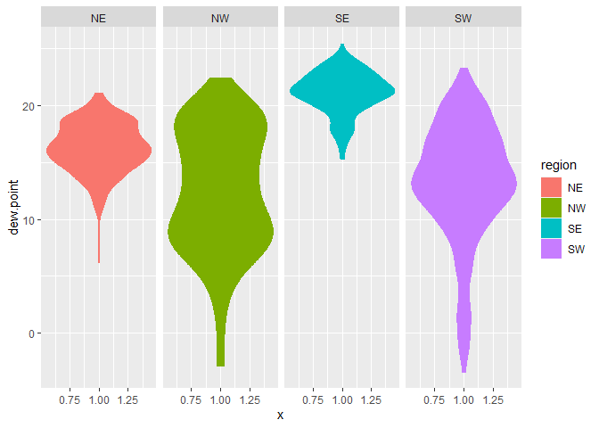
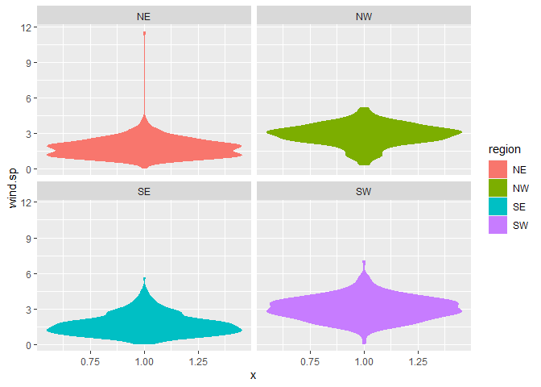
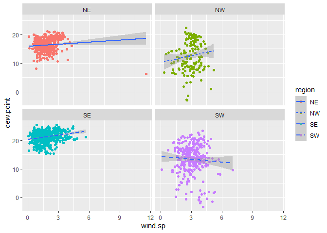
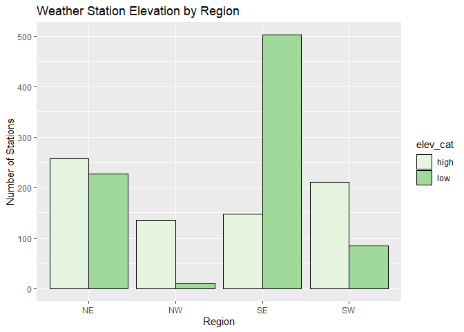
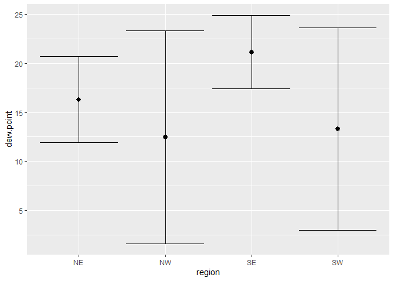
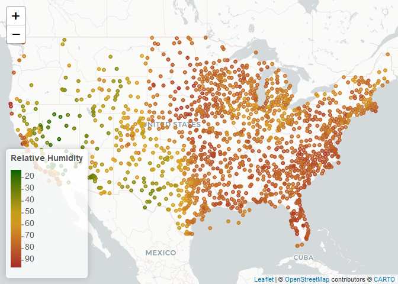

Lab 04
================
CB
2022-09-17

## R Markdown

\#Load required libraries

``` r
library(data.table)
library(lubridate)
```

    ## 
    ## Attaching package: 'lubridate'

    ## The following objects are masked from 'package:data.table':
    ## 
    ##     hour, isoweek, mday, minute, month, quarter, second, wday, week,
    ##     yday, year

    ## The following objects are masked from 'package:base':
    ## 
    ##     date, intersect, setdiff, union

``` r
library(dplyr)
```

    ## 
    ## Attaching package: 'dplyr'

    ## The following objects are masked from 'package:data.table':
    ## 
    ##     between, first, last

    ## The following objects are masked from 'package:stats':
    ## 
    ##     filter, lag

    ## The following objects are masked from 'package:base':
    ## 
    ##     intersect, setdiff, setequal, union

``` r
library(tidyverse)
```

    ## ── Attaching packages
    ## ───────────────────────────────────────
    ## tidyverse 1.3.2 ──

    ## ✔ ggplot2 3.3.6     ✔ purrr   0.3.4
    ## ✔ tibble  3.1.8     ✔ stringr 1.4.1
    ## ✔ tidyr   1.2.0     ✔ forcats 0.5.2
    ## ✔ readr   2.1.2     
    ## ── Conflicts ────────────────────────────────────────── tidyverse_conflicts() ──
    ## ✖ lubridate::as.difftime() masks base::as.difftime()
    ## ✖ dplyr::between()         masks data.table::between()
    ## ✖ lubridate::date()        masks base::date()
    ## ✖ dplyr::filter()          masks stats::filter()
    ## ✖ dplyr::first()           masks data.table::first()
    ## ✖ lubridate::hour()        masks data.table::hour()
    ## ✖ lubridate::intersect()   masks base::intersect()
    ## ✖ lubridate::isoweek()     masks data.table::isoweek()
    ## ✖ dplyr::lag()             masks stats::lag()
    ## ✖ dplyr::last()            masks data.table::last()
    ## ✖ lubridate::mday()        masks data.table::mday()
    ## ✖ lubridate::minute()      masks data.table::minute()
    ## ✖ lubridate::month()       masks data.table::month()
    ## ✖ lubridate::quarter()     masks data.table::quarter()
    ## ✖ lubridate::second()      masks data.table::second()
    ## ✖ lubridate::setdiff()     masks base::setdiff()
    ## ✖ purrr::transpose()       masks data.table::transpose()
    ## ✖ lubridate::union()       masks base::union()
    ## ✖ lubridate::wday()        masks data.table::wday()
    ## ✖ lubridate::week()        masks data.table::week()
    ## ✖ lubridate::yday()        masks data.table::yday()
    ## ✖ lubridate::year()        masks data.table::year()

## Step 1 Read in the data from last week’s lab

``` r
if (!file.exists("met_all.gz")) {
download.file("https://raw.githubusercontent.com/USCbiostats/data-science-data/master/02_met/met_all.gz", "met_all.gz", method="libcurl", timeout = 60)
}
met <- data.table::fread("met_all.gz")
```

## Step 2 Prep data – Remove Temps less than -17C and check data with head command

``` r
met <- met[temp>-17]
met2 <- met[order(temp)]
head(met2)
```

    ##    USAFID  WBAN year month day hour min    lat      lon elev wind.dir
    ## 1: 726764 94163 2019     8  27   11  50 44.683 -111.116 2025       NA
    ## 2: 726764 94163 2019     8  27   12  10 44.683 -111.116 2025       NA
    ## 3: 726764 94163 2019     8  27   12  30 44.683 -111.116 2025       NA
    ## 4: 726764 94163 2019     8  27   12  50 44.683 -111.116 2025       NA
    ## 5: 720411   137 2019     8  18   12  35 36.422 -105.290 2554       NA
    ## 6: 726764 94163 2019     8  26   12  30 44.683 -111.116 2025       NA
    ##    wind.dir.qc wind.type.code wind.sp wind.sp.qc ceiling.ht ceiling.ht.qc
    ## 1:           9              C       0          5      22000             5
    ## 2:           9              C       0          5      22000             5
    ## 3:           9              C       0          5      22000             5
    ## 4:           9              C       0          5      22000             5
    ## 5:           9              C       0          5      22000             5
    ## 6:           9              C       0          5      22000             5
    ##    ceiling.ht.method sky.cond vis.dist vis.dist.qc vis.var vis.var.qc temp
    ## 1:                 9        N    16093           5       N          5 -3.0
    ## 2:                 9        N    16093           5       N          5 -3.0
    ## 3:                 9        N    16093           5       N          5 -3.0
    ## 4:                 9        N    16093           5       N          5 -3.0
    ## 5:                 9        N    16093           5       N          5 -2.4
    ## 6:                 9        N    16093           5       N          5 -2.0
    ##    temp.qc dew.point dew.point.qc atm.press atm.press.qc       rh
    ## 1:       C      -5.0            C        NA            9 86.26537
    ## 2:       5      -4.0            5        NA            9 92.91083
    ## 3:       5      -4.0            5        NA            9 92.91083
    ## 4:       C      -4.0            C        NA            9 92.91083
    ## 5:       5      -3.7            5        NA            9 90.91475
    ## 6:       5      -3.0            5        NA            9 92.96690

# Replace missing values 9999 with “NA”

``` r
met[met$elev==9999.0] <- NA
summary(met$elev)
```

    ##    Min. 1st Qu.  Median    Mean 3rd Qu.    Max.    NA's 
    ##   -13.0   101.0   252.0   414.3   400.0  4113.0     182

# Generate a date variable

``` r
met <- met[ ,ymd :=as.Date(paste(year, month, day, sep = "-"))]
```

## Keep observations from first week of the month

``` r
met[, table(week(ymd))]
```

    ## 
    ##     31     32     33     34     35 
    ## 371513 520400 529529 526271 369309

``` r
met <- met[ week(ymd) == 31 ]
```

## Check that max values are true (and not 9999)

``` r
met[, .(
  temp      = max(temp,na.rm=T),
  rh        = max(rh,na.rm=T), 
  wind.sp   = max(wind.sp,na.rm=T), 
  vis.dist  = max(vis.dist,na.rm=T), 
  dew.point = max(dew.point,na.rm=T), 
  lat       = max(lat,na.rm=T), 
  lon       = max(lon,na.rm=T), 
  elev      = max(elev,na.rm=T)
)]
```

    ##    temp  rh wind.sp vis.dist dew.point    lat     lon elev
    ## 1: 48.9 100    21.1   152888        29 48.941 -68.313 4113

## Find averages for each variable by station

``` r
met_avg <- met[, .(
  temp      = mean(temp,na.rm=T),
  rh        = mean(rh,na.rm=T), 
  wind.sp   = mean(wind.sp,na.rm=T), 
  vis.dist  = mean(vis.dist,na.rm=T), 
  dew.point = mean(dew.point,na.rm=T), 
  lat       = mean(lat,na.rm=T), 
  lon       = mean(lon,na.rm=T), 
  elev      = mean(elev,na.rm=T)
), by = "USAFID"]
```

## Create region variables

``` r
met_avg[, region := fifelse(lon >= -98 & lat > 39.71, "NE",
                fifelse(lon < -98 & lat > 39.71, "NW",
                fifelse(lon < -98 & lat <= 39.71, "SW","SE")))
    ]
table(met_avg$region)
```

    ## 
    ##  NE  NW  SE  SW 
    ## 484 146 649 296

## Create categorical variable for elevation

``` r
met_avg[, elev_cat := fifelse(elev > 252, "high", "low")]
```

## Make Violin plots - dewpoint

``` r
met_avg[!is.na(region)] %>%
  
  ggplot() + 
  geom_violin(mapping = aes(x = 1, y = dew.point,  color=region, fill = region)) + 
  facet_wrap(~ region, nrow = 1)
```

<!-- --> \# *southeast
has highest dewpoint*

# Violin plot wind speed

``` r
met_avg[!is.na(region) & !is.na(wind.sp)] %>% 
  ggplot() + 
  geom_violin(mapping = aes(x = 1, y = wind.sp,  color=region, fill = region)) + 
  facet_wrap(~ region, nrow = 2)
```

<!-- --> \# *highest
wind speeds in the Southwest with a bimodal distribution*

\#Step 4 Examine association between dew point temperature and wind
speed by region

``` r
met_avg[!is.na(region) & !is.na(wind.sp)] %>% 
  ggplot(mapping = aes(x = wind.sp, y = dew.point)) + 
  geom_point(mapping = aes(color = region)) + 
  geom_smooth(method = lm, mapping = aes(linetype = region)) +
  facet_wrap(~ region, nrow = 2)
```

    ## `geom_smooth()` using formula 'y ~ x'

<!-- --> \# *Only in
the southwest is the dewpoint decreasing as wind speed increases*

\##Step 5 Use geom_bar to create barplots of the weather stations by
elevation category coloured by region

``` r
met_avg[!is.na(elev_cat) & !is.na(region)]%>% #Remove missing values for these variables
ggplot(met_avg, mapping=aes(x=region, fill=elev_cat))+
  geom_bar(color="black", position="dodge") + scale_fill_brewer(palette="Greens")+
    labs(title="Weather Station Elevation by Region", x="Region", y="Number of Stations")
```

<!-- --> \#The
Southweast is the lowest elevation area by quite a bit. The Northwest
has very minimal low elevation areas.

## Step 6 examined mean dew point and wind speed by region using SD error bars

``` r
met_avg[!is.na(dew.point)] %>%
  ggplot(mapping = aes(x = region, y = dew.point)) + 
    stat_summary(fun.data = mean_sdl, geom = "pointrange") +
    stat_summary(fun.data = mean_sdl, geom = "errorbar") 
```

<!-- -->

\#There is a wider distribution of values for the West vs East sides of
the US

## Step 7 Make map showing the spatial trend in relative humidity in the US

``` r
library(leaflet)
```

\#Generate color palette

``` r
rh.pal <- colorNumeric(c('darkgreen','goldenrod','brown'), domain=met_avg$rh)
rh.pal
```

    ## function (x) 
    ## {
    ##     if (length(x) == 0 || all(is.na(x))) {
    ##         return(pf(x))
    ##     }
    ##     if (is.null(rng)) 
    ##         rng <- range(x, na.rm = TRUE)
    ##     rescaled <- scales::rescale(x, from = rng)
    ##     if (any(rescaled < 0 | rescaled > 1, na.rm = TRUE)) 
    ##         warning("Some values were outside the color scale and will be treated as NA")
    ##     if (reverse) {
    ##         rescaled <- 1 - rescaled
    ##     }
    ##     pf(rescaled)
    ## }
    ## <bytecode: 0x000002e9048a3d68>
    ## <environment: 0x000002e9048a65c8>
    ## attr(,"colorType")
    ## [1] "numeric"
    ## attr(,"colorArgs")
    ## attr(,"colorArgs")$na.color
    ## [1] "#808080"

\#Generate map

``` r
top10rh <-met_avg[rank (-rh) <=10]
```

``` r
rhmap <- leaflet(met_avg) %>% 

  addProviderTiles('CartoDB.Positron') %>% 

  addCircles(
    lat = ~lat, lng=~lon,
                                                
    label = ~paste0(rh), color = ~ rh.pal(rh),
    opacity = 1, fillOpacity = 1, radius = 500
    ) %>%

  addLegend('bottomleft', pal=rh.pal, values=met_avg$rh,
          title='Relative Humidity', opacity=1)
rhmap
```

<!-- -->

\#It is more humid in the Eastern US vs Western. Perhaps the West coast
humidity is areas like the Coastal Redwood forests?
