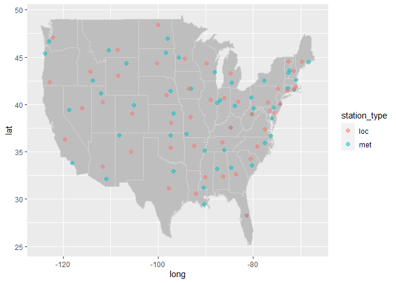

Lab 05
================
CB
2022-10-02

## R Markdown

\#Load required libraries

``` r
library(data.table)
library(lubridate)
```

    ## 
    ## Attaching package: 'lubridate'

    ## The following objects are masked from 'package:data.table':
    ## 
    ##     hour, isoweek, mday, minute, month, quarter, second, wday, week,
    ##     yday, year

    ## The following objects are masked from 'package:base':
    ## 
    ##     date, intersect, setdiff, union

``` r
library(dplyr)
```

    ## 
    ## Attaching package: 'dplyr'

    ## The following objects are masked from 'package:data.table':
    ## 
    ##     between, first, last

    ## The following objects are masked from 'package:stats':
    ## 
    ##     filter, lag

    ## The following objects are masked from 'package:base':
    ## 
    ##     intersect, setdiff, setequal, union

``` r
library(tidyverse)
```

    ## ── Attaching packages
    ## ───────────────────────────────────────
    ## tidyverse 1.3.2 ──

    ## ✔ ggplot2 3.3.6     ✔ purrr   0.3.4
    ## ✔ tibble  3.1.8     ✔ stringr 1.4.1
    ## ✔ tidyr   1.2.0     ✔ forcats 0.5.2
    ## ✔ readr   2.1.2     
    ## ── Conflicts ────────────────────────────────────────── tidyverse_conflicts() ──
    ## ✖ lubridate::as.difftime() masks base::as.difftime()
    ## ✖ dplyr::between()         masks data.table::between()
    ## ✖ lubridate::date()        masks base::date()
    ## ✖ dplyr::filter()          masks stats::filter()
    ## ✖ dplyr::first()           masks data.table::first()
    ## ✖ lubridate::hour()        masks data.table::hour()
    ## ✖ lubridate::intersect()   masks base::intersect()
    ## ✖ lubridate::isoweek()     masks data.table::isoweek()
    ## ✖ dplyr::lag()             masks stats::lag()
    ## ✖ dplyr::last()            masks data.table::last()
    ## ✖ lubridate::mday()        masks data.table::mday()
    ## ✖ lubridate::minute()      masks data.table::minute()
    ## ✖ lubridate::month()       masks data.table::month()
    ## ✖ lubridate::quarter()     masks data.table::quarter()
    ## ✖ lubridate::second()      masks data.table::second()
    ## ✖ lubridate::setdiff()     masks base::setdiff()
    ## ✖ purrr::transpose()       masks data.table::transpose()
    ## ✖ lubridate::union()       masks base::union()
    ## ✖ lubridate::wday()        masks data.table::wday()
    ## ✖ lubridate::week()        masks data.table::week()
    ## ✖ lubridate::yday()        masks data.table::yday()
    ## ✖ lubridate::year()        masks data.table::year()

``` r
library(dtplyr)
library(leaflet)
library(tidyr)
```

## Step 1 Read in the data from week 3 lab

``` r
if (!file.exists("met_all.gz")) {
download.file("https://raw.githubusercontent.com/USCbiostats/data-science-data/master/02_met/met_all.gz", "met_all.gz", method="libcurl", timeout = 60)
}
met <- data.table::fread("met_all.gz")
```

# Remove implausible and NA values from the met data again

``` r
met <- met[temp>-17]
met[met$elev==9999.0] <- NA
```

## Step 2 Obtain station data and clean

# Download the data

``` r
stations <- fread("ftp://ftp.ncdc.noaa.gov/pub/data/noaa/isd-history.csv")
stations[, USAF := as.integer(USAF)]
```

    ## Warning in eval(jsub, SDenv, parent.frame()): NAs introduced by coercion

# Dealing with NAs and 999999

``` r
stations[, USAF   := fifelse(USAF == 999999, NA_integer_, USAF)]
stations[, CTRY   := fifelse(CTRY == "", NA_character_, CTRY)]
stations[, STATE  := fifelse(STATE == "", NA_character_, STATE)]
```

# Selecting the three relevant columns, and keeping unique records

``` r
stations <- unique(stations[, list(USAF, CTRY, STATE)])
```

# Dropping NAs

``` r
stations <- stations[!is.na(USAF)]
```

# Removing duplicates

``` r
stations[, n := 1:.N, by = .(USAF)]
stations <- stations[n == 1,][, n := NULL]
head(stations, n = 4)
```

    ##    USAF CTRY STATE
    ## 1: 7018 <NA>  <NA>
    ## 2: 7026   AF  <NA>
    ## 3: 7070   AF  <NA>
    ## 4: 8260 <NA>  <NA>

# Merge the two datasets using code from lecture

``` r
met <-  
  merge(
  # Data
  x     = met,      
  y     = stations, 
  # List of variables to match
  by.x  = "USAFID",
  by.y  = "USAF", 
  # Which obs to keep?
  all.x = TRUE,      
  all.y = FALSE
  ) 

nrow(met)
```

    ## [1] 2317204

``` r
head(met)
```

    ##    USAFID WBAN year month day hour min lat lon elev wind.dir wind.dir.qc
    ## 1:     NA   NA   NA    NA  NA   NA  NA  NA  NA   NA       NA        <NA>
    ## 2:     NA   NA   NA    NA  NA   NA  NA  NA  NA   NA       NA        <NA>
    ## 3:     NA   NA   NA    NA  NA   NA  NA  NA  NA   NA       NA        <NA>
    ## 4:     NA   NA   NA    NA  NA   NA  NA  NA  NA   NA       NA        <NA>
    ## 5:     NA   NA   NA    NA  NA   NA  NA  NA  NA   NA       NA        <NA>
    ## 6:     NA   NA   NA    NA  NA   NA  NA  NA  NA   NA       NA        <NA>
    ##    wind.type.code wind.sp wind.sp.qc ceiling.ht ceiling.ht.qc ceiling.ht.method
    ## 1:           <NA>      NA       <NA>         NA            NA              <NA>
    ## 2:           <NA>      NA       <NA>         NA            NA              <NA>
    ## 3:           <NA>      NA       <NA>         NA            NA              <NA>
    ## 4:           <NA>      NA       <NA>         NA            NA              <NA>
    ## 5:           <NA>      NA       <NA>         NA            NA              <NA>
    ## 6:           <NA>      NA       <NA>         NA            NA              <NA>
    ##    sky.cond vis.dist vis.dist.qc vis.var vis.var.qc temp temp.qc dew.point
    ## 1:     <NA>       NA        <NA>    <NA>       <NA>   NA    <NA>        NA
    ## 2:     <NA>       NA        <NA>    <NA>       <NA>   NA    <NA>        NA
    ## 3:     <NA>       NA        <NA>    <NA>       <NA>   NA    <NA>        NA
    ## 4:     <NA>       NA        <NA>    <NA>       <NA>   NA    <NA>        NA
    ## 5:     <NA>       NA        <NA>    <NA>       <NA>   NA    <NA>        NA
    ## 6:     <NA>       NA        <NA>    <NA>       <NA>   NA    <NA>        NA
    ##    dew.point.qc atm.press atm.press.qc rh CTRY STATE
    ## 1:         <NA>        NA           NA NA <NA>  <NA>
    ## 2:         <NA>        NA           NA NA <NA>  <NA>
    ## 3:         <NA>        NA           NA NA <NA>  <NA>
    ## 4:         <NA>        NA           NA NA <NA>  <NA>
    ## 5:         <NA>        NA           NA NA <NA>  <NA>
    ## 6:         <NA>        NA           NA NA <NA>  <NA>

## Find the representative station for the U.S.

``` r
#Find means 
station_averages <- 
     met[ , .(
       temp      = mean(temp, na.rm=T),
       wind.sp   = mean(wind.sp, na.rm=T),
       atm.press = mean(atm.press,na.rm=T)
     ), by = USAFID]


#Find medians
stmeds <- station_averages[ , .(
          temp50     = median(temp, na.rm=T),
          windsp50   = median(wind.sp,na.rm=T),
          atmpress50 = median(atm.press,na.rm=T))]

#View values
stmeds
```

    ##      temp50 windsp50 atmpress50
    ## 1: 23.68406 2.463685   1014.691

``` r
#Find the station w shortest distance using which.min function
station_averages[ , 
              temp_dist50 := abs(temp - stmeds$temp50)][order(temp_dist50)]
```

    ##       USAFID      temp   wind.sp atm.press  temp_dist50
    ##    1: 720458 23.681730  1.209682       NaN  0.002328907
    ##    2: 725515 23.686388  2.709164       NaN  0.002328907
    ##    3: 725835 23.678347  2.652381       NaN  0.005712423
    ##    4: 724509 23.675100  4.066833  1013.863  0.008959632
    ##    5: 720538 23.665932  1.907897       NaN  0.018127186
    ##   ---                                                  
    ## 1585: 722787 37.258907  2.847381       NaN 13.574848130
    ## 1586: 723805 37.625391  3.532935  1005.207 13.941331392
    ## 1587: 726130  9.189602 12.239908       NaN 14.494456787
    ## 1588: 720385  8.044959  7.298963       NaN 15.639100105
    ## 1589:     NA       NaN       NaN       NaN          NaN

``` r
station_averages[ ,which.min(temp_dist50)]
```

    ## [1] 139

\#The station 720458 is the nearest one

## Find the station most representative by STATE

``` r
#First get means
station_averages <- 
     met[ , .(
       temp      = mean(temp, na.rm=T),
       wind.sp   = mean(wind.sp, na.rm=T),
       atm.press = mean(atm.press,na.rm=T)
     ), by = .(USAFID,STATE)]
head(station_averages)
```

    ##    USAFID STATE     temp  wind.sp atm.press
    ## 1:     NA  <NA>      NaN      NaN       NaN
    ## 2: 690150    CA 33.18763 3.483560  1010.379
    ## 3: 720110    TX 31.22003 2.138348       NaN
    ## 4: 720113    MI 23.29317 2.470298       NaN
    ## 5: 720120    SC 27.01922 2.503079       NaN
    ## 6: 720137    IL 21.88823 1.979335       NaN

``` r
#Now getting medians

statemeds<- station_averages[ , .(
           temp50    = median(temp, na.rm=T), 
           wind.sp50 = median(wind.sp, na.rm=T)
            ), by = STATE]
statemeds
```

    ##     STATE   temp50 wind.sp50
    ##  1:  <NA>       NA        NA
    ##  2:    CA 22.66268  2.561738
    ##  3:    TX 29.75188  3.413810
    ##  4:    MI 20.51970  2.273423
    ##  5:    SC 25.80545  1.696119
    ##  6:    IL 22.43194  2.237652
    ##  7:    MO 23.95109  2.453547
    ##  8:    AR 26.24296  1.938625
    ##  9:    OR 17.98061  2.011436
    ## 10:    WA 19.24684  1.268571
    ## 11:    GA 26.70404  1.497527
    ## 12:    MN 19.63017  2.616482
    ## 13:    AL 26.33664  1.662132
    ## 14:    IN 22.25059  2.344333
    ## 15:    NC 24.72953  1.627306
    ## 16:    VA 24.37799  1.654183
    ## 17:    IA 21.33461  2.680875
    ## 18:    PA 21.69177  1.784167
    ## 19:    NE 21.87354  3.192539
    ## 20:    ID 20.56798  2.568944
    ## 21:    WI 18.85524  2.053283
    ## 22:    WV 21.94446  1.632107
    ## 23:    MD 24.89883  1.883499
    ## 24:    AZ 30.32372  3.074359
    ## 25:    OK 27.14427  3.852697
    ## 26:    WY 19.80699  3.873986
    ## 27:    LA 27.87430  1.712535
    ## 28:    KY 23.88844  1.895486
    ## 29:    FL 27.57325  2.705069
    ## 30:    CO 21.52650  3.098777
    ## 31:    OH 22.02062  2.554138
    ## 32:    NJ 23.47238  2.148058
    ## 33:    NM 24.94447  3.776083
    ## 34:    KS 24.21220  3.676997
    ## 35:    ND 18.52849  3.956459
    ## 36:    VT 18.61379  1.408247
    ## 37:    MS 26.69258  1.637030
    ## 38:    CT 22.36880  2.101294
    ## 39:    NV 24.56293  3.035050
    ## 40:    UT 24.35182  3.110795
    ## 41:    SD 20.35662  3.665638
    ## 42:    TN 24.88657  1.576035
    ## 43:    NY 20.40674  2.304075
    ## 44:    RI 22.53551  2.583469
    ## 45:    MA 21.30662  2.710944
    ## 46:    DE 24.56026  2.753082
    ## 47:    NH 19.55054  1.563826
    ## 48:    ME 18.79016  2.237210
    ## 49:    MT 19.15492  4.151737
    ##     STATE   temp50 wind.sp50

\#Merge data

``` r
station_averages <- 
  merge(
  x = station_averages,
  y = statemeds,
  by.x = "STATE",
  by.y = "STATE",
  all.x = TRUE,
  all.y = FALSE
)
```

``` r
#Find the minimum distance
station_averages[ , temp_dist_state50   := temp - temp50]
station_averages[ , windsp_dist_state50 := wind.sp - wind.sp50] 
station_averages
```

    ##       STATE USAFID     temp  wind.sp atm.press   temp50 wind.sp50
    ##    1:  <NA>     NA      NaN      NaN       NaN       NA        NA
    ##    2:    AL 720265 26.22064 1.136691       NaN 26.33664  1.662132
    ##    3:    AL 720307 25.14605 1.624349       NaN 26.33664  1.662132
    ##    4:    AL 720361 26.62228 1.343410  1015.275 26.33664  1.662132
    ##    5:    AL 720362 27.26504 1.746168  1014.559 26.33664  1.662132
    ##   ---                                                            
    ## 1585:    WY 726667 23.10219 3.290873  1012.276 19.80699  3.873986
    ## 1586:    WY 726690 20.51681 4.242981  1013.000 19.80699  3.873986
    ## 1587:    WY 726700 19.97665 3.066306  1015.219 19.80699  3.873986
    ## 1588:    WY 726710 16.86569 3.492218  1014.945 19.80699  3.873986
    ## 1589:    WY 726720 21.70287 3.800334  1012.771 19.80699  3.873986
    ##       temp_dist_state50 windsp_dist_state50
    ##    1:               NaN                 NaN
    ##    2:        -0.1159996         -0.52544171
    ##    3:        -1.1905914         -0.03778375
    ##    4:         0.2856450         -0.31872221
    ##    5:         0.9284033          0.08403570
    ##   ---                                      
    ## 1585:         3.2951940         -0.58311300
    ## 1586:         0.7098198          0.36899535
    ## 1587:         0.1696556         -0.80768036
    ## 1588:        -2.9412986         -0.38176812
    ## 1589:         1.8958786         -0.07365157

\#Find the euclidian dist

``` r
station_averages[ , eucdist := temp_dist_state50^2 +
                                windsp_dist_state50^2]
```

\#Find the representative station

``` r
repstation <- station_averages[ , .(
                    eucdist = min(eucdist, na.rm=T))
                  , by=STATE]
```

    ## Warning in gmin(eucdist, na.rm = TRUE): No non-missing values found in at least
    ## one group. Returning 'Inf' for such groups to be consistent with base

``` r
repweather <- 
  merge(
  x = station_averages,
  y = repstation,
  by.x = c("eucdist","STATE"),
  by.y = c("eucdist","STATE"),
  all.x = FALSE,
  all.y = TRUE
)
repweather
```

    ##          eucdist STATE USAFID     temp  wind.sp atm.press   temp50 wind.sp50
    ##  1: 0.0000000000    DE 724180 24.56026 2.753082  1015.046 24.56026  2.753082
    ##  2: 0.0000000000    MD 722218 24.89883 1.883499       NaN 24.89883  1.883499
    ##  3: 0.0000000000    NJ 724090 23.47238 2.148058  1015.095 23.47238  2.148058
    ##  4: 0.0000000000    WA 720254 19.24684 1.268571       NaN 19.24684  1.268571
    ##  5: 0.0003044727    WV 720328 21.94820 1.615064       NaN 21.94446  1.632107
    ##  6: 0.0003044727    WV 724176 21.94072 1.649151  1015.982 21.94446  1.632107
    ##  7: 0.0006410156    AL 722286 26.35793 1.675828  1014.909 26.33664  1.662132
    ##  8: 0.0009745369    FL 722011 27.56952 2.674074  1016.063 27.57325  2.705069
    ##  9: 0.0020160519    IA 725464 21.37948 2.679227       NaN 21.33461  2.680875
    ## 10: 0.0021721657    GA 722197 26.70404 1.544133  1015.574 26.70404  1.497527
    ## 11: 0.0030365498    LA 722041 27.84758 1.760730       NaN 27.87430  1.712535
    ## 12: 0.0037790245    VA 724006 24.31662 1.650539       NaN 24.37799  1.654183
    ## 13: 0.0069584784    OK 720625 27.06188 3.865717       NaN 27.14427  3.852697
    ## 14: 0.0077712543    IL 722076 22.34403 2.244115       NaN 22.43194  2.237652
    ## 15: 0.0081925142    WI 726413 18.94233 2.028610       NaN 18.85524  2.053283
    ## 16: 0.0090257850    NE 725565 21.86100 3.098367  1015.068 21.87354  3.192539
    ## 17: 0.0091213936    NC 720864 24.82394 1.612864       NaN 24.72953  1.627306
    ## 18: 0.0093580816    NY 724988 20.44142 2.394383  1016.233 20.40674  2.304075
    ## 19: 0.0123577703    WY 726654 19.85844 3.775443  1014.107 19.80699  3.873986
    ## 20: 0.0132319539    MI 725395 20.44096 2.357275  1015.245 20.51970  2.273423
    ## 21: 0.0144022476    MA 725088 21.20391 2.773018  1013.718 21.30662  2.710944
    ## 22: 0.0153070309    TX 722598 29.81293 3.521417       NaN 29.75188  3.413810
    ## 23: 0.0159151165    IN 724386 22.32575 2.243013  1014.797 22.25059  2.344333
    ## 24: 0.0183564932    UT 725750 24.23571 3.040962  1011.521 24.35182  3.110795
    ## 25: 0.0327455867    SC 723107 25.95831 1.599275       NaN 25.80545  1.696119
    ## 26: 0.0339881655    PA 725204 21.87141 1.825605       NaN 21.69177  1.784167
    ## 27: 0.0348669121    ND 720911 18.34248 3.940128       NaN 18.52849  3.956459
    ## 28: 0.0351865214    MS 722358 26.54093 1.747426  1014.722 26.69258  1.637030
    ## 29: 0.0375202070    TN 720974 24.71645 1.483411       NaN 24.88657  1.576035
    ## 30: 0.0416560272    MO 720479 24.14775 2.508153       NaN 23.95109  2.453547
    ## 31: 0.0427670273    NM 723658 24.94447 3.569281  1013.917 24.94447  3.776083
    ## 32: 0.0433144478    CT 725087 22.57539 2.126514  1014.534 22.36880  2.101294
    ## 33: 0.0512183083    MN 726553 19.67552 2.394756       NaN 19.63017  2.616482
    ## 34: 0.0544857836    AZ 722745 30.31538 3.307632  1010.144 30.32372  3.074359
    ## 35: 0.0557784421    KS 724550 24.14958 3.449278  1013.315 24.21220  3.676997
    ## 36: 0.0634001463    OH 724295 21.97211 2.801214  1015.742 22.02062  2.554138
    ## 37: 0.0651314631    CA 722970 22.76040 2.325982  1012.710 22.66268  2.561738
    ## 38: 0.0668411712    RI 725079 22.27697 2.583469  1014.620 22.53551  2.583469
    ## 39: 0.0777385965    ID 725867 20.81272 2.702517  1012.802 20.56798  2.568944
    ## 40: 0.0942851270    VT 726115 18.60548 1.101301  1014.985 18.61379  1.408247
    ## 41: 0.0943820541    ME 726077 18.49969 2.337241  1014.475 18.79016  2.237210
    ## 42: 0.1065472295    NH 726116 19.23920 1.465766  1013.840 19.55054  1.563826
    ## 43: 0.1710841308    SD 726590 19.95928 3.550722  1014.284 20.35662  3.665638
    ## 44: 0.1736376706    AR 722054 26.58944 1.707136  1014.127 26.24296  1.938625
    ## 45: 0.1879315944    MT 726798 19.47014 4.449337  1014.072 19.15492  4.151737
    ## 46: 0.2125405164    KY 720448 23.52994 1.605628       NaN 23.88844  1.895486
    ## 47: 0.2380402433    NV 724885 24.78430 2.600266  1013.825 24.56293  3.035050
    ## 48: 0.2382427502    CO 724699 21.94228 2.843091       NaN 21.52650  3.098777
    ## 49: 0.7028808653    OR 720202 17.16329 1.824696       NaN 17.98061  2.011436
    ## 50:          Inf  <NA>     NA       NA       NA        NA       NA        NA
    ##          eucdist STATE USAFID     temp  wind.sp atm.press   temp50 wind.sp50
    ##     temp_dist_state50 windsp_dist_state50
    ##  1:       0.000000000         0.000000000
    ##  2:       0.000000000         0.000000000
    ##  3:       0.000000000         0.000000000
    ##  4:       0.000000000         0.000000000
    ##  5:       0.003739818        -0.017043664
    ##  6:      -0.003739818         0.017043664
    ##  7:       0.021294174         0.013695758
    ##  8:      -0.003722957        -0.030994782
    ##  9:       0.044870212        -0.001648046
    ## 10:       0.000000000         0.046606498
    ## 11:      -0.026716512         0.048195205
    ## 12:      -0.061365678        -0.003643902
    ## 13:      -0.082395169         0.013019775
    ## 14:      -0.087917451         0.006463443
    ## 15:       0.087084812        -0.024672854
    ## 16:      -0.012543905        -0.094172371
    ## 17:       0.094407682        -0.014442410
    ## 18:       0.034676267         0.090308571
    ## 19:       0.051448939        -0.098543275
    ## 20:      -0.078745377         0.083851771
    ## 21:      -0.102708664         0.062073971
    ## 22:       0.061055783         0.107606795
    ## 23:       0.075162869        -0.101319591
    ## 24:      -0.116102741        -0.069832992
    ## 25:       0.152861989        -0.096844200
    ## 26:       0.179641362         0.041438466
    ## 27:      -0.186011382        -0.016330272
    ## 28:      -0.151654911         0.110396147
    ## 29:      -0.170120726        -0.092623677
    ## 30:       0.196657661         0.054605785
    ## 31:       0.000000000        -0.206801904
    ## 32:       0.206587513         0.025219975
    ## 33:       0.045341660        -0.221726052
    ## 34:      -0.008341255         0.233272817
    ## 35:      -0.062628803        -0.227719290
    ## 36:      -0.048515527         0.247075676
    ## 37:       0.097726713        -0.235756129
    ## 38:      -0.258536596         0.000000000
    ## 39:       0.244738817         0.133572108
    ## 40:      -0.008312123        -0.306946307
    ## 41:      -0.290475361         0.100030588
    ## 42:      -0.311337973        -0.098060676
    ## 43:      -0.397339331        -0.114915562
    ## 44:       0.346482848        -0.231489323
    ## 45:       0.315223976         0.297599461
    ## 46:      -0.358501256        -0.289857492
    ## 47:       0.221366082        -0.434784201
    ## 48:       0.415773719        -0.255685285
    ## 49:      -0.817318253        -0.186739760
    ## 50:                NA                  NA
    ##     temp_dist_state50 windsp_dist_state50

\#Chart shows stations with smallest euclidian distance

## Question 3 Identify the station closest to the mid-point of the state.

``` r
#Find station locations
met_stations <- unique(met[, .(USAFID, STATE, lon, lat)])
nrow(met_stations)
```

    ## [1] 2824

``` r
length(unique(met$USAFID))
```

    ## [1] 1589

\#More station locations than station IDs

``` r
#Choose stations from earliest recording in the month
met_stations <- unique(met[order(USAFID,day,hour)][, .(USAFID, STATE, lon, lat)])
met_stations[, n := 1:.N, by=USAFID]
met_stations <- met_stations[n == 1][, n:= NULL]
nrow(met_stations)
```

    ## [1] 1589

``` r
met_stations[, lat_mid := quantile(lat, probs = .5, na.rm = TRUE), by=STATE]
met_stations[, lon_mid := quantile(lon, probs = .5, na.rm = TRUE), by=STATE]
# Looking at the euclidean distances
met_stations[, dist := sqrt((lat-lat_mid)^2+(lon-lon_mid)^2)]
met_stations[, mindist := which.min(dist), by=STATE]
```

``` r
#Create an index for each state
met_stations[, n := 1:.N, by=STATE]
met_stations[order(STATE,dist)]
```

    ##       USAFID STATE      lon    lat lat_mid   lon_mid      dist mindist  n
    ##    1: 722265    AL  -86.350 32.383 32.7655  -86.5840 0.4483997      17 17
    ##    2: 722300    AL  -86.782 33.178 32.7655  -86.5840 0.4575590      17 29
    ##    3: 722260    AL  -86.400 32.300 32.7655  -86.5840 0.5005460      17 16
    ##    4: 720265    AL  -85.963 32.915 32.7655  -86.5840 0.6387419      17  1
    ##    5: 722280    AL  -86.745 33.566 32.7655  -86.5840 0.8165300      17 24
    ##   ---                                                                    
    ## 1585: 726650    WY -105.541 44.339 42.8055 -108.2355 3.1003149      26 17
    ## 1586: 725775    WY -111.030 41.273 42.8055 -108.2355 3.1871283      26 15
    ## 1587: 725640    WY -104.800 41.150 42.8055 -108.2355 3.8135732      26  8
    ## 1588: 725763    WY -104.158 42.061 42.8055 -108.2355 4.1449109      26 14
    ## 1589:     NA  <NA>       NA     NA      NA        NA        NA      NA  1

``` r
#Save just shortest distance stations
met_location <- met_stations[n == mindist, .(USAFID, STATE, lon, lat)][order(STATE)]
met_location
```

    ##     USAFID STATE      lon    lat
    ##  1: 722265    AL  -86.350 32.383
    ##  2: 720401    AR  -92.450 35.600
    ##  3: 722783    AZ -111.733 33.467
    ##  4: 723898    CA -119.628 36.319
    ##  5: 726396    CO -105.516 39.050
    ##  6: 725027    CT  -72.828 41.510
    ##  7: 724088    DE  -75.467 39.133
    ##  8: 722011    FL  -81.437 28.290
    ##  9: 722175    GA  -83.600 32.633
    ## 10: 725466    IA  -93.566 41.691
    ## 11: 725865    ID -114.300 43.500
    ## 12: 724397    IL  -88.950 40.483
    ## 13: 725335    IN  -86.152 40.648
    ## 14: 724509    KS  -97.275 38.058
    ## 15: 720448    KY  -84.770 37.578
    ## 16: 720468    LA  -92.099 30.558
    ## 17: 725068    MA  -71.021 41.876
    ## 18: 724067    MD  -76.414 39.326
    ## 19: 726073    ME  -69.667 44.533
    ## 20: 725405    MI  -84.688 43.322
    ## 21: 726569    MN  -94.382 44.859
    ## 22: 724453    MO  -93.183 38.704
    ## 23: 722350    MS  -90.083 32.317
    ## 24: 726770    MT -108.533 45.800
    ## 25: 722201    NC  -79.101 35.582
    ## 26: 720867    ND -100.024 48.390
    ## 27: 725520    NE  -98.317 40.967
    ## 28: 726155    NH  -71.433 43.567
    ## 29: 724090    NJ  -74.350 40.033
    ## 30: 722677    NM -105.662 35.003
    ## 31: 724770    NV -116.005 39.601
    ## 32: 725145    NY  -74.795 41.702
    ## 33: 720928    OH  -83.115 40.280
    ## 34: 723540    OK  -97.383 35.417
    ## 35: 725970    OR -122.867 42.367
    ## 36: 725118    PA  -76.851 40.217
    ## 37: 725074    RI  -71.412 41.597
    ## 38: 720603    SC  -80.567 34.283
    ## 39: 726560    SD -100.285 44.381
    ## 40: 723273    TN  -86.520 36.009
    ## 41: 722570    TX  -97.717 31.150
    ## 42: 725724    UT -111.723 40.219
    ## 43: 720498    VA  -77.517 37.400
    ## 44: 726114    VT  -72.614 44.534
    ## 45: 720388    WA -122.287 47.104
    ## 46: 726452    WI  -89.837 44.359
    ## 47: 720328    WV  -80.274 39.000
    ## 48: 726720    WY -108.450 43.067
    ##     USAFID STATE      lon    lat

``` r
#Get station locations from question 2
repweather <-
  merge(
  x =   repweather[, .(USAFID, STATE)],
  y = met_stations[, .(USAFID, STATE, lat, lon)],
  by.x = c("USAFID","STATE"),
  by.y = c("USAFID","STATE"),
  all.x = TRUE,
  all.y = FALSE
) 

repweather[, station_type := "met"]
met_location <- met_location[, .(USAFID, STATE, lat, lon)][, station_type := "loc"]
all_stations <- rbind(repweather, met_location, use.names=TRUE)
```

``` r
#Visualize data

ggplot(map_data("state"), aes(x = long, y = lat)) +
  geom_map(aes(map_id = region), map = map_data("state"), col = "lightgrey", fill = "gray") +
  geom_point(
    data    = all_stations,
    mapping = aes(x = lon, y = lat, col = station_type),
    inherit.aes = FALSE, cex = 2, alpha = 0.5
    )
```

    ## Warning: Removed 1 rows containing missing values (geom_point).

<!-- -->

``` r
#Compute averages and classify
met[, state_temp := mean(temp, na.rm = TRUE), by = STATE]

met %>% 
  drop_na(c(state_temp))
```

    ## Source: local data table [2,317,022 x 33]
    ## Call:   na.omit(`_DT1`, cols = "state_temp")
    ## 
    ##   USAFID  WBAN  year month   day  hour   min   lat   lon  elev wind.dir wind.d…¹
    ##    <int> <int> <int> <int> <int> <int> <int> <dbl> <dbl> <int>    <int> <chr>   
    ## 1 690150 93121  2019     8     1     0    56  34.3 -116.   696      220 5       
    ## 2 690150 93121  2019     8     1     1    56  34.3 -116.   696      230 5       
    ## 3 690150 93121  2019     8     1     2    56  34.3 -116.   696      230 5       
    ## 4 690150 93121  2019     8     1     3    56  34.3 -116.   696      210 5       
    ## 5 690150 93121  2019     8     1     4    56  34.3 -116.   696      120 5       
    ## 6 690150 93121  2019     8     1     5    56  34.3 -116.   696       NA 9       
    ## # … with 2,317,016 more rows, 21 more variables: wind.type.code <chr>,
    ## #   wind.sp <dbl>, wind.sp.qc <chr>, ceiling.ht <int>, ceiling.ht.qc <int>,
    ## #   ceiling.ht.method <chr>, sky.cond <chr>, vis.dist <int>, vis.dist.qc <chr>,
    ## #   vis.var <chr>, vis.var.qc <chr>, temp <dbl>, temp.qc <chr>,
    ## #   dew.point <dbl>, dew.point.qc <chr>, atm.press <dbl>, atm.press.qc <int>,
    ## #   rh <dbl>, CTRY <chr>, STATE <chr>, state_temp <dbl>, and abbreviated
    ## #   variable name ¹​wind.dir.qc
    ## # ℹ Use `print(n = ...)` to see more rows, and `colnames()` to see all variable names
    ## 
    ## # Use as.data.table()/as.data.frame()/as_tibble() to access results

``` r
met[, temp_cat := fifelse(
  state_temp < 20, "low-temp", 
  fifelse(state_temp < 25, "mid-temp", "high-temp"))
  ]
head(met)
```

    ##    USAFID WBAN year month day hour min lat lon elev wind.dir wind.dir.qc
    ## 1:     NA   NA   NA    NA  NA   NA  NA  NA  NA   NA       NA        <NA>
    ## 2:     NA   NA   NA    NA  NA   NA  NA  NA  NA   NA       NA        <NA>
    ## 3:     NA   NA   NA    NA  NA   NA  NA  NA  NA   NA       NA        <NA>
    ## 4:     NA   NA   NA    NA  NA   NA  NA  NA  NA   NA       NA        <NA>
    ## 5:     NA   NA   NA    NA  NA   NA  NA  NA  NA   NA       NA        <NA>
    ## 6:     NA   NA   NA    NA  NA   NA  NA  NA  NA   NA       NA        <NA>
    ##    wind.type.code wind.sp wind.sp.qc ceiling.ht ceiling.ht.qc ceiling.ht.method
    ## 1:           <NA>      NA       <NA>         NA            NA              <NA>
    ## 2:           <NA>      NA       <NA>         NA            NA              <NA>
    ## 3:           <NA>      NA       <NA>         NA            NA              <NA>
    ## 4:           <NA>      NA       <NA>         NA            NA              <NA>
    ## 5:           <NA>      NA       <NA>         NA            NA              <NA>
    ## 6:           <NA>      NA       <NA>         NA            NA              <NA>
    ##    sky.cond vis.dist vis.dist.qc vis.var vis.var.qc temp temp.qc dew.point
    ## 1:     <NA>       NA        <NA>    <NA>       <NA>   NA    <NA>        NA
    ## 2:     <NA>       NA        <NA>    <NA>       <NA>   NA    <NA>        NA
    ## 3:     <NA>       NA        <NA>    <NA>       <NA>   NA    <NA>        NA
    ## 4:     <NA>       NA        <NA>    <NA>       <NA>   NA    <NA>        NA
    ## 5:     <NA>       NA        <NA>    <NA>       <NA>   NA    <NA>        NA
    ## 6:     <NA>       NA        <NA>    <NA>       <NA>   NA    <NA>        NA
    ##    dew.point.qc atm.press atm.press.qc rh CTRY STATE state_temp temp_cat
    ## 1:         <NA>        NA           NA NA <NA>  <NA>        NaN     <NA>
    ## 2:         <NA>        NA           NA NA <NA>  <NA>        NaN     <NA>
    ## 3:         <NA>        NA           NA NA <NA>  <NA>        NaN     <NA>
    ## 4:         <NA>        NA           NA NA <NA>  <NA>        NaN     <NA>
    ## 5:         <NA>        NA           NA NA <NA>  <NA>        NaN     <NA>
    ## 6:         <NA>        NA           NA NA <NA>  <NA>        NaN     <NA>

``` r
table(met$temp_cat, useNA = "always")
```

    ## 
    ## high-temp  low-temp  mid-temp      <NA> 
    ##    787589    423385   1106048       182

\#All NAs removed

``` r
tab <- met[, .(
  N_entries   = .N,
  N_stations  = length(unique(USAFID)),
  N_states    = length(unique(STATE)),
  avg_temp    = mean(temp, na.rm = TRUE),
  avg_wind.sp = mean(wind.sp, na.rm = TRUE),
  avg_atm.pre = mean(atm.press, na.rm = TRUE)
), by = temp_cat]

knitr::kable(tab)
```

| temp_cat  | N_entries | N_stations | N_states | avg_temp | avg_wind.sp | avg_atm.pre |
|:----------|----------:|-----------:|---------:|---------:|------------:|------------:|
| NA        |       182 |          1 |        1 |      NaN |         NaN |         NaN |
| mid-temp  |   1106048 |        777 |       25 | 22.39949 |    2.354367 |    1014.384 |
| high-temp |    787589 |        552 |       12 | 27.75392 |    2.521955 |    1013.739 |
| low-temp  |    423385 |        259 |       11 | 18.96538 |    2.635315 |    1014.366 |
