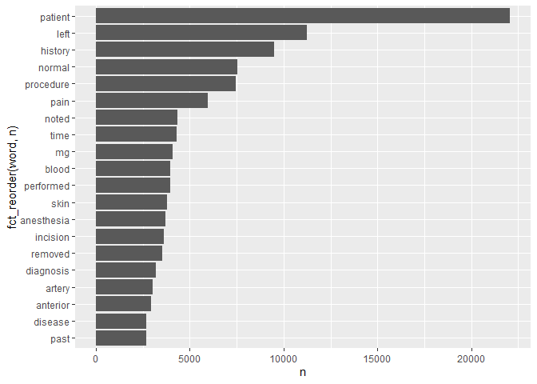

Lab 06
================
CB
2022-09-28

## R Markdown

\#Load required libraries

``` r
library(tidytext)
library(dplyr)
```

    ## 
    ## Attaching package: 'dplyr'

    ## The following objects are masked from 'package:stats':
    ## 
    ##     filter, lag

    ## The following objects are masked from 'package:base':
    ## 
    ##     intersect, setdiff, setequal, union

``` r
library(tidyverse)
```

    ## ── Attaching packages
    ## ───────────────────────────────────────
    ## tidyverse 1.3.2 ──

    ## ✔ ggplot2 3.3.6     ✔ purrr   0.3.4
    ## ✔ tibble  3.1.8     ✔ stringr 1.4.1
    ## ✔ tidyr   1.2.0     ✔ forcats 0.5.2
    ## ✔ readr   2.1.2     
    ## ── Conflicts ────────────────────────────────────────── tidyverse_conflicts() ──
    ## ✖ dplyr::filter() masks stats::filter()
    ## ✖ dplyr::lag()    masks stats::lag()

``` r
library(ggplot2)
library(forcats)
```

\#Load in data

``` r
download.file("https://raw.githubusercontent.com//USCbiostats//data-science-data//master//00_mtsamples//mtsamples.csv", "mtsamples.csv", method="libcurl", timeout=60)
```

``` r
mts<-read.csv("mtsamples.csv")
dim(mts)
```

    ## [1] 4999    6

``` r
str(mts)
```

    ## 'data.frame':    4999 obs. of  6 variables:
    ##  $ X                : int  0 1 2 3 4 5 6 7 8 9 ...
    ##  $ description      : chr  " A 23-year-old white female presents with complaint of allergies." " Consult for laparoscopic gastric bypass." " Consult for laparoscopic gastric bypass." " 2-D M-Mode. Doppler.  " ...
    ##  $ medical_specialty: chr  " Allergy / Immunology" " Bariatrics" " Bariatrics" " Cardiovascular / Pulmonary" ...
    ##  $ sample_name      : chr  " Allergic Rhinitis " " Laparoscopic Gastric Bypass Consult - 2 " " Laparoscopic Gastric Bypass Consult - 1 " " 2-D Echocardiogram - 1 " ...
    ##  $ transcription    : chr  "SUBJECTIVE:,  This 23-year-old white female presents with complaint of allergies.  She used to have allergies w"| __truncated__ "PAST MEDICAL HISTORY:, He has difficulty climbing stairs, difficulty with airline seats, tying shoes, used to p"| __truncated__ "HISTORY OF PRESENT ILLNESS: , I have seen ABC today.  He is a very pleasant gentleman who is 42 years old, 344 "| __truncated__ "2-D M-MODE: , ,1.  Left atrial enlargement with left atrial diameter of 4.7 cm.,2.  Normal size right and left "| __truncated__ ...
    ##  $ keywords         : chr  "allergy / immunology, allergic rhinitis, allergies, asthma, nasal sprays, rhinitis, nasal, erythematous, allegr"| __truncated__ "bariatrics, laparoscopic gastric bypass, weight loss programs, gastric bypass, atkin's diet, weight watcher's, "| __truncated__ "bariatrics, laparoscopic gastric bypass, heart attacks, body weight, pulmonary embolism, potential complication"| __truncated__ "cardiovascular / pulmonary, 2-d m-mode, doppler, aortic valve, atrial enlargement, diastolic function, ejection"| __truncated__ ...

``` r
mts<-as_tibble(mts)
mts
```

    ## # A tibble: 4,999 × 6
    ##        X description                             medic…¹ sampl…² trans…³ keywo…⁴
    ##    <int> <chr>                                   <chr>   <chr>   <chr>   <chr>  
    ##  1     0 " A 23-year-old white female presents … " Alle… " Alle… "SUBJE… "aller…
    ##  2     1 " Consult for laparoscopic gastric byp… " Bari… " Lapa… "PAST … "baria…
    ##  3     2 " Consult for laparoscopic gastric byp… " Bari… " Lapa… "HISTO… "baria…
    ##  4     3 " 2-D M-Mode. Doppler.  "               " Card… " 2-D … "2-D M… "cardi…
    ##  5     4 " 2-D Echocardiogram"                   " Card… " 2-D … "1.  T… "cardi…
    ##  6     5 " Morbid obesity.  Laparoscopic anteco… " Bari… " Lapa… "PREOP… "baria…
    ##  7     6 " Liposuction of the supraumbilical ab… " Bari… " Lipo… "PREOP… "baria…
    ##  8     7 " 2-D Echocardiogram"                   " Card… " 2-D … "2-D E… "cardi…
    ##  9     8 " Suction-assisted lipectomy - lipodys… " Bari… " Lipe… "PREOP… "baria…
    ## 10     9 " Echocardiogram and Doppler"           " Card… " 2-D … "DESCR… "cardi…
    ## # … with 4,989 more rows, and abbreviated variable names ¹​medical_specialty,
    ## #   ²​sample_name, ³​transcription, ⁴​keywords
    ## # ℹ Use `print(n = ...)` to see more rows

\#Question 1: What specialties do we have and how many of each are there
in the dataset? We can use count() from dplyr”

``` r
mts %>% count(medical_specialty)
```

    ## # A tibble: 40 × 2
    ##    medical_specialty                 n
    ##    <chr>                         <int>
    ##  1 " Allergy / Immunology"           7
    ##  2 " Autopsy"                        8
    ##  3 " Bariatrics"                    18
    ##  4 " Cardiovascular / Pulmonary"   372
    ##  5 " Chiropractic"                  14
    ##  6 " Consult - History and Phy."   516
    ##  7 " Cosmetic / Plastic Surgery"    27
    ##  8 " Dentistry"                     27
    ##  9 " Dermatology"                   29
    ## 10 " Diets and Nutritions"          10
    ## # … with 30 more rows
    ## # ℹ Use `print(n = ...)` to see more rows

\#*The specialties are definitely overlapping. For instance there is
surgery in addition to urology which is a surgical subspecialty. They
are not evenly distributed, some categories have more than 1000 entries
and others \<10)*

``` r
colnames(mts)
```

    ## [1] "X"                 "description"       "medical_specialty"
    ## [4] "sample_name"       "transcription"     "keywords"

``` r
specialties<-mts %>% count(medical_specialty)
specialties %>% arrange(desc(n))
```

    ## # A tibble: 40 × 2
    ##    medical_specialty                    n
    ##    <chr>                            <int>
    ##  1 " Surgery"                        1103
    ##  2 " Consult - History and Phy."      516
    ##  3 " Cardiovascular / Pulmonary"      372
    ##  4 " Orthopedic"                      355
    ##  5 " Radiology"                       273
    ##  6 " General Medicine"                259
    ##  7 " Gastroenterology"                230
    ##  8 " Neurology"                       223
    ##  9 " SOAP / Chart / Progress Notes"   166
    ## 10 " Obstetrics / Gynecology"         160
    ## # … with 30 more rows
    ## # ℹ Use `print(n = ...)` to see more rows

``` r
#Make a barplot of specialty counts
specialties %>% 
  top_n(10) %>% 
  ggplot (aes(x=n, y=fct_reorder(medical_specialty,n)))+
  geom_col()
```

    ## Selecting by n

<!-- --> \# Tokenize in
transcription column and count number of times top 20 words appear

``` r
library(tidytext)
mts %>%
  unnest_tokens(word,transcription) %>% 
   count(word, sort=TRUE) %>% 
    top_n(20, n)
```

    ## # A tibble: 20 × 2
    ##    word         n
    ##    <chr>    <int>
    ##  1 the     149888
    ##  2 and      82779
    ##  3 was      71765
    ##  4 of       59205
    ##  5 to       50632
    ##  6 a        42810
    ##  7 with     35815
    ##  8 in       32807
    ##  9 is       26378
    ## 10 patient  22065
    ## 11 no       17874
    ## 12 she      17593
    ## 13 for      17049
    ## 14 he       15542
    ## 15 were     15535
    ## 16 on       14694
    ## 17 this     13949
    ## 18 at       13492
    ## 19 then     12430
    ## 20 right    11587

\#*Lots of stop words, so we do not get much information from this.*

## Question 3

\#Remove stop words

``` r
mts %>%
  unnest_tokens(word, transcription) %>%
  anti_join(stop_words, by = c("word")) %>%
  count(word, sort = TRUE) %>% 
  top_n(20, n) %>% 
  ggplot(aes(n, fct_reorder(word, n))) +
  geom_col()
```

<!-- -->

\#*Lots of numbers here*, remove these.\_

``` r
mts %>%
  unnest_tokens(word, transcription) %>%
  count(word, sort = TRUE) %>%
  anti_join(stop_words, by = c("word")) %>%
  
  filter( !grepl(pattern = "^[0-9]+$", x = word)) %>%
  top_n(20, n) %>%
  ggplot(aes(n, fct_reorder(word, n))) +
  geom_col()
```

<!-- -->

\#*Now the numbers are gone, the words are much more useful to determine
what text is about*

## Question 4

``` r
#bigrams
mts %>%
  unnest_ngrams(ngram, transcription, n=2) %>% 
   count(ngram, sort=TRUE) %>% 
    top_n(20, n)
```

    ## # A tibble: 20 × 2
    ##    ngram           n
    ##    <chr>       <int>
    ##  1 the patient 20307
    ##  2 of the      19062
    ##  3 in the      12790
    ##  4 to the      12374
    ##  5 was then     6956
    ##  6 and the      6350
    ##  7 patient was  6293
    ##  8 the right    5509
    ##  9 on the       5241
    ## 10 the left     4860
    ## 11 with a       4857
    ## 12 history of   4537
    ## 13 to be        4345
    ## 14 is a         4014
    ## 15 with the     4002
    ## 16 there is     3950
    ## 17 at the       3657
    ## 18 there was    3334
    ## 19 patient is   3332
    ## 20 was placed   3328

\#*This tells me that a lot of the information in these transcriptions
are from surgical operative notes. There is standard language in these
notes used universally.*

``` r
#trigrams
mts %>%
  unnest_ngrams(ngram, transcription, n=3) %>% 
   count(ngram, sort=TRUE) %>% 
    top_n(20, n)
```

    ## # A tibble: 22 × 2
    ##    ngram                  n
    ##    <chr>              <int>
    ##  1 the patient was     6104
    ##  2 the patient is      3075
    ##  3 as well as          2243
    ##  4 there is no         1678
    ##  5 the operating room  1532
    ##  6 patient is a        1491
    ##  7 prepped and draped  1490
    ##  8 was used to         1480
    ##  9 and draped in       1372
    ## 10 at this time        1333
    ## # … with 12 more rows
    ## # ℹ Use `print(n = ...)` to see more rows

\#*The trigrams reaffirm that many of these transcriptions are operative
notes - the patient was draped in usual sterile fashion - this type of
language is universal in operative reports.*

\##Question 5

``` r
#Obtain bigrams with the word patient in it
ptbigram <-mts %>% 
  unnest_ngrams(bigram, transcription, n=2) %>% 
  separate(bigram, into= c("word1", "word2"), sep = " ") %>% 
  select (word1, word2) %>% 
  filter(word1=="patient" | word2=="patient")


#Words before the word "patient"
ptbigram %>% 
  filter(word2=="patient") %>% 
  count(word1, sort=TRUE) %>% 
  anti_join(stop_words, by=c("word1"= "word")) %>% 
  top_n(10) %>% 
  knitr::kable()
```

    ## Selecting by n

| word1       |   n |
|:------------|----:|
| history     | 101 |
| procedure   |  32 |
| female      |  26 |
| sample      |  23 |
| male        |  22 |
| illness     |  16 |
| plan        |  16 |
| indications |  15 |
| allergies   |  14 |
| correct     |  11 |
| detail      |  11 |

``` r
#Words after the word "patient"
ptbigram %>% 
  filter(word1=="patient") %>% 
  count(word2, sort=TRUE) %>% 
  anti_join(stop_words, by=c("word2"= "word")) %>% 
  top_n(10) %>% 
  knitr::kable()
```

    ## Selecting by n

| word2      |   n |
|:-----------|----:|
| tolerated  | 994 |
| denies     | 552 |
| underwent  | 180 |
| received   | 160 |
| reports    | 155 |
| understood | 113 |
| lives      |  81 |
| admits     |  69 |
| appears    |  68 |
| including  |  67 |

\#*These make sense in terms of common medical terms in documentation.*

## Question 6

\#Which words are most used in each of the specialties. you can use
group_by() and top_n() from dplyr to have the calculations be done
within each specialty. Remember to remove stopwords. How about the most
5 used words?

``` r
  mts %>%
  unnest_tokens(word, transcription) %>%
  group_by(medical_specialty) %>% 
  count(word, sort = TRUE) %>%
  filter( !(word %in% stop_words$word) & !grepl(pattern = "^[0-9]+$", x = word)) %>%
  top_n(5, n) %>%
  arrange(medical_specialty, desc(n)) %>%
 knitr::kable()
```

| medical_specialty             | word         |    n |
|:------------------------------|:-------------|-----:|
| Allergy / Immunology          | history      |   38 |
| Allergy / Immunology          | noted        |   23 |
| Allergy / Immunology          | patient      |   22 |
| Allergy / Immunology          | allergies    |   21 |
| Allergy / Immunology          | nasal        |   13 |
| Allergy / Immunology          | past         |   13 |
| Autopsy                       | left         |   83 |
| Autopsy                       | inch         |   59 |
| Autopsy                       | neck         |   55 |
| Autopsy                       | anterior     |   47 |
| Autopsy                       | body         |   40 |
| Bariatrics                    | patient      |   62 |
| Bariatrics                    | history      |   50 |
| Bariatrics                    | weight       |   36 |
| Bariatrics                    | surgery      |   34 |
| Bariatrics                    | gastric      |   30 |
| Cardiovascular / Pulmonary    | left         | 1550 |
| Cardiovascular / Pulmonary    | patient      | 1516 |
| Cardiovascular / Pulmonary    | artery       | 1085 |
| Cardiovascular / Pulmonary    | coronary     |  681 |
| Cardiovascular / Pulmonary    | history      |  654 |
| Chiropractic                  | pain         |  187 |
| Chiropractic                  | patient      |   85 |
| Chiropractic                  | dr           |   66 |
| Chiropractic                  | history      |   56 |
| Chiropractic                  | left         |   54 |
| Consult - History and Phy.    | patient      | 3046 |
| Consult - History and Phy.    | history      | 2820 |
| Consult - History and Phy.    | normal       | 1368 |
| Consult - History and Phy.    | pain         | 1153 |
| Consult - History and Phy.    | mg           |  908 |
| Cosmetic / Plastic Surgery    | patient      |  116 |
| Cosmetic / Plastic Surgery    | procedure    |   98 |
| Cosmetic / Plastic Surgery    | breast       |   95 |
| Cosmetic / Plastic Surgery    | skin         |   88 |
| Cosmetic / Plastic Surgery    | incision     |   67 |
| Dentistry                     | patient      |  195 |
| Dentistry                     | tooth        |  108 |
| Dentistry                     | teeth        |  104 |
| Dentistry                     | left         |   94 |
| Dentistry                     | procedure    |   82 |
| Dermatology                   | patient      |  101 |
| Dermatology                   | skin         |  101 |
| Dermatology                   | cm           |   77 |
| Dermatology                   | left         |   58 |
| Dermatology                   | procedure    |   44 |
| Diets and Nutritions          | patient      |   43 |
| Diets and Nutritions          | weight       |   40 |
| Diets and Nutritions          | carbohydrate |   37 |
| Diets and Nutritions          | day          |   28 |
| Diets and Nutritions          | food         |   27 |
| Diets and Nutritions          | plan         |   27 |
| Discharge Summary             | patient      |  672 |
| Discharge Summary             | discharge    |  358 |
| Discharge Summary             | mg           |  301 |
| Discharge Summary             | history      |  208 |
| Discharge Summary             | hospital     |  183 |
| Emergency Room Reports        | patient      |  685 |
| Emergency Room Reports        | history      |  356 |
| Emergency Room Reports        | pain         |  273 |
| Emergency Room Reports        | normal       |  255 |
| Emergency Room Reports        | denies       |  149 |
| Endocrinology                 | thyroid      |  129 |
| Endocrinology                 | patient      |  121 |
| Endocrinology                 | left         |   63 |
| Endocrinology                 | history      |   57 |
| Endocrinology                 | dissection   |   45 |
| Endocrinology                 | gland        |   45 |
| Endocrinology                 | nerve        |   45 |
| ENT - Otolaryngology          | patient      |  415 |
| ENT - Otolaryngology          | nasal        |  281 |
| ENT - Otolaryngology          | left         |  219 |
| ENT - Otolaryngology          | ear          |  182 |
| ENT - Otolaryngology          | procedure    |  181 |
| Gastroenterology              | patient      |  872 |
| Gastroenterology              | procedure    |  470 |
| Gastroenterology              | history      |  341 |
| Gastroenterology              | normal       |  328 |
| Gastroenterology              | colon        |  240 |
| General Medicine              | patient      | 1356 |
| General Medicine              | history      | 1027 |
| General Medicine              | normal       |  717 |
| General Medicine              | pain         |  567 |
| General Medicine              | mg           |  503 |
| Hematology - Oncology         | patient      |  316 |
| Hematology - Oncology         | history      |  290 |
| Hematology - Oncology         | left         |  187 |
| Hematology - Oncology         | mg           |  107 |
| Hematology - Oncology         | mass         |   97 |
| Hospice - Palliative Care     | patient      |   43 |
| Hospice - Palliative Care     | mg           |   28 |
| Hospice - Palliative Care     | history      |   27 |
| Hospice - Palliative Care     | daughter     |   22 |
| Hospice - Palliative Care     | family       |   19 |
| Hospice - Palliative Care     | pain         |   19 |
| IME-QME-Work Comp etc.        | pain         |  152 |
| IME-QME-Work Comp etc.        | patient      |  106 |
| IME-QME-Work Comp etc.        | dr           |   82 |
| IME-QME-Work Comp etc.        | injury       |   81 |
| IME-QME-Work Comp etc.        | left         |   70 |
| Lab Medicine - Pathology      | cm           |   35 |
| Lab Medicine - Pathology      | tumor        |   35 |
| Lab Medicine - Pathology      | lymph        |   30 |
| Lab Medicine - Pathology      | lobe         |   29 |
| Lab Medicine - Pathology      | upper        |   20 |
| Letters                       | pain         |   80 |
| Letters                       | abc          |   71 |
| Letters                       | patient      |   65 |
| Letters                       | normal       |   53 |
| Letters                       | dr           |   46 |
| Nephrology                    | patient      |  348 |
| Nephrology                    | renal        |  257 |
| Nephrology                    | history      |  160 |
| Nephrology                    | kidney       |  144 |
| Nephrology                    | left         |  132 |
| Neurology                     | left         |  672 |
| Neurology                     | patient      |  648 |
| Neurology                     | normal       |  485 |
| Neurology                     | history      |  429 |
| Neurology                     | time         |  278 |
| Neurosurgery                  | patient      |  374 |
| Neurosurgery                  | c5           |  289 |
| Neurosurgery                  | c6           |  266 |
| Neurosurgery                  | procedure    |  247 |
| Neurosurgery                  | left         |  222 |
| Obstetrics / Gynecology       | patient      |  628 |
| Obstetrics / Gynecology       | uterus       |  317 |
| Obstetrics / Gynecology       | procedure    |  301 |
| Obstetrics / Gynecology       | incision     |  293 |
| Obstetrics / Gynecology       | normal       |  276 |
| Office Notes                  | normal       |  230 |
| Office Notes                  | negative     |  193 |
| Office Notes                  | patient      |   94 |
| Office Notes                  | history      |   76 |
| Office Notes                  | noted        |   60 |
| Ophthalmology                 | eye          |  456 |
| Ophthalmology                 | patient      |  258 |
| Ophthalmology                 | procedure    |  176 |
| Ophthalmology                 | anterior     |  150 |
| Ophthalmology                 | chamber      |  149 |
| Orthopedic                    | patient      | 1711 |
| Orthopedic                    | left         |  998 |
| Orthopedic                    | pain         |  763 |
| Orthopedic                    | procedure    |  669 |
| Orthopedic                    | lateral      |  472 |
| Pain Management               | patient      |  236 |
| Pain Management               | procedure    |  197 |
| Pain Management               | needle       |  156 |
| Pain Management               | injected     |   76 |
| Pain Management               | pain         |   76 |
| Pediatrics - Neonatal         | patient      |  247 |
| Pediatrics - Neonatal         | history      |  235 |
| Pediatrics - Neonatal         | normal       |  155 |
| Pediatrics - Neonatal         | child        |   82 |
| Pediatrics - Neonatal         | mom          |   82 |
| Physical Medicine - Rehab     | patient      |  220 |
| Physical Medicine - Rehab     | left         |  104 |
| Physical Medicine - Rehab     | pain         |   95 |
| Physical Medicine - Rehab     | motor        |   62 |
| Physical Medicine - Rehab     | history      |   54 |
| Podiatry                      | foot         |  232 |
| Podiatry                      | patient      |  231 |
| Podiatry                      | left         |  137 |
| Podiatry                      | tendon       |   98 |
| Podiatry                      | incision     |   96 |
| Psychiatry / Psychology       | patient      |  532 |
| Psychiatry / Psychology       | history      |  344 |
| Psychiatry / Psychology       | mg           |  183 |
| Psychiatry / Psychology       | mother       |  164 |
| Psychiatry / Psychology       | reported     |  141 |
| Radiology                     | left         |  701 |
| Radiology                     | normal       |  644 |
| Radiology                     | patient      |  304 |
| Radiology                     | exam         |  302 |
| Radiology                     | mild         |  242 |
| Rheumatology                  | history      |   50 |
| Rheumatology                  | patient      |   34 |
| Rheumatology                  | mg           |   26 |
| Rheumatology                  | pain         |   23 |
| Rheumatology                  | day          |   22 |
| Rheumatology                  | examination  |   22 |
| Rheumatology                  | joints       |   22 |
| Sleep Medicine                | sleep        |  143 |
| Sleep Medicine                | patient      |   69 |
| Sleep Medicine                | apnea        |   35 |
| Sleep Medicine                | activity     |   31 |
| Sleep Medicine                | stage        |   29 |
| SOAP / Chart / Progress Notes | patient      |  537 |
| SOAP / Chart / Progress Notes | mg           |  302 |
| SOAP / Chart / Progress Notes | history      |  254 |
| SOAP / Chart / Progress Notes | pain         |  239 |
| SOAP / Chart / Progress Notes | blood        |  194 |
| Speech - Language             | patient      |  105 |
| Speech - Language             | therapy      |   41 |
| Speech - Language             | speech       |   35 |
| Speech - Language             | patient’s    |   28 |
| Speech - Language             | evaluation   |   17 |
| Speech - Language             | goals        |   17 |
| Speech - Language             | term         |   17 |
| Speech - Language             | time         |   17 |
| Surgery                       | patient      | 4855 |
| Surgery                       | left         | 3263 |
| Surgery                       | procedure    | 3243 |
| Surgery                       | anesthesia   | 1687 |
| Surgery                       | incision     | 1641 |
| Urology                       | patient      |  776 |
| Urology                       | bladder      |  357 |
| Urology                       | procedure    |  306 |
| Urology                       | left         |  288 |
| Urology                       | history      |  196 |

\#*The top 5 most words by medical specialty are above. Some of these
are amusing! Neonatal medicine uses “mom” frequently, I thought it would
be “baby” or “mother” before “mom”.*
